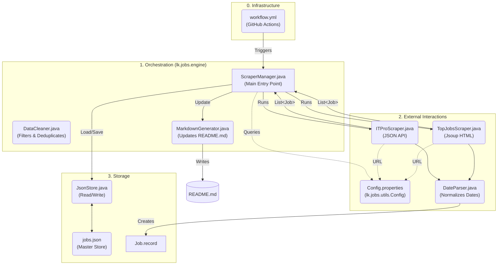

# 🇱🇰 Sri Lanka Software Engineering Jobs | 2026 Tracker [](https://t.me/SL_Software_Jobs)
Looking for software engineering jobs in Sri Lanka? This tracker updates daily with intern, junior, and senior IT roles across Colombo and beyond
Automated Software Engineering Job Tracker for Sri Lanka. Scrapes and categorizes Intern, Associate, and SE roles daily using Java (Jsoup) and GitHub Actions.

> [!TIP]
> **Help keep this project alive!** If this tool helped you find a lead today, please [**Star ⭐ the repo**](https://github.com/Senadeera-NK/sri-lanka-software-jobs). It’s how I measure the impact on our dev community! 🇱🇰

> [!IMPORTANT]
> **Automatic Staleness Purge:** The engine automatically removes listings older than **14 days**, ensuring the feed stays relevant and high-signal.

## 📊 Current Job Openings
> 🟢 **Last Updated:** March 22,5:18 PM (Just now)  | **Total Jobs Found:** 121

### 🎓 Internships & Trainees  (22)

| Title | Company | Level  | Posted | Source |
| :--- | :--- | :--- | :--- | :--- |
| [Software Engineer Intern (Remote)](https://itpro.lk/job/13326/software-engineer-intern-remote-at-d-help-hub-private-limited/) | D HELP HUB Private Limited | Intern | Yesterday | ITPro.lk |
| [Intern Software Developer (Full Stack)](https://itpro.lk/job/13321/intern-software-developer-full-stack-at-inbizsys-private-limited/) | InBizSys (Private) Limited | Intern | 2&nbsp;days&nbsp;ago | ITPro.lk |
| [Software Engineer Internship (Remote)](https://www.topjobs.lk/employer/JobAdvertismentServlet?ac=DEFZZZ&jc=0001481385&ec=DEFZZZ) | Xaventra (Pvt) Ltd | Intern | 3&nbsp;days&nbsp;ago | TopJobs.lk |
| [Quality Assurance internships](https://itpro.lk/job/13311/quality-assurance-internships-at-itx-digital-services-pvt-ltd/) | ITX Digital Services (Pvt) Ltd | Intern | 4&nbsp;days&nbsp;ago | ITPro.lk |
| [WordPress Developer Intern](https://itpro.lk/job/13307/wordpress-developer-intern-at-innenta-solutions/) | Innenta Solutions | Intern | 4&nbsp;days&nbsp;ago | ITPro.lk |
| [Software Engineer - Intern](https://itpro.lk/job/13302/software-engineer-intern-at-ts-technologies-pvt-ltd/) | TS Technologies (Pvt) Ltd | Intern | 4&nbsp;days&nbsp;ago | ITPro.lk |
| [Intern - Data Science & Analytics (1)](https://www.topjobs.lk/employer/JobAdvertismentServlet?ac=0000000094&jc=0001481333&ec=0000000111) | MAS Holdings | Intern | 4&nbsp;days&nbsp;ago | TopJobs.lk |
| [Frontend Developer Intern](https://itpro.lk/job/13299/frontend-developer-intern-at-ranga-technologies-pinegen-ai/) | Ranga Technologies (PineGen AI) | Intern | 4&nbsp;days&nbsp;ago | ITPro.lk |
| [Full Stack Software Engineering Intern](https://itpro.lk/job/13288/full-stack-software-engineering-intern-at-zeawis-ltd/) | Zeawis Ltd | Intern | 6&nbsp;days&nbsp;ago | ITPro.lk |
| [Senior Java Full - Stack Developer (Financial Internet Banking)](https://www.topjobs.lk/employer/JobAdvertismentServlet?ac=DEFZZZ&jc=0001480203&ec=DEFZZZ) | Fortunaglobal (Pvt) Limited | Intern | 6&nbsp;days&nbsp;ago | TopJobs.lk |
| [QA Intern – Software Testing](https://itpro.lk/job/13285/qa-intern-software-testing-at-seedbyte/) | Seedbyte | Intern | 6&nbsp;days&nbsp;ago | ITPro.lk |
| [Intern Software Engineer](https://itpro.lk/job/13284/intern-software-engineer-at-codery/) | Codery | Intern | 7&nbsp;days&nbsp;ago | ITPro.lk |
| [Full Stack Developer Intern](https://itpro.lk/job/13274/full-stack-developer-intern-at-ranga-technologies-pinegen-ai/) | Ranga Technologies (PineGen AI) | Intern | 9&nbsp;days&nbsp;ago | ITPro.lk |
| [Intern - Cloud Solutions and Service (1)](https://www.topjobs.lk/employer/JobAdvertismentServlet?ac=0000000049&jc=0001466318&ec=0000000313) | John Keells IT | Intern | 10&nbsp;days&nbsp;ago | TopJobs.lk |
| [Software Engineer Intern](https://itpro.lk/job/13253/software-engineer-intern-at-rispit/) | Rispit | Intern | 11&nbsp;days&nbsp;ago | ITPro.lk |
| [Intern - Business Analyst, DevOps and Software Engineer](https://www.topjobs.lk/employer/JobAdvertismentServlet?ac=DEFZZZ&jc=0001478279&ec=DEFZZZ) | Future CX Lanka (Pvt) Ltd | Intern | 11&nbsp;days&nbsp;ago | TopJobs.lk |
| [Software Quality Assurance - Intern](https://itpro.lk/job/13246/software-quality-assurance-intern-at-qdesk-ai-pvt-ltd/) | Qdesk AI Pvt Ltd | Intern | 12&nbsp;days&nbsp;ago | ITPro.lk |
| [Internship Full Stack Developer Trainee](https://itpro.lk/job/13245/internship-full-stack-developer-trainee-at-itx-digital-services-pvt-ltd/) | ITX Digital Services (Pvt) Ltd | Intern | 13&nbsp;days&nbsp;ago | ITPro.lk |
| [Web Development Intern](https://itpro.lk/job/13226/web-development-intern-at-koncepthive/) | Koncepthive | Intern | 13&nbsp;days&nbsp;ago | ITPro.lk |
| [Software Engineer \| Fullstack & Mobile Development Intern](https://www.topjobs.lk/employer/JobAdvertismentServlet?ac=DEFZZZ&jc=0001477275&ec=DEFZZZ) | FinzLabs | Intern | 13&nbsp;days&nbsp;ago | TopJobs.lk |
| [Software Engineer Intern](https://itpro.lk/job/13215/software-engineer-intern-at-perpova-developers/) | Perpova Developers | Intern | 14&nbsp;days&nbsp;ago | ITPro.lk |
| [QA Engineer Intern](https://itpro.lk/job/13214/qa-engineer-intern-at-perpova-developers/) | Perpova Developers | Intern | 14&nbsp;days&nbsp;ago | ITPro.lk |

---

### 💻 Associate & Junior/SE Roles  (62)

| Title | Company | Level  | Posted | Source |
| :--- | :--- | :--- | :--- | :--- |
| [Trainee Software Engineer \| Associate Software Engineer \| ...](https://www.topjobs.lk/employer/JobAdvertismentServlet?ac=DEFZZZ&jc=0001477410&ec=DEFZZZ) | Afisol (Pvt) Ltd | Associate | 17&nbsp;hours&nbsp;ago | TopJobs.lk |
| [Information Security Officer (ISMS)](https://www.topjobs.lk/employer/JobAdvertismentServlet?ac=DEFZZZ&jc=0001479053&ec=DEFZZZ) | Treinetic (Pvt) Ltd | Junior/SE | 17&nbsp;hours&nbsp;ago | TopJobs.lk |
| [.NET MAUI Developer](https://itpro.lk/job/13335/net-maui-developer-at-katvaas-pvt-ltd/) | Katvaas Pvt Ltd | Junior/SE | Yesterday | ITPro.lk |
| [Software Engineer - .NET](https://itpro.lk/job/13322/software-engineer-net-at-vitalhub-innovations-lab/) | VitalHub Innovations Lab | Junior/SE | 2&nbsp;days&nbsp;ago | ITPro.lk |
| [Software Engineer (Male)](https://www.topjobs.lk/employer/JobAdvertismentServlet?ac=0000000223&jc=0001481926&ec=0000000266) | Data Management Systems (Pvt) Ltd | Junior/SE | 2&nbsp;days&nbsp;ago | TopJobs.lk |
| [Software Engineer](https://www.topjobs.lk/employer/JobAdvertismentServlet?ac=DEFZZZ&jc=0001481966&ec=DEFZZZ) | SPOS (Pvt) Ltd | Junior/SE | 2&nbsp;days&nbsp;ago | TopJobs.lk |
| [UI\|UX Front End Developer](https://www.topjobs.lk/employer/JobAdvertismentServlet?ac=DEFZZZ&jc=0001482366&ec=DEFZZZ) | Seren IT Services | Junior/SE | 2&nbsp;days&nbsp;ago | TopJobs.lk |
| [Founding Engineer / Software Developer](https://www.topjobs.lk/employer/JobAdvertismentServlet?ac=DEFZZZ&jc=0001482268&ec=DEFZZZ) | SULECO (Pvt) Ltd | Junior/SE | 2&nbsp;days&nbsp;ago | TopJobs.lk |
| [Full Stack Software Developer](https://www.topjobs.lk/employer/JobAdvertismentServlet?ac=DEFZZZ&jc=0001482113&ec=DEFZZZ) | Arpico Energry | Junior/SE | 2&nbsp;days&nbsp;ago | TopJobs.lk |
| [Mobile Developer (Flutter)](https://www.topjobs.lk/employer/JobAdvertismentServlet?ac=DEFZZZ&jc=0001481528&ec=DEFZZZ) | KAST | Junior/SE | 3&nbsp;days&nbsp;ago | TopJobs.lk |
| [Associate Technical Lead - Fullstack](https://www.topjobs.lk/employer/JobAdvertismentServlet?ac=DEFZZZ&jc=0001481521&ec=DEFZZZ) | KAST | Associate | 3&nbsp;days&nbsp;ago | TopJobs.lk |
| [DevOps Engineer](https://www.topjobs.lk/employer/JobAdvertismentServlet?ac=DEFZZZ&jc=0001481452&ec=DEFZZZ) | S A S Creative (Pvt) Ltd | Junior/SE | 3&nbsp;days&nbsp;ago | TopJobs.lk |
| [Frontend Engineer (React + TypeScript) - Remote](https://www.topjobs.lk/employer/JobAdvertismentServlet?ac=DEFZZZ&jc=0001481269&ec=DEFZZZ) | SimpliConnect (Pvt) Ltd | Junior/SE | 3&nbsp;days&nbsp;ago | TopJobs.lk |
| [Quality Assurance Engineer](https://www.topjobs.lk/employer/JobAdvertismentServlet?ac=DEFZZZ&jc=0001481734&ec=DEFZZZ) | Efficient Frontiers International | Junior/SE | 3&nbsp;days&nbsp;ago | TopJobs.lk |
| [RPA Developer (Straddle Shift)](https://www.topjobs.lk/employer/JobAdvertismentServlet?ac=DEFZZZ&jc=0001481716&ec=DEFZZZ) | Legacy Health (Pvt) Ltd | Junior/SE | 3&nbsp;days&nbsp;ago | TopJobs.lk |
| [Junior Full-Stack Developer (Bubble.io, Python, AWS, AI)](https://www.topjobs.lk/employer/JobAdvertismentServlet?ac=DEFZZZ&jc=0001481534&ec=DEFZZZ) | Efficient Frontiers International | Junior/SE | 3&nbsp;days&nbsp;ago | TopJobs.lk |
| [Software Engineers](https://www.topjobs.lk/employer/JobAdvertismentServlet?ac=DEFZZZ&jc=0001476158&ec=DEFZZZ) | Venturecorp (Pvt) Ltd | Junior/SE | 3&nbsp;days&nbsp;ago | TopJobs.lk |
| [Automation Engineer -  Cybersecurity (1)](https://www.topjobs.lk/employer/JobAdvertismentServlet?ac=0000000403&jc=0001481041&ec=0000000531) | Mobizz Elite (Pvt) Ltd | Junior/SE | 4&nbsp;days&nbsp;ago | TopJobs.lk |
| [AI Specialist For Workflow Automation (1)](https://www.topjobs.lk/employer/JobAdvertismentServlet?ac=0000000146&jc=0001481330&ec=0000000178) | Nawaloka Hospitals PLC | Junior/SE | 4&nbsp;days&nbsp;ago | TopJobs.lk |
| [.NET 8 Software Engineers](https://www.topjobs.lk/employer/JobAdvertismentServlet?ac=DEFZZZ&jc=0001481195&ec=DEFZZZ) | X-ONT Software (Pvt) Ltd | Junior/SE | 4&nbsp;days&nbsp;ago | TopJobs.lk |
| [Executive - Web Developing](https://www.topjobs.lk/employer/JobAdvertismentServlet?ac=DEFZZZ&jc=0001481185&ec=DEFZZZ) | Company Name Withheld | Junior/SE | 4&nbsp;days&nbsp;ago | TopJobs.lk |
| [Frontend Engineer (React + TryperScript)](https://www.topjobs.lk/employer/JobAdvertismentServlet?ac=DEFZZZ&jc=0001481269&ec=DEFZZZ) | SimpliConnect (Pvt) Ltd | Junior/SE | 4&nbsp;days&nbsp;ago | TopJobs.lk |
| [Full Stack Developer (Hybrid)](https://www.topjobs.lk/employer/JobAdvertismentServlet?ac=DEFZZZ&jc=0001480504&ec=DEFZZZ) | M Data Zone (Pvt) Ltd | Junior/SE | 5&nbsp;days&nbsp;ago | TopJobs.lk |
| [Software Quality Assurance Engineer (1)](https://www.topjobs.lk/employer/JobAdvertismentServlet?ac=0000000492&jc=0001480925&ec=0000000661) | DirectFN | Junior/SE | 5&nbsp;days&nbsp;ago | TopJobs.lk |
| [Software Engineer - Full Stack (1)](https://www.topjobs.lk/employer/JobAdvertismentServlet?ac=0000000492&jc=0001480909&ec=0000000661) | DirectFN | Junior/SE | 5&nbsp;days&nbsp;ago | TopJobs.lk |
| [Front End Associate - Angular](https://www.topjobs.lk/employer/JobAdvertismentServlet?ac=DEFZZZ&jc=0001480814&ec=DEFZZZ) | Seven Senki Holdings (Pvt) Ltd | Associate | 5&nbsp;days&nbsp;ago | TopJobs.lk |
| [.NET Developer](https://itpro.lk/job/13291/net-developer-at-asn-it/) | ASN IT | Junior/SE | 6&nbsp;days&nbsp;ago | ITPro.lk |
| [.NET Developer](https://itpro.lk/job/13291/net-developer-at-asn-it-inc/) | ASN IT Inc | Junior/SE | 6&nbsp;days&nbsp;ago | ITPro.lk |
| [Quality Assurance Engineer](https://itpro.lk/job/13290/quality-assurance-engineer-at-i4t-labs/) | i4T Labs | Junior/SE | 6&nbsp;days&nbsp;ago | ITPro.lk |
| [QA Engineer](https://www.topjobs.lk/employer/JobAdvertismentServlet?ac=DEFZZZ&jc=0001477811&ec=DEFZZZ) | InEight SL (Pvt) Ltd | Junior/SE | 6&nbsp;days&nbsp;ago | TopJobs.lk |
| [Net Developer](https://www.topjobs.lk/employer/JobAdvertismentServlet?ac=DEFZZZ&jc=0001480164&ec=DEFZZZ) | Datamation Systems (Pvt) Ltd | Junior/SE | 6&nbsp;days&nbsp;ago | TopJobs.lk |
| [DevOps Engineer (1)](https://www.topjobs.lk/employer/JobAdvertismentServlet?ac=0000000403&jc=0001480027&ec=0000000531) | Mobizz Elite (Pvt) Ltd | Junior/SE | 6&nbsp;days&nbsp;ago | TopJobs.lk |
| [Web Application Quality Assurance Executive](https://www.topjobs.lk/employer/JobAdvertismentServlet?ac=DEFZZZ&jc=0001480399&ec=DEFZZZ) | S A S Creative (Pvt) Ltd | Junior/SE | 6&nbsp;days&nbsp;ago | TopJobs.lk |
| [QA Automation Engineer (6 Month Contract)](https://www.topjobs.lk/employer/JobAdvertismentServlet?ac=DEFZZZ&jc=0001480326&ec=DEFZZZ) | Company Name Withheld | Junior/SE | 6&nbsp;days&nbsp;ago | TopJobs.lk |
| [Software Engineering Vacancies](https://www.topjobs.lk/employer/JobAdvertismentServlet?ac=DEFZZZ&jc=0001479329&ec=DEFZZZ) | Manpower Sri Lanka | Junior/SE | 9&nbsp;days&nbsp;ago | TopJobs.lk |
| [Backend Developer / Engineer -  Golang (1)](https://www.topjobs.lk/employer/JobAdvertismentServlet?ac=0000000221&jc=0001479675&ec=0000000264) | Browns Group Of Companies | Junior/SE | 9&nbsp;days&nbsp;ago | TopJobs.lk |
| [DevOps Engineer](https://www.topjobs.lk/employer/JobAdvertismentServlet?ac=DEFZZZ&jc=0001479814&ec=DEFZZZ) | eBEYONDS | Junior/SE | 9&nbsp;days&nbsp;ago | TopJobs.lk |
| [Web Developer](https://www.topjobs.lk/employer/JobAdvertismentServlet?ac=DEFZZZ&jc=0001479778&ec=DEFZZZ) | The Permalinks Limited | Junior/SE | 9&nbsp;days&nbsp;ago | TopJobs.lk |
| [Software Development Engineer - Odoo](https://www.topjobs.lk/employer/JobAdvertismentServlet?ac=DEFZZZ&jc=0001479764&ec=DEFZZZ) | Netex Technologies (Pvt) Ltd | Junior/SE | 9&nbsp;days&nbsp;ago | TopJobs.lk |
| [Full Stack Developer (React.js & Supabase)](https://itpro.lk/job/13271/full-stack-developer-reactjs-supabase-at-kd-marketing-group/) | KD Marketing Group | Junior/SE | 9&nbsp;days&nbsp;ago | ITPro.lk |
| [Backend Developer (Node.js / NestJS)](https://itpro.lk/job/13268/backend-developer-nodejs-nestjs-at-icellyte/) | Icellyte | Junior/SE | 10&nbsp;days&nbsp;ago | ITPro.lk |
| [Quality Assurance Engineer](https://itpro.lk/job/13266/quality-assurance-engineer-at-digitalbee-labs/) | DigitalBee Labs | Junior/SE | 10&nbsp;days&nbsp;ago | ITPro.lk |
| [Trainee QA Engineer](https://itpro.lk/job/13265/trainee-qa-engineer-at-digitalbee-labs/) | DigitalBee Labs | Associate | 10&nbsp;days&nbsp;ago | ITPro.lk |
| [Trainee - Software Engineering](https://www.topjobs.lk/employer/JobAdvertismentServlet?ac=DEFZZZ&jc=0001478996&ec=DEFZZZ) | iPhonik (Pvt) Ltd | Associate | 10&nbsp;days&nbsp;ago | TopJobs.lk |
| [Azure/ Dynamics 365 (Business Central Administrator) (1)](https://www.topjobs.lk/employer/JobAdvertismentServlet?ac=0000000221&jc=0001478995&ec=0000000264) | Browns Group Of Companies | Junior/SE | 10&nbsp;days&nbsp;ago | TopJobs.lk |
| [QA Engineer](https://www.topjobs.lk/employer/JobAdvertismentServlet?ac=0000000484&jc=0001473839&ec=0000000651) | Epic Lanka (Pvt) Ltd | Junior/SE | 10&nbsp;days&nbsp;ago | TopJobs.lk |
| [Junior Web Developer](https://www.topjobs.lk/employer/JobAdvertismentServlet?ac=DEFZZZ&jc=0001475446&ec=DEFZZZ) | Greenpeace South Asia | Junior/SE | 11&nbsp;days&nbsp;ago | TopJobs.lk |
| [Associate Platform Engineer (AI Assisted Development)](https://www.topjobs.lk/employer/JobAdvertismentServlet?ac=DEFZZZ&jc=0001478358&ec=DEFZZZ) | Lyceum Global Holdings (Pvt) Ltd | Associate | 11&nbsp;days&nbsp;ago | TopJobs.lk |
| [Software Engineer - iOS Platform](https://www.topjobs.lk/employer/JobAdvertismentServlet?ac=DEFZZZ&jc=0001478660&ec=DEFZZZ) | Ideahub (Pvt) Ltd | Junior/SE | 11&nbsp;days&nbsp;ago | TopJobs.lk |
| [DevOps Engineer](https://www.topjobs.lk/employer/JobAdvertismentServlet?ac=DEFZZZ&jc=0001478655&ec=DEFZZZ) | Ideahub (Pvt) Ltd | Junior/SE | 11&nbsp;days&nbsp;ago | TopJobs.lk |
| [Associate Software Engineer (Colombo)](https://www.topjobs.lk/employer/JobAdvertismentServlet?ac=DEFZZZ&jc=0001478646&ec=DEFZZZ) | Nawaloka College of Higher Studies | Associate | 11&nbsp;days&nbsp;ago | TopJobs.lk |
| [Data Scientist (Architect) (1)](https://www.topjobs.lk/employer/JobAdvertismentServlet?ac=0000000486&jc=0001478461&ec=0000000654) | George Bernard (Pvt) Ltd | Junior/SE | 11&nbsp;days&nbsp;ago | TopJobs.lk |
| [Python Architect (1)](https://www.topjobs.lk/employer/JobAdvertismentServlet?ac=0000000486&jc=0001478455&ec=0000000654) | George Bernard (Pvt) Ltd | Junior/SE | 11&nbsp;days&nbsp;ago | TopJobs.lk |
| [Cyber Security Analyst](https://www.topjobs.lk/employer/JobAdvertismentServlet?ac=DEFZZZ&jc=0001478138&ec=DEFZZZ) | UB Finance PLC | Junior/SE | 12&nbsp;days&nbsp;ago | TopJobs.lk |
| [Management Coordinator Software](https://www.topjobs.lk/employer/JobAdvertismentServlet?ac=DEFZZZ&jc=0001477880&ec=DEFZZZ) | Vital One (Pvt) Ltd | Junior/SE | 12&nbsp;days&nbsp;ago | TopJobs.lk |
| [Junior Power BI Developer (1)](https://www.topjobs.lk/employer/JobAdvertismentServlet?ac=0000000026&jc=0001472128&ec=0000000026) | McLarens Holdings Limited | Junior/SE | 12&nbsp;days&nbsp;ago | TopJobs.lk |
| [Associate Web Developer](https://itpro.lk/job/13241/associate-web-developer-at-ebeyonds-pvt-ltd/) | Ebeyonds (pvt) Ltd | Associate | 13&nbsp;days&nbsp;ago | ITPro.lk |
| [Associate Quality Assurance Engineers](https://itpro.lk/job/13233/associate-quality-assurance-engineers-at-ebeyonds-pvt-ltd/) | Ebeyonds (pvt) Ltd | Associate | 13&nbsp;days&nbsp;ago | ITPro.lk |
| [Mid-Level Backend Developer (Python)](https://www.topjobs.lk/employer/JobAdvertismentServlet?ac=DEFZZZ&jc=0001477264&ec=DEFZZZ) | Seren IT Services | Junior/SE | 13&nbsp;days&nbsp;ago | TopJobs.lk |
| [DevOps Engineer](https://www.topjobs.lk/employer/JobAdvertismentServlet?ac=DEFZZZ&jc=0001477256&ec=DEFZZZ) | Seren IT Services | Junior/SE | 13&nbsp;days&nbsp;ago | TopJobs.lk |
| [Quality Engineer](https://itpro.lk/job/13224/quality-engineer-at-predictiv-ai/) | Predictiv AI | Junior/SE | 13&nbsp;days&nbsp;ago | ITPro.lk |
| [Software Engineer (Angular / C# .NET Core)](https://itpro.lk/job/12777/software-engineer-angular-c-net-core-at-enhanzer/) | Enhanzer | Junior/SE | 14&nbsp;days&nbsp;ago | ITPro.lk |

---

### 🚀 Senior & Lead Roles  (37)

| Title | Company | Level  | Posted | Source |
| :--- | :--- | :--- | :--- | :--- |
| [Senior QA Engineer (1)](https://www.topjobs.lk/employer/JobAdvertismentServlet?ac=0000000421&jc=0001481951&ec=0000000555) | Sumathi Group | Senior | 2&nbsp;days&nbsp;ago | TopJobs.lk |
| [Senior Full Stack Engineer (Laravel) - Fully Remote](https://www.topjobs.lk/employer/JobAdvertismentServlet?ac=DEFZZZ&jc=0001481920&ec=DEFZZZ) | Tour Beez | Senior | 2&nbsp;days&nbsp;ago | TopJobs.lk |
| [Senior Software Engineer Full Stack (1)](https://www.topjobs.lk/employer/JobAdvertismentServlet?ac=0000000492&jc=0001482180&ec=0000000661) | DirectFN | Senior | 2&nbsp;days&nbsp;ago | TopJobs.lk |
| [Senior Software Engineer JAVA (4)](https://www.topjobs.lk/employer/JobAdvertismentServlet?ac=0000000492&jc=0001482182&ec=0000000661) | DirectFN | Senior | 2&nbsp;days&nbsp;ago | TopJobs.lk |
| [Senior Software Engineer - Spring Boot (1)](https://www.topjobs.lk/employer/JobAdvertismentServlet?ac=0000000492&jc=0001482365&ec=0000000661) | DirectFN | Senior | 2&nbsp;days&nbsp;ago | TopJobs.lk |
| [Senior Mobile Developer - Flutter](https://www.topjobs.lk/employer/JobAdvertismentServlet?ac=DEFZZZ&jc=0001481524&ec=DEFZZZ) | KAST | Senior | 3&nbsp;days&nbsp;ago | TopJobs.lk |
| [Senior Software Engineer - Java](https://www.topjobs.lk/employer/JobAdvertismentServlet?ac=DEFZZZ&jc=0001481515&ec=DEFZZZ) | Hitachi Digital Payment Solutions Limited | Senior | 3&nbsp;days&nbsp;ago | TopJobs.lk |
| [Full-Stack Tech Lead (Bubble.io, Python, AWS, AI/ML Experience a Plus)](https://www.topjobs.lk/employer/JobAdvertismentServlet?ac=DEFZZZ&jc=0001481537&ec=DEFZZZ) | Efficient Frontiers International | Senior | 3&nbsp;days&nbsp;ago | TopJobs.lk |
| [Senior Quality Assurance Engineer](https://itpro.lk/job/13308/senior-quality-assurance-engineer-at-bistec-global/) | BISTEC Global | Senior | 4&nbsp;days&nbsp;ago | ITPro.lk |
| [Senior Developer](https://itpro.lk/job/13305/senior-developer-at-digit-web-lanka-pvt-ltd/) | Digit Web Lanka (Pvt) Ltd | Senior | 4&nbsp;days&nbsp;ago | ITPro.lk |
| [Senior Software Engineer](https://www.topjobs.lk/employer/JobAdvertismentServlet?ac=DEFZZZ&jc=0001481005&ec=DEFZZZ) | Webxpay (Pvt) Ltd | Senior | 4&nbsp;days&nbsp;ago | TopJobs.lk |
| [Senior QA Engineer](https://www.topjobs.lk/employer/JobAdvertismentServlet?ac=DEFZZZ&jc=0001481243&ec=DEFZZZ) | Synergen Health (Pvt) Ltd | Senior | 4&nbsp;days&nbsp;ago | TopJobs.lk |
| [Senior SQL Developer (1)](https://www.topjobs.lk/employer/JobAdvertismentServlet?ac=0000000271&jc=0001421034&ec=0000000350) | CMS (Pvt) Ltd | Senior | 5&nbsp;days&nbsp;ago | TopJobs.lk |
| [Senior Front end Developer (1)](https://www.topjobs.lk/employer/JobAdvertismentServlet?ac=0000000492&jc=0001480722&ec=0000000661) | DirectFN | Senior | 5&nbsp;days&nbsp;ago | TopJobs.lk |
| [Senior Database Administrator (1)](https://www.topjobs.lk/employer/JobAdvertismentServlet?ac=0000000492&jc=0001480915&ec=0000000661) | DirectFN | Senior | 5&nbsp;days&nbsp;ago | TopJobs.lk |
| [Senior Full Stack Developer](https://www.topjobs.lk/employer/JobAdvertismentServlet?ac=DEFZZZ&jc=0001480905&ec=DEFZZZ) | Edusight | Senior | 5&nbsp;days&nbsp;ago | TopJobs.lk |
| [QA Lead - Automation (1)](https://www.topjobs.lk/employer/JobAdvertismentServlet?ac=0000000492&jc=0001480723&ec=0000000661) | DirectFN | Senior | 5&nbsp;days&nbsp;ago | TopJobs.lk |
| [Senior Software Quality Engineer (Test Automation)](https://itpro.lk/job/13293/senior-software-quality-engineer-test-automation-at-vitalhub-innovations-lab/) | VitalHub Innovations Lab | Senior | 6&nbsp;days&nbsp;ago | ITPro.lk |
| [Senior Engineer - Accounting Software](https://www.topjobs.lk/employer/JobAdvertismentServlet?ac=DEFZZZ&jc=0001480158&ec=DEFZZZ) | Senska (Private) Limited | Senior | 6&nbsp;days&nbsp;ago | TopJobs.lk |
| [Technical Lead (Python) (1)](https://www.topjobs.lk/employer/JobAdvertismentServlet?ac=0000000403&jc=0001480472&ec=0000000531) | Mobizz Elite (Pvt) Ltd | Senior | 6&nbsp;days&nbsp;ago | TopJobs.lk |
| [Senior Java Backend Developer (Remote - Sri Lanka)](https://www.topjobs.lk/employer/JobAdvertismentServlet?ac=DEFZZZ&jc=0001480261&ec=DEFZZZ) | Cloofd Solutions Inc | Senior | 6&nbsp;days&nbsp;ago | TopJobs.lk |
| [Senior Front - End Developer (React)](https://www.topjobs.lk/employer/JobAdvertismentServlet?ac=DEFZZZ&jc=0001480196&ec=DEFZZZ) | Fortunaglobal (Pvt) Limited | Senior | 6&nbsp;days&nbsp;ago | TopJobs.lk |
| [Senior Software Engineer - Full Stack - JavaScript](https://itpro.lk/job/13278/senior-software-engineer-full-stack-javascript-at-/) |  | Senior | 9&nbsp;days&nbsp;ago | ITPro.lk |
| [Senior Software Engineer - Agentic AI](https://itpro.lk/job/13277/senior-software-engineer-agentic-ai-at-/) |  | Senior | 9&nbsp;days&nbsp;ago | ITPro.lk |
| [Senior Software Engineer - .NET](https://itpro.lk/job/13276/senior-software-engineer-net-at-/) |  | Senior | 9&nbsp;days&nbsp;ago | ITPro.lk |
| [Senior Software Engineer - Golang](https://itpro.lk/job/13275/senior-software-engineer-golang-at-/) |  | Senior | 9&nbsp;days&nbsp;ago | ITPro.lk |
| [Senior Software Engineer \| Software Engineer.](https://www.topjobs.lk/employer/JobAdvertismentServlet?ac=DEFZZZ&jc=0001479807&ec=DEFZZZ) | PacificKode (Pvt) Ltd | Senior | 9&nbsp;days&nbsp;ago | TopJobs.lk |
| [Software Engineer / Senior / Lead  - Data Migration & Integration](https://itpro.lk/job/13259/software-engineer-senior-lead-data-migration-integration-at-jfs-holdings/) | JFS Holdings | Senior | 11&nbsp;days&nbsp;ago | ITPro.lk |
| [Senior Software Engineer - PHP](https://itpro.lk/job/13258/senior-software-engineer-php-at-vitalhub-innovations-lab/) | VitalHub Innovations Lab | Senior | 11&nbsp;days&nbsp;ago | ITPro.lk |
| [Lead / Senior / Software Engineer (1)](https://www.topjobs.lk/employer/JobAdvertismentServlet?ac=0000000375&jc=0001478356&ec=0000000492) | Jobfactory | Senior | 11&nbsp;days&nbsp;ago | TopJobs.lk |
| [Software Engineer / Senior Software Engineer - Data Migratio...](https://www.topjobs.lk/employer/JobAdvertismentServlet?ac=0000000375&jc=0001478604&ec=0000000492) | Jobfactory | Senior | 11&nbsp;days&nbsp;ago | TopJobs.lk |
| [Senior DevOPs Engineer (1)](https://www.topjobs.lk/employer/JobAdvertismentServlet?ac=0000000375&jc=0001478614&ec=0000000492) | Jobfactory | Senior | 11&nbsp;days&nbsp;ago | TopJobs.lk |
| [Lead DevOps Enginineer (1)](https://www.topjobs.lk/employer/JobAdvertismentServlet?ac=0000000375&jc=0001478615&ec=0000000492) | Jobfactory | Senior | 11&nbsp;days&nbsp;ago | TopJobs.lk |
| [Senior/lead DevOps Engineer (Contract) (1)](https://www.topjobs.lk/employer/JobAdvertismentServlet?ac=0000000375&jc=0001477961&ec=0000000492) | Jobfactory | Senior | 12&nbsp;days&nbsp;ago | TopJobs.lk |
| [Laravel Tech Lead / Laravel Architecture](https://www.topjobs.lk/employer/JobAdvertismentServlet?ac=DEFZZZ&jc=0001478006&ec=DEFZZZ) | Company Name Withheld | Senior | 12&nbsp;days&nbsp;ago | TopJobs.lk |
| [Senior QA Engineer (Manual & Automation)](https://itpro.lk/job/13221/senior-qa-engineer-manual-automation-at-orysys/) | Orysys | Senior | 13&nbsp;days&nbsp;ago | ITPro.lk |
| [Senior Software Engineer](https://itpro.lk/job/13216/senior-software-engineer-at-bistec-global/) | BISTEC Global | Senior | 14&nbsp;days&nbsp;ago | ITPro.lk |

---


## 🛠️ How it Works
1. **Engine:** A Java 21 console application using **Jsoup**.
2. **Sources:** Currently scraping `ITPro.lk` and  `TopJobs`. Support for and `Rooster.jobs` is under development (Contributors welcome!)
3. **Automation:** Runs every 12 hours via **GitHub Actions**.
4. **Storage:** Updates this `README.md` and a `jobs.json` file automatically.

<details>
<summary><b>📐 View High-Level Architecture Diagram</b></summary>
    


</details>

<details>
<summary><b>📂 View Project Structure</b></summary>

```text
src/main/java/lk/jobs/
├── engine/           # Logic for sorting, cleaning, and README updates
├── model/            # Data models (Job Record)
├── scrapers/         # Individual site scrapers
└── utils/            # JSON and Date parsing utilities
```
</details>

## 🚀 Usage
If you want to run the scraper locally:
1. Clone the repo.
2. Ensure you have **JDK 21** and **Maven** installed.
3. Run: mvn clean compile exec:java -Dexec.mainClass="lk.jobs.engine.ScraperManager"

## 🤝 Contributing
Contributions are what make the open-source community such an amazing place to learn, inspire, and create.
Any contributions you make are **greatly appreciated**.

* **Found a bug?** Open an [Issue](https://github.com/Senadeera-NK/sl-software-engineering-jobs/issues).
* **Want to add a new site?** Check out our [Contributing Guidelines](CONTRIBUTING.md) to see how to implement a new scraper.
* **Missing a job?** Feel free to submit a Pull Request to manually update the table!
