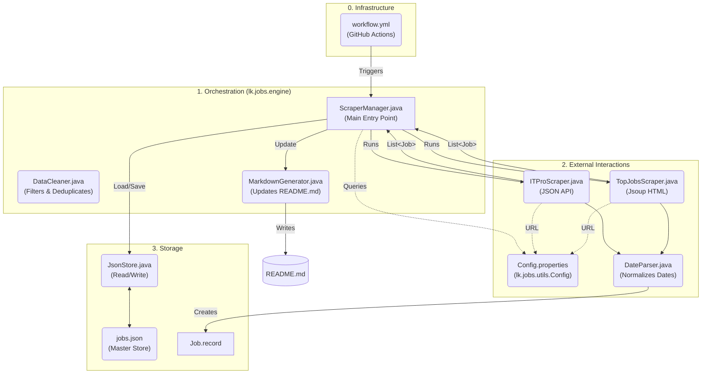

# 🇱🇰 Sri Lanka Software Engineering Jobs | 2026 Tracker [](https://github.com/Senadeera-NK/sri-lanka-software-jobs/stargazers)
🚀 Automated Software Engineering Job Tracker for Sri Lanka. Scrapes and categorizes Intern, Associate, and SE roles daily using Java (Jsoup) and GitHub Actions.

> [!TIP]
> **Help keep this project alive!** If this tool helped you find a lead today, please [**Star ⭐ the repo**](https://github.com/Senadeera-NK/sri-lanka-software-jobs). It’s how I measure the impact on our dev community! 🇱🇰

## 📊 Current Job Openings
> 🟢 **Last Updated:** March 9,7:14 PM (Just now)  | **Total Jobs Found:** 117

### 🎓 Internships & Trainees  (19)

| Title | Company | Level  | Posted | Source |
| :--- | :--- | :--- | :--- | :--- |
| [Web Development Intern](https://itpro.lk/job/13226/web-development-intern-at-koncepthive/) | Koncepthive | Intern | 6&nbsp;hours&nbsp;ago | ITPro.lk |
| [Software Engineer \| Fullstack & Mobile Development Intern](https://www.topjobs.lk/employer/JobAdvertismentServlet?ac=DEFZZZ&jc=0001477275&ec=DEFZZZ) | FinzLabs | Intern | 19&nbsp;hours&nbsp;ago | TopJobs.lk |
| [Intern AI Engineer](https://www.topjobs.lk/employer/JobAdvertismentServlet?ac=DEFZZZ&jc=0001477273&ec=DEFZZZ) | FinzLabs | Intern | 19&nbsp;hours&nbsp;ago | TopJobs.lk |
| [Software Engineer Intern](https://itpro.lk/job/13215/software-engineer-intern-at-perpova-developers/) | Perpova Developers | Intern | Yesterday | ITPro.lk |
| [QA Engineer Intern](https://itpro.lk/job/13214/qa-engineer-intern-at-perpova-developers/) | Perpova Developers | Intern | Yesterday | ITPro.lk |
| [DevOps Intern](https://itpro.lk/job/13213/devops-intern-at-perpova-developers/) | Perpova Developers | Intern | 2&nbsp;days&nbsp;ago | ITPro.lk |
| [Software Engineer Intern](https://itpro.lk/job/13211/software-engineer-intern-at-sisenco-digital/) | Sisenco Digital | Intern | 2&nbsp;days&nbsp;ago | ITPro.lk |
| [Software Engineering Interns](https://www.topjobs.lk/employer/JobAdvertismentServlet?ac=DEFZZZ&jc=0001476708&ec=DEFZZZ) | Avanka IT | Intern | 3&nbsp;days&nbsp;ago | TopJobs.lk |
| [Intern Software Engineer](https://itpro.lk/job/13199/intern-software-engineer-at-muve-mobility/) | Muve Mobility | Intern | 3&nbsp;days&nbsp;ago | ITPro.lk |
| [Intern - Software Development (Java) (1)](https://www.topjobs.lk/employer/JobAdvertismentServlet?ac=0000000049&jc=0001475460&ec=0000000313) | John Keells IT | Intern | 5&nbsp;days&nbsp;ago | TopJobs.lk |
| [Backend Developer Intern](https://itpro.lk/job/13181/backend-developer-intern-at-ranga-technologies-pinegen-ai/) | Ranga Technologies (PineGen AI) | Intern | 6&nbsp;days&nbsp;ago | ITPro.lk |
| [Intern Software Engineer (1)](https://www.topjobs.lk/employer/JobAdvertismentServlet?ac=0000000201&jc=0001474800&ec=0000000635) | DTech (Pvt) Ltd | Intern | 7&nbsp;days&nbsp;ago | TopJobs.lk |
| [Software Engineering Intern (Non-paid)](https://itpro.lk/job/13174/software-engineering-intern-nonpaid-at-panhinda-solutions/) | Panhinda Solutions | Intern | 8&nbsp;days&nbsp;ago | ITPro.lk |
| [Trainee Software Engineer / Intern](https://itpro.lk/job/13156/trainee-software-engineer-intern-at-digitalbee-labs/) | DigitalBee Labs | Intern | 10&nbsp;days&nbsp;ago | ITPro.lk |
| [Intern Software Engineer - Work From Home](https://www.topjobs.lk/employer/JobAdvertismentServlet?ac=DEFZZZ&jc=0001474595&ec=DEFZZZ) | Yumarone Labz Pvt Ltd | Intern | 10&nbsp;days&nbsp;ago | TopJobs.lk |
| [Front End Software Engineer Internship](https://www.topjobs.lk/employer/JobAdvertismentServlet?ac=DEFZZZ&jc=0001474429&ec=DEFZZZ) | Medcube USA | Intern | 10&nbsp;days&nbsp;ago | TopJobs.lk |
| [Back End Software Engineer Internship](https://www.topjobs.lk/employer/JobAdvertismentServlet?ac=DEFZZZ&jc=0001474423&ec=DEFZZZ) | Medcube USA | Intern | 10&nbsp;days&nbsp;ago | TopJobs.lk |
| [Software Quality Assurance - Intern](https://itpro.lk/job/13139/software-quality-assurance-intern-at-qdesk-ai-pvt-ltd/) | Qdesk AI Pvt Ltd | Intern | 12&nbsp;days&nbsp;ago | ITPro.lk |
| [Intern / Junior QA Engineer](https://itpro.lk/job/13118/intern-junior-qa-engineer-at-amerck/) | Amerck | Intern | 13&nbsp;days&nbsp;ago | ITPro.lk |

---

### 💻 Associate & Junior/SE Roles  (61)

| Title | Company | Level  | Posted | Source |
| :--- | :--- | :--- | :--- | :--- |
| [Associate Web Developer](https://itpro.lk/job/13241/associate-web-developer-at-ebeyonds-pvt-ltd/) | Ebeyonds (pvt) Ltd | Associate | 1&nbsp;hours&nbsp;ago | ITPro.lk |
| [Associate Quality Assurance Engineers](https://itpro.lk/job/13233/associate-quality-assurance-engineers-at-ebeyonds-pvt-ltd/) | Ebeyonds (pvt) Ltd | Associate | 5&nbsp;hours&nbsp;ago | ITPro.lk |
| [Quality Engineer](https://itpro.lk/job/13224/quality-engineer-at-predictiv-ai/) | Predictiv AI | Junior/SE | 7&nbsp;hours&nbsp;ago | ITPro.lk |
| [Web Content Assistant](https://itpro.lk/job/13220/web-content-assistant-at-ebeyonds-pvt-ltd/) | Ebeyonds (pvt) Ltd | Junior/SE | 8&nbsp;hours&nbsp;ago | ITPro.lk |
| [Technical Architect (Business Automation & Digital Transformation)](https://itpro.lk/job/13209/technical-architect-business-automation-digital-transformation-at-orysys/) | Orysys | Junior/SE | 16&nbsp;hours&nbsp;ago | ITPro.lk |
| [Software Engineers](https://www.topjobs.lk/employer/JobAdvertismentServlet?ac=DEFZZZ&jc=0001476158&ec=DEFZZZ) | Venturecorp (Pvt) Ltd | Junior/SE | 19&nbsp;hours&nbsp;ago | TopJobs.lk |
| [Junior Web Developer](https://www.topjobs.lk/employer/JobAdvertismentServlet?ac=DEFZZZ&jc=0001475446&ec=DEFZZZ) | Greenpeace South Asia | Junior/SE | 19&nbsp;hours&nbsp;ago | TopJobs.lk |
| [Mid-Level Backend Developer (Python)](https://www.topjobs.lk/employer/JobAdvertismentServlet?ac=DEFZZZ&jc=0001477264&ec=DEFZZZ) | Seren IT Services | Junior/SE | 19&nbsp;hours&nbsp;ago | TopJobs.lk |
| [DevOps Engineer](https://www.topjobs.lk/employer/JobAdvertismentServlet?ac=DEFZZZ&jc=0001477256&ec=DEFZZZ) | Seren IT Services | Junior/SE | 19&nbsp;hours&nbsp;ago | TopJobs.lk |
| [Trainee Software Engineer \| Associate Software Engineer \| ...](https://www.topjobs.lk/employer/JobAdvertismentServlet?ac=DEFZZZ&jc=0001477410&ec=DEFZZZ) | Afisol (Pvt) Ltd | Associate | 19&nbsp;hours&nbsp;ago | TopJobs.lk |
| [Software Engineer (Angular / C# .NET Core)](https://itpro.lk/job/12777/software-engineer-angular-c-net-core-at-enhanzer/) | Enhanzer | Junior/SE | Yesterday | ITPro.lk |
| [AUTOMATION SOLUTIONS DEVELOPER (1)](https://www.topjobs.lk/employer/JobAdvertismentServlet?ac=0000000023&jc=0001477195&ec=0000000023) | Maritime Placements (Pvt) Ltd | Junior/SE | 2&nbsp;days&nbsp;ago | TopJobs.lk |
| [WordPress Developer / Website Product Owner](https://itpro.lk/job/13207/wordpress-developer-website-product-owner-at-outerspace-digital/) | Outerspace Digital | Junior/SE | 3&nbsp;days&nbsp;ago | ITPro.lk |
| [Cloud Solutions Architect](https://itpro.lk/job/13205/cloud-solutions-architect-at-tech-pacific-solutions/) | Tech Pacific Solutions | Junior/SE | 3&nbsp;days&nbsp;ago | ITPro.lk |
| [Software Engineer (Male)](https://www.topjobs.lk/employer/JobAdvertismentServlet?ac=0000000223&jc=0001476652&ec=0000000266) | Data Management Systems (Pvt) Ltd | Junior/SE | 3&nbsp;days&nbsp;ago | TopJobs.lk |
| [Software Engineer (PHP)](https://www.topjobs.lk/employer/JobAdvertismentServlet?ac=DEFZZZ&jc=0001476640&ec=DEFZZZ) | Company Name Withheld | Junior/SE | 3&nbsp;days&nbsp;ago | TopJobs.lk |
| [Software Developer](https://www.topjobs.lk/employer/JobAdvertismentServlet?ac=DEFZZZ&jc=0001476636&ec=DEFZZZ) | Western Paper Industries (Pvt) Ltd | Junior/SE | 3&nbsp;days&nbsp;ago | TopJobs.lk |
| [Software Engineer](https://itpro.lk/job/13203/software-engineer-at-expergen/) | Expergen | Junior/SE | 3&nbsp;days&nbsp;ago | ITPro.lk |
| [DevOps Engineer](https://itpro.lk/job/12136/devops-engineer-at-rightmo-web-solution/) | Rightmo Web Solution | Junior/SE | 3&nbsp;days&nbsp;ago | ITPro.lk |
| [Quality Assurance Engineer](https://itpro.lk/job/12117/quality-assurance-engineer-at-rightmo-web-solution/) | Rightmo Web Solution | Junior/SE | 3&nbsp;days&nbsp;ago | ITPro.lk |
| [Associate Software Engineer](https://itpro.lk/job/13200/associate-software-engineer-at-muve-mobility/) | Muve Mobility | Associate | 3&nbsp;days&nbsp;ago | ITPro.lk |
| [Software Engineer (C#) - Application Development & Automated Testing](https://www.topjobs.lk/employer/JobAdvertismentServlet?ac=DEFZZZ&jc=0001476274&ec=DEFZZZ) | Seaport Group | Junior/SE | 4&nbsp;days&nbsp;ago | TopJobs.lk |
| [Full Stack Software Engineer](https://www.topjobs.lk/employer/JobAdvertismentServlet?ac=DEFZZZ&jc=0001476124&ec=DEFZZZ) | BotMedFusion | Junior/SE | 4&nbsp;days&nbsp;ago | TopJobs.lk |
| [Performance Focused Software Engineer](https://www.topjobs.lk/employer/JobAdvertismentServlet?ac=DEFZZZ&jc=0001476117&ec=DEFZZZ) | Company Name Withheld | Junior/SE | 4&nbsp;days&nbsp;ago | TopJobs.lk |
| [Assistant Manager - (AI & Data Engineering)](https://www.topjobs.lk/employer/JobAdvertismentServlet?ac=DEFZZZ&jc=0001476341&ec=DEFZZZ) | Dart Global Logistics (Pvt) Ltd | Junior/SE | 4&nbsp;days&nbsp;ago | TopJobs.lk |
| [AI Automation Engineer](https://www.topjobs.lk/employer/JobAdvertismentServlet?ac=DEFZZZ&jc=0001476183&ec=DEFZZZ) | Lyceum Global Holdings (Pvt) Ltd | Junior/SE | 4&nbsp;days&nbsp;ago | TopJobs.lk |
| [Full-Stack Engineer (React + NestJS)](https://itpro.lk/job/13192/fullstack-engineer-react-nestjs-at-mo-marketplace/) | MO Marketplace | Junior/SE | 5&nbsp;days&nbsp;ago | ITPro.lk |
| [Software Engineer (1)](https://www.topjobs.lk/employer/JobAdvertismentServlet?ac=0000000064&jc=0001475836&ec=0000000603) | Hirdaramani - H CONNECT (PVT) LIMITED | Junior/SE | 5&nbsp;days&nbsp;ago | TopJobs.lk |
| [RPA Developer (Straddle Shift)](https://www.topjobs.lk/employer/JobAdvertismentServlet?ac=DEFZZZ&jc=0001475389&ec=DEFZZZ) | Legacy Health (Pvt) Ltd | Junior/SE | 5&nbsp;days&nbsp;ago | TopJobs.lk |
| [Mid-Level Software Engineer](https://itpro.lk/job/13191/midlevel-software-engineer-at-artecx-solutions/) | ARTecX Solutions | Junior/SE | 5&nbsp;days&nbsp;ago | ITPro.lk |
| [Software QA Engineer](https://itpro.lk/job/13188/software-qa-engineer-at-serveme-pvt-ltd/) | ServeME Pvt Ltd | Junior/SE | 6&nbsp;days&nbsp;ago | ITPro.lk |
| [Software Engineer (1)](https://www.topjobs.lk/employer/JobAdvertismentServlet?ac=0000000146&jc=0001475303&ec=0000000178) | Nawaloka Hospitals PLC | Junior/SE | 6&nbsp;days&nbsp;ago | TopJobs.lk |
| [Software Developer (Engineering Automation)](https://www.topjobs.lk/employer/JobAdvertismentServlet?ac=DEFZZZ&jc=0001474883&ec=DEFZZZ) | Ark Draft | Junior/SE | 6&nbsp;days&nbsp;ago | TopJobs.lk |
| [Java Full-Stack Developer (6 Months' Contract) (1)](https://www.topjobs.lk/employer/JobAdvertismentServlet?ac=0000000371&jc=0001459920&ec=0000000486) | Goodhope Asia Holdings Ltd | Junior/SE | 6&nbsp;days&nbsp;ago | TopJobs.lk |
| [QA Engineer (Manual + Automation)](https://itpro.lk/job/13173/qa-engineer-manual-automation-at-pasovit-technologies-private-limited/) | Pasovit Technologies Private Limited | Junior/SE | 9&nbsp;days&nbsp;ago | ITPro.lk |
| [Junior Web Executive](https://itpro.lk/job/13168/junior-web-executive-at-olanka-travels/) | Olanka Travels | Junior/SE | 9&nbsp;days&nbsp;ago | ITPro.lk |
| [DevOps Engineer](https://www.topjobs.lk/employer/JobAdvertismentServlet?ac=DEFZZZ&jc=0001474427&ec=DEFZZZ) | Medcube USA | Junior/SE | 10&nbsp;days&nbsp;ago | TopJobs.lk |
| [Conversational AI Engineer](https://www.topjobs.lk/employer/JobAdvertismentServlet?ac=DEFZZZ&jc=0001474515&ec=DEFZZZ) | Smebizness Limited | Junior/SE | 10&nbsp;days&nbsp;ago | TopJobs.lk |
| [Automation & AI Systems Engineer](https://www.topjobs.lk/employer/JobAdvertismentServlet?ac=DEFZZZ&jc=0001473799&ec=DEFZZZ) | ServiceTeam Ltd | Junior/SE | 11&nbsp;days&nbsp;ago | TopJobs.lk |
| [Quality Assurance Trainee (Web Development & Digital Platforms) (1)](https://www.topjobs.lk/employer/JobAdvertismentServlet?ac=0000000197&jc=0001473296&ec=0000000233) | eMarketingEye (Pvt) Limited | Associate | 12&nbsp;days&nbsp;ago | TopJobs.lk |
| [Quality Assurance Engineer (Web Development & Digital Platforms) (1)](https://www.topjobs.lk/employer/JobAdvertismentServlet?ac=0000000197&jc=0001473293&ec=0000000233) | eMarketingEye (Pvt) Limited | Junior/SE | 12&nbsp;days&nbsp;ago | TopJobs.lk |
| [QA Engineer - Onsite(Jaffna)](https://itpro.lk/job/12548/qa-engineer-onsitejaffna-at-microwe/) | MicroWe | Junior/SE | 12&nbsp;days&nbsp;ago | ITPro.lk |
| [Associate Software Engineer](https://itpro.lk/job/13136/associate-software-engineer-at-h-one-private-limited/) | H One Private Limited | Associate | 12&nbsp;days&nbsp;ago | ITPro.lk |
| [Graduate Trainee - Full Stack Developer](https://itpro.lk/job/13059/graduate-trainee-full-stack-developer-at-cima/) | CIMA | Associate | 12&nbsp;days&nbsp;ago | ITPro.lk |
| [Associate QA Engineer](https://itpro.lk/job/13134/associate-qa-engineer-at-h-one-private-limited/) | H One Private Limited | Associate | 12&nbsp;days&nbsp;ago | ITPro.lk |
| [Full-Stack Engineer (React / Next.js / NestJS)](https://itpro.lk/job/13133/fullstack-engineer-react-nextjs-nestjs-at-clowzd/) | Clowzd | Junior/SE | 13&nbsp;days&nbsp;ago | ITPro.lk |
| [Backend Engineer (NestJS / Node.js)](https://itpro.lk/job/13132/backend-engineer-nestjs-nodejs-at-clowzd/) | Clowzd | Junior/SE | 13&nbsp;days&nbsp;ago | ITPro.lk |
| [Frontend Engineer (React / Next.js)](https://itpro.lk/job/13131/frontend-engineer-react-nextjs-at-clowzd/) | Clowzd | Junior/SE | 13&nbsp;days&nbsp;ago | ITPro.lk |
| [QA Engineer - Manual + Automation](https://itpro.lk/job/13126/qa-engineer-manual-automation-at-tecciance/) | tecciance | Junior/SE | 13&nbsp;days&nbsp;ago | ITPro.lk |
| [Software Engineer - Node/React/Angular](https://itpro.lk/job/13124/software-engineer-nodereactangular-at-tecciance/) | tecciance | Junior/SE | 13&nbsp;days&nbsp;ago | ITPro.lk |
| [Software Engineer - .Net](https://itpro.lk/job/13122/software-engineer-net-at-tecciance/) | tecciance | Junior/SE | 13&nbsp;days&nbsp;ago | ITPro.lk |
| [Associate Backend Developer](https://itpro.lk/job/13117/associate-backend-developer-at-outerspace-tech/) | Outerspace Tech | Associate | 13&nbsp;days&nbsp;ago | ITPro.lk |
| [Trainee Software Engineer (Full Time)](https://www.topjobs.lk/employer/JobAdvertismentServlet?ac=DEFZZZ&jc=0001472669&ec=DEFZZZ) | P & A Insurance Brokers (Pvt) Ltd | Associate | 13&nbsp;days&nbsp;ago | TopJobs.lk |
| [Software Engineer](https://www.topjobs.lk/employer/JobAdvertismentServlet?ac=DEFZZZ&jc=0001472448&ec=DEFZZZ) | Contrinex Ceylon (Pvt) Ltd | Junior/SE | 13&nbsp;days&nbsp;ago | TopJobs.lk |
| [Full Stack Software Engineer](https://www.topjobs.lk/employer/JobAdvertismentServlet?ac=DEFZZZ&jc=0001472443&ec=DEFZZZ) | Levein | Junior/SE | 13&nbsp;days&nbsp;ago | TopJobs.lk |
| [Associate Backend Developer](https://itpro.lk/job/13117/associate-backend-developer-at-outerspace-digital/) | Outerspace Digital | Associate | 13&nbsp;days&nbsp;ago | ITPro.lk |
| [Software Engineer – Java (Spring Boot)](https://itpro.lk/job/13110/software-engineer-java-spring-boot-at-tecciance/) | tecciance | Junior/SE | 14&nbsp;days&nbsp;ago | ITPro.lk |
| [Associate Software Engineer - Business Automation](https://itpro.lk/job/13107/associate-software-engineer-business-automation-at-orysys/) | Orysys | Associate | 14&nbsp;days&nbsp;ago | ITPro.lk |
| [Project Manager - Software Delivery (1)](https://www.topjobs.lk/employer/JobAdvertismentServlet?ac=0000000141&jc=0001472143&ec=0000000159) | Informatics Group of Companies | Junior/SE | 14&nbsp;days&nbsp;ago | TopJobs.lk |
| [Junior Power BI Developer (1)](https://www.topjobs.lk/employer/JobAdvertismentServlet?ac=0000000026&jc=0001472128&ec=0000000026) | McLarens Holdings Limited | Junior/SE | 14&nbsp;days&nbsp;ago | TopJobs.lk |
| [Frontend Engineer - React \| Next.JS \| Backend Engineer - N...](https://www.topjobs.lk/employer/JobAdvertismentServlet?ac=DEFZZZ&jc=0001471990&ec=DEFZZZ) | Clowzd LLC | Junior/SE | 14&nbsp;days&nbsp;ago | TopJobs.lk |

---

### 🚀 Senior & Lead Roles  (37)

| Title | Company | Level  | Posted | Source |
| :--- | :--- | :--- | :--- | :--- |
| [Senior QA Engineer (Manual & Automation)](https://itpro.lk/job/13221/senior-qa-engineer-manual-automation-at-orysys/) | Orysys | Senior | 8&nbsp;hours&nbsp;ago | ITPro.lk |
| [Senior SQL Developer (1)](https://www.topjobs.lk/employer/JobAdvertismentServlet?ac=0000000271&jc=0001421034&ec=0000000350) | CMS (Pvt) Ltd | Senior | 19&nbsp;hours&nbsp;ago | TopJobs.lk |
| [Senior Software Engineer](https://itpro.lk/job/13216/senior-software-engineer-at-bistec-global/) | BISTEC Global | Senior | Yesterday | ITPro.lk |
| [Senior Software Engineer (Remote)](https://www.topjobs.lk/employer/JobAdvertismentServlet?ac=DEFZZZ&jc=0001476485&ec=DEFZZZ) | A K H IT Solutions (Pvt) Ltd | Senior | 3&nbsp;days&nbsp;ago | TopJobs.lk |
| [Senior Software Engineer -  JAVA Development (1)](https://www.topjobs.lk/employer/JobAdvertismentServlet?ac=0000000486&jc=0001476456&ec=0000000654) | George Bernard (Pvt) Ltd | Senior | 4&nbsp;days&nbsp;ago | TopJobs.lk |
| [Software Engineer / Senior Software Engineer -  Data Migrati...](https://www.topjobs.lk/employer/JobAdvertismentServlet?ac=0000000375&jc=0001476404&ec=0000000492) | Jobfactory | Senior | 4&nbsp;days&nbsp;ago | TopJobs.lk |
| [Senior DevOPs Engineer (1)](https://www.topjobs.lk/employer/JobAdvertismentServlet?ac=0000000375&jc=0001476395&ec=0000000492) | Jobfactory | Senior | 4&nbsp;days&nbsp;ago | TopJobs.lk |
| [Lead DevOps Enginineer (1)](https://www.topjobs.lk/employer/JobAdvertismentServlet?ac=0000000375&jc=0001476394&ec=0000000492) | Jobfactory | Senior | 4&nbsp;days&nbsp;ago | TopJobs.lk |
| [Lead Software Engineer (1)](https://www.topjobs.lk/employer/JobAdvertismentServlet?ac=0000000375&jc=0001476116&ec=0000000492) | Jobfactory | Senior | 4&nbsp;days&nbsp;ago | TopJobs.lk |
| [Senior Software Engineer (1)](https://www.topjobs.lk/employer/JobAdvertismentServlet?ac=0000000064&jc=0001475837&ec=0000000603) | Hirdaramani - H CONNECT (PVT) LIMITED | Senior | 5&nbsp;days&nbsp;ago | TopJobs.lk |
| [Senior Integration Developer (n8n)](https://www.topjobs.lk/employer/JobAdvertismentServlet?ac=DEFZZZ&jc=0001475539&ec=DEFZZZ) | Dijital Team | Senior | 5&nbsp;days&nbsp;ago | TopJobs.lk |
| [Software Developer \| Senior Software Developer](https://www.topjobs.lk/employer/JobAdvertismentServlet?ac=DEFZZZ&jc=0001475270&ec=DEFZZZ) | Crystal Martin Ceylon (Private) Limited | Senior | 6&nbsp;days&nbsp;ago | TopJobs.lk |
| [Senior iOS Developer (Banking Applications)](https://www.topjobs.lk/employer/JobAdvertismentServlet?ac=DEFZZZ&jc=0001475257&ec=DEFZZZ) | Fortunaglobal (Pvt) Limited | Senior | 6&nbsp;days&nbsp;ago | TopJobs.lk |
| [Senior Android Developer (Banking Applications) (1)](https://www.topjobs.lk/employer/JobAdvertismentServlet?ac=DEFZZZ&jc=0001475252&ec=DEFZZZ) | Fortunaglobal (Pvt) Limited | Senior | 6&nbsp;days&nbsp;ago | TopJobs.lk |
| [Senior Front end Developer (1)](https://www.topjobs.lk/employer/JobAdvertismentServlet?ac=0000000492&jc=0001475229&ec=0000000661) | DirectFN | Senior | 6&nbsp;days&nbsp;ago | TopJobs.lk |
| [Senior Software Engineer - Finacle Development (1)](https://www.topjobs.lk/employer/JobAdvertismentServlet?ac=0000000486&jc=0001474984&ec=0000000654) | George Bernard (Pvt) Ltd | Senior | 6&nbsp;days&nbsp;ago | TopJobs.lk |
| [Senior Software Engineer-Delivery Channels and Middleware (1)](https://www.topjobs.lk/employer/JobAdvertismentServlet?ac=0000000486&jc=0001474974&ec=0000000654) | George Bernard (Pvt) Ltd | Senior | 6&nbsp;days&nbsp;ago | TopJobs.lk |
| [Senior Quality Assurance Engineer (Automation – Playwright)](https://itpro.lk/job/12934/senior-quality-assurance-engineer-automation-playwright-at-digiratina-technology-solutions/) | Digiratina Technology Solutions | Senior | 6&nbsp;days&nbsp;ago | ITPro.lk |
| [Senior QA Engineer](https://itpro.lk/job/13172/senior-qa-engineer-at-bistec-global/) | BISTEC Global | Senior | 9&nbsp;days&nbsp;ago | ITPro.lk |
| [Senior Web Executive](https://itpro.lk/job/13167/senior-web-executive-at-olanka-travels/) | Olanka Travels | Senior | 9&nbsp;days&nbsp;ago | ITPro.lk |
| [Senior Full Stack Engineer (React/Next/Node/Python)](https://itpro.lk/job/13165/senior-full-stack-engineer-reactnextnodepython-at-wisdom-recruitments/) | Wisdom RecruitmentS | Senior | 9&nbsp;days&nbsp;ago | ITPro.lk |
| [Senior Software Engineer - Full Stack](https://itpro.lk/job/13162/senior-software-engineer-full-stack-at-veracity-digital/) | Veracity Digital | Senior | 10&nbsp;days&nbsp;ago | ITPro.lk |
| [Senior PHP Developer](https://www.topjobs.lk/employer/JobAdvertismentServlet?ac=DEFZZZ&jc=0001474147&ec=DEFZZZ) | Obsidian Global (Pvt) Ltd | Senior | 10&nbsp;days&nbsp;ago | TopJobs.lk |
| [Senior Full Stack Software Engineer](https://www.topjobs.lk/employer/JobAdvertismentServlet?ac=DEFZZZ&jc=0001473847&ec=DEFZZZ) | Levein | Senior | 11&nbsp;days&nbsp;ago | TopJobs.lk |
| [Senior Full-Stack Software Engineer](https://www.topjobs.lk/employer/JobAdvertismentServlet?ac=DEFZZZ&jc=0001473754&ec=DEFZZZ) | Company Name Withheld | Senior | 11&nbsp;days&nbsp;ago | TopJobs.lk |
| [Manager \| Senior Manager - Application Development & Implementation](https://www.topjobs.lk/employer/JobAdvertismentServlet?ac=DEFZZZ&jc=0001472967&ec=DEFZZZ) | PMF Finance PLC | Senior | 12&nbsp;days&nbsp;ago | TopJobs.lk |
| [Senior QA Engineer - Manual + Automation](https://itpro.lk/job/13127/senior-qa-engineer-manual-automation-at-tecciance/) | tecciance | Senior | 13&nbsp;days&nbsp;ago | ITPro.lk |
| [Senior Software Engineer - Node/React/Angular](https://itpro.lk/job/13125/senior-software-engineer-nodereactangular-at-tecciance/) | tecciance | Senior | 13&nbsp;days&nbsp;ago | ITPro.lk |
| [Senior Software Engineer - .Net](https://itpro.lk/job/13123/senior-software-engineer-net-at-tecciance/) | tecciance | Senior | 13&nbsp;days&nbsp;ago | ITPro.lk |
| [Senior Software Engineer - Laravel](https://www.topjobs.lk/employer/JobAdvertismentServlet?ac=DEFZZZ&jc=0001472793&ec=DEFZZZ) | IPOSG Ltd | Senior | 13&nbsp;days&nbsp;ago | TopJobs.lk |
| [Senior Software Engineer \| Software Engineer](https://www.topjobs.lk/employer/JobAdvertismentServlet?ac=DEFZZZ&jc=0001472771&ec=DEFZZZ) | HRC Labs | Senior | 13&nbsp;days&nbsp;ago | TopJobs.lk |
| [Senior Software Engineer - Full Stack](https://www.topjobs.lk/employer/JobAdvertismentServlet?ac=DEFZZZ&jc=0001472768&ec=DEFZZZ) | HRC Labs | Senior | 13&nbsp;days&nbsp;ago | TopJobs.lk |
| [Senior/lead DevOps Engineer (Contract) (1)](https://www.topjobs.lk/employer/JobAdvertismentServlet?ac=0000000375&jc=0001472606&ec=0000000492) | Jobfactory | Senior | 13&nbsp;days&nbsp;ago | TopJobs.lk |
| [Software Engineer \| Senior Software Engineer (Data Migratio...](https://www.topjobs.lk/employer/JobAdvertismentServlet?ac=0000000494&jc=0001472478&ec=0000000666) | Acentura Pvt Ltd | Senior | 13&nbsp;days&nbsp;ago | TopJobs.lk |
| [Senior Software Engineer – Java (Spring Boot)](https://itpro.lk/job/13111/senior-software-engineer-java-spring-boot-at-tecciance/) | tecciance | Senior | 14&nbsp;days&nbsp;ago | ITPro.lk |
| [Senior Software Engineer (Java)](https://itpro.lk/job/12946/senior-software-engineer-java-at-digiratina-technology-solutions/) | Digiratina Technology Solutions | Senior | 14&nbsp;days&nbsp;ago | ITPro.lk |
| [Senior Java Developer](https://itpro.lk/job/12868/senior-java-developer-at-bistec-global/) | BISTEC Global | Senior | 14&nbsp;days&nbsp;ago | ITPro.lk |

---


## 🛠️ How it Works
1. **Engine:** A Java 21 console application using **Jsoup**.
2. **Sources:** Currently scraping `ITPro.lk` and  `TopJobs`. Support for and `Rooster.jobs` is under development (Contributors welcome!)
3. **Automation:** Runs every 12 hours via **GitHub Actions**.
4. **Storage:** Updates this `README.md` and a `jobs.json` file automatically.

<details>
<summary><b>📐 View High-Level Architecture Diagram</b></summary>
    


</details>

<details>
<summary><b>📂 View Project Structure</b></summary>

```text
src/main/java/lk/jobs/
├── engine/           # Logic for sorting, cleaning, and README updates
├── model/            # Data models (Job Record)
├── scrapers/         # Individual site scrapers
└── utils/            # JSON and Date parsing utilities
```
</details>

## 🚀 Usage
If you want to run the scraper locally:
1. Clone the repo.
2. Ensure you have **JDK 21** and **Maven** installed.
3. Run: mvn clean compile exec:java -Dexec.mainClass="lk.jobs.engine.ScraperManager"

## 🤝 Contributing
Contributions are what make the open-source community such an amazing place to learn, inspire, and create.
Any contributions you make are **greatly appreciated**.

* **Found a bug?** Open an [Issue](https://github.com/Senadeera-NK/sl-software-engineering-jobs/issues).
* **Want to add a new site?** Check out our [Contributing Guidelines](CONTRIBUTING.md) to see how to implement a new scraper.
* **Missing a job?** Feel free to submit a Pull Request to manually update the table!
