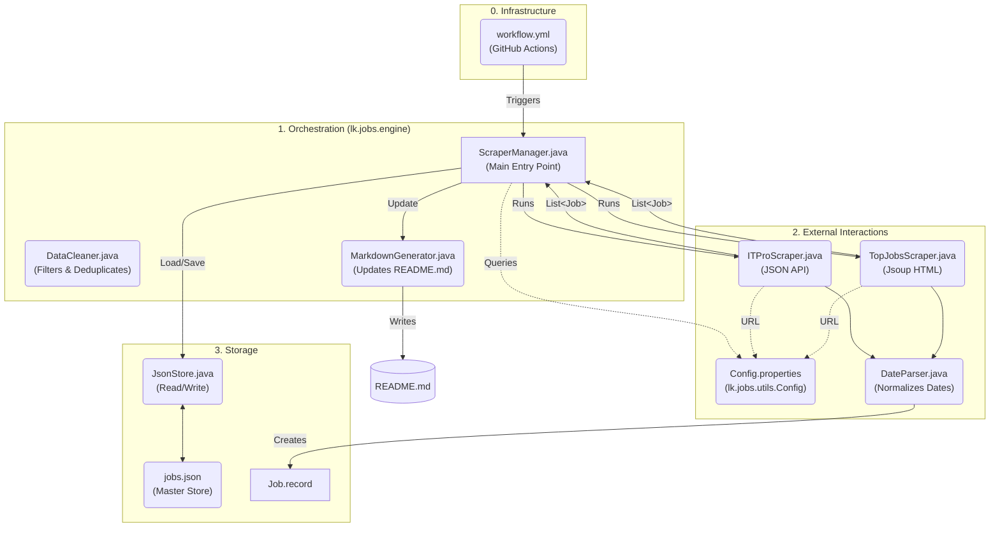

# 🇱🇰 Sri Lanka Software Engineering Jobs | 2026 Tracker [](https://t.me/SL_Software_Jobs)
🚀 Automated Software Engineering Job Tracker for Sri Lanka. Scrapes and categorizes Intern, Associate, and SE roles daily using Java (Jsoup) and GitHub Actions.

> [!TIP]
> **Help keep this project alive!** If this tool helped you find a lead today, please [**Star ⭐ the repo**](https://github.com/Senadeera-NK/sri-lanka-software-jobs). It’s how I measure the impact on our dev community! 🇱🇰

> [!IMPORTANT]
> **Automatic Staleness Purge:** The engine automatically removes listings older than **14 days**, ensuring the feed stays relevant and high-signal.

## 📊 Current Job Openings
> 🟢 **Last Updated:** March 15,5:19 PM (Just now)  | **Total Jobs Found:** 108

### 🎓 Internships & Trainees  (20)

| Title | Company | Level  | Posted | Source |
| :--- | :--- | :--- | :--- | :--- |
| [Intern Software Engineer](https://itpro.lk/job/13284/intern-software-engineer-at-codery/) | Codery | Intern | 6&nbsp;hours&nbsp;ago | ITPro.lk |
| [Full Stack Developer Intern](https://itpro.lk/job/13274/full-stack-developer-intern-at-ranga-technologies-pinegen-ai/) | Ranga Technologies (PineGen AI) | Intern | 2&nbsp;days&nbsp;ago | ITPro.lk |
| [Intern - Cloud Solutions and Service (1)](https://www.topjobs.lk/employer/JobAdvertismentServlet?ac=0000000049&jc=0001466318&ec=0000000313) | John Keells IT | Intern | 3&nbsp;days&nbsp;ago | TopJobs.lk |
| [Software Engineer Intern](https://itpro.lk/job/13253/software-engineer-intern-at-rispit/) | Rispit | Intern | 4&nbsp;days&nbsp;ago | ITPro.lk |
| [Intern - Business Analyst, DevOps and Software Engineer](https://www.topjobs.lk/employer/JobAdvertismentServlet?ac=DEFZZZ&jc=0001478279&ec=DEFZZZ) | Future CX Lanka (Pvt) Ltd | Intern | 4&nbsp;days&nbsp;ago | TopJobs.lk |
| [Software Quality Assurance - Intern](https://itpro.lk/job/13246/software-quality-assurance-intern-at-qdesk-ai-pvt-ltd/) | Qdesk AI Pvt Ltd | Intern | 5&nbsp;days&nbsp;ago | ITPro.lk |
| [Internship Full Stack Developer Trainee](https://itpro.lk/job/13245/internship-full-stack-developer-trainee-at-itx-digital-services-pvt-ltd/) | ITX Digital Services (Pvt) Ltd | Intern | 6&nbsp;days&nbsp;ago | ITPro.lk |
| [Web Development Intern](https://itpro.lk/job/13226/web-development-intern-at-koncepthive/) | Koncepthive | Intern | 6&nbsp;days&nbsp;ago | ITPro.lk |
| [Software Engineer \| Fullstack & Mobile Development Intern](https://www.topjobs.lk/employer/JobAdvertismentServlet?ac=DEFZZZ&jc=0001477275&ec=DEFZZZ) | FinzLabs | Intern | 6&nbsp;days&nbsp;ago | TopJobs.lk |
| [Software Engineer Intern](https://itpro.lk/job/13215/software-engineer-intern-at-perpova-developers/) | Perpova Developers | Intern | 7&nbsp;days&nbsp;ago | ITPro.lk |
| [QA Engineer Intern](https://itpro.lk/job/13214/qa-engineer-intern-at-perpova-developers/) | Perpova Developers | Intern | 7&nbsp;days&nbsp;ago | ITPro.lk |
| [DevOps Intern](https://itpro.lk/job/13213/devops-intern-at-perpova-developers/) | Perpova Developers | Intern | 8&nbsp;days&nbsp;ago | ITPro.lk |
| [Software Engineer Intern](https://itpro.lk/job/13211/software-engineer-intern-at-sisenco-digital/) | Sisenco Digital | Intern | 8&nbsp;days&nbsp;ago | ITPro.lk |
| [Software Engineering Interns](https://www.topjobs.lk/employer/JobAdvertismentServlet?ac=DEFZZZ&jc=0001476708&ec=DEFZZZ) | Avanka IT | Intern | 9&nbsp;days&nbsp;ago | TopJobs.lk |
| [Intern Software Engineer](https://itpro.lk/job/13199/intern-software-engineer-at-muve-mobility/) | Muve Mobility | Intern | 9&nbsp;days&nbsp;ago | ITPro.lk |
| [Intern - Software Development (Java) (1)](https://www.topjobs.lk/employer/JobAdvertismentServlet?ac=0000000049&jc=0001475460&ec=0000000313) | John Keells IT | Intern | 11&nbsp;days&nbsp;ago | TopJobs.lk |
| [Backend Developer Intern](https://itpro.lk/job/13181/backend-developer-intern-at-ranga-technologies-pinegen-ai/) | Ranga Technologies (PineGen AI) | Intern | 12&nbsp;days&nbsp;ago | ITPro.lk |
| [Data Science Intern](https://www.topjobs.lk/employer/JobAdvertismentServlet?ac=DEFZZZ&jc=0001475156&ec=DEFZZZ) | Gotli Labs | Intern | 12&nbsp;days&nbsp;ago | TopJobs.lk |
| [Intern Software Engineer (1)](https://www.topjobs.lk/employer/JobAdvertismentServlet?ac=0000000201&jc=0001474800&ec=0000000635) | DTech (Pvt) Ltd | Intern | 13&nbsp;days&nbsp;ago | TopJobs.lk |
| [Software Engineering Intern (Non-paid)](https://itpro.lk/job/13174/software-engineering-intern-nonpaid-at-panhinda-solutions/) | Panhinda Solutions | Intern | 14&nbsp;days&nbsp;ago | ITPro.lk |

---

### 💻 Associate & Junior/SE Roles  (56)

| Title | Company | Level  | Posted | Source |
| :--- | :--- | :--- | :--- | :--- |
| [Software Engineers](https://www.topjobs.lk/employer/JobAdvertismentServlet?ac=DEFZZZ&jc=0001476158&ec=DEFZZZ) | Venturecorp (Pvt) Ltd | Junior/SE | 17&nbsp;hours&nbsp;ago | TopJobs.lk |
| [Trainee Software Engineer \| Associate Software Engineer \| ...](https://www.topjobs.lk/employer/JobAdvertismentServlet?ac=DEFZZZ&jc=0001477410&ec=DEFZZZ) | Afisol (Pvt) Ltd | Associate | 17&nbsp;hours&nbsp;ago | TopJobs.lk |
| [QA Engineer](https://www.topjobs.lk/employer/JobAdvertismentServlet?ac=DEFZZZ&jc=0001477811&ec=DEFZZZ) | InEight SL (Pvt) Ltd | Junior/SE | 17&nbsp;hours&nbsp;ago | TopJobs.lk |
| [Information Security Officer (ISMS)](https://www.topjobs.lk/employer/JobAdvertismentServlet?ac=DEFZZZ&jc=0001479053&ec=DEFZZZ) | Treinetic (Pvt) Ltd | Junior/SE | 17&nbsp;hours&nbsp;ago | TopJobs.lk |
| [Software Engineer (Male)](https://www.topjobs.lk/employer/JobAdvertismentServlet?ac=0000000223&jc=0001479346&ec=0000000266) | Data Management Systems (Pvt) Ltd | Junior/SE | 2&nbsp;days&nbsp;ago | TopJobs.lk |
| [Software Engineering Vacancies](https://www.topjobs.lk/employer/JobAdvertismentServlet?ac=DEFZZZ&jc=0001479329&ec=DEFZZZ) | Manpower Sri Lanka | Junior/SE | 2&nbsp;days&nbsp;ago | TopJobs.lk |
| [Backend Developer / Engineer -  Golang (1)](https://www.topjobs.lk/employer/JobAdvertismentServlet?ac=0000000221&jc=0001479675&ec=0000000264) | Browns Group Of Companies | Junior/SE | 2&nbsp;days&nbsp;ago | TopJobs.lk |
| [DevOps Engineer](https://www.topjobs.lk/employer/JobAdvertismentServlet?ac=DEFZZZ&jc=0001479814&ec=DEFZZZ) | eBEYONDS | Junior/SE | 2&nbsp;days&nbsp;ago | TopJobs.lk |
| [Web Developer](https://www.topjobs.lk/employer/JobAdvertismentServlet?ac=DEFZZZ&jc=0001479778&ec=DEFZZZ) | The Permalinks Limited | Junior/SE | 2&nbsp;days&nbsp;ago | TopJobs.lk |
| [Software Development Engineer - Odoo](https://www.topjobs.lk/employer/JobAdvertismentServlet?ac=DEFZZZ&jc=0001479764&ec=DEFZZZ) | Netex Technologies (Pvt) Ltd | Junior/SE | 2&nbsp;days&nbsp;ago | TopJobs.lk |
| [Full Stack Developer (React.js & Supabase)](https://itpro.lk/job/13271/full-stack-developer-reactjs-supabase-at-kd-marketing-group/) | KD Marketing Group | Junior/SE | 2&nbsp;days&nbsp;ago | ITPro.lk |
| [Backend Developer (Node.js / NestJS)](https://itpro.lk/job/13268/backend-developer-nodejs-nestjs-at-icellyte/) | Icellyte | Junior/SE | 3&nbsp;days&nbsp;ago | ITPro.lk |
| [Quality Assurance Engineer](https://itpro.lk/job/13266/quality-assurance-engineer-at-digitalbee-labs/) | DigitalBee Labs | Junior/SE | 3&nbsp;days&nbsp;ago | ITPro.lk |
| [Trainee QA Engineer](https://itpro.lk/job/13265/trainee-qa-engineer-at-digitalbee-labs/) | DigitalBee Labs | Associate | 3&nbsp;days&nbsp;ago | ITPro.lk |
| [Trainee - Software Engineering](https://www.topjobs.lk/employer/JobAdvertismentServlet?ac=DEFZZZ&jc=0001478996&ec=DEFZZZ) | iPhonik (Pvt) Ltd | Associate | 3&nbsp;days&nbsp;ago | TopJobs.lk |
| [Azure/ Dynamics 365 (Business Central Administrator) (1)](https://www.topjobs.lk/employer/JobAdvertismentServlet?ac=0000000221&jc=0001478995&ec=0000000264) | Browns Group Of Companies | Junior/SE | 3&nbsp;days&nbsp;ago | TopJobs.lk |
| [QA Engineer](https://www.topjobs.lk/employer/JobAdvertismentServlet?ac=0000000484&jc=0001473839&ec=0000000651) | Epic Lanka (Pvt) Ltd | Junior/SE | 3&nbsp;days&nbsp;ago | TopJobs.lk |
| [Junior Web Developer](https://www.topjobs.lk/employer/JobAdvertismentServlet?ac=DEFZZZ&jc=0001475446&ec=DEFZZZ) | Greenpeace South Asia | Junior/SE | 4&nbsp;days&nbsp;ago | TopJobs.lk |
| [Associate Platform Engineer (AI Assisted Development)](https://www.topjobs.lk/employer/JobAdvertismentServlet?ac=DEFZZZ&jc=0001478358&ec=DEFZZZ) | Lyceum Global Holdings (Pvt) Ltd | Associate | 4&nbsp;days&nbsp;ago | TopJobs.lk |
| [Software Engineer - iOS Platform](https://www.topjobs.lk/employer/JobAdvertismentServlet?ac=DEFZZZ&jc=0001478660&ec=DEFZZZ) | Ideahub (Pvt) Ltd | Junior/SE | 4&nbsp;days&nbsp;ago | TopJobs.lk |
| [DevOps Engineer](https://www.topjobs.lk/employer/JobAdvertismentServlet?ac=DEFZZZ&jc=0001478655&ec=DEFZZZ) | Ideahub (Pvt) Ltd | Junior/SE | 4&nbsp;days&nbsp;ago | TopJobs.lk |
| [Associate Software Engineer (Colombo)](https://www.topjobs.lk/employer/JobAdvertismentServlet?ac=DEFZZZ&jc=0001478646&ec=DEFZZZ) | Nawaloka College of Higher Studies | Associate | 4&nbsp;days&nbsp;ago | TopJobs.lk |
| [Data Scientist (Architect) (1)](https://www.topjobs.lk/employer/JobAdvertismentServlet?ac=0000000486&jc=0001478461&ec=0000000654) | George Bernard (Pvt) Ltd | Junior/SE | 4&nbsp;days&nbsp;ago | TopJobs.lk |
| [Python Architect (1)](https://www.topjobs.lk/employer/JobAdvertismentServlet?ac=0000000486&jc=0001478455&ec=0000000654) | George Bernard (Pvt) Ltd | Junior/SE | 4&nbsp;days&nbsp;ago | TopJobs.lk |
| [Cyber Security Analyst](https://www.topjobs.lk/employer/JobAdvertismentServlet?ac=DEFZZZ&jc=0001478138&ec=DEFZZZ) | UB Finance PLC | Junior/SE | 5&nbsp;days&nbsp;ago | TopJobs.lk |
| [Management Coordinator Software](https://www.topjobs.lk/employer/JobAdvertismentServlet?ac=DEFZZZ&jc=0001477880&ec=DEFZZZ) | Vital One (Pvt) Ltd | Junior/SE | 5&nbsp;days&nbsp;ago | TopJobs.lk |
| [Junior Power BI Developer (1)](https://www.topjobs.lk/employer/JobAdvertismentServlet?ac=0000000026&jc=0001472128&ec=0000000026) | McLarens Holdings Limited | Junior/SE | 5&nbsp;days&nbsp;ago | TopJobs.lk |
| [Associate Web Developer](https://itpro.lk/job/13241/associate-web-developer-at-ebeyonds-pvt-ltd/) | Ebeyonds (pvt) Ltd | Associate | 6&nbsp;days&nbsp;ago | ITPro.lk |
| [Associate Quality Assurance Engineers](https://itpro.lk/job/13233/associate-quality-assurance-engineers-at-ebeyonds-pvt-ltd/) | Ebeyonds (pvt) Ltd | Associate | 6&nbsp;days&nbsp;ago | ITPro.lk |
| [Mid-Level Backend Developer (Python)](https://www.topjobs.lk/employer/JobAdvertismentServlet?ac=DEFZZZ&jc=0001477264&ec=DEFZZZ) | Seren IT Services | Junior/SE | 6&nbsp;days&nbsp;ago | TopJobs.lk |
| [DevOps Engineer](https://www.topjobs.lk/employer/JobAdvertismentServlet?ac=DEFZZZ&jc=0001477256&ec=DEFZZZ) | Seren IT Services | Junior/SE | 6&nbsp;days&nbsp;ago | TopJobs.lk |
| [Quality Engineer](https://itpro.lk/job/13224/quality-engineer-at-predictiv-ai/) | Predictiv AI | Junior/SE | 6&nbsp;days&nbsp;ago | ITPro.lk |
| [Software Engineer (Angular / C# .NET Core)](https://itpro.lk/job/12777/software-engineer-angular-c-net-core-at-enhanzer/) | Enhanzer | Junior/SE | 7&nbsp;days&nbsp;ago | ITPro.lk |
| [AUTOMATION SOLUTIONS DEVELOPER (1)](https://www.topjobs.lk/employer/JobAdvertismentServlet?ac=0000000023&jc=0001477195&ec=0000000023) | Maritime Placements (Pvt) Ltd | Junior/SE | 8&nbsp;days&nbsp;ago | TopJobs.lk |
| [Cloud Solutions Architect](https://itpro.lk/job/13205/cloud-solutions-architect-at-tech-pacific-solutions/) | Tech Pacific Solutions | Junior/SE | 9&nbsp;days&nbsp;ago | ITPro.lk |
| [Software Engineer (PHP)](https://www.topjobs.lk/employer/JobAdvertismentServlet?ac=DEFZZZ&jc=0001476640&ec=DEFZZZ) | Company Name Withheld | Junior/SE | 9&nbsp;days&nbsp;ago | TopJobs.lk |
| [Software Developer](https://www.topjobs.lk/employer/JobAdvertismentServlet?ac=DEFZZZ&jc=0001476636&ec=DEFZZZ) | Western Paper Industries (Pvt) Ltd | Junior/SE | 9&nbsp;days&nbsp;ago | TopJobs.lk |
| [Unqork SME / Technical Expert (Integrations & Azure) (1)](https://www.topjobs.lk/employer/JobAdvertismentServlet?ac=0000000403&jc=0001476566&ec=0000000531) | Mobizz Elite (Pvt) Ltd | Junior/SE | 9&nbsp;days&nbsp;ago | TopJobs.lk |
| [Software Engineer](https://itpro.lk/job/13203/software-engineer-at-expergen/) | Expergen | Junior/SE | 9&nbsp;days&nbsp;ago | ITPro.lk |
| [DevOps Engineer](https://itpro.lk/job/12136/devops-engineer-at-rightmo-web-solution/) | Rightmo Web Solution | Junior/SE | 9&nbsp;days&nbsp;ago | ITPro.lk |
| [Quality Assurance Engineer](https://itpro.lk/job/12117/quality-assurance-engineer-at-rightmo-web-solution/) | Rightmo Web Solution | Junior/SE | 9&nbsp;days&nbsp;ago | ITPro.lk |
| [Associate Software Engineer](https://itpro.lk/job/13200/associate-software-engineer-at-muve-mobility/) | Muve Mobility | Associate | 9&nbsp;days&nbsp;ago | ITPro.lk |
| [Software Engineer (C#) - Application Development & Automated Testing](https://www.topjobs.lk/employer/JobAdvertismentServlet?ac=DEFZZZ&jc=0001476274&ec=DEFZZZ) | Seaport Group | Junior/SE | 10&nbsp;days&nbsp;ago | TopJobs.lk |
| [Full Stack Software Engineer](https://www.topjobs.lk/employer/JobAdvertismentServlet?ac=DEFZZZ&jc=0001476124&ec=DEFZZZ) | BotMedFusion | Junior/SE | 10&nbsp;days&nbsp;ago | TopJobs.lk |
| [Performance Focused Software Engineer](https://www.topjobs.lk/employer/JobAdvertismentServlet?ac=DEFZZZ&jc=0001476117&ec=DEFZZZ) | Company Name Withheld | Junior/SE | 10&nbsp;days&nbsp;ago | TopJobs.lk |
| [AI Automation Engineer](https://www.topjobs.lk/employer/JobAdvertismentServlet?ac=DEFZZZ&jc=0001476183&ec=DEFZZZ) | Lyceum Global Holdings (Pvt) Ltd | Junior/SE | 10&nbsp;days&nbsp;ago | TopJobs.lk |
| [Quality Assurance Tester](https://www.topjobs.lk/employer/JobAdvertismentServlet?ac=DEFZZZ&jc=0001476322&ec=DEFZZZ) | Levein | Junior/SE | 10&nbsp;days&nbsp;ago | TopJobs.lk |
| [Unqork SME / Technical Expert (Integrations & Azure) (1)](https://www.topjobs.lk/employer/JobAdvertismentServlet?ac=0000000499&jc=0001476267&ec=0000000679) | R.M.D Consultants (Pvt) Ltd | Junior/SE | 10&nbsp;days&nbsp;ago | TopJobs.lk |
| [Full-Stack Engineer (React + NestJS)](https://itpro.lk/job/13192/fullstack-engineer-react-nestjs-at-mo-marketplace/) | MO Marketplace | Junior/SE | 11&nbsp;days&nbsp;ago | ITPro.lk |
| [Software Engineer (1)](https://www.topjobs.lk/employer/JobAdvertismentServlet?ac=0000000064&jc=0001475836&ec=0000000603) | Hirdaramani - H CONNECT (PVT) LIMITED | Junior/SE | 11&nbsp;days&nbsp;ago | TopJobs.lk |
| [RPA Developer (Straddle Shift)](https://www.topjobs.lk/employer/JobAdvertismentServlet?ac=DEFZZZ&jc=0001475389&ec=DEFZZZ) | Legacy Health (Pvt) Ltd | Junior/SE | 11&nbsp;days&nbsp;ago | TopJobs.lk |
| [Mid-Level Software Engineer](https://itpro.lk/job/13191/midlevel-software-engineer-at-artecx-solutions/) | ARTecX Solutions | Junior/SE | 11&nbsp;days&nbsp;ago | ITPro.lk |
| [Software QA Engineer](https://itpro.lk/job/13188/software-qa-engineer-at-serveme-pvt-ltd/) | ServeME Pvt Ltd | Junior/SE | 12&nbsp;days&nbsp;ago | ITPro.lk |
| [Software Engineer (1)](https://www.topjobs.lk/employer/JobAdvertismentServlet?ac=0000000146&jc=0001475303&ec=0000000178) | Nawaloka Hospitals PLC | Junior/SE | 12&nbsp;days&nbsp;ago | TopJobs.lk |
| [Software Developer (Engineering Automation)](https://www.topjobs.lk/employer/JobAdvertismentServlet?ac=DEFZZZ&jc=0001474883&ec=DEFZZZ) | Ark Draft | Junior/SE | 12&nbsp;days&nbsp;ago | TopJobs.lk |
| [Java Full-Stack Developer (6 Months' Contract) (1)](https://www.topjobs.lk/employer/JobAdvertismentServlet?ac=0000000371&jc=0001459920&ec=0000000486) | Goodhope Asia Holdings Ltd | Junior/SE | 12&nbsp;days&nbsp;ago | TopJobs.lk |

---

### 🚀 Senior & Lead Roles  (32)

| Title | Company | Level  | Posted | Source |
| :--- | :--- | :--- | :--- | :--- |
| [Senior Software Engineer - Full Stack - JavaScript](https://itpro.lk/job/13278/senior-software-engineer-full-stack-javascript-at-/) |  | Senior | 2&nbsp;days&nbsp;ago | ITPro.lk |
| [Senior Software Engineer - Agentic AI](https://itpro.lk/job/13277/senior-software-engineer-agentic-ai-at-/) |  | Senior | 2&nbsp;days&nbsp;ago | ITPro.lk |
| [Senior Software Engineer - .NET](https://itpro.lk/job/13276/senior-software-engineer-net-at-/) |  | Senior | 2&nbsp;days&nbsp;ago | ITPro.lk |
| [Senior Software Engineer - Golang](https://itpro.lk/job/13275/senior-software-engineer-golang-at-/) |  | Senior | 2&nbsp;days&nbsp;ago | ITPro.lk |
| [Senior QA Engineer (1)](https://www.topjobs.lk/employer/JobAdvertismentServlet?ac=0000000421&jc=0001441300&ec=0000000555) | Sumathi Group | Senior | 2&nbsp;days&nbsp;ago | TopJobs.lk |
| [Senior Software Engineer \| Software Engineer.](https://www.topjobs.lk/employer/JobAdvertismentServlet?ac=DEFZZZ&jc=0001479807&ec=DEFZZZ) | PacificKode (Pvt) Ltd | Senior | 2&nbsp;days&nbsp;ago | TopJobs.lk |
| [Software Engineer / Senior / Lead  - Data Migration & Integration](https://itpro.lk/job/13259/software-engineer-senior-lead-data-migration-integration-at-jfs-holdings/) | JFS Holdings | Senior | 4&nbsp;days&nbsp;ago | ITPro.lk |
| [Senior Software Engineer - PHP](https://itpro.lk/job/13258/senior-software-engineer-php-at-vitalhub-innovations-lab/) | VitalHub Innovations Lab | Senior | 4&nbsp;days&nbsp;ago | ITPro.lk |
| [Lead / Senior / Software Engineer (1)](https://www.topjobs.lk/employer/JobAdvertismentServlet?ac=0000000375&jc=0001478356&ec=0000000492) | Jobfactory | Senior | 4&nbsp;days&nbsp;ago | TopJobs.lk |
| [Senior SQL Developer (1)](https://www.topjobs.lk/employer/JobAdvertismentServlet?ac=0000000271&jc=0001421034&ec=0000000350) | CMS (Pvt) Ltd | Senior | 4&nbsp;days&nbsp;ago | TopJobs.lk |
| [Software Engineer / Senior Software Engineer -  Data Migrati...](https://www.topjobs.lk/employer/JobAdvertismentServlet?ac=0000000375&jc=0001478604&ec=0000000492) | Jobfactory | Senior | 4&nbsp;days&nbsp;ago | TopJobs.lk |
| [Senior DevOPs Engineer (1)](https://www.topjobs.lk/employer/JobAdvertismentServlet?ac=0000000375&jc=0001478614&ec=0000000492) | Jobfactory | Senior | 4&nbsp;days&nbsp;ago | TopJobs.lk |
| [Lead DevOps Enginineer (1)](https://www.topjobs.lk/employer/JobAdvertismentServlet?ac=0000000375&jc=0001478615&ec=0000000492) | Jobfactory | Senior | 4&nbsp;days&nbsp;ago | TopJobs.lk |
| [Senior/lead DevOps Engineer (Contract) (1)](https://www.topjobs.lk/employer/JobAdvertismentServlet?ac=0000000375&jc=0001477961&ec=0000000492) | Jobfactory | Senior | 5&nbsp;days&nbsp;ago | TopJobs.lk |
| [Laravel Tech Lead / Laravel Architecture](https://www.topjobs.lk/employer/JobAdvertismentServlet?ac=DEFZZZ&jc=0001478006&ec=DEFZZZ) | Company Name Withheld | Senior | 5&nbsp;days&nbsp;ago | TopJobs.lk |
| [Senior Software Engineer Full Stack (1)](https://www.topjobs.lk/employer/JobAdvertismentServlet?ac=0000000492&jc=0001478193&ec=0000000661) | DirectFN | Senior | 5&nbsp;days&nbsp;ago | TopJobs.lk |
| [Senior Software Engineer JAVA (4)](https://www.topjobs.lk/employer/JobAdvertismentServlet?ac=0000000492&jc=0001478191&ec=0000000661) | DirectFN | Senior | 5&nbsp;days&nbsp;ago | TopJobs.lk |
| [Senior QA Engineer (Manual & Automation)](https://itpro.lk/job/13221/senior-qa-engineer-manual-automation-at-orysys/) | Orysys | Senior | 6&nbsp;days&nbsp;ago | ITPro.lk |
| [Senior Software Engineer](https://itpro.lk/job/13216/senior-software-engineer-at-bistec-global/) | BISTEC Global | Senior | 7&nbsp;days&nbsp;ago | ITPro.lk |
| [Senior Software Engineer (Remote)](https://www.topjobs.lk/employer/JobAdvertismentServlet?ac=DEFZZZ&jc=0001476485&ec=DEFZZZ) | A K H IT Solutions (Pvt) Ltd | Senior | 9&nbsp;days&nbsp;ago | TopJobs.lk |
| [Senior Software Engineer -  JAVA Development (1)](https://www.topjobs.lk/employer/JobAdvertismentServlet?ac=0000000486&jc=0001476456&ec=0000000654) | George Bernard (Pvt) Ltd | Senior | 10&nbsp;days&nbsp;ago | TopJobs.lk |
| [Lead Software Engineer (1)](https://www.topjobs.lk/employer/JobAdvertismentServlet?ac=0000000375&jc=0001476116&ec=0000000492) | Jobfactory | Senior | 10&nbsp;days&nbsp;ago | TopJobs.lk |
| [Senior Software Engineer (1)](https://www.topjobs.lk/employer/JobAdvertismentServlet?ac=0000000064&jc=0001475837&ec=0000000603) | Hirdaramani - H CONNECT (PVT) LIMITED | Senior | 11&nbsp;days&nbsp;ago | TopJobs.lk |
| [Senior Integration Developer (n8n)](https://www.topjobs.lk/employer/JobAdvertismentServlet?ac=DEFZZZ&jc=0001475539&ec=DEFZZZ) | Dijital Team | Senior | 11&nbsp;days&nbsp;ago | TopJobs.lk |
| [Senior QA Engineer (Automation) (1)](https://www.topjobs.lk/employer/JobAdvertismentServlet?ac=0000000486&jc=0001475765&ec=0000000654) | George Bernard (Pvt) Ltd | Senior | 11&nbsp;days&nbsp;ago | TopJobs.lk |
| [Software Developer \| Senior Software Developer](https://www.topjobs.lk/employer/JobAdvertismentServlet?ac=DEFZZZ&jc=0001475270&ec=DEFZZZ) | Crystal Martin Ceylon (Private) Limited | Senior | 12&nbsp;days&nbsp;ago | TopJobs.lk |
| [Senior iOS Developer (Banking Applications)](https://www.topjobs.lk/employer/JobAdvertismentServlet?ac=DEFZZZ&jc=0001475257&ec=DEFZZZ) | Fortunaglobal (Pvt) Limited | Senior | 12&nbsp;days&nbsp;ago | TopJobs.lk |
| [Senior Android Developer (Banking Applications) (1)](https://www.topjobs.lk/employer/JobAdvertismentServlet?ac=DEFZZZ&jc=0001475252&ec=DEFZZZ) | Fortunaglobal (Pvt) Limited | Senior | 12&nbsp;days&nbsp;ago | TopJobs.lk |
| [Senior Front end Developer (1)](https://www.topjobs.lk/employer/JobAdvertismentServlet?ac=0000000492&jc=0001475229&ec=0000000661) | DirectFN | Senior | 12&nbsp;days&nbsp;ago | TopJobs.lk |
| [Senior Software Engineer - Finacle Development (1)](https://www.topjobs.lk/employer/JobAdvertismentServlet?ac=0000000486&jc=0001474984&ec=0000000654) | George Bernard (Pvt) Ltd | Senior | 12&nbsp;days&nbsp;ago | TopJobs.lk |
| [Senior Software Engineer-Delivery Channels and Middleware (1)](https://www.topjobs.lk/employer/JobAdvertismentServlet?ac=0000000486&jc=0001474974&ec=0000000654) | George Bernard (Pvt) Ltd | Senior | 12&nbsp;days&nbsp;ago | TopJobs.lk |
| [Senior Quality Assurance Engineer (Automation – Playwright)](https://itpro.lk/job/12934/senior-quality-assurance-engineer-automation-playwright-at-digiratina-technology-solutions/) | Digiratina Technology Solutions | Senior | 12&nbsp;days&nbsp;ago | ITPro.lk |

---


## 🛠️ How it Works
1. **Engine:** A Java 21 console application using **Jsoup**.
2. **Sources:** Currently scraping `ITPro.lk` and  `TopJobs`. Support for and `Rooster.jobs` is under development (Contributors welcome!)
3. **Automation:** Runs every 12 hours via **GitHub Actions**.
4. **Storage:** Updates this `README.md` and a `jobs.json` file automatically.

<details>
<summary><b>📐 View High-Level Architecture Diagram</b></summary>
    


</details>

<details>
<summary><b>📂 View Project Structure</b></summary>

```text
src/main/java/lk/jobs/
├── engine/           # Logic for sorting, cleaning, and README updates
├── model/            # Data models (Job Record)
├── scrapers/         # Individual site scrapers
└── utils/            # JSON and Date parsing utilities
```
</details>

## 🚀 Usage
If you want to run the scraper locally:
1. Clone the repo.
2. Ensure you have **JDK 21** and **Maven** installed.
3. Run: mvn clean compile exec:java -Dexec.mainClass="lk.jobs.engine.ScraperManager"

## 🤝 Contributing
Contributions are what make the open-source community such an amazing place to learn, inspire, and create.
Any contributions you make are **greatly appreciated**.

* **Found a bug?** Open an [Issue](https://github.com/Senadeera-NK/sl-software-engineering-jobs/issues).
* **Want to add a new site?** Check out our [Contributing Guidelines](CONTRIBUTING.md) to see how to implement a new scraper.
* **Missing a job?** Feel free to submit a Pull Request to manually update the table!
