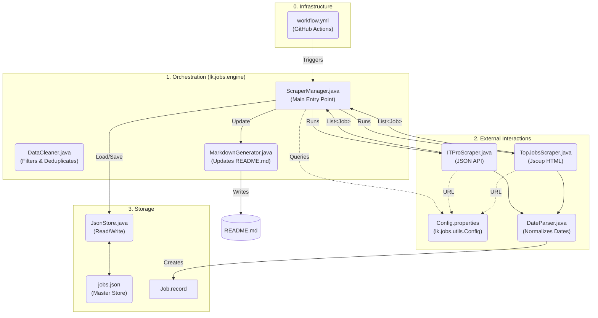

# 🇱🇰 Sri Lanka Software Engineering Jobs | 2026 Tracker [](https://t.me/SL_Software_Jobs)
Looking for software engineering jobs in Sri Lanka? This tracker updates daily with intern, junior, and senior IT roles across Colombo and beyond
Automated Software Engineering Job Tracker for Sri Lanka. Scrapes and categorizes Intern, Associate, and SE roles daily using Java (Jsoup) and GitHub Actions.

> [!TIP]
> **Help keep this project alive!** If this tool helped you find a lead today, please [**Star ⭐ the repo**](https://github.com/Senadeera-NK/sri-lanka-software-jobs). It’s how I measure the impact on our dev community! 🇱🇰

> [!IMPORTANT]
> **Automatic Staleness Purge:** The engine automatically removes listings older than **14 days**, ensuring the feed stays relevant and high-signal.

> **Live Analytics & Daily Software Job Tracker for Sri Lanka**

[📊 View Live Dashboard](https://sri-lanka-software-jobs.vercel.app/)

 
*Click the link above to see real-time trends, seniority distribution, and top hiring companies.*

## 📊 Current Job Openings
> 🟢 **Last Updated:** September 16,9:00 PM (Just now)  | **Total Jobs Found:** 131

### 🎓 Internships & Trainees  (33)

| Title | Company | Level  | Posted | Source |
| :--- | :--- | :--- | :--- | :--- |
| [React Js \| QA \| System Intern \| BO Intern](https://www.topjobs.lk/employer/JobAdvertismentServlet?ac=DEFZZZ&jc=0001545762&ec=DEFZZZ) | Capsicum Labs | Intern | 21&nbsp;hours&nbsp;ago | TopJobs.lk |
| [Intern - Database (1)](https://www.topjobs.lk/employer/JobAdvertismentServlet?ac=0000000438&jc=0001549010&ec=0000000577) | Fortude | Intern | 21&nbsp;hours&nbsp;ago | TopJobs.lk |
| [QA Intern](https://itpro.lk/job/15108/qa-intern-at-affno-asia-pacific-pvt-ltd/) | Affno Asia Pacific (Pvt) Ltd | Intern | 22&nbsp;hours&nbsp;ago | ITPro.lk |
| [Software Engineer Intern - Fullstack & Mobile Development](https://www.topjobs.lk/employer/JobAdvertismentServlet?ac=DEFZZZ&jc=0001548185&ec=DEFZZZ) | Finz Labs | Intern | Yesterday | TopJobs.lk |
| [Software Engineer Intern](https://itpro.lk/job/14338/software-engineer-intern-at-epinics/) | Epinics | Intern | 2&nbsp;days&nbsp;ago | ITPro.lk |
| [Intern Software Engineer](https://itpro.lk/job/15087/intern-software-engineer-at-konekt-holdings-pvt-ltd/) | Konekt Holdings (Pvt) Ltd | Intern | 2&nbsp;days&nbsp;ago | ITPro.lk |
| [Web Developer Intern](https://www.topjobs.lk/employer/JobAdvertismentServlet?ac=DEFZZZ&jc=0001548028&ec=DEFZZZ) | Snow Soft (Pvt) Ltd | Intern | 2&nbsp;days&nbsp;ago | TopJobs.lk |
| [Intern Robotics Engineer](https://rooster.jobs/jobs/519551) | Hype Invention  | Intern | 2&nbsp;days&nbsp;ago | Rooster.jobs |
| [Quality Assurance (QA) Intern](https://itpro.lk/job/15079/quality-assurance-qa-intern-at-creativex-technology-pvt-ltd/) | CreativeX Technology Pvt Ltd | Intern | 4&nbsp;days&nbsp;ago | ITPro.lk |
| [Laravel Developer Intern - Paid Internship](https://www.topjobs.lk/employer/JobAdvertismentServlet?ac=DEFZZZ&jc=0001546656&ec=DEFZZZ) | Oonewoo Tech (Pvt) Ltd | Intern | 6&nbsp;days&nbsp;ago | TopJobs.lk |
| [Intern - Software Engineer](https://itpro.lk/job/15059/intern-software-engineer-at-earrow-pvt-ltd/) | eArrow (Pvt) LTD | Intern | 6&nbsp;days&nbsp;ago | ITPro.lk |
| [Software Engineer Intern](https://itpro.lk/job/15051/software-engineer-intern-at-samuel-gnanam-it-centre/) | Samuel Gnanam IT Centre | Intern | 7&nbsp;days&nbsp;ago | ITPro.lk |
| [Intern - Software Engineer](https://itpro.lk/job/15037/intern-software-engineer-at-sriq-corporation/) | SRIQ Corporation | Intern | 7&nbsp;days&nbsp;ago | ITPro.lk |
| [Intern - QA Engineer](https://itpro.lk/job/15034/intern-qa-engineer-at-sriq-corporation/) | SRIQ Corporation | Intern | 7&nbsp;days&nbsp;ago | ITPro.lk |
| [Intern - Software Engineering (1)](https://www.topjobs.lk/employer/JobAdvertismentServlet?ac=0000000438&jc=0001545772&ec=0000000577) | Fortude | Intern | 8&nbsp;days&nbsp;ago | TopJobs.lk |
| [Intern Software Engineer (Work From Home)](https://www.topjobs.lk/employer/JobAdvertismentServlet?ac=DEFZZZ&jc=0001545472&ec=DEFZZZ) | Yumarone Labz | Intern | 8&nbsp;days&nbsp;ago | TopJobs.lk |
| [Intern - Data Analytics](https://www.topjobs.lk/employer/JobAdvertismentServlet?ac=DEFZZZ&jc=0001545411&ec=DEFZZZ) | UTE CAT | Intern | 8&nbsp;days&nbsp;ago | TopJobs.lk |
| [Software Quality Assurance (QA) - Internship](https://itpro.lk/job/15009/software-quality-assurance-qa-internship-at-d-help-hub-private-limited/) | D HELP HUB Private Limited | Intern | 9&nbsp;days&nbsp;ago | ITPro.lk |
| [Software Engineering Internship](https://itpro.lk/job/15008/software-engineering-internship-at-d-help-hub-private-limited/) | D HELP HUB Private Limited | Intern | 9&nbsp;days&nbsp;ago | ITPro.lk |
| [Software Quality Assurance (QA) - Internship](https://itpro.lk/job/15005/software-quality-assurance-qa-internship-at-finakle-management-solutions-pvt-ltd/) | Finakle Management Solutions (Pvt) Ltd | Intern | 10&nbsp;days&nbsp;ago | ITPro.lk |
| [Software Engineer Internship](https://itpro.lk/job/15002/software-engineer-internship-at-explore-vacations-travels-pvt-ltd/) | Explore Vacations & Travels (Pvt) Ltd | Intern | 10&nbsp;days&nbsp;ago | ITPro.lk |
| [Intern - Full Stack Developer](https://itpro.lk/job/14996/intern-full-stack-developer-at-amez-cloud/) | Amez Cloud | Intern | 11&nbsp;days&nbsp;ago | ITPro.lk |
| [Intern QA Engineer](https://itpro.lk/job/14989/intern-qa-engineer-at-spil-labs-pvt-ltd/) | SPIL Labs (Pvt) Ltd | Intern | 11&nbsp;days&nbsp;ago | ITPro.lk |
| [Software Engineering Internship](https://itpro.lk/job/14988/software-engineering-internship-at-ara-ai-technologies-pvt-ltd/) | Ara AI Technologies (Pvt) Ltd | Intern | 12&nbsp;days&nbsp;ago | ITPro.lk |
| [QA Intern](https://itpro.lk/job/14984/qa-intern-at-axcertro/) | Axcertro | Intern | 12&nbsp;days&nbsp;ago | ITPro.lk |
| [Intern - Software Engineering](https://itpro.lk/job/14982/intern-software-engineering-at-hayleys-aventura/) | Hayleys Aventura | Intern | 12&nbsp;days&nbsp;ago | ITPro.lk |
| [Intern - Software Developer](https://www.topjobs.lk/employer/JobAdvertismentServlet?ac=DEFZZZ&jc=0001544349&ec=DEFZZZ) | Teloz | Intern | 12&nbsp;days&nbsp;ago | TopJobs.lk |
| [Intern - Mobile Development](https://www.topjobs.lk/employer/JobAdvertismentServlet?ac=0000000484&jc=0001544176&ec=0000000651) | Epic Lanka (Pvt) Ltd | Intern | 12&nbsp;days&nbsp;ago | TopJobs.lk |
| [Quality Assurance Internship](https://itpro.lk/job/14974/quality-assurance-internship-at-qdesk-ai-pvt-ltd/) | Qdesk AI Pvt Ltd | Intern | 13&nbsp;days&nbsp;ago | ITPro.lk |
| [QA Engineering Internship](https://itpro.lk/job/14963/qa-engineering-internship-at-kmk-group/) | KMK Group | Intern | 14&nbsp;days&nbsp;ago | ITPro.lk |
| [Software Engineer Intern](https://itpro.lk/job/14957/software-engineer-intern-at-dartcodes-pvt-ltd/) | DartCodes (PVT) LTD | Intern | 14&nbsp;days&nbsp;ago | ITPro.lk |
| [Software Engineering Intern](https://itpro.lk/job/14952/software-engineering-intern-at-kmk-group/) | KMK Group | Intern | 14&nbsp;days&nbsp;ago | ITPro.lk |
| [Intern - Software Engineering](https://www.topjobs.lk/employer/JobAdvertismentServlet?ac=0000000377&jc=0001543400&ec=0000000495) | Hayleys Group | Intern | 14&nbsp;days&nbsp;ago | TopJobs.lk |

---

### 💻 Associate & Junior/SE Roles  (69)

| Title | Company | Level  | Posted | Source |
| :--- | :--- | :--- | :--- | :--- |
| [Software Engineer – Full Stack](https://itpro.lk/job/15114/software-engineer-full-stack-at-hatchyard/) | Hatchyard | Junior/SE | 2&nbsp;hours&nbsp;ago | ITPro.lk |
| [Junior Full Stack Developer](https://www.topjobs.lk/employer/JobAdvertismentServlet?ac=DEFZZZ&jc=0001543734&ec=DEFZZZ) | Company Name Withheld | Junior/SE | 21&nbsp;hours&nbsp;ago | TopJobs.lk |
| [Software Engineer](https://www.topjobs.lk/employer/JobAdvertismentServlet?ac=DEFZZZ&jc=0001543718&ec=DEFZZZ) | Company Name Withheld | Junior/SE | 21&nbsp;hours&nbsp;ago | TopJobs.lk |
| [AI + Junior Mobile App Developer - React Native](https://www.topjobs.lk/employer/JobAdvertismentServlet?ac=DEFZZZ&jc=0001545702&ec=DEFZZZ) | Nascent Group | Junior/SE | 21&nbsp;hours&nbsp;ago | TopJobs.lk |
| [Quality Assurance Engineers](https://www.topjobs.lk/employer/JobAdvertismentServlet?ac=DEFZZZ&jc=0001545623&ec=DEFZZZ) | Prima Management Services (Pvt) Ltd | Junior/SE | 21&nbsp;hours&nbsp;ago | TopJobs.lk |
| [SQL Database Administrator (1)](https://www.topjobs.lk/employer/JobAdvertismentServlet?ac=0000000271&jc=0001533299&ec=0000000350) | CMS (Pvt) Ltd | Junior/SE | 21&nbsp;hours&nbsp;ago | TopJobs.lk |
| [Data Platform Engineer (1)](https://www.topjobs.lk/employer/JobAdvertismentServlet?ac=0000000271&jc=0001533297&ec=0000000350) | CMS (Pvt) Ltd | Junior/SE | 21&nbsp;hours&nbsp;ago | TopJobs.lk |
| [Information Security Analyst (1)](https://www.topjobs.lk/employer/JobAdvertismentServlet?ac=0000000271&jc=0001532706&ec=0000000350) | CMS (Pvt) Ltd | Junior/SE | 21&nbsp;hours&nbsp;ago | TopJobs.lk |
| [Information Security Engineer (1)](https://www.topjobs.lk/employer/JobAdvertismentServlet?ac=0000000271&jc=0001539697&ec=0000000350) | CMS (Pvt) Ltd | Junior/SE | 21&nbsp;hours&nbsp;ago | TopJobs.lk |
| [IT Executive - Virtualization & Cloud Infrastructure](https://www.topjobs.lk/employer/JobAdvertismentServlet?ac=DEFZZZ&jc=0001548724&ec=DEFZZZ) | Cargills Bank PLC | Junior/SE | 21&nbsp;hours&nbsp;ago | TopJobs.lk |
| [Associate Engineer - Business Intelligence (1)](https://www.topjobs.lk/employer/JobAdvertismentServlet?ac=0000000280&jc=0001548692&ec=0000000510) | Expolanka Freight (Pvt) Ltd | Associate | 21&nbsp;hours&nbsp;ago | TopJobs.lk |
| [Database Administrator (DBA)](https://www.topjobs.lk/employer/JobAdvertismentServlet?ac=DEFZZZ&jc=0001548633&ec=DEFZZZ) | Company Name With Held | Junior/SE | 21&nbsp;hours&nbsp;ago | TopJobs.lk |
| [Software Developer](https://www.topjobs.lk/employer/JobAdvertismentServlet?ac=DEFZZZ&jc=0001548572&ec=DEFZZZ) | Sathuta Builders (Pvt) Ltd | Junior/SE | 21&nbsp;hours&nbsp;ago | TopJobs.lk |
| [Backend Developer](https://www.topjobs.lk/employer/JobAdvertismentServlet?ac=DEFZZZ&jc=0001548797&ec=DEFZZZ) | True Foam (Pvt) Ltd | Junior/SE | 21&nbsp;hours&nbsp;ago | TopJobs.lk |
| [Software Engineer - Java](https://itpro.lk/job/14104/software-engineer-java-at-directfn/) | DirectFN | Junior/SE | Yesterday | ITPro.lk |
| [DevOps Engineer](https://www.topjobs.lk/employer/JobAdvertismentServlet?ac=DEFZZZ&jc=0001548310&ec=DEFZZZ) | X-Venture Global Solutions (Pvt) Ltd | Junior/SE | Yesterday | TopJobs.lk |
| [DevOps Trainee](https://www.topjobs.lk/employer/JobAdvertismentServlet?ac=DEFZZZ&jc=0001548303&ec=DEFZZZ) | X-Venture Global Solutions (Pvt) Ltd | Associate | Yesterday | TopJobs.lk |
| [Junior Trainee Software Developer](https://www.topjobs.lk/employer/JobAdvertismentServlet?ac=DEFZZZ&jc=0001548281&ec=DEFZZZ) | Hedanship Asia Pvt Ltd | Associate | Yesterday | TopJobs.lk |
| [QA Engineer](https://www.topjobs.lk/employer/JobAdvertismentServlet?ac=0000000484&jc=0001548399&ec=0000000651) | Epic Lanka (Pvt) Ltd | Junior/SE | Yesterday | TopJobs.lk |
| [.NET Core C# Developer - Mid Level](https://itpro.lk/job/15096/net-core-c-developer-mid-level-at-waterlily-labs/) | Waterlily Labs | Junior/SE | 2&nbsp;days&nbsp;ago | ITPro.lk |
| [Software Engineer (.NET / React)](https://itpro.lk/job/14197/software-engineer-net-react-at-verdentra/) | Verdentra | Junior/SE | 2&nbsp;days&nbsp;ago | ITPro.lk |
| [QA Engineer - Trainee/ Associate](https://itpro.lk/job/15089/qa-engineer-trainee-associate-at-enhanzer/) | Enhanzer | Associate | 2&nbsp;days&nbsp;ago | ITPro.lk |
| [Associate Software Engineer (1)](https://www.topjobs.lk/employer/JobAdvertismentServlet?ac=0000000375&jc=0001547769&ec=0000000492) | Jobfactory | Associate | 2&nbsp;days&nbsp;ago | TopJobs.lk |
| [Solution Engineer / Infrastructure Automation and AI (1)](https://www.topjobs.lk/employer/JobAdvertismentServlet?ac=0000000375&jc=0001547768&ec=0000000492) | Jobfactory | Junior/SE | 2&nbsp;days&nbsp;ago | TopJobs.lk |
| [Software Engineer - Full Stack (1)](https://www.topjobs.lk/employer/JobAdvertismentServlet?ac=0000000492&jc=0001547959&ec=0000000661) | DirectFN | Junior/SE | 2&nbsp;days&nbsp;ago | TopJobs.lk |
| [Software Engineer JAVA (1)](https://www.topjobs.lk/employer/JobAdvertismentServlet?ac=0000000492&jc=0001547960&ec=0000000661) | DirectFN | Junior/SE | 2&nbsp;days&nbsp;ago | TopJobs.lk |
| [Mobile Developer - iOS (1)](https://www.topjobs.lk/employer/JobAdvertismentServlet?ac=0000000492&jc=0001547956&ec=0000000661) | DirectFN | Junior/SE | 2&nbsp;days&nbsp;ago | TopJobs.lk |
| [AI Developer](https://www.topjobs.lk/employer/JobAdvertismentServlet?ac=DEFZZZ&jc=0001547800&ec=DEFZZZ) | SME Bizness (Pvt) Ltd | Junior/SE | 2&nbsp;days&nbsp;ago | TopJobs.lk |
| [Embedded Engineer](https://rooster.jobs/jobs/519556) | Atlas Labs | Junior/SE | 2&nbsp;days&nbsp;ago | Rooster.jobs |
| [Associate Embedded Engineer](https://rooster.jobs/jobs/519555) | Atlas Labs | Associate | 2&nbsp;days&nbsp;ago | Rooster.jobs |
| [Android Quality Assurance (QA) Engineer](https://itpro.lk/job/15083/android-quality-assurance-qa-engineer-at-lakmini-international-pvt-ltd/) | Lakmini International (Pvt) Ltd | Junior/SE | 2&nbsp;days&nbsp;ago | ITPro.lk |
| [Web Developers (BPO)](https://www.topjobs.lk/employer/JobAdvertismentServlet?ac=DEFZZZ&jc=0001544352&ec=DEFZZZ) | eBEYONDS | Junior/SE | 3&nbsp;days&nbsp;ago | TopJobs.lk |
| [Associate Quality Assurance Engineer](https://www.topjobs.lk/employer/JobAdvertismentServlet?ac=DEFZZZ&jc=0001544524&ec=DEFZZZ) | eBEYONDS | Associate | 3&nbsp;days&nbsp;ago | TopJobs.lk |
| [Associate Software Engineer](https://itpro.lk/job/15075/associate-software-engineer-at-activ8-asia/) | Activ8 Asia | Associate | 4&nbsp;days&nbsp;ago | ITPro.lk |
| [Associate Software Engineer](https://www.topjobs.lk/employer/JobAdvertismentServlet?ac=DEFZZZ&jc=0001547242&ec=DEFZZZ) | Activ8 Asia (Pvt) Ltd | Associate | 5&nbsp;days&nbsp;ago | TopJobs.lk |
| [Data Analyst \| IT](https://www.topjobs.lk/employer/JobAdvertismentServlet?ac=DEFZZZ&jc=0001547145&ec=DEFZZZ) | Techome Technologies (Pvt) Ltd | Junior/SE | 5&nbsp;days&nbsp;ago | TopJobs.lk |
| [Associate Software Engineer - Department of IT](https://www.topjobs.lk/employer/JobAdvertismentServlet?ac=DEFZZZ&jc=0001547059&ec=DEFZZZ) | Sri Lanka Institute of Information Technology (SLIIT) | Associate | 5&nbsp;days&nbsp;ago | TopJobs.lk |
| [Associate Software Engineer (GDS Specialized Mandatory)](https://rooster.jobs/jobs/519543) | LUXURY EVENTS AND VIP TRAVEL FZCO | Associate | 5&nbsp;days&nbsp;ago | Rooster.jobs |
| [Data Engineer (2 Years FTC) (1)](https://www.topjobs.lk/employer/JobAdvertismentServlet?ac=0000000160&jc=0001546664&ec=0000000192) | Michelin | Junior/SE | 6&nbsp;days&nbsp;ago | TopJobs.lk |
| [Associate Software Engineer](https://itpro.lk/job/15058/associate-software-engineer-at-earrow-pvt-ltd/) | eArrow (Pvt) LTD | Associate | 6&nbsp;days&nbsp;ago | ITPro.lk |
| [Associate Software Engineer (Backend)](https://itpro.lk/job/15053/associate-software-engineer-backend-at-newnop/) | NEWNOP | Associate | 7&nbsp;days&nbsp;ago | ITPro.lk |
| [AI / MACHINE LEARNING ENGINEER (1)](https://www.topjobs.lk/employer/JobAdvertismentServlet?ac=0000000023&jc=0001546026&ec=0000000023) | Maritime Placements (Pvt) Ltd | Junior/SE | 7&nbsp;days&nbsp;ago | TopJobs.lk |
| [Software Engineer (Backend)](https://itpro.lk/job/15040/software-engineer-backend-at-ucombinator/) | Ucombinator | Junior/SE | 7&nbsp;days&nbsp;ago | ITPro.lk |
| [Associate QA Engineer (Project Basis)](https://itpro.lk/job/15028/associate-qa-engineer-project-basis-at-webtezza-pvt-ltd/) | Webtezza (Pvt) Ltd | Associate | 8&nbsp;days&nbsp;ago | ITPro.lk |
| [Remote Voicebot Developer & Tester](https://www.topjobs.lk/employer/JobAdvertismentServlet?ac=DEFZZZ&jc=0001540550&ec=DEFZZZ) | Company Name Withheld | Junior/SE | 8&nbsp;days&nbsp;ago | TopJobs.lk |
| [Software Engineer – Integrations](https://itpro.lk/job/15018/software-engineer-integrations-at-softvil-technologies/) | Softvil Technologies | Junior/SE | 9&nbsp;days&nbsp;ago | ITPro.lk |
| [Python Backend Developers](https://www.topjobs.lk/employer/JobAdvertismentServlet?ac=DEFZZZ&jc=0001544921&ec=DEFZZZ) | Seren IT Services | Junior/SE | 9&nbsp;days&nbsp;ago | TopJobs.lk |
| [Junior Executive - System Automation & Execution (1)](https://www.topjobs.lk/employer/JobAdvertismentServlet?ac=0000000018&jc=0001544831&ec=0000000077) | Aitken Spence Hotel Managements (Pvt) Ltd | Junior/SE | 9&nbsp;days&nbsp;ago | TopJobs.lk |
| [Junior Web & Backend Developer](https://www.topjobs.lk/employer/JobAdvertismentServlet?ac=DEFZZZ&jc=0001541020&ec=DEFZZZ) | Nascent Grow (Pvt) Ltd | Junior/SE | 9&nbsp;days&nbsp;ago | TopJobs.lk |
| [Junior Mobile App Developer](https://www.topjobs.lk/employer/JobAdvertismentServlet?ac=DEFZZZ&jc=0001541024&ec=DEFZZZ) | Nascent Grow (Pvt) Ltd | Junior/SE | 9&nbsp;days&nbsp;ago | TopJobs.lk |
| [Frontend Developer - React](https://itpro.lk/job/15004/frontend-developer-react-at-wisdom-recruitments/) | Wisdom RecruitmentS | Junior/SE | 10&nbsp;days&nbsp;ago | ITPro.lk |
| [QA Engineer - Manual & Automation Testing](https://itpro.lk/job/14999/qa-engineer-manual-automation-testing-at-amez-cloud/) | Amez Cloud | Junior/SE | 11&nbsp;days&nbsp;ago | ITPro.lk |
| [Associate Software Engineer (Full Stack)](https://itpro.lk/job/14995/associate-software-engineer-full-stack-at-/) |  | Associate | 11&nbsp;days&nbsp;ago | ITPro.lk |
| [QA Engineer](https://itpro.lk/job/14992/qa-engineer-at-deepsea-coders/) | DeepSea Coders | Junior/SE | 11&nbsp;days&nbsp;ago | ITPro.lk |
| [Associate Software Engineer](https://itpro.lk/job/14991/associate-software-engineer-at-boffo-system-labs/) | Boffo System Labs | Associate | 11&nbsp;days&nbsp;ago | ITPro.lk |
| [Associate Software Engineer](https://itpro.lk/job/14987/associate-software-engineer-at-sapirox/) | Sapirox | Associate | 12&nbsp;days&nbsp;ago | ITPro.lk |
| [Sports Data & Content Executive (1)](https://www.topjobs.lk/employer/JobAdvertismentServlet?ac=0000000421&jc=0001533998&ec=0000000555) | Sumathi Group | Junior/SE | 12&nbsp;days&nbsp;ago | TopJobs.lk |
| [Database Administrator](https://www.topjobs.lk/employer/JobAdvertismentServlet?ac=DEFZZZ&jc=0001543890&ec=DEFZZZ) | Media Defined (Pvt) Ltd | Junior/SE | 13&nbsp;days&nbsp;ago | TopJobs.lk |
| [Junior Project Engineer](https://www.topjobs.lk/employer/JobAdvertismentServlet?ac=DEFZZZ&jc=0001543853&ec=DEFZZZ) | Aiken (Pvt) Ltd | Junior/SE | 13&nbsp;days&nbsp;ago | TopJobs.lk |
| [Executive - Data Analysis](https://www.topjobs.lk/employer/JobAdvertismentServlet?ac=DEFZZZ&jc=0001543840&ec=DEFZZZ) | Home Lands Skyline (Pvt) Ltd | Junior/SE | 13&nbsp;days&nbsp;ago | TopJobs.lk |
| [Software Quality Assurance Engineer (1)](https://www.topjobs.lk/employer/JobAdvertismentServlet?ac=0000000492&jc=0001543630&ec=0000000661) | DirectFN | Junior/SE | 13&nbsp;days&nbsp;ago | TopJobs.lk |
| [Executive -  Website Development & Management (1)](https://www.topjobs.lk/employer/JobAdvertismentServlet?ac=0000000201&jc=0001544049&ec=0000000635) | DTech (Pvt) Ltd | Junior/SE | 13&nbsp;days&nbsp;ago | TopJobs.lk |
| [Associate - AI Innovation](https://www.topjobs.lk/employer/JobAdvertismentServlet?ac=DEFZZZ&jc=0001543979&ec=DEFZZZ) | BVS Group (Pvt) Ltd | Associate | 13&nbsp;days&nbsp;ago | TopJobs.lk |
| [Junior Full Stack Developer](https://itpro.lk/job/14949/junior-full-stack-developer-at-adelphoi-limited/) | Adelphoi Limited | Junior/SE | 14&nbsp;days&nbsp;ago | ITPro.lk |
| [Database Administrator (1)](https://www.topjobs.lk/employer/JobAdvertismentServlet?ac=0000000440&jc=0001543285&ec=0000000582) | Lanka Hospitals Corporation PLC | Junior/SE | 14&nbsp;days&nbsp;ago | TopJobs.lk |
| [Data Governance Officer (1)](https://www.topjobs.lk/employer/JobAdvertismentServlet?ac=0000000221&jc=0001543137&ec=0000000264) | Browns Group Of Companies | Junior/SE | 14&nbsp;days&nbsp;ago | TopJobs.lk |
| [Shopify Developer](https://www.topjobs.lk/employer/JobAdvertismentServlet?ac=DEFZZZ&jc=0001543114&ec=DEFZZZ) | Asiawise Lanka (Pvt) Ltd | Junior/SE | 14&nbsp;days&nbsp;ago | TopJobs.lk |
| [Data Engineer (1)](https://www.topjobs.lk/employer/JobAdvertismentServlet?ac=0000000280&jc=0001543023&ec=0000000510) | Expolanka Freight (Pvt) Ltd | Junior/SE | 14&nbsp;days&nbsp;ago | TopJobs.lk |
| [Junior Algorithm Engineer - DSP - FPGA Engineer](https://www.topjobs.lk/employer/JobAdvertismentServlet?ac=DEFZZZ&jc=0001538583&ec=DEFZZZ) | Thakshana Technologies (Private) Limited | Junior/SE | 14&nbsp;days&nbsp;ago | TopJobs.lk |

---

### 🚀 Senior & Lead Roles  (29)

| Title | Company | Level  | Posted | Source |
| :--- | :--- | :--- | :--- | :--- |
| [Senior QA Engineer](https://itpro.lk/job/15113/senior-qa-engineer-at-nodezs/) | NodeZS | Senior | 2&nbsp;hours&nbsp;ago | ITPro.lk |
| [Senior Quality Engineer](https://itpro.lk/job/14312/senior-quality-engineer-at-hatchyard/) | Hatchyard | Senior | 2&nbsp;hours&nbsp;ago | ITPro.lk |
| [Senior Software Developer (Project Basis)](https://itpro.lk/job/15112/senior-software-developer-project-basis-at-webtezza-pvt-ltd/) | Webtezza (Pvt) Ltd | Senior | 3&nbsp;hours&nbsp;ago | ITPro.lk |
| [Senior Full Stack Engineer](https://www.topjobs.lk/employer/JobAdvertismentServlet?ac=DEFZZZ&jc=0001543731&ec=DEFZZZ) | Company Name Withheld | Senior | 21&nbsp;hours&nbsp;ago | TopJobs.lk |
| [Software Engineer - Web \| Senior Software Engineer - Web & ...](https://www.topjobs.lk/employer/JobAdvertismentServlet?ac=DEFZZZ&jc=0001547485&ec=DEFZZZ) | Afisol (Pvt) Ltd | Senior | 21&nbsp;hours&nbsp;ago | TopJobs.lk |
| [Senior Engineer - Business Intelligence (1)](https://www.topjobs.lk/employer/JobAdvertismentServlet?ac=0000000280&jc=0001548693&ec=0000000510) | Expolanka Freight (Pvt) Ltd | Senior | 21&nbsp;hours&nbsp;ago | TopJobs.lk |
| [Senior Linux Server Administrator (Enterprise Systems & Data...](https://www.topjobs.lk/employer/JobAdvertismentServlet?ac=DEFZZZ&jc=0001548637&ec=DEFZZZ) | Company Name With Held | Senior | 21&nbsp;hours&nbsp;ago | TopJobs.lk |
| [AI-First SaaS Operations & Delivery Lead (1)](https://www.topjobs.lk/employer/JobAdvertismentServlet?ac=0000000375&jc=0001547788&ec=0000000492) | Jobfactory | Senior | 2&nbsp;days&nbsp;ago | TopJobs.lk |
| [Tech Lead Java (1)](https://www.topjobs.lk/employer/JobAdvertismentServlet?ac=0000000492&jc=0001547958&ec=0000000661) | DirectFN | Senior | 2&nbsp;days&nbsp;ago | TopJobs.lk |
| [Senior QA Automation Engineer](https://itpro.lk/job/15072/senior-qa-automation-engineer-at-bridge-business-support-solutions/) | Bridge Business Support Solutions | Senior | 5&nbsp;days&nbsp;ago | ITPro.lk |
| [AI Engineer \| Senior AI Engineer - India (Remote)](https://www.topjobs.lk/employer/JobAdvertismentServlet?ac=DEFZZZ&jc=0001546898&ec=DEFZZZ) | HRC Labs | Senior | 6&nbsp;days&nbsp;ago | TopJobs.lk |
| [Senior Data Engineer - India (Remote)](https://www.topjobs.lk/employer/JobAdvertismentServlet?ac=DEFZZZ&jc=0001546897&ec=DEFZZZ) | HRC Labs | Senior | 6&nbsp;days&nbsp;ago | TopJobs.lk |
| [Senior Software Engineer (Backend)](https://itpro.lk/job/15041/senior-software-engineer-backend-at-ucombinator/) | Ucombinator | Senior | 7&nbsp;days&nbsp;ago | ITPro.lk |
| [Senior Fullstack Engineer](https://itpro.lk/job/15039/senior-fullstack-engineer-at-ucombinator/) | Ucombinator | Senior | 7&nbsp;days&nbsp;ago | ITPro.lk |
| [Senior Quality Engineer](https://itpro.lk/job/15038/senior-quality-engineer-at-ucombinator/) | Ucombinator | Senior | 7&nbsp;days&nbsp;ago | ITPro.lk |
| [Senior Software Engineer (Remote)](https://www.topjobs.lk/employer/JobAdvertismentServlet?ac=DEFZZZ&jc=0001545352&ec=DEFZZZ) | Xact Accounting | Senior | 8&nbsp;days&nbsp;ago | TopJobs.lk |
| [Senior Engineer – Databricks](https://itpro.lk/job/15017/senior-engineer-databricks-at-softvil-technologies/) | Softvil Technologies | Senior | 9&nbsp;days&nbsp;ago | ITPro.lk |
| [Senior / Lead Software Developer (.NET)](https://itpro.lk/job/15015/senior-lead-software-developer-net-at-ck-orbits/) | CK Orbits | Senior | 9&nbsp;days&nbsp;ago | ITPro.lk |
| [Senior Software Engineer (.NET & Angular)](https://itpro.lk/job/14994/senior-software-engineer-net-angular-at-deepsea-coders/) | DeepSea Coders | Senior | 11&nbsp;days&nbsp;ago | ITPro.lk |
| [Senior Software Engineers \| Software Engineers - PHP](https://www.topjobs.lk/employer/JobAdvertismentServlet?ac=DEFZZZ&jc=0001544773&ec=DEFZZZ) | Elegant Media | Senior | 11&nbsp;days&nbsp;ago | TopJobs.lk |
| [Quality Engineering Lead](https://itpro.lk/job/14985/quality-engineering-lead-at-hatchyard/) | Hatchyard | Senior | 12&nbsp;days&nbsp;ago | ITPro.lk |
| [Senior Developer](https://itpro.lk/job/14977/senior-developer-at-digit-web-lanka-pvt-ltd/) | Digit Web Lanka (Pvt) Ltd | Senior | 12&nbsp;days&nbsp;ago | ITPro.lk |
| [ERP Software Engineer/ Senior Software Engineer](https://itpro.lk/job/14976/erp-software-engineer-senior-software-engineer-at-sankaraa-tech/) | SANKARAA Tech | Senior | 12&nbsp;days&nbsp;ago | ITPro.lk |
| [Senior Android Developer](https://rooster.jobs/jobs/519472) | Flat Rock Technology | Senior | 13&nbsp;days&nbsp;ago | Rooster.jobs |
| [Senior Software Engineer JAVA (4)](https://www.topjobs.lk/employer/JobAdvertismentServlet?ac=0000000492&jc=0001543629&ec=0000000661) | DirectFN | Senior | 13&nbsp;days&nbsp;ago | TopJobs.lk |
| [Senior SQL Developer (1)](https://www.topjobs.lk/employer/JobAdvertismentServlet?ac=0000000271&jc=0001539647&ec=0000000350) | CMS (Pvt) Ltd | Senior | 13&nbsp;days&nbsp;ago | TopJobs.lk |
| [Senior Software Tech Lead](https://itpro.lk/job/14960/senior-software-tech-lead-at-emerald-clothing-private-limited/) | Emerald Clothing Private Limited | Senior | 14&nbsp;days&nbsp;ago | ITPro.lk |
| [Senior Full Stack Developer](https://itpro.lk/job/14207/senior-full-stack-developer-at-adelphoi-limited/) | Adelphoi Limited | Senior | 14&nbsp;days&nbsp;ago | ITPro.lk |
| [Senior Software Engineer - (Full Stack - Java Spring Boot & React.js)](https://www.topjobs.lk/employer/JobAdvertismentServlet?ac=DEFZZZ&jc=0001543197&ec=DEFZZZ) | One Sys Consulting | Senior | 14&nbsp;days&nbsp;ago | TopJobs.lk |

---


## 🛠️ How it Works
1. **Engine:** A Java 21 console application using **Jsoup**.
2. **Sources:** Currently scraping `ITPro.lk` and  `TopJobs`. Support for and `Rooster.jobs` is under development (Contributors welcome!)
3. **Automation:** Runs every 12 hours via **GitHub Actions**.
4. **Storage:** Updates this `README.md` and a `jobs.json` file automatically.

<details>
<summary><b>📐 View High-Level Architecture Diagram</b></summary>
    

```mermaid
graph TD
    %% Main Orchestration Class
    subgraph Engine ["1. Orchestration (lk.jobs.engine)"]
        ScraperManager["ScraperManager.java<br/>(Main Entry Point)"]
        Cleaner("DataCleaner.java<br/>(Filters & Deduplicates)")
        Markdown("MarkdownGenerator.java<br/>(Updates README.md)")
    end

    %% External Interactions / Data Sources
    subgraph Scrapers ["2. External Interactions"]
        Config("Config.properties<br/>(lk.jobs.utils.Config)")
        ITPro("ITProScraper.java<br/>(JSON API)")
        TopJobs("TopJobsScraper.java<br/>(Jsoup HTML)")
        DParser("DateParser.java<br/>(Normalizes Dates)")
    end

    %% Data Flow & Persistence
    subgraph Storage ["3. Storage"]
        Json("jobs.json<br/>(Master Store)")
        JsonStore("JsonStore.java<br/>(Read/Write)")
        JobModel["Job.record"]
    end

    %% Workflow Orchestration
    subgraph Infrastructure ["0. Infrastructure"]
        WF("workflow.yml<br/>(GitHub Actions)")
    end

    %% Connective Flow
    WF -- "Triggers" --> ScraperManager
    ScraperManager -. "Queries" .-> Config
    ITPro -. "URL" .-> Config
    TopJobs -. "URL" .-> Config
    
    ScraperManager -- "Runs" --> ITPro
    ScraperManager -- "Runs" --> TopJobs
    
    ITPro --> DParser
    TopJobs --> DParser
    DParser -- "Creates" --> JobModel
    
    ITPro -- "List&lt;Job&gt;" --> ScraperManager
    TopJobs -- "List&lt;Job&gt;" --> ScraperManager

    ScraperManager -- "Load/Save" --> JsonStore
    JsonStore <--> Json
    
    ScraperManager -- "Update" --> Markdown
    Markdown -- "Writes" --> README[(README.md)]
```

</details>

<details>
<summary><b>📂 View Project Structure</b></summary>

```text
src/main/java/lk/jobs/
├── engine/           # Logic for sorting, cleaning, and README updates
├── model/            # Data models (Job Record)
├── scrapers/         # Individual site scrapers
└── utils/            # JSON and Date parsing utilities
```
</details>

## 🚀 Usage
If you want to run the scraper locally:
1. Clone the repo.
2. Ensure you have **JDK 21** and **Maven** installed.
3. Run: mvn clean compile exec:java -Dexec.mainClass="lk.jobs.engine.ScraperManager"

## 🤝 Contributing
Contributions are what make the open-source community such an amazing place to learn, inspire, and create.
Any contributions you make are **greatly appreciated**.

* **Found a bug?** Open an [Issue](https://github.com/Senadeera-NK/sl-software-engineering-jobs/issues).
* **Want to add a new site?** Check out our [Contributing Guidelines](CONTRIBUTING.md) to see how to implement a new scraper.
* **Missing a job?** Feel free to submit a Pull Request to manually update the table!
