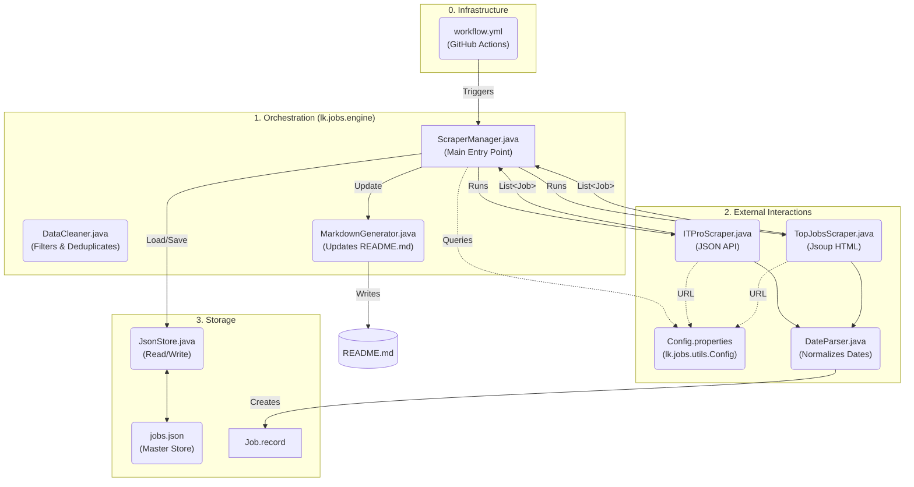

# 🇱🇰 Sri Lanka Software Engineering Jobs | 2026 Tracker [](https://t.me/SL_Software_Jobs)
Looking for software engineering jobs in Sri Lanka? This tracker updates daily with intern, junior, and senior IT roles across Colombo and beyond
Automated Software Engineering Job Tracker for Sri Lanka. Scrapes and categorizes Intern, Associate, and SE roles daily using Java (Jsoup) and GitHub Actions.

> [!TIP]
> **Help keep this project alive!** If this tool helped you find a lead today, please [**Star ⭐ the repo**](https://github.com/Senadeera-NK/sri-lanka-software-jobs). It’s how I measure the impact on our dev community! 🇱🇰

> [!IMPORTANT]
> **Automatic Staleness Purge:** The engine automatically removes listings older than **14 days**, ensuring the feed stays relevant and high-signal.

> **Live Analytics & Daily Software Job Tracker for Sri Lanka**

[📊 View Live Dashboard](https://sri-lanka-software-jobs.vercel.app/)

 
*Click the link above to see real-time trends, seniority distribution, and top hiring companies.*

## 📊 Current Job Openings
> 🟢 **Last Updated:** September 22,3:45 PM (Just now)  | **Total Jobs Found:** 123

### 🎓 Internships & Trainees  (32)

| Title | Company | Level  | Posted | Source |
| :--- | :--- | :--- | :--- | :--- |
| [Software Engineering - Intern](https://itpro.lk/job/15202/software-engineering-intern-at-everestx-technology/) | EverestX technology | Intern | 3&nbsp;hours&nbsp;ago | ITPro.lk |
| [React Js \| QA \| System Intern \| BO Intern](https://www.topjobs.lk/employer/JobAdvertismentServlet?ac=DEFZZZ&jc=0001545762&ec=DEFZZZ) | Capsicum Labs | Intern | 15&nbsp;hours&nbsp;ago | TopJobs.lk |
| [QA Intern](https://itpro.lk/job/15182/qa-intern-at-efutures/) | EFutures | Intern | Yesterday | ITPro.lk |
| [Quality Assurance Internship](https://itpro.lk/job/15175/quality-assurance-internship-at-portal-pvt-ltd/) | Portal (PVT) LTD | Intern | 2&nbsp;days&nbsp;ago | ITPro.lk |
| [Quality Assurance - Intern](https://itpro.lk/job/15173/quality-assurance-intern-at-qdesk-ai-pvt-ltd/) | Qdesk AI Pvt Ltd | Intern | 3&nbsp;days&nbsp;ago | ITPro.lk |
| [Software Engineering Intern](https://itpro.lk/job/15172/software-engineering-intern-at-ceymplon-pvt-ltd/) | Ceymplon (Pvt) Ltd | Intern | 3&nbsp;days&nbsp;ago | ITPro.lk |
| [QA Engineer Intern](https://itpro.lk/job/15156/qa-engineer-intern-at-kyranzit-pvt-ltd/) | KyranzIT Pvt Ltd | Intern | 4&nbsp;days&nbsp;ago | ITPro.lk |
| [Software Engineering - Intern](https://www.topjobs.lk/employer/JobAdvertismentServlet?ac=DEFZZZ&jc=0001550305&ec=DEFZZZ) | Gunda Power (Private) Limited | Intern | 4&nbsp;days&nbsp;ago | TopJobs.lk |
| [Software Engineering Internship](https://itpro.lk/job/15152/software-engineering-internship-at-neonlabz/) | NeonLabz | Intern | 4&nbsp;days&nbsp;ago | ITPro.lk |
| [Intern – Quality Assurance (QA)](https://itpro.lk/job/15148/intern-quality-assurance-qa-at-olee-ai-llc/) | Olee AI LLC | Intern | 4&nbsp;days&nbsp;ago | ITPro.lk |
| [Intern Software Engineer](https://itpro.lk/job/15140/intern-software-engineer-at-codimite/) | Codimite | Intern | 4&nbsp;days&nbsp;ago | ITPro.lk |
| [Quality Assurance (QA) Intern](https://itpro.lk/job/15135/quality-assurance-qa-intern-at-ranga-technologies/) | Ranga Technologies | Intern | 5&nbsp;days&nbsp;ago | ITPro.lk |
| [Intern - Mobile Development](https://www.topjobs.lk/employer/JobAdvertismentServlet?ac=0000000484&jc=0001549285&ec=0000000651) | Epic Lanka (Pvt) Ltd | Intern | 5&nbsp;days&nbsp;ago | TopJobs.lk |
| [QA Intern](https://itpro.lk/job/15125/qa-intern-at-nodezs/) | NodeZS | Intern | 5&nbsp;days&nbsp;ago | ITPro.lk |
| [Intern Software Engineer](https://itpro.lk/job/15124/intern-software-engineer-at-chiox-software-solution-llc/) | ChiOX Software Solution LLC | Intern | 5&nbsp;days&nbsp;ago | ITPro.lk |
| [Software Developer – Intern](https://itpro.lk/job/15121/software-developer-intern-at-theiavora/) | Theiavora | Intern | 6&nbsp;days&nbsp;ago | ITPro.lk |
| [Intern - Database (1)](https://www.topjobs.lk/employer/JobAdvertismentServlet?ac=0000000438&jc=0001549010&ec=0000000577) | Fortude | Intern | 6&nbsp;days&nbsp;ago | TopJobs.lk |
| [QA Intern](https://itpro.lk/job/15108/qa-intern-at-affno-asia-pacific-pvt-ltd/) | Affno Asia Pacific (Pvt) Ltd | Intern | 7&nbsp;days&nbsp;ago | ITPro.lk |
| [Software Engineer Intern - Fullstack & Mobile Development](https://www.topjobs.lk/employer/JobAdvertismentServlet?ac=DEFZZZ&jc=0001548185&ec=DEFZZZ) | Finz Labs | Intern | 7&nbsp;days&nbsp;ago | TopJobs.lk |
| [Software Engineer Intern](https://itpro.lk/job/14338/software-engineer-intern-at-epinics/) | Epinics | Intern | 8&nbsp;days&nbsp;ago | ITPro.lk |
| [Intern Software Engineer](https://itpro.lk/job/15087/intern-software-engineer-at-konekt-holdings-pvt-ltd/) | Konekt Holdings (Pvt) Ltd | Intern | 8&nbsp;days&nbsp;ago | ITPro.lk |
| [Web Developer Intern](https://www.topjobs.lk/employer/JobAdvertismentServlet?ac=DEFZZZ&jc=0001548028&ec=DEFZZZ) | Snow Soft (Pvt) Ltd | Intern | 8&nbsp;days&nbsp;ago | TopJobs.lk |
| [Intern Robotics Engineer](https://rooster.jobs/jobs/519551) | Hype Invention  | Intern | 8&nbsp;days&nbsp;ago | Rooster.jobs |
| [Quality Assurance (QA) Intern](https://itpro.lk/job/15079/quality-assurance-qa-intern-at-creativex-technology-pvt-ltd/) | CreativeX Technology Pvt Ltd | Intern | 10&nbsp;days&nbsp;ago | ITPro.lk |
| [Laravel Developer Intern - Paid Internship](https://www.topjobs.lk/employer/JobAdvertismentServlet?ac=DEFZZZ&jc=0001546656&ec=DEFZZZ) | Oonewoo Tech (Pvt) Ltd | Intern | 12&nbsp;days&nbsp;ago | TopJobs.lk |
| [Intern - Software Engineer](https://itpro.lk/job/15059/intern-software-engineer-at-earrow-pvt-ltd/) | eArrow (Pvt) LTD | Intern | 12&nbsp;days&nbsp;ago | ITPro.lk |
| [Software Engineer Intern](https://itpro.lk/job/15051/software-engineer-intern-at-samuel-gnanam-it-centre/) | Samuel Gnanam IT Centre | Intern | 13&nbsp;days&nbsp;ago | ITPro.lk |
| [Intern - Software Engineer](https://itpro.lk/job/15037/intern-software-engineer-at-sriq-corporation/) | SRIQ Corporation | Intern | 13&nbsp;days&nbsp;ago | ITPro.lk |
| [Intern - QA Engineer](https://itpro.lk/job/15034/intern-qa-engineer-at-sriq-corporation/) | SRIQ Corporation | Intern | 13&nbsp;days&nbsp;ago | ITPro.lk |
| [Intern - Software Engineering (1)](https://www.topjobs.lk/employer/JobAdvertismentServlet?ac=0000000438&jc=0001545772&ec=0000000577) | Fortude | Intern | 14&nbsp;days&nbsp;ago | TopJobs.lk |
| [Intern Software Engineer (Work From Home)](https://www.topjobs.lk/employer/JobAdvertismentServlet?ac=DEFZZZ&jc=0001545472&ec=DEFZZZ) | Yumarone Labz | Intern | 14&nbsp;days&nbsp;ago | TopJobs.lk |
| [Intern - Data Analytics](https://www.topjobs.lk/employer/JobAdvertismentServlet?ac=DEFZZZ&jc=0001545411&ec=DEFZZZ) | UTE CAT | Intern | 14&nbsp;days&nbsp;ago | TopJobs.lk |

---

### 💻 Associate & Junior/SE Roles  (67)

| Title | Company | Level  | Posted | Source |
| :--- | :--- | :--- | :--- | :--- |
| [C / C++ Programmer-Analyst](https://itpro.lk/job/15204/c-c-programmeranalyst-at-techno-ltd/) | Techno Ltd | Junior/SE | 2&nbsp;hours&nbsp;ago | ITPro.lk |
| [AI + Junior Mobile App Developer - React Native](https://www.topjobs.lk/employer/JobAdvertismentServlet?ac=DEFZZZ&jc=0001545702&ec=DEFZZZ) | Nascent Group | Junior/SE | 15&nbsp;hours&nbsp;ago | TopJobs.lk |
| [Quality Assurance Engineers](https://www.topjobs.lk/employer/JobAdvertismentServlet?ac=DEFZZZ&jc=0001545623&ec=DEFZZZ) | Prima Management Services (Pvt) Ltd | Junior/SE | 15&nbsp;hours&nbsp;ago | TopJobs.lk |
| [SQL Database Administrator (1)](https://www.topjobs.lk/employer/JobAdvertismentServlet?ac=0000000271&jc=0001533299&ec=0000000350) | CMS (Pvt) Ltd | Junior/SE | 15&nbsp;hours&nbsp;ago | TopJobs.lk |
| [Data Platform Engineer (1)](https://www.topjobs.lk/employer/JobAdvertismentServlet?ac=0000000271&jc=0001533297&ec=0000000350) | CMS (Pvt) Ltd | Junior/SE | 15&nbsp;hours&nbsp;ago | TopJobs.lk |
| [Information Security Analyst (1)](https://www.topjobs.lk/employer/JobAdvertismentServlet?ac=0000000271&jc=0001532706&ec=0000000350) | CMS (Pvt) Ltd | Junior/SE | 15&nbsp;hours&nbsp;ago | TopJobs.lk |
| [Information Security Engineer (1)](https://www.topjobs.lk/employer/JobAdvertismentServlet?ac=0000000271&jc=0001539697&ec=0000000350) | CMS (Pvt) Ltd | Junior/SE | 15&nbsp;hours&nbsp;ago | TopJobs.lk |
| [Solution Engineer / Infrastructure Automation and AI (1)](https://www.topjobs.lk/employer/JobAdvertismentServlet?ac=0000000375&jc=0001551224&ec=0000000492) | Jobfactory | Junior/SE | 15&nbsp;hours&nbsp;ago | TopJobs.lk |
| [Quality Assurance Officer (1)](https://www.topjobs.lk/employer/JobAdvertismentServlet?ac=0000000403&jc=0001550942&ec=0000000531) | Mobizz Elite (Pvt) Ltd | Junior/SE | 15&nbsp;hours&nbsp;ago | TopJobs.lk |
| [Full Stack Developer (1)](https://www.topjobs.lk/employer/JobAdvertismentServlet?ac=0000000403&jc=0001550938&ec=0000000531) | Mobizz Elite (Pvt) Ltd | Junior/SE | 15&nbsp;hours&nbsp;ago | TopJobs.lk |
| [PHP Developer - Laravel](https://itpro.lk/job/10750/php-developer-laravel-at-prime-one-global-pvt-ltd/) | Prime One Global PVT LTD | Junior/SE | 22&nbsp;hours&nbsp;ago | ITPro.lk |
| [Junior Web Developer](https://itpro.lk/job/13507/junior-web-developer-at-prime-one-global-pvt-ltd/) | Prime One Global PVT LTD | Junior/SE | 22&nbsp;hours&nbsp;ago | ITPro.lk |
| [Engineer - MLOps](https://www.topjobs.lk/employer/JobAdvertismentServlet?ac=DEFZZZ&jc=0001550512&ec=DEFZZZ) | ORYSYS Limited | Junior/SE | Yesterday | TopJobs.lk |
| [Data Analyst](https://www.topjobs.lk/employer/JobAdvertismentServlet?ac=DEFZZZ&jc=0001550692&ec=DEFZZZ) | Anationz | Junior/SE | Yesterday | TopJobs.lk |
| [Freelance - AI Specialist (50)](https://www.topjobs.lk/employer/JobAdvertismentServlet?ac=0000000148&jc=0001550679&ec=0000000180) | INNODATA LANKA (PVT) LTD | Junior/SE | Yesterday | TopJobs.lk |
| [Associate Quality Assurance Engineer](https://itpro.lk/job/15183/associate-quality-assurance-engineer-at-kangaro-tech/) | Kangaro Tech | Associate | Yesterday | ITPro.lk |
| [Software Developer](https://itpro.lk/job/15177/software-developer-at-sathuta-international-pvt-ltd/) | Sathuta International (Pvt) Ltd | Junior/SE | 2&nbsp;days&nbsp;ago | ITPro.lk |
| [Associate QA Engineer – Automation](https://itpro.lk/job/15155/associate-qa-engineer-automation-at-layoutindex/) | LAYOUTindex | Associate | 4&nbsp;days&nbsp;ago | ITPro.lk |
| [Junior C++ Developer - Full Time](https://www.topjobs.lk/employer/JobAdvertismentServlet?ac=DEFZZZ&jc=0001550004&ec=DEFZZZ) | Elsteel (Pvt) Ltd | Junior/SE | 4&nbsp;days&nbsp;ago | TopJobs.lk |
| [Full Stack Software Engineer](https://itpro.lk/job/15146/full-stack-software-engineer-at-garlic-collective/) | Garlic Collective | Junior/SE | 4&nbsp;days&nbsp;ago | ITPro.lk |
| [Junior Software Engineer](https://itpro.lk/job/15145/junior-software-engineer-at-ehealthcare-solutions-pvt-ltd/) | eHealthcare Solutions (Pvt) Ltd | Junior/SE | 4&nbsp;days&nbsp;ago | ITPro.lk |
| [.NET Full-stack Developer / Software Engineer](https://itpro.lk/job/14720/net-fullstack-developer-software-engineer-at-goodhope-asia-holdings-ltd/) | Goodhope Asia Holdings Ltd | Junior/SE | 5&nbsp;days&nbsp;ago | ITPro.lk |
| [Web Developer](https://itpro.lk/job/15132/web-developer-at-10x-creative-pvt-ltd/) | 10x Creative (Pvt) Ltd | Junior/SE | 5&nbsp;days&nbsp;ago | ITPro.lk |
| [QA Engineer](https://itpro.lk/job/15130/qa-engineer-at-itechnology-australia/) | iTechnology Australia | Junior/SE | 5&nbsp;days&nbsp;ago | ITPro.lk |
| [Data Engineer (1)](https://www.topjobs.lk/employer/JobAdvertismentServlet?ac=0000000280&jc=0001549228&ec=0000000510) | Expolanka Freight (Pvt) Ltd | Junior/SE | 5&nbsp;days&nbsp;ago | TopJobs.lk |
| [Associate QA](https://itpro.lk/job/15129/associate-qa-at-ranga-technologies/) | Ranga Technologies | Associate | 5&nbsp;days&nbsp;ago | ITPro.lk |
| [Associate Software Engineer - Next.js (Full Stack)](https://itpro.lk/job/15128/associate-software-engineer-nextjs-full-stack-at-kangaro-tech/) | Kangaro Tech | Associate | 5&nbsp;days&nbsp;ago | ITPro.lk |
| [Associate Software Engineer](https://itpro.lk/job/15123/associate-software-engineer-at-chiox-software-solution-llc/) | ChiOX Software Solution LLC | Associate | 5&nbsp;days&nbsp;ago | ITPro.lk |
| [Full Stack Developer](https://itpro.lk/job/15122/full-stack-developer-at-kd-marketing-group/) | KD Marketing Group | Junior/SE | 6&nbsp;days&nbsp;ago | ITPro.lk |
| [Software Engineer – Full Stack](https://itpro.lk/job/15114/software-engineer-full-stack-at-hatchyard/) | Hatchyard | Junior/SE | 6&nbsp;days&nbsp;ago | ITPro.lk |
| [Junior Full Stack Developer](https://www.topjobs.lk/employer/JobAdvertismentServlet?ac=DEFZZZ&jc=0001543734&ec=DEFZZZ) | Company Name Withheld | Junior/SE | 6&nbsp;days&nbsp;ago | TopJobs.lk |
| [Software Engineer](https://www.topjobs.lk/employer/JobAdvertismentServlet?ac=DEFZZZ&jc=0001543718&ec=DEFZZZ) | Company Name Withheld | Junior/SE | 6&nbsp;days&nbsp;ago | TopJobs.lk |
| [IT Executive - Virtualization & Cloud Infrastructure](https://www.topjobs.lk/employer/JobAdvertismentServlet?ac=DEFZZZ&jc=0001548724&ec=DEFZZZ) | Cargills Bank PLC | Junior/SE | 6&nbsp;days&nbsp;ago | TopJobs.lk |
| [Associate Engineer - Business Intelligence (1)](https://www.topjobs.lk/employer/JobAdvertismentServlet?ac=0000000280&jc=0001548692&ec=0000000510) | Expolanka Freight (Pvt) Ltd | Associate | 6&nbsp;days&nbsp;ago | TopJobs.lk |
| [Database Administrator (DBA)](https://www.topjobs.lk/employer/JobAdvertismentServlet?ac=DEFZZZ&jc=0001548633&ec=DEFZZZ) | Company Name With Held | Junior/SE | 6&nbsp;days&nbsp;ago | TopJobs.lk |
| [Software Developer](https://www.topjobs.lk/employer/JobAdvertismentServlet?ac=DEFZZZ&jc=0001548572&ec=DEFZZZ) | Sathuta Builders (Pvt) Ltd | Junior/SE | 6&nbsp;days&nbsp;ago | TopJobs.lk |
| [Backend Developer](https://www.topjobs.lk/employer/JobAdvertismentServlet?ac=DEFZZZ&jc=0001548797&ec=DEFZZZ) | True Foam (Pvt) Ltd | Junior/SE | 6&nbsp;days&nbsp;ago | TopJobs.lk |
| [Software Engineer - Java](https://itpro.lk/job/14104/software-engineer-java-at-directfn/) | DirectFN | Junior/SE | 7&nbsp;days&nbsp;ago | ITPro.lk |
| [DevOps Engineer](https://www.topjobs.lk/employer/JobAdvertismentServlet?ac=DEFZZZ&jc=0001548310&ec=DEFZZZ) | X-Venture Global Solutions (Pvt) Ltd | Junior/SE | 7&nbsp;days&nbsp;ago | TopJobs.lk |
| [DevOps Trainee](https://www.topjobs.lk/employer/JobAdvertismentServlet?ac=DEFZZZ&jc=0001548303&ec=DEFZZZ) | X-Venture Global Solutions (Pvt) Ltd | Associate | 7&nbsp;days&nbsp;ago | TopJobs.lk |
| [Junior Trainee Software Developer](https://www.topjobs.lk/employer/JobAdvertismentServlet?ac=DEFZZZ&jc=0001548281&ec=DEFZZZ) | Hedanship Asia Pvt Ltd | Associate | 7&nbsp;days&nbsp;ago | TopJobs.lk |
| [QA Engineer](https://www.topjobs.lk/employer/JobAdvertismentServlet?ac=0000000484&jc=0001548399&ec=0000000651) | Epic Lanka (Pvt) Ltd | Junior/SE | 7&nbsp;days&nbsp;ago | TopJobs.lk |
| [.NET Core C# Developer - Mid Level](https://itpro.lk/job/15096/net-core-c-developer-mid-level-at-waterlily-labs/) | Waterlily Labs | Junior/SE | 8&nbsp;days&nbsp;ago | ITPro.lk |
| [Software Engineer (.NET / React)](https://itpro.lk/job/14197/software-engineer-net-react-at-verdentra/) | Verdentra | Junior/SE | 8&nbsp;days&nbsp;ago | ITPro.lk |
| [QA Engineer - Trainee/ Associate](https://itpro.lk/job/15089/qa-engineer-trainee-associate-at-enhanzer/) | Enhanzer | Associate | 8&nbsp;days&nbsp;ago | ITPro.lk |
| [Associate Software Engineer (1)](https://www.topjobs.lk/employer/JobAdvertismentServlet?ac=0000000375&jc=0001547769&ec=0000000492) | Jobfactory | Associate | 8&nbsp;days&nbsp;ago | TopJobs.lk |
| [Software Engineer - Full Stack (1)](https://www.topjobs.lk/employer/JobAdvertismentServlet?ac=0000000492&jc=0001547959&ec=0000000661) | DirectFN | Junior/SE | 8&nbsp;days&nbsp;ago | TopJobs.lk |
| [Software Engineer JAVA (1)](https://www.topjobs.lk/employer/JobAdvertismentServlet?ac=0000000492&jc=0001547960&ec=0000000661) | DirectFN | Junior/SE | 8&nbsp;days&nbsp;ago | TopJobs.lk |
| [Mobile Developer - iOS (1)](https://www.topjobs.lk/employer/JobAdvertismentServlet?ac=0000000492&jc=0001547956&ec=0000000661) | DirectFN | Junior/SE | 8&nbsp;days&nbsp;ago | TopJobs.lk |
| [AI Developer](https://www.topjobs.lk/employer/JobAdvertismentServlet?ac=DEFZZZ&jc=0001547800&ec=DEFZZZ) | SME Bizness (Pvt) Ltd | Junior/SE | 8&nbsp;days&nbsp;ago | TopJobs.lk |
| [Embedded Engineer](https://rooster.jobs/jobs/519556) | Atlas Labs | Junior/SE | 8&nbsp;days&nbsp;ago | Rooster.jobs |
| [Associate Embedded Engineer](https://rooster.jobs/jobs/519555) | Atlas Labs | Associate | 8&nbsp;days&nbsp;ago | Rooster.jobs |
| [Android Quality Assurance (QA) Engineer](https://itpro.lk/job/15083/android-quality-assurance-qa-engineer-at-lakmini-international-pvt-ltd/) | Lakmini International (Pvt) Ltd | Junior/SE | 8&nbsp;days&nbsp;ago | ITPro.lk |
| [Web Developers (BPO)](https://www.topjobs.lk/employer/JobAdvertismentServlet?ac=DEFZZZ&jc=0001544352&ec=DEFZZZ) | eBEYONDS | Junior/SE | 9&nbsp;days&nbsp;ago | TopJobs.lk |
| [Associate Quality Assurance Engineer](https://www.topjobs.lk/employer/JobAdvertismentServlet?ac=DEFZZZ&jc=0001544524&ec=DEFZZZ) | eBEYONDS | Associate | 9&nbsp;days&nbsp;ago | TopJobs.lk |
| [Associate Software Engineer](https://itpro.lk/job/15075/associate-software-engineer-at-activ8-asia/) | Activ8 Asia | Associate | 10&nbsp;days&nbsp;ago | ITPro.lk |
| [Associate Software Engineer](https://www.topjobs.lk/employer/JobAdvertismentServlet?ac=DEFZZZ&jc=0001547242&ec=DEFZZZ) | Activ8 Asia (Pvt) Ltd | Associate | 11&nbsp;days&nbsp;ago | TopJobs.lk |
| [Data Analyst \| IT](https://www.topjobs.lk/employer/JobAdvertismentServlet?ac=DEFZZZ&jc=0001547145&ec=DEFZZZ) | Techome Technologies (Pvt) Ltd | Junior/SE | 11&nbsp;days&nbsp;ago | TopJobs.lk |
| [Associate Software Engineer - Department of IT](https://www.topjobs.lk/employer/JobAdvertismentServlet?ac=DEFZZZ&jc=0001547059&ec=DEFZZZ) | Sri Lanka Institute of Information Technology (SLIIT) | Associate | 11&nbsp;days&nbsp;ago | TopJobs.lk |
| [Associate Software Engineer (GDS Specialized Mandatory)](https://rooster.jobs/jobs/519543) | LUXURY EVENTS AND VIP TRAVEL FZCO | Associate | 11&nbsp;days&nbsp;ago | Rooster.jobs |
| [Data Engineer (2 Years FTC) (1)](https://www.topjobs.lk/employer/JobAdvertismentServlet?ac=0000000160&jc=0001546664&ec=0000000192) | Michelin | Junior/SE | 12&nbsp;days&nbsp;ago | TopJobs.lk |
| [Associate Software Engineer](https://itpro.lk/job/15058/associate-software-engineer-at-earrow-pvt-ltd/) | eArrow (Pvt) LTD | Associate | 12&nbsp;days&nbsp;ago | ITPro.lk |
| [Associate Software Engineer (Backend)](https://itpro.lk/job/15053/associate-software-engineer-backend-at-newnop/) | NEWNOP | Associate | 13&nbsp;days&nbsp;ago | ITPro.lk |
| [AI / MACHINE LEARNING ENGINEER (1)](https://www.topjobs.lk/employer/JobAdvertismentServlet?ac=0000000023&jc=0001546026&ec=0000000023) | Maritime Placements (Pvt) Ltd | Junior/SE | 13&nbsp;days&nbsp;ago | TopJobs.lk |
| [Software Engineer (Backend)](https://itpro.lk/job/15040/software-engineer-backend-at-ucombinator/) | Ucombinator | Junior/SE | 13&nbsp;days&nbsp;ago | ITPro.lk |
| [Associate QA Engineer (Project Basis)](https://itpro.lk/job/15028/associate-qa-engineer-project-basis-at-webtezza-pvt-ltd/) | Webtezza (Pvt) Ltd | Associate | 14&nbsp;days&nbsp;ago | ITPro.lk |
| [Remote Voicebot Developer & Tester](https://www.topjobs.lk/employer/JobAdvertismentServlet?ac=DEFZZZ&jc=0001540550&ec=DEFZZZ) | Company Name Withheld | Junior/SE | 14&nbsp;days&nbsp;ago | TopJobs.lk |

---

### 🚀 Senior & Lead Roles  (24)

| Title | Company | Level  | Posted | Source |
| :--- | :--- | :--- | :--- | :--- |
| [Senior Backend Engineer – Node.js / NestJS](https://itpro.lk/job/15198/senior-backend-engineer-nodejs-nestjs-at-celestial-bi/) | Celestial BI | Senior | 7&nbsp;hours&nbsp;ago | ITPro.lk |
| [Senior Frontend Engineer – React / Next.js](https://itpro.lk/job/15197/senior-frontend-engineer-react-nextjs-at-celestial-bi/) | Celestial BI | Senior | 7&nbsp;hours&nbsp;ago | ITPro.lk |
| [Software Engineer - Web \| Senior Software Engineer - Web & ...](https://www.topjobs.lk/employer/JobAdvertismentServlet?ac=DEFZZZ&jc=0001547485&ec=DEFZZZ) | Afisol (Pvt) Ltd | Senior | 15&nbsp;hours&nbsp;ago | TopJobs.lk |
| [Senior Mobile App Developer (1)](https://www.topjobs.lk/employer/JobAdvertismentServlet?ac=0000000001&jc=0001550210&ec=0000000001) | Genesiis Software Pvt Ltd | Senior | 15&nbsp;hours&nbsp;ago | TopJobs.lk |
| [Senior Software Engineer (Solutions)](https://itpro.lk/job/15191/senior-software-engineer-solutions-at-chakray-consulting/) | Chakray Consulting | Senior | 21&nbsp;hours&nbsp;ago | ITPro.lk |
| [Senior Software Engineer Java](https://itpro.lk/job/15190/senior-software-engineer-java-at-directfn/) | DirectFN | Senior | 21&nbsp;hours&nbsp;ago | ITPro.lk |
| [Senior Data Engineer](https://www.topjobs.lk/employer/JobAdvertismentServlet?ac=DEFZZZ&jc=0001550510&ec=DEFZZZ) | ORYSYS Limited | Senior | Yesterday | TopJobs.lk |
| [Senior Data Scientist](https://www.topjobs.lk/employer/JobAdvertismentServlet?ac=DEFZZZ&jc=0001550507&ec=DEFZZZ) | ORYSYS Limited | Senior | Yesterday | TopJobs.lk |
| [WordPress Web Developer -Lead](https://itpro.lk/job/13423/wordpress-web-developer-lead-at-kd-associates-buffalo-inc/) | KD Associates Buffalo Inc | Senior | 4&nbsp;days&nbsp;ago | ITPro.lk |
| [Senior QA Engineer](https://itpro.lk/job/15113/senior-qa-engineer-at-nodezs/) | NodeZS | Senior | 6&nbsp;days&nbsp;ago | ITPro.lk |
| [Senior Quality Engineer](https://itpro.lk/job/14312/senior-quality-engineer-at-hatchyard/) | Hatchyard | Senior | 6&nbsp;days&nbsp;ago | ITPro.lk |
| [Senior Software Developer (Project Basis)](https://itpro.lk/job/15112/senior-software-developer-project-basis-at-webtezza-pvt-ltd/) | Webtezza (Pvt) Ltd | Senior | 6&nbsp;days&nbsp;ago | ITPro.lk |
| [Senior Full Stack Engineer](https://www.topjobs.lk/employer/JobAdvertismentServlet?ac=DEFZZZ&jc=0001543731&ec=DEFZZZ) | Company Name Withheld | Senior | 6&nbsp;days&nbsp;ago | TopJobs.lk |
| [Senior Engineer - Business Intelligence (1)](https://www.topjobs.lk/employer/JobAdvertismentServlet?ac=0000000280&jc=0001548693&ec=0000000510) | Expolanka Freight (Pvt) Ltd | Senior | 6&nbsp;days&nbsp;ago | TopJobs.lk |
| [Senior Linux Server Administrator (Enterprise Systems & Data...](https://www.topjobs.lk/employer/JobAdvertismentServlet?ac=DEFZZZ&jc=0001548637&ec=DEFZZZ) | Company Name With Held | Senior | 6&nbsp;days&nbsp;ago | TopJobs.lk |
| [AI-First SaaS Operations & Delivery Lead (1)](https://www.topjobs.lk/employer/JobAdvertismentServlet?ac=0000000375&jc=0001549094&ec=0000000492) | Jobfactory | Senior | 6&nbsp;days&nbsp;ago | TopJobs.lk |
| [Tech Lead Java (1)](https://www.topjobs.lk/employer/JobAdvertismentServlet?ac=0000000492&jc=0001547958&ec=0000000661) | DirectFN | Senior | 8&nbsp;days&nbsp;ago | TopJobs.lk |
| [Senior QA Automation Engineer](https://itpro.lk/job/15072/senior-qa-automation-engineer-at-bridge-business-support-solutions/) | Bridge Business Support Solutions | Senior | 11&nbsp;days&nbsp;ago | ITPro.lk |
| [AI Engineer \| Senior AI Engineer - India (Remote)](https://www.topjobs.lk/employer/JobAdvertismentServlet?ac=DEFZZZ&jc=0001546898&ec=DEFZZZ) | HRC Labs | Senior | 12&nbsp;days&nbsp;ago | TopJobs.lk |
| [Senior Data Engineer - India (Remote)](https://www.topjobs.lk/employer/JobAdvertismentServlet?ac=DEFZZZ&jc=0001546897&ec=DEFZZZ) | HRC Labs | Senior | 12&nbsp;days&nbsp;ago | TopJobs.lk |
| [Senior Software Engineer (Backend)](https://itpro.lk/job/15041/senior-software-engineer-backend-at-ucombinator/) | Ucombinator | Senior | 13&nbsp;days&nbsp;ago | ITPro.lk |
| [Senior Fullstack Engineer](https://itpro.lk/job/15039/senior-fullstack-engineer-at-ucombinator/) | Ucombinator | Senior | 13&nbsp;days&nbsp;ago | ITPro.lk |
| [Senior Quality Engineer](https://itpro.lk/job/15038/senior-quality-engineer-at-ucombinator/) | Ucombinator | Senior | 13&nbsp;days&nbsp;ago | ITPro.lk |
| [Senior Software Engineer (Remote)](https://www.topjobs.lk/employer/JobAdvertismentServlet?ac=DEFZZZ&jc=0001545352&ec=DEFZZZ) | Xact Accounting | Senior | 14&nbsp;days&nbsp;ago | TopJobs.lk |

---


## 🛠️ How it Works
1. **Engine:** A Java 21 console application using **Jsoup**.
2. **Sources:** Currently scraping `ITPro.lk` and  `TopJobs`. Support for and `Rooster.jobs` is under development (Contributors welcome!)
3. **Automation:** Runs every 12 hours via **GitHub Actions**.
4. **Storage:** Updates this `README.md` and a `jobs.json` file automatically.

<details>
<summary><b>📐 View High-Level Architecture Diagram</b></summary>
    

```mermaid
graph TD
    %% Main Orchestration Class
    subgraph Engine ["1. Orchestration (lk.jobs.engine)"]
        ScraperManager["ScraperManager.java<br/>(Main Entry Point)"]
        Cleaner("DataCleaner.java<br/>(Filters & Deduplicates)")
        Markdown("MarkdownGenerator.java<br/>(Updates README.md)")
    end

    %% External Interactions / Data Sources
    subgraph Scrapers ["2. External Interactions"]
        Config("Config.properties<br/>(lk.jobs.utils.Config)")
        ITPro("ITProScraper.java<br/>(JSON API)")
        TopJobs("TopJobsScraper.java<br/>(Jsoup HTML)")
        DParser("DateParser.java<br/>(Normalizes Dates)")
    end

    %% Data Flow & Persistence
    subgraph Storage ["3. Storage"]
        Json("jobs.json<br/>(Master Store)")
        JsonStore("JsonStore.java<br/>(Read/Write)")
        JobModel["Job.record"]
    end

    %% Workflow Orchestration
    subgraph Infrastructure ["0. Infrastructure"]
        WF("workflow.yml<br/>(GitHub Actions)")
    end

    %% Connective Flow
    WF -- "Triggers" --> ScraperManager
    ScraperManager -. "Queries" .-> Config
    ITPro -. "URL" .-> Config
    TopJobs -. "URL" .-> Config
    
    ScraperManager -- "Runs" --> ITPro
    ScraperManager -- "Runs" --> TopJobs
    
    ITPro --> DParser
    TopJobs --> DParser
    DParser -- "Creates" --> JobModel
    
    ITPro -- "List&lt;Job&gt;" --> ScraperManager
    TopJobs -- "List&lt;Job&gt;" --> ScraperManager

    ScraperManager -- "Load/Save" --> JsonStore
    JsonStore <--> Json
    
    ScraperManager -- "Update" --> Markdown
    Markdown -- "Writes" --> README[(README.md)]
```

</details>

<details>
<summary><b>📂 View Project Structure</b></summary>

```text
src/main/java/lk/jobs/
├── engine/           # Logic for sorting, cleaning, and README updates
├── model/            # Data models (Job Record)
├── scrapers/         # Individual site scrapers
└── utils/            # JSON and Date parsing utilities
```
</details>

## 🚀 Usage
If you want to run the scraper locally:
1. Clone the repo.
2. Ensure you have **JDK 21** and **Maven** installed.
3. Run: mvn clean compile exec:java -Dexec.mainClass="lk.jobs.engine.ScraperManager"

## 🤝 Contributing
Contributions are what make the open-source community such an amazing place to learn, inspire, and create.
Any contributions you make are **greatly appreciated**.

* **Found a bug?** Open an [Issue](https://github.com/Senadeera-NK/sl-software-engineering-jobs/issues).
* **Want to add a new site?** Check out our [Contributing Guidelines](CONTRIBUTING.md) to see how to implement a new scraper.
* **Missing a job?** Feel free to submit a Pull Request to manually update the table!
