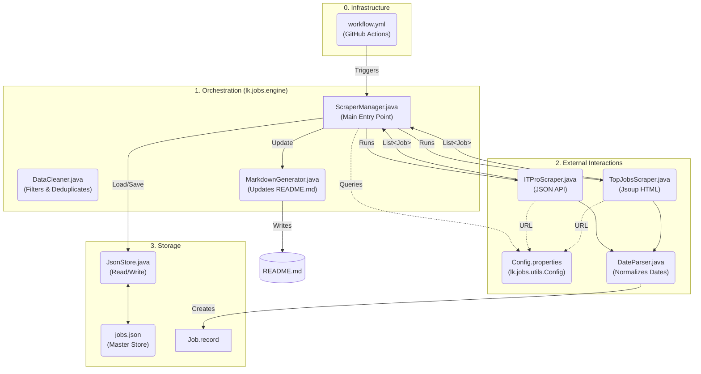

# 🇱🇰 Sri Lanka Software Engineering Jobs | 2026 Tracker [](https://t.me/SL_Software_Jobs)
Looking for software engineering jobs in Sri Lanka? This tracker updates daily with intern, junior, and senior IT roles across Colombo and beyond
Automated Software Engineering Job Tracker for Sri Lanka. Scrapes and categorizes Intern, Associate, and SE roles daily using Java (Jsoup) and GitHub Actions.

> [!TIP]
> **Help keep this project alive!** If this tool helped you find a lead today, please [**Star ⭐ the repo**](https://github.com/Senadeera-NK/sri-lanka-software-jobs). It’s how I measure the impact on our dev community! 🇱🇰

> [!IMPORTANT]
> **Automatic Staleness Purge:** The engine automatically removes listings older than **14 days**, ensuring the feed stays relevant and high-signal.

> **Live Analytics & Daily Software Job Tracker for Sri Lanka**

[📊 View Live Dashboard](https://sri-lanka-software-jobs.vercel.app/)

 
*Click the link above to see real-time trends, seniority distribution, and top hiring companies.*

## 📊 Current Job Openings
> 🟢 **Last Updated:** May 26,7:46 PM (Just now)  | **Total Jobs Found:** 219

### 🎓 Internships & Trainees  (28)

| Title | Company | Level  | Posted | Source |
| :--- | :--- | :--- | :--- | :--- |
| [Intern - QA](https://xpress.jobs/jobs/view/284564) | XpressJobs | Intern | 1&nbsp;mins&nbsp;ago | XpressJobs |
| [Android Developer Intern \| Paid Onsite](https://xpress.jobs/jobs/view/290297) | Era Biz Solutions (Pvt) Ltd | Intern | 1&nbsp;mins&nbsp;ago | XpressJobs |
| [Intern - Information Security](https://xpress.jobs/jobs/view/291210) | NDB Bank | Intern | 2&nbsp;mins&nbsp;ago | XpressJobs |
| [Software Engineer - Intern](https://itpro.lk/job/13839/software-engineer-intern-at-d-help-hub-private-limited/) | D HELP HUB Private Limited | Intern | 8&nbsp;hours&nbsp;ago | ITPro.lk |
| [Full-Stack Web Development Intern (Laravel/PHP)](https://itpro.lk/job/13838/fullstack-web-development-intern-laravelphp-at-loopz-global-pvt-ltd/) | Loopz Global (Pvt) Ltd | Intern | 9&nbsp;hours&nbsp;ago | ITPro.lk |
| [Software Engineer – Intern (Spring Boot/React)](https://itpro.lk/job/13827/software-engineer-intern-spring-bootreact-at-silverline-it/) | Silverline IT | Intern | 14&nbsp;hours&nbsp;ago | ITPro.lk |
| [Flutter Intern](https://xpress.jobs/jobs/view/289421) | Era Biz Solutions (Pvt) Ltd | Intern | 23&nbsp;hours&nbsp;ago | XpressJobs |
| [Intern - Cloud Solutions](https://www.topjobs.lk/employer/JobAdvertismentServlet?ac=DEFZZZ&jc=0001503044&ec=DEFZZZ) | VitalHub Innovations Lab | Intern | Yesterday | TopJobs.lk |
| [QA-Intern](https://itpro.lk/job/13812/qaintern-at-everestx-technologies/) | EverestX Technologies | Intern | 3&nbsp;days&nbsp;ago | ITPro.lk |
| [Software Engineering Intern](https://itpro.lk/job/13806/software-engineering-intern-at-quantum-plus/) | Quantum Plus | Intern | 4&nbsp;days&nbsp;ago | ITPro.lk |
| [Intern - Software Engineer](https://itpro.lk/job/13800/intern-software-engineer-at-infinity-innovators/) | Infinity Innovators | Intern | 5&nbsp;days&nbsp;ago | ITPro.lk |
| [Automation & AI Solutions Intern (1)](https://www.topjobs.lk/employer/JobAdvertismentServlet?ac=0000000060&jc=0001503138&ec=0000000064) | MJF Group | Intern | 6&nbsp;days&nbsp;ago | TopJobs.lk |
| [Software Quality Assurance - Intern](https://itpro.lk/job/13787/software-quality-assurance-intern-at-qdesk-ai-pvt-ltd/) | Qdesk AI Pvt Ltd | Intern | 6&nbsp;days&nbsp;ago | ITPro.lk |
| [Software Engineering - Intern](https://itpro.lk/job/13786/software-engineering-intern-at-qdesk-ai-pvt-ltd/) | Qdesk AI Pvt Ltd | Intern | 6&nbsp;days&nbsp;ago | ITPro.lk |
| [Intern - QA](https://itpro.lk/job/13778/intern-qa-at-treinetic/) | Treinetic | Intern | 7&nbsp;days&nbsp;ago | ITPro.lk |
| [Intern – Full Stack Developer](https://itpro.lk/job/13769/intern-full-stack-developer-at-phoenix-industries/) | Phoenix Industries | Intern | 8&nbsp;days&nbsp;ago | ITPro.lk |
| [Associate Business Analyst \| Scrum Master Intern \| Associa...](https://www.topjobs.lk/employer/JobAdvertismentServlet?ac=DEFZZZ&jc=0001501862&ec=DEFZZZ) | CSG Technologies | Intern | 8&nbsp;days&nbsp;ago | TopJobs.lk |
| [Quality Assurance (QA) Intern](https://itpro.lk/job/13762/quality-assurance-qa-intern-at-loopz-global-pvt-ltd/) | Loopz Global (Pvt) Ltd | Intern | 8&nbsp;days&nbsp;ago | ITPro.lk |
| [QA Intern](https://itpro.lk/job/13759/qa-intern-at-xennex/) | Xennex | Intern | 9&nbsp;days&nbsp;ago | ITPro.lk |
| [Intern / Junior Mobile App Developer (Android & iOS)](https://www.topjobs.lk/employer/JobAdvertismentServlet?ac=DEFZZZ&jc=0001500944&ec=DEFZZZ) | Company Name Withheld | Intern | 11&nbsp;days&nbsp;ago | TopJobs.lk |
| [Intern - Software Engineering](https://rooster.jobs/jobs/517535) | Zegates International Private Limited | Intern | 11&nbsp;days&nbsp;ago | Rooster.jobs |
| [Intern / Trainee Website Developer](https://xpress.jobs/jobs/view/281911) | TecRocket Space | Intern | 12&nbsp;days&nbsp;ago | XpressJobs |
| [Intern Quality Assurance Engineer](https://itpro.lk/job/13738/intern-quality-assurance-engineer-at-infinity-innovators/) | Infinity Innovators | Intern | 13&nbsp;days&nbsp;ago | ITPro.lk |
| [Intern Full Stack Engineer](https://itpro.lk/job/13736/intern-full-stack-engineer-at-senova-global-pvt-ltd/) | Senova Global (Pvt) Ltd | Intern | 13&nbsp;days&nbsp;ago | ITPro.lk |
| [Quality Assurance Intern](https://itpro.lk/job/13516/quality-assurance-intern-at-nippon-it-and-educational-solution-nites/) | Nippon IT and Educational Solution (NITES) | Intern | 13&nbsp;days&nbsp;ago | ITPro.lk |
| [Intern - QA](https://www.topjobs.lk/employer/JobAdvertismentServlet?ac=0000000484&jc=0001494865&ec=0000000651) | Epic Lanka (Pvt) Ltd | Intern | 13&nbsp;days&nbsp;ago | TopJobs.lk |
| [Senior Java Full Stack Developer - Financial Internet Banking](https://www.topjobs.lk/employer/JobAdvertismentServlet?ac=DEFZZZ&jc=0001499416&ec=DEFZZZ) | Fortuna Global | Intern | 14&nbsp;days&nbsp;ago | TopJobs.lk |
| [Frontend Developer Internship](https://itpro.lk/job/13720/frontend-developer-internship-at-ranga-technologies-pinegen-ai/) | Ranga Technologies (PineGen AI) | Intern | 14&nbsp;days&nbsp;ago | ITPro.lk |

---

### 💻 Associate & Junior/SE Roles  (120)

| Title | Company | Level  | Posted | Source |
| :--- | :--- | :--- | :--- | :--- |
| [Head of Information Security](https://xpress.jobs/jobs/view/288919) | SMB Finance PLC | Junior/SE | 1&nbsp;mins&nbsp;ago | XpressJobs |
| [Database Administrator - Oracle](https://xpress.jobs/jobs/view/289133) | Melsta Technologies (Pvt) Ltd | Junior/SE | 1&nbsp;mins&nbsp;ago | XpressJobs |
| [Head of Cyber Security Governance and Compliance](https://xpress.jobs/jobs/view/289342) | Dialog Axiata PLC | Junior/SE | 1&nbsp;mins&nbsp;ago | XpressJobs |
| [Associate Dev Ops Lead](https://xpress.jobs/jobs/view/289349) | Dialog Axiata PLC | Associate | 1&nbsp;mins&nbsp;ago | XpressJobs |
| [Junior Quality Assurance Engineer](https://xpress.jobs/jobs/view/289508) | Davton Limited | Junior/SE | 1&nbsp;mins&nbsp;ago | XpressJobs |
| [Software Engineer / ABAP Developer](https://xpress.jobs/jobs/view/289538) | Lanka Walltiles PLC | Junior/SE | 1&nbsp;mins&nbsp;ago | XpressJobs |
| [Primavera P6 Engineer \| Remote](https://xpress.jobs/jobs/view/289803) | Businessfocus360 | Junior/SE | 1&nbsp;mins&nbsp;ago | XpressJobs |
| [Software Engineers](https://xpress.jobs/jobs/view/290236) | Data Management Systems (Pvt) Ltd | Junior/SE | 1&nbsp;mins&nbsp;ago | XpressJobs |
| [QA Engineer (US Working Hours)](https://xpress.jobs/jobs/view/290271) | Innobot | Junior/SE | 1&nbsp;mins&nbsp;ago | XpressJobs |
| [Software Engineer (Python)](https://xpress.jobs/jobs/view/290274) | Innobot | Junior/SE | 1&nbsp;mins&nbsp;ago | XpressJobs |
| [Hayleys Lifesciences \| Executive / Junior Executive - Infor...](https://xpress.jobs/jobs/view/290714) | Hayleys Aventura (Pvt) Ltd | Junior/SE | 1&nbsp;mins&nbsp;ago | XpressJobs |
| [WordPress Developer](https://xpress.jobs/jobs/view/281093) | Apex Consulting | Junior/SE | 1&nbsp;mins&nbsp;ago | XpressJobs |
| [QA Engineer](https://xpress.jobs/jobs/view/290765) | Innobot | Junior/SE | 2&nbsp;mins&nbsp;ago | XpressJobs |
| [IT Helpdesk Engineer \| Awissawella](https://xpress.jobs/jobs/view/290786) | Micronet Global Services (Pvt) Ltd | Junior/SE | 2&nbsp;mins&nbsp;ago | XpressJobs |
| [AI and Automation Engineer](https://xpress.jobs/jobs/view/291297) | TGT Global | Junior/SE | 2&nbsp;mins&nbsp;ago | XpressJobs |
| [Security Analyst](https://xpress.jobs/jobs/view/291304) | TGT Global | Junior/SE | 2&nbsp;mins&nbsp;ago | XpressJobs |
| [Fullstack Software Engineer](https://itpro.lk/job/13842/fullstack-software-engineer-at-univiser/) | UNIVISER | Junior/SE | 6&nbsp;hours&nbsp;ago | ITPro.lk |
| [QA Engineers (Manual Testing / Automation Testing)](https://itpro.lk/job/13836/qa-engineers-manual-testing-automation-testing-at-enhanzer/) | Enhanzer | Junior/SE | 9&nbsp;hours&nbsp;ago | ITPro.lk |
| [Head of AI](https://xpress.jobs/jobs/view/288395) | Omobio | Junior/SE | 23&nbsp;hours&nbsp;ago | XpressJobs |
| [Enterprise Solution Architect](https://xpress.jobs/jobs/view/288471) | Ernst & Young | Junior/SE | 23&nbsp;hours&nbsp;ago | XpressJobs |
| [Trainee - Data Analytics](https://xpress.jobs/jobs/view/288754) | Credit Information Bureau of Sri Lanka | Associate | 23&nbsp;hours&nbsp;ago | XpressJobs |
| [Associate Software Engineer .NET](https://itpro.lk/job/13824/associate-software-engineer-net-at-xigenix/) | XigeniX | Associate | Yesterday | ITPro.lk |
| [WordPress Developer (DIVI Theme) \| Work From Home](https://xpress.jobs/jobs/view/288245) | Aswin WebDesign | Junior/SE | Yesterday | XpressJobs |
| [ Manual Software Tester (Mid-Level) ](https://itpro.lk/job/13820/-manual-software-tester-midlevel-at-pina-vida/) | Pina Vida | Junior/SE | Yesterday | ITPro.lk |
| [Junior Embedded Software Engineer (Security - Focused)](https://www.topjobs.lk/employer/JobAdvertismentServlet?ac=DEFZZZ&jc=0001500312&ec=DEFZZZ) | Thakshana Technologies (Private) Limited | Junior/SE | Yesterday | TopJobs.lk |
| [Full Stack Developer - React & .Net](https://www.topjobs.lk/employer/JobAdvertismentServlet?ac=DEFZZZ&jc=0001499200&ec=DEFZZZ) | Ateam Software ( Pvt ) Ltd | Junior/SE | Yesterday | TopJobs.lk |
| [Data Engineer](https://www.topjobs.lk/employer/JobAdvertismentServlet?ac=DEFZZZ&jc=0001499197&ec=DEFZZZ) | ATeam Software | Junior/SE | Yesterday | TopJobs.lk |
| [Junior Algorithm Engineer - DSP - FPGA Engineer](https://www.topjobs.lk/employer/JobAdvertismentServlet?ac=DEFZZZ&jc=0001501331&ec=DEFZZZ) | Company Name Withheld | Junior/SE | Yesterday | TopJobs.lk |
| [Quality Assurance Engineer](https://www.topjobs.lk/employer/JobAdvertismentServlet?ac=DEFZZZ&jc=0001502563&ec=DEFZZZ) | Medfuture | Junior/SE | Yesterday | TopJobs.lk |
| [DevOps Engineers](https://www.topjobs.lk/employer/JobAdvertismentServlet?ac=DEFZZZ&jc=0001499984&ec=DEFZZZ) | eBEYONDS (Pvt) Ltd | Junior/SE | Yesterday | TopJobs.lk |
| [Software Engineer (Male)](https://www.topjobs.lk/employer/JobAdvertismentServlet?ac=0000000223&jc=0001504526&ec=0000000266) | Data Management Systems (Pvt) Ltd | Junior/SE | Yesterday | TopJobs.lk |
| [Associate Software Engineer/Software Engineer - Business Int...](https://www.topjobs.lk/employer/JobAdvertismentServlet?ac=0000000371&jc=0001487411&ec=0000000486) | Goodhope Asia Holdings Ltd | Associate | Yesterday | TopJobs.lk |
| [Associate Software Engineer- Java/ .NET (1)](https://www.topjobs.lk/employer/JobAdvertismentServlet?ac=0000000375&jc=0001504657&ec=0000000492) | Jobfactory | Associate | Yesterday | TopJobs.lk |
| [Junior Web Developer](https://www.topjobs.lk/employer/JobAdvertismentServlet?ac=DEFZZZ&jc=0001504562&ec=DEFZZZ) | Ignite Media Vision (Pvt) Ltd | Junior/SE | Yesterday | TopJobs.lk |
| [Process Automation Analyst (1)](https://www.topjobs.lk/employer/JobAdvertismentServlet?ac=0000000146&jc=0001504548&ec=0000000178) | Nawaloka Hospitals PLC | Junior/SE | Yesterday | TopJobs.lk |
| [Quality Assurance Trainee](https://www.topjobs.lk/employer/JobAdvertismentServlet?ac=DEFZZZ&jc=0001504481&ec=DEFZZZ) | Inqbaytor Pty Ltd | Associate | Yesterday | TopJobs.lk |
| [Cyber Security Analyst - Telco Security](https://xpress.jobs/jobs/view/288240) | Dialog Axiata PLC | Junior/SE | 2&nbsp;days&nbsp;ago | XpressJobs |
| [Machine Learning Engineer (1)](https://www.topjobs.lk/employer/JobAdvertismentServlet?ac=0000000411&jc=0001504330&ec=0000000540) | Citizens Development Business Finance PLC | Junior/SE | 2&nbsp;days&nbsp;ago | TopJobs.lk |
| [DevOps Engineer (1)](https://www.topjobs.lk/employer/JobAdvertismentServlet?ac=0000000411&jc=0001504325&ec=0000000540) | Citizens Development Business Finance PLC | Junior/SE | 2&nbsp;days&nbsp;ago | TopJobs.lk |
| [Data Scientist (1)](https://www.topjobs.lk/employer/JobAdvertismentServlet?ac=0000000411&jc=0001504319&ec=0000000540) | Citizens Development Business Finance PLC | Junior/SE | 2&nbsp;days&nbsp;ago | TopJobs.lk |
| [React Native Engineer (1)](https://www.topjobs.lk/employer/JobAdvertismentServlet?ac=0000000201&jc=0001504350&ec=0000000241) | D.Samson & Sons Ltd | Junior/SE | 2&nbsp;days&nbsp;ago | TopJobs.lk |
| [Quality Assurance Engineer - AI / ML (1)](https://www.topjobs.lk/employer/JobAdvertismentServlet?ac=0000000411&jc=0001504333&ec=0000000540) | Citizens Development Business Finance PLC | Junior/SE | 2&nbsp;days&nbsp;ago | TopJobs.lk |
| [Walk In Interviews \| Graduate Engineer Analyst - Infrastruc...](https://xpress.jobs/jobs/view/285928) | HCL Technologies Lanka (Private) Limited | Junior/SE | 3&nbsp;days&nbsp;ago | XpressJobs |
| [Walk In Interviews \| Graduate Engineering (Fresh Graduates)](https://xpress.jobs/jobs/view/285921) | HCL Technologies Lanka (Private) Limited | Junior/SE | 3&nbsp;days&nbsp;ago | XpressJobs |
| [Walk In Interviews \| Graduate Engineer (Analyst) - Fresh Graduates](https://xpress.jobs/jobs/view/285920) | HCL Technologies Lanka (Private) Limited | Junior/SE | 3&nbsp;days&nbsp;ago | XpressJobs |
| [Walk In Interviews \| Cyber Security](https://xpress.jobs/jobs/view/285918) | HCL Technologies Lanka (Private) Limited | Junior/SE | 3&nbsp;days&nbsp;ago | XpressJobs |
| [Walk In Interviews \| Cyber Security (Fresh Graduates)](https://xpress.jobs/jobs/view/285929) | HCL Technologies Lanka (Private) Limited | Junior/SE | 3&nbsp;days&nbsp;ago | XpressJobs |
| [Software Developer (Next.js + Laravel + AI)](https://itpro.lk/job/12028/software-developer-nextjs-laravel-ai-at-git-lanka/) | GIT Lanka | Junior/SE | 3&nbsp;days&nbsp;ago | ITPro.lk |
| [RPA Developer (1)](https://www.topjobs.lk/employer/JobAdvertismentServlet?ac=0000000201&jc=0001504258&ec=0000000241) | D.Samson & Sons Ltd | Junior/SE | 3&nbsp;days&nbsp;ago | TopJobs.lk |
| [Big Data Engineer (1)](https://www.topjobs.lk/employer/JobAdvertismentServlet?ac=0000000271&jc=0001420855&ec=0000000350) | CMS (Pvt) Ltd | Junior/SE | 4&nbsp;days&nbsp;ago | TopJobs.lk |
| [Full Stack .Net Engineer (1)](https://www.topjobs.lk/employer/JobAdvertismentServlet?ac=0000000271&jc=0001490551&ec=0000000350) | CMS (Pvt) Ltd | Junior/SE | 4&nbsp;days&nbsp;ago | TopJobs.lk |
| [Associate QA Engineer](https://www.topjobs.lk/employer/JobAdvertismentServlet?ac=DEFZZZ&jc=0001504231&ec=DEFZZZ) | Fexcon Pty Ltd | Associate | 4&nbsp;days&nbsp;ago | TopJobs.lk |
| [AI Engineer Trainee \| Apprentice](https://www.topjobs.lk/employer/JobAdvertismentServlet?ac=DEFZZZ&jc=0001504182&ec=DEFZZZ) | Company Name Withheld | Associate | 4&nbsp;days&nbsp;ago | TopJobs.lk |
| [Business Analyst - AI / ML (1)](https://www.topjobs.lk/employer/JobAdvertismentServlet?ac=0000000411&jc=0001504167&ec=0000000540) | Citizens Development Business Finance PLC | Junior/SE | 4&nbsp;days&nbsp;ago | TopJobs.lk |
| [Data Sourcing Specialist](https://www.topjobs.lk/employer/JobAdvertismentServlet?ac=DEFZZZ&jc=0001504049&ec=DEFZZZ) | iTechnology (Pvt) Ltd | Junior/SE | 4&nbsp;days&nbsp;ago | TopJobs.lk |
| [Applied ML Engineer - Autonomous Drones](https://xpress.jobs/jobs/view/287892) | The Scouts | Junior/SE | 5&nbsp;days&nbsp;ago | XpressJobs |
| [AI Engineer](https://xpress.jobs/jobs/view/288904) | The Jobhouse | Junior/SE | 5&nbsp;days&nbsp;ago | XpressJobs |
| [Quality Assurance Engineer](https://itpro.lk/job/13801/quality-assurance-engineer-at-earrow-pvt-ltd/) | eArrow (Pvt) LTD | Junior/SE | 5&nbsp;days&nbsp;ago | ITPro.lk |
| [Quality Assurance Engineer](https://itpro.lk/job/13369/quality-assurance-engineer-at-pacifickode/) | PacificKode | Junior/SE | 5&nbsp;days&nbsp;ago | ITPro.lk |
| [Associate Manual QA Engineer](https://itpro.lk/job/13799/associate-manual-qa-engineer-at-nimi/) | Nimi | Associate | 5&nbsp;days&nbsp;ago | ITPro.lk |
| [Associate Software Engineers](https://www.topjobs.lk/employer/JobAdvertismentServlet?ac=DEFZZZ&jc=0001503745&ec=DEFZZZ) | Kerk Solutions (Pvt) Limited | Associate | 5&nbsp;days&nbsp;ago | TopJobs.lk |
| [BI Engineer](https://www.topjobs.lk/employer/JobAdvertismentServlet?ac=DEFZZZ&jc=0001503655&ec=DEFZZZ) | CBL Corporate Services (Pvt) Ltd | Junior/SE | 5&nbsp;days&nbsp;ago | TopJobs.lk |
| [Quality Assurance Engineer](https://itpro.lk/job/13798/quality-assurance-engineer-at-medfuture-healthcare/) | Medfuture Healthcare | Junior/SE | 5&nbsp;days&nbsp;ago | ITPro.lk |
| [Testing Specialist - Automation](https://itpro.lk/job/13797/testing-specialist-automation-at-directfn/) | DirectFN | Junior/SE | 5&nbsp;days&nbsp;ago | ITPro.lk |
| [Web Developer](https://itpro.lk/job/13795/web-developer-at-stalione-lanka-pvt-ltd/) | Stalione Lanka (Pvt) Ltd | Junior/SE | 5&nbsp;days&nbsp;ago | ITPro.lk |
| [Engineer - Customer Complain Analysis and Solution Implementation](https://xpress.jobs/jobs/view/287298) | Dialog Axiata PLC | Junior/SE | 6&nbsp;days&nbsp;ago | XpressJobs |
| [Head of AI Solutions](https://xpress.jobs/jobs/view/287301) | Dialog Axiata PLC | Junior/SE | 6&nbsp;days&nbsp;ago | XpressJobs |
| [Data Architect](https://xpress.jobs/jobs/view/287302) | Dialog Axiata PLC | Junior/SE | 6&nbsp;days&nbsp;ago | XpressJobs |
| [Software Architect \| Colombo](https://xpress.jobs/jobs/view/287488) | Mavip Infotech | Junior/SE | 6&nbsp;days&nbsp;ago | XpressJobs |
| [Engineer - BSS Operations](https://xpress.jobs/jobs/view/287630) | Dialog Axiata PLC | Junior/SE | 6&nbsp;days&nbsp;ago | XpressJobs |
| [IT Executives - Broadband Management](https://www.topjobs.lk/employer/JobAdvertismentServlet?ac=DEFZZZ&jc=0001500289&ec=DEFZZZ) | Intec Systems and Solutions (Pvt) Ltd | Junior/SE | 6&nbsp;days&nbsp;ago | TopJobs.lk |
| [Quality Assurance Engineer](https://www.topjobs.lk/employer/JobAdvertismentServlet?ac=DEFZZZ&jc=0001502775&ec=DEFZZZ) | Unimak (Pvt) Ltd | Junior/SE | 6&nbsp;days&nbsp;ago | TopJobs.lk |
| [Software Engineer (Wed Development)](https://www.topjobs.lk/employer/JobAdvertismentServlet?ac=DEFZZZ&jc=0001502988&ec=DEFZZZ) | Neurotechnology Lab (Pvt) Ltd | Junior/SE | 6&nbsp;days&nbsp;ago | TopJobs.lk |
| [IT Software Developer (.NET)](https://rooster.jobs/jobs/517586) | Kolander Pvt Ltd | Junior/SE | 6&nbsp;days&nbsp;ago | Rooster.jobs |
| [Associate QA Engineer](https://itpro.lk/job/13780/associate-qa-engineer-at-treinetic/) | Treinetic | Associate | 7&nbsp;days&nbsp;ago | ITPro.lk |
| [Software Engineering , Artificial Intelligence Lecturers (Fu...](https://xpress.jobs/jobs/view/286383) | Campus Direct | Junior/SE | 7&nbsp;days&nbsp;ago | XpressJobs |
| [Devops & IT Infrastucture Engineer \| Nawam Mawatha, Colombo 02](https://xpress.jobs/jobs/view/287115) | Victory Company (Igaming BPO) | Junior/SE | 7&nbsp;days&nbsp;ago | XpressJobs |
| [Walk In Interviews \| Collaboration Tools (Cloud) (Fresh Graduates)](https://xpress.jobs/jobs/view/285925) | HCL Technologies Lanka (Private) Limited | Junior/SE | 7&nbsp;days&nbsp;ago | XpressJobs |
| [PHP Developer (1)](https://www.topjobs.lk/employer/JobAdvertismentServlet?ac=0000000375&jc=0001502314&ec=0000000492) | Jobfactory | Junior/SE | 7&nbsp;days&nbsp;ago | TopJobs.lk |
| [Database Administrator (1)](https://www.topjobs.lk/employer/JobAdvertismentServlet?ac=0000000492&jc=0001502480&ec=0000000661) | DirectFN | Junior/SE | 7&nbsp;days&nbsp;ago | TopJobs.lk |
| [GenAI Architect (1)](https://www.topjobs.lk/employer/JobAdvertismentServlet?ac=0000000403&jc=0001502436&ec=0000000531) | Mobizz Elite (Pvt) Ltd | Junior/SE | 7&nbsp;days&nbsp;ago | TopJobs.lk |
| [Software Engineer/ Associate Software Engineer - Java (Full stack) (1)](https://www.topjobs.lk/employer/JobAdvertismentServlet?ac=0000000083&jc=0001502371&ec=0000000667) | DMS Software Technologies (Pvt) Ltd | Associate | 7&nbsp;days&nbsp;ago | TopJobs.lk |
| [Front-End Developer (React)](https://www.topjobs.lk/employer/JobAdvertismentServlet?ac=DEFZZZ&jc=0001502305&ec=DEFZZZ) | Fortunaglobal (Pvt) Limited | Junior/SE | 7&nbsp;days&nbsp;ago | TopJobs.lk |
| [Software Architect (1)](https://www.topjobs.lk/employer/JobAdvertismentServlet?ac=0000000141&jc=0001502619&ec=0000000159) | Informatics Group of Companies | Junior/SE | 7&nbsp;days&nbsp;ago | TopJobs.lk |
| [AI Evangelist (1)](https://www.topjobs.lk/employer/JobAdvertismentServlet?ac=0000000064&jc=0001502485&ec=0000000603) | Hirdaramani - H CONNECT (PVT) LIMITED | Junior/SE | 7&nbsp;days&nbsp;ago | TopJobs.lk |
| [Full Stack Developer](https://itpro.lk/job/13772/full-stack-developer-at-absterco/) | Absterco | Junior/SE | 7&nbsp;days&nbsp;ago | ITPro.lk |
| [Associate Software Engineer](https://rooster.jobs/jobs/517557) | Creskit | Associate | 8&nbsp;days&nbsp;ago | Rooster.jobs |
| [Junior Web Application Developer](https://itpro.lk/job/13764/junior-web-application-developer-at-kbooks-pvt-ltd/) | KBOOKS Pvt Ltd | Junior/SE | 8&nbsp;days&nbsp;ago | ITPro.lk |
| [AI Programmer](https://xpress.jobs/jobs/view/286473) | PC Recruitments | Junior/SE | 8&nbsp;days&nbsp;ago | XpressJobs |
| [Junior Frontend Application Developer](https://xpress.jobs/jobs/view/287234) | HT Works Pvt Ltd | Junior/SE | 8&nbsp;days&nbsp;ago | XpressJobs |
| [Trainee - Data Analytics](https://www.topjobs.lk/employer/JobAdvertismentServlet?ac=DEFZZZ&jc=0001501871&ec=DEFZZZ) | The Credit Information Bureau of Sri Lanka | Associate | 8&nbsp;days&nbsp;ago | TopJobs.lk |
| [Software Engineer - Java](https://www.topjobs.lk/employer/JobAdvertismentServlet?ac=DEFZZZ&jc=0001501751&ec=DEFZZZ) | Hitachi | Junior/SE | 8&nbsp;days&nbsp;ago | TopJobs.lk |
| [Senior Associate - Data Analytics (US Calendar - US Shift) (1)](https://www.topjobs.lk/employer/JobAdvertismentServlet?ac=0000000064&jc=0001502010&ec=0000000445) | H Connect International (Pvt) Ltd | Associate | 8&nbsp;days&nbsp;ago | TopJobs.lk |
| [Executive - Quality Assurance (AUS Calendar - AUS Shift) (1)](https://www.topjobs.lk/employer/JobAdvertismentServlet?ac=0000000064&jc=0001502169&ec=0000000445) | H Connect International (Pvt) Ltd | Junior/SE | 8&nbsp;days&nbsp;ago | TopJobs.lk |
| [Azure / Dynamics 365 Business Central Administrator](https://xpress.jobs/jobs/view/279712) | Brown and Company PLC | Junior/SE | 9&nbsp;days&nbsp;ago | XpressJobs |
| [Data Engineer](https://xpress.jobs/jobs/view/279716) | Brown and Company PLC | Junior/SE | 9&nbsp;days&nbsp;ago | XpressJobs |
| [IT Asset Data Analyst - Malabe](https://xpress.jobs/jobs/view/285447) | Micronet Global Services (Pvt) Ltd | Junior/SE | 9&nbsp;days&nbsp;ago | XpressJobs |
| [.Net Developer](https://xpress.jobs/jobs/view/286253) | Care Analytics and Advisory pvt.ltd. | Junior/SE | 9&nbsp;days&nbsp;ago | XpressJobs |
| [Junior Web Developer](https://xpress.jobs/jobs/view/281907) | TecRocket Space | Junior/SE | 9&nbsp;days&nbsp;ago | XpressJobs |
| [Database Developers & AI Integration Specialist](https://www.topjobs.lk/employer/JobAdvertismentServlet?ac=DEFZZZ&jc=0001500987&ec=DEFZZZ) | AusBooks Accounting Services | Junior/SE | 11&nbsp;days&nbsp;ago | TopJobs.lk |
| [IT Executive \| Software Developer](https://www.topjobs.lk/employer/JobAdvertismentServlet?ac=DEFZZZ&jc=0001501286&ec=DEFZZZ) | House of Fashions | Junior/SE | 11&nbsp;days&nbsp;ago | TopJobs.lk |
| [Associate Software Engineer](https://www.topjobs.lk/employer/JobAdvertismentServlet?ac=DEFZZZ&jc=0001501526&ec=DEFZZZ) | Jam | Associate | 11&nbsp;days&nbsp;ago | TopJobs.lk |
| [Software Engineer](https://www.topjobs.lk/employer/JobAdvertismentServlet?ac=DEFZZZ&jc=0001501525&ec=DEFZZZ) | Jam | Junior/SE | 11&nbsp;days&nbsp;ago | TopJobs.lk |
| [DevOps Engineer (1)](https://www.topjobs.lk/employer/JobAdvertismentServlet?ac=0000000492&jc=0001501492&ec=0000000661) | DirectFN | Junior/SE | 11&nbsp;days&nbsp;ago | TopJobs.lk |
| [Software Engineer - Full Stack (1)](https://www.topjobs.lk/employer/JobAdvertismentServlet?ac=0000000492&jc=0001501489&ec=0000000661) | DirectFN | Junior/SE | 11&nbsp;days&nbsp;ago | TopJobs.lk |
| [Associate Software Engineer (Python)](https://rooster.jobs/jobs/517537) | Hype Invention  | Associate | 11&nbsp;days&nbsp;ago | Rooster.jobs |
| [Businessobjects Universe Developer 3+ Years Experience](https://itpro.lk/job/13746/businessobjects-universe-developer-3-years-experience-at-appz-makers-pvt-ltd/) | Appz Makers Pvt Ltd | Junior/SE | 11&nbsp;days&nbsp;ago | ITPro.lk |
| [Professional Web Developer \| Web Development](https://www.topjobs.lk/employer/JobAdvertismentServlet?ac=DEFZZZ&jc=0001500670&ec=DEFZZZ) | Company Name Withheld | Junior/SE | 12&nbsp;days&nbsp;ago | TopJobs.lk |
| [SOFTWARE ENGINEER / ABAP DEVELOPER - COLOMBO 5 (3)](https://www.topjobs.lk/employer/JobAdvertismentServlet?ac=0000000274&jc=0001500379&ec=0000000361) | Maritime International Limited | Junior/SE | 12&nbsp;days&nbsp;ago | TopJobs.lk |
| [Junior Software Developer](https://itpro.lk/job/13734/junior-software-developer-at-ehealthcare-solutions-pvt-ltd/) | eHealthcare Solutions (Pvt) Ltd | Junior/SE | 13&nbsp;days&nbsp;ago | ITPro.lk |
| [Architectural Visualizer - 3D Animation](https://www.topjobs.lk/employer/JobAdvertismentServlet?ac=DEFZZZ&jc=0001500195&ec=DEFZZZ) | Central Engineering Consultancy Bureau | Junior/SE | 13&nbsp;days&nbsp;ago | TopJobs.lk |
| [Full Stack Engineer](https://itpro.lk/job/13728/full-stack-engineer-at-fdi-group/) | FDI Group | Junior/SE | 13&nbsp;days&nbsp;ago | ITPro.lk |
| [Analyst - Security Operations Center (SOC)](https://xpress.jobs/jobs/view/283995) | Mobitel (Pvt) Ltd | Junior/SE | 14&nbsp;days&nbsp;ago | XpressJobs |
| [Software Engineer](https://xpress.jobs/jobs/view/284003) | Mobitel (Pvt) Ltd | Junior/SE | 14&nbsp;days&nbsp;ago | XpressJobs |
| [QA Engineer](https://itpro.lk/job/13724/qa-engineer-at-mo-marketplace/) | MO Marketplace | Junior/SE | 14&nbsp;days&nbsp;ago | ITPro.lk |
| [Full-Stack Developer](https://itpro.lk/job/13353/fullstack-developer-at-digiratina-technology-solutions/) | Digiratina Technology Solutions | Junior/SE | 14&nbsp;days&nbsp;ago | ITPro.lk |
| [Full Stack Developer](https://www.topjobs.lk/employer/JobAdvertismentServlet?ac=DEFZZZ&jc=0001499613&ec=DEFZZZ) | Litus Group | Junior/SE | 14&nbsp;days&nbsp;ago | TopJobs.lk |
| [Software Engineer (PHP)](https://www.topjobs.lk/employer/JobAdvertismentServlet?ac=DEFZZZ&jc=0001499421&ec=DEFZZZ) | Helios Ventures | Junior/SE | 14&nbsp;days&nbsp;ago | TopJobs.lk |
| [Full Stack Developer](https://www.topjobs.lk/employer/JobAdvertismentServlet?ac=DEFZZZ&jc=0001499719&ec=DEFZZZ) | Innovis Engineering (Pvt) Ltd | Junior/SE | 14&nbsp;days&nbsp;ago | TopJobs.lk |
| [Cloud Integration Engineer](https://www.topjobs.lk/employer/JobAdvertismentServlet?ac=DEFZZZ&jc=0001499680&ec=DEFZZZ) | Invenza Digital Technologies | Junior/SE | 14&nbsp;days&nbsp;ago | TopJobs.lk |

---

### 🚀 Senior & Lead Roles  (71)

| Title | Company | Level  | Posted | Source |
| :--- | :--- | :--- | :--- | :--- |
| [Senior Dev Ops Engineer](https://xpress.jobs/jobs/view/289343) | Dialog Axiata PLC | Senior | 1&nbsp;mins&nbsp;ago | XpressJobs |
| [Lead - Cyber Security - Governance and Compliance](https://xpress.jobs/jobs/view/289348) | Dialog Axiata PLC | Senior | 1&nbsp;mins&nbsp;ago | XpressJobs |
| [Senior SQL and SSRS Developer](https://xpress.jobs/jobs/view/289534) | KriyaGo | Senior | 1&nbsp;mins&nbsp;ago | XpressJobs |
| [Principal Engineer cum Team Lead (AI, Software)](https://xpress.jobs/jobs/view/287809) | PBA Systems Pte Ltd | Senior | 1&nbsp;mins&nbsp;ago | XpressJobs |
| [Senior Lecturer - Grade II / Lecturer / Lecturer (Probationa...](https://xpress.jobs/jobs/view/290058) | Sri Lanka Technology Campus | SLTC | Senior | 1&nbsp;mins&nbsp;ago | XpressJobs |
| [Senior Lecturer - Grade II / Lecturer / Lecturer (Probationa...](https://xpress.jobs/jobs/view/290059) | Sri Lanka Technology Campus | SLTC | Senior | 1&nbsp;mins&nbsp;ago | XpressJobs |
| [Senior Lecturer - Grade II / Lecturer / Lecturer (Probationa...](https://xpress.jobs/jobs/view/290060) | Sri Lanka Technology Campus | SLTC | Senior | 1&nbsp;mins&nbsp;ago | XpressJobs |
| [Senior Lecturer - Grade II / Lecturer / Lecturer (Probationa...](https://xpress.jobs/jobs/view/290061) | Sri Lanka Technology Campus | SLTC | Senior | 1&nbsp;mins&nbsp;ago | XpressJobs |
| [Full Stack Developer / Tech Lead](https://xpress.jobs/jobs/view/290183) | Boomerang International | Senior | 1&nbsp;mins&nbsp;ago | XpressJobs |
| [Senior Automation Engineer (Python Focus)](https://xpress.jobs/jobs/view/287048) | Innobot | Senior | 1&nbsp;mins&nbsp;ago | XpressJobs |
| [Senior Software Engineer (Python)](https://xpress.jobs/jobs/view/290273) | Innobot | Senior | 1&nbsp;mins&nbsp;ago | XpressJobs |
| [Lead Automation Engineer (Python Focus)](https://xpress.jobs/jobs/view/287049) | Innobot | Senior | 1&nbsp;mins&nbsp;ago | XpressJobs |
| [Technical Lead (AI, Software)](https://xpress.jobs/jobs/view/289847) | PBA Systems Pte Ltd | Senior | 1&nbsp;mins&nbsp;ago | XpressJobs |
| [Team Lead ( Blockchain, Full-Stack & AI  )  - Remote](https://xpress.jobs/jobs/view/290349) | Advantage Group Australasia Pty. Ltd | Senior | 1&nbsp;mins&nbsp;ago | XpressJobs |
| [Senior Next.js Frontend Engineer (Vercel)](https://xpress.jobs/jobs/view/290633) | Innotic Pvt Ltd | Senior | 1&nbsp;mins&nbsp;ago | XpressJobs |
| [Tech Lead – AI & Platform Engineering \| Hybrid](https://xpress.jobs/jobs/view/290666) | Coderra | Senior | 1&nbsp;mins&nbsp;ago | XpressJobs |
| [Senior Python Developer \| Remote](https://xpress.jobs/jobs/view/290321) | BlueOceanSP | Senior | 1&nbsp;mins&nbsp;ago | XpressJobs |
| [Senior Software / Automation Systems Engineer](https://xpress.jobs/jobs/view/290745) | Seaport Group | Senior | 1&nbsp;mins&nbsp;ago | XpressJobs |
| [Technical Lead - Python Focus](https://xpress.jobs/jobs/view/290763) | Innobot | Senior | 1&nbsp;mins&nbsp;ago | XpressJobs |
| [Senior Ruby on Rails Developer](https://xpress.jobs/jobs/view/291000) | Archipelago | Senior | 2&nbsp;mins&nbsp;ago | XpressJobs |
| [Senior Go (Golang) Developer](https://xpress.jobs/jobs/view/291001) | Archipelago | Senior | 2&nbsp;mins&nbsp;ago | XpressJobs |
| [Senior Full Stack Engineer](https://xpress.jobs/jobs/view/291296) | TGT Global | Senior | 2&nbsp;mins&nbsp;ago | XpressJobs |
| [Senior Systems Engineer](https://xpress.jobs/jobs/view/290901) | TGT Global | Senior | 2&nbsp;mins&nbsp;ago | XpressJobs |
| [Senior AI and Automation Engineer](https://xpress.jobs/jobs/view/291298) | TGT Global | Senior | 2&nbsp;mins&nbsp;ago | XpressJobs |
| [Senior Software Engineer](https://itpro.lk/job/13840/senior-software-engineer-at-bitslize-concepts/) | BitSlize Concepts | Senior | 7&nbsp;hours&nbsp;ago | ITPro.lk |
| [Senior Software Engineer - Python](https://itpro.lk/job/13825/senior-software-engineer-python-at-xigenix/) | XigeniX | Senior | Yesterday | ITPro.lk |
| [Senior Mobile Application Developer (React Native - EdTech)](https://www.topjobs.lk/employer/JobAdvertismentServlet?ac=DEFZZZ&jc=0001501408&ec=DEFZZZ) | EdTech | Senior | Yesterday | TopJobs.lk |
| [Senior Quality Assurance Engineer](https://www.topjobs.lk/employer/JobAdvertismentServlet?ac=DEFZZZ&jc=0001501055&ec=DEFZZZ) | Ateam Software (Pvt) Ltd | Senior | Yesterday | TopJobs.lk |
| [Senior Software Engineer - .NET](https://www.topjobs.lk/employer/JobAdvertismentServlet?ac=DEFZZZ&jc=0001502456&ec=DEFZZZ) | VitalHub Innovations Lab | Senior | Yesterday | TopJobs.lk |
| [Tech Lead (Full Stack Developer)](https://www.topjobs.lk/employer/JobAdvertismentServlet?ac=DEFZZZ&jc=0001502569&ec=DEFZZZ) | Medfuture | Senior | Yesterday | TopJobs.lk |
| [Software Engineer (SE) & Senior Software Engineer (SSE)](https://www.topjobs.lk/employer/JobAdvertismentServlet?ac=DEFZZZ&jc=0001504104&ec=DEFZZZ) | SoftOne Group | Senior | Yesterday | TopJobs.lk |
| [Software Engineer / Senior Software Engineer (.NET Core / Angular)](https://rooster.jobs/jobs/517661) | Nextjob | Senior | 2&nbsp;days&nbsp;ago | Rooster.jobs |
| [Senior Full-Stack Developer](https://itpro.lk/job/13809/senior-fullstack-developer-at-3rdeye-media/) | 3rdeye Media | Senior | 4&nbsp;days&nbsp;ago | ITPro.lk |
| [Senior Developer / Tech Lead / Senior Tech Lead Full-Stack (...](https://itpro.lk/job/13805/senior-developer-tech-lead-senior-tech-lead-fullstack-angular-nodejs-at-bistec-global/) | BISTEC Global | Senior | 4&nbsp;days&nbsp;ago | ITPro.lk |
| [Senior SQL Developer (1)](https://www.topjobs.lk/employer/JobAdvertismentServlet?ac=0000000271&jc=0001421034&ec=0000000350) | CMS (Pvt) Ltd | Senior | 4&nbsp;days&nbsp;ago | TopJobs.lk |
| [Senior Database Administrator (1)](https://www.topjobs.lk/employer/JobAdvertismentServlet?ac=0000000492&jc=0001504030&ec=0000000661) | DirectFN | Senior | 4&nbsp;days&nbsp;ago | TopJobs.lk |
| [Senior Front end Developer (1)](https://www.topjobs.lk/employer/JobAdvertismentServlet?ac=0000000492&jc=0001504031&ec=0000000661) | DirectFN | Senior | 4&nbsp;days&nbsp;ago | TopJobs.lk |
| [JAVA Tech Lead (1)](https://www.topjobs.lk/employer/JobAdvertismentServlet?ac=0000000492&jc=0001504033&ec=0000000661) | DirectFN | Senior | 4&nbsp;days&nbsp;ago | TopJobs.lk |
| [Senior Systems Engineer (1)](https://www.topjobs.lk/employer/JobAdvertismentServlet?ac=0000000492&jc=0001504044&ec=0000000661) | DirectFN | Senior | 4&nbsp;days&nbsp;ago | TopJobs.lk |
| [Senior Engineer - IT Security](https://www.topjobs.lk/employer/JobAdvertismentServlet?ac=DEFZZZ&jc=0001498358&ec=DEFZZZ) | Commercial Bank | Senior | 4&nbsp;days&nbsp;ago | TopJobs.lk |
| [Lead Quality Assurance Engineer](https://www.topjobs.lk/employer/JobAdvertismentServlet?ac=DEFZZZ&jc=0001503475&ec=DEFZZZ) | Atlas Global BPO (Pvt) Ltd | Senior | 5&nbsp;days&nbsp;ago | TopJobs.lk |
| [Senior Developer (Full Time) \| Work From Home](https://xpress.jobs/jobs/view/286880) | LocalCom Pty. Ltd | Senior | 7&nbsp;days&nbsp;ago | XpressJobs |
| [Senior Data Engineer](https://xpress.jobs/jobs/view/287226) | Dialog Axiata PLC | Senior | 7&nbsp;days&nbsp;ago | XpressJobs |
| [Senior WordPress / Shopify Developer](https://xpress.jobs/jobs/view/286763) | AmplifyD Pvt Ltd | Senior | 7&nbsp;days&nbsp;ago | XpressJobs |
| [Senior Software Engineer (1)](https://www.topjobs.lk/employer/JobAdvertismentServlet?ac=0000000492&jc=0001502476&ec=0000000661) | DirectFN | Senior | 7&nbsp;days&nbsp;ago | TopJobs.lk |
| [Senior Database Administrator (1)](https://www.topjobs.lk/employer/JobAdvertismentServlet?ac=0000000049&jc=0001502362&ec=0000000315) | Jaykay Marketing Services (Pvt) Ltd | Senior | 7&nbsp;days&nbsp;ago | TopJobs.lk |
| [Senior Software Developer](https://xpress.jobs/jobs/view/286525) | Wizlearn Technologies Pte Ltd | Senior | 8&nbsp;days&nbsp;ago | XpressJobs |
| [Senior Software Engineer : Ruby on Rails](https://xpress.jobs/jobs/view/286593) | OXO Tech (Pvt) Ltd | Senior | 8&nbsp;days&nbsp;ago | XpressJobs |
| [Senior Java Architect \| Colombo](https://xpress.jobs/jobs/view/286668) | YI CAN PTE. LTD. | Senior | 8&nbsp;days&nbsp;ago | XpressJobs |
| [Senior AS400 Systems Engineer](https://www.topjobs.lk/employer/JobAdvertismentServlet?ac=DEFZZZ&jc=0001502141&ec=DEFZZZ) | Cargills Bank PLC | Senior | 8&nbsp;days&nbsp;ago | TopJobs.lk |
| [Senior Software Engineer - Full Stack](https://www.topjobs.lk/employer/JobAdvertismentServlet?ac=DEFZZZ&jc=0001502095&ec=DEFZZZ) | HealthRecon Connect (Pvt) Ltd | Senior | 8&nbsp;days&nbsp;ago | TopJobs.lk |
| [Senior Quality Assurance Engineer](https://xpress.jobs/jobs/view/274531) | Brown and Company PLC | Senior | 9&nbsp;days&nbsp;ago | XpressJobs |
| [Senior Engineer - IT Security](https://xpress.jobs/jobs/view/285440) | Commercial Bank of Ceylon PLC | Senior | 9&nbsp;days&nbsp;ago | XpressJobs |
| [Lead - DevOps](https://xpress.jobs/jobs/view/285871) | Dialog Axiata PLC | Senior | 9&nbsp;days&nbsp;ago | XpressJobs |
| [Senior PHP Developer](https://www.topjobs.lk/employer/JobAdvertismentServlet?ac=DEFZZZ&jc=0001501051&ec=DEFZZZ) | Perl Vista (Pvt) Limited | Senior | 11&nbsp;days&nbsp;ago | TopJobs.lk |
| [Senior Software Engineer](https://www.topjobs.lk/employer/JobAdvertismentServlet?ac=DEFZZZ&jc=0001501527&ec=DEFZZZ) | Jam | Senior | 11&nbsp;days&nbsp;ago | TopJobs.lk |
| [Senior Software Engineer JAVA (1)](https://www.topjobs.lk/employer/JobAdvertismentServlet?ac=0000000492&jc=0001501488&ec=0000000661) | DirectFN | Senior | 11&nbsp;days&nbsp;ago | TopJobs.lk |
| [Senior Data Scientist](https://xpress.jobs/jobs/view/284959) | Dialog Axiata PLC | Senior | 12&nbsp;days&nbsp;ago | XpressJobs |
| [Executive / Senior Executive - Data Analytics](https://xpress.jobs/jobs/view/285134) | Universal Outsourcing & Consultancy (Pvt) Ltd | Senior | 12&nbsp;days&nbsp;ago | XpressJobs |
| [Senior Quality Assurance Engineer](https://itpro.lk/job/13744/senior-quality-assurance-engineer-at-bridge-business-support-solutions/) | Bridge Business Support Solutions | Senior | 12&nbsp;days&nbsp;ago | ITPro.lk |
| [Senior Mobile App Developer (1)](https://www.topjobs.lk/employer/JobAdvertismentServlet?ac=0000000001&jc=0001495714&ec=0000000001) | Genesiis Software Pvt Ltd | Senior | 12&nbsp;days&nbsp;ago | TopJobs.lk |
| [Software Engineer - Web \| Senior Software Engineer - Web & ...](https://www.topjobs.lk/employer/JobAdvertismentServlet?ac=DEFZZZ&jc=0001495616&ec=DEFZZZ) | Afisol (Pvt) Ltd | Senior | 12&nbsp;days&nbsp;ago | TopJobs.lk |
| [DevOps Engineer (Embedded Software) \| Senior DevOps Enginee...](https://www.topjobs.lk/employer/JobAdvertismentServlet?ac=DEFZZZ&jc=0001500096&ec=DEFZZZ) | Invenza Digital Technologies (Pvt) Ltd | Senior | 13&nbsp;days&nbsp;ago | TopJobs.lk |
| [Tech Lead / Senior Backend Engineer (SQL + Node.js) (1)](https://www.topjobs.lk/employer/JobAdvertismentServlet?ac=0000000403&jc=0001499951&ec=0000000531) | Mobizz Elite (Pvt) Ltd | Senior | 13&nbsp;days&nbsp;ago | TopJobs.lk |
| [Senior Lead Architect](https://itpro.lk/job/13727/senior-lead-architect-at-fdi-group/) | FDI Group | Senior | 13&nbsp;days&nbsp;ago | ITPro.lk |
| [Product Engineer (Senior Software Engineers)](https://xpress.jobs/jobs/view/283985) | HT Works Pvt Ltd | Senior | 14&nbsp;days&nbsp;ago | XpressJobs |
| [Senior Software Engineer - Python](https://www.topjobs.lk/employer/JobAdvertismentServlet?ac=DEFZZZ&jc=0001499587&ec=DEFZZZ) | Insync Technologies | Senior | 14&nbsp;days&nbsp;ago | TopJobs.lk |
| [Senior Data Engineer](https://www.topjobs.lk/employer/JobAdvertismentServlet?ac=DEFZZZ&jc=0001499584&ec=DEFZZZ) | AL Services (Pvt) Ltd | Senior | 14&nbsp;days&nbsp;ago | TopJobs.lk |
| [Senior Software Engineer](https://www.topjobs.lk/employer/JobAdvertismentServlet?ac=DEFZZZ&jc=0001499581&ec=DEFZZZ) | AL Services (Pvt) Ltd | Senior | 14&nbsp;days&nbsp;ago | TopJobs.lk |
| [Senior Web Developer](https://www.topjobs.lk/employer/JobAdvertismentServlet?ac=DEFZZZ&jc=0001499440&ec=DEFZZZ) | BeesPoint (Pvt) Ltd | Senior | 14&nbsp;days&nbsp;ago | TopJobs.lk |
| [JAVA Angular Tech Lead (1)](https://www.topjobs.lk/employer/JobAdvertismentServlet?ac=0000000492&jc=0001499553&ec=0000000661) | DirectFN | Senior | 14&nbsp;days&nbsp;ago | TopJobs.lk |

---


## 🛠️ How it Works
1. **Engine:** A Java 21 console application using **Jsoup**.
2. **Sources:** Currently scraping `ITPro.lk` and  `TopJobs`. Support for and `Rooster.jobs` is under development (Contributors welcome!)
3. **Automation:** Runs every 12 hours via **GitHub Actions**.
4. **Storage:** Updates this `README.md` and a `jobs.json` file automatically.

<details>
<summary><b>📐 View High-Level Architecture Diagram</b></summary>
    

```mermaid
graph TD
    %% Main Orchestration Class
    subgraph Engine ["1. Orchestration (lk.jobs.engine)"]
        ScraperManager["ScraperManager.java<br/>(Main Entry Point)"]
        Cleaner("DataCleaner.java<br/>(Filters & Deduplicates)")
        Markdown("MarkdownGenerator.java<br/>(Updates README.md)")
    end

    %% External Interactions / Data Sources
    subgraph Scrapers ["2. External Interactions"]
        Config("Config.properties<br/>(lk.jobs.utils.Config)")
        ITPro("ITProScraper.java<br/>(JSON API)")
        TopJobs("TopJobsScraper.java<br/>(Jsoup HTML)")
        DParser("DateParser.java<br/>(Normalizes Dates)")
    end

    %% Data Flow & Persistence
    subgraph Storage ["3. Storage"]
        Json("jobs.json<br/>(Master Store)")
        JsonStore("JsonStore.java<br/>(Read/Write)")
        JobModel["Job.record"]
    end

    %% Workflow Orchestration
    subgraph Infrastructure ["0. Infrastructure"]
        WF("workflow.yml<br/>(GitHub Actions)")
    end

    %% Connective Flow
    WF -- "Triggers" --> ScraperManager
    ScraperManager -. "Queries" .-> Config
    ITPro -. "URL" .-> Config
    TopJobs -. "URL" .-> Config
    
    ScraperManager -- "Runs" --> ITPro
    ScraperManager -- "Runs" --> TopJobs
    
    ITPro --> DParser
    TopJobs --> DParser
    DParser -- "Creates" --> JobModel
    
    ITPro -- "List&lt;Job&gt;" --> ScraperManager
    TopJobs -- "List&lt;Job&gt;" --> ScraperManager

    ScraperManager -- "Load/Save" --> JsonStore
    JsonStore <--> Json
    
    ScraperManager -- "Update" --> Markdown
    Markdown -- "Writes" --> README[(README.md)]
```

</details>

<details>
<summary><b>📂 View Project Structure</b></summary>

```text
src/main/java/lk/jobs/
├── engine/           # Logic for sorting, cleaning, and README updates
├── model/            # Data models (Job Record)
├── scrapers/         # Individual site scrapers
└── utils/            # JSON and Date parsing utilities
```
</details>

## 🚀 Usage
If you want to run the scraper locally:
1. Clone the repo.
2. Ensure you have **JDK 21** and **Maven** installed.
3. Run: mvn clean compile exec:java -Dexec.mainClass="lk.jobs.engine.ScraperManager"

## 🤝 Contributing
Contributions are what make the open-source community such an amazing place to learn, inspire, and create.
Any contributions you make are **greatly appreciated**.

* **Found a bug?** Open an [Issue](https://github.com/Senadeera-NK/sl-software-engineering-jobs/issues).
* **Want to add a new site?** Check out our [Contributing Guidelines](CONTRIBUTING.md) to see how to implement a new scraper.
* **Missing a job?** Feel free to submit a Pull Request to manually update the table!
