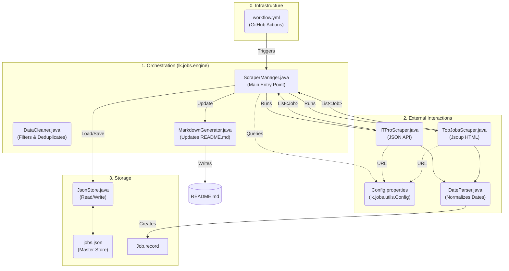

# 🇱🇰 Sri Lanka Software Engineering Jobs | 2026 Tracker [](https://t.me/SL_Software_Jobs)
Looking for software engineering jobs in Sri Lanka? This tracker updates daily with intern, junior, and senior IT roles across Colombo and beyond
Automated Software Engineering Job Tracker for Sri Lanka. Scrapes and categorizes Intern, Associate, and SE roles daily using Java (Jsoup) and GitHub Actions.

> [!TIP]
> **Help keep this project alive!** If this tool helped you find a lead today, please [**Star ⭐ the repo**](https://github.com/Senadeera-NK/sri-lanka-software-jobs). It’s how I measure the impact on our dev community! 🇱🇰

> [!IMPORTANT]
> **Automatic Staleness Purge:** The engine automatically removes listings older than **14 days**, ensuring the feed stays relevant and high-signal.

> **Live Analytics & Daily Software Job Tracker for Sri Lanka**

[📊 View Live Dashboard](https://sri-lanka-software-jobs.vercel.app/)

 
*Click the link above to see real-time trends, seniority distribution, and top hiring companies.*

## 📊 Current Job Openings
> 🟢 **Last Updated:** June 4,2:44 PM (Just now)  | **Total Jobs Found:** 227

### 🎓 Internships & Trainees  (27)

| Title | Company | Level  | Posted | Source |
| :--- | :--- | :--- | :--- | :--- |
| [Intern - Mobile Development](https://www.topjobs.lk/employer/JobAdvertismentServlet?ac=0000000484&jc=0001505633&ec=0000000651) | Epic Lanka (Pvt) Ltd | Intern | 14&nbsp;hours&nbsp;ago | TopJobs.lk |
| [Intern - UI \| UX Engineer](https://www.topjobs.lk/employer/JobAdvertismentServlet?ac=0000000484&jc=0001508198&ec=0000000651) | Epic Lanka (Pvt) Ltd | Intern | 14&nbsp;hours&nbsp;ago | TopJobs.lk |
| [Software Engineer / Intern](https://itpro.lk/job/13926/software-engineer-intern-at-emed-care-lk/) | eMed Care LK | Intern | 14&nbsp;hours&nbsp;ago | ITPro.lk |
| [Intern - QA](https://xpress.jobs/jobs/view/284564) | XpressJobs | Intern | 17&nbsp;hours&nbsp;ago | XpressJobs |
| [Flutter Developer (Intern \| Associate)](https://www.topjobs.lk/employer/JobAdvertismentServlet?ac=DEFZZZ&jc=0001507885&ec=DEFZZZ) | Muve Mobility (Pvt) Ltd | Intern | Yesterday | TopJobs.lk |
| [Software Engineering Intern](https://itpro.lk/job/13910/software-engineering-intern-at-axcito/) | axcito | Intern | Yesterday | ITPro.lk |
| [Intern - Cloud Solutions](https://www.topjobs.lk/employer/JobAdvertismentServlet?ac=DEFZZZ&jc=0001503044&ec=DEFZZZ) | VitalHub Innovations Lab | Intern | Yesterday | TopJobs.lk |
| [Internship - Software Engineer](https://itpro.lk/job/12774/internship-software-engineer-at-erav-technologies-pvt-ltd/) | Erav Technologies (Pvt) Ltd | Intern | 2&nbsp;days&nbsp;ago | ITPro.lk |
| [Software Engineer Intern](https://itpro.lk/job/13904/software-engineer-intern-at-rightmo-web-solution/) | Rightmo Web Solution | Intern | 2&nbsp;days&nbsp;ago | ITPro.lk |
| [Software Engineering Intern](https://itpro.lk/job/13879/software-engineering-intern-at-explore-vacations-travels-pvt-ltd/) | Explore Vacations & Travels (Pvt) Ltd | Intern | 5&nbsp;days&nbsp;ago | ITPro.lk |
| [Android Developer Intern \| Paid Onsite](https://xpress.jobs/jobs/view/290297) | Era Biz Solutions (Pvt) Ltd | Intern | 5&nbsp;days&nbsp;ago | XpressJobs |
| [Intern - Information Security](https://xpress.jobs/jobs/view/291210) | NDB Bank | Intern | 6&nbsp;days&nbsp;ago | XpressJobs |
| [Intern - QA Engineer](https://itpro.lk/job/13873/intern-qa-engineer-at-zuse-technologies/) | Zuse Technologies | Intern | 6&nbsp;days&nbsp;ago | ITPro.lk |
| [Intern Software Engineer - Contract](https://www.topjobs.lk/employer/JobAdvertismentServlet?ac=DEFZZZ&jc=0001506637&ec=DEFZZZ) | HRC Labs | Intern | 6&nbsp;days&nbsp;ago | TopJobs.lk |
| [QA Engineer - Intern](https://www.topjobs.lk/employer/JobAdvertismentServlet?ac=DEFZZZ&jc=0001506564&ec=DEFZZZ) | eBuilder Technology Center (Pvt) Ltd | Intern | 6&nbsp;days&nbsp;ago | TopJobs.lk |
| [QA & SEO Intern Neo Solution](https://itpro.lk/job/12206/qa-seo-intern-neo-solution-at-neo-solution/) | Neo Solution | Intern | 6&nbsp;days&nbsp;ago | ITPro.lk |
| [Software Engineering - Intern](https://itpro.lk/job/13867/software-engineering-intern-at-qdesk-ai-pvt-ltd/) | Qdesk AI Pvt Ltd | Intern | 6&nbsp;days&nbsp;ago | ITPro.lk |
| [Intern - Product Development (1)](https://www.topjobs.lk/employer/JobAdvertismentServlet?ac=0000000094&jc=0001506264&ec=0000000111) | MAS Holdings | Intern | 7&nbsp;days&nbsp;ago | TopJobs.lk |
| [Software Development Intern](https://www.topjobs.lk/employer/JobAdvertismentServlet?ac=DEFZZZ&jc=0001505941&ec=DEFZZZ) | Dynamical Systems Lanka | Intern | 7&nbsp;days&nbsp;ago | TopJobs.lk |
| [Intern – Quality Assurance (QA)](https://itpro.lk/job/13848/intern-quality-assurance-qa-at-digital-health-private-limited/) | Digital Health Private Limited | Intern | 8&nbsp;days&nbsp;ago | ITPro.lk |
| [Software Engineer - Intern](https://itpro.lk/job/13839/software-engineer-intern-at-d-help-hub-private-limited/) | D HELP HUB Private Limited | Intern | 9&nbsp;days&nbsp;ago | ITPro.lk |
| [Full-Stack Web Development Intern (Laravel/PHP)](https://itpro.lk/job/13838/fullstack-web-development-intern-laravelphp-at-loopz-global-pvt-ltd/) | Loopz Global (Pvt) Ltd | Intern | 9&nbsp;days&nbsp;ago | ITPro.lk |
| [Software Engineer – Intern (Spring Boot/React)](https://itpro.lk/job/13827/software-engineer-intern-spring-bootreact-at-silverline-it/) | Silverline IT | Intern | 9&nbsp;days&nbsp;ago | ITPro.lk |
| [Flutter Intern](https://xpress.jobs/jobs/view/289421) | Era Biz Solutions (Pvt) Ltd | Intern | 10&nbsp;days&nbsp;ago | XpressJobs |
| [QA-Intern](https://itpro.lk/job/13812/qaintern-at-everestx-technologies/) | EverestX Technologies | Intern | 12&nbsp;days&nbsp;ago | ITPro.lk |
| [Software Engineering Intern](https://itpro.lk/job/13806/software-engineering-intern-at-quantum-plus/) | Quantum Plus | Intern | 13&nbsp;days&nbsp;ago | ITPro.lk |
| [Intern - Software Engineer](https://itpro.lk/job/13800/intern-software-engineer-at-infinity-innovators/) | Infinity Innovators | Intern | 14&nbsp;days&nbsp;ago | ITPro.lk |

---

### 💻 Associate & Junior/SE Roles  (133)

| Title | Company | Level  | Posted | Source |
| :--- | :--- | :--- | :--- | :--- |
| [Fullstack Developer - Gampaha](https://itpro.lk/job/13933/fullstack-developer-gampaha-at-ants-creation-pvt-ltd/) | Ants Creation (Pvt) Ltd | Junior/SE | 3&nbsp;mins&nbsp;ago | ITPro.lk |
| [Full Stack Engineer](https://itpro.lk/job/13931/full-stack-engineer-at-mo-marketplace/) | MO Marketplace | Junior/SE | 12&nbsp;mins&nbsp;ago | ITPro.lk |
| [NetSuite Integration Engineer](https://itpro.lk/job/13927/netsuite-integration-engineer-at-invenza-digital-technologies/) | Invenza Digital Technologies | Junior/SE | 3&nbsp;hours&nbsp;ago | ITPro.lk |
| [Full Stack Developer - React & .Net](https://www.topjobs.lk/employer/JobAdvertismentServlet?ac=DEFZZZ&jc=0001505341&ec=DEFZZZ) | Ateam Software (Pvt) Ltd | Junior/SE | 14&nbsp;hours&nbsp;ago | TopJobs.lk |
| [Junior Web Developer](https://www.topjobs.lk/employer/JobAdvertismentServlet?ac=DEFZZZ&jc=0001504562&ec=DEFZZZ) | Ignite Media Vision (Pvt) Ltd | Junior/SE | 14&nbsp;hours&nbsp;ago | TopJobs.lk |
| [Golang API Developer](https://www.topjobs.lk/employer/JobAdvertismentServlet?ac=DEFZZZ&jc=0001505547&ec=DEFZZZ) | Thakshana Technologies (Private) Limited | Junior/SE | 14&nbsp;hours&nbsp;ago | TopJobs.lk |
| [Full Stack Developer](https://www.topjobs.lk/employer/JobAdvertismentServlet?ac=DEFZZZ&jc=0001505542&ec=DEFZZZ) | Thakshana Technologies (Private) Limited | Junior/SE | 14&nbsp;hours&nbsp;ago | TopJobs.lk |
| [QA Automation \| Release Validation Engineer](https://www.topjobs.lk/employer/JobAdvertismentServlet?ac=DEFZZZ&jc=0001505492&ec=DEFZZZ) | Capsicum Labs | Junior/SE | 14&nbsp;hours&nbsp;ago | TopJobs.lk |
| [Full Stack Developer (AI - Powered Development)](https://www.topjobs.lk/employer/JobAdvertismentServlet?ac=DEFZZZ&jc=0001505484&ec=DEFZZZ) | Capsicum Labs | Junior/SE | 14&nbsp;hours&nbsp;ago | TopJobs.lk |
| [Software Engineer - Mobile](https://www.topjobs.lk/employer/JobAdvertismentServlet?ac=DEFZZZ&jc=0001505347&ec=DEFZZZ) | Ateam Software (Pvt) Ltd | Junior/SE | 14&nbsp;hours&nbsp;ago | TopJobs.lk |
| [Software Engineer - Python & Cloud (Backend)](https://www.topjobs.lk/employer/JobAdvertismentServlet?ac=DEFZZZ&jc=0001508193&ec=DEFZZZ) | Affixcon Pty Ltd | Junior/SE | 14&nbsp;hours&nbsp;ago | TopJobs.lk |
| [AI and Automation Engineer](https://xpress.jobs/jobs/view/291297) | TGT Global | Junior/SE | 17&nbsp;hours&nbsp;ago | XpressJobs |
| [Devops & IT Infrastucture Engineer \| Nawam Mawatha, Colombo 02](https://xpress.jobs/jobs/view/292023) | Victory Company (Igaming BPO) | Junior/SE | 17&nbsp;hours&nbsp;ago | XpressJobs |
| [Software Architect \| Colombo](https://xpress.jobs/jobs/view/292351) | Mavip Infotech | Junior/SE | 17&nbsp;hours&nbsp;ago | XpressJobs |
| [Applied ML Engineer - Autonomous Drones](https://xpress.jobs/jobs/view/292747) | The Scouts | Junior/SE | 17&nbsp;hours&nbsp;ago | XpressJobs |
| [Quality Assurance Engineer](https://xpress.jobs/jobs/view/293111) | Brown and Company PLC | Junior/SE | 17&nbsp;hours&nbsp;ago | XpressJobs |
| [Enterprise Solution Architect](https://xpress.jobs/jobs/view/293267) | Ernst & Young | Junior/SE | 17&nbsp;hours&nbsp;ago | XpressJobs |
| [Head of AI](https://xpress.jobs/jobs/view/293292) | Omobio | Junior/SE | 17&nbsp;hours&nbsp;ago | XpressJobs |
| [Cyber Security Specialist (L2)](https://xpress.jobs/jobs/view/292589) | HCL Technologies Lanka (Private) Limited | Junior/SE | 17&nbsp;hours&nbsp;ago | XpressJobs |
| [Walk In Interview \| Collaboration Tools (Cloud) (Fresh Graduates)](https://xpress.jobs/jobs/view/293587) | HCL Technologies Lanka (Private) Limited | Junior/SE | 17&nbsp;hours&nbsp;ago | XpressJobs |
| [Risk and Governance Engineer](https://xpress.jobs/jobs/view/293649) | Innobot | Junior/SE | 17&nbsp;hours&nbsp;ago | XpressJobs |
| [Head of Information Security](https://xpress.jobs/jobs/view/293760) | SMB Finance PLC | Junior/SE | 17&nbsp;hours&nbsp;ago | XpressJobs |
| [Database Administrator - Oracle](https://xpress.jobs/jobs/view/293940) | Melsta Technologies (Pvt) Ltd | Junior/SE | 17&nbsp;hours&nbsp;ago | XpressJobs |
| [Walk In Interviews \| Cyber Security](https://xpress.jobs/jobs/view/291654) | HCL Technologies Lanka (Private) Limited | Junior/SE | 17&nbsp;hours&nbsp;ago | XpressJobs |
| [Walk In Interviews \| Graduate Engineer (Analyst) - Fresh Graduates](https://xpress.jobs/jobs/view/293576) | HCL Technologies Lanka (Private) Limited | Junior/SE | 17&nbsp;hours&nbsp;ago | XpressJobs |
| [Walk In Interview \| Cyber Security (Fresh Graduates)](https://xpress.jobs/jobs/view/293588) | HCL Technologies Lanka (Private) Limited | Junior/SE | 17&nbsp;hours&nbsp;ago | XpressJobs |
| [Walk In Interview \| Graduate Engineering (Fresh Graduates)](https://xpress.jobs/jobs/view/293604) | HCL Technologies Lanka (Private) Limited | Junior/SE | 17&nbsp;hours&nbsp;ago | XpressJobs |
| [Walk In Interviews \| Graduate Engineer Analyst - Infrastruc...](https://xpress.jobs/jobs/view/293590) | HCL Technologies Lanka (Private) Limited | Junior/SE | 17&nbsp;hours&nbsp;ago | XpressJobs |
| [Full Stack Developer (Spring Boot & React)](https://itpro.lk/job/13920/full-stack-developer-spring-boot-react-at-fintechnology-asia-pacific-lanka-ltd/) | Fintechnology Asia Pacific Lanka Ltd | Junior/SE | 17&nbsp;hours&nbsp;ago | ITPro.lk |
| [Software Architect](https://itpro.lk/job/13918/software-architect-at-tillmax/) | TILLMAX | Junior/SE | 20&nbsp;hours&nbsp;ago | ITPro.lk |
| [Big Data Engineer (1)](https://www.topjobs.lk/employer/JobAdvertismentServlet?ac=0000000271&jc=0001420855&ec=0000000350) | CMS (Pvt) Ltd | Junior/SE | Yesterday | TopJobs.lk |
| [Full Stack .Net Engineer (1)](https://www.topjobs.lk/employer/JobAdvertismentServlet?ac=0000000271&jc=0001490551&ec=0000000350) | CMS (Pvt) Ltd | Junior/SE | Yesterday | TopJobs.lk |
| [Software Engineer -SQL Developer (1)](https://www.topjobs.lk/employer/JobAdvertismentServlet?ac=0000000375&jc=0001507709&ec=0000000492) | Jobfactory | Junior/SE | Yesterday | TopJobs.lk |
| [Associate Quality Assurance Engineer (1)](https://www.topjobs.lk/employer/JobAdvertismentServlet?ac=0000000375&jc=0001507712&ec=0000000492) | Jobfactory | Associate | Yesterday | TopJobs.lk |
| [Software Engineer JAVA (1)](https://www.topjobs.lk/employer/JobAdvertismentServlet?ac=0000000492&jc=0001507612&ec=0000000661) | DirectFN | Junior/SE | Yesterday | TopJobs.lk |
| [Associate Software Engineer- Java/ .NET (1)](https://www.topjobs.lk/employer/JobAdvertismentServlet?ac=0000000375&jc=0001507713&ec=0000000492) | Jobfactory | Associate | Yesterday | TopJobs.lk |
| [Partners - Web Development & Design Projects](https://www.topjobs.lk/employer/JobAdvertismentServlet?ac=DEFZZZ&jc=0001508002&ec=DEFZZZ) | PB Creative | Junior/SE | Yesterday | TopJobs.lk |
| [Data Analyst \| IT](https://www.topjobs.lk/employer/JobAdvertismentServlet?ac=DEFZZZ&jc=0001507692&ec=DEFZZZ) | Techome Technologies (Pvt) Ltd | Junior/SE | Yesterday | TopJobs.lk |
| [Software QA Engineer (Manual & Automation)](https://www.topjobs.lk/employer/JobAdvertismentServlet?ac=DEFZZZ&jc=0001507643&ec=DEFZZZ) | Peercore Nexgen (Pvt) Ltd | Junior/SE | Yesterday | TopJobs.lk |
| [Software Engineer - Full Stack (1)](https://www.topjobs.lk/employer/JobAdvertismentServlet?ac=0000000492&jc=0001507616&ec=0000000661) | DirectFN | Junior/SE | Yesterday | TopJobs.lk |
| [Database Administrator (1)](https://www.topjobs.lk/employer/JobAdvertismentServlet?ac=0000000492&jc=0001507613&ec=0000000661) | DirectFN | Junior/SE | Yesterday | TopJobs.lk |
| [Associate AI/ML & Data Science Engineer](https://www.topjobs.lk/employer/JobAdvertismentServlet?ac=DEFZZZ&jc=0001508071&ec=DEFZZZ) | PCS Techno | Associate | Yesterday | TopJobs.lk |
| [Trainee Wordpress Developer](https://itpro.lk/job/13911/trainee-wordpress-developer-at-enliven-designers/) | Enliven Designers | Associate | Yesterday | ITPro.lk |
| [Associate QA Engineer](https://itpro.lk/job/13907/associate-qa-engineer-at-polygon-agro/) | Polygon Agro | Associate | Yesterday | ITPro.lk |
| [Security Analyst](https://xpress.jobs/jobs/view/291304) | TGT Global | Junior/SE | 2&nbsp;days&nbsp;ago | XpressJobs |
| [Software Engineering , Artificial Intelligence Lecturers (Fu...](https://xpress.jobs/jobs/view/291339) | Campus Direct | Junior/SE | 2&nbsp;days&nbsp;ago | XpressJobs |
| [WordPress Developer (DIVI Theme) \| Work From Home](https://xpress.jobs/jobs/view/292975) | Aswin WebDesign | Junior/SE | 2&nbsp;days&nbsp;ago | XpressJobs |
| [Full Stack Software Engineer (MERN \| Next.js \| NestJs \| Golang)](https://itpro.lk/job/13905/full-stack-software-engineer-mern-nextjs-nestjs-golang-at-botcalm/) | BotCalm | Junior/SE | 2&nbsp;days&nbsp;ago | ITPro.lk |
| [Quality Assurance Engineer](https://itpro.lk/job/13900/quality-assurance-engineer-at-brown-company-plc/) | Brown & Company PLC | Junior/SE | 2&nbsp;days&nbsp;ago | ITPro.lk |
| [Cyber Security Engineer (1)](https://www.topjobs.lk/employer/JobAdvertismentServlet?ac=0000000375&jc=0001507520&ec=0000000492) | Jobfactory | Junior/SE | 2&nbsp;days&nbsp;ago | TopJobs.lk |
| [AI Engineer (1)](https://www.topjobs.lk/employer/JobAdvertismentServlet?ac=0000000146&jc=0001507517&ec=0000000178) | Nawaloka Hospitals PLC | Junior/SE | 2&nbsp;days&nbsp;ago | TopJobs.lk |
| [Full Stack Engineer (Java)](https://www.topjobs.lk/employer/JobAdvertismentServlet?ac=DEFZZZ&jc=0001507442&ec=DEFZZZ) | MedCubeUSA | Junior/SE | 2&nbsp;days&nbsp;ago | TopJobs.lk |
| [Trainee Wordpress Developer](https://www.topjobs.lk/employer/JobAdvertismentServlet?ac=DEFZZZ&jc=0001507136&ec=DEFZZZ) | Enliven Designers | Associate | 2&nbsp;days&nbsp;ago | TopJobs.lk |
| [Quality Assurance Engineer](https://itpro.lk/job/13798/quality-assurance-engineer-at-medfuture-healthcare/) | Medfuture Healthcare | Junior/SE | 2&nbsp;days&nbsp;ago | ITPro.lk |
| [QA Engineer](https://xpress.jobs/jobs/view/290765) | Innobot | Junior/SE | 3&nbsp;days&nbsp;ago | XpressJobs |
| [IT Helpdesk Engineer \| Awissawella](https://xpress.jobs/jobs/view/290786) | Micronet Global Services (Pvt) Ltd | Junior/SE | 3&nbsp;days&nbsp;ago | XpressJobs |
| [Graduate Engineer Analyst - Infrastructure Services (Data Ce...](https://xpress.jobs/jobs/view/291664) | HCL Technologies Lanka (Private) Limited | Junior/SE | 3&nbsp;days&nbsp;ago | XpressJobs |
| [Cyber Security (Fresh Graduates)](https://xpress.jobs/jobs/view/291665) | HCL Technologies Lanka (Private) Limited | Junior/SE | 3&nbsp;days&nbsp;ago | XpressJobs |
| [Collaboration Tools (Cloud) (Fresh Graduates)](https://xpress.jobs/jobs/view/291661) | HCL Technologies Lanka (Private) Limited | Junior/SE | 3&nbsp;days&nbsp;ago | XpressJobs |
| [Graduate Engineering (Fresh Graduates)](https://xpress.jobs/jobs/view/291657) | HCL Technologies Lanka (Private) Limited | Junior/SE | 3&nbsp;days&nbsp;ago | XpressJobs |
| [Graduate Engineer (Analyst) - Fresh Graduates](https://xpress.jobs/jobs/view/291656) | HCL Technologies Lanka (Private) Limited | Junior/SE | 3&nbsp;days&nbsp;ago | XpressJobs |
| [Quality Assurance Engineer](https://www.topjobs.lk/employer/JobAdvertismentServlet?ac=DEFZZZ&jc=0001502563&ec=DEFZZZ) | Medfuture | Junior/SE | 3&nbsp;days&nbsp;ago | TopJobs.lk |
| [Senior Associate - Data Analytics (Power BI & Microsoft Ecos...](https://www.topjobs.lk/employer/JobAdvertismentServlet?ac=0000000064&jc=0001506954&ec=0000000445) | H Connect International (Pvt) Ltd | Associate | 3&nbsp;days&nbsp;ago | TopJobs.lk |
| [Quality Assurance Engineer (1)](https://www.topjobs.lk/employer/JobAdvertismentServlet?ac=0000000221&jc=0001506912&ec=0000000264) | Browns Group Of Companies | Junior/SE | 3&nbsp;days&nbsp;ago | TopJobs.lk |
| [.NET Software Engineer](https://itpro.lk/job/13883/net-software-engineer-at-ck-orbits/) | CK Orbits | Junior/SE | 4&nbsp;days&nbsp;ago | ITPro.lk |
| [QA Engineer (US Working Hours)](https://xpress.jobs/jobs/view/290271) | Innobot | Junior/SE | 4&nbsp;days&nbsp;ago | XpressJobs |
| [Software Engineer (Python)](https://xpress.jobs/jobs/view/290274) | Innobot | Junior/SE | 4&nbsp;days&nbsp;ago | XpressJobs |
| [Hayleys Lifesciences \| Executive / Junior Executive - Infor...](https://xpress.jobs/jobs/view/290714) | Hayleys Aventura (Pvt) Ltd | Junior/SE | 4&nbsp;days&nbsp;ago | XpressJobs |
| [WordPress Developer](https://xpress.jobs/jobs/view/281093) | Apex Consulting | Junior/SE | 4&nbsp;days&nbsp;ago | XpressJobs |
| [Enterprise Data Architect](https://www.topjobs.lk/employer/JobAdvertismentServlet?ac=DEFZZZ&jc=0001506492&ec=DEFZZZ) | Orysys Limited | Junior/SE | 6&nbsp;days&nbsp;ago | TopJobs.lk |
| [Data Engineer](https://www.topjobs.lk/employer/JobAdvertismentServlet?ac=DEFZZZ&jc=0001506487&ec=DEFZZZ) | ORYSYS Limited | Junior/SE | 6&nbsp;days&nbsp;ago | TopJobs.lk |
| [Data Protection Officer](https://www.topjobs.lk/employer/JobAdvertismentServlet?ac=DEFZZZ&jc=0001506446&ec=DEFZZZ) | Abans Finance PLC | Junior/SE | 6&nbsp;days&nbsp;ago | TopJobs.lk |
| [.NET Developer](https://www.topjobs.lk/employer/JobAdvertismentServlet?ac=DEFZZZ&jc=0001506344&ec=DEFZZZ) | XGenLabs | Junior/SE | 6&nbsp;days&nbsp;ago | TopJobs.lk |
| [Quality Assurance Engineer](https://www.topjobs.lk/employer/JobAdvertismentServlet?ac=DEFZZZ&jc=0001506288&ec=DEFZZZ) | Paragon Software Lanka (Pvt) Ltd | Junior/SE | 6&nbsp;days&nbsp;ago | TopJobs.lk |
| [Software Engineer (Male)](https://www.topjobs.lk/employer/JobAdvertismentServlet?ac=0000000223&jc=0001506552&ec=0000000266) | Data Management Systems (Pvt) Ltd | Junior/SE | 6&nbsp;days&nbsp;ago | TopJobs.lk |
| [Full Stack Engineer (.NET & Angular)](https://www.topjobs.lk/employer/JobAdvertismentServlet?ac=DEFZZZ&jc=0001506697&ec=DEFZZZ) | Medcube USA | Junior/SE | 6&nbsp;days&nbsp;ago | TopJobs.lk |
| [RPA & AI Engineer (1)](https://www.topjobs.lk/employer/JobAdvertismentServlet?ac=DEFZZZ&jc=0001506649&ec=DEFZZZ) | Overdime Technologies (Pvt) Limited | Junior/SE | 6&nbsp;days&nbsp;ago | TopJobs.lk |
| [SOFTWARE ENGINEER — R&D](https://rooster.jobs/jobs/517778) | Arpico Energy | Junior/SE | 6&nbsp;days&nbsp;ago | Rooster.jobs |
| [Java Full-Stack Developer](https://itpro.lk/job/13865/java-fullstack-developer-at-hatchyard/) | Hatchyard | Junior/SE | 6&nbsp;days&nbsp;ago | ITPro.lk |
| [Primavera P6 Engineer \| Remote](https://xpress.jobs/jobs/view/289803) | Businessfocus360 | Junior/SE | 7&nbsp;days&nbsp;ago | XpressJobs |
| [Software Engineer Full Stack](https://itpro.lk/job/13861/software-engineer-full-stack-at-directfn/) | DirectFN | Junior/SE | 7&nbsp;days&nbsp;ago | ITPro.lk |
| [Junior Algorithm Engineer - DSP - FPGA Engineer](https://www.topjobs.lk/employer/JobAdvertismentServlet?ac=DEFZZZ&jc=0001501331&ec=DEFZZZ) | Company Name Withheld | Junior/SE | 7&nbsp;days&nbsp;ago | TopJobs.lk |
| [Technical Developer - Odoo](https://www.topjobs.lk/employer/JobAdvertismentServlet?ac=DEFZZZ&jc=0001505919&ec=DEFZZZ) | My Accountant (Pvt) Ltd | Junior/SE | 7&nbsp;days&nbsp;ago | TopJobs.lk |
| [Associate QA Engineer](https://www.topjobs.lk/employer/JobAdvertismentServlet?ac=DEFZZZ&jc=0001505836&ec=DEFZZZ) | PCS Techno | Associate | 7&nbsp;days&nbsp;ago | TopJobs.lk |
| [Software Engineer / ABAP Developer](https://xpress.jobs/jobs/view/289538) | Lanka Walltiles PLC | Junior/SE | 8&nbsp;days&nbsp;ago | XpressJobs |
| [Head of Cyber Security Governance and Compliance](https://xpress.jobs/jobs/view/289342) | Dialog Axiata PLC | Junior/SE | 8&nbsp;days&nbsp;ago | XpressJobs |
| [Associate Dev Ops Lead](https://xpress.jobs/jobs/view/289349) | Dialog Axiata PLC | Associate | 8&nbsp;days&nbsp;ago | XpressJobs |
| [Junior Quality Assurance Engineer](https://xpress.jobs/jobs/view/289508) | Davton Limited | Junior/SE | 8&nbsp;days&nbsp;ago | XpressJobs |
| [Associate/ Fullstack Developer (1)](https://www.topjobs.lk/employer/JobAdvertismentServlet?ac=0000000201&jc=0001505777&ec=0000000256) | Samson Rubber Industries | Associate | 8&nbsp;days&nbsp;ago | TopJobs.lk |
| [Software Engineer](https://www.topjobs.lk/employer/JobAdvertismentServlet?ac=DEFZZZ&jc=0001505724&ec=DEFZZZ) | E Channeling | Junior/SE | 8&nbsp;days&nbsp;ago | TopJobs.lk |
| [Software Engineers \| Full Stack Developer](https://www.topjobs.lk/employer/JobAdvertismentServlet?ac=DEFZZZ&jc=0001505722&ec=DEFZZZ) | Concord Apparel (Pvt) Ltd | Junior/SE | 8&nbsp;days&nbsp;ago | TopJobs.lk |
| [Shopify Developer](https://www.topjobs.lk/employer/JobAdvertismentServlet?ac=DEFZZZ&jc=0001505670&ec=DEFZZZ) | Kelly Felder | Junior/SE | 8&nbsp;days&nbsp;ago | TopJobs.lk |
| [IT Executive - Business Systems & Data Analytics](https://www.topjobs.lk/employer/JobAdvertismentServlet?ac=DEFZZZ&jc=0001505585&ec=DEFZZZ) | Company Name Withheld | Junior/SE | 8&nbsp;days&nbsp;ago | TopJobs.lk |
| [Associate QA Engineer (1)](https://www.topjobs.lk/employer/JobAdvertismentServlet?ac=0000000375&jc=0001505525&ec=0000000492) | Jobfactory | Associate | 8&nbsp;days&nbsp;ago | TopJobs.lk |
| [Associate Software Engineer](https://itpro.lk/job/13847/associate-software-engineer-at-digital-health-private-limited/) | Digital Health Private Limited | Associate | 8&nbsp;days&nbsp;ago | ITPro.lk |
| [Junior Embedded Software Engineer (Security - Focused)](https://www.topjobs.lk/employer/JobAdvertismentServlet?ac=DEFZZZ&jc=0001500312&ec=DEFZZZ) | Thakshana Technologies (Private) Limited | Junior/SE | 8&nbsp;days&nbsp;ago | TopJobs.lk |
| [Software Engineers](https://xpress.jobs/jobs/view/290236) | Data Management Systems (Pvt) Ltd | Junior/SE | 9&nbsp;days&nbsp;ago | XpressJobs |
| [Fullstack Software Engineer](https://itpro.lk/job/13842/fullstack-software-engineer-at-univiser/) | UNIVISER | Junior/SE | 9&nbsp;days&nbsp;ago | ITPro.lk |
| [QA Engineers (Manual Testing / Automation Testing)](https://itpro.lk/job/13836/qa-engineers-manual-testing-automation-testing-at-enhanzer/) | Enhanzer | Junior/SE | 9&nbsp;days&nbsp;ago | ITPro.lk |
| [Trainee - Data Analytics](https://xpress.jobs/jobs/view/288754) | Credit Information Bureau of Sri Lanka | Associate | 10&nbsp;days&nbsp;ago | XpressJobs |
| [Associate Software Engineer .NET](https://itpro.lk/job/13824/associate-software-engineer-net-at-xigenix/) | XigeniX | Associate | 10&nbsp;days&nbsp;ago | ITPro.lk |
| [ Manual Software Tester (Mid-Level) ](https://itpro.lk/job/13820/-manual-software-tester-midlevel-at-pina-vida/) | Pina Vida | Junior/SE | 10&nbsp;days&nbsp;ago | ITPro.lk |
| [DevOps Engineers](https://www.topjobs.lk/employer/JobAdvertismentServlet?ac=DEFZZZ&jc=0001499984&ec=DEFZZZ) | eBEYONDS (Pvt) Ltd | Junior/SE | 10&nbsp;days&nbsp;ago | TopJobs.lk |
| [Associate Software Engineer/Software Engineer - Business Int...](https://www.topjobs.lk/employer/JobAdvertismentServlet?ac=0000000371&jc=0001487411&ec=0000000486) | Goodhope Asia Holdings Ltd | Associate | 10&nbsp;days&nbsp;ago | TopJobs.lk |
| [Process Automation Analyst (1)](https://www.topjobs.lk/employer/JobAdvertismentServlet?ac=0000000146&jc=0001504548&ec=0000000178) | Nawaloka Hospitals PLC | Junior/SE | 10&nbsp;days&nbsp;ago | TopJobs.lk |
| [Quality Assurance Trainee](https://www.topjobs.lk/employer/JobAdvertismentServlet?ac=DEFZZZ&jc=0001504481&ec=DEFZZZ) | Inqbaytor Pty Ltd | Associate | 10&nbsp;days&nbsp;ago | TopJobs.lk |
| [Executive - Quality Assurance (AUS Calendar - AUS Shift) (1)](https://www.topjobs.lk/employer/JobAdvertismentServlet?ac=0000000064&jc=0001504706&ec=0000000445) | H Connect International (Pvt) Ltd | Junior/SE | 10&nbsp;days&nbsp;ago | TopJobs.lk |
| [Associate Software Engineer - Insurance field (1)](https://www.topjobs.lk/employer/JobAdvertismentServlet?ac=0000000375&jc=0001504922&ec=0000000492) | Jobfactory | Associate | 10&nbsp;days&nbsp;ago | TopJobs.lk |
| [IT Helpdesk Engineer (1)](https://www.topjobs.lk/employer/JobAdvertismentServlet?ac=0000000419&jc=0001504777&ec=0000000552) | Micronet Global Services (Pvt) Ltd | Junior/SE | 10&nbsp;days&nbsp;ago | TopJobs.lk |
| [Quality Assurance Engineer](https://www.topjobs.lk/employer/JobAdvertismentServlet?ac=DEFZZZ&jc=0001504773&ec=DEFZZZ) | Orysys Limited | Junior/SE | 10&nbsp;days&nbsp;ago | TopJobs.lk |
| [Data Engineer](https://www.topjobs.lk/employer/JobAdvertismentServlet?ac=DEFZZZ&jc=0001499197&ec=DEFZZZ) | ATeam Software | Junior/SE | 10&nbsp;days&nbsp;ago | TopJobs.lk |
| [Cyber Security Analyst - Telco Security](https://xpress.jobs/jobs/view/288240) | Dialog Axiata PLC | Junior/SE | 11&nbsp;days&nbsp;ago | XpressJobs |
| [Machine Learning Engineer (1)](https://www.topjobs.lk/employer/JobAdvertismentServlet?ac=0000000411&jc=0001504330&ec=0000000540) | Citizens Development Business Finance PLC | Junior/SE | 11&nbsp;days&nbsp;ago | TopJobs.lk |
| [DevOps Engineer (1)](https://www.topjobs.lk/employer/JobAdvertismentServlet?ac=0000000411&jc=0001504325&ec=0000000540) | Citizens Development Business Finance PLC | Junior/SE | 11&nbsp;days&nbsp;ago | TopJobs.lk |
| [Data Scientist (1)](https://www.topjobs.lk/employer/JobAdvertismentServlet?ac=0000000411&jc=0001504319&ec=0000000540) | Citizens Development Business Finance PLC | Junior/SE | 11&nbsp;days&nbsp;ago | TopJobs.lk |
| [React Native Engineer (1)](https://www.topjobs.lk/employer/JobAdvertismentServlet?ac=0000000201&jc=0001504350&ec=0000000241) | D.Samson & Sons Ltd | Junior/SE | 11&nbsp;days&nbsp;ago | TopJobs.lk |
| [Quality Assurance Engineer - AI / ML (1)](https://www.topjobs.lk/employer/JobAdvertismentServlet?ac=0000000411&jc=0001504333&ec=0000000540) | Citizens Development Business Finance PLC | Junior/SE | 11&nbsp;days&nbsp;ago | TopJobs.lk |
| [Walk In Interviews \| Graduate Engineering (Fresh Graduates)](https://xpress.jobs/jobs/view/285921) | HCL Technologies Lanka (Private) Limited | Junior/SE | 12&nbsp;days&nbsp;ago | XpressJobs |
| [Walk In Interviews \| Cyber Security (Fresh Graduates)](https://xpress.jobs/jobs/view/285929) | HCL Technologies Lanka (Private) Limited | Junior/SE | 12&nbsp;days&nbsp;ago | XpressJobs |
| [Software Developer (Next.js + Laravel + AI)](https://itpro.lk/job/12028/software-developer-nextjs-laravel-ai-at-git-lanka/) | GIT Lanka | Junior/SE | 12&nbsp;days&nbsp;ago | ITPro.lk |
| [RPA Developer (1)](https://www.topjobs.lk/employer/JobAdvertismentServlet?ac=0000000201&jc=0001504258&ec=0000000241) | D.Samson & Sons Ltd | Junior/SE | 12&nbsp;days&nbsp;ago | TopJobs.lk |
| [Associate QA Engineer](https://www.topjobs.lk/employer/JobAdvertismentServlet?ac=DEFZZZ&jc=0001504231&ec=DEFZZZ) | Fexcon Pty Ltd | Associate | 13&nbsp;days&nbsp;ago | TopJobs.lk |
| [AI Engineer Trainee \| Apprentice](https://www.topjobs.lk/employer/JobAdvertismentServlet?ac=DEFZZZ&jc=0001504182&ec=DEFZZZ) | Company Name Withheld | Associate | 13&nbsp;days&nbsp;ago | TopJobs.lk |
| [Business Analyst - AI / ML (1)](https://www.topjobs.lk/employer/JobAdvertismentServlet?ac=0000000411&jc=0001504167&ec=0000000540) | Citizens Development Business Finance PLC | Junior/SE | 13&nbsp;days&nbsp;ago | TopJobs.lk |
| [Data Sourcing Specialist](https://www.topjobs.lk/employer/JobAdvertismentServlet?ac=DEFZZZ&jc=0001504049&ec=DEFZZZ) | iTechnology (Pvt) Ltd | Junior/SE | 13&nbsp;days&nbsp;ago | TopJobs.lk |
| [AI Engineer](https://xpress.jobs/jobs/view/288904) | The Jobhouse | Junior/SE | 14&nbsp;days&nbsp;ago | XpressJobs |
| [Quality Assurance Engineer](https://itpro.lk/job/13801/quality-assurance-engineer-at-earrow-pvt-ltd/) | eArrow (Pvt) LTD | Junior/SE | 14&nbsp;days&nbsp;ago | ITPro.lk |
| [Quality Assurance Engineer](https://itpro.lk/job/13369/quality-assurance-engineer-at-pacifickode/) | PacificKode | Junior/SE | 14&nbsp;days&nbsp;ago | ITPro.lk |
| [Associate Manual QA Engineer](https://itpro.lk/job/13799/associate-manual-qa-engineer-at-nimi/) | Nimi | Associate | 14&nbsp;days&nbsp;ago | ITPro.lk |
| [Associate Software Engineers](https://www.topjobs.lk/employer/JobAdvertismentServlet?ac=DEFZZZ&jc=0001503745&ec=DEFZZZ) | Kerk Solutions (Pvt) Limited | Associate | 14&nbsp;days&nbsp;ago | TopJobs.lk |
| [BI Engineer](https://www.topjobs.lk/employer/JobAdvertismentServlet?ac=DEFZZZ&jc=0001503655&ec=DEFZZZ) | CBL Corporate Services (Pvt) Ltd | Junior/SE | 14&nbsp;days&nbsp;ago | TopJobs.lk |
| [Testing Specialist - Automation](https://itpro.lk/job/13797/testing-specialist-automation-at-directfn/) | DirectFN | Junior/SE | 14&nbsp;days&nbsp;ago | ITPro.lk |
| [Web Developer](https://itpro.lk/job/13795/web-developer-at-stalione-lanka-pvt-ltd/) | Stalione Lanka (Pvt) Ltd | Junior/SE | 14&nbsp;days&nbsp;ago | ITPro.lk |

---

### 🚀 Senior & Lead Roles  (67)

| Title | Company | Level  | Posted | Source |
| :--- | :--- | :--- | :--- | :--- |
| [Senior Software Tester / QA Engineer](https://itpro.lk/job/13929/senior-software-tester-qa-engineer-at-robotic-assistance-devices/) | Robotic Assistance Devices | Senior | 2&nbsp;hours&nbsp;ago | ITPro.lk |
| [Software Engineer (SE) & Senior Software Engineer (SSE)](https://www.topjobs.lk/employer/JobAdvertismentServlet?ac=DEFZZZ&jc=0001504104&ec=DEFZZZ) | SoftOne Group | Senior | 14&nbsp;hours&nbsp;ago | TopJobs.lk |
| [Senior Quality Assurance Engineer (1)](https://www.topjobs.lk/employer/JobAdvertismentServlet?ac=0000000001&jc=0001505237&ec=0000000001) | Genesiis Software Pvt Ltd | Senior | 14&nbsp;hours&nbsp;ago | TopJobs.lk |
| [Senior Software Developer - Contract](https://www.topjobs.lk/employer/JobAdvertismentServlet?ac=DEFZZZ&jc=0001508444&ec=DEFZZZ) | AA Japan (Pvt) Ltd | Senior | 14&nbsp;hours&nbsp;ago | TopJobs.lk |
| [Senior Software Developer](https://xpress.jobs/jobs/view/291488) | Wizlearn Technologies Pte Ltd | Senior | 17&nbsp;hours&nbsp;ago | XpressJobs |
| [Senior Java Architect \| Colombo](https://xpress.jobs/jobs/view/291555) | YI CAN PTE. LTD. | Senior | 17&nbsp;hours&nbsp;ago | XpressJobs |
| [Lead Automation Engineer (Python Focus)](https://xpress.jobs/jobs/view/291720) | Innobot | Senior | 17&nbsp;hours&nbsp;ago | XpressJobs |
| [Senior Developer (Full Time) \| Work From Home](https://xpress.jobs/jobs/view/291850) | LocalCom Pty. Ltd | Senior | 17&nbsp;hours&nbsp;ago | XpressJobs |
| [Technical Lead (AI, Software)](https://xpress.jobs/jobs/view/289847) | PBA Systems Pte Ltd | Senior | 17&nbsp;hours&nbsp;ago | XpressJobs |
| [Senior AI and Automation Engineer](https://xpress.jobs/jobs/view/291298) | TGT Global | Senior | 17&nbsp;hours&nbsp;ago | XpressJobs |
| [Senior Full Stack Engineer](https://xpress.jobs/jobs/view/291296) | TGT Global | Senior | 17&nbsp;hours&nbsp;ago | XpressJobs |
| [Principal Engineer cum Team Lead (AI, Software)](https://xpress.jobs/jobs/view/292616) | PBA Systems Pte Ltd | Senior | 17&nbsp;hours&nbsp;ago | XpressJobs |
| [Senior Automation Engineer (Python Focus)](https://xpress.jobs/jobs/view/291719) | Innobot | Senior | 17&nbsp;hours&nbsp;ago | XpressJobs |
| [Team Lead ( Blockchain, Full-Stack & AI  )  - Remote](https://xpress.jobs/jobs/view/290349) | Advantage Group Australasia Pty. Ltd | Senior | 17&nbsp;hours&nbsp;ago | XpressJobs |
| [Senior WordPress / Shopify Developer](https://xpress.jobs/jobs/view/291712) | AmplifyD Pvt Ltd | Senior | 17&nbsp;hours&nbsp;ago | XpressJobs |
| [Senior Software / Automation Systems Engineer](https://xpress.jobs/jobs/view/290745) | Seaport Group | Senior | 17&nbsp;hours&nbsp;ago | XpressJobs |
| [Senior Software Engineer : Ruby on Rails](https://xpress.jobs/jobs/view/291482) | OXO Tech (Pvt) Ltd | Senior | 22&nbsp;hours&nbsp;ago | XpressJobs |
| [JAVA Tech Lead (1)](https://www.topjobs.lk/employer/JobAdvertismentServlet?ac=0000000492&jc=0001507619&ec=0000000661) | DirectFN | Senior | Yesterday | TopJobs.lk |
| [Senior Systems Engineer (1)](https://www.topjobs.lk/employer/JobAdvertismentServlet?ac=0000000492&jc=0001507615&ec=0000000661) | DirectFN | Senior | Yesterday | TopJobs.lk |
| [Tech Lead Java (1)](https://www.topjobs.lk/employer/JobAdvertismentServlet?ac=0000000492&jc=0001507626&ec=0000000661) | DirectFN | Senior | Yesterday | TopJobs.lk |
| [Senior Software Engineer Java Script (1)](https://www.topjobs.lk/employer/JobAdvertismentServlet?ac=0000000492&jc=0001507623&ec=0000000661) | DirectFN | Senior | Yesterday | TopJobs.lk |
| [JAVA Angular Tech Lead (1)](https://www.topjobs.lk/employer/JobAdvertismentServlet?ac=0000000492&jc=0001507618&ec=0000000661) | DirectFN | Senior | Yesterday | TopJobs.lk |
| [Senior Software Engineer (1)](https://www.topjobs.lk/employer/JobAdvertismentServlet?ac=0000000492&jc=0001507614&ec=0000000661) | DirectFN | Senior | Yesterday | TopJobs.lk |
| [Data Engineer/Senior Data Engineer (2)](https://www.topjobs.lk/employer/JobAdvertismentServlet?ac=0000000499&jc=0001507560&ec=0000000679) | R.M.D Consultants (Pvt) Ltd | Senior | Yesterday | TopJobs.lk |
| [ Senior Software Engineer / Software Engineer](https://itpro.lk/job/13909/-senior-software-engineer-software-engineer-at-axcito/) | axcito | Senior | Yesterday | ITPro.lk |
| [Senior Systems Engineer](https://xpress.jobs/jobs/view/290901) | TGT Global | Senior | 2&nbsp;days&nbsp;ago | XpressJobs |
| [Senior Software Engineer (MERN \| Next.js \| NestJs \| Golang)](https://itpro.lk/job/13906/senior-software-engineer-mern-nextjs-nestjs-golang-at-botcalm/) | BotCalm | Senior | 2&nbsp;days&nbsp;ago | ITPro.lk |
| [Senior iOS Developer (Banking Applications)](https://www.topjobs.lk/employer/JobAdvertismentServlet?ac=DEFZZZ&jc=0001507402&ec=DEFZZZ) | Fortunaglobal (Pvt) Limited | Senior | 2&nbsp;days&nbsp;ago | TopJobs.lk |
| [Senior Software Engineer - .NET](https://www.topjobs.lk/employer/JobAdvertismentServlet?ac=DEFZZZ&jc=0001502456&ec=DEFZZZ) | VitalHub Innovations Lab | Senior | 2&nbsp;days&nbsp;ago | TopJobs.lk |
| [Technical Lead - Python Focus](https://xpress.jobs/jobs/view/290763) | Innobot | Senior | 3&nbsp;days&nbsp;ago | XpressJobs |
| [Senior Ruby on Rails Developer](https://xpress.jobs/jobs/view/291000) | Archipelago | Senior | 3&nbsp;days&nbsp;ago | XpressJobs |
| [Senior Go (Golang) Developer](https://xpress.jobs/jobs/view/291001) | Archipelago | Senior | 3&nbsp;days&nbsp;ago | XpressJobs |
| [Tech Lead (Full Stack Developer)](https://www.topjobs.lk/employer/JobAdvertismentServlet?ac=DEFZZZ&jc=0001502569&ec=DEFZZZ) | Medfuture | Senior | 3&nbsp;days&nbsp;ago | TopJobs.lk |
| [Senior Full-Stack Software Engineer (Python & React)](https://itpro.lk/job/13886/senior-fullstack-software-engineer-python-react-at-wisdom-recruitments/) | Wisdom RecruitmentS | Senior | 3&nbsp;days&nbsp;ago | ITPro.lk |
| [Full Stack Developer / Tech Lead](https://xpress.jobs/jobs/view/290183) | Boomerang International | Senior | 4&nbsp;days&nbsp;ago | XpressJobs |
| [Senior Software Engineer (Python)](https://xpress.jobs/jobs/view/290273) | Innobot | Senior | 4&nbsp;days&nbsp;ago | XpressJobs |
| [Senior Next.js Frontend Engineer (Vercel)](https://xpress.jobs/jobs/view/290633) | Innotic Pvt Ltd | Senior | 4&nbsp;days&nbsp;ago | XpressJobs |
| [Tech Lead – AI & Platform Engineering \| Hybrid](https://xpress.jobs/jobs/view/290666) | Coderra | Senior | 4&nbsp;days&nbsp;ago | XpressJobs |
| [Senior Python Developer \| Remote](https://xpress.jobs/jobs/view/290321) | BlueOceanSP | Senior | 4&nbsp;days&nbsp;ago | XpressJobs |
| [Senior Software Engineer](https://itpro.lk/job/13882/senior-software-engineer-at-evoke-labs/) | Evoke Labs | Senior | 4&nbsp;days&nbsp;ago | ITPro.lk |
| [Tech Lead - AI Solutions](https://www.topjobs.lk/employer/JobAdvertismentServlet?ac=DEFZZZ&jc=0001506493&ec=DEFZZZ) | ORYSYS Limited | Senior | 6&nbsp;days&nbsp;ago | TopJobs.lk |
| [Tech Lead - AI](https://www.topjobs.lk/employer/JobAdvertismentServlet?ac=DEFZZZ&jc=0001506491&ec=DEFZZZ) | ORYSYS Limited | Senior | 6&nbsp;days&nbsp;ago | TopJobs.lk |
| [Senior Data Scientist](https://www.topjobs.lk/employer/JobAdvertismentServlet?ac=DEFZZZ&jc=0001506490&ec=DEFZZZ) | ORYSYS Limited | Senior | 6&nbsp;days&nbsp;ago | TopJobs.lk |
| [Senior Data Engineer](https://www.topjobs.lk/employer/JobAdvertismentServlet?ac=DEFZZZ&jc=0001506489&ec=DEFZZZ) | ORYSYS Limited | Senior | 6&nbsp;days&nbsp;ago | TopJobs.lk |
| [Java Developer (Senior / Software Engineer)](https://itpro.lk/job/13866/java-developer-senior-software-engineer-at-hatchyard/) | Hatchyard | Senior | 6&nbsp;days&nbsp;ago | ITPro.lk |
| [Senior Software Engineer (Python/GCP)](https://itpro.lk/job/13864/senior-software-engineer-pythongcp-at-hatchyard/) | Hatchyard | Senior | 6&nbsp;days&nbsp;ago | ITPro.lk |
| [Senior Mobile Application Developer (React Native - EdTech)](https://www.topjobs.lk/employer/JobAdvertismentServlet?ac=DEFZZZ&jc=0001501408&ec=DEFZZZ) | EdTech | Senior | 6&nbsp;days&nbsp;ago | TopJobs.lk |
| [Senior Quality Assurance Engineer](https://www.topjobs.lk/employer/JobAdvertismentServlet?ac=DEFZZZ&jc=0001501055&ec=DEFZZZ) | Ateam Software (Pvt) Ltd | Senior | 6&nbsp;days&nbsp;ago | TopJobs.lk |
| [Senior Lecturer - Grade II / Lecturer / Lecturer (Probationa...](https://xpress.jobs/jobs/view/290058) | Sri Lanka Technology Campus | SLTC | Senior | 7&nbsp;days&nbsp;ago | XpressJobs |
| [Senior Lecturer - Grade II / Lecturer / Lecturer (Probationa...](https://xpress.jobs/jobs/view/290059) | Sri Lanka Technology Campus | SLTC | Senior | 7&nbsp;days&nbsp;ago | XpressJobs |
| [Senior Lecturer - Grade II / Lecturer / Lecturer (Probationa...](https://xpress.jobs/jobs/view/290060) | Sri Lanka Technology Campus | SLTC | Senior | 7&nbsp;days&nbsp;ago | XpressJobs |
| [Senior Lecturer - Grade II / Lecturer / Lecturer (Probationa...](https://xpress.jobs/jobs/view/290061) | Sri Lanka Technology Campus | SLTC | Senior | 7&nbsp;days&nbsp;ago | XpressJobs |
| [Senior Dev Ops Engineer](https://xpress.jobs/jobs/view/289343) | Dialog Axiata PLC | Senior | 8&nbsp;days&nbsp;ago | XpressJobs |
| [Lead - Cyber Security - Governance and Compliance](https://xpress.jobs/jobs/view/289348) | Dialog Axiata PLC | Senior | 8&nbsp;days&nbsp;ago | XpressJobs |
| [Senior SQL and SSRS Developer](https://xpress.jobs/jobs/view/289534) | KriyaGo | Senior | 8&nbsp;days&nbsp;ago | XpressJobs |
| [Lead Engineer - DevOps (Infrastructure & Security)](https://www.topjobs.lk/employer/JobAdvertismentServlet?ac=DEFZZZ&jc=0001505543&ec=DEFZZZ) | ORYSYS Limited | Senior | 8&nbsp;days&nbsp;ago | TopJobs.lk |
| [Senior Software Engineer](https://itpro.lk/job/13840/senior-software-engineer-at-bitslize-concepts/) | BitSlize Concepts | Senior | 9&nbsp;days&nbsp;ago | ITPro.lk |
| [Senior Software Engineer - Python](https://itpro.lk/job/13825/senior-software-engineer-python-at-xigenix/) | XigeniX | Senior | 10&nbsp;days&nbsp;ago | ITPro.lk |
| [Senior Software / Automation Systems Engineer](https://www.topjobs.lk/employer/JobAdvertismentServlet?ac=DEFZZZ&jc=0001504749&ec=DEFZZZ) | Seaport Group | Senior | 10&nbsp;days&nbsp;ago | TopJobs.lk |
| [Software Engineer / Senior Software Engineer (.NET Core / Angular)](https://rooster.jobs/jobs/517661) | Nextjob | Senior | 11&nbsp;days&nbsp;ago | Rooster.jobs |
| [Senior Full-Stack Developer](https://itpro.lk/job/13809/senior-fullstack-developer-at-3rdeye-media/) | 3rdeye Media | Senior | 13&nbsp;days&nbsp;ago | ITPro.lk |
| [Senior Developer / Tech Lead / Senior Tech Lead Full-Stack (...](https://itpro.lk/job/13805/senior-developer-tech-lead-senior-tech-lead-fullstack-angular-nodejs-at-bistec-global/) | BISTEC Global | Senior | 13&nbsp;days&nbsp;ago | ITPro.lk |
| [Senior SQL Developer (1)](https://www.topjobs.lk/employer/JobAdvertismentServlet?ac=0000000271&jc=0001421034&ec=0000000350) | CMS (Pvt) Ltd | Senior | 13&nbsp;days&nbsp;ago | TopJobs.lk |
| [Senior Database Administrator (1)](https://www.topjobs.lk/employer/JobAdvertismentServlet?ac=0000000492&jc=0001504030&ec=0000000661) | DirectFN | Senior | 13&nbsp;days&nbsp;ago | TopJobs.lk |
| [Senior Front end Developer (1)](https://www.topjobs.lk/employer/JobAdvertismentServlet?ac=0000000492&jc=0001504031&ec=0000000661) | DirectFN | Senior | 13&nbsp;days&nbsp;ago | TopJobs.lk |
| [Senior Engineer - IT Security](https://www.topjobs.lk/employer/JobAdvertismentServlet?ac=DEFZZZ&jc=0001498358&ec=DEFZZZ) | Commercial Bank | Senior | 13&nbsp;days&nbsp;ago | TopJobs.lk |
| [Lead Quality Assurance Engineer](https://www.topjobs.lk/employer/JobAdvertismentServlet?ac=DEFZZZ&jc=0001503475&ec=DEFZZZ) | Atlas Global BPO (Pvt) Ltd | Senior | 14&nbsp;days&nbsp;ago | TopJobs.lk |

---


## 🛠️ How it Works
1. **Engine:** A Java 21 console application using **Jsoup**.
2. **Sources:** Currently scraping `ITPro.lk` and  `TopJobs`. Support for and `Rooster.jobs` is under development (Contributors welcome!)
3. **Automation:** Runs every 12 hours via **GitHub Actions**.
4. **Storage:** Updates this `README.md` and a `jobs.json` file automatically.

<details>
<summary><b>📐 View High-Level Architecture Diagram</b></summary>
    

```mermaid
graph TD
    %% Main Orchestration Class
    subgraph Engine ["1. Orchestration (lk.jobs.engine)"]
        ScraperManager["ScraperManager.java<br/>(Main Entry Point)"]
        Cleaner("DataCleaner.java<br/>(Filters & Deduplicates)")
        Markdown("MarkdownGenerator.java<br/>(Updates README.md)")
    end

    %% External Interactions / Data Sources
    subgraph Scrapers ["2. External Interactions"]
        Config("Config.properties<br/>(lk.jobs.utils.Config)")
        ITPro("ITProScraper.java<br/>(JSON API)")
        TopJobs("TopJobsScraper.java<br/>(Jsoup HTML)")
        DParser("DateParser.java<br/>(Normalizes Dates)")
    end

    %% Data Flow & Persistence
    subgraph Storage ["3. Storage"]
        Json("jobs.json<br/>(Master Store)")
        JsonStore("JsonStore.java<br/>(Read/Write)")
        JobModel["Job.record"]
    end

    %% Workflow Orchestration
    subgraph Infrastructure ["0. Infrastructure"]
        WF("workflow.yml<br/>(GitHub Actions)")
    end

    %% Connective Flow
    WF -- "Triggers" --> ScraperManager
    ScraperManager -. "Queries" .-> Config
    ITPro -. "URL" .-> Config
    TopJobs -. "URL" .-> Config
    
    ScraperManager -- "Runs" --> ITPro
    ScraperManager -- "Runs" --> TopJobs
    
    ITPro --> DParser
    TopJobs --> DParser
    DParser -- "Creates" --> JobModel
    
    ITPro -- "List&lt;Job&gt;" --> ScraperManager
    TopJobs -- "List&lt;Job&gt;" --> ScraperManager

    ScraperManager -- "Load/Save" --> JsonStore
    JsonStore <--> Json
    
    ScraperManager -- "Update" --> Markdown
    Markdown -- "Writes" --> README[(README.md)]
```

</details>

<details>
<summary><b>📂 View Project Structure</b></summary>

```text
src/main/java/lk/jobs/
├── engine/           # Logic for sorting, cleaning, and README updates
├── model/            # Data models (Job Record)
├── scrapers/         # Individual site scrapers
└── utils/            # JSON and Date parsing utilities
```
</details>

## 🚀 Usage
If you want to run the scraper locally:
1. Clone the repo.
2. Ensure you have **JDK 21** and **Maven** installed.
3. Run: mvn clean compile exec:java -Dexec.mainClass="lk.jobs.engine.ScraperManager"

## 🤝 Contributing
Contributions are what make the open-source community such an amazing place to learn, inspire, and create.
Any contributions you make are **greatly appreciated**.

* **Found a bug?** Open an [Issue](https://github.com/Senadeera-NK/sl-software-engineering-jobs/issues).
* **Want to add a new site?** Check out our [Contributing Guidelines](CONTRIBUTING.md) to see how to implement a new scraper.
* **Missing a job?** Feel free to submit a Pull Request to manually update the table!
