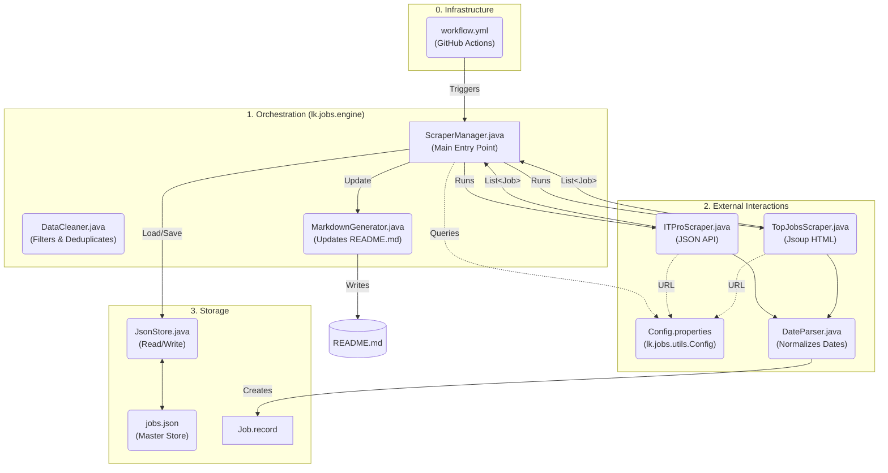

# 🇱🇰 Sri Lanka Software Engineering Jobs | 2026 Tracker [](https://t.me/SL_Software_Jobs)
Looking for software engineering jobs in Sri Lanka? This tracker updates daily with intern, junior, and senior IT roles across Colombo and beyond
Automated Software Engineering Job Tracker for Sri Lanka. Scrapes and categorizes Intern, Associate, and SE roles daily using Java (Jsoup) and GitHub Actions.

> [!TIP]
> **Help keep this project alive!** If this tool helped you find a lead today, please [**Star ⭐ the repo**](https://github.com/Senadeera-NK/sri-lanka-software-jobs). It’s how I measure the impact on our dev community! 🇱🇰

> [!IMPORTANT]
> **Automatic Staleness Purge:** The engine automatically removes listings older than **14 days**, ensuring the feed stays relevant and high-signal.

> **Live Analytics & Daily Software Job Tracker for Sri Lanka**

[📊 View Live Dashboard](https://sri-lanka-software-jobs.vercel.app/)

 
*Click the link above to see real-time trends, seniority distribution, and top hiring companies.*

## 📊 Current Job Openings
> 🟢 **Last Updated:** August 12,12:25 PM (Just now)  | **Total Jobs Found:** 138

### 🎓 Internships & Trainees  (31)

| Title | Company | Level  | Posted | Source |
| :--- | :--- | :--- | :--- | :--- |
| [Business Process QA & UX/UI Intern](https://itpro.lk/job/14376/business-process-qa-uxui-intern-at-process361-pvt-ltd/) | Process361 (Pvt) Ltd | Intern | 2&nbsp;hours&nbsp;ago | ITPro.lk |
| [Intern - Business Intelligence & Data Analysis (1)](https://www.topjobs.lk/employer/JobAdvertismentServlet?ac=0000000280&jc=0001534773&ec=0000000510) | Expolanka Freight (Pvt) Ltd | Intern | Yesterday | TopJobs.lk |
| [Fullstack Internship](https://itpro.lk/job/14116/fullstack-internship-at-univiser/) | UNIVISER | Intern | 5&nbsp;days&nbsp;ago | ITPro.lk |
| [Intern Software Engineer](https://itpro.lk/job/14599/intern-software-engineer-at-solutions-partner-group/) | Solutions Partner Group | Intern | 5&nbsp;days&nbsp;ago | ITPro.lk |
| [Full Stack Developer Internship](https://itpro.lk/job/14590/full-stack-developer-internship-at-worklenz/) | Worklenz | Intern | 6&nbsp;days&nbsp;ago | ITPro.lk |
| [Software Engineering - Intern](https://itpro.lk/job/14554/software-engineering-intern-at-qdesk-ai-pvt-ltd/) | Qdesk AI Pvt Ltd | Intern | 6&nbsp;days&nbsp;ago | ITPro.lk |
| [Software Developer Internship](https://itpro.lk/job/13656/software-developer-internship-at-git-lanka/) | GIT Lanka | Intern | 6&nbsp;days&nbsp;ago | ITPro.lk |
| [Intern - UI \| UX Engineer](https://www.topjobs.lk/employer/JobAdvertismentServlet?ac=0000000484&jc=0001533098&ec=0000000651) | Epic Lanka (Pvt) Ltd | Intern | 6&nbsp;days&nbsp;ago | TopJobs.lk |
| [Intern - Full Stack Developer](https://www.topjobs.lk/employer/JobAdvertismentServlet?ac=0000000484&jc=0001533094&ec=0000000651) | Epic Lanka (Pvt) Ltd | Intern | 6&nbsp;days&nbsp;ago | TopJobs.lk |
| [Software Engineering Intern](https://itpro.lk/job/14579/software-engineering-intern-at-hrock-digital/) | HROCK Digital | Intern | 6&nbsp;days&nbsp;ago | ITPro.lk |
| [QA Engineer Intern](https://itpro.lk/job/14574/qa-engineer-intern-at-ceydigital/) | Ceydigital | Intern | 7&nbsp;days&nbsp;ago | ITPro.lk |
| [IT Systems & Software Development Intern](https://www.topjobs.lk/employer/JobAdvertismentServlet?ac=DEFZZZ&jc=0001532723&ec=DEFZZZ) | Fairway Colombo | Intern | 7&nbsp;days&nbsp;ago | TopJobs.lk |
| [Software Engineering Intern](https://itpro.lk/job/14564/software-engineering-intern-at-roboticgen/) | RoboticGen | Intern | 7&nbsp;days&nbsp;ago | ITPro.lk |
| [2026 - Uni Moratuwa Career Fair - Quality Assurance Intern - Team 02](https://rooster.jobs/jobs/519033) | Creative Software | Intern | 8&nbsp;days&nbsp;ago | Rooster.jobs |
| [2026 - Uni Moratuwa Career Fair - Quality Assurance Intern - Team 01 ](https://rooster.jobs/jobs/519032) | Creative Software | Intern | 8&nbsp;days&nbsp;ago | Rooster.jobs |
| [2026 - Uni Moratuwa Career Fair - Software Engineering Intern ](https://rooster.jobs/jobs/519031) | Creative Software | Intern | 8&nbsp;days&nbsp;ago | Rooster.jobs |
| [2026 - Uni Moratuwa Career Fair - Software Engineering Inter...](https://rooster.jobs/jobs/519031) | Creative Software | Intern | 8&nbsp;days&nbsp;ago | Rooster.jobs |
| [QA \| Software Tester (Trainee \| Intern)](https://www.topjobs.lk/employer/JobAdvertismentServlet?ac=DEFZZZ&jc=0001526871&ec=DEFZZZ) | myPOS Software Solutions (Pvt) Ltd | Intern | 8&nbsp;days&nbsp;ago | TopJobs.lk |
| [QA Intern](https://itpro.lk/job/14544/qa-intern-at-nvision/) | Nvision | Intern | 9&nbsp;days&nbsp;ago | ITPro.lk |
| [Intern Software Engineer](https://itpro.lk/job/14543/intern-software-engineer-at-healthrecon-connect-llc/) | HealthRecon Connect LLC | Intern | 9&nbsp;days&nbsp;ago | ITPro.lk |
| [MERN Stack Developer Intern](https://itpro.lk/job/14538/mern-stack-developer-intern-at-looplab-pvt-ltd/) | LoopLab (Pvt) Ltd | Intern | 10&nbsp;days&nbsp;ago | ITPro.lk |
| [Python Developer Intern](https://itpro.lk/job/14537/python-developer-intern-at-looplab-pvt-ltd/) | LoopLab (Pvt) Ltd | Intern | 10&nbsp;days&nbsp;ago | ITPro.lk |
| [Quality Assurance Intern](https://itpro.lk/job/13688/quality-assurance-intern-at-looplab-pvt-ltd/) | LoopLab (Pvt) Ltd | Intern | 10&nbsp;days&nbsp;ago | ITPro.lk |
| [Quality Assurance Internship](https://itpro.lk/job/14536/quality-assurance-internship-at-sarani-pvt-limited/) | Sarani Pvt Limited | Intern | 10&nbsp;days&nbsp;ago | ITPro.lk |
| [PHP Development Internship](https://itpro.lk/job/14535/php-development-internship-at-cyclomax-international-pvt-ltd/) | Cyclomax International (Pvt) Ltd | Intern | 10&nbsp;days&nbsp;ago | ITPro.lk |
| [QA Intern](https://itpro.lk/job/14534/qa-intern-at-sarani-pvt-limited/) | Sarani Pvt Limited | Intern | 10&nbsp;days&nbsp;ago | ITPro.lk |
| [Software Development Interns (MERN Stack)](https://itpro.lk/job/14523/software-development-interns-mern-stack-at-si-labs-pvt-ltd/) | SI Labs (Pvt) Ltd | Intern | 12&nbsp;days&nbsp;ago | ITPro.lk |
| [Software Engineering Intern](https://itpro.lk/job/14508/software-engineering-intern-at-hiveion/) | Hiveion | Intern | 12&nbsp;days&nbsp;ago | ITPro.lk |
| [Full Stack Software Engineer – Intern](https://itpro.lk/job/14498/full-stack-software-engineer-intern-at-idea8-pvt-ltd/) | Idea8 (Pvt) Ltd | Intern | 13&nbsp;days&nbsp;ago | ITPro.lk |
| [Quality Assurance Internship](https://itpro.lk/job/14497/quality-assurance-internship-at-gamage-recruiters-pvt-ltd/) | Gamage Recruiters (Pvt) Ltd | Intern | 13&nbsp;days&nbsp;ago | ITPro.lk |
| [Software Development Intern](https://itpro.lk/job/14495/software-development-intern-at-innovista-metal-fabriconix-pvt-ltd/) | Innovista Metal Fabriconix (Pvt) Ltd | Intern | 13&nbsp;days&nbsp;ago | ITPro.lk |

---

### 💻 Associate & Junior/SE Roles  (75)

| Title | Company | Level  | Posted | Source |
| :--- | :--- | :--- | :--- | :--- |
| [Graduate GenAI Developer for FPGA Workflows](https://www.topjobs.lk/employer/JobAdvertismentServlet?ac=DEFZZZ&jc=0001530171&ec=DEFZZZ) | Company Name Withheld | Junior/SE | 12&nbsp;hours&nbsp;ago | TopJobs.lk |
| [Graduate Generative AI Engineer (MATLAB & Simulink)](https://www.topjobs.lk/employer/JobAdvertismentServlet?ac=DEFZZZ&jc=0001530170&ec=DEFZZZ) | Company Name Withheld | Junior/SE | 12&nbsp;hours&nbsp;ago | TopJobs.lk |
| [AI-Native Full-Stack Builder](https://www.topjobs.lk/employer/JobAdvertismentServlet?ac=DEFZZZ&jc=0001530167&ec=DEFZZZ) | Company Name Withheld | Junior/SE | 12&nbsp;hours&nbsp;ago | TopJobs.lk |
| [C# Developer](https://www.topjobs.lk/employer/JobAdvertismentServlet?ac=DEFZZZ&jc=0001532346&ec=DEFZZZ) | Company Name Withheld | Junior/SE | 12&nbsp;hours&nbsp;ago | TopJobs.lk |
| [Junior Embedded Software Engineer (Security-Focused)](https://www.topjobs.lk/employer/JobAdvertismentServlet?ac=DEFZZZ&jc=0001533175&ec=DEFZZZ) | Thakshana Technologies (Private) Limited | Junior/SE | 12&nbsp;hours&nbsp;ago | TopJobs.lk |
| [Web Developers (BPO)](https://www.topjobs.lk/employer/JobAdvertismentServlet?ac=DEFZZZ&jc=0001533643&ec=DEFZZZ) | eBEYONDS (Pvt) Ltd | Junior/SE | 12&nbsp;hours&nbsp;ago | TopJobs.lk |
| [Software Engineer](https://www.topjobs.lk/employer/JobAdvertismentServlet?ac=DEFZZZ&jc=0001534058&ec=DEFZZZ) | Prima Management Services (Pvt) Ltd | Junior/SE | 12&nbsp;hours&nbsp;ago | TopJobs.lk |
| [IT Helpdesk Engineer (20)](https://www.topjobs.lk/employer/JobAdvertismentServlet?ac=0000000419&jc=0001535187&ec=0000000552) | Micronet Global Services (Pvt) Ltd | Junior/SE | 12&nbsp;hours&nbsp;ago | TopJobs.lk |
| [Software Engineer – Integrations](https://itpro.lk/job/14650/software-engineer-integrations-at-softvil-technologies/) | Softvil Technologies | Junior/SE | 17&nbsp;hours&nbsp;ago | ITPro.lk |
| [QA Engineer](https://itpro.lk/job/14648/qa-engineer-at-kangaro-tech/) | Kangaro Tech | Junior/SE | 18&nbsp;hours&nbsp;ago | ITPro.lk |
| [SQL Database Administrator (1)](https://www.topjobs.lk/employer/JobAdvertismentServlet?ac=0000000271&jc=0001533299&ec=0000000350) | CMS (Pvt) Ltd | Junior/SE | Yesterday | TopJobs.lk |
| [Data Platform Engineer (1)](https://www.topjobs.lk/employer/JobAdvertismentServlet?ac=0000000271&jc=0001533297&ec=0000000350) | CMS (Pvt) Ltd | Junior/SE | Yesterday | TopJobs.lk |
| [Information Security Analyst (1)](https://www.topjobs.lk/employer/JobAdvertismentServlet?ac=0000000271&jc=0001532706&ec=0000000350) | CMS (Pvt) Ltd | Junior/SE | Yesterday | TopJobs.lk |
| [Big Data Engineer (1)](https://www.topjobs.lk/employer/JobAdvertismentServlet?ac=0000000271&jc=0001420855&ec=0000000350) | CMS (Pvt) Ltd | Junior/SE | Yesterday | TopJobs.lk |
| [Quality Assurance Engineer](https://www.topjobs.lk/employer/JobAdvertismentServlet?ac=DEFZZZ&jc=0001534883&ec=DEFZZZ) | Kangaroo Cabs (Pvt) Ltd | Junior/SE | Yesterday | TopJobs.lk |
| [Web Developer](https://itpro.lk/job/14644/web-developer-at-clickon-solutions/) | Clickon Solutions | Junior/SE | Yesterday | ITPro.lk |
| [Software Engineer](https://itpro.lk/job/14641/software-engineer-at-healthrecon-connect-llc/) | HealthRecon Connect LLC | Junior/SE | 2&nbsp;days&nbsp;ago | ITPro.lk |
| [Software Engineer](https://itpro.lk/job/14636/software-engineer-at-xeynergy/) | Xeynergy | Junior/SE | 2&nbsp;days&nbsp;ago | ITPro.lk |
| [Specialist programmer Universe/PICL](https://itpro.lk/job/14633/specialist-programmer-universepicl-at-via-codos-private-limited/) | Via Codos Private Limited | Junior/SE | 2&nbsp;days&nbsp;ago | ITPro.lk |
| [Associate Software Engineer (Short-term Contract)](https://rooster.jobs/jobs/519166) | Twist Digital | Associate | 2&nbsp;days&nbsp;ago | Rooster.jobs |
| [Junior Web Developer](https://www.topjobs.lk/employer/JobAdvertismentServlet?ac=DEFZZZ&jc=0001529417&ec=DEFZZZ) | Ignite Media Vision (Pvt) Ltd | Junior/SE | 2&nbsp;days&nbsp;ago | TopJobs.lk |
| [Sports Data & Content Executive (1)](https://www.topjobs.lk/employer/JobAdvertismentServlet?ac=0000000421&jc=0001533998&ec=0000000555) | Sumathi Group | Junior/SE | 4&nbsp;days&nbsp;ago | TopJobs.lk |
| [QA Engineers (Manual Testing / Automation Testing)](https://itpro.lk/job/13836/qa-engineers-manual-testing-automation-testing-at-enhanzer/) | Enhanzer | Junior/SE | 4&nbsp;days&nbsp;ago | ITPro.lk |
| [Trainee QA Engineers (Cloud ERP)](https://itpro.lk/job/11999/trainee-qa-engineers-cloud-erp-at-enhanzer/) | Enhanzer | Associate | 4&nbsp;days&nbsp;ago | ITPro.lk |
| [Associate - QA Engineer](https://itpro.lk/job/14617/associate-qa-engineer-at-port-city-bpo/) | Port City BPO | Associate | 5&nbsp;days&nbsp;ago | ITPro.lk |
| [Scrum Master (1-year contract/full-time/onsite)](https://rooster.jobs/jobs/519135) | Nextjob | Junior/SE | 5&nbsp;days&nbsp;ago | Rooster.jobs |
| [Software Engineer](https://itpro.lk/job/14607/software-engineer-at-spm-technologies/) | SPM Technologies | Junior/SE | 5&nbsp;days&nbsp;ago | ITPro.lk |
| [ATL / SSE Front End Developer (1)](https://www.topjobs.lk/employer/JobAdvertismentServlet?ac=0000000421&jc=0001523743&ec=0000000555) | Sumathi Group | Junior/SE | 5&nbsp;days&nbsp;ago | TopJobs.lk |
| [Design Engineer](https://www.topjobs.lk/employer/JobAdvertismentServlet?ac=DEFZZZ&jc=0001533802&ec=DEFZZZ) | HITEC Sensor Developments (Pvt) Ltd | Junior/SE | 5&nbsp;days&nbsp;ago | TopJobs.lk |
| [Associate QA Engineer](https://itpro.lk/job/14595/associate-qa-engineer-at-iykons/) | Iykons | Associate | 6&nbsp;days&nbsp;ago | ITPro.lk |
| [Data Collector & Formatter](https://www.topjobs.lk/employer/JobAdvertismentServlet?ac=DEFZZZ&jc=0001532871&ec=DEFZZZ) | ServiceTeam Ltd | Junior/SE | 6&nbsp;days&nbsp;ago | TopJobs.lk |
| [Data Engineer](https://www.topjobs.lk/employer/JobAdvertismentServlet?ac=DEFZZZ&jc=0001533055&ec=DEFZZZ) | Company Name Withheld | Junior/SE | 6&nbsp;days&nbsp;ago | TopJobs.lk |
| [Software Engineer – Full Stack & Mobile](https://itpro.lk/job/14577/software-engineer-full-stack-mobile-at-digital-turtles/) | Digital Turtles | Junior/SE | 6&nbsp;days&nbsp;ago | ITPro.lk |
| [Full-Stack Developer](https://itpro.lk/job/14576/fullstack-developer-at-jolanka-group/) | Jolanka Group | Junior/SE | 6&nbsp;days&nbsp;ago | ITPro.lk |
| [Cloud Engineer - AWS](https://www.topjobs.lk/employer/JobAdvertismentServlet?ac=DEFZZZ&jc=0001532553&ec=DEFZZZ) | Vitalfew | Junior/SE | 7&nbsp;days&nbsp;ago | TopJobs.lk |
| [Integration Engineer](https://itpro.lk/job/14557/integration-engineer-at-bileeta/) | Bileeta | Junior/SE | 8&nbsp;days&nbsp;ago | ITPro.lk |
| [Trainee Software Engineers](https://www.topjobs.lk/employer/JobAdvertismentServlet?ac=DEFZZZ&jc=0001531987&ec=DEFZZZ) | Genius Soft (Pvt) Ltd | Associate | 8&nbsp;days&nbsp;ago | TopJobs.lk |
| [Data Engineer - Python](https://www.topjobs.lk/employer/JobAdvertismentServlet?ac=DEFZZZ&jc=0001531879&ec=DEFZZZ) | Asiawise Lanka (Pvt) Ltd | Junior/SE | 8&nbsp;days&nbsp;ago | TopJobs.lk |
| [Integration Engineer (1)](https://www.topjobs.lk/employer/JobAdvertismentServlet?ac=0000000318&jc=0001532027&ec=0000000417) | Bileeta (Private) Limited | Junior/SE | 8&nbsp;days&nbsp;ago | TopJobs.lk |
| [Associate Technical Lead – Full Stack](https://itpro.lk/job/14545/associate-technical-lead-full-stack-at-tecciance/) | tecciance | Associate | 9&nbsp;days&nbsp;ago | ITPro.lk |
| [WordPress Developer](https://itpro.lk/job/14542/wordpress-developer-at-snakewall/) | Snakewall | Junior/SE | 9&nbsp;days&nbsp;ago | ITPro.lk |
| [Junior QA Engineer](https://itpro.lk/job/14540/junior-qa-engineer-at-amerck-care/) | Amerck Care | Junior/SE | 9&nbsp;days&nbsp;ago | ITPro.lk |
| [Design Engineer](https://www.topjobs.lk/employer/JobAdvertismentServlet?ac=DEFZZZ&jc=0001527063&ec=DEFZZZ) | KRAMSKI Lanka (Pvt) Ltd | Junior/SE | 9&nbsp;days&nbsp;ago | TopJobs.lk |
| [Software Engineer \| Associate Software Engineer](https://www.topjobs.lk/employer/JobAdvertismentServlet?ac=DEFZZZ&jc=0001531479&ec=DEFZZZ) | Paragon Software Lanka (Pvt) Ltd | Associate | 9&nbsp;days&nbsp;ago | TopJobs.lk |
| [Full Stack Engineer](https://www.topjobs.lk/employer/JobAdvertismentServlet?ac=DEFZZZ&jc=0001531702&ec=DEFZZZ) | Dass AI | Junior/SE | 9&nbsp;days&nbsp;ago | TopJobs.lk |
| [Junior Algorithm Engineer - DSP - FPGA Engineer](https://www.topjobs.lk/employer/JobAdvertismentServlet?ac=DEFZZZ&jc=0001526543&ec=DEFZZZ) | Thakshana Technologies (Pvt) Ltd | Junior/SE | 9&nbsp;days&nbsp;ago | TopJobs.lk |
| [Software Engineer (.NET / React)](https://itpro.lk/job/14197/software-engineer-net-react-at-verdentra/) | Verdentra | Junior/SE | 10&nbsp;days&nbsp;ago | ITPro.lk |
| [Java Developer](https://itpro.lk/job/14531/java-developer-at-adept-technologies/) | Adept Technologies | Junior/SE | 11&nbsp;days&nbsp;ago | ITPro.lk |
| [Manual QA Tester](https://itpro.lk/job/14529/manual-qa-tester-at-adept-technologies/) | Adept Technologies | Junior/SE | 11&nbsp;days&nbsp;ago | ITPro.lk |
| [Full Stack Developer](https://itpro.lk/job/14527/full-stack-developer-at-portal-pvt-ltd/) | Portal (PVT) LTD | Junior/SE | 11&nbsp;days&nbsp;ago | ITPro.lk |
| [Web Developer](https://itpro.lk/job/14329/web-developer-at-printerslk-pvt-ltd/) | Printers.lk Pvt Ltd | Junior/SE | 11&nbsp;days&nbsp;ago | ITPro.lk |
| [Full Stack Web Developer](https://itpro.lk/job/14525/full-stack-web-developer-at-vexoweb/) | Vexoweb | Junior/SE | 11&nbsp;days&nbsp;ago | ITPro.lk |
| [QA Engineer](https://itpro.lk/job/14520/qa-engineer-at-vitalfew/) | VitalFew | Junior/SE | 12&nbsp;days&nbsp;ago | ITPro.lk |
| [Java Full-Stack Developer](https://itpro.lk/job/13431/java-fullstack-developer-at-finakle-mangement-solution-pvt-ltd/) | Finakle Mangement Solution (Pvt) Ltd | Junior/SE | 12&nbsp;days&nbsp;ago | ITPro.lk |
| [Full Stack Developer - Java & React (Banking Applications)](https://www.topjobs.lk/employer/JobAdvertismentServlet?ac=DEFZZZ&jc=0001530803&ec=DEFZZZ) | Fortunaglobal Private Limited | Junior/SE | 12&nbsp;days&nbsp;ago | TopJobs.lk |
| [Data Analyst](https://www.topjobs.lk/employer/JobAdvertismentServlet?ac=DEFZZZ&jc=0001530552&ec=DEFZZZ) | Company Name Withheld | Junior/SE | 12&nbsp;days&nbsp;ago | TopJobs.lk |
| [Data Engineer](https://www.topjobs.lk/employer/JobAdvertismentServlet?ac=DEFZZZ&jc=0001531055&ec=DEFZZZ) | ORYSYS Limited | Junior/SE | 12&nbsp;days&nbsp;ago | TopJobs.lk |
| [Data Engineer - REF7025](https://rooster.jobs/jobs/518976) | Creative Software | Junior/SE | 12&nbsp;days&nbsp;ago | Rooster.jobs |
| [QA Engineer](https://itpro.lk/job/14507/qa-engineer-at-platned/) | Platned | Junior/SE | 13&nbsp;days&nbsp;ago | ITPro.lk |
| [Trainee Quality Assurance Engineer](https://itpro.lk/job/14504/trainee-quality-assurance-engineer-at-echonlabs/) | EchonLabs | Associate | 13&nbsp;days&nbsp;ago | ITPro.lk |
| [NetSuite Technical Developer](https://itpro.lk/job/14502/netsuite-technical-developer-at-bistec-global-services/) | BISTEC Global Services | Junior/SE | 13&nbsp;days&nbsp;ago | ITPro.lk |
| [Shopify Website Developer](https://itpro.lk/job/14499/shopify-website-developer-at-wis-bpo/) | WIS BPO | Junior/SE | 13&nbsp;days&nbsp;ago | ITPro.lk |
| [Associate Software Engineer - Department of IT](https://www.topjobs.lk/employer/JobAdvertismentServlet?ac=DEFZZZ&jc=0001530186&ec=DEFZZZ) | Sri Lanka Institute of Information Technology (SLIIT) | Associate | 13&nbsp;days&nbsp;ago | TopJobs.lk |
| [Machine Learning Engineer](https://www.topjobs.lk/employer/JobAdvertismentServlet?ac=DEFZZZ&jc=0001530181&ec=DEFZZZ) | Company Name Withheld | Junior/SE | 13&nbsp;days&nbsp;ago | TopJobs.lk |
| [Graduate Data Engineer (AI Workflows)](https://www.topjobs.lk/employer/JobAdvertismentServlet?ac=DEFZZZ&jc=0001530174&ec=DEFZZZ) | Company Name Withheld | Junior/SE | 13&nbsp;days&nbsp;ago | TopJobs.lk |
| [Software Engineer (.NET)](https://www.topjobs.lk/employer/JobAdvertismentServlet?ac=DEFZZZ&jc=0001530151&ec=DEFZZZ) | IPD Colombo | Junior/SE | 13&nbsp;days&nbsp;ago | TopJobs.lk |
| [Database Administrator (1)](https://www.topjobs.lk/employer/JobAdvertismentServlet?ac=0000000440&jc=0001530287&ec=0000000582) | Lanka Hospitals Corporation PLC | Junior/SE | 13&nbsp;days&nbsp;ago | TopJobs.lk |
| [QA Engineer](https://www.topjobs.lk/employer/JobAdvertismentServlet?ac=DEFZZZ&jc=0001530235&ec=DEFZZZ) | VitalFew Asia | Junior/SE | 13&nbsp;days&nbsp;ago | TopJobs.lk |
| [Power Platform & Copilot Developer](https://itpro.lk/job/14496/power-platform-copilot-developer-at-bistec-global-services/) | BISTEC Global Services | Junior/SE | 13&nbsp;days&nbsp;ago | ITPro.lk |
| [QA Associate](https://itpro.lk/job/14494/qa-associate-at-d-help-hub-private-limited/) | D HELP HUB Private Limited | Associate | 14&nbsp;days&nbsp;ago | ITPro.lk |
| [Quality Engineer](https://itpro.lk/job/14493/quality-engineer-at-softvil-technologies/) | Softvil Technologies | Junior/SE | 14&nbsp;days&nbsp;ago | ITPro.lk |
| [Software Engineer](https://itpro.lk/job/14490/software-engineer-at-amazoft/) | Amazoft | Junior/SE | 14&nbsp;days&nbsp;ago | ITPro.lk |
| [Software Engineer -Fullstack Developer (1)](https://www.topjobs.lk/employer/JobAdvertismentServlet?ac=0000000039&jc=0001530044&ec=0000000373) | Synapsys | Junior/SE | 14&nbsp;days&nbsp;ago | TopJobs.lk |
| [DEVOPS ENGINEER (1)](https://www.topjobs.lk/employer/JobAdvertismentServlet?ac=0000000023&jc=0001530040&ec=0000000023) | Maritime Placements (Pvt) Ltd | Junior/SE | 14&nbsp;days&nbsp;ago | TopJobs.lk |
| [Associate QA Engineer](https://www.topjobs.lk/employer/JobAdvertismentServlet?ac=DEFZZZ&jc=0001524251&ec=DEFZZZ) | Treinetic Pvt Ltd | Associate | 14&nbsp;days&nbsp;ago | TopJobs.lk |

---

### 🚀 Senior & Lead Roles  (32)

| Title | Company | Level  | Posted | Source |
| :--- | :--- | :--- | :--- | :--- |
| [Senior Full-Stack Software Developer - Practice Management Platform](https://www.topjobs.lk/employer/JobAdvertismentServlet?ac=DEFZZZ&jc=0001532091&ec=DEFZZZ) | Company Name Withheld | Senior | 12&nbsp;hours&nbsp;ago | TopJobs.lk |
| [Senior Quality Assurance Engineer (1)](https://www.topjobs.lk/employer/JobAdvertismentServlet?ac=0000000001&jc=0001534352&ec=0000000001) | Genesiis Software Pvt Ltd | Senior | 12&nbsp;hours&nbsp;ago | TopJobs.lk |
| [Frontend Product Lead](https://itpro.lk/job/14546/frontend-product-lead-at-tecciance/) | tecciance | Senior | 18&nbsp;hours&nbsp;ago | ITPro.lk |
| [Senior ERP Programmer Analyst](https://www.topjobs.lk/employer/JobAdvertismentServlet?ac=DEFZZZ&jc=0001535020&ec=DEFZZZ) | Zipher IT | Senior | Yesterday | TopJobs.lk |
| [Senior QA Engineer – Automation & Quality Engineering](https://itpro.lk/job/14643/senior-qa-engineer-automation-quality-engineering-at-dxdy/) | dxdy | Senior | 2&nbsp;days&nbsp;ago | ITPro.lk |
| [Senior Quality Engineer (Automation)](https://itpro.lk/job/14642/senior-quality-engineer-automation-at-verdentra/) | Verdentra | Senior | 2&nbsp;days&nbsp;ago | ITPro.lk |
| [Senior Software Engineer](https://www.topjobs.lk/employer/JobAdvertismentServlet?ac=DEFZZZ&jc=0001533948&ec=DEFZZZ) | MBiz Software Pvt Ltd | Senior | 2&nbsp;days&nbsp;ago | TopJobs.lk |
| [Team Leader – Web Development (WordPress)](https://itpro.lk/job/14626/team-leader-web-development-wordpress-at-kd-marketing-group/) | KD Marketing Group | Senior | 5&nbsp;days&nbsp;ago | ITPro.lk |
| [Tech Lead - Frontend](https://itpro.lk/job/14625/tech-lead-frontend-at-zyentara-solutions/) | Zyentara Solutions | Senior | 5&nbsp;days&nbsp;ago | ITPro.lk |
| [Tech Lead - Backend](https://itpro.lk/job/14624/tech-lead-backend-at-zyentara-solutions/) | Zyentara Solutions | Senior | 5&nbsp;days&nbsp;ago | ITPro.lk |
| [Senior Full Stack Al Engineer](https://itpro.lk/job/14608/senior-full-stack-al-engineer-at-efutures/) | EFutures | Senior | 5&nbsp;days&nbsp;ago | ITPro.lk |
| [Lead Engineer - Digitalization](https://www.topjobs.lk/employer/JobAdvertismentServlet?ac=DEFZZZ&jc=0001533417&ec=DEFZZZ) | Mobitel (Pvt) Ltd | Senior | 5&nbsp;days&nbsp;ago | TopJobs.lk |
| [Senior Web, Software & Digital Design Specialist](https://www.topjobs.lk/employer/JobAdvertismentServlet?ac=DEFZZZ&jc=0001533352&ec=DEFZZZ) | SandS Australia Pty Ltd | Senior | 5&nbsp;days&nbsp;ago | TopJobs.lk |
| [Lead QA Engineer](https://itpro.lk/job/14597/lead-qa-engineer-at-itelasoft/) | iTelaSoft | Senior | 6&nbsp;days&nbsp;ago | ITPro.lk |
| [Senior WSO2 Implementation & Integration Engineer](https://itpro.lk/job/14573/senior-wso2-implementation-integration-engineer-at-itelasoft/) | iTelaSoft | Senior | 7&nbsp;days&nbsp;ago | ITPro.lk |
| [Senior/Software Engineer](https://itpro.lk/job/13088/seniorsoftware-engineer-at-pacifickode/) | PacificKode | Senior | 8&nbsp;days&nbsp;ago | ITPro.lk |
| [Senior QA Engineer (1)](https://www.topjobs.lk/employer/JobAdvertismentServlet?ac=0000000271&jc=0001519031&ec=0000000350) | CMS (Pvt) Ltd | Senior | 8&nbsp;days&nbsp;ago | TopJobs.lk |
| [Senior AI Solutions Engineer](https://www.topjobs.lk/employer/JobAdvertismentServlet?ac=DEFZZZ&jc=0001532065&ec=DEFZZZ) | Blue Chip Technical Services (Pvt) Ltd | Senior | 8&nbsp;days&nbsp;ago | TopJobs.lk |
| [Senior .NET Backend Software Engineer](https://itpro.lk/job/14549/senior-net-backend-software-engineer-at-tecciance/) | tecciance | Senior | 9&nbsp;days&nbsp;ago | ITPro.lk |
| [.NET Backend Product Lead](https://itpro.lk/job/14548/net-backend-product-lead-at-tecciance/) | tecciance | Senior | 9&nbsp;days&nbsp;ago | ITPro.lk |
| [Senior Frontend Software Engineer](https://itpro.lk/job/14547/senior-frontend-software-engineer-at-tecciance/) | tecciance | Senior | 9&nbsp;days&nbsp;ago | ITPro.lk |
| [Senior Lead Engineer - IBM i](https://www.topjobs.lk/employer/JobAdvertismentServlet?ac=DEFZZZ&jc=0001528392&ec=DEFZZZ) | Commercial Bank | Senior | 10&nbsp;days&nbsp;ago | TopJobs.lk |
| [Senior Backend Software Engineer (C++ /.NET)](https://itpro.lk/job/14516/senior-backend-software-engineer-c-net-at-avikans-techshore-services/) | Avikans Techshore Services | Senior | 12&nbsp;days&nbsp;ago | ITPro.lk |
| [Senior Developer / Tech Lead / Senior Tech Lead Full-Stack (...](https://itpro.lk/job/14514/senior-developer-tech-lead-senior-tech-lead-fullstack-angular-nodejs-net-at-bistec-global-services/) | BISTEC Global Services | Senior | 12&nbsp;days&nbsp;ago | ITPro.lk |
| [Senior Quality Assurance Engineer](https://itpro.lk/job/14513/senior-quality-assurance-engineer-at-softvil-technologies/) | Softvil Technologies | Senior | 12&nbsp;days&nbsp;ago | ITPro.lk |
| [Senior Software Engineer - Python](https://www.topjobs.lk/employer/JobAdvertismentServlet?ac=DEFZZZ&jc=0001530855&ec=DEFZZZ) | InSync Information Technologies (Pvt) Ltd | Senior | 12&nbsp;days&nbsp;ago | TopJobs.lk |
| [Senior Data Engineer - REF7026](https://rooster.jobs/jobs/518975) | Creative Software | Senior | 12&nbsp;days&nbsp;ago | Rooster.jobs |
| [Senior Web Developer](https://www.topjobs.lk/employer/JobAdvertismentServlet?ac=DEFZZZ&jc=0001530143&ec=DEFZZZ) | IPD Colombo Pvt Ltd | Senior | 13&nbsp;days&nbsp;ago | TopJobs.lk |
| [Senior Software Engineer - Full Stack](https://itpro.lk/job/14492/senior-software-engineer-full-stack-at-softvil-technologies/) | Softvil Technologies | Senior | 14&nbsp;days&nbsp;ago | ITPro.lk |
| [Senior Business Analyst, Product Development](https://rooster.jobs/jobs/518943) | Kainovation Technologies (PVT) Ltd. | Senior | 14&nbsp;days&nbsp;ago | Rooster.jobs |
| [Lead AI Engineer](https://rooster.jobs/jobs/518942) | Kainovation Technologies (PVT) Ltd. | Senior | 14&nbsp;days&nbsp;ago | Rooster.jobs |
| [Senior Data Engineer, Client Implementations](https://rooster.jobs/jobs/518941) | Kainovation Technologies (PVT) Ltd. | Senior | 14&nbsp;days&nbsp;ago | Rooster.jobs |

---


## 🛠️ How it Works
1. **Engine:** A Java 21 console application using **Jsoup**.
2. **Sources:** Currently scraping `ITPro.lk` and  `TopJobs`. Support for and `Rooster.jobs` is under development (Contributors welcome!)
3. **Automation:** Runs every 12 hours via **GitHub Actions**.
4. **Storage:** Updates this `README.md` and a `jobs.json` file automatically.

<details>
<summary><b>📐 View High-Level Architecture Diagram</b></summary>
    

```mermaid
graph TD
    %% Main Orchestration Class
    subgraph Engine ["1. Orchestration (lk.jobs.engine)"]
        ScraperManager["ScraperManager.java<br/>(Main Entry Point)"]
        Cleaner("DataCleaner.java<br/>(Filters & Deduplicates)")
        Markdown("MarkdownGenerator.java<br/>(Updates README.md)")
    end

    %% External Interactions / Data Sources
    subgraph Scrapers ["2. External Interactions"]
        Config("Config.properties<br/>(lk.jobs.utils.Config)")
        ITPro("ITProScraper.java<br/>(JSON API)")
        TopJobs("TopJobsScraper.java<br/>(Jsoup HTML)")
        DParser("DateParser.java<br/>(Normalizes Dates)")
    end

    %% Data Flow & Persistence
    subgraph Storage ["3. Storage"]
        Json("jobs.json<br/>(Master Store)")
        JsonStore("JsonStore.java<br/>(Read/Write)")
        JobModel["Job.record"]
    end

    %% Workflow Orchestration
    subgraph Infrastructure ["0. Infrastructure"]
        WF("workflow.yml<br/>(GitHub Actions)")
    end

    %% Connective Flow
    WF -- "Triggers" --> ScraperManager
    ScraperManager -. "Queries" .-> Config
    ITPro -. "URL" .-> Config
    TopJobs -. "URL" .-> Config
    
    ScraperManager -- "Runs" --> ITPro
    ScraperManager -- "Runs" --> TopJobs
    
    ITPro --> DParser
    TopJobs --> DParser
    DParser -- "Creates" --> JobModel
    
    ITPro -- "List&lt;Job&gt;" --> ScraperManager
    TopJobs -- "List&lt;Job&gt;" --> ScraperManager

    ScraperManager -- "Load/Save" --> JsonStore
    JsonStore <--> Json
    
    ScraperManager -- "Update" --> Markdown
    Markdown -- "Writes" --> README[(README.md)]
```

</details>

<details>
<summary><b>📂 View Project Structure</b></summary>

```text
src/main/java/lk/jobs/
├── engine/           # Logic for sorting, cleaning, and README updates
├── model/            # Data models (Job Record)
├── scrapers/         # Individual site scrapers
└── utils/            # JSON and Date parsing utilities
```
</details>

## 🚀 Usage
If you want to run the scraper locally:
1. Clone the repo.
2. Ensure you have **JDK 21** and **Maven** installed.
3. Run: mvn clean compile exec:java -Dexec.mainClass="lk.jobs.engine.ScraperManager"

## 🤝 Contributing
Contributions are what make the open-source community such an amazing place to learn, inspire, and create.
Any contributions you make are **greatly appreciated**.

* **Found a bug?** Open an [Issue](https://github.com/Senadeera-NK/sl-software-engineering-jobs/issues).
* **Want to add a new site?** Check out our [Contributing Guidelines](CONTRIBUTING.md) to see how to implement a new scraper.
* **Missing a job?** Feel free to submit a Pull Request to manually update the table!
