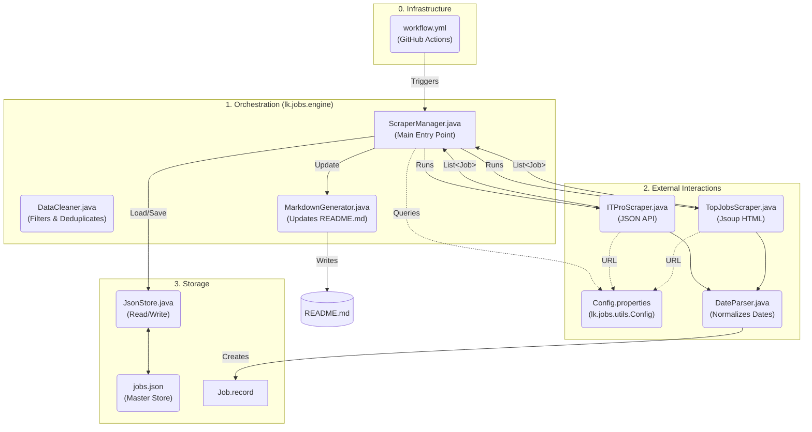

# 🇱🇰 Sri Lanka Software Engineering Jobs | 2026 Tracker [](https://t.me/SL_Software_Jobs)
Looking for software engineering jobs in Sri Lanka? This tracker updates daily with intern, junior, and senior IT roles across Colombo and beyond
Automated Software Engineering Job Tracker for Sri Lanka. Scrapes and categorizes Intern, Associate, and SE roles daily using Java (Jsoup) and GitHub Actions.

> [!TIP]
> **Help keep this project alive!** If this tool helped you find a lead today, please [**Star ⭐ the repo**](https://github.com/Senadeera-NK/sri-lanka-software-jobs). It’s how I measure the impact on our dev community! 🇱🇰

> [!IMPORTANT]
> **Automatic Staleness Purge:** The engine automatically removes listings older than **14 days**, ensuring the feed stays relevant and high-signal.

> **Live Analytics & Daily Software Job Tracker for Sri Lanka**

[📊 View Live Dashboard](https://sri-lanka-software-jobs.vercel.app/)

 
*Click the link above to see real-time trends, seniority distribution, and top hiring companies.*

## 📊 Current Job Openings
> 🟢 **Last Updated:** August 3,7:28 PM (Just now)  | **Total Jobs Found:** 158

### 🎓 Internships & Trainees  (32)

| Title | Company | Level  | Posted | Source |
| :--- | :--- | :--- | :--- | :--- |
| [QA Intern](https://itpro.lk/job/14544/qa-intern-at-nvision/) | Nvision | Intern | 2&nbsp;hours&nbsp;ago | ITPro.lk |
| [Intern Software Engineer](https://itpro.lk/job/14543/intern-software-engineer-at-healthrecon-connect-llc/) | HealthRecon Connect LLC | Intern | 3&nbsp;hours&nbsp;ago | ITPro.lk |
| [QA \| Software Tester (Trainee \| Intern)](https://www.topjobs.lk/employer/JobAdvertismentServlet?ac=DEFZZZ&jc=0001526871&ec=DEFZZZ) | myPOS Software Solutions (Pvt) Ltd | Intern | 19&nbsp;hours&nbsp;ago | TopJobs.lk |
| [MERN Stack Developer Intern](https://itpro.lk/job/14538/mern-stack-developer-intern-at-looplab-pvt-ltd/) | LoopLab (Pvt) Ltd | Intern | 21&nbsp;hours&nbsp;ago | ITPro.lk |
| [Python Developer Intern](https://itpro.lk/job/14537/python-developer-intern-at-looplab-pvt-ltd/) | LoopLab (Pvt) Ltd | Intern | 21&nbsp;hours&nbsp;ago | ITPro.lk |
| [Quality Assurance Intern](https://itpro.lk/job/13688/quality-assurance-intern-at-looplab-pvt-ltd/) | LoopLab (Pvt) Ltd | Intern | 21&nbsp;hours&nbsp;ago | ITPro.lk |
| [Quality Assurance Internship](https://itpro.lk/job/14536/quality-assurance-internship-at-sarani-pvt-limited/) | Sarani Pvt Limited | Intern | Yesterday | ITPro.lk |
| [PHP Development Internship](https://itpro.lk/job/14535/php-development-internship-at-cyclomax-international-pvt-ltd/) | Cyclomax International (Pvt) Ltd | Intern | Yesterday | ITPro.lk |
| [QA Intern](https://itpro.lk/job/14534/qa-intern-at-sarani-pvt-limited/) | Sarani Pvt Limited | Intern | Yesterday | ITPro.lk |
| [Software Development Interns (MERN Stack)](https://itpro.lk/job/14523/software-development-interns-mern-stack-at-si-labs-pvt-ltd/) | SI Labs (Pvt) Ltd | Intern | 3&nbsp;days&nbsp;ago | ITPro.lk |
| [Software Engineering Intern](https://itpro.lk/job/14508/software-engineering-intern-at-hiveion/) | Hiveion | Intern | 3&nbsp;days&nbsp;ago | ITPro.lk |
| [Full Stack Software Engineer – Intern](https://itpro.lk/job/14498/full-stack-software-engineer-intern-at-idea8-pvt-ltd/) | Idea8 (Pvt) Ltd | Intern | 4&nbsp;days&nbsp;ago | ITPro.lk |
| [Quality Assurance Internship](https://itpro.lk/job/14497/quality-assurance-internship-at-gamage-recruiters-pvt-ltd/) | Gamage Recruiters (Pvt) Ltd | Intern | 4&nbsp;days&nbsp;ago | ITPro.lk |
| [Software Development Intern](https://itpro.lk/job/14495/software-development-intern-at-innovista-metal-fabriconix-pvt-ltd/) | Innovista Metal Fabriconix (Pvt) Ltd | Intern | 4&nbsp;days&nbsp;ago | ITPro.lk |
| [Full Stack Developer Intern](https://itpro.lk/job/14479/full-stack-developer-intern-at-futura-solutions/) | Futura Solutions | Intern | 6&nbsp;days&nbsp;ago | ITPro.lk |
| [Software Engineer Intern](https://itpro.lk/job/14475/software-engineer-intern-at-alphintra/) | Alphintra | Intern | 6&nbsp;days&nbsp;ago | ITPro.lk |
| [Quality Assurance (QA) Intern](https://itpro.lk/job/14470/quality-assurance-qa-intern-at-tecoora-pty-ltd/) | Tecoora Pty Ltd | Intern | 6&nbsp;days&nbsp;ago | ITPro.lk |
| [Software Engineer Intern](https://itpro.lk/job/13215/software-engineer-intern-at-perpova-developers/) | Perpova Developers | Intern | 7&nbsp;days&nbsp;ago | ITPro.lk |
| [QA Engineer Intern](https://itpro.lk/job/13214/qa-engineer-intern-at-perpova-developers/) | Perpova Developers | Intern | 7&nbsp;days&nbsp;ago | ITPro.lk |
| [Associate Engineer / Engineering Intern, Power Platform](https://rooster.jobs/jobs/518907) | Snapdrum | Intern | 7&nbsp;days&nbsp;ago | Rooster.jobs |
| [Intern Software Engineer (Software Development & Gen AI)](https://itpro.lk/job/14426/intern-software-engineer-software-development-gen-ai-at-xeynergy/) | Xeynergy | Intern | 11&nbsp;days&nbsp;ago | ITPro.lk |
| [Software Engineer Intern](https://www.topjobs.lk/employer/JobAdvertismentServlet?ac=DEFZZZ&jc=0001527949&ec=DEFZZZ) | Electrobeam (Pvt) Ltd | Intern | 11&nbsp;days&nbsp;ago | TopJobs.lk |
| [Full Stack Developer Intern (Java, Spring Boot & React)](https://www.topjobs.lk/employer/JobAdvertismentServlet?ac=DEFZZZ&jc=0001527832&ec=DEFZZZ) | Blue Chip Technical Services (Pvt) Ltd | Intern | 11&nbsp;days&nbsp;ago | TopJobs.lk |
| [Frontend Developer Intern (React & Material UI)](https://www.topjobs.lk/employer/JobAdvertismentServlet?ac=DEFZZZ&jc=0001527828&ec=DEFZZZ) | Blue Chip Technical Services (Pvt) Ltd | Intern | 11&nbsp;days&nbsp;ago | TopJobs.lk |
| [Intern - Software Engineer](https://itpro.lk/job/14411/intern-software-engineer-at-exelk/) | Exe.lk | Intern | 12&nbsp;days&nbsp;ago | ITPro.lk |
| [QA Intern](https://itpro.lk/job/14400/qa-intern-at-navitsa/) | Navitsa | Intern | 12&nbsp;days&nbsp;ago | ITPro.lk |
| [Intern Software Engineer (React / .NET Core)](https://itpro.lk/job/14397/intern-software-engineer-react-net-core-at-novrix-solutions-pvt-ltd/) | Novrix Solutions (Pvt) Ltd | Intern | 13&nbsp;days&nbsp;ago | ITPro.lk |
| [Internship - Data & Business Intelligence](https://www.topjobs.lk/employer/JobAdvertismentServlet?ac=DEFZZZ&jc=0001526850&ec=DEFZZZ) | Edotco Group | Intern | 13&nbsp;days&nbsp;ago | TopJobs.lk |
| [Full Stack Developer Intern](https://www.topjobs.lk/employer/JobAdvertismentServlet?ac=DEFZZZ&jc=0001526729&ec=DEFZZZ) | Medcube USA | Intern | 13&nbsp;days&nbsp;ago | TopJobs.lk |
| [Intern Web Developer](https://itpro.lk/job/14390/intern-web-developer-at-sans-technologies/) | Sans Technologies | Intern | 14&nbsp;days&nbsp;ago | ITPro.lk |
| [Software Engineering - Intern](https://itpro.lk/job/13867/software-engineering-intern-at-qdesk-ai-pvt-ltd/) | Qdesk AI Pvt Ltd | Intern | 14&nbsp;days&nbsp;ago | ITPro.lk |
| [QA Intern](https://itpro.lk/job/14384/qa-intern-at-gloocan-technologies-pvt-ltd/) | Gloocan Technologies (Pvt) Ltd | Intern | 14&nbsp;days&nbsp;ago | ITPro.lk |

---

### 💻 Associate & Junior/SE Roles  (88)

| Title | Company | Level  | Posted | Source |
| :--- | :--- | :--- | :--- | :--- |
| [Associate Technical Lead – Full Stack](https://itpro.lk/job/14545/associate-technical-lead-full-stack-at-tecciance/) | tecciance | Associate | 2&nbsp;hours&nbsp;ago | ITPro.lk |
| [WordPress Developer](https://itpro.lk/job/14542/wordpress-developer-at-snakewall/) | Snakewall | Junior/SE | 4&nbsp;hours&nbsp;ago | ITPro.lk |
| [Junior QA Engineer](https://itpro.lk/job/14540/junior-qa-engineer-at-amerck-care/) | Amerck Care | Junior/SE | 5&nbsp;hours&nbsp;ago | ITPro.lk |
| [Junior Algorithm Engineer - DSP - FPGA Engineer](https://www.topjobs.lk/employer/JobAdvertismentServlet?ac=DEFZZZ&jc=0001526543&ec=DEFZZZ) | Thakshana Technologies (Pvt) Ltd | Junior/SE | 19&nbsp;hours&nbsp;ago | TopJobs.lk |
| [Design Engineer](https://www.topjobs.lk/employer/JobAdvertismentServlet?ac=DEFZZZ&jc=0001527063&ec=DEFZZZ) | KRAMSKI Lanka (Pvt) Ltd | Junior/SE | 19&nbsp;hours&nbsp;ago | TopJobs.lk |
| [Junior Web Developer](https://www.topjobs.lk/employer/JobAdvertismentServlet?ac=DEFZZZ&jc=0001529417&ec=DEFZZZ) | Ignite Media Vision (Pvt) Ltd | Junior/SE | 19&nbsp;hours&nbsp;ago | TopJobs.lk |
| [Graduate GenAI Developer for FPGA Workflows](https://www.topjobs.lk/employer/JobAdvertismentServlet?ac=DEFZZZ&jc=0001530171&ec=DEFZZZ) | Company Name Withheld | Junior/SE | 19&nbsp;hours&nbsp;ago | TopJobs.lk |
| [Graduate Generative AI Engineer (MATLAB & Simulink)](https://www.topjobs.lk/employer/JobAdvertismentServlet?ac=DEFZZZ&jc=0001530170&ec=DEFZZZ) | Company Name Withheld | Junior/SE | 19&nbsp;hours&nbsp;ago | TopJobs.lk |
| [AI-Native Full-Stack Builder](https://www.topjobs.lk/employer/JobAdvertismentServlet?ac=DEFZZZ&jc=0001530167&ec=DEFZZZ) | Company Name Withheld | Junior/SE | 19&nbsp;hours&nbsp;ago | TopJobs.lk |
| [Software Engineer \| Associate Software Engineer](https://www.topjobs.lk/employer/JobAdvertismentServlet?ac=DEFZZZ&jc=0001531479&ec=DEFZZZ) | Paragon Software Lanka (Pvt) Ltd | Associate | 19&nbsp;hours&nbsp;ago | TopJobs.lk |
| [Software Engineer (.NET / React)](https://itpro.lk/job/14197/software-engineer-net-react-at-verdentra/) | Verdentra | Junior/SE | Yesterday | ITPro.lk |
| [Java Developer](https://itpro.lk/job/14531/java-developer-at-adept-technologies/) | Adept Technologies | Junior/SE | 2&nbsp;days&nbsp;ago | ITPro.lk |
| [Manual QA Tester](https://itpro.lk/job/14529/manual-qa-tester-at-adept-technologies/) | Adept Technologies | Junior/SE | 2&nbsp;days&nbsp;ago | ITPro.lk |
| [Full Stack Developer](https://itpro.lk/job/14527/full-stack-developer-at-portal-pvt-ltd/) | Portal (PVT) LTD | Junior/SE | 2&nbsp;days&nbsp;ago | ITPro.lk |
| [Web Developer](https://itpro.lk/job/14329/web-developer-at-printerslk-pvt-ltd/) | Printers.lk Pvt Ltd | Junior/SE | 2&nbsp;days&nbsp;ago | ITPro.lk |
| [Full Stack Web Developer](https://itpro.lk/job/14525/full-stack-web-developer-at-vexoweb/) | Vexoweb | Junior/SE | 2&nbsp;days&nbsp;ago | ITPro.lk |
| [QA Engineer](https://itpro.lk/job/14520/qa-engineer-at-vitalfew/) | VitalFew | Junior/SE | 3&nbsp;days&nbsp;ago | ITPro.lk |
| [Java Full-Stack Developer](https://itpro.lk/job/13431/java-fullstack-developer-at-finakle-mangement-solution-pvt-ltd/) | Finakle Mangement Solution (Pvt) Ltd | Junior/SE | 3&nbsp;days&nbsp;ago | ITPro.lk |
| [Big Data Engineer (1)](https://www.topjobs.lk/employer/JobAdvertismentServlet?ac=0000000271&jc=0001420855&ec=0000000350) | CMS (Pvt) Ltd | Junior/SE | 3&nbsp;days&nbsp;ago | TopJobs.lk |
| [Full Stack Developer - Java & React (Banking Applications)](https://www.topjobs.lk/employer/JobAdvertismentServlet?ac=DEFZZZ&jc=0001530803&ec=DEFZZZ) | Fortunaglobal Private Limited | Junior/SE | 3&nbsp;days&nbsp;ago | TopJobs.lk |
| [Data Analyst](https://www.topjobs.lk/employer/JobAdvertismentServlet?ac=DEFZZZ&jc=0001530552&ec=DEFZZZ) | Company Name Withheld | Junior/SE | 3&nbsp;days&nbsp;ago | TopJobs.lk |
| [ATL / SSE Front End Developer (1)](https://www.topjobs.lk/employer/JobAdvertismentServlet?ac=0000000421&jc=0001523743&ec=0000000555) | Sumathi Group | Junior/SE | 3&nbsp;days&nbsp;ago | TopJobs.lk |
| [Data Engineer](https://www.topjobs.lk/employer/JobAdvertismentServlet?ac=DEFZZZ&jc=0001531055&ec=DEFZZZ) | ORYSYS Limited | Junior/SE | 3&nbsp;days&nbsp;ago | TopJobs.lk |
| [Data Engineer - REF7025](https://rooster.jobs/jobs/518976) | Creative Software | Junior/SE | 3&nbsp;days&nbsp;ago | Rooster.jobs |
| [QA Engineer](https://itpro.lk/job/14507/qa-engineer-at-platned/) | Platned | Junior/SE | 4&nbsp;days&nbsp;ago | ITPro.lk |
| [Trainee Quality Assurance Engineer](https://itpro.lk/job/14504/trainee-quality-assurance-engineer-at-echonlabs/) | EchonLabs | Associate | 4&nbsp;days&nbsp;ago | ITPro.lk |
| [NetSuite Technical Developer](https://itpro.lk/job/14502/netsuite-technical-developer-at-bistec-global-services/) | BISTEC Global Services | Junior/SE | 4&nbsp;days&nbsp;ago | ITPro.lk |
| [Shopify Website Developer](https://itpro.lk/job/14499/shopify-website-developer-at-wis-bpo/) | WIS BPO | Junior/SE | 4&nbsp;days&nbsp;ago | ITPro.lk |
| [Associate Software Engineer - Department of IT](https://www.topjobs.lk/employer/JobAdvertismentServlet?ac=DEFZZZ&jc=0001530186&ec=DEFZZZ) | Sri Lanka Institute of Information Technology (SLIIT) | Associate | 4&nbsp;days&nbsp;ago | TopJobs.lk |
| [Machine Learning Engineer](https://www.topjobs.lk/employer/JobAdvertismentServlet?ac=DEFZZZ&jc=0001530181&ec=DEFZZZ) | Company Name Withheld | Junior/SE | 4&nbsp;days&nbsp;ago | TopJobs.lk |
| [Graduate Data Engineer (AI Workflows)](https://www.topjobs.lk/employer/JobAdvertismentServlet?ac=DEFZZZ&jc=0001530174&ec=DEFZZZ) | Company Name Withheld | Junior/SE | 4&nbsp;days&nbsp;ago | TopJobs.lk |
| [Software Engineer (.NET)](https://www.topjobs.lk/employer/JobAdvertismentServlet?ac=DEFZZZ&jc=0001530151&ec=DEFZZZ) | IPD Colombo | Junior/SE | 4&nbsp;days&nbsp;ago | TopJobs.lk |
| [Database Administrator (1)](https://www.topjobs.lk/employer/JobAdvertismentServlet?ac=0000000440&jc=0001530287&ec=0000000582) | Lanka Hospitals Corporation PLC | Junior/SE | 4&nbsp;days&nbsp;ago | TopJobs.lk |
| [QA Engineer](https://www.topjobs.lk/employer/JobAdvertismentServlet?ac=DEFZZZ&jc=0001530235&ec=DEFZZZ) | VitalFew Asia | Junior/SE | 4&nbsp;days&nbsp;ago | TopJobs.lk |
| [Power Platform & Copilot Developer](https://itpro.lk/job/14496/power-platform-copilot-developer-at-bistec-global-services/) | BISTEC Global Services | Junior/SE | 4&nbsp;days&nbsp;ago | ITPro.lk |
| [QA Associate](https://itpro.lk/job/14494/qa-associate-at-d-help-hub-private-limited/) | D HELP HUB Private Limited | Associate | 5&nbsp;days&nbsp;ago | ITPro.lk |
| [Quality Engineer](https://itpro.lk/job/14493/quality-engineer-at-softvil-technologies/) | Softvil Technologies | Junior/SE | 5&nbsp;days&nbsp;ago | ITPro.lk |
| [Software Engineer](https://itpro.lk/job/14490/software-engineer-at-amazoft/) | Amazoft | Junior/SE | 5&nbsp;days&nbsp;ago | ITPro.lk |
| [Software Engineer -Fullstack Developer (1)](https://www.topjobs.lk/employer/JobAdvertismentServlet?ac=0000000039&jc=0001530044&ec=0000000373) | Synapsys | Junior/SE | 5&nbsp;days&nbsp;ago | TopJobs.lk |
| [DEVOPS ENGINEER (1)](https://www.topjobs.lk/employer/JobAdvertismentServlet?ac=0000000023&jc=0001530040&ec=0000000023) | Maritime Placements (Pvt) Ltd | Junior/SE | 5&nbsp;days&nbsp;ago | TopJobs.lk |
| [Associate QA Engineer](https://www.topjobs.lk/employer/JobAdvertismentServlet?ac=DEFZZZ&jc=0001524251&ec=DEFZZZ) | Treinetic Pvt Ltd | Associate | 5&nbsp;days&nbsp;ago | TopJobs.lk |
| [PHP Laravel Developer](https://itpro.lk/job/14484/php-laravel-developer-at-rapidventure-business-solutions-pvt-ltd/) | Rapidventure Business Solutions (Pvt) Ltd | Junior/SE | 6&nbsp;days&nbsp;ago | ITPro.lk |
| [Associate Software Engineer](https://itpro.lk/job/14480/associate-software-engineer-at-amplaz/) | Amplaz | Associate | 6&nbsp;days&nbsp;ago | ITPro.lk |
| [Associate Quality Engineering Lead](https://itpro.lk/job/14474/associate-quality-engineering-lead-at-softvil-technologies/) | Softvil Technologies | Associate | 6&nbsp;days&nbsp;ago | ITPro.lk |
| [Software Engineer – Integration Server (Aeonix/OmniCX)](https://rooster.jobs/jobs/518934) | Twist Digital | Junior/SE | 6&nbsp;days&nbsp;ago | Rooster.jobs |
| [AI Engineer](https://www.topjobs.lk/employer/JobAdvertismentServlet?ac=DEFZZZ&jc=0001529762&ec=DEFZZZ) | Ernst & Young | Junior/SE | 6&nbsp;days&nbsp;ago | TopJobs.lk |
| [Full Stack Developer](https://www.topjobs.lk/employer/JobAdvertismentServlet?ac=DEFZZZ&jc=0001529755&ec=DEFZZZ) | HISP Sri Lanka | Junior/SE | 6&nbsp;days&nbsp;ago | TopJobs.lk |
| [Boomi Integration Engineer - Colombo 5](https://www.topjobs.lk/employer/JobAdvertismentServlet?ac=DEFZZZ&jc=0001529730&ec=DEFZZZ) | HR Masterminder | Junior/SE | 6&nbsp;days&nbsp;ago | TopJobs.lk |
| [Associate Engineer - Business Intelligence (1)](https://www.topjobs.lk/employer/JobAdvertismentServlet?ac=0000000280&jc=0001529648&ec=0000000510) | Expolanka Freight (Pvt) Ltd | Associate | 6&nbsp;days&nbsp;ago | TopJobs.lk |
| [Associate / Executive (Privacy & Data Protection Service)](https://www.topjobs.lk/employer/JobAdvertismentServlet?ac=DEFZZZ&jc=0001529921&ec=DEFZZZ) | Ernst & Young | Associate | 6&nbsp;days&nbsp;ago | TopJobs.lk |
| [Data Engineer](https://www.topjobs.lk/employer/JobAdvertismentServlet?ac=DEFZZZ&jc=0001529764&ec=DEFZZZ) | Ernst & Young | Junior/SE | 6&nbsp;days&nbsp;ago | TopJobs.lk |
| [QA Engineer](https://www.topjobs.lk/employer/JobAdvertismentServlet?ac=DEFZZZ&jc=0001524056&ec=DEFZZZ) | InEight Sri Lanka | Junior/SE | 6&nbsp;days&nbsp;ago | TopJobs.lk |
| [Software Engineer – Application Technology (Workday Integrations)](https://itpro.lk/job/14457/software-engineer-application-technology-workday-integrations-at-tecciance/) | tecciance | Junior/SE | 7&nbsp;days&nbsp;ago | ITPro.lk |
| [QA Engineer](https://itpro.lk/job/14456/qa-engineer-at-dxdy/) | dxdy | Junior/SE | 7&nbsp;days&nbsp;ago | ITPro.lk |
| [Analyst - Cyber Security (1)](https://www.topjobs.lk/employer/JobAdvertismentServlet?ac=0000000017&jc=0001529420&ec=0000000017) | Colombo Stock Exchange | Junior/SE | 7&nbsp;days&nbsp;ago | TopJobs.lk |
| [Automation Engineer](https://www.topjobs.lk/employer/JobAdvertismentServlet?ac=DEFZZZ&jc=0001529332&ec=DEFZZZ) | Dijital People Pvt Ltd | Junior/SE | 7&nbsp;days&nbsp;ago | TopJobs.lk |
| [Associate Software Engineer / Software Engineer (Full-Stack ...](https://rooster.jobs/jobs/518914) | IdeaBits | Associate | 7&nbsp;days&nbsp;ago | Rooster.jobs |
| [Full Stack Engineer (Project-Based / Task-Based)](https://itpro.lk/job/14444/full-stack-engineer-projectbased-taskbased-at-lycerix-global/) | Lycerix Global | Junior/SE | 10&nbsp;days&nbsp;ago | ITPro.lk |
| [Associate QA Engineer](https://itpro.lk/job/14443/associate-qa-engineer-at-lycerix-global/) | Lycerix Global | Associate | 10&nbsp;days&nbsp;ago | ITPro.lk |
| [Quality Engineer (Automation)](https://itpro.lk/job/14441/quality-engineer-automation-at-verdentra/) | Verdentra | Junior/SE | 10&nbsp;days&nbsp;ago | ITPro.lk |
| [Automation Engineer - Telecom Solutions](https://itpro.lk/job/14438/automation-engineer-telecom-solutions-at-hatchyard/) | Hatchyard | Junior/SE | 10&nbsp;days&nbsp;ago | ITPro.lk |
| [Software Engineer - Application Technology (Workday Integrations)](https://itpro.lk/job/14437/software-engineer-application-technology-workday-integrations-at-hatchyard/) | Hatchyard | Junior/SE | 10&nbsp;days&nbsp;ago | ITPro.lk |
| [Full Stack Software Engineer](https://www.topjobs.lk/employer/JobAdvertismentServlet?ac=DEFZZZ&jc=0001528396&ec=DEFZZZ) | Primed Pharmacy | Junior/SE | 10&nbsp;days&nbsp;ago | TopJobs.lk |
| [Full Stack Engineer - Colombo \| Work from Home](https://www.topjobs.lk/employer/JobAdvertismentServlet?ac=DEFZZZ&jc=0001528280&ec=DEFZZZ) | Appoyo | Junior/SE | 10&nbsp;days&nbsp;ago | TopJobs.lk |
| [Backend Engineer - Colombo \| Work from Home](https://www.topjobs.lk/employer/JobAdvertismentServlet?ac=DEFZZZ&jc=0001528273&ec=DEFZZZ) | Appoyo | Junior/SE | 10&nbsp;days&nbsp;ago | TopJobs.lk |
| [FULL STACK DEVELOPER (1)](https://www.topjobs.lk/employer/JobAdvertismentServlet?ac=0000000023&jc=0001528930&ec=0000000023) | Maritime Placements (Pvt) Ltd | Junior/SE | 10&nbsp;days&nbsp;ago | TopJobs.lk |
| [REACT DEVELOPER (1)](https://www.topjobs.lk/employer/JobAdvertismentServlet?ac=0000000023&jc=0001528568&ec=0000000023) | Maritime Placements (Pvt) Ltd | Junior/SE | 10&nbsp;days&nbsp;ago | TopJobs.lk |
| [QUALITY ASSURANCE ENGINEER (1)](https://www.topjobs.lk/employer/JobAdvertismentServlet?ac=0000000023&jc=0001528939&ec=0000000023) | Maritime Placements (Pvt) Ltd | Junior/SE | 10&nbsp;days&nbsp;ago | TopJobs.lk |
| [WordPress Developer](https://itpro.lk/job/14431/wordpress-developer-at-knowledge-books-and-software/) | Knowledge Books and Software | Junior/SE | 10&nbsp;days&nbsp;ago | ITPro.lk |
| [Lead QA Engineer / Associate Lead QA Engineer](https://itpro.lk/job/14427/lead-qa-engineer-associate-lead-qa-engineer-at-simsyn-pvt-ltd/) | Simsyn Pvt Ltd | Associate | 10&nbsp;days&nbsp;ago | ITPro.lk |
| [Associate QA Engineer](https://itpro.lk/job/14419/associate-qa-engineer-at-predictiv-ai/) | Predictiv AI | Associate | 11&nbsp;days&nbsp;ago | ITPro.lk |
| [DTP Developer - Galle](https://www.topjobs.lk/employer/JobAdvertismentServlet?ac=DEFZZZ&jc=0001527797&ec=DEFZZZ) | Alpha Industries South Asia (Pvt) Ltd | Junior/SE | 11&nbsp;days&nbsp;ago | TopJobs.lk |
| [Associate Software Engineers - Full Stack (.NET) (1)](https://www.topjobs.lk/employer/JobAdvertismentServlet?ac=0000000343&jc=0001528075&ec=0000000458) | KPMG Executive Search Private Limited | Associate | 11&nbsp;days&nbsp;ago | TopJobs.lk |
| [Associate QA Lead](https://itpro.lk/job/14408/associate-qa-lead-at-tecciance/) | tecciance | Associate | 12&nbsp;days&nbsp;ago | ITPro.lk |
| [QA Engineer](https://itpro.lk/job/14406/qa-engineer-at-tecciance/) | tecciance | Junior/SE | 12&nbsp;days&nbsp;ago | ITPro.lk |
| [Associate Software Engineer - Full Stack (1)](https://www.topjobs.lk/employer/JobAdvertismentServlet?ac=0000000441&jc=0001527447&ec=0000000583) | Ascent Business Solutions (Pvt) Ltd | Associate | 12&nbsp;days&nbsp;ago | TopJobs.lk |
| [Software Developer (Remote / Full Time)](https://www.topjobs.lk/employer/JobAdvertismentServlet?ac=DEFZZZ&jc=0001527413&ec=DEFZZZ) | TechSense | Junior/SE | 12&nbsp;days&nbsp;ago | TopJobs.lk |
| [Data Analystics Executive](https://www.topjobs.lk/employer/JobAdvertismentServlet?ac=DEFZZZ&jc=0001527326&ec=DEFZZZ) | The Swadeshi Industrial Works PLC | Junior/SE | 12&nbsp;days&nbsp;ago | TopJobs.lk |
| [Software Engineer](https://www.topjobs.lk/employer/JobAdvertismentServlet?ac=DEFZZZ&jc=0001527290&ec=DEFZZZ) | Spherehead Technologies (Pvt) Ltd | Junior/SE | 12&nbsp;days&nbsp;ago | TopJobs.lk |
| [Data Analyst](https://www.topjobs.lk/employer/JobAdvertismentServlet?ac=DEFZZZ&jc=0001527256&ec=DEFZZZ) | Wnato (Pvt) Ltd | Junior/SE | 12&nbsp;days&nbsp;ago | TopJobs.lk |
| [School Leaver Data Formatter for LLM Processing - Battramulla](https://www.topjobs.lk/employer/JobAdvertismentServlet?ac=DEFZZZ&jc=0001524641&ec=DEFZZZ) | ServiceTeam Ltd | Junior/SE | 12&nbsp;days&nbsp;ago | TopJobs.lk |
| [Sports Data & Content Executive (2)](https://www.topjobs.lk/employer/JobAdvertismentServlet?ac=0000000421&jc=0001527624&ec=0000000555) | Sumathi Group | Junior/SE | 12&nbsp;days&nbsp;ago | TopJobs.lk |
| [Associate QA Engineer](https://itpro.lk/job/14403/associate-qa-engineer-at-digital-health-private-limited/) | Digital Health Private Limited | Associate | 12&nbsp;days&nbsp;ago | ITPro.lk |
| [Software Engineer .NET](https://itpro.lk/job/11276/software-engineer-net-at-ideahub/) | Ideahub | Junior/SE | 13&nbsp;days&nbsp;ago | ITPro.lk |
| [Software Engineer](https://www.topjobs.lk/employer/JobAdvertismentServlet?ac=DEFZZZ&jc=0001521550&ec=DEFZZZ) | Prima Management Services (Pvt) Ltd | Junior/SE | 13&nbsp;days&nbsp;ago | TopJobs.lk |
| [Software Engineer](https://itpro.lk/job/14389/software-engineer-at-homey/) | Homey | Junior/SE | 14&nbsp;days&nbsp;ago | ITPro.lk |
| [Mobile App Developer (Android)](https://www.topjobs.lk/employer/JobAdvertismentServlet?ac=DEFZZZ&jc=0001526372&ec=DEFZZZ) | Asian Logistics Solutions (Pvt) Ltd | Junior/SE | 14&nbsp;days&nbsp;ago | TopJobs.lk |
| [Trainee - Web Developer](https://itpro.lk/job/14387/trainee-web-developer-at-earrow-pvt-ltd/) | eArrow (Pvt) LTD | Associate | 14&nbsp;days&nbsp;ago | ITPro.lk |

---

### 🚀 Senior & Lead Roles  (38)

| Title | Company | Level  | Posted | Source |
| :--- | :--- | :--- | :--- | :--- |
| [Senior .NET Backend Software Engineer](https://itpro.lk/job/14549/senior-net-backend-software-engineer-at-tecciance/) | tecciance | Senior | 2&nbsp;hours&nbsp;ago | ITPro.lk |
| [.NET Backend Product Lead](https://itpro.lk/job/14548/net-backend-product-lead-at-tecciance/) | tecciance | Senior | 2&nbsp;hours&nbsp;ago | ITPro.lk |
| [Senior Frontend Software Engineer](https://itpro.lk/job/14547/senior-frontend-software-engineer-at-tecciance/) | tecciance | Senior | 2&nbsp;hours&nbsp;ago | ITPro.lk |
| [Frontend Product Lead](https://itpro.lk/job/14546/frontend-product-lead-at-tecciance/) | tecciance | Senior | 2&nbsp;hours&nbsp;ago | ITPro.lk |
| [Senior Lead Engineer - IBM i](https://www.topjobs.lk/employer/JobAdvertismentServlet?ac=DEFZZZ&jc=0001528392&ec=DEFZZZ) | Commercial Bank | Senior | Yesterday | TopJobs.lk |
| [Senior Backend Software Engineer (C++ /.NET)](https://itpro.lk/job/14516/senior-backend-software-engineer-c-net-at-avikans-techshore-services/) | Avikans Techshore Services | Senior | 3&nbsp;days&nbsp;ago | ITPro.lk |
| [Senior Developer / Tech Lead / Senior Tech Lead Full-Stack (...](https://itpro.lk/job/14514/senior-developer-tech-lead-senior-tech-lead-fullstack-angular-nodejs-net-at-bistec-global-services/) | BISTEC Global Services | Senior | 3&nbsp;days&nbsp;ago | ITPro.lk |
| [Senior Quality Assurance Engineer](https://itpro.lk/job/14513/senior-quality-assurance-engineer-at-softvil-technologies/) | Softvil Technologies | Senior | 3&nbsp;days&nbsp;ago | ITPro.lk |
| [Senior QA Engineer (1)](https://www.topjobs.lk/employer/JobAdvertismentServlet?ac=0000000271&jc=0001519031&ec=0000000350) | CMS (Pvt) Ltd | Senior | 3&nbsp;days&nbsp;ago | TopJobs.lk |
| [Senior Software Engineer - Python](https://www.topjobs.lk/employer/JobAdvertismentServlet?ac=DEFZZZ&jc=0001530855&ec=DEFZZZ) | InSync Information Technologies (Pvt) Ltd | Senior | 3&nbsp;days&nbsp;ago | TopJobs.lk |
| [Senior Data Engineer - REF7026](https://rooster.jobs/jobs/518975) | Creative Software | Senior | 3&nbsp;days&nbsp;ago | Rooster.jobs |
| [Senior Web Developer](https://www.topjobs.lk/employer/JobAdvertismentServlet?ac=DEFZZZ&jc=0001530143&ec=DEFZZZ) | IPD Colombo Pvt Ltd | Senior | 4&nbsp;days&nbsp;ago | TopJobs.lk |
| [Senior Software Engineer - Full Stack](https://itpro.lk/job/14492/senior-software-engineer-full-stack-at-softvil-technologies/) | Softvil Technologies | Senior | 5&nbsp;days&nbsp;ago | ITPro.lk |
| [Senior Business Analyst, Product Development](https://rooster.jobs/jobs/518943) | Kainovation Technologies (PVT) Ltd. | Senior | 5&nbsp;days&nbsp;ago | Rooster.jobs |
| [Lead AI Engineer](https://rooster.jobs/jobs/518942) | Kainovation Technologies (PVT) Ltd. | Senior | 5&nbsp;days&nbsp;ago | Rooster.jobs |
| [Senior Data Engineer, Client Implementations](https://rooster.jobs/jobs/518941) | Kainovation Technologies (PVT) Ltd. | Senior | 5&nbsp;days&nbsp;ago | Rooster.jobs |
| [Senior Software QA Engineer](https://itpro.lk/job/14483/senior-software-qa-engineer-at-pelago/) | Pelago | Senior | 6&nbsp;days&nbsp;ago | ITPro.lk |
| [Senior Software Engineer / Software Engineer](https://itpro.lk/job/14476/senior-software-engineer-software-engineer-at-healthrecon-connect-llc/) | HealthRecon Connect LLC | Senior | 6&nbsp;days&nbsp;ago | ITPro.lk |
| [Senior Engineer - Business Intelligence (1)](https://www.topjobs.lk/employer/JobAdvertismentServlet?ac=0000000280&jc=0001529658&ec=0000000510) | Expolanka Freight (Pvt) Ltd | Senior | 6&nbsp;days&nbsp;ago | TopJobs.lk |
| [Senior Enterprise Systems Engineer (1)](https://www.topjobs.lk/employer/JobAdvertismentServlet?ac=0000000062&jc=0001529811&ec=0000000068) | Softlogic Holdings PLC | Senior | 6&nbsp;days&nbsp;ago | TopJobs.lk |
| [Lead .NET Engineer](https://itpro.lk/job/14454/lead-net-engineer-at-via-codos-private-limited/) | Via Codos Private Limited | Senior | 7&nbsp;days&nbsp;ago | ITPro.lk |
| [Senior Software Developer](https://www.topjobs.lk/employer/JobAdvertismentServlet?ac=DEFZZZ&jc=0001529183&ec=DEFZZZ) | Company Name Withheld | Senior | 7&nbsp;days&nbsp;ago | TopJobs.lk |
| [Senior Software Engineer – API Development](https://itpro.lk/job/14434/senior-software-engineer-api-development-at-vs-one-world-pvt-ltd/) | VS ONE WORLD (Pvt) Ltd | Senior | 10&nbsp;days&nbsp;ago | ITPro.lk |
| [SENIOR LARAVEL ENGINEER (1)](https://www.topjobs.lk/employer/JobAdvertismentServlet?ac=0000000023&jc=0001528681&ec=0000000023) | Maritime Placements (Pvt) Ltd | Senior | 10&nbsp;days&nbsp;ago | TopJobs.lk |
| [QUALITY ASSURANCE LEAD (1)](https://www.topjobs.lk/employer/JobAdvertismentServlet?ac=0000000023&jc=0001528554&ec=0000000023) | Maritime Placements (Pvt) Ltd | Senior | 10&nbsp;days&nbsp;ago | TopJobs.lk |
| [Technical Lead – Full Stack](https://itpro.lk/job/14430/technical-lead-full-stack-at-softvil-technologies/) | Softvil Technologies | Senior | 10&nbsp;days&nbsp;ago | ITPro.lk |
| [RPG Engineer / Lead RPG Engineer](https://itpro.lk/job/14420/rpg-engineer-lead-rpg-engineer-at-/) |  | Senior | 11&nbsp;days&nbsp;ago | ITPro.lk |
| [Senior Software Engineer (Odoo)](https://itpro.lk/job/14416/senior-software-engineer-odoo-at-nisus-solutions-pvt-ltd/) | Nisus Solutions (Pvt) Ltd | Senior | 11&nbsp;days&nbsp;ago | ITPro.lk |
| [Senior IOS Developer - Mobile Banking](https://www.topjobs.lk/employer/JobAdvertismentServlet?ac=DEFZZZ&jc=0001527878&ec=DEFZZZ) | Fortunaglobal (Pvt) Limited | Senior | 11&nbsp;days&nbsp;ago | TopJobs.lk |
| [Senior Software Engineer](https://www.topjobs.lk/employer/JobAdvertismentServlet?ac=DEFZZZ&jc=0001527844&ec=DEFZZZ) | One Sys Consulting | Senior | 11&nbsp;days&nbsp;ago | TopJobs.lk |
| [Senior QA Engineer (Data Quality)](https://itpro.lk/job/14407/senior-qa-engineer-data-quality-at-tecciance/) | tecciance | Senior | 12&nbsp;days&nbsp;ago | ITPro.lk |
| [Senior Full-Stack GenAI Engineer](https://itpro.lk/job/14404/senior-fullstack-genai-engineer-at-leapfrog-technology/) | Leapfrog Technology | Senior | 12&nbsp;days&nbsp;ago | ITPro.lk |
| [Senior Snowflake Engineer (1)](https://www.topjobs.lk/employer/JobAdvertismentServlet?ac=0000000271&jc=0001515730&ec=0000000350) | CMS (Pvt) Ltd | Senior | 12&nbsp;days&nbsp;ago | TopJobs.lk |
| [Senior Software Engineer (Java)](https://rooster.jobs/jobs/518834) | Nextjob | Senior | 12&nbsp;days&nbsp;ago | Rooster.jobs |
| [Lead QA Automation Engineer](https://www.topjobs.lk/employer/JobAdvertismentServlet?ac=DEFZZZ&jc=0001526947&ec=DEFZZZ) | Orel IT (Pvt) Ltd | Senior | 13&nbsp;days&nbsp;ago | TopJobs.lk |
| [Senior Software Engineer JAVA/ Angular (1)](https://www.topjobs.lk/employer/JobAdvertismentServlet?ac=0000000492&jc=0001526894&ec=0000000661) | DirectFN | Senior | 13&nbsp;days&nbsp;ago | TopJobs.lk |
| [Senior Data Scientist](https://www.topjobs.lk/employer/JobAdvertismentServlet?ac=DEFZZZ&jc=0001526264&ec=DEFZZZ) | ORYSYS Limited | Senior | 14&nbsp;days&nbsp;ago | TopJobs.lk |
| [Senior Data Engineer](https://www.topjobs.lk/employer/JobAdvertismentServlet?ac=DEFZZZ&jc=0001526263&ec=DEFZZZ) | ORYSYS Limited | Senior | 14&nbsp;days&nbsp;ago | TopJobs.lk |

---


## 🛠️ How it Works
1. **Engine:** A Java 21 console application using **Jsoup**.
2. **Sources:** Currently scraping `ITPro.lk` and  `TopJobs`. Support for and `Rooster.jobs` is under development (Contributors welcome!)
3. **Automation:** Runs every 12 hours via **GitHub Actions**.
4. **Storage:** Updates this `README.md` and a `jobs.json` file automatically.

<details>
<summary><b>📐 View High-Level Architecture Diagram</b></summary>
    

```mermaid
graph TD
    %% Main Orchestration Class
    subgraph Engine ["1. Orchestration (lk.jobs.engine)"]
        ScraperManager["ScraperManager.java<br/>(Main Entry Point)"]
        Cleaner("DataCleaner.java<br/>(Filters & Deduplicates)")
        Markdown("MarkdownGenerator.java<br/>(Updates README.md)")
    end

    %% External Interactions / Data Sources
    subgraph Scrapers ["2. External Interactions"]
        Config("Config.properties<br/>(lk.jobs.utils.Config)")
        ITPro("ITProScraper.java<br/>(JSON API)")
        TopJobs("TopJobsScraper.java<br/>(Jsoup HTML)")
        DParser("DateParser.java<br/>(Normalizes Dates)")
    end

    %% Data Flow & Persistence
    subgraph Storage ["3. Storage"]
        Json("jobs.json<br/>(Master Store)")
        JsonStore("JsonStore.java<br/>(Read/Write)")
        JobModel["Job.record"]
    end

    %% Workflow Orchestration
    subgraph Infrastructure ["0. Infrastructure"]
        WF("workflow.yml<br/>(GitHub Actions)")
    end

    %% Connective Flow
    WF -- "Triggers" --> ScraperManager
    ScraperManager -. "Queries" .-> Config
    ITPro -. "URL" .-> Config
    TopJobs -. "URL" .-> Config
    
    ScraperManager -- "Runs" --> ITPro
    ScraperManager -- "Runs" --> TopJobs
    
    ITPro --> DParser
    TopJobs --> DParser
    DParser -- "Creates" --> JobModel
    
    ITPro -- "List&lt;Job&gt;" --> ScraperManager
    TopJobs -- "List&lt;Job&gt;" --> ScraperManager

    ScraperManager -- "Load/Save" --> JsonStore
    JsonStore <--> Json
    
    ScraperManager -- "Update" --> Markdown
    Markdown -- "Writes" --> README[(README.md)]
```

</details>

<details>
<summary><b>📂 View Project Structure</b></summary>

```text
src/main/java/lk/jobs/
├── engine/           # Logic for sorting, cleaning, and README updates
├── model/            # Data models (Job Record)
├── scrapers/         # Individual site scrapers
└── utils/            # JSON and Date parsing utilities
```
</details>

## 🚀 Usage
If you want to run the scraper locally:
1. Clone the repo.
2. Ensure you have **JDK 21** and **Maven** installed.
3. Run: mvn clean compile exec:java -Dexec.mainClass="lk.jobs.engine.ScraperManager"

## 🤝 Contributing
Contributions are what make the open-source community such an amazing place to learn, inspire, and create.
Any contributions you make are **greatly appreciated**.

* **Found a bug?** Open an [Issue](https://github.com/Senadeera-NK/sl-software-engineering-jobs/issues).
* **Want to add a new site?** Check out our [Contributing Guidelines](CONTRIBUTING.md) to see how to implement a new scraper.
* **Missing a job?** Feel free to submit a Pull Request to manually update the table!
