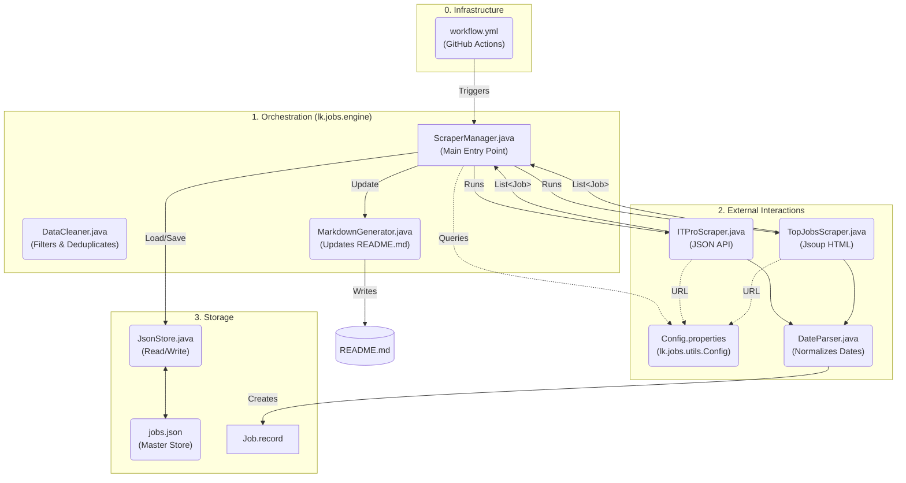

# 🇱🇰 Sri Lanka Software Engineering Jobs | 2026 Tracker [](https://t.me/SL_Software_Jobs)
Looking for software engineering jobs in Sri Lanka? This tracker updates daily with intern, junior, and senior IT roles across Colombo and beyond
Automated Software Engineering Job Tracker for Sri Lanka. Scrapes and categorizes Intern, Associate, and SE roles daily using Java (Jsoup) and GitHub Actions.

> [!TIP]
> **Help keep this project alive!** If this tool helped you find a lead today, please [**Star ⭐ the repo**](https://github.com/Senadeera-NK/sri-lanka-software-jobs). It’s how I measure the impact on our dev community! 🇱🇰

> [!IMPORTANT]
> **Automatic Staleness Purge:** The engine automatically removes listings older than **14 days**, ensuring the feed stays relevant and high-signal.

## 📊 Current Job Openings
> 🟢 **Last Updated:** March 31,12:21 PM (Just now)  | **Total Jobs Found:** 113

### 🎓 Internships & Trainees  (20)

| Title | Company | Level  | Posted | Source |
| :--- | :--- | :--- | :--- | :--- |
| [Full Stack Developer Intern](https://itpro.lk/job/13388/full-stack-developer-intern-at-nuwali-digital-solutions/) | Nuwali Digital Solutions | Intern | 2&nbsp;days&nbsp;ago | ITPro.lk |
| [Software Engineer - Intern - Remote](https://itpro.lk/job/13379/software-engineer-intern-remote-at-d-help-hub-private-limited/) | D HELP HUB Private Limited | Intern | 2&nbsp;days&nbsp;ago | ITPro.lk |
| [Internship - Software Quality Assurance](https://www.topjobs.lk/employer/JobAdvertismentServlet?ac=DEFZZZ&jc=0001484518&ec=DEFZZZ) | Ceylinco Life Insurance Limited | Intern | 4&nbsp;days&nbsp;ago | TopJobs.lk |
| [Internship - IT Department (Full - Stack Developer)](https://www.topjobs.lk/employer/JobAdvertismentServlet?ac=DEFZZZ&jc=0001484508&ec=DEFZZZ) | Ceylinco Life Insurance Limited | Intern | 4&nbsp;days&nbsp;ago | TopJobs.lk |
| [WordPress Web Developer Intern/Undergraduates](https://itpro.lk/job/12628/wordpress-web-developer-internundergraduates-at-loopz-global-pvt-ltd/) | Loopz Global (Pvt) Ltd | Intern | 5&nbsp;days&nbsp;ago | ITPro.lk |
| [Intern - Software Engineer (React \| Node)](https://www.topjobs.lk/employer/JobAdvertismentServlet?ac=DEFZZZ&jc=0001483783&ec=DEFZZZ) | One Billion Tech (Pvt) Ltd | Intern | 6&nbsp;days&nbsp;ago | TopJobs.lk |
| [Quality Assurance Intern](https://www.topjobs.lk/employer/JobAdvertismentServlet?ac=DEFZZZ&jc=0001483774&ec=DEFZZZ) | One Billion Tech (Pvt) Ltd | Intern | 6&nbsp;days&nbsp;ago | TopJobs.lk |
| [Intern - Software Engineer (.NET)](https://www.topjobs.lk/employer/JobAdvertismentServlet?ac=DEFZZZ&jc=0001483767&ec=DEFZZZ) | One Billion Tech (Pvt) Ltd | Intern | 6&nbsp;days&nbsp;ago | TopJobs.lk |
| [Intern Software Engineer (1)](https://www.topjobs.lk/employer/JobAdvertismentServlet?ac=0000000280&jc=0001483633&ec=0000000367) | Expolanka Holdings Limited | Intern | 6&nbsp;days&nbsp;ago | TopJobs.lk |
| [Intern QA Engineer (1)](https://www.topjobs.lk/employer/JobAdvertismentServlet?ac=0000000280&jc=0001483627&ec=0000000367) | Expolanka Holdings Limited | Intern | 6&nbsp;days&nbsp;ago | TopJobs.lk |
| [Intern - Cloud Solutions and Services (Security) (1)](https://www.topjobs.lk/employer/JobAdvertismentServlet?ac=0000000049&jc=0001483216&ec=0000000313) | John Keells IT | Intern | 7&nbsp;days&nbsp;ago | TopJobs.lk |
| [Intern - Product Development (1)](https://www.topjobs.lk/employer/JobAdvertismentServlet?ac=0000000094&jc=0001483608&ec=0000000111) | MAS Holdings | Intern | 7&nbsp;days&nbsp;ago | TopJobs.lk |
| [Website Developer Intern](https://itpro.lk/job/13345/website-developer-intern-at-millennex/) | Millennex | Intern | 7&nbsp;days&nbsp;ago | ITPro.lk |
| [Intern Software Developer (Full Stack)](https://itpro.lk/job/13321/intern-software-developer-full-stack-at-inbizsys-private-limited/) | InBizSys (Private) Limited | Intern | 11&nbsp;days&nbsp;ago | ITPro.lk |
| [Software Engineer Internship (Remote)](https://www.topjobs.lk/employer/JobAdvertismentServlet?ac=DEFZZZ&jc=0001481385&ec=DEFZZZ) | Xaventra (Pvt) Ltd | Intern | 12&nbsp;days&nbsp;ago | TopJobs.lk |
| [Quality Assurance internships](https://itpro.lk/job/13311/quality-assurance-internships-at-itx-digital-services-pvt-ltd/) | ITX Digital Services (Pvt) Ltd | Intern | 13&nbsp;days&nbsp;ago | ITPro.lk |
| [WordPress Developer Intern](https://itpro.lk/job/13307/wordpress-developer-intern-at-innenta-solutions/) | Innenta Solutions | Intern | 13&nbsp;days&nbsp;ago | ITPro.lk |
| [Software Engineer - Intern](https://itpro.lk/job/13302/software-engineer-intern-at-ts-technologies-pvt-ltd/) | TS Technologies (Pvt) Ltd | Intern | 13&nbsp;days&nbsp;ago | ITPro.lk |
| [Intern - Data Science & Analytics (1)](https://www.topjobs.lk/employer/JobAdvertismentServlet?ac=0000000094&jc=0001481333&ec=0000000111) | MAS Holdings | Intern | 13&nbsp;days&nbsp;ago | TopJobs.lk |
| [Frontend Developer Intern](https://itpro.lk/job/13299/frontend-developer-intern-at-ranga-technologies-pinegen-ai/) | Ranga Technologies (PineGen AI) | Intern | 13&nbsp;days&nbsp;ago | ITPro.lk |

---

### 💻 Associate & Junior/SE Roles  (60)

| Title | Company | Level  | Posted | Source |
| :--- | :--- | :--- | :--- | :--- |
| [Full Stack Developer (React \| .Net)](https://www.topjobs.lk/employer/JobAdvertismentServlet?ac=DEFZZZ&jc=0001483460&ec=DEFZZZ) | Ateam Software Pvt Ltd | Junior/SE | 12&nbsp;hours&nbsp;ago | TopJobs.lk |
| [Associate Software Engineer](https://www.topjobs.lk/employer/JobAdvertismentServlet?ac=DEFZZZ&jc=0001485698&ec=DEFZZZ) | HRC Labs | Associate | 12&nbsp;hours&nbsp;ago | TopJobs.lk |
| [Python Architect (1)](https://www.topjobs.lk/employer/JobAdvertismentServlet?ac=0000000486&jc=0001485616&ec=0000000654) | George Bernard (Pvt) Ltd | Junior/SE | 12&nbsp;hours&nbsp;ago | TopJobs.lk |
| [.NET Backend Developer (ASP.NET Core)](https://itpro.lk/job/13399/net-backend-developer-aspnet-core-at-iykons/) | Iykons | Junior/SE | 15&nbsp;hours&nbsp;ago | ITPro.lk |
| [Web Developer](https://www.topjobs.lk/employer/JobAdvertismentServlet?ac=DEFZZZ&jc=0001485171&ec=DEFZZZ) | Amber Business Solutions (Pvt) Ltd | Junior/SE | Yesterday | TopJobs.lk |
| [Full-Stack Developers](https://www.topjobs.lk/employer/JobAdvertismentServlet?ac=DEFZZZ&jc=0001485403&ec=DEFZZZ) | Multiblity (Pvt) Ltd | Junior/SE | Yesterday | TopJobs.lk |
| [Software Engineer](https://itpro.lk/job/12765/software-engineer-at-institute-of-ocean-resource-analysis/) | Institute of Ocean Resource Analysis | Junior/SE | Yesterday | ITPro.lk |
| [Java Full Stack Developer](https://itpro.lk/job/13390/java-full-stack-developer-at-/) |  | Junior/SE | Yesterday | ITPro.lk |
| [Quality Assurance Engineer](https://itpro.lk/job/13369/quality-assurance-engineer-at-pacifickode/) | PacificKode | Junior/SE | 4&nbsp;days&nbsp;ago | ITPro.lk |
| [Software Engineer (Male)](https://www.topjobs.lk/employer/JobAdvertismentServlet?ac=0000000223&jc=0001484573&ec=0000000266) | Data Management Systems (Pvt) Ltd | Junior/SE | 4&nbsp;days&nbsp;ago | TopJobs.lk |
| [Software Engineer - Full Stack (1)](https://www.topjobs.lk/employer/JobAdvertismentServlet?ac=0000000492&jc=0001484713&ec=0000000661) | DirectFN | Junior/SE | 4&nbsp;days&nbsp;ago | TopJobs.lk |
| [Software Engineers](https://www.topjobs.lk/employer/JobAdvertismentServlet?ac=DEFZZZ&jc=0001484840&ec=DEFZZZ) | Asian Logistics Solutions (Pvt) Ltd | Junior/SE | 4&nbsp;days&nbsp;ago | TopJobs.lk |
| [SharePoint Developer (1)](https://www.topjobs.lk/employer/JobAdvertismentServlet?ac=0000000492&jc=0001484715&ec=0000000661) | DirectFN | Junior/SE | 4&nbsp;days&nbsp;ago | TopJobs.lk |
| [DevOps Engineers](https://www.topjobs.lk/employer/JobAdvertismentServlet?ac=DEFZZZ&jc=0001484605&ec=DEFZZZ) | eBEYONDS | Junior/SE | 4&nbsp;days&nbsp;ago | TopJobs.lk |
| [Mobile Application Developer (1)](https://www.topjobs.lk/employer/JobAdvertismentServlet?ac=0000000343&jc=0001484577&ec=0000000458) | KPMG Executive Search Private Limited | Junior/SE | 4&nbsp;days&nbsp;ago | TopJobs.lk |
| [Report Developer (1)](https://www.topjobs.lk/employer/JobAdvertismentServlet?ac=0000000422&jc=0001484539&ec=0000000556) | Raigam Marketing Services (Pvt) Ltd | Junior/SE | 4&nbsp;days&nbsp;ago | TopJobs.lk |
| [RPG Developer (IBM I \| AS400)](https://www.topjobs.lk/employer/JobAdvertismentServlet?ac=DEFZZZ&jc=0001484527&ec=DEFZZZ) | Ceylinco Life Insurance Limited | Junior/SE | 4&nbsp;days&nbsp;ago | TopJobs.lk |
| [Cloud & IT Infrastructure Associate](https://www.topjobs.lk/employer/JobAdvertismentServlet?ac=DEFZZZ&jc=0001484492&ec=DEFZZZ) | ESOFT Uni (Pvt) Ltd | Associate | 4&nbsp;days&nbsp;ago | TopJobs.lk |
| [Software Engineers](https://www.topjobs.lk/employer/JobAdvertismentServlet?ac=DEFZZZ&jc=0001484483&ec=DEFZZZ) | Atera Technologies | Junior/SE | 4&nbsp;days&nbsp;ago | TopJobs.lk |
| [Full Stack Developer (React Native / React / ASP.NET)](https://itpro.lk/job/13366/full-stack-developer-react-native-react-aspnet-at-tecoora/) | Tecoora | Junior/SE | 4&nbsp;days&nbsp;ago | ITPro.lk |
| [Trainee / Associate Full-Stack Developer](https://itpro.lk/job/13363/trainee-associate-fullstack-developer-at-wishmiq-ltd/) | WishmiQ Ltd | Associate | 4&nbsp;days&nbsp;ago | ITPro.lk |
| [Associate QA Engineer](https://itpro.lk/job/13361/associate-qa-engineer-at-surecore-pvt-ltd/) | Surecore (Pvt) Ltd | Associate | 5&nbsp;days&nbsp;ago | ITPro.lk |
| [Software Engineer](https://www.topjobs.lk/employer/JobAdvertismentServlet?ac=DEFZZZ&jc=0001484413&ec=DEFZZZ) | Kernel Encode (Pvt) Ltd | Junior/SE | 5&nbsp;days&nbsp;ago | TopJobs.lk |
| [Software Engineer (Full Stack)](https://www.topjobs.lk/employer/JobAdvertismentServlet?ac=DEFZZZ&jc=0001484114&ec=DEFZZZ) | ICT Asyst (Pvt) Ltd | Junior/SE | 5&nbsp;days&nbsp;ago | TopJobs.lk |
| [Information Security Officer (ISMS)](https://www.topjobs.lk/employer/JobAdvertismentServlet?ac=DEFZZZ&jc=0001479053&ec=DEFZZZ) | Treinetic (Pvt) Ltd | Junior/SE | 5&nbsp;days&nbsp;ago | TopJobs.lk |
| [Full-Stack Developer](https://itpro.lk/job/13353/fullstack-developer-at-digiratina-technology-solutions/) | Digiratina Technology Solutions | Junior/SE | 6&nbsp;days&nbsp;ago | ITPro.lk |
| [Architect -  Azure Cloud (1)](https://www.topjobs.lk/employer/JobAdvertismentServlet?ac=0000000403&jc=0001483781&ec=0000000531) | Mobizz Elite (Pvt) Ltd | Junior/SE | 6&nbsp;days&nbsp;ago | TopJobs.lk |
| [RPG Developer](https://www.topjobs.lk/employer/JobAdvertismentServlet?ac=DEFZZZ&jc=0001483666&ec=DEFZZZ) | Innovis Engineering (Pvt) Ltd | Junior/SE | 6&nbsp;days&nbsp;ago | TopJobs.lk |
| [Database Administrator (1)](https://www.topjobs.lk/employer/JobAdvertismentServlet?ac=0000000440&jc=0001483842&ec=0000000582) | Lanka Hospitals Corporation PLC | Junior/SE | 6&nbsp;days&nbsp;ago | TopJobs.lk |
| [Web & Mobile Banking Application Software Architect](https://www.topjobs.lk/employer/JobAdvertismentServlet?ac=DEFZZZ&jc=0001483837&ec=DEFZZZ) | Fortunaglobal (Pvt) Limited | Junior/SE | 6&nbsp;days&nbsp;ago | TopJobs.lk |
| [Associate/QA Enineer (1)](https://www.topjobs.lk/employer/JobAdvertismentServlet?ac=0000000146&jc=0001483284&ec=0000000178) | Nawaloka Hospitals PLC | Associate | 7&nbsp;days&nbsp;ago | TopJobs.lk |
| [AI Engineer - Application Development Focus](https://www.topjobs.lk/employer/JobAdvertismentServlet?ac=DEFZZZ&jc=0001483511&ec=DEFZZZ) | Asiawise Lanka (Pvt) Ltd | Junior/SE | 7&nbsp;days&nbsp;ago | TopJobs.lk |
| [Junior Software Engineer](https://www.topjobs.lk/employer/JobAdvertismentServlet?ac=DEFZZZ&jc=0001483468&ec=DEFZZZ) | Shaw Wallace Ceylon Ltd | Junior/SE | 7&nbsp;days&nbsp;ago | TopJobs.lk |
| [Azure Cloud Architect (1)](https://www.topjobs.lk/employer/JobAdvertismentServlet?ac=0000000486&jc=0001483430&ec=0000000654) | George Bernard (Pvt) Ltd | Junior/SE | 7&nbsp;days&nbsp;ago | TopJobs.lk |
| [Gen AI Architect (1)](https://www.topjobs.lk/employer/JobAdvertismentServlet?ac=0000000486&jc=0001483394&ec=0000000654) | George Bernard (Pvt) Ltd | Junior/SE | 7&nbsp;days&nbsp;ago | TopJobs.lk |
| [Web Developer](https://itpro.lk/job/13346/web-developer-at-eplus-business-solutions-pvt-ltd/) | E-Plus Business Solutions - PVT Ltd | Junior/SE | 7&nbsp;days&nbsp;ago | ITPro.lk |
| [Full Stack Software Engineer - Remote (Full Time)](https://www.topjobs.lk/employer/JobAdvertismentServlet?ac=DEFZZZ&jc=0001481920&ec=DEFZZZ) | Tour Beez | Junior/SE | 8&nbsp;days&nbsp;ago | TopJobs.lk |
| [Trainee Software Engineer \| Associate Software Engineer \| ...](https://www.topjobs.lk/employer/JobAdvertismentServlet?ac=DEFZZZ&jc=0001477410&ec=DEFZZZ) | Afisol (Pvt) Ltd | Associate | 8&nbsp;days&nbsp;ago | TopJobs.lk |
| [.NET MAUI Developer](https://itpro.lk/job/13335/net-maui-developer-at-katvaas-pvt-ltd/) | Katvaas Pvt Ltd | Junior/SE | 10&nbsp;days&nbsp;ago | ITPro.lk |
| [Software Engineer - .NET](https://itpro.lk/job/13322/software-engineer-net-at-vitalhub-innovations-lab/) | VitalHub Innovations Lab | Junior/SE | 11&nbsp;days&nbsp;ago | ITPro.lk |
| [Software Engineer](https://www.topjobs.lk/employer/JobAdvertismentServlet?ac=DEFZZZ&jc=0001481966&ec=DEFZZZ) | SPOS (Pvt) Ltd | Junior/SE | 11&nbsp;days&nbsp;ago | TopJobs.lk |
| [UI\|UX Front End Developer](https://www.topjobs.lk/employer/JobAdvertismentServlet?ac=DEFZZZ&jc=0001482366&ec=DEFZZZ) | Seren IT Services | Junior/SE | 11&nbsp;days&nbsp;ago | TopJobs.lk |
| [Founding Engineer / Software Developer](https://www.topjobs.lk/employer/JobAdvertismentServlet?ac=DEFZZZ&jc=0001482268&ec=DEFZZZ) | SULECO (Pvt) Ltd | Junior/SE | 11&nbsp;days&nbsp;ago | TopJobs.lk |
| [Full Stack Software Developer](https://www.topjobs.lk/employer/JobAdvertismentServlet?ac=DEFZZZ&jc=0001482113&ec=DEFZZZ) | Arpico Energry | Junior/SE | 11&nbsp;days&nbsp;ago | TopJobs.lk |
| [Mobile Developer (Flutter)](https://www.topjobs.lk/employer/JobAdvertismentServlet?ac=DEFZZZ&jc=0001481528&ec=DEFZZZ) | KAST | Junior/SE | 12&nbsp;days&nbsp;ago | TopJobs.lk |
| [Associate Technical Lead - Fullstack](https://www.topjobs.lk/employer/JobAdvertismentServlet?ac=DEFZZZ&jc=0001481521&ec=DEFZZZ) | KAST | Associate | 12&nbsp;days&nbsp;ago | TopJobs.lk |
| [DevOps Engineer](https://www.topjobs.lk/employer/JobAdvertismentServlet?ac=DEFZZZ&jc=0001481452&ec=DEFZZZ) | S A S Creative (Pvt) Ltd | Junior/SE | 12&nbsp;days&nbsp;ago | TopJobs.lk |
| [Frontend Engineer (React + TypeScript) - Remote](https://www.topjobs.lk/employer/JobAdvertismentServlet?ac=DEFZZZ&jc=0001481269&ec=DEFZZZ) | SimpliConnect (Pvt) Ltd | Junior/SE | 12&nbsp;days&nbsp;ago | TopJobs.lk |
| [Quality Assurance Engineer](https://www.topjobs.lk/employer/JobAdvertismentServlet?ac=DEFZZZ&jc=0001481734&ec=DEFZZZ) | Efficient Frontiers International | Junior/SE | 12&nbsp;days&nbsp;ago | TopJobs.lk |
| [RPA Developer (Straddle Shift)](https://www.topjobs.lk/employer/JobAdvertismentServlet?ac=DEFZZZ&jc=0001481716&ec=DEFZZZ) | Legacy Health (Pvt) Ltd | Junior/SE | 12&nbsp;days&nbsp;ago | TopJobs.lk |
| [Junior Full-Stack Developer (Bubble.io, Python, AWS, AI)](https://www.topjobs.lk/employer/JobAdvertismentServlet?ac=DEFZZZ&jc=0001481534&ec=DEFZZZ) | Efficient Frontiers International | Junior/SE | 12&nbsp;days&nbsp;ago | TopJobs.lk |
| [Software Engineers](https://www.topjobs.lk/employer/JobAdvertismentServlet?ac=DEFZZZ&jc=0001476158&ec=DEFZZZ) | Venturecorp (Pvt) Ltd | Junior/SE | 12&nbsp;days&nbsp;ago | TopJobs.lk |
| [Automation Engineer -  Cybersecurity (1)](https://www.topjobs.lk/employer/JobAdvertismentServlet?ac=0000000403&jc=0001481041&ec=0000000531) | Mobizz Elite (Pvt) Ltd | Junior/SE | 13&nbsp;days&nbsp;ago | TopJobs.lk |
| [AI Specialist For Workflow Automation (1)](https://www.topjobs.lk/employer/JobAdvertismentServlet?ac=0000000146&jc=0001481330&ec=0000000178) | Nawaloka Hospitals PLC | Junior/SE | 13&nbsp;days&nbsp;ago | TopJobs.lk |
| [.NET 8 Software Engineers](https://www.topjobs.lk/employer/JobAdvertismentServlet?ac=DEFZZZ&jc=0001481195&ec=DEFZZZ) | X-ONT Software (Pvt) Ltd | Junior/SE | 13&nbsp;days&nbsp;ago | TopJobs.lk |
| [Executive - Web Developing](https://www.topjobs.lk/employer/JobAdvertismentServlet?ac=DEFZZZ&jc=0001481185&ec=DEFZZZ) | Company Name Withheld | Junior/SE | 13&nbsp;days&nbsp;ago | TopJobs.lk |
| [Frontend Engineer (React + TryperScript)](https://www.topjobs.lk/employer/JobAdvertismentServlet?ac=DEFZZZ&jc=0001481269&ec=DEFZZZ) | SimpliConnect (Pvt) Ltd | Junior/SE | 13&nbsp;days&nbsp;ago | TopJobs.lk |
| [Full Stack Developer (Hybrid)](https://www.topjobs.lk/employer/JobAdvertismentServlet?ac=DEFZZZ&jc=0001480504&ec=DEFZZZ) | M Data Zone (Pvt) Ltd | Junior/SE | 14&nbsp;days&nbsp;ago | TopJobs.lk |
| [Software Quality Assurance Engineer (1)](https://www.topjobs.lk/employer/JobAdvertismentServlet?ac=0000000492&jc=0001480925&ec=0000000661) | DirectFN | Junior/SE | 14&nbsp;days&nbsp;ago | TopJobs.lk |
| [Front End Associate - Angular](https://www.topjobs.lk/employer/JobAdvertismentServlet?ac=DEFZZZ&jc=0001480814&ec=DEFZZZ) | Seven Senki Holdings (Pvt) Ltd | Associate | 14&nbsp;days&nbsp;ago | TopJobs.lk |

---

### 🚀 Senior & Lead Roles  (33)

| Title | Company | Level  | Posted | Source |
| :--- | :--- | :--- | :--- | :--- |
| [Senior Software Engineer in Test (SDET)](https://www.topjobs.lk/employer/JobAdvertismentServlet?ac=DEFZZZ&jc=0001483462&ec=DEFZZZ) | Ateam Software Pvt Ltd | Senior | 12&nbsp;hours&nbsp;ago | TopJobs.lk |
| [Senior SQL Developer (1)](https://www.topjobs.lk/employer/JobAdvertismentServlet?ac=0000000271&jc=0001421034&ec=0000000350) | CMS (Pvt) Ltd | Senior | Yesterday | TopJobs.lk |
| [Senior Full-Stack Engineer (Al-Native)](https://itpro.lk/job/13375/senior-fullstack-engineer-alnative-at-rope-digital/) | Rope Digital | Senior | 4&nbsp;days&nbsp;ago | ITPro.lk |
| [Senior Software Engineer in Test](https://itpro.lk/job/13373/senior-software-engineer-in-test-at-digiratina-technology-solutions/) | Digiratina Technology Solutions | Senior | 4&nbsp;days&nbsp;ago | ITPro.lk |
| [Senior/Software Engineer](https://itpro.lk/job/13370/seniorsoftware-engineer-at-pacifickode/) | PacificKode | Senior | 4&nbsp;days&nbsp;ago | ITPro.lk |
| [Senior Software Engineers](https://www.topjobs.lk/employer/JobAdvertismentServlet?ac=DEFZZZ&jc=0001484808&ec=DEFZZZ) | Central Finance Company PLC | Senior | 4&nbsp;days&nbsp;ago | TopJobs.lk |
| [Senior Software Engineer JAVA 17 (1)](https://www.topjobs.lk/employer/JobAdvertismentServlet?ac=0000000492&jc=0001484611&ec=0000000661) | DirectFN | Senior | 4&nbsp;days&nbsp;ago | TopJobs.lk |
| [Software Engineer / Senior Software Engineer / Tech Lead](https://itpro.lk/job/13357/software-engineer-senior-software-engineer-tech-lead-at-amerck/) | Amerck | Senior | 5&nbsp;days&nbsp;ago | ITPro.lk |
| [Senior QA Engineer](https://www.topjobs.lk/employer/JobAdvertismentServlet?ac=DEFZZZ&jc=0001484415&ec=DEFZZZ) | Kernel Encode (Pvt) Ltd | Senior | 5&nbsp;days&nbsp;ago | TopJobs.lk |
| [Senior iOS Developer (Banking Applications)](https://www.topjobs.lk/employer/JobAdvertismentServlet?ac=DEFZZZ&jc=0001484282&ec=DEFZZZ) | Fortunaglobal (Pvt) Limited | Senior | 5&nbsp;days&nbsp;ago | TopJobs.lk |
| [Senior Android Developer (Banking Applications)](https://www.topjobs.lk/employer/JobAdvertismentServlet?ac=DEFZZZ&jc=0001484281&ec=DEFZZZ) | Fortunaglobal (Pvt) Limited | Senior | 5&nbsp;days&nbsp;ago | TopJobs.lk |
| [Senior Software Engineer](https://itpro.lk/job/13354/senior-software-engineer-at-webxpay/) | WEBXPAY | Senior | 6&nbsp;days&nbsp;ago | ITPro.lk |
| [Technical Lead (.NET \| Angular)](https://www.topjobs.lk/employer/JobAdvertismentServlet?ac=DEFZZZ&jc=0001483669&ec=DEFZZZ) | MedcubeUSA (Pvt) Ltd | Senior | 6&nbsp;days&nbsp;ago | TopJobs.lk |
| [Software Engineers / Senior Software Engineers](https://www.topjobs.lk/employer/JobAdvertismentServlet?ac=DEFZZZ&jc=0001484000&ec=DEFZZZ) | Scicom Lanka (Private) Limited | Senior | 6&nbsp;days&nbsp;ago | TopJobs.lk |
| [Senior Solutions Architect - IPTV / OTT](https://www.topjobs.lk/employer/JobAdvertismentServlet?ac=DEFZZZ&jc=0001483513&ec=DEFZZZ) | SLT Mobitel | Senior | 7&nbsp;days&nbsp;ago | TopJobs.lk |
| [Senior QA Engineer (1)](https://www.topjobs.lk/employer/JobAdvertismentServlet?ac=0000000421&jc=0001481951&ec=0000000555) | Sumathi Group | Senior | 7&nbsp;days&nbsp;ago | TopJobs.lk |
| [Senior Software Engineer](https://itpro.lk/job/13343/senior-software-engineer-at-effectzal/) | Effectz.Al | Senior | 8&nbsp;days&nbsp;ago | ITPro.lk |
| [Senior Software Engineer (Full Stack)](https://www.topjobs.lk/employer/JobAdvertismentServlet?ac=DEFZZZ&jc=0001482735&ec=DEFZZZ) | Effectz.AI | Senior | 8&nbsp;days&nbsp;ago | TopJobs.lk |
| [Senior Full Stack Engineer (Laravel) - Fully Remote](https://www.topjobs.lk/employer/JobAdvertismentServlet?ac=DEFZZZ&jc=0001481920&ec=DEFZZZ) | Tour Beez | Senior | 11&nbsp;days&nbsp;ago | TopJobs.lk |
| [Senior Software Engineer Full Stack (1)](https://www.topjobs.lk/employer/JobAdvertismentServlet?ac=0000000492&jc=0001482180&ec=0000000661) | DirectFN | Senior | 11&nbsp;days&nbsp;ago | TopJobs.lk |
| [Senior Software Engineer JAVA (4)](https://www.topjobs.lk/employer/JobAdvertismentServlet?ac=0000000492&jc=0001482182&ec=0000000661) | DirectFN | Senior | 11&nbsp;days&nbsp;ago | TopJobs.lk |
| [Senior Software Engineer - Spring Boot (1)](https://www.topjobs.lk/employer/JobAdvertismentServlet?ac=0000000492&jc=0001482365&ec=0000000661) | DirectFN | Senior | 11&nbsp;days&nbsp;ago | TopJobs.lk |
| [Senior Database Administrator (1)](https://www.topjobs.lk/employer/JobAdvertismentServlet?ac=0000000492&jc=0001482178&ec=0000000661) | DirectFN | Senior | 11&nbsp;days&nbsp;ago | TopJobs.lk |
| [Senior Mobile Developer - Flutter](https://www.topjobs.lk/employer/JobAdvertismentServlet?ac=DEFZZZ&jc=0001481524&ec=DEFZZZ) | KAST | Senior | 12&nbsp;days&nbsp;ago | TopJobs.lk |
| [Senior Software Engineer - Java](https://www.topjobs.lk/employer/JobAdvertismentServlet?ac=DEFZZZ&jc=0001481515&ec=DEFZZZ) | Hitachi Digital Payment Solutions Limited | Senior | 12&nbsp;days&nbsp;ago | TopJobs.lk |
| [Full-Stack Tech Lead (Bubble.io, Python, AWS, AI/ML Experience a Plus)](https://www.topjobs.lk/employer/JobAdvertismentServlet?ac=DEFZZZ&jc=0001481537&ec=DEFZZZ) | Efficient Frontiers International | Senior | 12&nbsp;days&nbsp;ago | TopJobs.lk |
| [Senior Quality Assurance Engineer](https://itpro.lk/job/13308/senior-quality-assurance-engineer-at-bistec-global/) | BISTEC Global | Senior | 13&nbsp;days&nbsp;ago | ITPro.lk |
| [Senior Developer](https://itpro.lk/job/13305/senior-developer-at-digit-web-lanka-pvt-ltd/) | Digit Web Lanka (Pvt) Ltd | Senior | 13&nbsp;days&nbsp;ago | ITPro.lk |
| [Senior Software Engineer](https://www.topjobs.lk/employer/JobAdvertismentServlet?ac=DEFZZZ&jc=0001481005&ec=DEFZZZ) | Webxpay (Pvt) Ltd | Senior | 13&nbsp;days&nbsp;ago | TopJobs.lk |
| [Senior QA Engineer](https://www.topjobs.lk/employer/JobAdvertismentServlet?ac=DEFZZZ&jc=0001481243&ec=DEFZZZ) | Synergen Health (Pvt) Ltd | Senior | 13&nbsp;days&nbsp;ago | TopJobs.lk |
| [Senior Front end Developer (1)](https://www.topjobs.lk/employer/JobAdvertismentServlet?ac=0000000492&jc=0001480722&ec=0000000661) | DirectFN | Senior | 14&nbsp;days&nbsp;ago | TopJobs.lk |
| [Senior Full Stack Developer](https://www.topjobs.lk/employer/JobAdvertismentServlet?ac=DEFZZZ&jc=0001480905&ec=DEFZZZ) | Edusight | Senior | 14&nbsp;days&nbsp;ago | TopJobs.lk |
| [QA Lead - Automation (1)](https://www.topjobs.lk/employer/JobAdvertismentServlet?ac=0000000492&jc=0001480723&ec=0000000661) | DirectFN | Senior | 14&nbsp;days&nbsp;ago | TopJobs.lk |

---


## 🛠️ How it Works
1. **Engine:** A Java 21 console application using **Jsoup**.
2. **Sources:** Currently scraping `ITPro.lk` and  `TopJobs`. Support for and `Rooster.jobs` is under development (Contributors welcome!)
3. **Automation:** Runs every 12 hours via **GitHub Actions**.
4. **Storage:** Updates this `README.md` and a `jobs.json` file automatically.

<details>
<summary><b>📐 View High-Level Architecture Diagram</b></summary>
    

```mermaid
graph TD
    %% Main Orchestration Class
    subgraph Engine ["1. Orchestration (lk.jobs.engine)"]
        ScraperManager["ScraperManager.java<br/>(Main Entry Point)"]
        Cleaner("DataCleaner.java<br/>(Filters & Deduplicates)")
        Markdown("MarkdownGenerator.java<br/>(Updates README.md)")
    end

    %% External Interactions / Data Sources
    subgraph Scrapers ["2. External Interactions"]
        Config("Config.properties<br/>(lk.jobs.utils.Config)")
        ITPro("ITProScraper.java<br/>(JSON API)")
        TopJobs("TopJobsScraper.java<br/>(Jsoup HTML)")
        DParser("DateParser.java<br/>(Normalizes Dates)")
    end

    %% Data Flow & Persistence
    subgraph Storage ["3. Storage"]
        Json("jobs.json<br/>(Master Store)")
        JsonStore("JsonStore.java<br/>(Read/Write)")
        JobModel["Job.record"]
    end

    %% Workflow Orchestration
    subgraph Infrastructure ["0. Infrastructure"]
        WF("workflow.yml<br/>(GitHub Actions)")
    end

    %% Connective Flow
    WF -- "Triggers" --> ScraperManager
    ScraperManager -. "Queries" .-> Config
    ITPro -. "URL" .-> Config
    TopJobs -. "URL" .-> Config
    
    ScraperManager -- "Runs" --> ITPro
    ScraperManager -- "Runs" --> TopJobs
    
    ITPro --> DParser
    TopJobs --> DParser
    DParser -- "Creates" --> JobModel
    
    ITPro -- "List&lt;Job&gt;" --> ScraperManager
    TopJobs -- "List&lt;Job&gt;" --> ScraperManager

    ScraperManager -- "Load/Save" --> JsonStore
    JsonStore <--> Json
    
    ScraperManager -- "Update" --> Markdown
    Markdown -- "Writes" --> README[(README.md)]
```

</details>

<details>
<summary><b>📂 View Project Structure</b></summary>

```text
src/main/java/lk/jobs/
├── engine/           # Logic for sorting, cleaning, and README updates
├── model/            # Data models (Job Record)
├── scrapers/         # Individual site scrapers
└── utils/            # JSON and Date parsing utilities
```
</details>

## 🚀 Usage
If you want to run the scraper locally:
1. Clone the repo.
2. Ensure you have **JDK 21** and **Maven** installed.
3. Run: mvn clean compile exec:java -Dexec.mainClass="lk.jobs.engine.ScraperManager"

## 🤝 Contributing
Contributions are what make the open-source community such an amazing place to learn, inspire, and create.
Any contributions you make are **greatly appreciated**.

* **Found a bug?** Open an [Issue](https://github.com/Senadeera-NK/sl-software-engineering-jobs/issues).
* **Want to add a new site?** Check out our [Contributing Guidelines](CONTRIBUTING.md) to see how to implement a new scraper.
* **Missing a job?** Feel free to submit a Pull Request to manually update the table!
