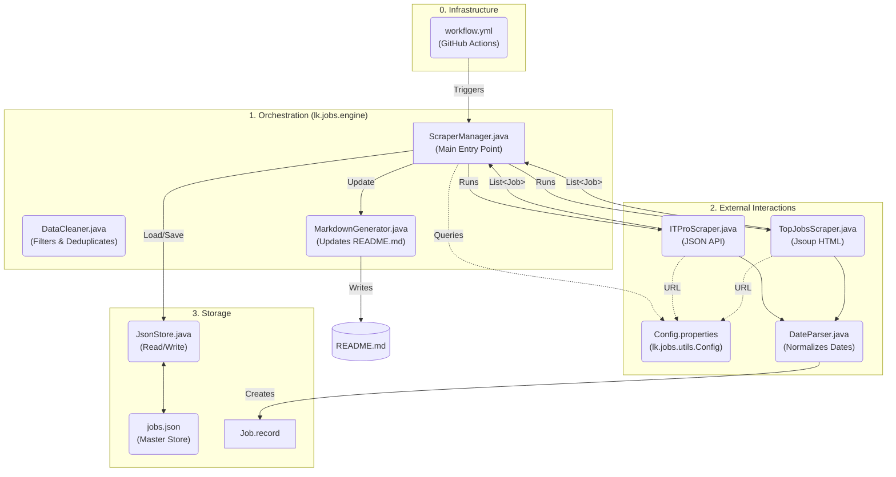

# 🇱🇰 Sri Lanka Software Engineering Jobs | 2026 Tracker [](https://t.me/SL_Software_Jobs)
Looking for software engineering jobs in Sri Lanka? This tracker updates daily with intern, junior, and senior IT roles across Colombo and beyond
Automated Software Engineering Job Tracker for Sri Lanka. Scrapes and categorizes Intern, Associate, and SE roles daily using Java (Jsoup) and GitHub Actions.

> [!TIP]
> **Help keep this project alive!** If this tool helped you find a lead today, please [**Star ⭐ the repo**](https://github.com/Senadeera-NK/sri-lanka-software-jobs). It’s how I measure the impact on our dev community! 🇱🇰

> [!IMPORTANT]
> **Automatic Staleness Purge:** The engine automatically removes listings older than **14 days**, ensuring the feed stays relevant and high-signal.

> **Live Analytics & Daily Software Job Tracker for Sri Lanka**

[📊 View Live Dashboard](https://sri-lanka-software-jobs.vercel.app/)

 
*Click the link above to see real-time trends, seniority distribution, and top hiring companies.*

## 📊 Current Job Openings
> 🟢 **Last Updated:** July 28,6:41 PM (Just now)  | **Total Jobs Found:** 188

### 🎓 Internships & Trainees  (25)

| Title | Company | Level  | Posted | Source |
| :--- | :--- | :--- | :--- | :--- |
| [Full Stack Developer Intern](https://itpro.lk/job/14479/full-stack-developer-intern-at-futura-solutions/) | Futura Solutions | Intern | 2&nbsp;hours&nbsp;ago | ITPro.lk |
| [Software Engineer Intern](https://itpro.lk/job/14475/software-engineer-intern-at-alphintra/) | Alphintra | Intern | 5&nbsp;hours&nbsp;ago | ITPro.lk |
| [Quality Assurance (QA) Intern](https://itpro.lk/job/14470/quality-assurance-qa-intern-at-tecoora-pty-ltd/) | Tecoora Pty Ltd | Intern | 9&nbsp;hours&nbsp;ago | ITPro.lk |
| [QA \| Software Tester (Trainee \| Intern)](https://www.topjobs.lk/employer/JobAdvertismentServlet?ac=DEFZZZ&jc=0001526871&ec=DEFZZZ) | myPOS Software Solutions (Pvt) Ltd | Intern | 18&nbsp;hours&nbsp;ago | TopJobs.lk |
| [Software Engineer Intern](https://itpro.lk/job/13215/software-engineer-intern-at-perpova-developers/) | Perpova Developers | Intern | 18&nbsp;hours&nbsp;ago | ITPro.lk |
| [QA Engineer Intern](https://itpro.lk/job/13214/qa-engineer-intern-at-perpova-developers/) | Perpova Developers | Intern | 18&nbsp;hours&nbsp;ago | ITPro.lk |
| [Associate Engineer / Engineering Intern, Power Platform](https://rooster.jobs/jobs/518907) | Snapdrum | Intern | Yesterday | Rooster.jobs |
| [Intern Software Engineer (Software Development & Gen AI)](https://itpro.lk/job/14426/intern-software-engineer-software-development-gen-ai-at-xeynergy/) | Xeynergy | Intern | 5&nbsp;days&nbsp;ago | ITPro.lk |
| [Software Engineer Intern](https://www.topjobs.lk/employer/JobAdvertismentServlet?ac=DEFZZZ&jc=0001527949&ec=DEFZZZ) | Electrobeam (Pvt) Ltd | Intern | 5&nbsp;days&nbsp;ago | TopJobs.lk |
| [Full Stack Developer Intern (Java, Spring Boot & React)](https://www.topjobs.lk/employer/JobAdvertismentServlet?ac=DEFZZZ&jc=0001527832&ec=DEFZZZ) | Blue Chip Technical Services (Pvt) Ltd | Intern | 5&nbsp;days&nbsp;ago | TopJobs.lk |
| [Frontend Developer Intern (React & Material UI)](https://www.topjobs.lk/employer/JobAdvertismentServlet?ac=DEFZZZ&jc=0001527828&ec=DEFZZZ) | Blue Chip Technical Services (Pvt) Ltd | Intern | 5&nbsp;days&nbsp;ago | TopJobs.lk |
| [Intern - Software Engineer](https://itpro.lk/job/14411/intern-software-engineer-at-exelk/) | Exe.lk | Intern | 6&nbsp;days&nbsp;ago | ITPro.lk |
| [QA Intern](https://itpro.lk/job/14400/qa-intern-at-navitsa/) | Navitsa | Intern | 6&nbsp;days&nbsp;ago | ITPro.lk |
| [Intern Software Engineer (React / .NET Core)](https://itpro.lk/job/14397/intern-software-engineer-react-net-core-at-novrix-solutions-pvt-ltd/) | Novrix Solutions (Pvt) Ltd | Intern | 7&nbsp;days&nbsp;ago | ITPro.lk |
| [Internship - Data & Business Intelligence](https://www.topjobs.lk/employer/JobAdvertismentServlet?ac=DEFZZZ&jc=0001526850&ec=DEFZZZ) | Edotco Group | Intern | 7&nbsp;days&nbsp;ago | TopJobs.lk |
| [Full Stack Developer Intern](https://www.topjobs.lk/employer/JobAdvertismentServlet?ac=DEFZZZ&jc=0001526729&ec=DEFZZZ) | Medcube USA | Intern | 7&nbsp;days&nbsp;ago | TopJobs.lk |
| [Intern Web Developer](https://itpro.lk/job/14390/intern-web-developer-at-sans-technologies/) | Sans Technologies | Intern | 8&nbsp;days&nbsp;ago | ITPro.lk |
| [Software Engineering - Intern](https://itpro.lk/job/13867/software-engineering-intern-at-qdesk-ai-pvt-ltd/) | Qdesk AI Pvt Ltd | Intern | 8&nbsp;days&nbsp;ago | ITPro.lk |
| [QA Intern](https://itpro.lk/job/14384/qa-intern-at-gloocan-technologies-pvt-ltd/) | Gloocan Technologies (Pvt) Ltd | Intern | 8&nbsp;days&nbsp;ago | ITPro.lk |
| [Software Engineering Internship](https://itpro.lk/job/14377/software-engineering-internship-at-connex-codeworks/) | Connex Codeworks | Intern | 9&nbsp;days&nbsp;ago | ITPro.lk |
| [Business Process QA & UX/UI Intern](https://itpro.lk/job/14376/business-process-qa-uxui-intern-at-process361-pvt-ltd/) | Process361 (Pvt) Ltd | Intern | 9&nbsp;days&nbsp;ago | ITPro.lk |
| [Software Developer - Intern](https://itpro.lk/job/14009/software-developer-intern-at-cloud-syntex/) | Cloud Syntex | Intern | 11&nbsp;days&nbsp;ago | ITPro.lk |
| [Intern Software Engineer (Frontend & Backend)](https://itpro.lk/job/14355/intern-software-engineer-frontend-backend-at-bytesquad-labs/) | ByteSquad Labs | Intern | 12&nbsp;days&nbsp;ago | ITPro.lk |
| [Software Engineer Intern](https://itpro.lk/job/14338/software-engineer-intern-at-epinics/) | Epinics | Intern | 13&nbsp;days&nbsp;ago | ITPro.lk |
| [QA Intern](https://itpro.lk/job/14321/qa-intern-at-delivergate/) | Delivergate | Intern | 14&nbsp;days&nbsp;ago | ITPro.lk |

---

### 💻 Associate & Junior/SE Roles  (105)

| Title | Company | Level  | Posted | Source |
| :--- | :--- | :--- | :--- | :--- |
| [Associate Software Engineer](https://itpro.lk/job/14480/associate-software-engineer-at-amplaz/) | Amplaz | Associate | 1&nbsp;hours&nbsp;ago | ITPro.lk |
| [Associate Quality Engineering Lead](https://itpro.lk/job/14474/associate-quality-engineering-lead-at-softvil-technologies/) | Softvil Technologies | Associate | 5&nbsp;hours&nbsp;ago | ITPro.lk |
| [Software Engineer – Integration Server (Aeonix/OmniCX)](https://rooster.jobs/jobs/518934) | Twist Digital | Junior/SE | 6&nbsp;hours&nbsp;ago | Rooster.jobs |
| [QA Engineer](https://www.topjobs.lk/employer/JobAdvertismentServlet?ac=DEFZZZ&jc=0001524056&ec=DEFZZZ) | InEight Sri Lanka | Junior/SE | 18&nbsp;hours&nbsp;ago | TopJobs.lk |
| [Associate QA Engineer](https://www.topjobs.lk/employer/JobAdvertismentServlet?ac=DEFZZZ&jc=0001524251&ec=DEFZZZ) | Treinetic Pvt Ltd | Associate | 18&nbsp;hours&nbsp;ago | TopJobs.lk |
| [Junior Algorithm Engineer - DSP - FPGA Engineer](https://www.topjobs.lk/employer/JobAdvertismentServlet?ac=DEFZZZ&jc=0001526543&ec=DEFZZZ) | Thakshana Technologies (Pvt) Ltd | Junior/SE | 18&nbsp;hours&nbsp;ago | TopJobs.lk |
| [Design Engineer](https://www.topjobs.lk/employer/JobAdvertismentServlet?ac=DEFZZZ&jc=0001527063&ec=DEFZZZ) | KRAMSKI Lanka (Pvt) Ltd | Junior/SE | 18&nbsp;hours&nbsp;ago | TopJobs.lk |
| [AI Engineer](https://www.topjobs.lk/employer/JobAdvertismentServlet?ac=DEFZZZ&jc=0001529762&ec=DEFZZZ) | Ernst & Young | Junior/SE | 18&nbsp;hours&nbsp;ago | TopJobs.lk |
| [Full Stack Developer](https://www.topjobs.lk/employer/JobAdvertismentServlet?ac=DEFZZZ&jc=0001529755&ec=DEFZZZ) | HISP Sri Lanka | Junior/SE | 18&nbsp;hours&nbsp;ago | TopJobs.lk |
| [Boomi Integration Engineer - Colombo 5](https://www.topjobs.lk/employer/JobAdvertismentServlet?ac=DEFZZZ&jc=0001529730&ec=DEFZZZ) | HR Masterminder | Junior/SE | 18&nbsp;hours&nbsp;ago | TopJobs.lk |
| [Associate Engineer - Business Intelligence (1)](https://www.topjobs.lk/employer/JobAdvertismentServlet?ac=0000000280&jc=0001529648&ec=0000000510) | Expolanka Freight (Pvt) Ltd | Associate | 18&nbsp;hours&nbsp;ago | TopJobs.lk |
| [Junior Web Developer](https://www.topjobs.lk/employer/JobAdvertismentServlet?ac=DEFZZZ&jc=0001529417&ec=DEFZZZ) | Ignite Media Vision (Pvt) Ltd | Junior/SE | 18&nbsp;hours&nbsp;ago | TopJobs.lk |
| [Big Data Engineer (1)](https://www.topjobs.lk/employer/JobAdvertismentServlet?ac=0000000271&jc=0001420855&ec=0000000350) | CMS (Pvt) Ltd | Junior/SE | 18&nbsp;hours&nbsp;ago | TopJobs.lk |
| [Associate / Executive (Privacy & Data Protection Service)](https://www.topjobs.lk/employer/JobAdvertismentServlet?ac=DEFZZZ&jc=0001529921&ec=DEFZZZ) | Ernst & Young | Associate | 18&nbsp;hours&nbsp;ago | TopJobs.lk |
| [Data Engineer](https://www.topjobs.lk/employer/JobAdvertismentServlet?ac=DEFZZZ&jc=0001529764&ec=DEFZZZ) | Ernst & Young | Junior/SE | 18&nbsp;hours&nbsp;ago | TopJobs.lk |
| [Software Engineer – Application Technology (Workday Integrations)](https://itpro.lk/job/14457/software-engineer-application-technology-workday-integrations-at-tecciance/) | tecciance | Junior/SE | Yesterday | ITPro.lk |
| [QA Engineer](https://itpro.lk/job/14456/qa-engineer-at-dxdy/) | dxdy | Junior/SE | Yesterday | ITPro.lk |
| [Analyst - Cyber Security (1)](https://www.topjobs.lk/employer/JobAdvertismentServlet?ac=0000000017&jc=0001529420&ec=0000000017) | Colombo Stock Exchange | Junior/SE | Yesterday | TopJobs.lk |
| [Automation Engineer](https://www.topjobs.lk/employer/JobAdvertismentServlet?ac=DEFZZZ&jc=0001529332&ec=DEFZZZ) | Dijital People Pvt Ltd | Junior/SE | Yesterday | TopJobs.lk |
| [Full Stack Engineer (Project-Based / Task-Based)](https://itpro.lk/job/14444/full-stack-engineer-projectbased-taskbased-at-lycerix-global/) | Lycerix Global | Junior/SE | 4&nbsp;days&nbsp;ago | ITPro.lk |
| [Associate QA Engineer](https://itpro.lk/job/14443/associate-qa-engineer-at-lycerix-global/) | Lycerix Global | Associate | 4&nbsp;days&nbsp;ago | ITPro.lk |
| [Quality Engineer (Automation)](https://itpro.lk/job/14441/quality-engineer-automation-at-verdentra/) | Verdentra | Junior/SE | 4&nbsp;days&nbsp;ago | ITPro.lk |
| [Automation Engineer - Telecom Solutions](https://itpro.lk/job/14438/automation-engineer-telecom-solutions-at-hatchyard/) | Hatchyard | Junior/SE | 4&nbsp;days&nbsp;ago | ITPro.lk |
| [Software Engineer - Application Technology (Workday Integrations)](https://itpro.lk/job/14437/software-engineer-application-technology-workday-integrations-at-hatchyard/) | Hatchyard | Junior/SE | 4&nbsp;days&nbsp;ago | ITPro.lk |
| [Full Stack Software Engineer](https://www.topjobs.lk/employer/JobAdvertismentServlet?ac=DEFZZZ&jc=0001528396&ec=DEFZZZ) | Primed Pharmacy | Junior/SE | 4&nbsp;days&nbsp;ago | TopJobs.lk |
| [Full Stack Engineer - Colombo \| Work from Home](https://www.topjobs.lk/employer/JobAdvertismentServlet?ac=DEFZZZ&jc=0001528280&ec=DEFZZZ) | Appoyo | Junior/SE | 4&nbsp;days&nbsp;ago | TopJobs.lk |
| [Backend Engineer - Colombo \| Work from Home](https://www.topjobs.lk/employer/JobAdvertismentServlet?ac=DEFZZZ&jc=0001528273&ec=DEFZZZ) | Appoyo | Junior/SE | 4&nbsp;days&nbsp;ago | TopJobs.lk |
| [FULL STACK DEVELOPER (1)](https://www.topjobs.lk/employer/JobAdvertismentServlet?ac=0000000023&jc=0001528930&ec=0000000023) | Maritime Placements (Pvt) Ltd | Junior/SE | 4&nbsp;days&nbsp;ago | TopJobs.lk |
| [DEVOPS ENGINEER (1)](https://www.topjobs.lk/employer/JobAdvertismentServlet?ac=0000000023&jc=0001528669&ec=0000000023) | Maritime Placements (Pvt) Ltd | Junior/SE | 4&nbsp;days&nbsp;ago | TopJobs.lk |
| [REACT DEVELOPER (1)](https://www.topjobs.lk/employer/JobAdvertismentServlet?ac=0000000023&jc=0001528568&ec=0000000023) | Maritime Placements (Pvt) Ltd | Junior/SE | 4&nbsp;days&nbsp;ago | TopJobs.lk |
| [QUALITY ASSURANCE ENGINEER (1)](https://www.topjobs.lk/employer/JobAdvertismentServlet?ac=0000000023&jc=0001528939&ec=0000000023) | Maritime Placements (Pvt) Ltd | Junior/SE | 4&nbsp;days&nbsp;ago | TopJobs.lk |
| [WordPress Developer](https://itpro.lk/job/14431/wordpress-developer-at-knowledge-books-and-software/) | Knowledge Books and Software | Junior/SE | 4&nbsp;days&nbsp;ago | ITPro.lk |
| [Lead QA Engineer / Associate Lead QA Engineer](https://itpro.lk/job/14427/lead-qa-engineer-associate-lead-qa-engineer-at-simsyn-pvt-ltd/) | Simsyn Pvt Ltd | Associate | 4&nbsp;days&nbsp;ago | ITPro.lk |
| [Associate QA Engineer](https://itpro.lk/job/14419/associate-qa-engineer-at-predictiv-ai/) | Predictiv AI | Associate | 5&nbsp;days&nbsp;ago | ITPro.lk |
| [DTP Developer - Galle](https://www.topjobs.lk/employer/JobAdvertismentServlet?ac=DEFZZZ&jc=0001527797&ec=DEFZZZ) | Alpha Industries South Asia (Pvt) Ltd | Junior/SE | 5&nbsp;days&nbsp;ago | TopJobs.lk |
| [Associate Software Engineers - Full Stack (.NET) (1)](https://www.topjobs.lk/employer/JobAdvertismentServlet?ac=0000000343&jc=0001528075&ec=0000000458) | KPMG Executive Search Private Limited | Associate | 5&nbsp;days&nbsp;ago | TopJobs.lk |
| [Associate QA Lead](https://itpro.lk/job/14408/associate-qa-lead-at-tecciance/) | tecciance | Associate | 6&nbsp;days&nbsp;ago | ITPro.lk |
| [QA Engineer](https://itpro.lk/job/14406/qa-engineer-at-tecciance/) | tecciance | Junior/SE | 6&nbsp;days&nbsp;ago | ITPro.lk |
| [Associate Software Engineer - Full Stack (1)](https://www.topjobs.lk/employer/JobAdvertismentServlet?ac=0000000441&jc=0001527447&ec=0000000583) | Ascent Business Solutions (Pvt) Ltd | Associate | 6&nbsp;days&nbsp;ago | TopJobs.lk |
| [Software Developer (Remote / Full Time)](https://www.topjobs.lk/employer/JobAdvertismentServlet?ac=DEFZZZ&jc=0001527413&ec=DEFZZZ) | TechSense | Junior/SE | 6&nbsp;days&nbsp;ago | TopJobs.lk |
| [Data Analystics Executive](https://www.topjobs.lk/employer/JobAdvertismentServlet?ac=DEFZZZ&jc=0001527326&ec=DEFZZZ) | The Swadeshi Industrial Works PLC | Junior/SE | 6&nbsp;days&nbsp;ago | TopJobs.lk |
| [Software Engineer](https://www.topjobs.lk/employer/JobAdvertismentServlet?ac=DEFZZZ&jc=0001527290&ec=DEFZZZ) | Spherehead Technologies (Pvt) Ltd | Junior/SE | 6&nbsp;days&nbsp;ago | TopJobs.lk |
| [Data Analyst](https://www.topjobs.lk/employer/JobAdvertismentServlet?ac=DEFZZZ&jc=0001527256&ec=DEFZZZ) | Wnato (Pvt) Ltd | Junior/SE | 6&nbsp;days&nbsp;ago | TopJobs.lk |
| [School Leaver Data Formatter for LLM Processing - Battramulla](https://www.topjobs.lk/employer/JobAdvertismentServlet?ac=DEFZZZ&jc=0001524641&ec=DEFZZZ) | ServiceTeam Ltd | Junior/SE | 6&nbsp;days&nbsp;ago | TopJobs.lk |
| [Sports Data & Content Executive (2)](https://www.topjobs.lk/employer/JobAdvertismentServlet?ac=0000000421&jc=0001527624&ec=0000000555) | Sumathi Group | Junior/SE | 6&nbsp;days&nbsp;ago | TopJobs.lk |
| [Associate QA Engineer](https://itpro.lk/job/14403/associate-qa-engineer-at-digital-health-private-limited/) | Digital Health Private Limited | Associate | 6&nbsp;days&nbsp;ago | ITPro.lk |
| [Software Engineer .NET](https://itpro.lk/job/11276/software-engineer-net-at-ideahub/) | Ideahub | Junior/SE | 7&nbsp;days&nbsp;ago | ITPro.lk |
| [Software Engineer](https://www.topjobs.lk/employer/JobAdvertismentServlet?ac=DEFZZZ&jc=0001521550&ec=DEFZZZ) | Prima Management Services (Pvt) Ltd | Junior/SE | 7&nbsp;days&nbsp;ago | TopJobs.lk |
| [Software Engineer](https://itpro.lk/job/14389/software-engineer-at-homey/) | Homey | Junior/SE | 8&nbsp;days&nbsp;ago | ITPro.lk |
| [Mobile App Developer (Android)](https://www.topjobs.lk/employer/JobAdvertismentServlet?ac=DEFZZZ&jc=0001526372&ec=DEFZZZ) | Asian Logistics Solutions (Pvt) Ltd | Junior/SE | 8&nbsp;days&nbsp;ago | TopJobs.lk |
| [Trainee - Web Developer](https://itpro.lk/job/14387/trainee-web-developer-at-earrow-pvt-ltd/) | eArrow (Pvt) LTD | Associate | 8&nbsp;days&nbsp;ago | ITPro.lk |
| [Associate Quality Engineering Lead](https://itpro.lk/job/14379/associate-quality-engineering-lead-at-hatchyard/) | Hatchyard | Associate | 9&nbsp;days&nbsp;ago | ITPro.lk |
| [Associate Software Engineer](https://itpro.lk/job/14363/associate-software-engineer-at-oak-integrated-systems/) | Oak Integrated Systems | Associate | 11&nbsp;days&nbsp;ago | ITPro.lk |
| [ATL / SSE Front End Developer (1)](https://www.topjobs.lk/employer/JobAdvertismentServlet?ac=0000000421&jc=0001523743&ec=0000000555) | Sumathi Group | Junior/SE | 11&nbsp;days&nbsp;ago | TopJobs.lk |
| [Process Automation Executive (01 Year FTC) (1)](https://www.topjobs.lk/employer/JobAdvertismentServlet?ac=0000000160&jc=0001525370&ec=0000000192) | Michelin | Junior/SE | 11&nbsp;days&nbsp;ago | TopJobs.lk |
| [Data Scientist](https://www.topjobs.lk/employer/JobAdvertismentServlet?ac=DEFZZZ&jc=0001525330&ec=DEFZZZ) | Ceylinco Life Insurance Limited | Junior/SE | 11&nbsp;days&nbsp;ago | TopJobs.lk |
| [Data Engineer](https://www.topjobs.lk/employer/JobAdvertismentServlet?ac=DEFZZZ&jc=0001523496&ec=DEFZZZ) | ORYSYS Limited | Junior/SE | 11&nbsp;days&nbsp;ago | TopJobs.lk |
| [Web Developer](https://www.topjobs.lk/employer/JobAdvertismentServlet?ac=DEFZZZ&jc=0001525803&ec=DEFZZZ) | Ruth Pictures (Pvt) Ltd | Junior/SE | 11&nbsp;days&nbsp;ago | TopJobs.lk |
| [Quality Inspector (1)](https://www.topjobs.lk/employer/JobAdvertismentServlet?ac=0000000146&jc=0001525675&ec=0000000178) | Nawaloka Hospitals PLC | Junior/SE | 11&nbsp;days&nbsp;ago | TopJobs.lk |
| [Quality Executive (1)](https://www.topjobs.lk/employer/JobAdvertismentServlet?ac=0000000146&jc=0001525671&ec=0000000178) | Nawaloka Hospitals PLC | Junior/SE | 11&nbsp;days&nbsp;ago | TopJobs.lk |
| [Full Stack Developer](https://www.topjobs.lk/employer/JobAdvertismentServlet?ac=DEFZZZ&jc=0001525636&ec=DEFZZZ) | Eldu Labs (Pvt) Ltd | Junior/SE | 11&nbsp;days&nbsp;ago | TopJobs.lk |
| [Learning Content & AI Research Associate \| AI Trainee & Coordinator](https://www.topjobs.lk/employer/JobAdvertismentServlet?ac=DEFZZZ&jc=0001525579&ec=DEFZZZ) | Curveup | Associate | 11&nbsp;days&nbsp;ago | TopJobs.lk |
| [Software Engineer](https://www.topjobs.lk/employer/JobAdvertismentServlet?ac=DEFZZZ&jc=0001525547&ec=DEFZZZ) | BPO Corporate Solutions Pvt Ltd | Junior/SE | 11&nbsp;days&nbsp;ago | TopJobs.lk |
| [AI Content Creator](https://www.topjobs.lk/employer/JobAdvertismentServlet?ac=DEFZZZ&jc=0001525500&ec=DEFZZZ) | Company Name Withheld | Junior/SE | 11&nbsp;days&nbsp;ago | TopJobs.lk |
| [Full Stack Software Developer](https://www.topjobs.lk/employer/JobAdvertismentServlet?ac=DEFZZZ&jc=0001525989&ec=DEFZZZ) | Douglas & Sons (Pvt) Ltd | Junior/SE | 11&nbsp;days&nbsp;ago | TopJobs.lk |
| [Web Developer](https://itpro.lk/job/14358/web-developer-at-earrow-pvt-ltd/) | eArrow (Pvt) LTD | Junior/SE | 11&nbsp;days&nbsp;ago | ITPro.lk |
| [Junior Trainee - Software Developer & IOT](https://www.topjobs.lk/employer/JobAdvertismentServlet?ac=DEFZZZ&jc=0001524973&ec=DEFZZZ) | Hedanship Asia (Pvt) Ltd | Associate | 12&nbsp;days&nbsp;ago | TopJobs.lk |
| [Software Engineer (1)](https://www.topjobs.lk/employer/JobAdvertismentServlet?ac=0000000146&jc=0001524970&ec=0000000178) | Nawaloka Hospitals PLC | Junior/SE | 12&nbsp;days&nbsp;ago | TopJobs.lk |
| [Business Center Quality Control Supervisor (1)](https://www.topjobs.lk/employer/JobAdvertismentServlet?ac=0000000146&jc=0001524802&ec=0000000178) | Nawaloka Hospitals PLC | Junior/SE | 12&nbsp;days&nbsp;ago | TopJobs.lk |
| [QA Automation Engineer](https://www.topjobs.lk/employer/JobAdvertismentServlet?ac=DEFZZZ&jc=0001519022&ec=DEFZZZ) | Intrepid | Junior/SE | 12&nbsp;days&nbsp;ago | TopJobs.lk |
| [Quality Assurance Engineer](https://xpress.jobs/jobs/view/305398) | Davton Limited | Junior/SE | 13&nbsp;days&nbsp;ago | XpressJobs |
| [Associate Architect – AI Solutions](https://xpress.jobs/jobs/view/305752) | Dialog Axiata PLC | Associate | 13&nbsp;days&nbsp;ago | XpressJobs |
| [Software Engineering , Artificial Intelligence Lecturers (Fu...](https://xpress.jobs/jobs/view/306046) | Campus Direct | Junior/SE | 13&nbsp;days&nbsp;ago | XpressJobs |
| [Devops & IT Infrastucture Engineer \| Nawam Mawatha, Colombo 02](https://xpress.jobs/jobs/view/306570) | Victory Company (Igaming BPO) | Junior/SE | 13&nbsp;days&nbsp;ago | XpressJobs |
| [Software Architect \| Colombo](https://xpress.jobs/jobs/view/306875) | Mavip Infotech | Junior/SE | 13&nbsp;days&nbsp;ago | XpressJobs |
| [Software Developer (FOR ERP) - Trainee / Experienced](https://xpress.jobs/jobs/view/305342) | Ontash (Pvt) Ltd. | Associate | 13&nbsp;days&nbsp;ago | XpressJobs |
| [Enterprise Solution Architect](https://xpress.jobs/jobs/view/307153) | Ernst & Young | Junior/SE | 13&nbsp;days&nbsp;ago | XpressJobs |
| [Full Stack Developer (Junior)](https://xpress.jobs/jobs/view/307874) | ShopQ | Junior/SE | 13&nbsp;days&nbsp;ago | XpressJobs |
| [Risk and Governance Engineer](https://xpress.jobs/jobs/view/307889) | Innobot | Junior/SE | 13&nbsp;days&nbsp;ago | XpressJobs |
| [Head of AI](https://xpress.jobs/jobs/view/307946) | Omobio | Junior/SE | 13&nbsp;days&nbsp;ago | XpressJobs |
| [AI and Automation Engineer](https://xpress.jobs/jobs/view/305496) | TGT Global | Junior/SE | 13&nbsp;days&nbsp;ago | XpressJobs |
| [Head of Information Security](https://xpress.jobs/jobs/view/308196) | SMB Finance PLC | Junior/SE | 13&nbsp;days&nbsp;ago | XpressJobs |
| [Security Analyst](https://xpress.jobs/jobs/view/308250) | TGT Global | Junior/SE | 13&nbsp;days&nbsp;ago | XpressJobs |
| [Database Administrator - Oracle](https://xpress.jobs/jobs/view/308418) | Melsta Technologies (Pvt) Ltd | Junior/SE | 13&nbsp;days&nbsp;ago | XpressJobs |
| [Walk In Interviews \| Graduate Engineer Analyst - Infrastruc...](https://xpress.jobs/jobs/view/305313) | HCL Technologies Lanka (Private) Limited | Junior/SE | 13&nbsp;days&nbsp;ago | XpressJobs |
| [Walk In Interview \| Graduate Engineering (Fresh Graduates)](https://xpress.jobs/jobs/view/305311) | HCL Technologies Lanka (Private) Limited | Junior/SE | 13&nbsp;days&nbsp;ago | XpressJobs |
| [Engineer - BSS Operations](https://xpress.jobs/jobs/view/308634) | Dialog Axiata PLC | Junior/SE | 13&nbsp;days&nbsp;ago | XpressJobs |
| [Head of Cyber Security Governance and Compliance](https://xpress.jobs/jobs/view/308635) | Dialog Axiata PLC | Junior/SE | 13&nbsp;days&nbsp;ago | XpressJobs |
| [Junior Executive Grade - Information Security Analyst](https://xpress.jobs/jobs/view/308681) | Dialog Finance PLC | Junior/SE | 13&nbsp;days&nbsp;ago | XpressJobs |
| [Software Engineer (.NET)](https://itpro.lk/job/14332/software-engineer-net-at-ipd-group-sri-lanka/) | IPD Group Sri Lanka | Junior/SE | 13&nbsp;days&nbsp;ago | ITPro.lk |
| [School Leaver Data Formatter for LLM Processing](https://www.topjobs.lk/employer/JobAdvertismentServlet?ac=DEFZZZ&jc=0001524641&ec=DEFZZZ) | ServiceTeam Ltd | Junior/SE | 13&nbsp;days&nbsp;ago | TopJobs.lk |
| [DevOps Engineer](https://www.topjobs.lk/employer/JobAdvertismentServlet?ac=DEFZZZ&jc=0001524591&ec=DEFZZZ) | Insync Technologies | Junior/SE | 13&nbsp;days&nbsp;ago | TopJobs.lk |
| [Associate Quality Assurance Engineer](https://itpro.lk/job/14331/associate-quality-assurance-engineer-at-hitachi-digital-payment-solutions-ltd/) | Hitachi Digital Payment Solutions Ltd | Associate | 13&nbsp;days&nbsp;ago | ITPro.lk |
| [Web Developer](https://itpro.lk/job/14329/web-developer-at-printerslk-pvt-ltd/) | Printers.lk Pvt Ltd | Junior/SE | 13&nbsp;days&nbsp;ago | ITPro.lk |
| [Back - End Developer](https://www.topjobs.lk/employer/JobAdvertismentServlet?ac=DEFZZZ&jc=0001518513&ec=DEFZZZ) | Company Name Withheld | Junior/SE | 13&nbsp;days&nbsp;ago | TopJobs.lk |
| [Associate Software Engineer (Associate RPA Developer)](https://xpress.jobs/jobs/view/304854) | Ascent Business Solutions (Pvt) Ltd | Associate | 14&nbsp;days&nbsp;ago | XpressJobs |
| [Engineer - IP MPLS Core - Operations](https://xpress.jobs/jobs/view/305697) | Mobitel (Pvt) Ltd | Junior/SE | 14&nbsp;days&nbsp;ago | XpressJobs |
| [Full Stack Developer](https://itpro.lk/job/14323/full-stack-developer-at-softmaster-technologies-pvt-ltd/) | Soft-master Technologies (Pvt) Ltd | Junior/SE | 14&nbsp;days&nbsp;ago | ITPro.lk |
| [Software Engineer](https://rooster.jobs/jobs/518644) | Cloud Parallax (Pvt) Ltd | Junior/SE | 14&nbsp;days&nbsp;ago | Rooster.jobs |
| [Associate Software Quality Assurance Engineer](https://itpro.lk/job/14320/associate-software-quality-assurance-engineer-at-laugfs-holdings-limited/) | LAUGFS Holdings Limited | Associate | 14&nbsp;days&nbsp;ago | ITPro.lk |
| [Junior Embedded Software Engineer (Security-Focused)](https://www.topjobs.lk/employer/JobAdvertismentServlet?ac=DEFZZZ&jc=0001518412&ec=DEFZZZ) | Thakshana Technologies (Pvt) Ltd | Junior/SE | 14&nbsp;days&nbsp;ago | TopJobs.lk |
| [Laravel Backend & VUE3 Frontend Full Stack Developer (Experienced)](https://www.topjobs.lk/employer/JobAdvertismentServlet?ac=DEFZZZ&jc=0001521439&ec=DEFZZZ) | Mai Globe Travels (Pvt) Ltd | Junior/SE | 14&nbsp;days&nbsp;ago | TopJobs.lk |
| [QA Engineer](https://www.topjobs.lk/employer/JobAdvertismentServlet?ac=0000000484&jc=0001523658&ec=0000000651) | Epic Lanka (Pvt) Ltd | Junior/SE | 14&nbsp;days&nbsp;ago | TopJobs.lk |
| [Software Quality Assurance Engineer (1)](https://www.topjobs.lk/employer/JobAdvertismentServlet?ac=0000000492&jc=0001524158&ec=0000000661) | DirectFN | Junior/SE | 14&nbsp;days&nbsp;ago | TopJobs.lk |
| [Associate QA Engineer](https://itpro.lk/job/14314/associate-qa-engineer-at-delivergate/) | Delivergate | Associate | 14&nbsp;days&nbsp;ago | ITPro.lk |

---

### 🚀 Senior & Lead Roles  (58)

| Title | Company | Level  | Posted | Source |
| :--- | :--- | :--- | :--- | :--- |
| [Senior Software QA Engineer](https://itpro.lk/job/14483/senior-software-qa-engineer-at-pelago/) | Pelago | Senior | 5&nbsp;mins&nbsp;ago | ITPro.lk |
| [Senior Software Engineer / Software Engineer](https://itpro.lk/job/14476/senior-software-engineer-software-engineer-at-healthrecon-connect-llc/) | HealthRecon Connect LLC | Senior | 4&nbsp;hours&nbsp;ago | ITPro.lk |
| [Senior Lead Engineer - IBM i](https://www.topjobs.lk/employer/JobAdvertismentServlet?ac=DEFZZZ&jc=0001528392&ec=DEFZZZ) | Commercial Bank | Senior | 18&nbsp;hours&nbsp;ago | TopJobs.lk |
| [Senior Engineer - Business Intelligence (1)](https://www.topjobs.lk/employer/JobAdvertismentServlet?ac=0000000280&jc=0001529658&ec=0000000510) | Expolanka Freight (Pvt) Ltd | Senior | 18&nbsp;hours&nbsp;ago | TopJobs.lk |
| [Senior QA Engineer (1)](https://www.topjobs.lk/employer/JobAdvertismentServlet?ac=0000000271&jc=0001519031&ec=0000000350) | CMS (Pvt) Ltd | Senior | 18&nbsp;hours&nbsp;ago | TopJobs.lk |
| [Senior Enterprise Systems Engineer (1)](https://www.topjobs.lk/employer/JobAdvertismentServlet?ac=0000000062&jc=0001529811&ec=0000000068) | Softlogic Holdings PLC | Senior | 18&nbsp;hours&nbsp;ago | TopJobs.lk |
| [Lead .NET Engineer](https://itpro.lk/job/14454/lead-net-engineer-at-via-codos-private-limited/) | Via Codos Private Limited | Senior | Yesterday | ITPro.lk |
| [Senior Software Developer](https://www.topjobs.lk/employer/JobAdvertismentServlet?ac=DEFZZZ&jc=0001529183&ec=DEFZZZ) | Company Name Withheld | Senior | Yesterday | TopJobs.lk |
| [Senior Software Engineer – API Development](https://itpro.lk/job/14434/senior-software-engineer-api-development-at-vs-one-world-pvt-ltd/) | VS ONE WORLD (Pvt) Ltd | Senior | 4&nbsp;days&nbsp;ago | ITPro.lk |
| [SENIOR LARAVEL ENGINEER (1)](https://www.topjobs.lk/employer/JobAdvertismentServlet?ac=0000000023&jc=0001528681&ec=0000000023) | Maritime Placements (Pvt) Ltd | Senior | 4&nbsp;days&nbsp;ago | TopJobs.lk |
| [QUALITY ASSURANCE LEAD (1)](https://www.topjobs.lk/employer/JobAdvertismentServlet?ac=0000000023&jc=0001528554&ec=0000000023) | Maritime Placements (Pvt) Ltd | Senior | 4&nbsp;days&nbsp;ago | TopJobs.lk |
| [Technical Lead – Full Stack](https://itpro.lk/job/14430/technical-lead-full-stack-at-softvil-technologies/) | Softvil Technologies | Senior | 4&nbsp;days&nbsp;ago | ITPro.lk |
| [RPG Engineer / Lead RPG Engineer](https://itpro.lk/job/14420/rpg-engineer-lead-rpg-engineer-at-/) |  | Senior | 5&nbsp;days&nbsp;ago | ITPro.lk |
| [Senior Software Engineer (Odoo)](https://itpro.lk/job/14416/senior-software-engineer-odoo-at-nisus-solutions-pvt-ltd/) | Nisus Solutions (Pvt) Ltd | Senior | 5&nbsp;days&nbsp;ago | ITPro.lk |
| [Senior IOS Developer - Mobile Banking](https://www.topjobs.lk/employer/JobAdvertismentServlet?ac=DEFZZZ&jc=0001527878&ec=DEFZZZ) | Fortunaglobal (Pvt) Limited | Senior | 5&nbsp;days&nbsp;ago | TopJobs.lk |
| [Senior Software Engineer](https://www.topjobs.lk/employer/JobAdvertismentServlet?ac=DEFZZZ&jc=0001527844&ec=DEFZZZ) | One Sys Consulting | Senior | 5&nbsp;days&nbsp;ago | TopJobs.lk |
| [Senior QA Engineer (Data Quality)](https://itpro.lk/job/14407/senior-qa-engineer-data-quality-at-tecciance/) | tecciance | Senior | 6&nbsp;days&nbsp;ago | ITPro.lk |
| [Senior Full-Stack GenAI Engineer](https://itpro.lk/job/14404/senior-fullstack-genai-engineer-at-leapfrog-technology/) | Leapfrog Technology | Senior | 6&nbsp;days&nbsp;ago | ITPro.lk |
| [Senior Snowflake Engineer (1)](https://www.topjobs.lk/employer/JobAdvertismentServlet?ac=0000000271&jc=0001515730&ec=0000000350) | CMS (Pvt) Ltd | Senior | 6&nbsp;days&nbsp;ago | TopJobs.lk |
| [Senior Software Engineer (Java)](https://rooster.jobs/jobs/518834) | Nextjob | Senior | 6&nbsp;days&nbsp;ago | Rooster.jobs |
| [Lead QA Automation Engineer](https://www.topjobs.lk/employer/JobAdvertismentServlet?ac=DEFZZZ&jc=0001526947&ec=DEFZZZ) | Orel IT (Pvt) Ltd | Senior | 7&nbsp;days&nbsp;ago | TopJobs.lk |
| [Senior Software Engineer JAVA/ Angular (1)](https://www.topjobs.lk/employer/JobAdvertismentServlet?ac=0000000492&jc=0001526894&ec=0000000661) | DirectFN | Senior | 7&nbsp;days&nbsp;ago | TopJobs.lk |
| [Senior Data Scientist](https://www.topjobs.lk/employer/JobAdvertismentServlet?ac=DEFZZZ&jc=0001526264&ec=DEFZZZ) | ORYSYS Limited | Senior | 8&nbsp;days&nbsp;ago | TopJobs.lk |
| [Senior Data Engineer](https://www.topjobs.lk/employer/JobAdvertismentServlet?ac=DEFZZZ&jc=0001526263&ec=DEFZZZ) | ORYSYS Limited | Senior | 8&nbsp;days&nbsp;ago | TopJobs.lk |
| [Senior Software Developer (Desktop Applications)](https://itpro.lk/job/14374/senior-software-developer-desktop-applications-at-bistec-global-services/) | BISTEC Global Services | Senior | 10&nbsp;days&nbsp;ago | ITPro.lk |
| [Lead QA Automation Engineer (Web, Mobile & API)](https://itpro.lk/job/14370/lead-qa-automation-engineer-web-mobile-api-at-wisdom-recruitments/) | Wisdom RecruitmentS | Senior | 10&nbsp;days&nbsp;ago | ITPro.lk |
| [Senior Engineer - .NET](https://itpro.lk/job/14369/senior-engineer-net-at-verdentra/) | Verdentra | Senior | 10&nbsp;days&nbsp;ago | ITPro.lk |
| [Senior AI / Software Engineer](https://itpro.lk/job/14367/senior-ai-software-engineer-at-via-codos-private-limited/) | Via Codos Private Limited | Senior | 11&nbsp;days&nbsp;ago | ITPro.lk |
| [AI Capability & Delivery Lead ](https://rooster.jobs/jobs/518730) | Nextjob | Senior | 11&nbsp;days&nbsp;ago | Rooster.jobs |
| [Senior Full Stack Developer](https://www.topjobs.lk/employer/JobAdvertismentServlet?ac=DEFZZZ&jc=0001519642&ec=DEFZZZ) | Company Name Withheld | Senior | 11&nbsp;days&nbsp;ago | TopJobs.lk |
| [Java Tech Lead](https://itpro.lk/job/14238/java-tech-lead-at-directfn/) | DirectFN | Senior | 12&nbsp;days&nbsp;ago | ITPro.lk |
| [Lead Data Engineer](https://www.topjobs.lk/employer/JobAdvertismentServlet?ac=DEFZZZ&jc=0001525170&ec=DEFZZZ) | HRC Labs | Senior | 12&nbsp;days&nbsp;ago | TopJobs.lk |
| [Senior / Full Stack Software Engineer](https://itpro.lk/job/14339/senior-full-stack-software-engineer-at-syntrad-labs-private-limited/) | Syntrad Labs (Private) Limited | Senior | 13&nbsp;days&nbsp;ago | ITPro.lk |
| [Tech Lead – AI & Platform Engineering \| Hybrid](https://xpress.jobs/jobs/view/305193) | Coderra | Senior | 13&nbsp;days&nbsp;ago | XpressJobs |
| [Senior Software Engineer : Ruby on Rails](https://xpress.jobs/jobs/view/306024) | OXO Tech (Pvt) Ltd | Senior | 13&nbsp;days&nbsp;ago | XpressJobs |
| [Senior Java Architect \| Colombo](https://xpress.jobs/jobs/view/306074) | YI CAN PTE. LTD. | Senior | 13&nbsp;days&nbsp;ago | XpressJobs |
| [Senior Automation Engineer (Python Focus)](https://xpress.jobs/jobs/view/306419) | Innobot | Senior | 13&nbsp;days&nbsp;ago | XpressJobs |
| [Lead Automation Engineer (Python Focus)](https://xpress.jobs/jobs/view/306484) | Innobot | Senior | 13&nbsp;days&nbsp;ago | XpressJobs |
| [Team Lead – IT Infrastructure (Cloud) \| Colombo](https://xpress.jobs/jobs/view/306223) | InfoMate (Pvt) Ltd | Senior | 13&nbsp;days&nbsp;ago | XpressJobs |
| [Senior WordPress / Shopify Developer](https://xpress.jobs/jobs/view/307240) | AmplifyD Pvt Ltd | Senior | 13&nbsp;days&nbsp;ago | XpressJobs |
| [Principal Engineer cum Team Lead (AI, Software)](https://xpress.jobs/jobs/view/307341) | PBA Systems Pte Ltd | Senior | 13&nbsp;days&nbsp;ago | XpressJobs |
| [Senior Software Engineer](https://xpress.jobs/jobs/view/308100) | HT Works Pvt Ltd | Senior | 13&nbsp;days&nbsp;ago | XpressJobs |
| [Senior AI and Automation Engineer](https://xpress.jobs/jobs/view/305606) | TGT Global | Senior | 13&nbsp;days&nbsp;ago | XpressJobs |
| [Senior Systems Engineer](https://xpress.jobs/jobs/view/305497) | TGT Global | Senior | 13&nbsp;days&nbsp;ago | XpressJobs |
| [Senior Full Stack Engineer](https://xpress.jobs/jobs/view/305495) | TGT Global | Senior | 13&nbsp;days&nbsp;ago | XpressJobs |
| [Senior Systems Engineer - It Infrastructure](https://xpress.jobs/jobs/view/308638) | Mobitel (Pvt) Ltd | Senior | 13&nbsp;days&nbsp;ago | XpressJobs |
| [Senior Front-End (Ecommerce) Developer](https://itpro.lk/job/14336/senior-frontend-ecommerce-developer-at-ipd-group-sri-lanka/) | IPD Group Sri Lanka | Senior | 13&nbsp;days&nbsp;ago | ITPro.lk |
| [Senior Web Developer](https://itpro.lk/job/14335/senior-web-developer-at-ipd-group-sri-lanka/) | IPD Group Sri Lanka | Senior | 13&nbsp;days&nbsp;ago | ITPro.lk |
| [Software Engineer (Python) \| Senior Software Engineer (Python)](https://www.topjobs.lk/employer/JobAdvertismentServlet?ac=DEFZZZ&jc=0001524619&ec=DEFZZZ) | Innobot Health | Senior | 13&nbsp;days&nbsp;ago | TopJobs.lk |
| [JAVA Tech Lead (1)](https://www.topjobs.lk/employer/JobAdvertismentServlet?ac=0000000492&jc=0001524493&ec=0000000661) | DirectFN | Senior | 13&nbsp;days&nbsp;ago | TopJobs.lk |
| [Senior Software Engineer (Python)](https://xpress.jobs/jobs/view/304544) | Innobot | Senior | 14&nbsp;days&nbsp;ago | XpressJobs |
| [Senior Software / Automation Systems Engineer](https://xpress.jobs/jobs/view/304939) | Seaport Group | Senior | 14&nbsp;days&nbsp;ago | XpressJobs |
| [Senior Python Developer \| Remote](https://xpress.jobs/jobs/view/304959) | BlueOceanSP | Senior | 14&nbsp;days&nbsp;ago | XpressJobs |
| [Team Lead ( Blockchain, Full-Stack & AI  )  - Remote](https://xpress.jobs/jobs/view/305043) | Advantage Group Australasia Pty. Ltd | Senior | 14&nbsp;days&nbsp;ago | XpressJobs |
| [Senior Front-end Developer.](https://www.topjobs.lk/employer/JobAdvertismentServlet?ac=DEFZZZ&jc=0001523707&ec=DEFZZZ) | Dynamical | Senior | 14&nbsp;days&nbsp;ago | TopJobs.lk |
| [Tech Lead Java (1)](https://www.topjobs.lk/employer/JobAdvertismentServlet?ac=0000000492&jc=0001524157&ec=0000000661) | DirectFN | Senior | 14&nbsp;days&nbsp;ago | TopJobs.lk |
| [Senior Software Engineer JAVA (1)](https://www.topjobs.lk/employer/JobAdvertismentServlet?ac=0000000492&jc=0001524156&ec=0000000661) | DirectFN | Senior | 14&nbsp;days&nbsp;ago | TopJobs.lk |
| [Senior Software Engineer .NET (1)](https://www.topjobs.lk/employer/JobAdvertismentServlet?ac=0000000492&jc=0001524155&ec=0000000661) | DirectFN | Senior | 14&nbsp;days&nbsp;ago | TopJobs.lk |

---


## 🛠️ How it Works
1. **Engine:** A Java 21 console application using **Jsoup**.
2. **Sources:** Currently scraping `ITPro.lk` and  `TopJobs`. Support for and `Rooster.jobs` is under development (Contributors welcome!)
3. **Automation:** Runs every 12 hours via **GitHub Actions**.
4. **Storage:** Updates this `README.md` and a `jobs.json` file automatically.

<details>
<summary><b>📐 View High-Level Architecture Diagram</b></summary>
    

```mermaid
graph TD
    %% Main Orchestration Class
    subgraph Engine ["1. Orchestration (lk.jobs.engine)"]
        ScraperManager["ScraperManager.java<br/>(Main Entry Point)"]
        Cleaner("DataCleaner.java<br/>(Filters & Deduplicates)")
        Markdown("MarkdownGenerator.java<br/>(Updates README.md)")
    end

    %% External Interactions / Data Sources
    subgraph Scrapers ["2. External Interactions"]
        Config("Config.properties<br/>(lk.jobs.utils.Config)")
        ITPro("ITProScraper.java<br/>(JSON API)")
        TopJobs("TopJobsScraper.java<br/>(Jsoup HTML)")
        DParser("DateParser.java<br/>(Normalizes Dates)")
    end

    %% Data Flow & Persistence
    subgraph Storage ["3. Storage"]
        Json("jobs.json<br/>(Master Store)")
        JsonStore("JsonStore.java<br/>(Read/Write)")
        JobModel["Job.record"]
    end

    %% Workflow Orchestration
    subgraph Infrastructure ["0. Infrastructure"]
        WF("workflow.yml<br/>(GitHub Actions)")
    end

    %% Connective Flow
    WF -- "Triggers" --> ScraperManager
    ScraperManager -. "Queries" .-> Config
    ITPro -. "URL" .-> Config
    TopJobs -. "URL" .-> Config
    
    ScraperManager -- "Runs" --> ITPro
    ScraperManager -- "Runs" --> TopJobs
    
    ITPro --> DParser
    TopJobs --> DParser
    DParser -- "Creates" --> JobModel
    
    ITPro -- "List&lt;Job&gt;" --> ScraperManager
    TopJobs -- "List&lt;Job&gt;" --> ScraperManager

    ScraperManager -- "Load/Save" --> JsonStore
    JsonStore <--> Json
    
    ScraperManager -- "Update" --> Markdown
    Markdown -- "Writes" --> README[(README.md)]
```

</details>

<details>
<summary><b>📂 View Project Structure</b></summary>

```text
src/main/java/lk/jobs/
├── engine/           # Logic for sorting, cleaning, and README updates
├── model/            # Data models (Job Record)
├── scrapers/         # Individual site scrapers
└── utils/            # JSON and Date parsing utilities
```
</details>

## 🚀 Usage
If you want to run the scraper locally:
1. Clone the repo.
2. Ensure you have **JDK 21** and **Maven** installed.
3. Run: mvn clean compile exec:java -Dexec.mainClass="lk.jobs.engine.ScraperManager"

## 🤝 Contributing
Contributions are what make the open-source community such an amazing place to learn, inspire, and create.
Any contributions you make are **greatly appreciated**.

* **Found a bug?** Open an [Issue](https://github.com/Senadeera-NK/sl-software-engineering-jobs/issues).
* **Want to add a new site?** Check out our [Contributing Guidelines](CONTRIBUTING.md) to see how to implement a new scraper.
* **Missing a job?** Feel free to submit a Pull Request to manually update the table!
