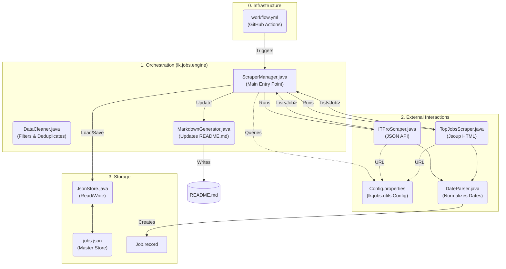

# 🇱🇰 Sri Lanka Software Engineering Jobs | 2026 Tracker [](https://t.me/SL_Software_Jobs)
Looking for software engineering jobs in Sri Lanka? This tracker updates daily with intern, junior, and senior IT roles across Colombo and beyond
Automated Software Engineering Job Tracker for Sri Lanka. Scrapes and categorizes Intern, Associate, and SE roles daily using Java (Jsoup) and GitHub Actions.

> [!TIP]
> **Help keep this project alive!** If this tool helped you find a lead today, please [**Star ⭐ the repo**](https://github.com/Senadeera-NK/sri-lanka-software-jobs). It’s how I measure the impact on our dev community! 🇱🇰

> [!IMPORTANT]
> **Automatic Staleness Purge:** The engine automatically removes listings older than **14 days**, ensuring the feed stays relevant and high-signal.

> **Live Analytics & Daily Software Job Tracker for Sri Lanka**

[📊 View Live Dashboard](https://sri-lanka-software-jobs.vercel.app/)

 
*Click the link above to see real-time trends, seniority distribution, and top hiring companies.*

## 📊 Current Job Openings
> 🟢 **Last Updated:** July 19,1:10 PM (Just now)  | **Total Jobs Found:** 191

### 🎓 Internships & Trainees  (27)

| Title | Company | Level  | Posted | Source |
| :--- | :--- | :--- | :--- | :--- |
| [Software Engineering Internship](https://itpro.lk/job/14377/software-engineering-internship-at-connex-codeworks/) | Connex Codeworks | Intern | 1&nbsp;hours&nbsp;ago | ITPro.lk |
| [Business Process QA & UX/UI Intern](https://itpro.lk/job/14376/business-process-qa-uxui-intern-at-process361-pvt-ltd/) | Process361 (Pvt) Ltd | Intern | 1&nbsp;hours&nbsp;ago | ITPro.lk |
| [Software Developer - Intern](https://itpro.lk/job/14009/software-developer-intern-at-cloud-syntex/) | Cloud Syntex | Intern | 2&nbsp;days&nbsp;ago | ITPro.lk |
| [Intern Software Engineer (Frontend & Backend)](https://itpro.lk/job/14355/intern-software-engineer-frontend-backend-at-bytesquad-labs/) | ByteSquad Labs | Intern | 3&nbsp;days&nbsp;ago | ITPro.lk |
| [Software Engineer Intern](https://itpro.lk/job/14338/software-engineer-intern-at-epinics/) | Epinics | Intern | 4&nbsp;days&nbsp;ago | ITPro.lk |
| [QA Intern](https://itpro.lk/job/14321/qa-intern-at-delivergate/) | Delivergate | Intern | 5&nbsp;days&nbsp;ago | ITPro.lk |
| [Internship Back-End Developer - PHP / JAVA](https://itpro.lk/job/14313/internship-backend-developer-php-java-at-neo-solution/) | Neo Solution | Intern | 6&nbsp;days&nbsp;ago | ITPro.lk |
| [Full Stack Developer Intern](https://itpro.lk/job/14310/full-stack-developer-intern-at-avenque/) | avenque | Intern | 6&nbsp;days&nbsp;ago | ITPro.lk |
| [Intern WordPress Developer](https://itpro.lk/job/14304/intern-wordpress-developer-at-ceylonx/) | CeylonX | Intern | 6&nbsp;days&nbsp;ago | ITPro.lk |
| [Uni Japura Career fair 2026 - Software Engineering Intern - Team 02](https://rooster.jobs/jobs/518626) | Creative Software | Intern | 6&nbsp;days&nbsp;ago | Rooster.jobs |
| [Uni Japura Career fair 2026 - Software Engineering Intern - Team 01 ](https://rooster.jobs/jobs/518625) | Creative Software | Intern | 6&nbsp;days&nbsp;ago | Rooster.jobs |
| [Software Engineering Intern](https://itpro.lk/job/14299/software-engineering-intern-at-project-cubit/) | Project Cubit | Intern | 7&nbsp;days&nbsp;ago | ITPro.lk |
| [Intern - Software Development](https://itpro.lk/job/14290/intern-software-development-at-artin-solutions/) | Artin Solutions | Intern | 8&nbsp;days&nbsp;ago | ITPro.lk |
| [Software Engineer Intern](https://itpro.lk/job/14286/software-engineer-intern-at-velorex-labs/) | Velorex Labs | Intern | 8&nbsp;days&nbsp;ago | ITPro.lk |
| [Software Engineer Internship - Remote](https://www.topjobs.lk/employer/JobAdvertismentServlet?ac=DEFZZZ&jc=0001522725&ec=DEFZZZ) | Xaventra (Private) Limited | Intern | 9&nbsp;days&nbsp;ago | TopJobs.lk |
| [IT Internship (BA/QA)](https://rooster.jobs/jobs/518589) | PAYable Pvt Ltd | Intern | 9&nbsp;days&nbsp;ago | Rooster.jobs |
| [Intern - Software Engineering](https://itpro.lk/job/14068/intern-software-engineering-at-xeynergy/) | Xeynergy | Intern | 10&nbsp;days&nbsp;ago | ITPro.lk |
| [Software Engineer Intern - .NET Developer](https://itpro.lk/job/14265/software-engineer-intern-net-developer-at-d-help-hub-private-limited/) | D HELP HUB Private Limited | Intern | 10&nbsp;days&nbsp;ago | ITPro.lk |
| [Intern - Software Engineer (NestJS)](https://itpro.lk/job/14263/intern-software-engineer-nestjs-at-en2h/) | EN2H | Intern | 11&nbsp;days&nbsp;ago | ITPro.lk |
| [Full Stack Intern](https://itpro.lk/job/14253/full-stack-intern-at-era-biz-solutions/) | Era Biz Solutions | Intern | 12&nbsp;days&nbsp;ago | ITPro.lk |
| [Software Engineer - Intern (onsite)](https://itpro.lk/job/14247/software-engineer-intern-onsite-at-d-help-hub-private-limited/) | D HELP HUB Private Limited | Intern | 12&nbsp;days&nbsp;ago | ITPro.lk |
| [AI Training Data Intern](https://www.topjobs.lk/employer/JobAdvertismentServlet?ac=DEFZZZ&jc=0001516660&ec=DEFZZZ) | ServiceTeam Ltd | Intern | 12&nbsp;days&nbsp;ago | TopJobs.lk |
| [Intern Software Engineer](https://rooster.jobs/jobs/518531) | Simplebooks (Pvt) Ltd | Intern | 12&nbsp;days&nbsp;ago | Rooster.jobs |
| [Automation & AI Workflow development - Associate Engineer/Intern](https://itpro.lk/job/14241/automation-ai-workflow-development-associate-engineerintern-at-idea8-pvt-ltd/) | Idea8 (Pvt) Ltd | Intern | 13&nbsp;days&nbsp;ago | ITPro.lk |
| [Back-End Developer - Intern](https://itpro.lk/job/14001/backend-developer-intern-at-neo-solution/) | Neo Solution | Intern | 13&nbsp;days&nbsp;ago | ITPro.lk |
| [Trainee \| Intern - QA Engineer](https://www.topjobs.lk/employer/JobAdvertismentServlet?ac=DEFZZZ&jc=0001520572&ec=DEFZZZ) | Web3 Genes (Pvt) Ltd | Intern | 13&nbsp;days&nbsp;ago | TopJobs.lk |
| [Full Stack Engineer – Intern](https://itpro.lk/job/13698/full-stack-engineer-intern-at-asyntax/) | aSyntax | Intern | 14&nbsp;days&nbsp;ago | ITPro.lk |

---

### 💻 Associate & Junior/SE Roles  (107)

| Title | Company | Level  | Posted | Source |
| :--- | :--- | :--- | :--- | :--- |
| [Software Engineer](https://www.topjobs.lk/employer/JobAdvertismentServlet?ac=DEFZZZ&jc=0001521550&ec=DEFZZZ) | Prima Management Services (Pvt) Ltd | Junior/SE | 13&nbsp;hours&nbsp;ago | TopJobs.lk |
| [QA Engineer](https://www.topjobs.lk/employer/JobAdvertismentServlet?ac=DEFZZZ&jc=0001524056&ec=DEFZZZ) | InEight Sri Lanka | Junior/SE | 13&nbsp;hours&nbsp;ago | TopJobs.lk |
| [Associate QA Engineer](https://www.topjobs.lk/employer/JobAdvertismentServlet?ac=DEFZZZ&jc=0001524251&ec=DEFZZZ) | Treinetic Pvt Ltd | Associate | 13&nbsp;hours&nbsp;ago | TopJobs.lk |
| [Associate Software Engineer](https://itpro.lk/job/14363/associate-software-engineer-at-oak-integrated-systems/) | Oak Integrated Systems | Associate | 2&nbsp;days&nbsp;ago | ITPro.lk |
| [ATL / SSE Front End Developer (1)](https://www.topjobs.lk/employer/JobAdvertismentServlet?ac=0000000421&jc=0001523743&ec=0000000555) | Sumathi Group | Junior/SE | 2&nbsp;days&nbsp;ago | TopJobs.lk |
| [Process Automation Executive (01 Year FTC) (1)](https://www.topjobs.lk/employer/JobAdvertismentServlet?ac=0000000160&jc=0001525370&ec=0000000192) | Michelin | Junior/SE | 2&nbsp;days&nbsp;ago | TopJobs.lk |
| [Data Scientist](https://www.topjobs.lk/employer/JobAdvertismentServlet?ac=DEFZZZ&jc=0001525330&ec=DEFZZZ) | Ceylinco Life Insurance Limited | Junior/SE | 2&nbsp;days&nbsp;ago | TopJobs.lk |
| [Data Engineer](https://www.topjobs.lk/employer/JobAdvertismentServlet?ac=DEFZZZ&jc=0001523496&ec=DEFZZZ) | ORYSYS Limited | Junior/SE | 2&nbsp;days&nbsp;ago | TopJobs.lk |
| [Web Developer](https://www.topjobs.lk/employer/JobAdvertismentServlet?ac=DEFZZZ&jc=0001525803&ec=DEFZZZ) | Ruth Pictures (Pvt) Ltd | Junior/SE | 2&nbsp;days&nbsp;ago | TopJobs.lk |
| [Quality Inspector (1)](https://www.topjobs.lk/employer/JobAdvertismentServlet?ac=0000000146&jc=0001525675&ec=0000000178) | Nawaloka Hospitals PLC | Junior/SE | 2&nbsp;days&nbsp;ago | TopJobs.lk |
| [Quality Executive (1)](https://www.topjobs.lk/employer/JobAdvertismentServlet?ac=0000000146&jc=0001525671&ec=0000000178) | Nawaloka Hospitals PLC | Junior/SE | 2&nbsp;days&nbsp;ago | TopJobs.lk |
| [Full Stack Developer](https://www.topjobs.lk/employer/JobAdvertismentServlet?ac=DEFZZZ&jc=0001525636&ec=DEFZZZ) | Eldu Labs (Pvt) Ltd | Junior/SE | 2&nbsp;days&nbsp;ago | TopJobs.lk |
| [Learning Content & AI Research Associate \| AI Trainee & Coordinator](https://www.topjobs.lk/employer/JobAdvertismentServlet?ac=DEFZZZ&jc=0001525579&ec=DEFZZZ) | Curveup | Associate | 2&nbsp;days&nbsp;ago | TopJobs.lk |
| [Software Engineer](https://www.topjobs.lk/employer/JobAdvertismentServlet?ac=DEFZZZ&jc=0001525547&ec=DEFZZZ) | BPO Corporate Solutions Pvt Ltd | Junior/SE | 2&nbsp;days&nbsp;ago | TopJobs.lk |
| [AI Content Creator](https://www.topjobs.lk/employer/JobAdvertismentServlet?ac=DEFZZZ&jc=0001525500&ec=DEFZZZ) | Company Name Withheld | Junior/SE | 2&nbsp;days&nbsp;ago | TopJobs.lk |
| [Full Stack Software Developer](https://www.topjobs.lk/employer/JobAdvertismentServlet?ac=DEFZZZ&jc=0001525989&ec=DEFZZZ) | Douglas & Sons (Pvt) Ltd | Junior/SE | 2&nbsp;days&nbsp;ago | TopJobs.lk |
| [Web Developer](https://itpro.lk/job/14358/web-developer-at-earrow-pvt-ltd/) | eArrow (Pvt) LTD | Junior/SE | 2&nbsp;days&nbsp;ago | ITPro.lk |
| [Big Data Engineer (1)](https://www.topjobs.lk/employer/JobAdvertismentServlet?ac=0000000271&jc=0001420855&ec=0000000350) | CMS (Pvt) Ltd | Junior/SE | 3&nbsp;days&nbsp;ago | TopJobs.lk |
| [Junior Trainee - Software Developer & IOT](https://www.topjobs.lk/employer/JobAdvertismentServlet?ac=DEFZZZ&jc=0001524973&ec=DEFZZZ) | Hedanship Asia (Pvt) Ltd | Associate | 3&nbsp;days&nbsp;ago | TopJobs.lk |
| [Software Engineer (1)](https://www.topjobs.lk/employer/JobAdvertismentServlet?ac=0000000146&jc=0001524970&ec=0000000178) | Nawaloka Hospitals PLC | Junior/SE | 3&nbsp;days&nbsp;ago | TopJobs.lk |
| [Business Center Quality Control Supervisor (1)](https://www.topjobs.lk/employer/JobAdvertismentServlet?ac=0000000146&jc=0001524802&ec=0000000178) | Nawaloka Hospitals PLC | Junior/SE | 3&nbsp;days&nbsp;ago | TopJobs.lk |
| [QA Automation Engineer](https://www.topjobs.lk/employer/JobAdvertismentServlet?ac=DEFZZZ&jc=0001519022&ec=DEFZZZ) | Intrepid | Junior/SE | 3&nbsp;days&nbsp;ago | TopJobs.lk |
| [Quality Assurance Engineer](https://xpress.jobs/jobs/view/305398) | Davton Limited | Junior/SE | 4&nbsp;days&nbsp;ago | XpressJobs |
| [Associate Architect – AI Solutions](https://xpress.jobs/jobs/view/305752) | Dialog Axiata PLC | Associate | 4&nbsp;days&nbsp;ago | XpressJobs |
| [Software Engineering , Artificial Intelligence Lecturers (Fu...](https://xpress.jobs/jobs/view/306046) | Campus Direct | Junior/SE | 4&nbsp;days&nbsp;ago | XpressJobs |
| [Devops & IT Infrastucture Engineer \| Nawam Mawatha, Colombo 02](https://xpress.jobs/jobs/view/306570) | Victory Company (Igaming BPO) | Junior/SE | 4&nbsp;days&nbsp;ago | XpressJobs |
| [Software Architect \| Colombo](https://xpress.jobs/jobs/view/306875) | Mavip Infotech | Junior/SE | 4&nbsp;days&nbsp;ago | XpressJobs |
| [Software Developer (FOR ERP) - Trainee / Experienced](https://xpress.jobs/jobs/view/305342) | Ontash (Pvt) Ltd. | Associate | 4&nbsp;days&nbsp;ago | XpressJobs |
| [Enterprise Solution Architect](https://xpress.jobs/jobs/view/307153) | Ernst & Young | Junior/SE | 4&nbsp;days&nbsp;ago | XpressJobs |
| [Full Stack Developer (Junior)](https://xpress.jobs/jobs/view/307874) | ShopQ | Junior/SE | 4&nbsp;days&nbsp;ago | XpressJobs |
| [Risk and Governance Engineer](https://xpress.jobs/jobs/view/307889) | Innobot | Junior/SE | 4&nbsp;days&nbsp;ago | XpressJobs |
| [Head of AI](https://xpress.jobs/jobs/view/307946) | Omobio | Junior/SE | 4&nbsp;days&nbsp;ago | XpressJobs |
| [AI and Automation Engineer](https://xpress.jobs/jobs/view/305496) | TGT Global | Junior/SE | 4&nbsp;days&nbsp;ago | XpressJobs |
| [Head of Information Security](https://xpress.jobs/jobs/view/308196) | SMB Finance PLC | Junior/SE | 4&nbsp;days&nbsp;ago | XpressJobs |
| [Security Analyst](https://xpress.jobs/jobs/view/308250) | TGT Global | Junior/SE | 4&nbsp;days&nbsp;ago | XpressJobs |
| [Database Administrator - Oracle](https://xpress.jobs/jobs/view/308418) | Melsta Technologies (Pvt) Ltd | Junior/SE | 4&nbsp;days&nbsp;ago | XpressJobs |
| [Walk In Interviews \| Graduate Engineer Analyst - Infrastruc...](https://xpress.jobs/jobs/view/305313) | HCL Technologies Lanka (Private) Limited | Junior/SE | 4&nbsp;days&nbsp;ago | XpressJobs |
| [Walk In Interview \| Graduate Engineering (Fresh Graduates)](https://xpress.jobs/jobs/view/305311) | HCL Technologies Lanka (Private) Limited | Junior/SE | 4&nbsp;days&nbsp;ago | XpressJobs |
| [Engineer - BSS Operations](https://xpress.jobs/jobs/view/308634) | Dialog Axiata PLC | Junior/SE | 4&nbsp;days&nbsp;ago | XpressJobs |
| [Head of Cyber Security Governance and Compliance](https://xpress.jobs/jobs/view/308635) | Dialog Axiata PLC | Junior/SE | 4&nbsp;days&nbsp;ago | XpressJobs |
| [Junior Executive Grade - Information Security Analyst](https://xpress.jobs/jobs/view/308681) | Dialog Finance PLC | Junior/SE | 4&nbsp;days&nbsp;ago | XpressJobs |
| [Software Engineer (.NET)](https://itpro.lk/job/14332/software-engineer-net-at-ipd-group-sri-lanka/) | IPD Group Sri Lanka | Junior/SE | 4&nbsp;days&nbsp;ago | ITPro.lk |
| [School Leaver Data Formatter for LLM Processing](https://www.topjobs.lk/employer/JobAdvertismentServlet?ac=DEFZZZ&jc=0001524641&ec=DEFZZZ) | ServiceTeam Ltd | Junior/SE | 4&nbsp;days&nbsp;ago | TopJobs.lk |
| [DevOps Engineer](https://www.topjobs.lk/employer/JobAdvertismentServlet?ac=DEFZZZ&jc=0001524591&ec=DEFZZZ) | Insync Technologies | Junior/SE | 4&nbsp;days&nbsp;ago | TopJobs.lk |
| [Associate Quality Assurance Engineer](https://itpro.lk/job/14331/associate-quality-assurance-engineer-at-hitachi-digital-payment-solutions-ltd/) | Hitachi Digital Payment Solutions Ltd | Associate | 4&nbsp;days&nbsp;ago | ITPro.lk |
| [Web Developer](https://itpro.lk/job/14329/web-developer-at-printerslk-pvt-ltd/) | Printers.lk Pvt Ltd | Junior/SE | 4&nbsp;days&nbsp;ago | ITPro.lk |
| [Back - End Developer](https://www.topjobs.lk/employer/JobAdvertismentServlet?ac=DEFZZZ&jc=0001518513&ec=DEFZZZ) | Company Name Withheld | Junior/SE | 4&nbsp;days&nbsp;ago | TopJobs.lk |
| [Associate Software Engineer (Associate RPA Developer)](https://xpress.jobs/jobs/view/304854) | Ascent Business Solutions (Pvt) Ltd | Associate | 5&nbsp;days&nbsp;ago | XpressJobs |
| [Engineer - IP MPLS Core - Operations](https://xpress.jobs/jobs/view/305697) | Mobitel (Pvt) Ltd | Junior/SE | 5&nbsp;days&nbsp;ago | XpressJobs |
| [Full Stack Developer](https://itpro.lk/job/14323/full-stack-developer-at-softmaster-technologies-pvt-ltd/) | Soft-master Technologies (Pvt) Ltd | Junior/SE | 5&nbsp;days&nbsp;ago | ITPro.lk |
| [Software Engineer](https://rooster.jobs/jobs/518644) | Cloud Parallax (Pvt) Ltd | Junior/SE | 5&nbsp;days&nbsp;ago | Rooster.jobs |
| [Associate Software Quality Assurance Engineer](https://itpro.lk/job/14320/associate-software-quality-assurance-engineer-at-laugfs-holdings-limited/) | LAUGFS Holdings Limited | Associate | 5&nbsp;days&nbsp;ago | ITPro.lk |
| [Junior Algorithm Engineer - DSP - FPGA Engineer](https://www.topjobs.lk/employer/JobAdvertismentServlet?ac=DEFZZZ&jc=0001518413&ec=DEFZZZ) | Thakshana Technologies (Pvt) Ltd | Junior/SE | 5&nbsp;days&nbsp;ago | TopJobs.lk |
| [Junior Embedded Software Engineer (Security-Focused)](https://www.topjobs.lk/employer/JobAdvertismentServlet?ac=DEFZZZ&jc=0001518412&ec=DEFZZZ) | Thakshana Technologies (Pvt) Ltd | Junior/SE | 5&nbsp;days&nbsp;ago | TopJobs.lk |
| [Laravel Backend & VUE3 Frontend Full Stack Developer (Experienced)](https://www.topjobs.lk/employer/JobAdvertismentServlet?ac=DEFZZZ&jc=0001521439&ec=DEFZZZ) | Mai Globe Travels (Pvt) Ltd | Junior/SE | 5&nbsp;days&nbsp;ago | TopJobs.lk |
| [QA Engineer](https://www.topjobs.lk/employer/JobAdvertismentServlet?ac=0000000484&jc=0001523658&ec=0000000651) | Epic Lanka (Pvt) Ltd | Junior/SE | 5&nbsp;days&nbsp;ago | TopJobs.lk |
| [Software Quality Assurance Engineer (1)](https://www.topjobs.lk/employer/JobAdvertismentServlet?ac=0000000492&jc=0001524158&ec=0000000661) | DirectFN | Junior/SE | 5&nbsp;days&nbsp;ago | TopJobs.lk |
| [Associate QA Engineer](https://itpro.lk/job/14314/associate-qa-engineer-at-delivergate/) | Delivergate | Associate | 5&nbsp;days&nbsp;ago | ITPro.lk |
| [Quality Engineer](https://itpro.lk/job/14311/quality-engineer-at-hatchyard/) | Hatchyard | Junior/SE | 6&nbsp;days&nbsp;ago | ITPro.lk |
| [Software Engineer](https://itpro.lk/job/14307/software-engineer-at-predictiv-ai/) | Predictiv AI | Junior/SE | 6&nbsp;days&nbsp;ago | ITPro.lk |
| [Automation & Integration Engineer](https://www.topjobs.lk/employer/JobAdvertismentServlet?ac=DEFZZZ&jc=0001521348&ec=DEFZZZ) | Effectz.AI | Junior/SE | 6&nbsp;days&nbsp;ago | TopJobs.lk |
| [Claude AI Expert (1)](https://www.topjobs.lk/employer/JobAdvertismentServlet?ac=0000000015&jc=0001523565&ec=0000000015) | Delmege Group | Junior/SE | 6&nbsp;days&nbsp;ago | TopJobs.lk |
| [Associate Quality Assurance Engineer](https://www.topjobs.lk/employer/JobAdvertismentServlet?ac=DEFZZZ&jc=0001523534&ec=DEFZZZ) | Hitachi Digital Payment Solutions Limited | Associate | 6&nbsp;days&nbsp;ago | TopJobs.lk |
| [Junior Web Developer](https://itpro.lk/job/13507/junior-web-developer-at-prime-one-global/) | Prime One Global | Junior/SE | 7&nbsp;days&nbsp;ago | ITPro.lk |
| [Associate Software Engineer (Java \| React \| Next.js)](https://www.topjobs.lk/employer/JobAdvertismentServlet?ac=DEFZZZ&jc=0001523013&ec=DEFZZZ) | SynthVaults Limited | Associate | 8&nbsp;days&nbsp;ago | TopJobs.lk |
| [Associate – QA Automation Engineer](https://itpro.lk/job/14069/associate-qa-automation-engineer-at-xeynergy/) | Xeynergy | Associate | 9&nbsp;days&nbsp;ago | ITPro.lk |
| [Quality Assurance Engineer](https://itpro.lk/job/14284/quality-assurance-engineer-at-echonlabs/) | EchonLabs | Junior/SE | 9&nbsp;days&nbsp;ago | ITPro.lk |
| [IT Systems Engineer](https://www.topjobs.lk/employer/JobAdvertismentServlet?ac=DEFZZZ&jc=0001522534&ec=DEFZZZ) | ControlArc Partners | Junior/SE | 9&nbsp;days&nbsp;ago | TopJobs.lk |
| [Data Scientist \| Engineer](https://www.topjobs.lk/employer/JobAdvertismentServlet?ac=DEFZZZ&jc=0001522429&ec=DEFZZZ) | Astron Limited | Junior/SE | 9&nbsp;days&nbsp;ago | TopJobs.lk |
| [Web Developer](https://www.topjobs.lk/employer/JobAdvertismentServlet?ac=DEFZZZ&jc=0001522728&ec=DEFZZZ) | CIB Holdings | Junior/SE | 9&nbsp;days&nbsp;ago | TopJobs.lk |
| [Global Process Owner Master Data Management (German Calendar...](https://www.topjobs.lk/employer/JobAdvertismentServlet?ac=DEFZZZ&jc=0001522869&ec=DEFZZZ) | Freudenberg Apparel Lanka Pvt Ltd | Junior/SE | 9&nbsp;days&nbsp;ago | TopJobs.lk |
| [AI Engineer](https://www.topjobs.lk/employer/JobAdvertismentServlet?ac=DEFZZZ&jc=0001522845&ec=DEFZZZ) | Accura Tech (Pvt) Ltd | Junior/SE | 9&nbsp;days&nbsp;ago | TopJobs.lk |
| [Web Developer](https://itpro.lk/job/14281/web-developer-at-primeweb-lanka/) | PrimeWeb Lanka | Junior/SE | 9&nbsp;days&nbsp;ago | ITPro.lk |
| [Junior Full Stack Developer](https://itpro.lk/job/14277/junior-full-stack-developer-at-cyrus-information-technologies/) | Cyrus Information Technologies | Junior/SE | 9&nbsp;days&nbsp;ago | ITPro.lk |
| [Associate Software Engineer](https://itpro.lk/job/14276/associate-software-engineer-at-unicorn-connected-apps/) | Unicorn Connected Apps | Associate | 9&nbsp;days&nbsp;ago | ITPro.lk |
| [Junior Functional / Manual QA Engineer](https://itpro.lk/job/14275/junior-functional-manual-qa-engineer-at-well-treasure-asia/) | Well Treasure Asia | Junior/SE | 9&nbsp;days&nbsp;ago | ITPro.lk |
| [Junior Automation QA Engineer](https://itpro.lk/job/14274/junior-automation-qa-engineer-at-well-treasure-asia/) | Well Treasure Asia | Junior/SE | 9&nbsp;days&nbsp;ago | ITPro.lk |
| [Software Engineer (Angular / C# .NET Core)](https://itpro.lk/job/12777/software-engineer-angular-c-net-core-at-enhanzer/) | Enhanzer | Junior/SE | 9&nbsp;days&nbsp;ago | ITPro.lk |
| [Enterprise Platform & AI Engineer](https://www.topjobs.lk/employer/JobAdvertismentServlet?ac=DEFZZZ&jc=0001521948&ec=DEFZZZ) | Lyceum Global Holdings (Pvt) Ltd | Junior/SE | 10&nbsp;days&nbsp;ago | TopJobs.lk |
| [Platform & Security Engineer](https://www.topjobs.lk/employer/JobAdvertismentServlet?ac=DEFZZZ&jc=0001521934&ec=DEFZZZ) | Lyceum Global Holdings (Pvt) Ltd | Junior/SE | 10&nbsp;days&nbsp;ago | TopJobs.lk |
| [Software Engineer (.NET)](https://www.topjobs.lk/employer/JobAdvertismentServlet?ac=DEFZZZ&jc=0001521927&ec=DEFZZZ) | IPD Colombo | Junior/SE | 10&nbsp;days&nbsp;ago | TopJobs.lk |
| [IT Helpdesk Engineer (20)](https://www.topjobs.lk/employer/JobAdvertismentServlet?ac=0000000419&jc=0001521841&ec=0000000552) | Micronet Global Services (Pvt) Ltd | Junior/SE | 10&nbsp;days&nbsp;ago | TopJobs.lk |
| [Management Trainee - AI (1)](https://www.topjobs.lk/employer/JobAdvertismentServlet?ac=0000000064&jc=0001522305&ec=0000000603) | Hirdaramani - H CONNECT (PVT) LIMITED | Associate | 10&nbsp;days&nbsp;ago | TopJobs.lk |
| [DevOps Engineer (Application Deployment & Integration)](https://www.topjobs.lk/employer/JobAdvertismentServlet?ac=DEFZZZ&jc=0001522234&ec=DEFZZZ) | Company Name Withheld | Junior/SE | 10&nbsp;days&nbsp;ago | TopJobs.lk |
| [Full Stack Developer (Node .JS & Angular)](https://www.topjobs.lk/employer/JobAdvertismentServlet?ac=DEFZZZ&jc=0001522177&ec=DEFZZZ) | WenodoSL Pvt Ltd | Junior/SE | 10&nbsp;days&nbsp;ago | TopJobs.lk |
| [Full Stack Engineer](https://itpro.lk/job/14270/full-stack-engineer-at-via-codos-private-limited/) | Via Codos Private Limited | Junior/SE | 10&nbsp;days&nbsp;ago | ITPro.lk |
| [Software Engineer](https://itpro.lk/job/14269/software-engineer-at-tech-connect-global-pvt-ltd/) | Tech Connect Global Pvt Ltd | Junior/SE | 10&nbsp;days&nbsp;ago | ITPro.lk |
| [Full Stack Engineer - AI Platform](https://www.topjobs.lk/employer/JobAdvertismentServlet?ac=DEFZZZ&jc=0001521407&ec=DEFZZZ) | Company Name Withheld | Junior/SE | 11&nbsp;days&nbsp;ago | TopJobs.lk |
| [AI Solution Architect](https://www.topjobs.lk/employer/JobAdvertismentServlet?ac=DEFZZZ&jc=0001516526&ec=DEFZZZ) | Commercial Bank of Ceylon PLC | Junior/SE | 11&nbsp;days&nbsp;ago | TopJobs.lk |
| [Junior Full Stack Developer - Product Team Junior](https://xpress.jobs/jobs/view/303252) | ShopQ | Junior/SE | 12&nbsp;days&nbsp;ago | XpressJobs |
| [Junior Software Developer](https://xpress.jobs/jobs/view/303265) | ShopQ | Junior/SE | 12&nbsp;days&nbsp;ago | XpressJobs |
| [Data Analyst](https://xpress.jobs/jobs/view/304144) | Dialog Axiata PLC | Junior/SE | 12&nbsp;days&nbsp;ago | XpressJobs |
| [Engineer - Converged Charging](https://xpress.jobs/jobs/view/304145) | Dialog Axiata PLC | Junior/SE | 12&nbsp;days&nbsp;ago | XpressJobs |
| [Software Engineer / ABAP Developer](https://xpress.jobs/jobs/view/303920) | Lanka Walltiles PLC | Junior/SE | 12&nbsp;days&nbsp;ago | XpressJobs |
| [Automation Engineer - UK Project \| Hybrid](https://xpress.jobs/jobs/view/304255) | Konnect BPO | Junior/SE | 12&nbsp;days&nbsp;ago | XpressJobs |
| [Engineer - IT Security](https://xpress.jobs/jobs/view/304747) | Commercial Bank of Ceylon PLC | Junior/SE | 12&nbsp;days&nbsp;ago | XpressJobs |
| [Lecturer - Computer Science](https://xpress.jobs/jobs/view/304660) | APIIT - Sri Lanka | Junior/SE | 12&nbsp;days&nbsp;ago | XpressJobs |
| [Full Stack Developer](https://www.topjobs.lk/employer/JobAdvertismentServlet?ac=DEFZZZ&jc=0001521153&ec=DEFZZZ) | TekGeeks (Pvt) Ltd | Junior/SE | 12&nbsp;days&nbsp;ago | TopJobs.lk |
| [Full Stack Developer](https://itpro.lk/job/14244/full-stack-developer-at-king-sparrow-group-of-companies-pvt-ltd/) | King Sparrow Group of Companies (PVT) Ltd | Junior/SE | 12&nbsp;days&nbsp;ago | ITPro.lk |
| [Associate Software Engineer (Full Stack)](https://rooster.jobs/jobs/518512) | PAYable Pvt Ltd | Associate | 12&nbsp;days&nbsp;ago | Rooster.jobs |
| [Data Analyst (1)](https://www.topjobs.lk/employer/JobAdvertismentServlet?ac=0000000064&jc=0001520683&ec=0000000603) | Hirdaramani - H CONNECT (PVT) LIMITED | Junior/SE | 13&nbsp;days&nbsp;ago | TopJobs.lk |
| [Software Engineer - Java](https://itpro.lk/job/14104/software-engineer-java-at-directfn/) | DirectFN | Junior/SE | 13&nbsp;days&nbsp;ago | ITPro.lk |
| [Part Time AI Developer \| Full - Stack AI Engineer](https://www.topjobs.lk/employer/JobAdvertismentServlet?ac=DEFZZZ&jc=0001515396&ec=DEFZZZ) | Quard International (Pvt) Ltd | Junior/SE | 13&nbsp;days&nbsp;ago | TopJobs.lk |
| [Shopify Expert \| Shopify Developer](https://www.topjobs.lk/employer/JobAdvertismentServlet?ac=DEFZZZ&jc=0001515394&ec=DEFZZZ) | Quard International (Pvt) Ltd | Junior/SE | 13&nbsp;days&nbsp;ago | TopJobs.lk |
| [Graduate Engineering (Fresh Graduates)](https://xpress.jobs/jobs/view/304256) | HCL Technologies Lanka (Private) Limited | Junior/SE | 14&nbsp;days&nbsp;ago | XpressJobs |
| [Graduate Engineer Analyst - Infrastructure Services (Data Ce...](https://xpress.jobs/jobs/view/304258) | HCL Technologies Lanka (Private) Limited | Junior/SE | 14&nbsp;days&nbsp;ago | XpressJobs |
| [Full Stack Software Engineer](https://itpro.lk/job/14226/full-stack-software-engineer-at-maytech-technologies/) | Maytech Technologies | Junior/SE | 14&nbsp;days&nbsp;ago | ITPro.lk |

---

### 🚀 Senior & Lead Roles  (57)

| Title | Company | Level  | Posted | Source |
| :--- | :--- | :--- | :--- | :--- |
| [Senior Software Developer (Desktop Applications)](https://itpro.lk/job/14374/senior-software-developer-desktop-applications-at-bistec-global-services/) | BISTEC Global Services | Senior | 21&nbsp;hours&nbsp;ago | ITPro.lk |
| [Lead QA Automation Engineer (Web, Mobile & API)](https://itpro.lk/job/14370/lead-qa-automation-engineer-web-mobile-api-at-wisdom-recruitments/) | Wisdom RecruitmentS | Senior | Yesterday | ITPro.lk |
| [Senior Engineer - .NET](https://itpro.lk/job/14369/senior-engineer-net-at-verdentra/) | Verdentra | Senior | Yesterday | ITPro.lk |
| [Senior AI / Software Engineer](https://itpro.lk/job/14367/senior-ai-software-engineer-at-via-codos-private-limited/) | Via Codos Private Limited | Senior | 2&nbsp;days&nbsp;ago | ITPro.lk |
| [AI Capability & Delivery Lead ](https://rooster.jobs/jobs/518730) | Nextjob | Senior | 2&nbsp;days&nbsp;ago | Rooster.jobs |
| [Senior Full Stack Developer](https://www.topjobs.lk/employer/JobAdvertismentServlet?ac=DEFZZZ&jc=0001519642&ec=DEFZZZ) | Company Name Withheld | Senior | 2&nbsp;days&nbsp;ago | TopJobs.lk |
| [Java Tech Lead](https://itpro.lk/job/14238/java-tech-lead-at-directfn/) | DirectFN | Senior | 3&nbsp;days&nbsp;ago | ITPro.lk |
| [Senior Snowflake Engineer (1)](https://www.topjobs.lk/employer/JobAdvertismentServlet?ac=0000000271&jc=0001515730&ec=0000000350) | CMS (Pvt) Ltd | Senior | 3&nbsp;days&nbsp;ago | TopJobs.lk |
| [Senior QA Engineer (1)](https://www.topjobs.lk/employer/JobAdvertismentServlet?ac=0000000271&jc=0001519031&ec=0000000350) | CMS (Pvt) Ltd | Senior | 3&nbsp;days&nbsp;ago | TopJobs.lk |
| [Lead Data Engineer](https://www.topjobs.lk/employer/JobAdvertismentServlet?ac=DEFZZZ&jc=0001525170&ec=DEFZZZ) | HRC Labs | Senior | 3&nbsp;days&nbsp;ago | TopJobs.lk |
| [Senior / Full Stack Software Engineer](https://itpro.lk/job/14339/senior-full-stack-software-engineer-at-syntrad-labs-private-limited/) | Syntrad Labs (Private) Limited | Senior | 4&nbsp;days&nbsp;ago | ITPro.lk |
| [Tech Lead – AI & Platform Engineering \| Hybrid](https://xpress.jobs/jobs/view/305193) | Coderra | Senior | 4&nbsp;days&nbsp;ago | XpressJobs |
| [Senior Software Engineer : Ruby on Rails](https://xpress.jobs/jobs/view/306024) | OXO Tech (Pvt) Ltd | Senior | 4&nbsp;days&nbsp;ago | XpressJobs |
| [Senior Java Architect \| Colombo](https://xpress.jobs/jobs/view/306074) | YI CAN PTE. LTD. | Senior | 4&nbsp;days&nbsp;ago | XpressJobs |
| [Senior Automation Engineer (Python Focus)](https://xpress.jobs/jobs/view/306419) | Innobot | Senior | 4&nbsp;days&nbsp;ago | XpressJobs |
| [Lead Automation Engineer (Python Focus)](https://xpress.jobs/jobs/view/306484) | Innobot | Senior | 4&nbsp;days&nbsp;ago | XpressJobs |
| [Team Lead – IT Infrastructure (Cloud) \| Colombo](https://xpress.jobs/jobs/view/306223) | InfoMate (Pvt) Ltd | Senior | 4&nbsp;days&nbsp;ago | XpressJobs |
| [Senior WordPress / Shopify Developer](https://xpress.jobs/jobs/view/307240) | AmplifyD Pvt Ltd | Senior | 4&nbsp;days&nbsp;ago | XpressJobs |
| [Principal Engineer cum Team Lead (AI, Software)](https://xpress.jobs/jobs/view/307341) | PBA Systems Pte Ltd | Senior | 4&nbsp;days&nbsp;ago | XpressJobs |
| [Senior Software Engineer](https://xpress.jobs/jobs/view/308100) | HT Works Pvt Ltd | Senior | 4&nbsp;days&nbsp;ago | XpressJobs |
| [Senior AI and Automation Engineer](https://xpress.jobs/jobs/view/305606) | TGT Global | Senior | 4&nbsp;days&nbsp;ago | XpressJobs |
| [Senior Systems Engineer](https://xpress.jobs/jobs/view/305497) | TGT Global | Senior | 4&nbsp;days&nbsp;ago | XpressJobs |
| [Senior Full Stack Engineer](https://xpress.jobs/jobs/view/305495) | TGT Global | Senior | 4&nbsp;days&nbsp;ago | XpressJobs |
| [Senior Systems Engineer - It Infrastructure](https://xpress.jobs/jobs/view/308638) | Mobitel (Pvt) Ltd | Senior | 4&nbsp;days&nbsp;ago | XpressJobs |
| [Senior Front-End (Ecommerce) Developer](https://itpro.lk/job/14336/senior-frontend-ecommerce-developer-at-ipd-group-sri-lanka/) | IPD Group Sri Lanka | Senior | 4&nbsp;days&nbsp;ago | ITPro.lk |
| [Senior Web Developer](https://itpro.lk/job/14335/senior-web-developer-at-ipd-group-sri-lanka/) | IPD Group Sri Lanka | Senior | 4&nbsp;days&nbsp;ago | ITPro.lk |
| [Software Engineer (Python) \| Senior Software Engineer (Python)](https://www.topjobs.lk/employer/JobAdvertismentServlet?ac=DEFZZZ&jc=0001524619&ec=DEFZZZ) | Innobot Health | Senior | 4&nbsp;days&nbsp;ago | TopJobs.lk |
| [JAVA Tech Lead (1)](https://www.topjobs.lk/employer/JobAdvertismentServlet?ac=0000000492&jc=0001524493&ec=0000000661) | DirectFN | Senior | 4&nbsp;days&nbsp;ago | TopJobs.lk |
| [Senior Software Engineer (Python)](https://xpress.jobs/jobs/view/304544) | Innobot | Senior | 5&nbsp;days&nbsp;ago | XpressJobs |
| [Senior Software / Automation Systems Engineer](https://xpress.jobs/jobs/view/304939) | Seaport Group | Senior | 5&nbsp;days&nbsp;ago | XpressJobs |
| [Senior Python Developer \| Remote](https://xpress.jobs/jobs/view/304959) | BlueOceanSP | Senior | 5&nbsp;days&nbsp;ago | XpressJobs |
| [Team Lead ( Blockchain, Full-Stack & AI  )  - Remote](https://xpress.jobs/jobs/view/305043) | Advantage Group Australasia Pty. Ltd | Senior | 5&nbsp;days&nbsp;ago | XpressJobs |
| [Senior Front-end Developer.](https://www.topjobs.lk/employer/JobAdvertismentServlet?ac=DEFZZZ&jc=0001523707&ec=DEFZZZ) | Dynamical | Senior | 5&nbsp;days&nbsp;ago | TopJobs.lk |
| [Tech Lead Java (1)](https://www.topjobs.lk/employer/JobAdvertismentServlet?ac=0000000492&jc=0001524157&ec=0000000661) | DirectFN | Senior | 5&nbsp;days&nbsp;ago | TopJobs.lk |
| [Senior Software Engineer JAVA (1)](https://www.topjobs.lk/employer/JobAdvertismentServlet?ac=0000000492&jc=0001524156&ec=0000000661) | DirectFN | Senior | 5&nbsp;days&nbsp;ago | TopJobs.lk |
| [Senior Software Engineer .NET (1)](https://www.topjobs.lk/employer/JobAdvertismentServlet?ac=0000000492&jc=0001524155&ec=0000000661) | DirectFN | Senior | 5&nbsp;days&nbsp;ago | TopJobs.lk |
| [Senior Quality Engineer](https://itpro.lk/job/14312/senior-quality-engineer-at-hatchyard/) | Hatchyard | Senior | 6&nbsp;days&nbsp;ago | ITPro.lk |
| [Senior Software Engineer](https://itpro.lk/job/14296/senior-software-engineer-at-xeynergy/) | Xeynergy | Senior | 7&nbsp;days&nbsp;ago | ITPro.lk |
| [Senior Enterprise Solutions Architect](https://itpro.lk/job/14066/senior-enterprise-solutions-architect-at-xeynergy/) | Xeynergy | Senior | 9&nbsp;days&nbsp;ago | ITPro.lk |
| [Tech Lead – Backend (Python / FastAPI / Java)](https://itpro.lk/job/14267/tech-lead-backend-python-fastapi-java-at-zeawis-ltd/) | Zeawis Ltd | Senior | 10&nbsp;days&nbsp;ago | ITPro.lk |
| [Tech Lead – Frontend (React.js / Vue.js)](https://itpro.lk/job/14266/tech-lead-frontend-reactjs-vuejs-at-zeawis-ltd/) | Zeawis Ltd | Senior | 10&nbsp;days&nbsp;ago | ITPro.lk |
| [Senior Full Stack Developer (Full Time or Part Time) (Remote...](https://www.topjobs.lk/employer/JobAdvertismentServlet?ac=DEFZZZ&jc=0001521548&ec=DEFZZZ) | Ismo International Industries Pvt Ltd | Senior | 11&nbsp;days&nbsp;ago | TopJobs.lk |
| [Senior Machine Learning Engineer](https://xpress.jobs/jobs/view/303796) | AIClub | Senior | 12&nbsp;days&nbsp;ago | XpressJobs |
| [Senior SQL and SSRS Developer](https://xpress.jobs/jobs/view/303916) | KriyaGo | Senior | 12&nbsp;days&nbsp;ago | XpressJobs |
| [Technical Lead (AI, Software)](https://xpress.jobs/jobs/view/304035) | PBA Systems Pte Ltd | Senior | 12&nbsp;days&nbsp;ago | XpressJobs |
| [Senior Lecturer - Grade II / Lecturer / Lecturer (Probationa...](https://xpress.jobs/jobs/view/304513) | Sri Lanka Technology Campus | SLTC | Senior | 12&nbsp;days&nbsp;ago | XpressJobs |
| [Senior Lecturer - Grade II / Lecturer / Lecturer (Probationa...](https://xpress.jobs/jobs/view/304514) | Sri Lanka Technology Campus | SLTC | Senior | 12&nbsp;days&nbsp;ago | XpressJobs |
| [Senior Lecturer - Grade II / Lecturer / Lecturer (Probationa...](https://xpress.jobs/jobs/view/304515) | Sri Lanka Technology Campus | SLTC | Senior | 12&nbsp;days&nbsp;ago | XpressJobs |
| [Senior Lecturer - Grade II / Lecturer / Lecturer (Probationa...](https://xpress.jobs/jobs/view/304516) | Sri Lanka Technology Campus | SLTC | Senior | 12&nbsp;days&nbsp;ago | XpressJobs |
| [Technical Lead - Python Focus](https://xpress.jobs/jobs/view/304837) | Innobot | Senior | 12&nbsp;days&nbsp;ago | XpressJobs |
| [Senior C# and ASP.NET AI & Full-Stack Developer](https://www.topjobs.lk/employer/JobAdvertismentServlet?ac=DEFZZZ&jc=0001520802&ec=DEFZZZ) | SubFactor Ltd | Senior | 12&nbsp;days&nbsp;ago | TopJobs.lk |
| [Senior Software Engineer Java Script (1)](https://www.topjobs.lk/employer/JobAdvertismentServlet?ac=0000000492&jc=0001520661&ec=0000000661) | DirectFN | Senior | 13&nbsp;days&nbsp;ago | TopJobs.lk |
| [Tech Lead JAVA Angular (1)](https://www.topjobs.lk/employer/JobAdvertismentServlet?ac=0000000492&jc=0001520662&ec=0000000661) | DirectFN | Senior | 13&nbsp;days&nbsp;ago | TopJobs.lk |
| [Senior Front-End (Ecommerce) Developer](https://www.topjobs.lk/employer/JobAdvertismentServlet?ac=DEFZZZ&jc=0001520423&ec=DEFZZZ) | IPD Colombo Pvt Ltd | Senior | 13&nbsp;days&nbsp;ago | TopJobs.lk |
| [Senior Web Developer](https://www.topjobs.lk/employer/JobAdvertismentServlet?ac=DEFZZZ&jc=0001520422&ec=DEFZZZ) | IPD Colombo Pvt Ltd | Senior | 13&nbsp;days&nbsp;ago | TopJobs.lk |
| [Senior Software Engineer - Spring Boot (1)](https://www.topjobs.lk/employer/JobAdvertismentServlet?ac=0000000492&jc=0001520665&ec=0000000661) | DirectFN | Senior | 13&nbsp;days&nbsp;ago | TopJobs.lk |
| [Senior Software Engineer](https://xpress.jobs/jobs/view/303892) | The Scouts | Senior | 14&nbsp;days&nbsp;ago | XpressJobs |

---


## 🛠️ How it Works
1. **Engine:** A Java 21 console application using **Jsoup**.
2. **Sources:** Currently scraping `ITPro.lk` and  `TopJobs`. Support for and `Rooster.jobs` is under development (Contributors welcome!)
3. **Automation:** Runs every 12 hours via **GitHub Actions**.
4. **Storage:** Updates this `README.md` and a `jobs.json` file automatically.

<details>
<summary><b>📐 View High-Level Architecture Diagram</b></summary>
    

```mermaid
graph TD
    %% Main Orchestration Class
    subgraph Engine ["1. Orchestration (lk.jobs.engine)"]
        ScraperManager["ScraperManager.java<br/>(Main Entry Point)"]
        Cleaner("DataCleaner.java<br/>(Filters & Deduplicates)")
        Markdown("MarkdownGenerator.java<br/>(Updates README.md)")
    end

    %% External Interactions / Data Sources
    subgraph Scrapers ["2. External Interactions"]
        Config("Config.properties<br/>(lk.jobs.utils.Config)")
        ITPro("ITProScraper.java<br/>(JSON API)")
        TopJobs("TopJobsScraper.java<br/>(Jsoup HTML)")
        DParser("DateParser.java<br/>(Normalizes Dates)")
    end

    %% Data Flow & Persistence
    subgraph Storage ["3. Storage"]
        Json("jobs.json<br/>(Master Store)")
        JsonStore("JsonStore.java<br/>(Read/Write)")
        JobModel["Job.record"]
    end

    %% Workflow Orchestration
    subgraph Infrastructure ["0. Infrastructure"]
        WF("workflow.yml<br/>(GitHub Actions)")
    end

    %% Connective Flow
    WF -- "Triggers" --> ScraperManager
    ScraperManager -. "Queries" .-> Config
    ITPro -. "URL" .-> Config
    TopJobs -. "URL" .-> Config
    
    ScraperManager -- "Runs" --> ITPro
    ScraperManager -- "Runs" --> TopJobs
    
    ITPro --> DParser
    TopJobs --> DParser
    DParser -- "Creates" --> JobModel
    
    ITPro -- "List&lt;Job&gt;" --> ScraperManager
    TopJobs -- "List&lt;Job&gt;" --> ScraperManager

    ScraperManager -- "Load/Save" --> JsonStore
    JsonStore <--> Json
    
    ScraperManager -- "Update" --> Markdown
    Markdown -- "Writes" --> README[(README.md)]
```

</details>

<details>
<summary><b>📂 View Project Structure</b></summary>

```text
src/main/java/lk/jobs/
├── engine/           # Logic for sorting, cleaning, and README updates
├── model/            # Data models (Job Record)
├── scrapers/         # Individual site scrapers
└── utils/            # JSON and Date parsing utilities
```
</details>

## 🚀 Usage
If you want to run the scraper locally:
1. Clone the repo.
2. Ensure you have **JDK 21** and **Maven** installed.
3. Run: mvn clean compile exec:java -Dexec.mainClass="lk.jobs.engine.ScraperManager"

## 🤝 Contributing
Contributions are what make the open-source community such an amazing place to learn, inspire, and create.
Any contributions you make are **greatly appreciated**.

* **Found a bug?** Open an [Issue](https://github.com/Senadeera-NK/sl-software-engineering-jobs/issues).
* **Want to add a new site?** Check out our [Contributing Guidelines](CONTRIBUTING.md) to see how to implement a new scraper.
* **Missing a job?** Feel free to submit a Pull Request to manually update the table!
