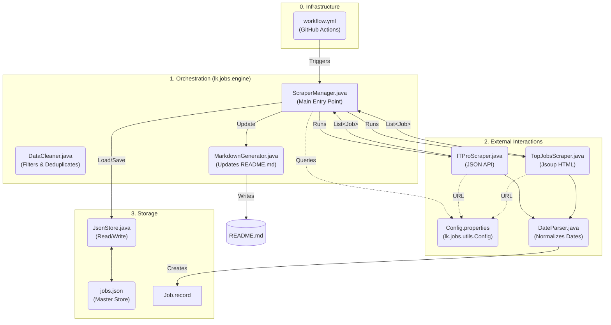

# 🇱🇰 Sri Lanka Software Engineering Jobs | 2026 Tracker [](https://t.me/SL_Software_Jobs)
Looking for software engineering jobs in Sri Lanka? This tracker updates daily with intern, junior, and senior IT roles across Colombo and beyond
Automated Software Engineering Job Tracker for Sri Lanka. Scrapes and categorizes Intern, Associate, and SE roles daily using Java (Jsoup) and GitHub Actions.

> [!TIP]
> **Help keep this project alive!** If this tool helped you find a lead today, please [**Star ⭐ the repo**](https://github.com/Senadeera-NK/sri-lanka-software-jobs). It’s how I measure the impact on our dev community! 🇱🇰

> [!IMPORTANT]
> **Automatic Staleness Purge:** The engine automatically removes listings older than **14 days**, ensuring the feed stays relevant and high-signal.

> **Live Analytics & Daily Software Job Tracker for Sri Lanka**

[📊 View Live Dashboard](https://sri-lanka-software-jobs.vercel.app/)

 
*Click the link above to see real-time trends, seniority distribution, and top hiring companies.*

## 📊 Current Job Openings
> 🟢 **Last Updated:** April 22,6:11 PM (Just now)  | **Total Jobs Found:** 201

### 🎓 Internships & Trainees  (27)

| Title | Company | Level  | Posted | Source |
| :--- | :--- | :--- | :--- | :--- |
| [Full Stack Developer Intern](https://xpress.jobs/jobs/view/279603) | Kapital Group | Intern | 1&nbsp;mins&nbsp;ago | XpressJobs |
| [Software Engineer Intern](https://xpress.jobs/jobs/view/279601) | Kapital Group | Intern | 1&nbsp;mins&nbsp;ago | XpressJobs |
| [Intern - Data Analyst](https://xpress.jobs/jobs/view/277196) | Arpico Supercentre | Intern | 5&nbsp;hours&nbsp;ago | XpressJobs |
| [Software Engineer Intern](https://itpro.lk/job/13570/software-engineer-intern-at-d-help-hub-private-limited/) | D HELP HUB Private Limited | Intern | 7&nbsp;hours&nbsp;ago | ITPro.lk |
| [Intern - Information Security (Technical & GRC)](https://www.topjobs.lk/employer/JobAdvertismentServlet?ac=0000000484&jc=0001488251&ec=0000000651) | Epic Lanka (Pvt) Ltd | Intern | 18&nbsp;hours&nbsp;ago | TopJobs.lk |
| [QA Intern \| Junior QA](https://www.topjobs.lk/employer/JobAdvertismentServlet?ac=DEFZZZ&jc=0001491742&ec=DEFZZZ) | Webappclouds (Pvt) Ltd | Intern | 18&nbsp;hours&nbsp;ago | TopJobs.lk |
| [Intern - Cloud Solutions and Service (1)](https://www.topjobs.lk/employer/JobAdvertismentServlet?ac=0000000049&jc=0001466318&ec=0000000313) | John Keells IT | Intern | 18&nbsp;hours&nbsp;ago | TopJobs.lk |
| [Software Engineer - Intern](https://itpro.lk/job/13563/software-engineer-intern-at-yggranet-technologies/) | Yggranet Technologies | Intern | 2&nbsp;days&nbsp;ago | ITPro.lk |
| [Intern / Trainee Laravel Software Developer (Full Stack)](https://itpro.lk/job/13562/intern-trainee-laravel-software-developer-full-stack-at-inbizsys-private-limited/) | InBizSys (Private) Limited | Intern | 2&nbsp;days&nbsp;ago | ITPro.lk |
| [Software Engineer Intern](https://itpro.lk/job/13211/software-engineer-intern-at-sisenco-digital/) | Sisenco Digital | Intern | 2&nbsp;days&nbsp;ago | ITPro.lk |
| [Web Developer Intern](https://www.topjobs.lk/employer/JobAdvertismentServlet?ac=DEFZZZ&jc=0001490692&ec=DEFZZZ) | Snow Soft Pvt Ltd | Intern | 2&nbsp;days&nbsp;ago | TopJobs.lk |
| [Full Stack Developer Internship (Trainee)](https://itpro.lk/job/13547/full-stack-developer-internship-trainee-at-br-lanka/) | BR Lanka | Intern | 4&nbsp;days&nbsp;ago | ITPro.lk |
| [Software Engineer - Intern - ASP.NET Core](https://itpro.lk/job/13544/software-engineer-intern-aspnet-core-at-d-help-hub-private-limited/) | D HELP HUB Private Limited | Intern | 4&nbsp;days&nbsp;ago | ITPro.lk |
| [QA Engineer Intern](https://itpro.lk/job/13543/qa-engineer-intern-at-qbinom/) | Qbinom | Intern | 4&nbsp;days&nbsp;ago | ITPro.lk |
| [Intern - Software Quality Assurance Engineer (1)](https://www.topjobs.lk/employer/JobAdvertismentServlet?ac=0000000492&jc=0001490062&ec=0000000661) | DirectFN | Intern | 6&nbsp;days&nbsp;ago | TopJobs.lk |
| [Web Developer Intern (WordPress / PHP)](https://itpro.lk/job/13530/web-developer-intern-wordpress-php-at-d-help-hub-private-limited/) | D HELP HUB Private Limited | Intern | 6&nbsp;days&nbsp;ago | ITPro.lk |
| [QA Intern (Manual & Automation Testing) – Fresher](https://rooster.jobs/jobs/516883) | Evalsy Technologies (Pvt) Ltd | Intern | 6&nbsp;days&nbsp;ago | Rooster.jobs |
| [Frontend Developer Intern](https://itpro.lk/job/13299/frontend-developer-intern-at-ranga-technologies-pinegen-ai/) | Ranga Technologies (PineGen AI) | Intern | 8&nbsp;days&nbsp;ago | ITPro.lk |
| [Full Stack Developer Internship](https://itpro.lk/job/13518/full-stack-developer-internship-at-portal-pvt-ltd/) | Portal (PVT) LTD | Intern | 11&nbsp;days&nbsp;ago | ITPro.lk |
| [Quality Assurance Intern](https://itpro.lk/job/13516/quality-assurance-intern-at-nippon-it-and-educational-solution-nites/) | Nippon IT and Educational Solution (NITES) | Intern | 12&nbsp;days&nbsp;ago | ITPro.lk |
| [Full Stack Developer Trainee Internship](https://itpro.lk/job/13514/full-stack-developer-trainee-internship-at-itx-digital-services-pvt-ltd/) | ITX Digital Services (PVT) LTD | Intern | 12&nbsp;days&nbsp;ago | ITPro.lk |
| [Data Scientist Intern - Computer Vision & Analytics](https://www.topjobs.lk/employer/JobAdvertismentServlet?ac=DEFZZZ&jc=0001489177&ec=DEFZZZ) | SpectrifyAI (Pvt) Ltd | Intern | 12&nbsp;days&nbsp;ago | TopJobs.lk |
| [Full Stack Developer Intern](https://www.topjobs.lk/employer/JobAdvertismentServlet?ac=DEFZZZ&jc=0001489028&ec=DEFZZZ) | MedcubeUSA | Intern | 12&nbsp;days&nbsp;ago | TopJobs.lk |
| [Intern - Software Engineer (.Net)](https://www.topjobs.lk/employer/JobAdvertismentServlet?ac=DEFZZZ&jc=0001488860&ec=DEFZZZ) | One Billion Tech (Pvt) Ltd | Intern | 13&nbsp;days&nbsp;ago | TopJobs.lk |
| [Quality Assurance Intern](https://www.topjobs.lk/employer/JobAdvertismentServlet?ac=DEFZZZ&jc=0001488854&ec=DEFZZZ) | One Billion Tech (Pvt) Ltd | Intern | 13&nbsp;days&nbsp;ago | TopJobs.lk |
| [Intern - Software Engineer (React \| Node)](https://www.topjobs.lk/employer/JobAdvertismentServlet?ac=DEFZZZ&jc=0001488849&ec=DEFZZZ) | One Billion Tech (Pvt) Ltd | Intern | 13&nbsp;days&nbsp;ago | TopJobs.lk |
| [Software Developer Intern](https://itpro.lk/job/13481/software-developer-intern-at-glamer-media/) | Glamer Media | Intern | 14&nbsp;days&nbsp;ago | ITPro.lk |

---

### 💻 Associate & Junior/SE Roles  (111)

| Title | Company | Level  | Posted | Source |
| :--- | :--- | :--- | :--- | :--- |
| [Al Engineer](https://xpress.jobs/jobs/view/277273) | Ernst & Young | Junior/SE | 44&nbsp;secs&nbsp;ago | XpressJobs |
| [Devops & IT Infrastucture Engineer \| Nawam Mawatha, Colombo 02](https://xpress.jobs/jobs/view/277317) | Victory Company (Igaming BPO) | Junior/SE | 45&nbsp;secs&nbsp;ago | XpressJobs |
| [Software Architect \| Colombo](https://xpress.jobs/jobs/view/277835) | Mavip Infotech | Junior/SE | 47&nbsp;secs&nbsp;ago | XpressJobs |
| [Information Security Officer](https://xpress.jobs/jobs/view/278060) | Commercial Bank of Ceylon PLC | Junior/SE | 48&nbsp;secs&nbsp;ago | XpressJobs |
| [Associate DevOps Engineer](https://xpress.jobs/jobs/view/274036) | HT Works Pvt Ltd | Associate | 52&nbsp;secs&nbsp;ago | XpressJobs |
| [Applied ML Engineer - Autonomous Drones](https://xpress.jobs/jobs/view/278069) | The Scouts | Junior/SE | 54&nbsp;secs&nbsp;ago | XpressJobs |
| [Enterprise Solution Architect](https://xpress.jobs/jobs/view/278675) | Ernst & Young | Junior/SE | 54&nbsp;secs&nbsp;ago | XpressJobs |
| [Solution Architect](https://xpress.jobs/jobs/view/278795) | RR Donnelley Outsource (Pvt) Ltd​ | Junior/SE | 55&nbsp;secs&nbsp;ago | XpressJobs |
| [Head of AI](https://xpress.jobs/jobs/view/278925) | Omobio | Junior/SE | 56&nbsp;secs&nbsp;ago | XpressJobs |
| [IT Helpdesk Engineer \| Awissawella](https://xpress.jobs/jobs/view/279105) | Micronet Global Services (Pvt) Ltd | Junior/SE | 1&nbsp;mins&nbsp;ago | XpressJobs |
| [Software Engineer](https://xpress.jobs/jobs/view/279104) | The Scouts | Junior/SE | 1&nbsp;mins&nbsp;ago | XpressJobs |
| [Automation Engineer](https://xpress.jobs/jobs/view/279164) | Konnect BPO | Junior/SE | 1&nbsp;mins&nbsp;ago | XpressJobs |
| [Head of Information Security](https://xpress.jobs/jobs/view/279290) | SMB Finance PLC | Junior/SE | 1&nbsp;mins&nbsp;ago | XpressJobs |
| [Database Administrator - Oracle](https://xpress.jobs/jobs/view/279376) | Melsta Technologies (Pvt) Ltd | Junior/SE | 1&nbsp;mins&nbsp;ago | XpressJobs |
| [Walk In Interviews \| Service Desk / Cyber Security](https://xpress.jobs/jobs/view/279145) | HCL Technologies Lanka (Private) Limited | Junior/SE | 1&nbsp;mins&nbsp;ago | XpressJobs |
| [Walk In Interviews \| Graduate Engineer Trainee (Analyst)](https://xpress.jobs/jobs/view/274564) | HCL Technologies Lanka (Private) Limited | Associate | 1&nbsp;mins&nbsp;ago | XpressJobs |
| [Walk In Interviews \| Graduate Engineering Trainee (Fresher)](https://xpress.jobs/jobs/view/274563) | HCL Technologies Lanka (Private) Limited | Associate | 1&nbsp;mins&nbsp;ago | XpressJobs |
| [Walk In Interviews \| Collaboration Tools (Cloud) (Freshers ...](https://xpress.jobs/jobs/view/274545) | HCL Technologies Lanka (Private) Limited | Associate | 1&nbsp;mins&nbsp;ago | XpressJobs |
| [Walk In Interviews \| Cyber Security (Fresher/Trainee)](https://xpress.jobs/jobs/view/274541) | HCL Technologies Lanka (Private) Limited | Associate | 1&nbsp;mins&nbsp;ago | XpressJobs |
| [Walk In Interviews \| Graduate Engineer Analyst - Infrastruc...](https://xpress.jobs/jobs/view/274540) | HCL Technologies Lanka (Private) Limited | Associate | 1&nbsp;mins&nbsp;ago | XpressJobs |
| [Test & Validation (T&V) Engineers](https://xpress.jobs/jobs/view/279653) | Manpower Sri Lanka | Junior/SE | 1&nbsp;mins&nbsp;ago | XpressJobs |
| [Android & Linux Developers](https://xpress.jobs/jobs/view/279655) | Manpower Sri Lanka | Junior/SE | 1&nbsp;mins&nbsp;ago | XpressJobs |
| [Website Developer](https://xpress.jobs/jobs/view/279665) | Union Business Finance | Junior/SE | 1&nbsp;mins&nbsp;ago | XpressJobs |
| [Head of Technology and Enterprise Architect](https://xpress.jobs/jobs/view/279721) | Dialog Axiata PLC | Junior/SE | 1&nbsp;mins&nbsp;ago | XpressJobs |
| [Azure / Dynamics 365 Business Central Administrator](https://xpress.jobs/jobs/view/279712) | Brown and Company PLC | Junior/SE | 1&nbsp;mins&nbsp;ago | XpressJobs |
| [Data Engineer](https://xpress.jobs/jobs/view/279716) | Brown and Company PLC | Junior/SE | 1&nbsp;mins&nbsp;ago | XpressJobs |
| [Full-Stack Web Developer](https://itpro.lk/job/13572/fullstack-web-developer-at-beespoint-pvt-ltd/) | BeesPoint (Pvt) Ltd | Junior/SE | 3&nbsp;hours&nbsp;ago | ITPro.lk |
| [Software Engineer - Mobile (BFSI)](https://rooster.jobs/jobs/516989) | Surge Global | Junior/SE | 10&nbsp;hours&nbsp;ago | Rooster.jobs |
| [Software Engineer - Front End  (BFSI)](https://rooster.jobs/jobs/516987) | Surge Global | Junior/SE | 11&nbsp;hours&nbsp;ago | Rooster.jobs |
| [Software Architect  (BFSI)](https://rooster.jobs/jobs/516981) | Surge Global | Junior/SE | 11&nbsp;hours&nbsp;ago | Rooster.jobs |
| [Data Engineer](https://www.topjobs.lk/employer/JobAdvertismentServlet?ac=DEFZZZ&jc=0001489138&ec=DEFZZZ) | Ateam Software ( Pvt ) Ltd | Junior/SE | 18&nbsp;hours&nbsp;ago | TopJobs.lk |
| [Full Stack Developer - React & .Net](https://www.topjobs.lk/employer/JobAdvertismentServlet?ac=DEFZZZ&jc=0001489136&ec=DEFZZZ) | Ateam Software ( Pvt ) Ltd | Junior/SE | 18&nbsp;hours&nbsp;ago | TopJobs.lk |
| [Cyber Security Analyst](https://www.topjobs.lk/employer/JobAdvertismentServlet?ac=0000000484&jc=0001488883&ec=0000000651) | Epic Lanka (Pvt) Ltd | Junior/SE | 18&nbsp;hours&nbsp;ago | TopJobs.lk |
| [Mid-Level Full Stack & AI Engineer (Laravel / PHP)](https://www.topjobs.lk/employer/JobAdvertismentServlet?ac=DEFZZZ&jc=0001488658&ec=DEFZZZ) | Company Name Withheld | Junior/SE | 18&nbsp;hours&nbsp;ago | TopJobs.lk |
| [AI Engineer](https://www.topjobs.lk/employer/JobAdvertismentServlet?ac=DEFZZZ&jc=0001490764&ec=DEFZZZ) | Accura Tech (Pvt) Ltd | Junior/SE | 18&nbsp;hours&nbsp;ago | TopJobs.lk |
| [Big Data Engineer (1)](https://www.topjobs.lk/employer/JobAdvertismentServlet?ac=0000000271&jc=0001420855&ec=0000000350) | CMS (Pvt) Ltd | Junior/SE | 18&nbsp;hours&nbsp;ago | TopJobs.lk |
| [Full Stack .Net Engineer (1)](https://www.topjobs.lk/employer/JobAdvertismentServlet?ac=0000000271&jc=0001490551&ec=0000000350) | CMS (Pvt) Ltd | Junior/SE | 18&nbsp;hours&nbsp;ago | TopJobs.lk |
| [React Native Developer](https://www.topjobs.lk/employer/JobAdvertismentServlet?ac=DEFZZZ&jc=0001491740&ec=DEFZZZ) | Webappclouds (Pvt) Ltd | Junior/SE | 18&nbsp;hours&nbsp;ago | TopJobs.lk |
| [Lavarel Full Stack Developer](https://www.topjobs.lk/employer/JobAdvertismentServlet?ac=DEFZZZ&jc=0001491734&ec=DEFZZZ) | Webappclouds (Pvt) Ltd | Junior/SE | 18&nbsp;hours&nbsp;ago | TopJobs.lk |
| [Software Engineer -Backend (1)](https://www.topjobs.lk/employer/JobAdvertismentServlet?ac=0000000375&jc=0001492036&ec=0000000492) | Jobfactory | Junior/SE | 18&nbsp;hours&nbsp;ago | TopJobs.lk |
| [Software Engineer -Mobile (1)](https://www.topjobs.lk/employer/JobAdvertismentServlet?ac=0000000375&jc=0001492047&ec=0000000492) | Jobfactory | Junior/SE | 18&nbsp;hours&nbsp;ago | TopJobs.lk |
| [Software Engineer - Frontend (1)](https://www.topjobs.lk/employer/JobAdvertismentServlet?ac=0000000375&jc=0001492048&ec=0000000492) | Jobfactory | Junior/SE | 18&nbsp;hours&nbsp;ago | TopJobs.lk |
| [Electrical Engineer - IT Systems Integration](https://www.topjobs.lk/employer/JobAdvertismentServlet?ac=DEFZZZ&jc=0001492061&ec=DEFZZZ) | WKV Hydro Technics (Pvt) Ltd | Junior/SE | 18&nbsp;hours&nbsp;ago | TopJobs.lk |
| [Backend Developer - Mobile Development (1)](https://www.topjobs.lk/employer/JobAdvertismentServlet?ac=0000000375&jc=0001491935&ec=0000000492) | Jobfactory | Junior/SE | 18&nbsp;hours&nbsp;ago | TopJobs.lk |
| [Low Code Development Specialist (1)](https://www.topjobs.lk/employer/JobAdvertismentServlet?ac=0000000049&jc=0001491908&ec=0000000311) | Ceylon Cold Stores PLC | Junior/SE | 18&nbsp;hours&nbsp;ago | TopJobs.lk |
| [DevOps Engineer (Oracle Cloud \| Web & ERP Systems)](https://www.topjobs.lk/employer/JobAdvertismentServlet?ac=DEFZZZ&jc=0001491856&ec=DEFZZZ) | SAS Creative (Pvt) Ltd | Junior/SE | 18&nbsp;hours&nbsp;ago | TopJobs.lk |
| [.Net Developer](https://xpress.jobs/jobs/view/276706) | Care Analytics and Advisory pvt.ltd. | Junior/SE | 23&nbsp;hours&nbsp;ago | XpressJobs |
| [Software Developer](https://xpress.jobs/jobs/view/279115) | Gestetner of Ceylon PLC | Junior/SE | 23&nbsp;hours&nbsp;ago | XpressJobs |
| [Full Stack Engineer - AI Platform](https://www.topjobs.lk/employer/JobAdvertismentServlet?ac=DEFZZZ&jc=0001491019&ec=DEFZZZ) | Company Name Withheld | Junior/SE | Yesterday | TopJobs.lk |
| [ML \| AI Engineer - Real - Time Vision Systems](https://www.topjobs.lk/employer/JobAdvertismentServlet?ac=DEFZZZ&jc=0001491018&ec=DEFZZZ) | Company Name Withheld | Junior/SE | Yesterday | TopJobs.lk |
| [Computer Vision Engineer - Industrial AI](https://www.topjobs.lk/employer/JobAdvertismentServlet?ac=DEFZZZ&jc=0001491017&ec=DEFZZZ) | Company Name Withheld | Junior/SE | Yesterday | TopJobs.lk |
| [Senior Associate - Data Analytics (Power BI & Microsoft Ecos...](https://www.topjobs.lk/employer/JobAdvertismentServlet?ac=0000000064&jc=0001491267&ec=0000000445) | H Connect International (Pvt) Ltd | Associate | Yesterday | TopJobs.lk |
| [Software Engineer (1)](https://www.topjobs.lk/employer/JobAdvertismentServlet?ac=0000000064&jc=0001491255&ec=0000000603) | Hirdaramani - H CONNECT (PVT) LIMITED | Junior/SE | Yesterday | TopJobs.lk |
| [Web Developer](https://itpro.lk/job/13346/web-developer-at-eplus-business-solutions-pvt-ltd/) | E-Plus Business Solutions - PVT Ltd | Junior/SE | Yesterday | ITPro.lk |
| [Full Stack .NET Engineer](https://itpro.lk/job/13567/full-stack-net-engineer-at-cms-pvt-ltd/) | CMS (Pvt) Ltd | Junior/SE | Yesterday | ITPro.lk |
| [Full Stack Developer (React.js & Supabase)](https://itpro.lk/job/13271/full-stack-developer-reactjs-supabase-at-kd-marketing-group/) | KD Marketing Group | Junior/SE | Yesterday | ITPro.lk |
| [QA Engineer](https://www.topjobs.lk/employer/JobAdvertismentServlet?ac=0000000484&jc=0001488092&ec=0000000651) | Epic Lanka (Pvt) Ltd | Junior/SE | Yesterday | TopJobs.lk |
| [Applied ML Engineer - Autonomous Drones (Skeleton JD)](https://xpress.jobs/jobs/view/278069) | The Scouts | Junior/SE | 2&nbsp;days&nbsp;ago | XpressJobs |
| [Associate Software Engineer/Software Engineer - Business Int...](https://www.topjobs.lk/employer/JobAdvertismentServlet?ac=0000000371&jc=0001487411&ec=0000000486) | Goodhope Asia Holdings Ltd | Associate | 2&nbsp;days&nbsp;ago | TopJobs.lk |
| [Full Stack Engineer (.Net & Angular)](https://www.topjobs.lk/employer/JobAdvertismentServlet?ac=DEFZZZ&jc=0001490865&ec=DEFZZZ) | Medcube USA | Junior/SE | 2&nbsp;days&nbsp;ago | TopJobs.lk |
| [Backend Developer (1)](https://www.topjobs.lk/employer/JobAdvertismentServlet?ac=0000000375&jc=0001490775&ec=0000000492) | Jobfactory | Junior/SE | 2&nbsp;days&nbsp;ago | TopJobs.lk |
| [Junior Software Developer](https://www.topjobs.lk/employer/JobAdvertismentServlet?ac=DEFZZZ&jc=0001490690&ec=DEFZZZ) | Snow Soft Pvt Ltd | Junior/SE | 2&nbsp;days&nbsp;ago | TopJobs.lk |
| [Frontend Developer (React)](https://www.topjobs.lk/employer/JobAdvertismentServlet?ac=DEFZZZ&jc=0001490541&ec=DEFZZZ) | Fortunaglobal (Pvt) Ltd | Junior/SE | 2&nbsp;days&nbsp;ago | TopJobs.lk |
| [Executive - System Engineer (AUS Calendar - AUS Shift) (1)](https://www.topjobs.lk/employer/JobAdvertismentServlet?ac=0000000064&jc=0001490744&ec=0000000445) | H Connect International (Pvt) Ltd | Junior/SE | 2&nbsp;days&nbsp;ago | TopJobs.lk |
| [Quality Assurance Engineer](https://itpro.lk/job/13552/quality-assurance-engineer-at-surecore-pvt-ltd/) | Surecore (Pvt) Ltd | Junior/SE | 2&nbsp;days&nbsp;ago | ITPro.lk |
| [Software Engineer](https://xpress.jobs/jobs/view/275468) | Government Sector | Junior/SE | 3&nbsp;days&nbsp;ago | XpressJobs |
| [Executive Officer - Security](https://xpress.jobs/jobs/view/275449) | Commercial Bank of Ceylon PLC | Junior/SE | 3&nbsp;days&nbsp;ago | XpressJobs |
| [Database Administrator - MSSQL and MySQL (Contract Basis - 3 Years)](https://xpress.jobs/jobs/view/276114) | BOC Management and Support Services (Pvt) Ltd., | Junior/SE | 3&nbsp;days&nbsp;ago | XpressJobs |
| [Full Stack Engineer - Production Systems & Automation](https://www.topjobs.lk/employer/JobAdvertismentServlet?ac=DEFZZZ&jc=0001487318&ec=DEFZZZ) | Exotic Holidays International (Pvt) Limited | Junior/SE | 3&nbsp;days&nbsp;ago | TopJobs.lk |
| [Software Engineers](https://xpress.jobs/jobs/view/278045) | Data Management Systems (Pvt) Ltd | Junior/SE | 4&nbsp;days&nbsp;ago | XpressJobs |
| [Software Engineer (Mobile)](https://www.topjobs.lk/employer/JobAdvertismentServlet?ac=DEFZZZ&jc=0001487288&ec=DEFZZZ) | Ateam Software (Pvt) Ltd | Junior/SE | 4&nbsp;days&nbsp;ago | TopJobs.lk |
| [IT / Full-Stack Developer](https://itpro.lk/job/13536/it-fullstack-developer-at-prime-path-solutions/) | Prime Path Solutions | Junior/SE | 5&nbsp;days&nbsp;ago | ITPro.lk |
| [Document and Quality Controller (Contract Basis - 3 Years)](https://xpress.jobs/jobs/view/276115) | BOC Management and Support Services (Pvt) Ltd., | Junior/SE | 5&nbsp;days&nbsp;ago | XpressJobs |
| [Product Data Specialist](https://www.topjobs.lk/employer/JobAdvertismentServlet?ac=DEFZZZ&jc=0001490099&ec=DEFZZZ) | IPD Colombo (Pvt) Ltd | Junior/SE | 5&nbsp;days&nbsp;ago | TopJobs.lk |
| [Software Engineer (Male)](https://www.topjobs.lk/employer/JobAdvertismentServlet?ac=0000000223&jc=0001490314&ec=0000000266) | Data Management Systems (Pvt) Ltd | Junior/SE | 5&nbsp;days&nbsp;ago | TopJobs.lk |
| [Software Engineer / ABAP Developer](https://xpress.jobs/jobs/view/275169) | Lanka Walltiles PLC | Junior/SE | 6&nbsp;days&nbsp;ago | XpressJobs |
| [Junior Quality Assurance Engineer](https://xpress.jobs/jobs/view/275228) | Davton Limited | Junior/SE | 6&nbsp;days&nbsp;ago | XpressJobs |
| [Web Application QA Executive - Male / Female](https://xpress.jobs/jobs/view/276139) | SAS Creative Ltd | Junior/SE | 6&nbsp;days&nbsp;ago | XpressJobs |
| [AI Engineer](https://www.topjobs.lk/employer/JobAdvertismentServlet?ac=DEFZZZ&jc=0001488718&ec=DEFZZZ) | Ernst & Young | Junior/SE | 6&nbsp;days&nbsp;ago | TopJobs.lk |
| [Data Engineer](https://www.topjobs.lk/employer/JobAdvertismentServlet?ac=DEFZZZ&jc=0001488715&ec=DEFZZZ) | Ernst & Young | Junior/SE | 6&nbsp;days&nbsp;ago | TopJobs.lk |
| [Enterprise Solution Architect](https://www.topjobs.lk/employer/JobAdvertismentServlet?ac=DEFZZZ&jc=0001488702&ec=DEFZZZ) | Ernst & Young | Junior/SE | 6&nbsp;days&nbsp;ago | TopJobs.lk |
| [Shopify Developer](https://www.topjobs.lk/employer/JobAdvertismentServlet?ac=DEFZZZ&jc=0001489694&ec=DEFZZZ) | Asiawise Lanka (Pvt) Ltd | Junior/SE | 6&nbsp;days&nbsp;ago | TopJobs.lk |
| [Full Stack Developer](https://www.topjobs.lk/employer/JobAdvertismentServlet?ac=DEFZZZ&jc=0001489998&ec=DEFZZZ) | ELDU Labs Pvt Ltd | Junior/SE | 6&nbsp;days&nbsp;ago | TopJobs.lk |
| [Senior Associate - Data Analytics (US Calendar - US Shift) (1)](https://www.topjobs.lk/employer/JobAdvertismentServlet?ac=0000000064&jc=0001489908&ec=0000000445) | H Connect International (Pvt) Ltd | Associate | 6&nbsp;days&nbsp;ago | TopJobs.lk |
| [Business Solution Engineer (1)](https://www.topjobs.lk/employer/JobAdvertismentServlet?ac=0000000037&jc=0001490059&ec=0000000037) | HNB Assurance PLC | Junior/SE | 6&nbsp;days&nbsp;ago | TopJobs.lk |
| [QA Associate](https://itpro.lk/job/13531/qa-associate-at-d-help-hub-private-limited/) | D HELP HUB Private Limited | Associate | 6&nbsp;days&nbsp;ago | ITPro.lk |
| [Odoo Developer](https://itpro.lk/job/13529/odoo-developer-at-odexo-technologies-pvt-ltd/) | Odexo Technologies (Pvt) Ltd | Junior/SE | 7&nbsp;days&nbsp;ago | ITPro.lk |
| [Data Engineer](https://xpress.jobs/jobs/view/274764) | Central Finance Company PLC | Junior/SE | 7&nbsp;days&nbsp;ago | XpressJobs |
| [IT Asset Data Analyst \| Malabe](https://xpress.jobs/jobs/view/270272) | Micronet Global Services (Pvt) Ltd | Junior/SE | 7&nbsp;days&nbsp;ago | XpressJobs |
| [Trainee Quality Assurance Engineer](https://itpro.lk/job/13528/trainee-quality-assurance-engineer-at-echonlabs/) | EchonLabs | Associate | 7&nbsp;days&nbsp;ago | ITPro.lk |
| [Software Engineer JAVA (1)](https://www.topjobs.lk/employer/JobAdvertismentServlet?ac=0000000492&jc=0001489633&ec=0000000661) | DirectFN | Junior/SE | 7&nbsp;days&nbsp;ago | TopJobs.lk |
| [Java Software Engineer](https://rooster.jobs/jobs/516868) | Fordona | Junior/SE | 7&nbsp;days&nbsp;ago | Rooster.jobs |
| [Backend Developer Engineer - Golang](https://xpress.jobs/jobs/view/274538) | Brown and Company PLC | Junior/SE | 8&nbsp;days&nbsp;ago | XpressJobs |
| [Grant & AI Specialist (Remote)](https://xpress.jobs/jobs/view/273519) | YalPro | Junior/SE | 9&nbsp;days&nbsp;ago | XpressJobs |
| [Data Analyst](https://xpress.jobs/jobs/view/274055) | Dialog Axiata PLC | Junior/SE | 9&nbsp;days&nbsp;ago | XpressJobs |
| [Data Scientist (1)](https://www.topjobs.lk/employer/JobAdvertismentServlet?ac=0000000343&jc=0001489507&ec=0000000458) | KPMG Executive Search Private Limited | Junior/SE | 9&nbsp;days&nbsp;ago | TopJobs.lk |
| [Software Engineer](https://itpro.lk/job/13515/software-engineer-at-itechro/) | Itechro | Junior/SE | 12&nbsp;days&nbsp;ago | ITPro.lk |
| [Web Developers](https://www.topjobs.lk/employer/JobAdvertismentServlet?ac=DEFZZZ&jc=0001489115&ec=DEFZZZ) | eBEYONDS (Pvt) Ltd | Junior/SE | 12&nbsp;days&nbsp;ago | TopJobs.lk |
| [Associate QA Engineer](https://itpro.lk/job/13508/associate-qa-engineer-at-predictiv-ai/) | Predictiv AI | Associate | 12&nbsp;days&nbsp;ago | ITPro.lk |
| [Junior Web Developer](https://itpro.lk/job/13507/junior-web-developer-at-prime-one-global/) | Prime One Global | Junior/SE | 12&nbsp;days&nbsp;ago | ITPro.lk |
| [Software Quality Engineer - Performance](https://itpro.lk/job/13503/software-quality-engineer-performance-at-vitalhub-innovations-lab/) | VitalHub Innovations Lab | Junior/SE | 13&nbsp;days&nbsp;ago | ITPro.lk |
| [Software Quality Engineer - Test Automation](https://itpro.lk/job/13502/software-quality-engineer-test-automation-at-vitalhub-innovations-lab/) | VitalHub Innovations Lab | Junior/SE | 13&nbsp;days&nbsp;ago | ITPro.lk |
| [QA Engineer – AI Agents & Automation](https://itpro.lk/job/13501/qa-engineer-ai-agents-automation-at-coderra/) | Coderra | Junior/SE | 13&nbsp;days&nbsp;ago | ITPro.lk |
| [JIRA Cloud Administrator (1)](https://www.topjobs.lk/employer/JobAdvertismentServlet?ac=0000000049&jc=0001488751&ec=0000000313) | John Keells IT | Junior/SE | 13&nbsp;days&nbsp;ago | TopJobs.lk |
| [Data & AI Solutions Engineer (1)](https://www.topjobs.lk/employer/JobAdvertismentServlet?ac=0000000049&jc=0001488659&ec=0000000311) | Ceylon Cold Stores PLC | Junior/SE | 13&nbsp;days&nbsp;ago | TopJobs.lk |
| [Full Stack Web Developer (Backend-Focused)](https://www.topjobs.lk/employer/JobAdvertismentServlet?ac=0000000501&jc=0001488588&ec=0000000681) | Oscar Wylee | Junior/SE | 13&nbsp;days&nbsp;ago | TopJobs.lk |
| [Software Engineer](https://itpro.lk/job/13496/software-engineer-at-ceycert/) | Ceycert | Junior/SE | 13&nbsp;days&nbsp;ago | ITPro.lk |
| [Backend JavaScript Developer (Node.js / NestJS)](https://rooster.jobs/jobs/516774) | mobelo | Junior/SE | 13&nbsp;days&nbsp;ago | Rooster.jobs |
| [Database Administrator (MSSQL and MySQL)](https://www.topjobs.lk/employer/JobAdvertismentServlet?ac=DEFZZZ&jc=0001488185&ec=DEFZZZ) | BOC IT Solutions (Pvt) Ltd | Junior/SE | 14&nbsp;days&nbsp;ago | TopJobs.lk |
| [Software Engineer (1)](https://www.topjobs.lk/employer/JobAdvertismentServlet?ac=0000000379&jc=0001488176&ec=0000000497) | Ceyline Group | Junior/SE | 14&nbsp;days&nbsp;ago | TopJobs.lk |
| [Associate Software Engineer – React, Spring Boot](https://itpro.lk/job/13484/associate-software-engineer-react-spring-boot-at-silverline-it/) | Silverline IT | Associate | 14&nbsp;days&nbsp;ago | ITPro.lk |

---

### 🚀 Senior & Lead Roles  (63)

| Title | Company | Level  | Posted | Source |
| :--- | :--- | :--- | :--- | :--- |
| [Senior Automation Engineer (Python Focus)](https://xpress.jobs/jobs/view/277248) | Innobot | Senior | 40&nbsp;secs&nbsp;ago | XpressJobs |
| [Lead Automation Engineer (Python Focus)](https://xpress.jobs/jobs/view/277249) | Innobot | Senior | 44&nbsp;secs&nbsp;ago | XpressJobs |
| [Senior Software Engineer (Python)](https://xpress.jobs/jobs/view/277386) | Innobot | Senior | 45&nbsp;secs&nbsp;ago | XpressJobs |
| [Senior Engineer - IT Security (Red Team Operations)](https://xpress.jobs/jobs/view/278034) | Commercial Bank of Ceylon PLC | Senior | 47&nbsp;secs&nbsp;ago | XpressJobs |
| [Senior Software Engineer](https://xpress.jobs/jobs/view/274015) | HT Works Pvt Ltd | Senior | 53&nbsp;secs&nbsp;ago | XpressJobs |
| [Lead Software Engineer](https://xpress.jobs/jobs/view/275950) | SINGER (Sri Lanka) PLC | Senior | 56&nbsp;secs&nbsp;ago | XpressJobs |
| [Senior Full Stack Engineer \| Colombo](https://xpress.jobs/jobs/view/278651) | TGT Global | Senior | 1&nbsp;mins&nbsp;ago | XpressJobs |
| [Lead Mobile App Developer](https://xpress.jobs/jobs/view/279194) | Gluon Force (PVT) Ltd | Senior | 1&nbsp;mins&nbsp;ago | XpressJobs |
| [Technical Lead -  Full Stack (NextJS & NestJS)](https://xpress.jobs/jobs/view/279562) | EFutures | Senior | 1&nbsp;mins&nbsp;ago | XpressJobs |
| [Senior Software Engineers](https://xpress.jobs/jobs/view/279657) | Manpower Sri Lanka | Senior | 1&nbsp;mins&nbsp;ago | XpressJobs |
| [iOS Developers (Colombo, Sri Lanka)](https://xpress.jobs/jobs/view/279658) | Manpower Sri Lanka | Senior | 1&nbsp;mins&nbsp;ago | XpressJobs |
| [Senior Software Engineer : Ruby on Rails](https://xpress.jobs/jobs/view/277058) | OXO Tech (Pvt) Ltd | Senior | 5&nbsp;hours&nbsp;ago | XpressJobs |
| [Senior Java Architect \| Colombo](https://xpress.jobs/jobs/view/277133) | YI CAN PTE. LTD. | Senior | 5&nbsp;hours&nbsp;ago | XpressJobs |
| [Senior Developer (Full Time) \| Work From Home](https://xpress.jobs/jobs/view/272321) | LocalCom Pty. Ltd | Senior | 5&nbsp;hours&nbsp;ago | XpressJobs |
| [Senior Software Engineer - Front End (BFSI)  ](https://rooster.jobs/jobs/516986) | Surge Global | Senior | 11&nbsp;hours&nbsp;ago | Rooster.jobs |
| [Senior Software Engineer - Back End (BFSI)](https://rooster.jobs/jobs/516985) | Surge Global | Senior | 11&nbsp;hours&nbsp;ago | Rooster.jobs |
| [Senior Engineer - IT Security (Red Team Operations)](https://www.topjobs.lk/employer/JobAdvertismentServlet?ac=DEFZZZ&jc=0001490271&ec=DEFZZZ) | Commercial Bank of Ceylon PLC | Senior | 18&nbsp;hours&nbsp;ago | TopJobs.lk |
| [Oracle Cloud Database - Senior Engineer \| Tech Lead](https://www.topjobs.lk/employer/JobAdvertismentServlet?ac=DEFZZZ&jc=0001491203&ec=DEFZZZ) | Twixia Tech | Senior | 18&nbsp;hours&nbsp;ago | TopJobs.lk |
| [Oracle Workflow & BPM - Senior Developer \| Lead](https://www.topjobs.lk/employer/JobAdvertismentServlet?ac=DEFZZZ&jc=0001491201&ec=DEFZZZ) | Twixia Tech | Senior | 18&nbsp;hours&nbsp;ago | TopJobs.lk |
| [Oracle APEX \| VBCS - Senior Developer \| Lead](https://www.topjobs.lk/employer/JobAdvertismentServlet?ac=DEFZZZ&jc=0001491194&ec=DEFZZZ) | Twixia Tech | Senior | 18&nbsp;hours&nbsp;ago | TopJobs.lk |
| [Senior SQL Developer (1)](https://www.topjobs.lk/employer/JobAdvertismentServlet?ac=0000000271&jc=0001421034&ec=0000000350) | CMS (Pvt) Ltd | Senior | 18&nbsp;hours&nbsp;ago | TopJobs.lk |
| [Immediate Mobile App Developers Vacancies (IOS & Android) in...](https://www.topjobs.lk/employer/JobAdvertismentServlet?ac=DEFZZZ&jc=0001491902&ec=DEFZZZ) | Manpower Sri Lanka | Senior | 18&nbsp;hours&nbsp;ago | TopJobs.lk |
| [Senior Next.js Frontend Engineer (Vercel)](https://xpress.jobs/jobs/view/276370) | Innotic Pvt Ltd | Senior | 23&nbsp;hours&nbsp;ago | XpressJobs |
| [Senior Python Developer \| Remote](https://xpress.jobs/jobs/view/276421) | BlueOceanSP | Senior | 23&nbsp;hours&nbsp;ago | XpressJobs |
| [Senior Ruby on Rails Developer](https://xpress.jobs/jobs/view/276489) | Archipelago | Senior | 23&nbsp;hours&nbsp;ago | XpressJobs |
| [Senior Go (Golang) Developer](https://xpress.jobs/jobs/view/276490) | Archipelago | Senior | 23&nbsp;hours&nbsp;ago | XpressJobs |
| [Senior Software Developer](https://xpress.jobs/jobs/view/276900) | Wizlearn Technologies Pte Ltd | Senior | 23&nbsp;hours&nbsp;ago | XpressJobs |
| [Senior Software Engineers](https://xpress.jobs/jobs/view/276137) | Central Finance Company PLC | Senior | Yesterday | XpressJobs |
| [Tech Lead – AI & Platform Engineering \| Hybrid](https://xpress.jobs/jobs/view/276319) | Coderra | Senior | Yesterday | XpressJobs |
| [Senior Software Engineer (1)](https://www.topjobs.lk/employer/JobAdvertismentServlet?ac=0000000064&jc=0001491257&ec=0000000603) | Hirdaramani - H CONNECT (PVT) LIMITED | Senior | Yesterday | TopJobs.lk |
| [Tech Lead Java (1)](https://www.topjobs.lk/employer/JobAdvertismentServlet?ac=0000000492&jc=0001491233&ec=0000000661) | DirectFN | Senior | Yesterday | TopJobs.lk |
| [Progress OpenEdge Senior Developer](https://www.topjobs.lk/employer/JobAdvertismentServlet?ac=DEFZZZ&jc=0001491217&ec=DEFZZZ) | CSG Technologies | Senior | Yesterday | TopJobs.lk |
| [Executive / Senior Executive - Data Analytics](https://xpress.jobs/jobs/view/276003) | Universal Outsourcing & Consultancy (Pvt) Ltd | Senior | 2&nbsp;days&nbsp;ago | XpressJobs |
| [Senior Software Engineer - Backend](https://www.topjobs.lk/employer/JobAdvertismentServlet?ac=DEFZZZ&jc=0001490748&ec=DEFZZZ) | Zeusgen (Pvt) Ltd | Senior | 2&nbsp;days&nbsp;ago | TopJobs.lk |
| [Senior Cloud & Infrastructure Engineer (Microsoft & Azure)](https://www.topjobs.lk/employer/JobAdvertismentServlet?ac=DEFZZZ&jc=0001490572&ec=DEFZZZ) | Gardner Smith Information Technology (Pvt) Ltd | Senior | 2&nbsp;days&nbsp;ago | TopJobs.lk |
| [Senior iOS Developer (Banking Applications)](https://www.topjobs.lk/employer/JobAdvertismentServlet?ac=DEFZZZ&jc=0001490546&ec=DEFZZZ) | Fortunaglobal (Pvt) Limited | Senior | 2&nbsp;days&nbsp;ago | TopJobs.lk |
| [Senior Android Developer (Banking Applications)](https://www.topjobs.lk/employer/JobAdvertismentServlet?ac=DEFZZZ&jc=0001490543&ec=DEFZZZ) | Fortunaglobal (Pvt) Limited | Senior | 2&nbsp;days&nbsp;ago | TopJobs.lk |
| [Senior Infrastructure & Cloud Solution Architect](https://www.topjobs.lk/employer/JobAdvertismentServlet?ac=DEFZZZ&jc=0001490497&ec=DEFZZZ) | SFL Tech | Senior | 2&nbsp;days&nbsp;ago | TopJobs.lk |
| [Senior Software Engineer](https://itpro.lk/job/13553/senior-software-engineer-at-surecore-pvt-ltd/) | Surecore (Pvt) Ltd | Senior | 2&nbsp;days&nbsp;ago | ITPro.lk |
| [Senior Software Quality Engineer - Test Automation](https://www.topjobs.lk/employer/JobAdvertismentServlet?ac=DEFZZZ&jc=0001487474&ec=DEFZZZ) | VitalHub Innovations Lab | Senior | 2&nbsp;days&nbsp;ago | TopJobs.lk |
| [Senior Lecturer - Grade II / Lecturer / Lecturer (Probationa...](https://xpress.jobs/jobs/view/275801) | Sri Lanka Technology Campus | SLTC | Senior | 3&nbsp;days&nbsp;ago | XpressJobs |
| [Senior Lecturer - Grade II / Lecturer / Lecturer (Probationa...](https://xpress.jobs/jobs/view/275802) | Sri Lanka Technology Campus | SLTC | Senior | 3&nbsp;days&nbsp;ago | XpressJobs |
| [Senior Lecturer - Grade II / Lecturer / Lecturer (Probationa...](https://xpress.jobs/jobs/view/275803) | Sri Lanka Technology Campus | SLTC | Senior | 3&nbsp;days&nbsp;ago | XpressJobs |
| [Senior Lecturer - Grade II / Lecturer / Lecturer (Probationa...](https://xpress.jobs/jobs/view/275804) | Sri Lanka Technology Campus | SLTC | Senior | 3&nbsp;days&nbsp;ago | XpressJobs |
| [Technical Lead - Full Stack AI, NOIDA](https://rooster.jobs/jobs/516905) | AALUCKS Talent Pro | Senior | 5&nbsp;days&nbsp;ago | Rooster.jobs |
| [Senior SQL and SSRS Developer](https://xpress.jobs/jobs/view/275254) | KriyaGo | Senior | 6&nbsp;days&nbsp;ago | XpressJobs |
| [Senior Software Engineer JAVA (4)](https://www.topjobs.lk/employer/JobAdvertismentServlet?ac=0000000492&jc=0001490061&ec=0000000661) | DirectFN | Senior | 6&nbsp;days&nbsp;ago | TopJobs.lk |
| [Senior Quality Assurance Engineer](https://xpress.jobs/jobs/view/274531) | Brown and Company PLC | Senior | 7&nbsp;days&nbsp;ago | XpressJobs |
| [Senior Laravel Developer](https://xpress.jobs/jobs/view/276488) | Archipelago | Senior | 7&nbsp;days&nbsp;ago | XpressJobs |
| [Senior Quality Assurance Engineer (1)](https://www.topjobs.lk/employer/JobAdvertismentServlet?ac=0000000492&jc=0001489636&ec=0000000661) | DirectFN | Senior | 7&nbsp;days&nbsp;ago | TopJobs.lk |
| [Senior Database Administrator (1)](https://www.topjobs.lk/employer/JobAdvertismentServlet?ac=0000000492&jc=0001489638&ec=0000000661) | DirectFN | Senior | 7&nbsp;days&nbsp;ago | TopJobs.lk |
| [Senior Software Engineer - Spring Boot (1)](https://www.topjobs.lk/employer/JobAdvertismentServlet?ac=0000000492&jc=0001489639&ec=0000000661) | DirectFN | Senior | 7&nbsp;days&nbsp;ago | TopJobs.lk |
| [Senior Front end Developer (1)](https://www.topjobs.lk/employer/JobAdvertismentServlet?ac=0000000492&jc=0001489641&ec=0000000661) | DirectFN | Senior | 7&nbsp;days&nbsp;ago | TopJobs.lk |
| [Senior Systems Engineer (1)](https://www.topjobs.lk/employer/JobAdvertismentServlet?ac=0000000492&jc=0001489640&ec=0000000661) | DirectFN | Senior | 7&nbsp;days&nbsp;ago | TopJobs.lk |
| [Senior Python Developer](https://www.topjobs.lk/employer/JobAdvertismentServlet?ac=DEFZZZ&jc=0001488982&ec=DEFZZZ) | SubFactor Ltd | Senior | 12&nbsp;days&nbsp;ago | TopJobs.lk |
| [Senior Backend Engineer](https://itpro.lk/job/13511/senior-backend-engineer-at-silverline-it/) | Silverline IT | Senior | 12&nbsp;days&nbsp;ago | ITPro.lk |
| [Senior Software Engineer](https://www.topjobs.lk/employer/JobAdvertismentServlet?ac=DEFZZZ&jc=0001488762&ec=DEFZZZ) | Torch Labs Software LLC | Senior | 13&nbsp;days&nbsp;ago | TopJobs.lk |
| [Senior Software Engineer (.NET / C#)](https://itpro.lk/job/13491/senior-software-engineer-net-c-at-bistec-global/) | BISTEC Global | Senior | 13&nbsp;days&nbsp;ago | ITPro.lk |
| [Senior Back End Developer Shopify](https://itpro.lk/job/13489/senior-back-end-developer-shopify-at-i4t-labs/) | I4t Labs | Senior | 14&nbsp;days&nbsp;ago | ITPro.lk |
| [Senior Frontend Developer (Shopify & WordPress)](https://www.topjobs.lk/employer/JobAdvertismentServlet?ac=DEFZZZ&jc=0001488480&ec=DEFZZZ) | Star Garments Group (Pvt) Ltd | Senior | 14&nbsp;days&nbsp;ago | TopJobs.lk |
| [Senior Mobile App Developer (React Native)](https://www.topjobs.lk/employer/JobAdvertismentServlet?ac=DEFZZZ&jc=0001488328&ec=DEFZZZ) | FineXa Tech (Pvt) Ltd | Senior | 14&nbsp;days&nbsp;ago | TopJobs.lk |
| [Senior Java Full Stack Developer](https://www.topjobs.lk/employer/JobAdvertismentServlet?ac=DEFZZZ&jc=0001488323&ec=DEFZZZ) | FineXa Tech (Pvt) Ltd | Senior | 14&nbsp;days&nbsp;ago | TopJobs.lk |
| [Senior QA Automation Engineer](https://itpro.lk/job/13479/senior-qa-automation-engineer-at-itechro/) | Itechro | Senior | 14&nbsp;days&nbsp;ago | ITPro.lk |

---


## 🛠️ How it Works
1. **Engine:** A Java 21 console application using **Jsoup**.
2. **Sources:** Currently scraping `ITPro.lk` and  `TopJobs`. Support for and `Rooster.jobs` is under development (Contributors welcome!)
3. **Automation:** Runs every 12 hours via **GitHub Actions**.
4. **Storage:** Updates this `README.md` and a `jobs.json` file automatically.

<details>
<summary><b>📐 View High-Level Architecture Diagram</b></summary>
    

```mermaid
graph TD
    %% Main Orchestration Class
    subgraph Engine ["1. Orchestration (lk.jobs.engine)"]
        ScraperManager["ScraperManager.java<br/>(Main Entry Point)"]
        Cleaner("DataCleaner.java<br/>(Filters & Deduplicates)")
        Markdown("MarkdownGenerator.java<br/>(Updates README.md)")
    end

    %% External Interactions / Data Sources
    subgraph Scrapers ["2. External Interactions"]
        Config("Config.properties<br/>(lk.jobs.utils.Config)")
        ITPro("ITProScraper.java<br/>(JSON API)")
        TopJobs("TopJobsScraper.java<br/>(Jsoup HTML)")
        DParser("DateParser.java<br/>(Normalizes Dates)")
    end

    %% Data Flow & Persistence
    subgraph Storage ["3. Storage"]
        Json("jobs.json<br/>(Master Store)")
        JsonStore("JsonStore.java<br/>(Read/Write)")
        JobModel["Job.record"]
    end

    %% Workflow Orchestration
    subgraph Infrastructure ["0. Infrastructure"]
        WF("workflow.yml<br/>(GitHub Actions)")
    end

    %% Connective Flow
    WF -- "Triggers" --> ScraperManager
    ScraperManager -. "Queries" .-> Config
    ITPro -. "URL" .-> Config
    TopJobs -. "URL" .-> Config
    
    ScraperManager -- "Runs" --> ITPro
    ScraperManager -- "Runs" --> TopJobs
    
    ITPro --> DParser
    TopJobs --> DParser
    DParser -- "Creates" --> JobModel
    
    ITPro -- "List&lt;Job&gt;" --> ScraperManager
    TopJobs -- "List&lt;Job&gt;" --> ScraperManager

    ScraperManager -- "Load/Save" --> JsonStore
    JsonStore <--> Json
    
    ScraperManager -- "Update" --> Markdown
    Markdown -- "Writes" --> README[(README.md)]
```

</details>

<details>
<summary><b>📂 View Project Structure</b></summary>

```text
src/main/java/lk/jobs/
├── engine/           # Logic for sorting, cleaning, and README updates
├── model/            # Data models (Job Record)
├── scrapers/         # Individual site scrapers
└── utils/            # JSON and Date parsing utilities
```
</details>

## 🚀 Usage
If you want to run the scraper locally:
1. Clone the repo.
2. Ensure you have **JDK 21** and **Maven** installed.
3. Run: mvn clean compile exec:java -Dexec.mainClass="lk.jobs.engine.ScraperManager"

## 🤝 Contributing
Contributions are what make the open-source community such an amazing place to learn, inspire, and create.
Any contributions you make are **greatly appreciated**.

* **Found a bug?** Open an [Issue](https://github.com/Senadeera-NK/sl-software-engineering-jobs/issues).
* **Want to add a new site?** Check out our [Contributing Guidelines](CONTRIBUTING.md) to see how to implement a new scraper.
* **Missing a job?** Feel free to submit a Pull Request to manually update the table!
