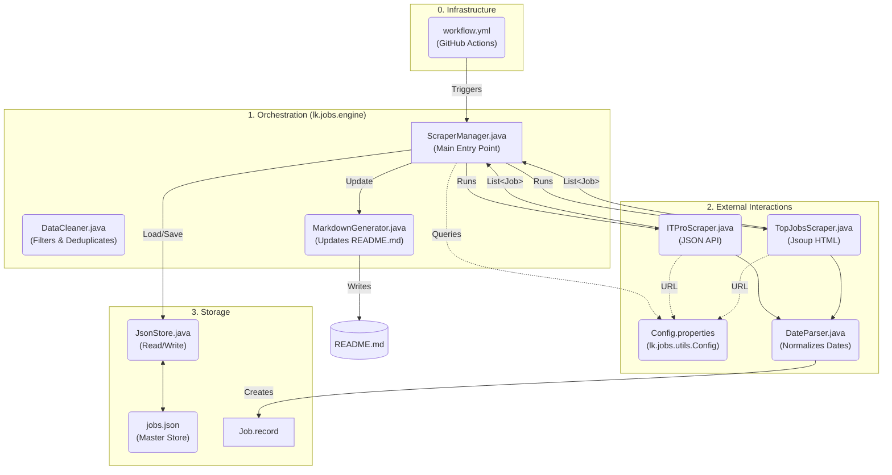

# 🇱🇰 Sri Lanka Software Engineering Jobs | 2026 Tracker [](https://t.me/SL_Software_Jobs)
Looking for software engineering jobs in Sri Lanka? This tracker updates daily with intern, junior, and senior IT roles across Colombo and beyond
Automated Software Engineering Job Tracker for Sri Lanka. Scrapes and categorizes Intern, Associate, and SE roles daily using Java (Jsoup) and GitHub Actions.

> [!TIP]
> **Help keep this project alive!** If this tool helped you find a lead today, please [**Star ⭐ the repo**](https://github.com/Senadeera-NK/sri-lanka-software-jobs). It’s how I measure the impact on our dev community! 🇱🇰

> [!IMPORTANT]
> **Automatic Staleness Purge:** The engine automatically removes listings older than **14 days**, ensuring the feed stays relevant and high-signal.

## 📊 Current Job Openings
> 🟢 **Last Updated:** April 8,9:09 PM (Just now)  | **Total Jobs Found:** 150

### 🎓 Internships & Trainees  (23)

| Title | Company | Level  | Posted | Source |
| :--- | :--- | :--- | :--- | :--- |
| [Software Developer Intern](https://itpro.lk/job/13481/software-developer-intern-at-glamer-media/) | Glamer Media | Intern | 11&nbsp;hours&nbsp;ago | ITPro.lk |
| [Intern - Information Security (Technical & GRC)](https://www.topjobs.lk/employer/JobAdvertismentServlet?ac=0000000484&jc=0001488251&ec=0000000651) | Epic Lanka (Pvt) Ltd | Intern | 21&nbsp;hours&nbsp;ago | TopJobs.lk |
| [Senior Java Full - Stack Developer (Financial Internet Banking)](https://www.topjobs.lk/employer/JobAdvertismentServlet?ac=DEFZZZ&jc=0001488071&ec=DEFZZZ) | Fortunaglobal (Pvt) Limited | Intern | Yesterday | TopJobs.lk |
| [Software Engineer - Intern](https://itpro.lk/job/13447/software-engineer-intern-at-d-help-hub-private-limited/) | D HELP HUB Private Limited | Intern | 2&nbsp;days&nbsp;ago | ITPro.lk |
| [Software Engineer - Intern](https://itpro.lk/job/13444/software-engineer-intern-at-neoxora/) | Neoxora | Intern | 4&nbsp;days&nbsp;ago | ITPro.lk |
| [Full Stack Software Engineer – Intern](https://itpro.lk/job/13443/full-stack-software-engineer-intern-at-qbinom/) | Qbinom | Intern | 4&nbsp;days&nbsp;ago | ITPro.lk |
| [Intern QA Engineer (Paid)](https://itpro.lk/job/13422/intern-qa-engineer-paid-at-nippon-it-and-educational-solution-nites/) | Nippon IT and Educational Solution (NITES) | Intern | 5&nbsp;days&nbsp;ago | ITPro.lk |
| [Intern Software Engineer](https://itpro.lk/job/13420/intern-software-engineer-at-vornex-labs/) | Vornex Labs | Intern | 6&nbsp;days&nbsp;ago | ITPro.lk |
| [Intern - Software Engineering (Web \| Mobile)](https://www.topjobs.lk/employer/JobAdvertismentServlet?ac=DEFZZZ&jc=0001486175&ec=DEFZZZ) | Cloud Books (Pvt) Ltd | Intern | 6&nbsp;days&nbsp;ago | TopJobs.lk |
| [Full-Stack Software Engineer Intern (Paid)](https://itpro.lk/job/13409/fullstack-software-engineer-intern-paid-at-nippon-it-and-educational-solution-nites/) | Nippon IT and Educational Solution (NITES) | Intern | 7&nbsp;days&nbsp;ago | ITPro.lk |
| [Intern QA Engineer](https://itpro.lk/job/12974/intern-qa-engineer-at-onsys-technologies/) | Onsys Technologies | Intern | 8&nbsp;days&nbsp;ago | ITPro.lk |
| [Intern -  Data Science & Analytics (1)](https://www.topjobs.lk/employer/JobAdvertismentServlet?ac=0000000094&jc=0001485255&ec=0000000111) | MAS Holdings | Intern | 9&nbsp;days&nbsp;ago | TopJobs.lk |
| [Full Stack Developer Intern](https://itpro.lk/job/13388/full-stack-developer-intern-at-nuwali-digital-solutions/) | Nuwali Digital Solutions | Intern | 10&nbsp;days&nbsp;ago | ITPro.lk |
| [Intern - Data Analytics (1)](https://www.topjobs.lk/employer/JobAdvertismentServlet?ac=0000000049&jc=0001485056&ec=0000000312) | JKH Property Group | Intern | 10&nbsp;days&nbsp;ago | TopJobs.lk |
| [Software Engineer - Intern - Remote](https://itpro.lk/job/13379/software-engineer-intern-remote-at-d-help-hub-private-limited/) | D HELP HUB Private Limited | Intern | 10&nbsp;days&nbsp;ago | ITPro.lk |
| [Internship - Software Quality Assurance](https://www.topjobs.lk/employer/JobAdvertismentServlet?ac=DEFZZZ&jc=0001484518&ec=DEFZZZ) | Ceylinco Life Insurance Limited | Intern | 12&nbsp;days&nbsp;ago | TopJobs.lk |
| [Internship - IT Department (Full - Stack Developer)](https://www.topjobs.lk/employer/JobAdvertismentServlet?ac=DEFZZZ&jc=0001484508&ec=DEFZZZ) | Ceylinco Life Insurance Limited | Intern | 12&nbsp;days&nbsp;ago | TopJobs.lk |
| [WordPress Web Developer Intern/Undergraduates](https://itpro.lk/job/12628/wordpress-web-developer-internundergraduates-at-loopz-global-pvt-ltd/) | Loopz Global (Pvt) Ltd | Intern | 13&nbsp;days&nbsp;ago | ITPro.lk |
| [Intern - Software Engineer (React \| Node)](https://www.topjobs.lk/employer/JobAdvertismentServlet?ac=DEFZZZ&jc=0001483783&ec=DEFZZZ) | One Billion Tech (Pvt) Ltd | Intern | 14&nbsp;days&nbsp;ago | TopJobs.lk |
| [Quality Assurance Intern](https://www.topjobs.lk/employer/JobAdvertismentServlet?ac=DEFZZZ&jc=0001483774&ec=DEFZZZ) | One Billion Tech (Pvt) Ltd | Intern | 14&nbsp;days&nbsp;ago | TopJobs.lk |
| [Intern - Software Engineer (.NET)](https://www.topjobs.lk/employer/JobAdvertismentServlet?ac=DEFZZZ&jc=0001483767&ec=DEFZZZ) | One Billion Tech (Pvt) Ltd | Intern | 14&nbsp;days&nbsp;ago | TopJobs.lk |
| [Intern Software Engineer (1)](https://www.topjobs.lk/employer/JobAdvertismentServlet?ac=0000000280&jc=0001483633&ec=0000000367) | Expolanka Holdings Limited | Intern | 14&nbsp;days&nbsp;ago | TopJobs.lk |
| [Intern QA Engineer (1)](https://www.topjobs.lk/employer/JobAdvertismentServlet?ac=0000000280&jc=0001483627&ec=0000000367) | Expolanka Holdings Limited | Intern | 14&nbsp;days&nbsp;ago | TopJobs.lk |

---

### 💻 Associate & Junior/SE Roles  (87)

| Title | Company | Level  | Posted | Source |
| :--- | :--- | :--- | :--- | :--- |
| [Data Analyst](https://xpress.jobs/jobs/view/274055) | Dialog Axiata PLC | Junior/SE | 5&nbsp;hours&nbsp;ago | XpressJobs |
| [Associate Software Engineer – React, Spring Boot](https://itpro.lk/job/13484/associate-software-engineer-react-spring-boot-at-silverline-it/) | Silverline IT | Associate | 10&nbsp;hours&nbsp;ago | ITPro.lk |
| [Software Engineer (Mobile)](https://www.topjobs.lk/employer/JobAdvertismentServlet?ac=DEFZZZ&jc=0001487288&ec=DEFZZZ) | Ateam Software (Pvt) Ltd | Junior/SE | 21&nbsp;hours&nbsp;ago | TopJobs.lk |
| [QA Engineer](https://www.topjobs.lk/employer/JobAdvertismentServlet?ac=0000000484&jc=0001488092&ec=0000000651) | Epic Lanka (Pvt) Ltd | Junior/SE | 21&nbsp;hours&nbsp;ago | TopJobs.lk |
| [Database Administrator (MSSQL and MySQL)](https://www.topjobs.lk/employer/JobAdvertismentServlet?ac=DEFZZZ&jc=0001488185&ec=DEFZZZ) | BOC IT Solutions (Pvt) Ltd | Junior/SE | 21&nbsp;hours&nbsp;ago | TopJobs.lk |
| [Software Engineer (1)](https://www.topjobs.lk/employer/JobAdvertismentServlet?ac=0000000379&jc=0001488176&ec=0000000497) | Ceyline Group | Junior/SE | 21&nbsp;hours&nbsp;ago | TopJobs.lk |
| [Big Data Engineer (1)](https://www.topjobs.lk/employer/JobAdvertismentServlet?ac=0000000271&jc=0001420855&ec=0000000350) | CMS (Pvt) Ltd | Junior/SE | 21&nbsp;hours&nbsp;ago | TopJobs.lk |
| [Web Developers](https://itpro.lk/job/13469/web-developers-at-ebeyonds-pvt-ltd/) | Ebeyonds (Pvt) Ltd | Junior/SE | Yesterday | ITPro.lk |
| [ASE\|SE (Automation)](https://www.topjobs.lk/employer/JobAdvertismentServlet?ac=DEFZZZ&jc=0001486513&ec=DEFZZZ) | Effectz.AI | Junior/SE | Yesterday | TopJobs.lk |
| [Software QA Full Stack Developer](https://www.topjobs.lk/employer/JobAdvertismentServlet?ac=DEFZZZ&jc=0001487829&ec=DEFZZZ) | Concord Apparel (Private) Limited | Junior/SE | Yesterday | TopJobs.lk |
| [Software Engineer JAVA (1)](https://www.topjobs.lk/employer/JobAdvertismentServlet?ac=0000000492&jc=0001487823&ec=0000000661) | DirectFN | Junior/SE | Yesterday | TopJobs.lk |
| [Software Engineer (Male)](https://www.topjobs.lk/employer/JobAdvertismentServlet?ac=0000000223&jc=0001487931&ec=0000000266) | Data Management Systems (Pvt) Ltd | Junior/SE | Yesterday | TopJobs.lk |
| [Systems & SaaS Automation Specialist (Remote - Full Time)](https://www.topjobs.lk/employer/JobAdvertismentServlet?ac=DEFZZZ&jc=0001487996&ec=DEFZZZ) | Vopaq Consulting | Junior/SE | Yesterday | TopJobs.lk |
| [Data Engineer (1)](https://www.topjobs.lk/employer/JobAdvertismentServlet?ac=0000000221&jc=0001488049&ec=0000000264) | Browns Group Of Companies | Junior/SE | Yesterday | TopJobs.lk |
| [Web Developer](https://itpro.lk/job/13459/web-developer-at-tecoora/) | Tecoora | Junior/SE | Yesterday | ITPro.lk |
| [Quality Assurance Engineer](https://itpro.lk/job/13369/quality-assurance-engineer-at-pacifickode/) | PacificKode | Junior/SE | Yesterday | ITPro.lk |
| [Full Stack Developer (React \| .Net)](https://www.topjobs.lk/employer/JobAdvertismentServlet?ac=DEFZZZ&jc=0001483460&ec=DEFZZZ) | Ateam Software Pvt Ltd | Junior/SE | Yesterday | TopJobs.lk |
| [Junior Web Developer - eCommerce (Wordpress/Woocommerce & Shopify)](https://itpro.lk/job/13453/junior-web-developer-ecommerce-wordpresswoocommerce-shopify-at-buildastore/) | BuildaStore | Junior/SE | 2&nbsp;days&nbsp;ago | ITPro.lk |
| [Associate Quality Assurance Engineer](https://itpro.lk/job/13452/associate-quality-assurance-engineer-at-konekt/) | Konekt | Associate | 2&nbsp;days&nbsp;ago | ITPro.lk |
| [Associate Software Engineer/Software Engineer - Business Int...](https://www.topjobs.lk/employer/JobAdvertismentServlet?ac=0000000371&jc=0001487411&ec=0000000486) | Goodhope Asia Holdings Ltd | Associate | 2&nbsp;days&nbsp;ago | TopJobs.lk |
| [Software Engineer](https://www.topjobs.lk/employer/JobAdvertismentServlet?ac=DEFZZZ&jc=0001487395&ec=DEFZZZ) | Scienter Technologies (Pte) Ltd | Junior/SE | 2&nbsp;days&nbsp;ago | TopJobs.lk |
| [AI & Automation Software Engineer - Linux](https://www.topjobs.lk/employer/JobAdvertismentServlet?ac=DEFZZZ&jc=0001487382&ec=DEFZZZ) | Dijital Team | Junior/SE | 2&nbsp;days&nbsp;ago | TopJobs.lk |
| [Full Stack Engineer - Production Systems & Automation](https://www.topjobs.lk/employer/JobAdvertismentServlet?ac=DEFZZZ&jc=0001487318&ec=DEFZZZ) | Exotic Holidays International (Pvt) Limited | Junior/SE | 2&nbsp;days&nbsp;ago | TopJobs.lk |
| [Automation Engineer (Rewst)](https://www.topjobs.lk/employer/JobAdvertismentServlet?ac=DEFZZZ&jc=0001487483&ec=DEFZZZ) | Dijital Team | Junior/SE | 2&nbsp;days&nbsp;ago | TopJobs.lk |
| [Software Engineer](https://www.topjobs.lk/employer/JobAdvertismentServlet?ac=DEFZZZ&jc=0001487469&ec=DEFZZZ) | HealthRecon Connect (Pvt) Ltd | Junior/SE | 2&nbsp;days&nbsp;ago | TopJobs.lk |
| [QA Engineer - Full Time](https://www.topjobs.lk/employer/JobAdvertismentServlet?ac=DEFZZZ&jc=0001487458&ec=DEFZZZ) | HRC Labs | Junior/SE | 2&nbsp;days&nbsp;ago | TopJobs.lk |
| [Senior Associate - Data Analytics (Power BI & Microsoft Ecos...](https://www.topjobs.lk/employer/JobAdvertismentServlet?ac=0000000064&jc=0001487653&ec=0000000445) | H Connect International (Pvt) Ltd | Associate | 2&nbsp;days&nbsp;ago | TopJobs.lk |
| [Executive - System Engineer (AUS Calendar - AUS Shift) (1)](https://www.topjobs.lk/employer/JobAdvertismentServlet?ac=0000000064&jc=0001487564&ec=0000000445) | H Connect International (Pvt) Ltd | Junior/SE | 2&nbsp;days&nbsp;ago | TopJobs.lk |
| [Data Engineer](https://www.topjobs.lk/employer/JobAdvertismentServlet?ac=DEFZZZ&jc=0001487470&ec=DEFZZZ) | HealthRecon Connect (Pvt) Ltd | Junior/SE | 2&nbsp;days&nbsp;ago | TopJobs.lk |
| [Data Platform Specialist](https://www.topjobs.lk/employer/JobAdvertismentServlet?ac=DEFZZZ&jc=0001487357&ec=DEFZZZ) | South Asia Gateway Terminals - Port of Colombo | Junior/SE | 2&nbsp;days&nbsp;ago | TopJobs.lk |
| [Software Developer](https://itpro.lk/job/13445/software-developer-at-glenzsoft-pvt-ltd/) | Glenzsoft (Pvt) Ltd | Junior/SE | 4&nbsp;days&nbsp;ago | ITPro.lk |
| [Full Stack Web Developer](https://itpro.lk/job/13435/full-stack-web-developer-at-mobilecafelk/) | Mobilecafe.lk | Junior/SE | 5&nbsp;days&nbsp;ago | ITPro.lk |
| [QA Engineer](https://itpro.lk/job/13433/qa-engineer-at-codesight-global/) | CodeSight Global | Junior/SE | 5&nbsp;days&nbsp;ago | ITPro.lk |
| [Java Full-Stack Developer](https://itpro.lk/job/13431/java-fullstack-developer-at-finakle-mangement-solution-pvt-ltd/) | Finakle Mangement Solution (Pvt) Ltd | Junior/SE | 5&nbsp;days&nbsp;ago | ITPro.lk |
| [Software Engineer Back-End (Java \| Spring)](https://www.topjobs.lk/employer/JobAdvertismentServlet?ac=DEFZZZ&jc=0001486804&ec=DEFZZZ) | Levein | Junior/SE | 5&nbsp;days&nbsp;ago | TopJobs.lk |
| [QA Engineer](https://www.topjobs.lk/employer/JobAdvertismentServlet?ac=DEFZZZ&jc=0001486665&ec=DEFZZZ) | ZeloraTech (Pvt) Ltd | Junior/SE | 5&nbsp;days&nbsp;ago | TopJobs.lk |
| [Data Engineer - Python](https://www.topjobs.lk/employer/JobAdvertismentServlet?ac=DEFZZZ&jc=0001486659&ec=DEFZZZ) | Asiawise Lanka (Pvt) Ltd | Junior/SE | 5&nbsp;days&nbsp;ago | TopJobs.lk |
| [DevOps Engineers](https://www.topjobs.lk/employer/JobAdvertismentServlet?ac=DEFZZZ&jc=0001484605&ec=DEFZZZ) | eBEYONDS | Junior/SE | 5&nbsp;days&nbsp;ago | TopJobs.lk |
| [Software QA Full Stack Developer](https://www.topjobs.lk/employer/JobAdvertismentServlet?ac=DEFZZZ&jc=0001487005&ec=DEFZZZ) | Concord Group of Companies | Junior/SE | 5&nbsp;days&nbsp;ago | TopJobs.lk |
| [RPA Developer (Straddle Shift)](https://www.topjobs.lk/employer/JobAdvertismentServlet?ac=DEFZZZ&jc=0001486820&ec=DEFZZZ) | Legacy Health (Pvt) Ltd | Junior/SE | 5&nbsp;days&nbsp;ago | TopJobs.lk |
| [Software Quality Assurance Engineer (1)](https://www.topjobs.lk/employer/JobAdvertismentServlet?ac=0000000492&jc=0001487047&ec=0000000661) | DirectFN | Junior/SE | 5&nbsp;days&nbsp;ago | TopJobs.lk |
| [Junior IT Engineer](https://www.topjobs.lk/employer/JobAdvertismentServlet?ac=DEFZZZ&jc=0001487029&ec=DEFZZZ) | Atlas Global BPO (Pvt) Ltd | Junior/SE | 5&nbsp;days&nbsp;ago | TopJobs.lk |
| [Web Developer (Odoo Focused)](https://www.topjobs.lk/employer/JobAdvertismentServlet?ac=DEFZZZ&jc=0001486190&ec=DEFZZZ) | Coldco Group | Junior/SE | 6&nbsp;days&nbsp;ago | TopJobs.lk |
| [Software Engineer -Mobile (1)](https://www.topjobs.lk/employer/JobAdvertismentServlet?ac=0000000375&jc=0001486556&ec=0000000492) | Jobfactory | Junior/SE | 6&nbsp;days&nbsp;ago | TopJobs.lk |
| [Software Engineer](https://www.topjobs.lk/employer/JobAdvertismentServlet?ac=DEFZZZ&jc=0001486301&ec=DEFZZZ) | Spherehead Technologies (Pvt) Ltd | Junior/SE | 6&nbsp;days&nbsp;ago | TopJobs.lk |
| [AI Engineer](https://www.topjobs.lk/employer/JobAdvertismentServlet?ac=DEFZZZ&jc=0001486396&ec=DEFZZZ) | BatteryLab Pvt Ltd | Junior/SE | 6&nbsp;days&nbsp;ago | TopJobs.lk |
| [Engineer - Data Analytics & AI (1)](https://www.topjobs.lk/employer/JobAdvertismentServlet?ac=0000000064&jc=0001486354&ec=0000000603) | Hirdaramani - H CONNECT (PVT) LIMITED | Junior/SE | 6&nbsp;days&nbsp;ago | TopJobs.lk |
| [Full Stack Software Engineer](https://itpro.lk/job/13405/full-stack-software-engineer-at-global-training-network-alliances/) | Global Training Network Alliances | Junior/SE | 7&nbsp;days&nbsp;ago | ITPro.lk |
| [Software Engineer – Java (Spring Boot)](https://itpro.lk/job/13110/software-engineer-java-spring-boot-at-tecciance/) | tecciance | Junior/SE | 8&nbsp;days&nbsp;ago | ITPro.lk |
| [QA Engineer - Manual + Automation](https://itpro.lk/job/13126/qa-engineer-manual-automation-at-tecciance/) | tecciance | Junior/SE | 8&nbsp;days&nbsp;ago | ITPro.lk |
| [Associate Software Engineer](https://www.topjobs.lk/employer/JobAdvertismentServlet?ac=DEFZZZ&jc=0001485698&ec=DEFZZZ) | HRC Labs | Associate | 8&nbsp;days&nbsp;ago | TopJobs.lk |
| [Python Architect (1)](https://www.topjobs.lk/employer/JobAdvertismentServlet?ac=0000000486&jc=0001485616&ec=0000000654) | George Bernard (Pvt) Ltd | Junior/SE | 8&nbsp;days&nbsp;ago | TopJobs.lk |
| [Software Engineer - Frontend (1)](https://www.topjobs.lk/employer/JobAdvertismentServlet?ac=0000000375&jc=0001485892&ec=0000000492) | Jobfactory | Junior/SE | 8&nbsp;days&nbsp;ago | TopJobs.lk |
| [Data Engineer](https://www.topjobs.lk/employer/JobAdvertismentServlet?ac=DEFZZZ&jc=0001485858&ec=DEFZZZ) | George Steuart Optimize (Pvt) Ltd | Junior/SE | 8&nbsp;days&nbsp;ago | TopJobs.lk |
| [.NET Backend Developer (ASP.NET Core)](https://itpro.lk/job/13399/net-backend-developer-aspnet-core-at-iykons/) | Iykons | Junior/SE | 9&nbsp;days&nbsp;ago | ITPro.lk |
| [Web Developer](https://www.topjobs.lk/employer/JobAdvertismentServlet?ac=DEFZZZ&jc=0001485171&ec=DEFZZZ) | Amber Business Solutions (Pvt) Ltd | Junior/SE | 9&nbsp;days&nbsp;ago | TopJobs.lk |
| [Full-Stack Developers](https://www.topjobs.lk/employer/JobAdvertismentServlet?ac=DEFZZZ&jc=0001485403&ec=DEFZZZ) | Multiblity (Pvt) Ltd | Junior/SE | 9&nbsp;days&nbsp;ago | TopJobs.lk |
| [Master Data Administration Executive (1)](https://www.topjobs.lk/employer/JobAdvertismentServlet?ac=0000000160&jc=0001485433&ec=0000000192) | Michelin | Junior/SE | 9&nbsp;days&nbsp;ago | TopJobs.lk |
| [Business Data Analyst](https://www.topjobs.lk/employer/JobAdvertismentServlet?ac=DEFZZZ&jc=0001485158&ec=DEFZZZ) | House of Intimates (Pvt) Ltd | Junior/SE | 9&nbsp;days&nbsp;ago | TopJobs.lk |
| [Software Engineer](https://itpro.lk/job/12765/software-engineer-at-institute-of-ocean-resource-analysis/) | Institute of Ocean Resource Analysis | Junior/SE | 9&nbsp;days&nbsp;ago | ITPro.lk |
| [Java Full Stack Developer](https://itpro.lk/job/13390/java-full-stack-developer-at-/) |  | Junior/SE | 9&nbsp;days&nbsp;ago | ITPro.lk |
| [Software Engineer - Full Stack (1)](https://www.topjobs.lk/employer/JobAdvertismentServlet?ac=0000000492&jc=0001484713&ec=0000000661) | DirectFN | Junior/SE | 12&nbsp;days&nbsp;ago | TopJobs.lk |
| [Software Engineers](https://www.topjobs.lk/employer/JobAdvertismentServlet?ac=DEFZZZ&jc=0001484840&ec=DEFZZZ) | Asian Logistics Solutions (Pvt) Ltd | Junior/SE | 12&nbsp;days&nbsp;ago | TopJobs.lk |
| [SharePoint Developer (1)](https://www.topjobs.lk/employer/JobAdvertismentServlet?ac=0000000492&jc=0001484715&ec=0000000661) | DirectFN | Junior/SE | 12&nbsp;days&nbsp;ago | TopJobs.lk |
| [Mobile Application Developer (1)](https://www.topjobs.lk/employer/JobAdvertismentServlet?ac=0000000343&jc=0001484577&ec=0000000458) | KPMG Executive Search Private Limited | Junior/SE | 12&nbsp;days&nbsp;ago | TopJobs.lk |
| [Report Developer (1)](https://www.topjobs.lk/employer/JobAdvertismentServlet?ac=0000000422&jc=0001484539&ec=0000000556) | Raigam Marketing Services (Pvt) Ltd | Junior/SE | 12&nbsp;days&nbsp;ago | TopJobs.lk |
| [RPG Developer (IBM I \| AS400)](https://www.topjobs.lk/employer/JobAdvertismentServlet?ac=DEFZZZ&jc=0001484527&ec=DEFZZZ) | Ceylinco Life Insurance Limited | Junior/SE | 12&nbsp;days&nbsp;ago | TopJobs.lk |
| [Cloud & IT Infrastructure Associate](https://www.topjobs.lk/employer/JobAdvertismentServlet?ac=DEFZZZ&jc=0001484492&ec=DEFZZZ) | ESOFT Uni (Pvt) Ltd | Associate | 12&nbsp;days&nbsp;ago | TopJobs.lk |
| [Software Engineers](https://www.topjobs.lk/employer/JobAdvertismentServlet?ac=DEFZZZ&jc=0001484483&ec=DEFZZZ) | Atera Technologies | Junior/SE | 12&nbsp;days&nbsp;ago | TopJobs.lk |
| [AI Instructor \| Workshop Facilitator - Part Time \| Full Time](https://www.topjobs.lk/employer/JobAdvertismentServlet?ac=DEFZZZ&jc=0001484791&ec=DEFZZZ) | APSS International Networks (Pvt) Ltd | Junior/SE | 12&nbsp;days&nbsp;ago | TopJobs.lk |
| [Data Processors](https://www.topjobs.lk/employer/JobAdvertismentServlet?ac=DEFZZZ&jc=0001484786&ec=DEFZZZ) | Traffic Data Centre (Pvt) Ltd | Junior/SE | 12&nbsp;days&nbsp;ago | TopJobs.lk |
| [Full Stack Developer (React Native / React / ASP.NET)](https://itpro.lk/job/13366/full-stack-developer-react-native-react-aspnet-at-tecoora/) | Tecoora | Junior/SE | 12&nbsp;days&nbsp;ago | ITPro.lk |
| [Trainee / Associate Full-Stack Developer](https://itpro.lk/job/13363/trainee-associate-fullstack-developer-at-wishmiq-ltd/) | WishmiQ Ltd | Associate | 12&nbsp;days&nbsp;ago | ITPro.lk |
| [Associate QA Engineer](https://itpro.lk/job/13361/associate-qa-engineer-at-surecore-pvt-ltd/) | Surecore (Pvt) Ltd | Associate | 13&nbsp;days&nbsp;ago | ITPro.lk |
| [Software Engineer](https://www.topjobs.lk/employer/JobAdvertismentServlet?ac=DEFZZZ&jc=0001484413&ec=DEFZZZ) | Kernel Encode (Pvt) Ltd | Junior/SE | 13&nbsp;days&nbsp;ago | TopJobs.lk |
| [Software Engineer (Full Stack)](https://www.topjobs.lk/employer/JobAdvertismentServlet?ac=DEFZZZ&jc=0001484114&ec=DEFZZZ) | ICT Asyst (Pvt) Ltd | Junior/SE | 13&nbsp;days&nbsp;ago | TopJobs.lk |
| [Information Security Officer (ISMS)](https://www.topjobs.lk/employer/JobAdvertismentServlet?ac=DEFZZZ&jc=0001479053&ec=DEFZZZ) | Treinetic (Pvt) Ltd | Junior/SE | 13&nbsp;days&nbsp;ago | TopJobs.lk |
| [Full-Stack Developer](https://itpro.lk/job/13353/fullstack-developer-at-digiratina-technology-solutions/) | Digiratina Technology Solutions | Junior/SE | 14&nbsp;days&nbsp;ago | ITPro.lk |
| [Walk In Interviews \| Collaboration Tools (Cloud) (Freshers) ](https://xpress.jobs/jobs/view/274545) | HCL Technologies Lanka (Private) Limited | Junior/SE | 14&nbsp;days&nbsp;ago | XpressJobs |
| [Walk In Interviews \| Cyber Security (Fresher) ](https://xpress.jobs/jobs/view/274541) | HCL Technologies Lanka (Private) Limited | Junior/SE | 14&nbsp;days&nbsp;ago | XpressJobs |
| [Walk In Interviews \| Graduate Engineer Analyst - Infrastruc...](https://xpress.jobs/jobs/view/274540) | HCL Technologies Lanka (Private) Limited | Junior/SE | 14&nbsp;days&nbsp;ago | XpressJobs |
| [Walk In Interviews \| Graduate Engineer Trainee (Analyst)](https://xpress.jobs/jobs/view/274564) | HCL Technologies Lanka (Private) Limited | Associate | 14&nbsp;days&nbsp;ago | XpressJobs |
| [Walk In Interviews \| Graduate Engineering Trainee (Fresher)](https://xpress.jobs/jobs/view/274563) | HCL Technologies Lanka (Private) Limited | Associate | 14&nbsp;days&nbsp;ago | XpressJobs |
| [Architect -  Azure Cloud (1)](https://www.topjobs.lk/employer/JobAdvertismentServlet?ac=0000000403&jc=0001483781&ec=0000000531) | Mobizz Elite (Pvt) Ltd | Junior/SE | 14&nbsp;days&nbsp;ago | TopJobs.lk |
| [RPG Developer](https://www.topjobs.lk/employer/JobAdvertismentServlet?ac=DEFZZZ&jc=0001483666&ec=DEFZZZ) | Innovis Engineering (Pvt) Ltd | Junior/SE | 14&nbsp;days&nbsp;ago | TopJobs.lk |
| [Database Administrator (1)](https://www.topjobs.lk/employer/JobAdvertismentServlet?ac=0000000440&jc=0001483842&ec=0000000582) | Lanka Hospitals Corporation PLC | Junior/SE | 14&nbsp;days&nbsp;ago | TopJobs.lk |
| [Web & Mobile Banking Application Software Architect](https://www.topjobs.lk/employer/JobAdvertismentServlet?ac=DEFZZZ&jc=0001483837&ec=DEFZZZ) | Fortunaglobal (Pvt) Limited | Junior/SE | 14&nbsp;days&nbsp;ago | TopJobs.lk |

---

### 🚀 Senior & Lead Roles  (40)

| Title | Company | Level  | Posted | Source |
| :--- | :--- | :--- | :--- | :--- |
| [Senior Back End Developer Shopify](https://itpro.lk/job/13489/senior-back-end-developer-shopify-at-i4t-labs/) | I4t Labs | Senior | 52&nbsp;mins&nbsp;ago | ITPro.lk |
| [Senior QA Automation Engineer](https://itpro.lk/job/13479/senior-qa-automation-engineer-at-itechro/) | Itechro | Senior | 11&nbsp;hours&nbsp;ago | ITPro.lk |
| [Senior Software Quality Engineer - Test Automation](https://www.topjobs.lk/employer/JobAdvertismentServlet?ac=DEFZZZ&jc=0001487474&ec=DEFZZZ) | VitalHub Innovations Lab | Senior | 21&nbsp;hours&nbsp;ago | TopJobs.lk |
| [Senior SQL Developer (1)](https://www.topjobs.lk/employer/JobAdvertismentServlet?ac=0000000271&jc=0001421034&ec=0000000350) | CMS (Pvt) Ltd | Senior | 21&nbsp;hours&nbsp;ago | TopJobs.lk |
| [Senior Mobile App Developer (React Native)](https://www.topjobs.lk/employer/JobAdvertismentServlet?ac=DEFZZZ&jc=0001488328&ec=DEFZZZ) | FineXa Tech (Pvt) Ltd | Senior | 21&nbsp;hours&nbsp;ago | TopJobs.lk |
| [Senior Java Full Stack Developer](https://www.topjobs.lk/employer/JobAdvertismentServlet?ac=DEFZZZ&jc=0001488323&ec=DEFZZZ) | FineXa Tech (Pvt) Ltd | Senior | 21&nbsp;hours&nbsp;ago | TopJobs.lk |
| [Senior Frontend Developer (Shopify & WordPress)](https://www.topjobs.lk/employer/JobAdvertismentServlet?ac=DEFZZZ&jc=0001488480&ec=DEFZZZ) | Star Garments Group (Pvt) Ltd | Senior | 21&nbsp;hours&nbsp;ago | TopJobs.lk |
| [Senior QA Engineer (Automation - 06 Months) (1)](https://www.topjobs.lk/employer/JobAdvertismentServlet?ac=0000000375&jc=0001488536&ec=0000000492) | Jobfactory | Senior | 21&nbsp;hours&nbsp;ago | TopJobs.lk |
| [Senior Developer](https://itpro.lk/job/13305/senior-developer-at-digit-web-lanka-pvt-ltd/) | Digit Web Lanka (Pvt) Ltd | Senior | Yesterday | ITPro.lk |
| [Senior Quality Assurance Engineer (1)](https://www.topjobs.lk/employer/JobAdvertismentServlet?ac=0000000221&jc=0001487942&ec=0000000264) | Browns Group Of Companies | Senior | Yesterday | TopJobs.lk |
| [Senior Software Engineer in Test (SDET)](https://www.topjobs.lk/employer/JobAdvertismentServlet?ac=DEFZZZ&jc=0001483462&ec=DEFZZZ) | Ateam Software Pvt Ltd | Senior | Yesterday | TopJobs.lk |
| [Senior QA Engineer (Shopify)](https://itpro.lk/job/13455/senior-qa-engineer-shopify-at-i4t-labs/) | I4t Labs | Senior | 2&nbsp;days&nbsp;ago | ITPro.lk |
| [Senior Quality Assurance Engineer (1)](https://www.topjobs.lk/employer/JobAdvertismentServlet?ac=0000000492&jc=0001487584&ec=0000000661) | DirectFN | Senior | 2&nbsp;days&nbsp;ago | TopJobs.lk |
| [Senior Database Administrator (1)](https://www.topjobs.lk/employer/JobAdvertismentServlet?ac=0000000492&jc=0001487575&ec=0000000661) | DirectFN | Senior | 2&nbsp;days&nbsp;ago | TopJobs.lk |
| [Senior Software Engineer - Spring Boot (1)](https://www.topjobs.lk/employer/JobAdvertismentServlet?ac=0000000492&jc=0001487574&ec=0000000661) | DirectFN | Senior | 2&nbsp;days&nbsp;ago | TopJobs.lk |
| [QA Lead Engineer](https://www.topjobs.lk/employer/JobAdvertismentServlet?ac=DEFZZZ&jc=0001486829&ec=DEFZZZ) | ZeloraTech (Pvt) Ltd | Senior | 5&nbsp;days&nbsp;ago | TopJobs.lk |
| [Tech Lead Java (1)](https://www.topjobs.lk/employer/JobAdvertismentServlet?ac=0000000492&jc=0001487051&ec=0000000661) | DirectFN | Senior | 5&nbsp;days&nbsp;ago | TopJobs.lk |
| [Senior Software Engineer JAVA (1)](https://www.topjobs.lk/employer/JobAdvertismentServlet?ac=0000000492&jc=0001487050&ec=0000000661) | DirectFN | Senior | 5&nbsp;days&nbsp;ago | TopJobs.lk |
| [Senior Front end Developer (1)](https://www.topjobs.lk/employer/JobAdvertismentServlet?ac=0000000492&jc=0001487048&ec=0000000661) | DirectFN | Senior | 5&nbsp;days&nbsp;ago | TopJobs.lk |
| [Senior Systems Engineer (1)](https://www.topjobs.lk/employer/JobAdvertismentServlet?ac=0000000492&jc=0001487046&ec=0000000661) | DirectFN | Senior | 5&nbsp;days&nbsp;ago | TopJobs.lk |
| [Senior IT Engineer](https://www.topjobs.lk/employer/JobAdvertismentServlet?ac=DEFZZZ&jc=0001486976&ec=DEFZZZ) | Atlas Global BPO (Pvt) Ltd | Senior | 5&nbsp;days&nbsp;ago | TopJobs.lk |
| [Senior Software Engineer JAVA (4)](https://www.topjobs.lk/employer/JobAdvertismentServlet?ac=0000000492&jc=0001486344&ec=0000000661) | DirectFN | Senior | 6&nbsp;days&nbsp;ago | TopJobs.lk |
| [Senior Software Engineer](https://www.topjobs.lk/employer/JobAdvertismentServlet?ac=DEFZZZ&jc=0001486303&ec=DEFZZZ) | Webxpay (Pvt) Ltd | Senior | 6&nbsp;days&nbsp;ago | TopJobs.lk |
| [Senior Software Engineer – Java (Spring Boot)](https://itpro.lk/job/13111/senior-software-engineer-java-spring-boot-at-tecciance/) | tecciance | Senior | 8&nbsp;days&nbsp;ago | ITPro.lk |
| [Senior QA Engineer - Manual + Automation](https://itpro.lk/job/13127/senior-qa-engineer-manual-automation-at-tecciance/) | tecciance | Senior | 8&nbsp;days&nbsp;ago | ITPro.lk |
| [Senior Software Engineer \| Software Engineer](https://www.topjobs.lk/employer/JobAdvertismentServlet?ac=DEFZZZ&jc=0001485921&ec=DEFZZZ) | HRC Labs | Senior | 8&nbsp;days&nbsp;ago | TopJobs.lk |
| [Senior Software Engineer - PostgreSQL & Backend Systems (1)](https://www.topjobs.lk/employer/JobAdvertismentServlet?ac=0000000318&jc=0001486028&ec=0000000417) | Bileeta (Private) Limited | Senior | 8&nbsp;days&nbsp;ago | TopJobs.lk |
| [Senior Full-Stack Engineer (Al-Native)](https://itpro.lk/job/13375/senior-fullstack-engineer-alnative-at-rope-digital/) | Rope Digital | Senior | 12&nbsp;days&nbsp;ago | ITPro.lk |
| [Senior Software Engineer in Test](https://itpro.lk/job/13373/senior-software-engineer-in-test-at-digiratina-technology-solutions/) | Digiratina Technology Solutions | Senior | 12&nbsp;days&nbsp;ago | ITPro.lk |
| [Senior/Software Engineer](https://itpro.lk/job/13370/seniorsoftware-engineer-at-pacifickode/) | PacificKode | Senior | 12&nbsp;days&nbsp;ago | ITPro.lk |
| [Senior Software Engineers](https://www.topjobs.lk/employer/JobAdvertismentServlet?ac=DEFZZZ&jc=0001484808&ec=DEFZZZ) | Central Finance Company PLC | Senior | 12&nbsp;days&nbsp;ago | TopJobs.lk |
| [Senior Software Engineer JAVA 17 (1)](https://www.topjobs.lk/employer/JobAdvertismentServlet?ac=0000000492&jc=0001484611&ec=0000000661) | DirectFN | Senior | 12&nbsp;days&nbsp;ago | TopJobs.lk |
| [AI Enablement Lead (1)](https://www.topjobs.lk/employer/JobAdvertismentServlet?ac=0000000343&jc=0001484540&ec=0000000458) | KPMG Executive Search Private Limited | Senior | 12&nbsp;days&nbsp;ago | TopJobs.lk |
| [Software Engineer / Senior Software Engineer / Tech Lead](https://itpro.lk/job/13357/software-engineer-senior-software-engineer-tech-lead-at-amerck/) | Amerck | Senior | 13&nbsp;days&nbsp;ago | ITPro.lk |
| [Senior QA Engineer](https://www.topjobs.lk/employer/JobAdvertismentServlet?ac=DEFZZZ&jc=0001484415&ec=DEFZZZ) | Kernel Encode (Pvt) Ltd | Senior | 13&nbsp;days&nbsp;ago | TopJobs.lk |
| [Senior iOS Developer (Banking Applications)](https://www.topjobs.lk/employer/JobAdvertismentServlet?ac=DEFZZZ&jc=0001484282&ec=DEFZZZ) | Fortunaglobal (Pvt) Limited | Senior | 13&nbsp;days&nbsp;ago | TopJobs.lk |
| [Senior Android Developer (Banking Applications)](https://www.topjobs.lk/employer/JobAdvertismentServlet?ac=DEFZZZ&jc=0001484281&ec=DEFZZZ) | Fortunaglobal (Pvt) Limited | Senior | 13&nbsp;days&nbsp;ago | TopJobs.lk |
| [Senior Software Engineer](https://itpro.lk/job/13354/senior-software-engineer-at-webxpay/) | WEBXPAY | Senior | 14&nbsp;days&nbsp;ago | ITPro.lk |
| [Technical Lead (.NET \| Angular)](https://www.topjobs.lk/employer/JobAdvertismentServlet?ac=DEFZZZ&jc=0001483669&ec=DEFZZZ) | MedcubeUSA (Pvt) Ltd | Senior | 14&nbsp;days&nbsp;ago | TopJobs.lk |
| [Software Engineers / Senior Software Engineers](https://www.topjobs.lk/employer/JobAdvertismentServlet?ac=DEFZZZ&jc=0001484000&ec=DEFZZZ) | Scicom Lanka (Private) Limited | Senior | 14&nbsp;days&nbsp;ago | TopJobs.lk |

---


## 🛠️ How it Works
1. **Engine:** A Java 21 console application using **Jsoup**.
2. **Sources:** Currently scraping `ITPro.lk` and  `TopJobs`. Support for and `Rooster.jobs` is under development (Contributors welcome!)
3. **Automation:** Runs every 12 hours via **GitHub Actions**.
4. **Storage:** Updates this `README.md` and a `jobs.json` file automatically.

<details>
<summary><b>📐 View High-Level Architecture Diagram</b></summary>
    

```mermaid
graph TD
    %% Main Orchestration Class
    subgraph Engine ["1. Orchestration (lk.jobs.engine)"]
        ScraperManager["ScraperManager.java<br/>(Main Entry Point)"]
        Cleaner("DataCleaner.java<br/>(Filters & Deduplicates)")
        Markdown("MarkdownGenerator.java<br/>(Updates README.md)")
    end

    %% External Interactions / Data Sources
    subgraph Scrapers ["2. External Interactions"]
        Config("Config.properties<br/>(lk.jobs.utils.Config)")
        ITPro("ITProScraper.java<br/>(JSON API)")
        TopJobs("TopJobsScraper.java<br/>(Jsoup HTML)")
        DParser("DateParser.java<br/>(Normalizes Dates)")
    end

    %% Data Flow & Persistence
    subgraph Storage ["3. Storage"]
        Json("jobs.json<br/>(Master Store)")
        JsonStore("JsonStore.java<br/>(Read/Write)")
        JobModel["Job.record"]
    end

    %% Workflow Orchestration
    subgraph Infrastructure ["0. Infrastructure"]
        WF("workflow.yml<br/>(GitHub Actions)")
    end

    %% Connective Flow
    WF -- "Triggers" --> ScraperManager
    ScraperManager -. "Queries" .-> Config
    ITPro -. "URL" .-> Config
    TopJobs -. "URL" .-> Config
    
    ScraperManager -- "Runs" --> ITPro
    ScraperManager -- "Runs" --> TopJobs
    
    ITPro --> DParser
    TopJobs --> DParser
    DParser -- "Creates" --> JobModel
    
    ITPro -- "List&lt;Job&gt;" --> ScraperManager
    TopJobs -- "List&lt;Job&gt;" --> ScraperManager

    ScraperManager -- "Load/Save" --> JsonStore
    JsonStore <--> Json
    
    ScraperManager -- "Update" --> Markdown
    Markdown -- "Writes" --> README[(README.md)]
```

</details>

<details>
<summary><b>📂 View Project Structure</b></summary>

```text
src/main/java/lk/jobs/
├── engine/           # Logic for sorting, cleaning, and README updates
├── model/            # Data models (Job Record)
├── scrapers/         # Individual site scrapers
└── utils/            # JSON and Date parsing utilities
```
</details>

## 🚀 Usage
If you want to run the scraper locally:
1. Clone the repo.
2. Ensure you have **JDK 21** and **Maven** installed.
3. Run: mvn clean compile exec:java -Dexec.mainClass="lk.jobs.engine.ScraperManager"

## 🤝 Contributing
Contributions are what make the open-source community such an amazing place to learn, inspire, and create.
Any contributions you make are **greatly appreciated**.

* **Found a bug?** Open an [Issue](https://github.com/Senadeera-NK/sl-software-engineering-jobs/issues).
* **Want to add a new site?** Check out our [Contributing Guidelines](CONTRIBUTING.md) to see how to implement a new scraper.
* **Missing a job?** Feel free to submit a Pull Request to manually update the table!
