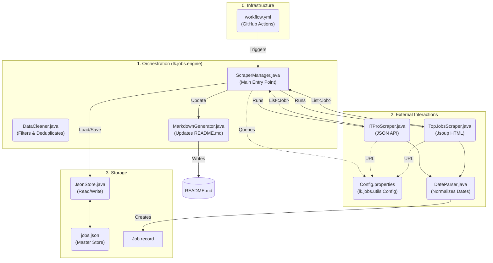

# 🇱🇰 Sri Lanka Software Engineering Jobs | 2026 Tracker [](https://t.me/SL_Software_Jobs)
Looking for software engineering jobs in Sri Lanka? This tracker updates daily with intern, junior, and senior IT roles across Colombo and beyond
Automated Software Engineering Job Tracker for Sri Lanka. Scrapes and categorizes Intern, Associate, and SE roles daily using Java (Jsoup) and GitHub Actions.

> [!TIP]
> **Help keep this project alive!** If this tool helped you find a lead today, please [**Star ⭐ the repo**](https://github.com/Senadeera-NK/sri-lanka-software-jobs). It’s how I measure the impact on our dev community! 🇱🇰

> [!IMPORTANT]
> **Automatic Staleness Purge:** The engine automatically removes listings older than **14 days**, ensuring the feed stays relevant and high-signal.

> **Live Analytics & Daily Software Job Tracker for Sri Lanka**

[📊 View Live Dashboard](https://sri-lanka-software-jobs.vercel.app/)

 
*Click the link above to see real-time trends, seniority distribution, and top hiring companies.*

## 📊 Current Job Openings
> 🟢 **Last Updated:** July 5,6:19 PM (Just now)  | **Total Jobs Found:** 216

### 🎓 Internships & Trainees  (35)

| Title | Company | Level  | Posted | Source |
| :--- | :--- | :--- | :--- | :--- |
| [Software Engineer Intern](https://itpro.lk/job/14224/software-engineer-intern-at-ceylonlot/) | CeylonLot | Intern | 22&nbsp;hours&nbsp;ago | ITPro.lk |
| [Software Engineering Intern](https://itpro.lk/job/14221/software-engineering-intern-at-teaai-pekoe-pvt-ltd/) | TeaAI (Pekoe Pvt Ltd) | Intern | Yesterday | ITPro.lk |
| [Quality Assurance Intern](https://www.topjobs.lk/employer/JobAdvertismentServlet?ac=DEFZZZ&jc=0001519846&ec=DEFZZZ) | Synergen Health (Pvt) Ltd | Intern | 2&nbsp;days&nbsp;ago | TopJobs.lk |
| [Mobile Engineer Intern](https://www.topjobs.lk/employer/JobAdvertismentServlet?ac=DEFZZZ&jc=0001520089&ec=DEFZZZ) | Fexon | Intern | 2&nbsp;days&nbsp;ago | TopJobs.lk |
| [Intern - Software Engineering](https://itpro.lk/job/14068/intern-software-engineering-at-xeynergy/) | Xeynergy | Intern | 3&nbsp;days&nbsp;ago | ITPro.lk |
| [Intern & Associate Software Engineer](https://itpro.lk/job/14208/intern-associate-software-engineer-at-muve-mobility/) | Muve Mobility | Intern | 3&nbsp;days&nbsp;ago | ITPro.lk |
| [Intern & Associate - Software Engineer](https://www.topjobs.lk/employer/JobAdvertismentServlet?ac=DEFZZZ&jc=0001519189&ec=DEFZZZ) | Muve Mobility (Pvt) Ltd | Intern | 3&nbsp;days&nbsp;ago | TopJobs.lk |
| [Intern - IT - QA (1)](https://www.topjobs.lk/employer/JobAdvertismentServlet?ac=0000000064&jc=0001519081&ec=0000000603) | Hirdaramani - H CONNECT (PVT) LIMITED | Intern | 3&nbsp;days&nbsp;ago | TopJobs.lk |
| [Intern - Fullstack Developer](https://www.topjobs.lk/employer/JobAdvertismentServlet?ac=0000000484&jc=0001519023&ec=0000000651) | Epic Lanka (Pvt) Ltd | Intern | 3&nbsp;days&nbsp;ago | TopJobs.lk |
| [Software Quality Assurance Intern (Paid) \| Moratuwa](https://xpress.jobs/jobs/view/303199) | DartCodes (Pvt) Ltd | Intern | 4&nbsp;days&nbsp;ago | XpressJobs |
| [Intern Software Engineer](https://itpro.lk/job/14182/intern-software-engineer-at-kyno-labs/) | Kyno Labs | Intern | 5&nbsp;days&nbsp;ago | ITPro.lk |
| [Full Stack Developer Intern](https://itpro.lk/job/14181/full-stack-developer-intern-at-mydynamica/) | MyDynamica | Intern | 5&nbsp;days&nbsp;ago | ITPro.lk |
| [ERP Developer Intern](https://itpro.lk/job/14164/erp-developer-intern-at-everestx-technologies/) | EverestX Technologies | Intern | 6&nbsp;days&nbsp;ago | ITPro.lk |
| [Automation Engineering Intern](https://itpro.lk/job/14155/automation-engineering-intern-at-mindox-techno/) | Mindox Techno | Intern | 7&nbsp;days&nbsp;ago | ITPro.lk |
| [Intern - AI Product Engineer (1)](https://www.topjobs.lk/employer/JobAdvertismentServlet?ac=0000000280&jc=0001514358&ec=0000000367) | Expolanka Holdings Limited | Intern | 7&nbsp;days&nbsp;ago | TopJobs.lk |
| [Full Stack Developer Trainee Internship](https://itpro.lk/job/14152/full-stack-developer-trainee-internship-at-itx-digital-services-pvt-ltd/) | ITX Digital Services (Pvt) Ltd | Intern | 7&nbsp;days&nbsp;ago | ITPro.lk |
| [Intern -  Cloud Solutions and Services (Security) (1)](https://www.topjobs.lk/employer/JobAdvertismentServlet?ac=0000000049&jc=0001517798&ec=0000000313) | John Keells IT | Intern | 8&nbsp;days&nbsp;ago | TopJobs.lk |
| [Intern QA Engineer (1)](https://www.topjobs.lk/employer/JobAdvertismentServlet?ac=0000000280&jc=0001514359&ec=0000000367) | Expolanka Holdings Limited | Intern | 8&nbsp;days&nbsp;ago | TopJobs.lk |
| [Intern - AI QA Engineer (1)](https://www.topjobs.lk/employer/JobAdvertismentServlet?ac=0000000280&jc=0001514359&ec=0000000367) | Expolanka Holdings Limited | Intern | 8&nbsp;days&nbsp;ago | TopJobs.lk |
| [Intern / Junior Software Engineer](https://itpro.lk/job/14137/intern-junior-software-engineer-at-vision-tech-business-solutions-pvt-ltd/) | Vision Tech Business Solutions (Pvt) Ltd | Intern | 10&nbsp;days&nbsp;ago | ITPro.lk |
| [Full Stack Developer Intern](https://itpro.lk/job/14021/full-stack-developer-intern-at-ranga-technologies/) | Ranga Technologies | Intern | 10&nbsp;days&nbsp;ago | ITPro.lk |
| [AI Training Data Intern](https://www.topjobs.lk/employer/JobAdvertismentServlet?ac=DEFZZZ&jc=0001516660&ec=DEFZZZ) | ServiceTeam Ltd | Intern | 10&nbsp;days&nbsp;ago | TopJobs.lk |
| [Software Engineering - Internship, Python](https://itpro.lk/job/14131/software-engineering-internship-python-at-vijins-lanka/) | Vijins Lanka | Intern | 10&nbsp;days&nbsp;ago | ITPro.lk |
| [Software Engineer Intern](https://itpro.lk/job/14128/software-engineer-intern-at-ait-services-australia/) | AIT Services Australia | Intern | 11&nbsp;days&nbsp;ago | ITPro.lk |
| [Software Engineer Interns](https://itpro.lk/job/14121/software-engineer-interns-at-edgrow-tech/) | EdGrow Tech | Intern | 11&nbsp;days&nbsp;ago | ITPro.lk |
| [Intern - QA](https://xpress.jobs/jobs/view/284564) | XpressJobs | Intern | 11&nbsp;days&nbsp;ago | XpressJobs |
| [Fullstack Internship](https://itpro.lk/job/14116/fullstack-internship-at-univiser/) | UNIVISER | Intern | 11&nbsp;days&nbsp;ago | ITPro.lk |
| [Intern - Software Engineering](https://rooster.jobs/jobs/518238) | Zegates International Private Limited | Intern | 11&nbsp;days&nbsp;ago | Rooster.jobs |
| [QA Interns & QA Automation Interns](https://www.topjobs.lk/employer/JobAdvertismentServlet?ac=DEFZZZ&jc=0001515941&ec=DEFZZZ) | Winnipeg Technology (Pvt) Ltd | Intern | 12&nbsp;days&nbsp;ago | TopJobs.lk |
| [Intern - UI \| UX Engineer](https://www.topjobs.lk/employer/JobAdvertismentServlet?ac=DEFZZZ&jc=0001515923&ec=DEFZZZ) | MintHRM | Intern | 12&nbsp;days&nbsp;ago | TopJobs.lk |
| [Intern Full Stack Engineer (.Net & Angular)](https://www.topjobs.lk/employer/JobAdvertismentServlet?ac=DEFZZZ&jc=0001515867&ec=DEFZZZ) | Med Cube USA | Intern | 12&nbsp;days&nbsp;ago | TopJobs.lk |
| [Full Stack Developer Intern](https://itpro.lk/job/14085/full-stack-developer-intern-at-zerostix-pvt-ltd/) | Zerostix (Pvt) Ltd | Intern | 13&nbsp;days&nbsp;ago | ITPro.lk |
| [Pera Industry Day 2026 - Quality Assurance Intern](https://rooster.jobs/jobs/518182) | Creative Software | Intern | 13&nbsp;days&nbsp;ago | Rooster.jobs |
| [Pera Industry Day 2026 - Software Engineering Intern ](https://rooster.jobs/jobs/518178) | Creative Software | Intern | 13&nbsp;days&nbsp;ago | Rooster.jobs |
| [Software Engineer – Intern](https://itpro.lk/job/14083/software-engineer-intern-at-qbinom/) | Qbinom | Intern | 14&nbsp;days&nbsp;ago | ITPro.lk |

---

### 💻 Associate & Junior/SE Roles  (121)

| Title | Company | Level  | Posted | Source |
| :--- | :--- | :--- | :--- | :--- |
| [Software Architect \| Colombo](https://xpress.jobs/jobs/view/302009) | Mavip Infotech | Junior/SE | 4&nbsp;hours&nbsp;ago | XpressJobs |
| [Enterprise Solution Architect](https://xpress.jobs/jobs/view/302256) | Ernst & Young | Junior/SE | 4&nbsp;hours&nbsp;ago | XpressJobs |
| [Risk and Governance Engineer](https://xpress.jobs/jobs/view/302858) | Innobot | Junior/SE | 4&nbsp;hours&nbsp;ago | XpressJobs |
| [Full Stack Developer (Junior)](https://xpress.jobs/jobs/view/302903) | ShopQ | Junior/SE | 4&nbsp;hours&nbsp;ago | XpressJobs |
| [Head of AI](https://xpress.jobs/jobs/view/302968) | Omobio | Junior/SE | 4&nbsp;hours&nbsp;ago | XpressJobs |
| [Junior Full Stack Developer - Product Team Junior](https://xpress.jobs/jobs/view/303252) | ShopQ | Junior/SE | 4&nbsp;hours&nbsp;ago | XpressJobs |
| [Junior Software Developer](https://xpress.jobs/jobs/view/303265) | ShopQ | Junior/SE | 4&nbsp;hours&nbsp;ago | XpressJobs |
| [Head of Information Security](https://xpress.jobs/jobs/view/303462) | SMB Finance PLC | Junior/SE | 4&nbsp;hours&nbsp;ago | XpressJobs |
| [Database Administrator - Oracle](https://xpress.jobs/jobs/view/303491) | Melsta Technologies (Pvt) Ltd | Junior/SE | 4&nbsp;hours&nbsp;ago | XpressJobs |
| [Security Analyst](https://xpress.jobs/jobs/view/303782) | TGT Global | Junior/SE | 4&nbsp;hours&nbsp;ago | XpressJobs |
| [Data Analyst](https://xpress.jobs/jobs/view/304144) | Dialog Axiata PLC | Junior/SE | 4&nbsp;hours&nbsp;ago | XpressJobs |
| [Engineer - Converged Charging](https://xpress.jobs/jobs/view/304145) | Dialog Axiata PLC | Junior/SE | 4&nbsp;hours&nbsp;ago | XpressJobs |
| [Software Engineer / ABAP Developer](https://xpress.jobs/jobs/view/303920) | Lanka Walltiles PLC | Junior/SE | 4&nbsp;hours&nbsp;ago | XpressJobs |
| [Software Engineering , Artificial Intelligence Lecturers (Fu...](https://xpress.jobs/jobs/view/301170) | Campus Direct | Junior/SE | 4&nbsp;hours&nbsp;ago | XpressJobs |
| [Graduate Engineering (Fresh Graduates)](https://xpress.jobs/jobs/view/304256) | HCL Technologies Lanka (Private) Limited | Junior/SE | 4&nbsp;hours&nbsp;ago | XpressJobs |
| [Graduate Engineer Analyst - Infrastructure Services (Data Ce...](https://xpress.jobs/jobs/view/304258) | HCL Technologies Lanka (Private) Limited | Junior/SE | 4&nbsp;hours&nbsp;ago | XpressJobs |
| [Automation Engineer - UK Project \| Hybrid](https://xpress.jobs/jobs/view/304255) | Konnect BPO | Junior/SE | 4&nbsp;hours&nbsp;ago | XpressJobs |
| [Engineer - IT Security](https://xpress.jobs/jobs/view/304747) | Commercial Bank of Ceylon PLC | Junior/SE | 4&nbsp;hours&nbsp;ago | XpressJobs |
| [Full Stack Software Engineer](https://itpro.lk/job/14226/full-stack-software-engineer-at-maytech-technologies/) | Maytech Technologies | Junior/SE | 15&nbsp;hours&nbsp;ago | ITPro.lk |
| [Part Time AI Developer \| Full - Stack AI Engineer](https://www.topjobs.lk/employer/JobAdvertismentServlet?ac=DEFZZZ&jc=0001515396&ec=DEFZZZ) | Quard International (Pvt) Ltd | Junior/SE | 18&nbsp;hours&nbsp;ago | TopJobs.lk |
| [Shopify Expert \| Shopify Developer](https://www.topjobs.lk/employer/JobAdvertismentServlet?ac=DEFZZZ&jc=0001515394&ec=DEFZZZ) | Quard International (Pvt) Ltd | Junior/SE | 18&nbsp;hours&nbsp;ago | TopJobs.lk |
| [AI Solution Architect](https://www.topjobs.lk/employer/JobAdvertismentServlet?ac=DEFZZZ&jc=0001516526&ec=DEFZZZ) | Commercial Bank of Ceylon PLC | Junior/SE | 18&nbsp;hours&nbsp;ago | TopJobs.lk |
| [QA Automation Engineer](https://www.topjobs.lk/employer/JobAdvertismentServlet?ac=DEFZZZ&jc=0001519022&ec=DEFZZZ) | Intrepid | Junior/SE | 18&nbsp;hours&nbsp;ago | TopJobs.lk |
| [Back - End Developer](https://www.topjobs.lk/employer/JobAdvertismentServlet?ac=DEFZZZ&jc=0001518513&ec=DEFZZZ) | Company Name Withheld | Junior/SE | 18&nbsp;hours&nbsp;ago | TopJobs.lk |
| [Junior Algorithm Engineer - DSP - FPGA Engineer](https://www.topjobs.lk/employer/JobAdvertismentServlet?ac=DEFZZZ&jc=0001518413&ec=DEFZZZ) | Thakshana Technologies (Pvt) Ltd | Junior/SE | 18&nbsp;hours&nbsp;ago | TopJobs.lk |
| [Junior Embedded Software Engineer (Security-Focused)](https://www.topjobs.lk/employer/JobAdvertismentServlet?ac=DEFZZZ&jc=0001518412&ec=DEFZZZ) | Thakshana Technologies (Pvt) Ltd | Junior/SE | 18&nbsp;hours&nbsp;ago | TopJobs.lk |
| [RPG Software Engineer (Card Management Systems & Microservices)](https://rooster.jobs/jobs/518482) | Nextjob | Junior/SE | Yesterday | Rooster.jobs |
| [Web Developers](https://www.topjobs.lk/employer/JobAdvertismentServlet?ac=DEFZZZ&jc=0001519806&ec=DEFZZZ) | Geo360 Life (Pvt) Ltd | Junior/SE | 2&nbsp;days&nbsp;ago | TopJobs.lk |
| [DevOps Engineer](https://www.topjobs.lk/employer/JobAdvertismentServlet?ac=DEFZZZ&jc=0001519757&ec=DEFZZZ) | Ezugi | Junior/SE | 2&nbsp;days&nbsp;ago | TopJobs.lk |
| [Front End Developer - React](https://www.topjobs.lk/employer/JobAdvertismentServlet?ac=DEFZZZ&jc=0001519676&ec=DEFZZZ) | Fortunaglobal (Pvt) Limited | Junior/SE | 2&nbsp;days&nbsp;ago | TopJobs.lk |
| [Associate DevOps Engineer](https://www.topjobs.lk/employer/JobAdvertismentServlet?ac=DEFZZZ&jc=0001519648&ec=DEFZZZ) | Zindhu Business Solutions (Private) Limited | Associate | 2&nbsp;days&nbsp;ago | TopJobs.lk |
| [Software Engineer](https://rooster.jobs/jobs/518464) | The Closing Room | Junior/SE | 2&nbsp;days&nbsp;ago | Rooster.jobs |
| [Software Engineer](https://itpro.lk/job/14189/software-engineer-at-zeawis-ltd/) | Zeawis Ltd | Junior/SE | 3&nbsp;days&nbsp;ago | ITPro.lk |
| [Big Data Engineer (1)](https://www.topjobs.lk/employer/JobAdvertismentServlet?ac=0000000271&jc=0001420855&ec=0000000350) | CMS (Pvt) Ltd | Junior/SE | 3&nbsp;days&nbsp;ago | TopJobs.lk |
| [Data Analyst](https://www.topjobs.lk/employer/JobAdvertismentServlet?ac=DEFZZZ&jc=0001516380&ec=DEFZZZ) | Company Name Withheld | Junior/SE | 3&nbsp;days&nbsp;ago | TopJobs.lk |
| [AI - Frontend Software Engineer](https://www.topjobs.lk/employer/JobAdvertismentServlet?ac=DEFZZZ&jc=0001519218&ec=DEFZZZ) | HRC Labs | Junior/SE | 3&nbsp;days&nbsp;ago | TopJobs.lk |
| [Data Engineer](https://www.topjobs.lk/employer/JobAdvertismentServlet?ac=DEFZZZ&jc=0001519214&ec=DEFZZZ) | HRC Labs | Junior/SE | 3&nbsp;days&nbsp;ago | TopJobs.lk |
| [Web Developer (Wordpress)](https://www.topjobs.lk/employer/JobAdvertismentServlet?ac=DEFZZZ&jc=0001519180&ec=DEFZZZ) | Designsolv (Pvt) Ltd | Junior/SE | 3&nbsp;days&nbsp;ago | TopJobs.lk |
| [Quality Assurance (QA) Engineer](https://itpro.lk/job/14202/quality-assurance-qa-engineer-at-lakmini-international-pvt-ltd/) | Lakmini International (Pvt) Ltd | Junior/SE | 3&nbsp;days&nbsp;ago | ITPro.lk |
| [Associate Data Engineer](https://xpress.jobs/jobs/view/299965) | Brown and Company PLC | Associate | 4&nbsp;days&nbsp;ago | XpressJobs |
| [Data Governance Officer](https://xpress.jobs/jobs/view/299966) | Brown and Company PLC | Junior/SE | 4&nbsp;days&nbsp;ago | XpressJobs |
| [Associate Software Engineer (Associate RPA Developer)](https://xpress.jobs/jobs/view/300514) | Ascent Business Solutions (Pvt) Ltd | Associate | 4&nbsp;days&nbsp;ago | XpressJobs |
| [AI and Automation Engineer](https://xpress.jobs/jobs/view/300630) | TGT Global | Junior/SE | 4&nbsp;days&nbsp;ago | XpressJobs |
| [Data Engineer](https://xpress.jobs/jobs/view/300533) | Brown and Company PLC | Junior/SE | 4&nbsp;days&nbsp;ago | XpressJobs |
| [Quality Assurance Engineer](https://xpress.jobs/jobs/view/300549) | Davton Limited | Junior/SE | 4&nbsp;days&nbsp;ago | XpressJobs |
| [AI Solution Architect](https://xpress.jobs/jobs/view/301387) | Commercial Bank of Ceylon PLC | Junior/SE | 4&nbsp;days&nbsp;ago | XpressJobs |
| [Devops & IT Infrastucture Engineer \| Nawam Mawatha, Colombo 02](https://xpress.jobs/jobs/view/301722) | Victory Company (Igaming BPO) | Junior/SE | 4&nbsp;days&nbsp;ago | XpressJobs |
| [Design Engineer](https://xpress.jobs/jobs/view/301784) | Hayleys Group – Construction & Engineering Sector | Junior/SE | 4&nbsp;days&nbsp;ago | XpressJobs |
| [Walk In Interviews \| Graduate Engineer Analyst - Infrastruc...](https://xpress.jobs/jobs/view/299374) | HCL Technologies Lanka (Private) Limited | Junior/SE | 4&nbsp;days&nbsp;ago | XpressJobs |
| [Walk In Interview \| Graduate Engineering (Fresh Graduates)](https://xpress.jobs/jobs/view/299372) | HCL Technologies Lanka (Private) Limited | Junior/SE | 4&nbsp;days&nbsp;ago | XpressJobs |
| [Associate QA Lead (Manual Testing + AI-Assisted Testing)](https://itpro.lk/job/14200/associate-qa-lead-manual-testing-aiassisted-testing-at-prologics-it-solutions/) | Prologics IT Solutions | Associate | 4&nbsp;days&nbsp;ago | ITPro.lk |
| [Associate QA Engineer](https://itpro.lk/job/14199/associate-qa-engineer-at-kernel-encode/) | Kernel Encode | Associate | 4&nbsp;days&nbsp;ago | ITPro.lk |
| [Software Engineer (.NET / React)](https://itpro.lk/job/14197/software-engineer-net-react-at-verdentra/) | Verdentra | Junior/SE | 4&nbsp;days&nbsp;ago | ITPro.lk |
| [Software Engineer](https://itpro.lk/job/14194/software-engineer-at-catalyst-thrive/) | Catalyst & Thrive | Junior/SE | 4&nbsp;days&nbsp;ago | ITPro.lk |
| [Solution Engineer Vacancies in Colombo](https://www.topjobs.lk/employer/JobAdvertismentServlet?ac=DEFZZZ&jc=0001518629&ec=DEFZZZ) | Manpower Sri Lanka | Junior/SE | 4&nbsp;days&nbsp;ago | TopJobs.lk |
| [GenAI Engineer (Indian candidates only) (1)](https://www.topjobs.lk/employer/JobAdvertismentServlet?ac=0000000403&jc=0001518553&ec=0000000531) | Mobizz Elite (Pvt) Ltd | Junior/SE | 4&nbsp;days&nbsp;ago | TopJobs.lk |
| [SAP Master Data Associate](https://www.topjobs.lk/employer/JobAdvertismentServlet?ac=DEFZZZ&jc=0001518409&ec=DEFZZZ) | Eswaran Brothers Exports (Pvt) Ltd | Associate | 4&nbsp;days&nbsp;ago | TopJobs.lk |
| [Laravel Full Stack Developer](https://itpro.lk/job/14184/laravel-full-stack-developer-at-utmiq-pvt-ltd/) | UTMIQ (PVT) LTD | Junior/SE | 4&nbsp;days&nbsp;ago | ITPro.lk |
| [Integration Engineer](https://itpro.lk/job/14173/integration-engineer-at-ifinity-global/) | Ifinity Global | Junior/SE | 5&nbsp;days&nbsp;ago | ITPro.lk |
| [Junior Trainee - Software Development & IOT](https://www.topjobs.lk/employer/JobAdvertismentServlet?ac=DEFZZZ&jc=0001518166&ec=DEFZZZ) | Hedanship Asia Pvt Ltd | Associate | 5&nbsp;days&nbsp;ago | TopJobs.lk |
| [Senior Associate - Data Analytics (Power BI & Microsoft Ecos...](https://www.topjobs.lk/employer/JobAdvertismentServlet?ac=0000000064&jc=0001518382&ec=0000000445) | H Connect International (Pvt) Ltd | Associate | 5&nbsp;days&nbsp;ago | TopJobs.lk |
| [WordPress Developer](https://itpro.lk/job/14170/wordpress-developer-at-well-treasure-asia/) | Well Treasure Asia | Junior/SE | 5&nbsp;days&nbsp;ago | ITPro.lk |
| [XR Developer (Meta Quest)](https://itpro.lk/job/14168/xr-developer-meta-quest-at-newnop/) | NEWNOP | Junior/SE | 6&nbsp;days&nbsp;ago | ITPro.lk |
| [Quality Engineer](https://itpro.lk/job/14165/quality-engineer-at-catalyst-thrive/) | Catalyst & Thrive | Junior/SE | 6&nbsp;days&nbsp;ago | ITPro.lk |
| [QA Engineer](https://itpro.lk/job/14161/qa-engineer-at-frixb/) | frixB | Junior/SE | 6&nbsp;days&nbsp;ago | ITPro.lk |
| [Business Intelligence Analyst – Data Analytics](https://xpress.jobs/jobs/view/301283) | NDB Bank | Junior/SE | 7&nbsp;days&nbsp;ago | XpressJobs |
| [AIOps & Automation Engineer](https://www.topjobs.lk/employer/JobAdvertismentServlet?ac=DEFZZZ&jc=0001512058&ec=DEFZZZ) | Commercial Bank | Junior/SE | 8&nbsp;days&nbsp;ago | TopJobs.lk |
| [Product Engineer - AI & Automation (R&D)](https://www.topjobs.lk/employer/JobAdvertismentServlet?ac=DEFZZZ&jc=0001517200&ec=DEFZZZ) | SFL Tech | Junior/SE | 9&nbsp;days&nbsp;ago | TopJobs.lk |
| [Software Engineer - Java](https://www.topjobs.lk/employer/JobAdvertismentServlet?ac=DEFZZZ&jc=0001517591&ec=DEFZZZ) | SP Solutions (Pvt) Ltd | Junior/SE | 9&nbsp;days&nbsp;ago | TopJobs.lk |
| [Software Engineer (Python + Java)](https://www.topjobs.lk/employer/JobAdvertismentServlet?ac=DEFZZZ&jc=0001517584&ec=DEFZZZ) | Invenza Digital Technologies (Pvt) Ltd | Junior/SE | 9&nbsp;days&nbsp;ago | TopJobs.lk |
| [Software Engineer - Frontend](https://www.topjobs.lk/employer/JobAdvertismentServlet?ac=DEFZZZ&jc=0001517556&ec=DEFZZZ) | Lassana Group of Companies | Junior/SE | 9&nbsp;days&nbsp;ago | TopJobs.lk |
| [QA Head](https://www.topjobs.lk/employer/JobAdvertismentServlet?ac=DEFZZZ&jc=0001517445&ec=DEFZZZ) | Company Name Withheld | Junior/SE | 9&nbsp;days&nbsp;ago | TopJobs.lk |
| [IT Officer - Data & SQL Development](https://www.topjobs.lk/employer/JobAdvertismentServlet?ac=DEFZZZ&jc=0001517235&ec=DEFZZZ) | Singer Finance (Lanka) PLC | Junior/SE | 9&nbsp;days&nbsp;ago | TopJobs.lk |
| [Product Engineer - AI & Automation (R&D)](https://itpro.lk/job/14138/product-engineer-ai-automation-rd-at-sfl-tech/) | SFL Tech | Junior/SE | 9&nbsp;days&nbsp;ago | ITPro.lk |
| [Software Engineer - Mobile](https://www.topjobs.lk/employer/JobAdvertismentServlet?ac=DEFZZZ&jc=0001511810&ec=DEFZZZ) | A-team Software (Private) Limited | Junior/SE | 9&nbsp;days&nbsp;ago | TopJobs.lk |
| [Full Stack .Net Engineer (1)](https://www.topjobs.lk/employer/JobAdvertismentServlet?ac=0000000271&jc=0001490551&ec=0000000350) | CMS (Pvt) Ltd | Junior/SE | 10&nbsp;days&nbsp;ago | TopJobs.lk |
| [Fullastack Developer - 3 Months Contract (1)](https://www.topjobs.lk/employer/JobAdvertismentServlet?ac=0000000375&jc=0001516823&ec=0000000492) | Jobfactory | Junior/SE | 10&nbsp;days&nbsp;ago | TopJobs.lk |
| [Web Development Project Coordinator](https://www.topjobs.lk/employer/JobAdvertismentServlet?ac=DEFZZZ&jc=0001517019&ec=DEFZZZ) | Amber Business Solutions (Pvt) Ltd | Junior/SE | 10&nbsp;days&nbsp;ago | TopJobs.lk |
| [Software Engineer (.Net & React)](https://www.topjobs.lk/employer/JobAdvertismentServlet?ac=DEFZZZ&jc=0001517005&ec=DEFZZZ) | Daiki Group | Junior/SE | 10&nbsp;days&nbsp;ago | TopJobs.lk |
| [Junior Data Analyst (1)](https://www.topjobs.lk/employer/JobAdvertismentServlet?ac=0000000146&jc=0001517003&ec=0000000178) | Nawaloka Hospitals PLC | Junior/SE | 10&nbsp;days&nbsp;ago | TopJobs.lk |
| [Full Stack Developer](https://www.topjobs.lk/employer/JobAdvertismentServlet?ac=DEFZZZ&jc=0001516930&ec=DEFZZZ) | Umbrela Solutions (Pvt) Ltd | Junior/SE | 10&nbsp;days&nbsp;ago | TopJobs.lk |
| [Software Engineer (PHP)](https://www.topjobs.lk/employer/JobAdvertismentServlet?ac=DEFZZZ&jc=0001516908&ec=DEFZZZ) | Helios Ventures (Pvt) Ltd | Junior/SE | 10&nbsp;days&nbsp;ago | TopJobs.lk |
| [Front End Developer](https://www.topjobs.lk/employer/JobAdvertismentServlet?ac=DEFZZZ&jc=0001516696&ec=DEFZZZ) | Inqbaytor Pte Ltd | Junior/SE | 10&nbsp;days&nbsp;ago | TopJobs.lk |
| [Flutter Mobile Developer](https://www.topjobs.lk/employer/JobAdvertismentServlet?ac=DEFZZZ&jc=0001516687&ec=DEFZZZ) | Inqbaytor Pte Ltd | Junior/SE | 10&nbsp;days&nbsp;ago | TopJobs.lk |
| [Quality Assurance Trainee](https://www.topjobs.lk/employer/JobAdvertismentServlet?ac=DEFZZZ&jc=0001516681&ec=DEFZZZ) | Inqbaytor Pte Ltd | Associate | 10&nbsp;days&nbsp;ago | TopJobs.lk |
| [Information Security Officer (1)](https://www.topjobs.lk/employer/JobAdvertismentServlet?ac=0000000062&jc=0001516664&ec=0000000714) | Softlogic Finance PLC | Junior/SE | 10&nbsp;days&nbsp;ago | TopJobs.lk |
| [Associate Full Stack Software Developer](https://www.topjobs.lk/employer/JobAdvertismentServlet?ac=DEFZZZ&jc=0001516639&ec=DEFZZZ) | Analytical Instruments (Pvt) Ltd | Associate | 10&nbsp;days&nbsp;ago | TopJobs.lk |
| [Associate Software Engineer - Integration](https://itpro.lk/job/14126/associate-software-engineer-integration-at-vitalhub-innovations-lab/) | VitalHub Innovations Lab | Associate | 11&nbsp;days&nbsp;ago | ITPro.lk |
| [Full-stack Developer (SSE/ ATL)](https://itpro.lk/job/14125/fullstack-developer-sse-atl-at-liquid-labs/) | Liquid Labs | Junior/SE | 11&nbsp;days&nbsp;ago | ITPro.lk |
| [Associate Security Engineer](https://xpress.jobs/jobs/view/298329) | Hayleys Business Solutions International (Pvt) Ltd | Associate | 11&nbsp;days&nbsp;ago | XpressJobs |
| [Associate Architect – AI Solutions](https://xpress.jobs/jobs/view/298981) | Dialog Axiata PLC | Associate | 11&nbsp;days&nbsp;ago | XpressJobs |
| [Executive - Data Analytics (1)](https://www.topjobs.lk/employer/JobAdvertismentServlet?ac=0000000311&jc=0001514705&ec=0000000410) | Deloitte | Junior/SE | 11&nbsp;days&nbsp;ago | TopJobs.lk |
| [Software Engineer JAVA (1)](https://www.topjobs.lk/employer/JobAdvertismentServlet?ac=0000000492&jc=0001516604&ec=0000000661) | DirectFN | Junior/SE | 11&nbsp;days&nbsp;ago | TopJobs.lk |
| [Software Engineer - Full Stack (1)](https://www.topjobs.lk/employer/JobAdvertismentServlet?ac=0000000492&jc=0001516606&ec=0000000661) | DirectFN | Junior/SE | 11&nbsp;days&nbsp;ago | TopJobs.lk |
| [Mobile Developer - iOS (1)](https://www.topjobs.lk/employer/JobAdvertismentServlet?ac=0000000492&jc=0001516602&ec=0000000661) | DirectFN | Junior/SE | 11&nbsp;days&nbsp;ago | TopJobs.lk |
| [Data Engineer](https://www.topjobs.lk/employer/JobAdvertismentServlet?ac=DEFZZZ&jc=0001516488&ec=DEFZZZ) | ORYSYS Limited | Junior/SE | 11&nbsp;days&nbsp;ago | TopJobs.lk |
| [Automotive Technical Data Specialist](https://www.topjobs.lk/employer/JobAdvertismentServlet?ac=DEFZZZ&jc=0001516366&ec=DEFZZZ) | Gapstars | Junior/SE | 11&nbsp;days&nbsp;ago | TopJobs.lk |
| [Low Code Development Specialist (1)](https://www.topjobs.lk/employer/JobAdvertismentServlet?ac=0000000049&jc=0001516280&ec=0000000311) | Ceylon Cold Stores PLC | Junior/SE | 11&nbsp;days&nbsp;ago | TopJobs.lk |
| [Mobile Developer - Android (1)](https://www.topjobs.lk/employer/JobAdvertismentServlet?ac=0000000492&jc=0001516221&ec=0000000661) | DirectFN | Junior/SE | 11&nbsp;days&nbsp;ago | TopJobs.lk |
| [QA Engineer (Management Trainee)](https://itpro.lk/job/14113/qa-engineer-management-trainee-at-global-training-network-alliances/) | Global Training Network Alliances | Associate | 11&nbsp;days&nbsp;ago | ITPro.lk |
| [AI - Backend Engineer](https://itpro.lk/job/14112/ai-backend-engineer-at-healthrecon-connect-llc/) | HealthRecon Connect LLC | Junior/SE | 11&nbsp;days&nbsp;ago | ITPro.lk |
| [Laravel Backend & VUE3 Frontend Full Stack Developer (Experienced)](https://www.topjobs.lk/employer/JobAdvertismentServlet?ac=DEFZZZ&jc=0001512839&ec=DEFZZZ) | Mai Globe (Pvt) Ltd | Junior/SE | 12&nbsp;days&nbsp;ago | TopJobs.lk |
| [AI - Backend Engineer](https://www.topjobs.lk/employer/JobAdvertismentServlet?ac=DEFZZZ&jc=0001516056&ec=DEFZZZ) | HRC Labs | Junior/SE | 12&nbsp;days&nbsp;ago | TopJobs.lk |
| [Full Stack Engineer - Java & React](https://www.topjobs.lk/employer/JobAdvertismentServlet?ac=0000000494&jc=0001515929&ec=0000000666) | Acentura Pvt Ltd | Junior/SE | 12&nbsp;days&nbsp;ago | TopJobs.lk |
| [Chief Information Security Officer](https://www.topjobs.lk/employer/JobAdvertismentServlet?ac=DEFZZZ&jc=0001515909&ec=DEFZZZ) | Abans Finance PLC | Junior/SE | 12&nbsp;days&nbsp;ago | TopJobs.lk |
| [Mobile QA Engineer](https://www.topjobs.lk/employer/JobAdvertismentServlet?ac=DEFZZZ&jc=0001515725&ec=DEFZZZ) | Company Name Withheld | Junior/SE | 12&nbsp;days&nbsp;ago | TopJobs.lk |
| [Nest JS Backend Developer](https://www.topjobs.lk/employer/JobAdvertismentServlet?ac=DEFZZZ&jc=0001515720&ec=DEFZZZ) | Company Name Withheld | Junior/SE | 12&nbsp;days&nbsp;ago | TopJobs.lk |
| [Software Engineer - Java](https://itpro.lk/job/14104/software-engineer-java-at-directfn/) | DirectFN | Junior/SE | 12&nbsp;days&nbsp;ago | ITPro.lk |
| [Computer Programmer, Grade II](https://xpress.jobs/jobs/view/299391) | Government Sector | Junior/SE | 13&nbsp;days&nbsp;ago | XpressJobs |
| [Trainee Developers](https://itpro.lk/job/14102/trainee-developers-at-netit-technology/) | NETIT Technology | Associate | 13&nbsp;days&nbsp;ago | ITPro.lk |
| [Post of Programmer – Junior Level Management](https://xpress.jobs/jobs/view/297211) | Government Sector | Junior/SE | 13&nbsp;days&nbsp;ago | XpressJobs |
| [Python/Java Developer - Urban Mobility & Epidemiological Modeling](https://itpro.lk/job/14093/pythonjava-developer-urban-mobility-epidemiological-modeling-at-efutures/) | EFutures | Junior/SE | 13&nbsp;days&nbsp;ago | ITPro.lk |
| [Power Automate RPA Developer (Forward - Deployed Engineer)](https://www.topjobs.lk/employer/JobAdvertismentServlet?ac=DEFZZZ&jc=0001512345&ec=DEFZZZ) | Effectz.AI | Junior/SE | 13&nbsp;days&nbsp;ago | TopJobs.lk |
| [Flutter Developer](https://www.topjobs.lk/employer/JobAdvertismentServlet?ac=DEFZZZ&jc=0001515532&ec=DEFZZZ) | Fortunaglobal (Pvt) Limited | Junior/SE | 13&nbsp;days&nbsp;ago | TopJobs.lk |
| [Java Developers](https://www.topjobs.lk/employer/JobAdvertismentServlet?ac=DEFZZZ&jc=0001515529&ec=DEFZZZ) | Fortunaglobal (Pvt) Limited | Junior/SE | 13&nbsp;days&nbsp;ago | TopJobs.lk |
| [Web Developer (Wordpress)](https://www.topjobs.lk/employer/JobAdvertismentServlet?ac=DEFZZZ&jc=0001515523&ec=DEFZZZ) | Travelco Holidays | Junior/SE | 13&nbsp;days&nbsp;ago | TopJobs.lk |
| [QA Engineer - AI Testing & Automation](https://www.topjobs.lk/employer/JobAdvertismentServlet?ac=DEFZZZ&jc=0001515157&ec=DEFZZZ) | HealthRecon Connect | Junior/SE | 13&nbsp;days&nbsp;ago | TopJobs.lk |
| [AIOPS & Automation Engineer](https://xpress.jobs/jobs/view/297278) | Commercial Bank of Ceylon PLC | Junior/SE | 14&nbsp;days&nbsp;ago | XpressJobs |
| [Associate Engineer - Data Center](https://xpress.jobs/jobs/view/297815) | Commercial Bank of Ceylon PLC | Associate | 14&nbsp;days&nbsp;ago | XpressJobs |
| [Software Engineers](https://xpress.jobs/jobs/view/299918) | Data Management Systems (Pvt) Ltd | Junior/SE | 14&nbsp;days&nbsp;ago | XpressJobs |
| [AI Specialist \| Orion City, On-Site](https://xpress.jobs/jobs/view/297804) | AmplifyD Pvt Ltd | Junior/SE | 14&nbsp;days&nbsp;ago | XpressJobs |

---

### 🚀 Senior & Lead Roles  (60)

| Title | Company | Level  | Posted | Source |
| :--- | :--- | :--- | :--- | :--- |
| [Technical Lead - Python Focus](https://xpress.jobs/jobs/view/300138) | Innobot | Senior | 4&nbsp;hours&nbsp;ago | XpressJobs |
| [Senior WordPress / Shopify Developer](https://xpress.jobs/jobs/view/302318) | AmplifyD Pvt Ltd | Senior | 4&nbsp;hours&nbsp;ago | XpressJobs |
| [Principal Engineer cum Team Lead (AI, Software)](https://xpress.jobs/jobs/view/302428) | PBA Systems Pte Ltd | Senior | 4&nbsp;hours&nbsp;ago | XpressJobs |
| [Senior Machine Learning Engineer](https://xpress.jobs/jobs/view/303796) | AIClub | Senior | 4&nbsp;hours&nbsp;ago | XpressJobs |
| [Senior Software Engineer](https://xpress.jobs/jobs/view/303892) | The Scouts | Senior | 4&nbsp;hours&nbsp;ago | XpressJobs |
| [Senior SQL and SSRS Developer](https://xpress.jobs/jobs/view/303916) | KriyaGo | Senior | 4&nbsp;hours&nbsp;ago | XpressJobs |
| [Technical Lead (AI, Software)](https://xpress.jobs/jobs/view/304035) | PBA Systems Pte Ltd | Senior | 4&nbsp;hours&nbsp;ago | XpressJobs |
| [Senior Software / Automation Systems Engineer](https://xpress.jobs/jobs/view/300044) | Seaport Group | Senior | 4&nbsp;hours&nbsp;ago | XpressJobs |
| [Senior Lecturer - Grade II / Lecturer / Lecturer (Probationa...](https://xpress.jobs/jobs/view/304513) | Sri Lanka Technology Campus | SLTC | Senior | 4&nbsp;hours&nbsp;ago | XpressJobs |
| [Senior Lecturer - Grade II / Lecturer / Lecturer (Probationa...](https://xpress.jobs/jobs/view/304514) | Sri Lanka Technology Campus | SLTC | Senior | 4&nbsp;hours&nbsp;ago | XpressJobs |
| [Senior Lecturer - Grade II / Lecturer / Lecturer (Probationa...](https://xpress.jobs/jobs/view/304515) | Sri Lanka Technology Campus | SLTC | Senior | 4&nbsp;hours&nbsp;ago | XpressJobs |
| [Senior Lecturer - Grade II / Lecturer / Lecturer (Probationa...](https://xpress.jobs/jobs/view/304516) | Sri Lanka Technology Campus | SLTC | Senior | 4&nbsp;hours&nbsp;ago | XpressJobs |
| [Senior Software Engineer (Python)](https://xpress.jobs/jobs/view/304544) | Innobot | Senior | 4&nbsp;hours&nbsp;ago | XpressJobs |
| [Senior Developer / Tech Lead / Senior Tech Lead Full-Stack D...](https://itpro.lk/job/13699/senior-developer-tech-lead-senior-tech-lead-fullstack-development-angular-net-at-bistec-global-services/) | BISTEC Global Services | Senior | 2&nbsp;days&nbsp;ago | ITPro.lk |
| [Senior Executive - Web & App Development](https://www.topjobs.lk/employer/JobAdvertismentServlet?ac=DEFZZZ&jc=0001519540&ec=DEFZZZ) | Cap Snap Lanka (Pvt) Ltd | Senior | 2&nbsp;days&nbsp;ago | TopJobs.lk |
| [Senior Software Engineer (Golang) - REF7504](https://rooster.jobs/jobs/518475) | Creative Software | Senior | 2&nbsp;days&nbsp;ago | Rooster.jobs |
| [Senior Software Engineer](https://itpro.lk/job/14188/senior-software-engineer-at-zeawis-ltd/) | Zeawis Ltd | Senior | 3&nbsp;days&nbsp;ago | ITPro.lk |
| [Senior Full Stack Developer](https://itpro.lk/job/14207/senior-full-stack-developer-at-adelphoi-limited/) | Adelphoi Limited | Senior | 3&nbsp;days&nbsp;ago | ITPro.lk |
| [Senior Snowflake Engineer (1)](https://www.topjobs.lk/employer/JobAdvertismentServlet?ac=0000000271&jc=0001515730&ec=0000000350) | CMS (Pvt) Ltd | Senior | 3&nbsp;days&nbsp;ago | TopJobs.lk |
| [AI - Frontend Tech Lead](https://www.topjobs.lk/employer/JobAdvertismentServlet?ac=DEFZZZ&jc=0001519222&ec=DEFZZZ) | HRC Labs | Senior | 3&nbsp;days&nbsp;ago | TopJobs.lk |
| [AI - Frontend Senior Software Engineer](https://www.topjobs.lk/employer/JobAdvertismentServlet?ac=DEFZZZ&jc=0001519221&ec=DEFZZZ) | HRC Labs | Senior | 3&nbsp;days&nbsp;ago | TopJobs.lk |
| [Senior QA Engineer (1)](https://www.topjobs.lk/employer/JobAdvertismentServlet?ac=0000000271&jc=0001519031&ec=0000000350) | CMS (Pvt) Ltd | Senior | 3&nbsp;days&nbsp;ago | TopJobs.lk |
| [Senior Full Stack Engineer](https://itpro.lk/job/14204/senior-full-stack-engineer-at-global-training-network-alliances-global-tna/) | Global Training Network Alliances (Global TNA) | Senior | 3&nbsp;days&nbsp;ago | ITPro.lk |
| [Senior Python Developer \| Remote](https://xpress.jobs/jobs/view/300061) | BlueOceanSP | Senior | 4&nbsp;days&nbsp;ago | XpressJobs |
| [Team Lead ( Blockchain, Full-Stack & AI  )  - Remote](https://xpress.jobs/jobs/view/300144) | Advantage Group Australasia Pty. Ltd | Senior | 4&nbsp;days&nbsp;ago | XpressJobs |
| [Tech Lead – AI & Platform Engineering \| Hybrid](https://xpress.jobs/jobs/view/300363) | Coderra | Senior | 4&nbsp;days&nbsp;ago | XpressJobs |
| [Senior Systems Engineer](https://xpress.jobs/jobs/view/300569) | TGT Global | Senior | 4&nbsp;days&nbsp;ago | XpressJobs |
| [Senior Full Stack Engineer](https://xpress.jobs/jobs/view/300629) | TGT Global | Senior | 4&nbsp;days&nbsp;ago | XpressJobs |
| [Senior AI and Automation Engineer](https://xpress.jobs/jobs/view/300757) | TGT Global | Senior | 4&nbsp;days&nbsp;ago | XpressJobs |
| [Senior Software Engineer : Ruby on Rails](https://xpress.jobs/jobs/view/301168) | OXO Tech (Pvt) Ltd | Senior | 4&nbsp;days&nbsp;ago | XpressJobs |
| [Senior Java Architect \| Colombo](https://xpress.jobs/jobs/view/301230) | YI CAN PTE. LTD. | Senior | 4&nbsp;days&nbsp;ago | XpressJobs |
| [Lead Automation Engineer (Python Focus)](https://xpress.jobs/jobs/view/301581) | Innobot | Senior | 4&nbsp;days&nbsp;ago | XpressJobs |
| [Senior Automation Engineer (Python Focus)](https://xpress.jobs/jobs/view/301503) | Innobot | Senior | 4&nbsp;days&nbsp;ago | XpressJobs |
| [Senior Quality Engineer / Quality Engineer](https://itpro.lk/job/14196/senior-quality-engineer-quality-engineer-at-verdentra/) | Verdentra | Senior | 4&nbsp;days&nbsp;ago | ITPro.lk |
| [Senior Software Engineer](https://itpro.lk/job/14195/senior-software-engineer-at-catalyst-thrive/) | Catalyst & Thrive | Senior | 4&nbsp;days&nbsp;ago | ITPro.lk |
| [Lead QA Engineer](https://itpro.lk/job/14193/lead-qa-engineer-at-rightmo-web-solution/) | Rightmo Web Solution | Senior | 4&nbsp;days&nbsp;ago | ITPro.lk |
| [Senior Software Engineer (.NET) \| Ja-ela](https://xpress.jobs/jobs/view/301385) | Revolution Tech Software Solutions (Pvt) Ltd | Senior | 5&nbsp;days&nbsp;ago | XpressJobs |
| [Software Engineer \| Senior Software Engineer](https://www.topjobs.lk/employer/JobAdvertismentServlet?ac=DEFZZZ&jc=0001517962&ec=DEFZZZ) | Innobot Health | Senior | 5&nbsp;days&nbsp;ago | TopJobs.lk |
| [Senior Software Engineer .Net](https://www.topjobs.lk/employer/JobAdvertismentServlet?ac=DEFZZZ&jc=0001513825&ec=DEFZZZ) | AccSoft Solutions (Pvt) Ltd | Senior | 5&nbsp;days&nbsp;ago | TopJobs.lk |
| [Senior Lead - DevOps](https://xpress.jobs/jobs/view/299388) | Dialog Axiata PLC | Senior | 7&nbsp;days&nbsp;ago | XpressJobs |
| [Senior Full Stack Developer](https://www.topjobs.lk/employer/JobAdvertismentServlet?ac=DEFZZZ&jc=0001517466&ec=DEFZZZ) | Company Name Withheld | Senior | 9&nbsp;days&nbsp;ago | TopJobs.lk |
| [Senior ICT \| Software Engineer](https://www.topjobs.lk/employer/JobAdvertismentServlet?ac=DEFZZZ&jc=0001517116&ec=DEFZZZ) | Asian Logistics Solutions (Pvt) Ltd | Senior | 9&nbsp;days&nbsp;ago | TopJobs.lk |
| [Senior Software Architecture](https://www.topjobs.lk/employer/JobAdvertismentServlet?ac=DEFZZZ&jc=0001517448&ec=DEFZZZ) | Company Name Withheld | Senior | 9&nbsp;days&nbsp;ago | TopJobs.lk |
| [Senior Quality Assurance Engineer](https://www.topjobs.lk/employer/JobAdvertismentServlet?ac=DEFZZZ&jc=0001511807&ec=DEFZZZ) | A-team Software (private) Limited | Senior | 9&nbsp;days&nbsp;ago | TopJobs.lk |
| [Senior UX \| UI Engineer](https://www.topjobs.lk/employer/JobAdvertismentServlet?ac=DEFZZZ&jc=0001517011&ec=DEFZZZ) | TempServe (Pvt) Ltd | Senior | 10&nbsp;days&nbsp;ago | TopJobs.lk |
| [Senior Developer](https://itpro.lk/job/13305/senior-developer-at-digit-web-lanka-pvt-ltd/) | Digit Web Lanka (Pvt) Ltd | Senior | 10&nbsp;days&nbsp;ago | ITPro.lk |
| [Senior Software Engineer](https://itpro.lk/job/14123/senior-software-engineer-at-liquid-labs/) | Liquid Labs | Senior | 11&nbsp;days&nbsp;ago | ITPro.lk |
| [Senior Data Engineer](https://xpress.jobs/jobs/view/298353) | Dialog Axiata PLC | Senior | 11&nbsp;days&nbsp;ago | XpressJobs |
| [Senior Ruby on Rails Developer](https://xpress.jobs/jobs/view/300690) | Archipelago | Senior | 11&nbsp;days&nbsp;ago | XpressJobs |
| [Senior Go (Golang) Developer](https://xpress.jobs/jobs/view/300691) | Archipelago | Senior | 11&nbsp;days&nbsp;ago | XpressJobs |
| [Senior Software Engineer Full Stack (1)](https://www.topjobs.lk/employer/JobAdvertismentServlet?ac=0000000492&jc=0001516603&ec=0000000661) | DirectFN | Senior | 11&nbsp;days&nbsp;ago | TopJobs.lk |
| [Tech Lead - AI](https://www.topjobs.lk/employer/JobAdvertismentServlet?ac=DEFZZZ&jc=0001516494&ec=DEFZZZ) | ORYSYS Limited | Senior | 11&nbsp;days&nbsp;ago | TopJobs.lk |
| [Senior Data Engineer](https://www.topjobs.lk/employer/JobAdvertismentServlet?ac=DEFZZZ&jc=0001516490&ec=DEFZZZ) | ORYSYS Limited | Senior | 11&nbsp;days&nbsp;ago | TopJobs.lk |
| [Senior Software Engineer Java Script (1)](https://www.topjobs.lk/employer/JobAdvertismentServlet?ac=0000000492&jc=0001516613&ec=0000000661) | DirectFN | Senior | 11&nbsp;days&nbsp;ago | TopJobs.lk |
| [Senior Software Engineer (Node.js / NestJS)](https://rooster.jobs/jobs/518229) | Setjob.lk | Senior | 12&nbsp;days&nbsp;ago | Rooster.jobs |
| [AI - Backend Tech Lead](https://www.topjobs.lk/employer/JobAdvertismentServlet?ac=DEFZZZ&jc=0001516064&ec=DEFZZZ) | HRC Labs | Senior | 12&nbsp;days&nbsp;ago | TopJobs.lk |
| [AI - Backend Senior Software Engineer](https://www.topjobs.lk/employer/JobAdvertismentServlet?ac=DEFZZZ&jc=0001516061&ec=DEFZZZ) | HRC Labs | Senior | 12&nbsp;days&nbsp;ago | TopJobs.lk |
| [Senior Full Stack Engineer (.Net & Angular)](https://www.topjobs.lk/employer/JobAdvertismentServlet?ac=DEFZZZ&jc=0001516052&ec=DEFZZZ) | Med Cube USA | Senior | 12&nbsp;days&nbsp;ago | TopJobs.lk |
| [Technical Lead (Python \| AI Engineering)](https://www.topjobs.lk/employer/JobAdvertismentServlet?ac=DEFZZZ&jc=0001515810&ec=DEFZZZ) | Allion Technologies (Pvt) Ltd | Senior | 12&nbsp;days&nbsp;ago | TopJobs.lk |
| [Senior Quality Assurance Engineer](https://www.topjobs.lk/employer/JobAdvertismentServlet?ac=DEFZZZ&jc=0001515678&ec=DEFZZZ) | Acentura (Pvt) Ltd | Senior | 12&nbsp;days&nbsp;ago | TopJobs.lk |

---


## 🛠️ How it Works
1. **Engine:** A Java 21 console application using **Jsoup**.
2. **Sources:** Currently scraping `ITPro.lk` and  `TopJobs`. Support for and `Rooster.jobs` is under development (Contributors welcome!)
3. **Automation:** Runs every 12 hours via **GitHub Actions**.
4. **Storage:** Updates this `README.md` and a `jobs.json` file automatically.

<details>
<summary><b>📐 View High-Level Architecture Diagram</b></summary>
    

```mermaid
graph TD
    %% Main Orchestration Class
    subgraph Engine ["1. Orchestration (lk.jobs.engine)"]
        ScraperManager["ScraperManager.java<br/>(Main Entry Point)"]
        Cleaner("DataCleaner.java<br/>(Filters & Deduplicates)")
        Markdown("MarkdownGenerator.java<br/>(Updates README.md)")
    end

    %% External Interactions / Data Sources
    subgraph Scrapers ["2. External Interactions"]
        Config("Config.properties<br/>(lk.jobs.utils.Config)")
        ITPro("ITProScraper.java<br/>(JSON API)")
        TopJobs("TopJobsScraper.java<br/>(Jsoup HTML)")
        DParser("DateParser.java<br/>(Normalizes Dates)")
    end

    %% Data Flow & Persistence
    subgraph Storage ["3. Storage"]
        Json("jobs.json<br/>(Master Store)")
        JsonStore("JsonStore.java<br/>(Read/Write)")
        JobModel["Job.record"]
    end

    %% Workflow Orchestration
    subgraph Infrastructure ["0. Infrastructure"]
        WF("workflow.yml<br/>(GitHub Actions)")
    end

    %% Connective Flow
    WF -- "Triggers" --> ScraperManager
    ScraperManager -. "Queries" .-> Config
    ITPro -. "URL" .-> Config
    TopJobs -. "URL" .-> Config
    
    ScraperManager -- "Runs" --> ITPro
    ScraperManager -- "Runs" --> TopJobs
    
    ITPro --> DParser
    TopJobs --> DParser
    DParser -- "Creates" --> JobModel
    
    ITPro -- "List&lt;Job&gt;" --> ScraperManager
    TopJobs -- "List&lt;Job&gt;" --> ScraperManager

    ScraperManager -- "Load/Save" --> JsonStore
    JsonStore <--> Json
    
    ScraperManager -- "Update" --> Markdown
    Markdown -- "Writes" --> README[(README.md)]
```

</details>

<details>
<summary><b>📂 View Project Structure</b></summary>

```text
src/main/java/lk/jobs/
├── engine/           # Logic for sorting, cleaning, and README updates
├── model/            # Data models (Job Record)
├── scrapers/         # Individual site scrapers
└── utils/            # JSON and Date parsing utilities
```
</details>

## 🚀 Usage
If you want to run the scraper locally:
1. Clone the repo.
2. Ensure you have **JDK 21** and **Maven** installed.
3. Run: mvn clean compile exec:java -Dexec.mainClass="lk.jobs.engine.ScraperManager"

## 🤝 Contributing
Contributions are what make the open-source community such an amazing place to learn, inspire, and create.
Any contributions you make are **greatly appreciated**.

* **Found a bug?** Open an [Issue](https://github.com/Senadeera-NK/sl-software-engineering-jobs/issues).
* **Want to add a new site?** Check out our [Contributing Guidelines](CONTRIBUTING.md) to see how to implement a new scraper.
* **Missing a job?** Feel free to submit a Pull Request to manually update the table!
