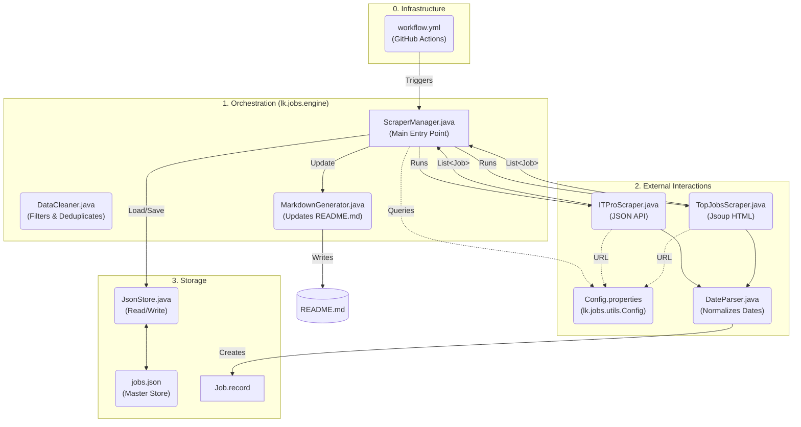

# 🇱🇰 Sri Lanka Software Engineering Jobs | 2026 Tracker [](https://t.me/SL_Software_Jobs)
Looking for software engineering jobs in Sri Lanka? This tracker updates daily with intern, junior, and senior IT roles across Colombo and beyond
Automated Software Engineering Job Tracker for Sri Lanka. Scrapes and categorizes Intern, Associate, and SE roles daily using Java (Jsoup) and GitHub Actions.

> [!TIP]
> **Help keep this project alive!** If this tool helped you find a lead today, please [**Star ⭐ the repo**](https://github.com/Senadeera-NK/sri-lanka-software-jobs). It’s how I measure the impact on our dev community! 🇱🇰

> [!IMPORTANT]
> **Automatic Staleness Purge:** The engine automatically removes listings older than **14 days**, ensuring the feed stays relevant and high-signal.

> **Live Analytics & Daily Software Job Tracker for Sri Lanka**

[📊 View Live Dashboard](https://sri-lanka-software-jobs.vercel.app/)

 
*Click the link above to see real-time trends, seniority distribution, and top hiring companies.*

## 📊 Current Job Openings
> 🟢 **Last Updated:** June 26,7:00 PM (Just now)  | **Total Jobs Found:** 245

### 🎓 Internships & Trainees  (40)

| Title | Company | Level  | Posted | Source |
| :--- | :--- | :--- | :--- | :--- |
| [Intern / Junior Software Engineer](https://itpro.lk/job/14137/intern-junior-software-engineer-at-vision-tech-business-solutions-pvt-ltd/) | Vision Tech Business Solutions (Pvt) Ltd | Intern | 19&nbsp;hours&nbsp;ago | ITPro.lk |
| [Full Stack Developer Intern](https://itpro.lk/job/14021/full-stack-developer-intern-at-ranga-technologies/) | Ranga Technologies | Intern | Yesterday | ITPro.lk |
| [AI Training Data Intern](https://www.topjobs.lk/employer/JobAdvertismentServlet?ac=DEFZZZ&jc=0001516660&ec=DEFZZZ) | ServiceTeam Ltd | Intern | Yesterday | TopJobs.lk |
| [Software Engineering - Internship, Python](https://itpro.lk/job/14131/software-engineering-internship-python-at-vijins-lanka/) | Vijins Lanka | Intern | Yesterday | ITPro.lk |
| [Software Engineer Intern](https://itpro.lk/job/14128/software-engineer-intern-at-ait-services-australia/) | AIT Services Australia | Intern | 2&nbsp;days&nbsp;ago | ITPro.lk |
| [Software Engineer Interns](https://itpro.lk/job/14121/software-engineer-interns-at-edgrow-tech/) | EdGrow Tech | Intern | 2&nbsp;days&nbsp;ago | ITPro.lk |
| [Intern - QA](https://xpress.jobs/jobs/view/284564) | XpressJobs | Intern | 2&nbsp;days&nbsp;ago | XpressJobs |
| [Fullstack Internship](https://itpro.lk/job/14116/fullstack-internship-at-univiser/) | UNIVISER | Intern | 2&nbsp;days&nbsp;ago | ITPro.lk |
| [Intern - Software Engineering](https://rooster.jobs/jobs/518238) | Zegates International Private Limited | Intern | 2&nbsp;days&nbsp;ago | Rooster.jobs |
| [QA Interns & QA Automation Interns](https://www.topjobs.lk/employer/JobAdvertismentServlet?ac=DEFZZZ&jc=0001515941&ec=DEFZZZ) | Winnipeg Technology (Pvt) Ltd | Intern | 3&nbsp;days&nbsp;ago | TopJobs.lk |
| [Intern - UI \| UX Engineer](https://www.topjobs.lk/employer/JobAdvertismentServlet?ac=DEFZZZ&jc=0001515923&ec=DEFZZZ) | MintHRM | Intern | 3&nbsp;days&nbsp;ago | TopJobs.lk |
| [Intern Full Stack Engineer (.Net & Angular)](https://www.topjobs.lk/employer/JobAdvertismentServlet?ac=DEFZZZ&jc=0001515867&ec=DEFZZZ) | Med Cube USA | Intern | 3&nbsp;days&nbsp;ago | TopJobs.lk |
| [Full Stack Developer Intern](https://itpro.lk/job/14085/full-stack-developer-intern-at-zerostix-pvt-ltd/) | Zerostix (Pvt) Ltd | Intern | 4&nbsp;days&nbsp;ago | ITPro.lk |
| [Pera Industry Day 2026 - Quality Assurance Intern](https://rooster.jobs/jobs/518182) | Creative Software | Intern | 4&nbsp;days&nbsp;ago | Rooster.jobs |
| [Pera Industry Day 2026 - Software Engineering Intern ](https://rooster.jobs/jobs/518178) | Creative Software | Intern | 4&nbsp;days&nbsp;ago | Rooster.jobs |
| [Software Engineer – Intern](https://itpro.lk/job/14083/software-engineer-intern-at-qbinom/) | Qbinom | Intern | 5&nbsp;days&nbsp;ago | ITPro.lk |
| [Intern - Software Engineering](https://itpro.lk/job/14068/intern-software-engineering-at-xeynergy/) | Xeynergy | Intern | 7&nbsp;days&nbsp;ago | ITPro.lk |
| [Intern - Data Analytics (1)](https://www.topjobs.lk/employer/JobAdvertismentServlet?ac=0000000311&jc=0001514699&ec=0000000410) | Deloitte | Intern | 7&nbsp;days&nbsp;ago | TopJobs.lk |
| [Interns - AI \| C++ \| Quantitative Research (QR)](https://www.topjobs.lk/employer/JobAdvertismentServlet?ac=DEFZZZ&jc=0001514891&ec=DEFZZZ) | Talent Edge Global | Intern | 7&nbsp;days&nbsp;ago | TopJobs.lk |
| [Software Engineer Intern](https://itpro.lk/job/14053/software-engineer-intern-at-cosmoforge-technologies/) | Cosmoforge Technologies | Intern | 8&nbsp;days&nbsp;ago | ITPro.lk |
| [Intern QA Engineer (1)](https://www.topjobs.lk/employer/JobAdvertismentServlet?ac=0000000280&jc=0001514359&ec=0000000367) | Expolanka Holdings Limited | Intern | 8&nbsp;days&nbsp;ago | TopJobs.lk |
| [Intern Software Engineer (1)](https://www.topjobs.lk/employer/JobAdvertismentServlet?ac=0000000280&jc=0001514358&ec=0000000367) | Expolanka Holdings Limited | Intern | 8&nbsp;days&nbsp;ago | TopJobs.lk |
| [Intern/Associate QA Engineer (API Testing) - Immediate Opening (1)](https://www.topjobs.lk/employer/JobAdvertismentServlet?ac=0000000318&jc=0001514327&ec=0000000417) | Bileeta (Private) Limited | Intern | 8&nbsp;days&nbsp;ago | TopJobs.lk |
| [Frontend Developer Intern](https://itpro.lk/job/14051/frontend-developer-intern-at-ranga-technologies/) | Ranga Technologies | Intern | 8&nbsp;days&nbsp;ago | ITPro.lk |
| [Intern - UI \| UX Engineer](https://www.topjobs.lk/employer/JobAdvertismentServlet?ac=0000000484&jc=0001508198&ec=0000000651) | Epic Lanka (Pvt) Ltd | Intern | 8&nbsp;days&nbsp;ago | TopJobs.lk |
| [QA Engineer Intern](https://itpro.lk/job/14044/qa-engineer-intern-at-velorex-labs/) | Velorex Labs | Intern | 9&nbsp;days&nbsp;ago | ITPro.lk |
| [Software Engineer Intern](https://www.topjobs.lk/employer/JobAdvertismentServlet?ac=DEFZZZ&jc=0001513545&ec=DEFZZZ) | Company Name Withheld | Intern | 9&nbsp;days&nbsp;ago | TopJobs.lk |
| [Intern Software Engineer](https://itpro.lk/job/14030/intern-software-engineer-at-cillex-pty-ltd/) | CilleX Pty Ltd | Intern | 10&nbsp;days&nbsp;ago | ITPro.lk |
| [Intern Software Quality Assurance Engineer](https://itpro.lk/job/14028/intern-software-quality-assurance-engineer-at-simato-vas-solutions-pvt-ltd/) | Simato VAS Solutions (PVT) Ltd | Intern | 10&nbsp;days&nbsp;ago | ITPro.lk |
| [Wordpress Developer Internship](https://www.topjobs.lk/employer/JobAdvertismentServlet?ac=DEFZZZ&jc=0001512614&ec=DEFZZZ) | Rapid Renders | Intern | 11&nbsp;days&nbsp;ago | TopJobs.lk |
| [Intern -  Cloud Solutions and Services (Data & AI) (1)](https://www.topjobs.lk/employer/JobAdvertismentServlet?ac=0000000049&jc=0001512476&ec=0000000313) | John Keells IT | Intern | 11&nbsp;days&nbsp;ago | TopJobs.lk |
| [Intern - Software Engineer (.NET)](https://www.topjobs.lk/employer/JobAdvertismentServlet?ac=DEFZZZ&jc=0001512474&ec=DEFZZZ) | One Billion Tech (Pvt) Ltd | Intern | 11&nbsp;days&nbsp;ago | TopJobs.lk |
| [Software Developer - Intern](https://itpro.lk/job/14009/software-developer-intern-at-cloud-syntex/) | Cloud Syntex | Intern | 13&nbsp;days&nbsp;ago | ITPro.lk |
| [Graduate \| Intern QA Engineer](https://www.topjobs.lk/employer/JobAdvertismentServlet?ac=DEFZZZ&jc=0001512131&ec=DEFZZZ) | OXO Tech (Pvt) Ltd | Intern | 13&nbsp;days&nbsp;ago | TopJobs.lk |
| [Full Stack Engineer – Intern](https://itpro.lk/job/13698/full-stack-engineer-intern-at-asyntax/) | aSyntax | Intern | 13&nbsp;days&nbsp;ago | ITPro.lk |
| [Back-End Developer - Intern](https://itpro.lk/job/14001/backend-developer-intern-at-neo-solution/) | Neo Solution | Intern | 14&nbsp;days&nbsp;ago | ITPro.lk |
| [Web Developer Intern](https://www.topjobs.lk/employer/JobAdvertismentServlet?ac=DEFZZZ&jc=0001511627&ec=DEFZZZ) | Snow Soft (Pvt) Ltd | Intern | 14&nbsp;days&nbsp;ago | TopJobs.lk |
| [Graduate \| Intern Software Engineer](https://www.topjobs.lk/employer/JobAdvertismentServlet?ac=DEFZZZ&jc=0001511970&ec=DEFZZZ) | OXO Technologies (Pvt) Ltd | Intern | 14&nbsp;days&nbsp;ago | TopJobs.lk |
| [Intern \| Associate - AI \| ML Engineer](https://www.topjobs.lk/employer/JobAdvertismentServlet?ac=DEFZZZ&jc=0001511966&ec=DEFZZZ) | OXO Technologies (Pvt) Ltd | Intern | 14&nbsp;days&nbsp;ago | TopJobs.lk |
| [Intern - Software Engineering](https://www.topjobs.lk/employer/JobAdvertismentServlet?ac=DEFZZZ&jc=0001511955&ec=DEFZZZ) | SLIIT Uni | Intern | 14&nbsp;days&nbsp;ago | TopJobs.lk |

---

### 💻 Associate & Junior/SE Roles  (136)

| Title | Company | Level  | Posted | Source |
| :--- | :--- | :--- | :--- | :--- |
| [Software Engineer / ABAP Developer](https://xpress.jobs/jobs/view/299173) | Lanka Walltiles PLC | Junior/SE | 4&nbsp;hours&nbsp;ago | XpressJobs |
| [Associate Data Engineer](https://xpress.jobs/jobs/view/299965) | Brown and Company PLC | Associate | 4&nbsp;hours&nbsp;ago | XpressJobs |
| [Data Governance Officer](https://xpress.jobs/jobs/view/299966) | Brown and Company PLC | Junior/SE | 4&nbsp;hours&nbsp;ago | XpressJobs |
| [Associate Software Engineer (Associate RPA Developer)](https://xpress.jobs/jobs/view/300514) | Ascent Business Solutions (Pvt) Ltd | Associate | 4&nbsp;hours&nbsp;ago | XpressJobs |
| [AI and Automation Engineer](https://xpress.jobs/jobs/view/300630) | TGT Global | Junior/SE | 4&nbsp;hours&nbsp;ago | XpressJobs |
| [Security Analyst](https://xpress.jobs/jobs/view/300632) | TGT Global | Junior/SE | 4&nbsp;hours&nbsp;ago | XpressJobs |
| [Data Engineer](https://xpress.jobs/jobs/view/300533) | Brown and Company PLC | Junior/SE | 4&nbsp;hours&nbsp;ago | XpressJobs |
| [Software Engineering , Artificial Intelligence Lecturers (Fu...](https://xpress.jobs/jobs/view/301170) | Campus Direct | Junior/SE | 4&nbsp;hours&nbsp;ago | XpressJobs |
| [Quality Assurance Engineer](https://xpress.jobs/jobs/view/300549) | Davton Limited | Junior/SE | 4&nbsp;hours&nbsp;ago | XpressJobs |
| [AI Solution Architect](https://xpress.jobs/jobs/view/301387) | Commercial Bank of Ceylon PLC | Junior/SE | 4&nbsp;hours&nbsp;ago | XpressJobs |
| [Devops & IT Infrastucture Engineer \| Nawam Mawatha, Colombo 02](https://xpress.jobs/jobs/view/301722) | Victory Company (Igaming BPO) | Junior/SE | 4&nbsp;hours&nbsp;ago | XpressJobs |
| [Design Engineer](https://xpress.jobs/jobs/view/301784) | Hayleys Group – Construction & Engineering Sector | Junior/SE | 4&nbsp;hours&nbsp;ago | XpressJobs |
| [Software Architect \| Colombo](https://xpress.jobs/jobs/view/302009) | Mavip Infotech | Junior/SE | 4&nbsp;hours&nbsp;ago | XpressJobs |
| [Walk In Interviews \| Graduate Engineer Analyst - Infrastruc...](https://xpress.jobs/jobs/view/299374) | HCL Technologies Lanka (Private) Limited | Junior/SE | 4&nbsp;hours&nbsp;ago | XpressJobs |
| [Walk In Interview \| Graduate Engineering (Fresh Graduates)](https://xpress.jobs/jobs/view/299372) | HCL Technologies Lanka (Private) Limited | Junior/SE | 4&nbsp;hours&nbsp;ago | XpressJobs |
| [Business Intelligence Analyst – Data Analytics](https://xpress.jobs/jobs/view/301283) | NDB Bank | Junior/SE | 4&nbsp;hours&nbsp;ago | XpressJobs |
| [Product Engineer - AI & Automation (R&D)](https://itpro.lk/job/14138/product-engineer-ai-automation-rd-at-sfl-tech/) | SFL Tech | Junior/SE | 17&nbsp;hours&nbsp;ago | ITPro.lk |
| [Software Engineer - Mobile](https://www.topjobs.lk/employer/JobAdvertismentServlet?ac=DEFZZZ&jc=0001511810&ec=DEFZZZ) | A-team Software (Private) Limited | Junior/SE | 19&nbsp;hours&nbsp;ago | TopJobs.lk |
| [AIOps & Automation Engineer](https://www.topjobs.lk/employer/JobAdvertismentServlet?ac=DEFZZZ&jc=0001512058&ec=DEFZZZ) | Commercial Bank | Junior/SE | 19&nbsp;hours&nbsp;ago | TopJobs.lk |
| [Part Time AI Developer \| Full - Stack AI Engineer](https://www.topjobs.lk/employer/JobAdvertismentServlet?ac=DEFZZZ&jc=0001515396&ec=DEFZZZ) | Quard International (Pvt) Ltd | Junior/SE | 19&nbsp;hours&nbsp;ago | TopJobs.lk |
| [Shopify Expert \| Shopify Developer](https://www.topjobs.lk/employer/JobAdvertismentServlet?ac=DEFZZZ&jc=0001515394&ec=DEFZZZ) | Quard International (Pvt) Ltd | Junior/SE | 19&nbsp;hours&nbsp;ago | TopJobs.lk |
| [Product Engineer - AI & Automation (R&D)](https://www.topjobs.lk/employer/JobAdvertismentServlet?ac=DEFZZZ&jc=0001517200&ec=DEFZZZ) | SFL Tech | Junior/SE | 19&nbsp;hours&nbsp;ago | TopJobs.lk |
| [AI Solution Architect](https://www.topjobs.lk/employer/JobAdvertismentServlet?ac=DEFZZZ&jc=0001516526&ec=DEFZZZ) | Commercial Bank of Ceylon PLC | Junior/SE | 19&nbsp;hours&nbsp;ago | TopJobs.lk |
| [Big Data Engineer (1)](https://www.topjobs.lk/employer/JobAdvertismentServlet?ac=0000000271&jc=0001420855&ec=0000000350) | CMS (Pvt) Ltd | Junior/SE | Yesterday | TopJobs.lk |
| [Full Stack .Net Engineer (1)](https://www.topjobs.lk/employer/JobAdvertismentServlet?ac=0000000271&jc=0001490551&ec=0000000350) | CMS (Pvt) Ltd | Junior/SE | Yesterday | TopJobs.lk |
| [Fullastack Developer - 3 Months Contract (1)](https://www.topjobs.lk/employer/JobAdvertismentServlet?ac=0000000375&jc=0001516823&ec=0000000492) | Jobfactory | Junior/SE | Yesterday | TopJobs.lk |
| [Web Development Project Coordinator](https://www.topjobs.lk/employer/JobAdvertismentServlet?ac=DEFZZZ&jc=0001517019&ec=DEFZZZ) | Amber Business Solutions (Pvt) Ltd | Junior/SE | Yesterday | TopJobs.lk |
| [Software Engineer (.Net & React)](https://www.topjobs.lk/employer/JobAdvertismentServlet?ac=DEFZZZ&jc=0001517005&ec=DEFZZZ) | Daiki Group | Junior/SE | Yesterday | TopJobs.lk |
| [Junior Data Analyst (1)](https://www.topjobs.lk/employer/JobAdvertismentServlet?ac=0000000146&jc=0001517003&ec=0000000178) | Nawaloka Hospitals PLC | Junior/SE | Yesterday | TopJobs.lk |
| [Full Stack Developer](https://www.topjobs.lk/employer/JobAdvertismentServlet?ac=DEFZZZ&jc=0001516930&ec=DEFZZZ) | Umbrela Solutions (Pvt) Ltd | Junior/SE | Yesterday | TopJobs.lk |
| [Software Engineer (PHP)](https://www.topjobs.lk/employer/JobAdvertismentServlet?ac=DEFZZZ&jc=0001516908&ec=DEFZZZ) | Helios Ventures (Pvt) Ltd | Junior/SE | Yesterday | TopJobs.lk |
| [Front End Developer](https://www.topjobs.lk/employer/JobAdvertismentServlet?ac=DEFZZZ&jc=0001516696&ec=DEFZZZ) | Inqbaytor Pte Ltd | Junior/SE | Yesterday | TopJobs.lk |
| [Flutter Mobile Developer](https://www.topjobs.lk/employer/JobAdvertismentServlet?ac=DEFZZZ&jc=0001516687&ec=DEFZZZ) | Inqbaytor Pte Ltd | Junior/SE | Yesterday | TopJobs.lk |
| [Quality Assurance Trainee](https://www.topjobs.lk/employer/JobAdvertismentServlet?ac=DEFZZZ&jc=0001516681&ec=DEFZZZ) | Inqbaytor Pte Ltd | Associate | Yesterday | TopJobs.lk |
| [Information Security Officer (1)](https://www.topjobs.lk/employer/JobAdvertismentServlet?ac=0000000062&jc=0001516664&ec=0000000714) | Softlogic Finance PLC | Junior/SE | Yesterday | TopJobs.lk |
| [Associate Full Stack Software Developer](https://www.topjobs.lk/employer/JobAdvertismentServlet?ac=DEFZZZ&jc=0001516639&ec=DEFZZZ) | Analytical Instruments (Pvt) Ltd | Associate | Yesterday | TopJobs.lk |
| [Associate Software Engineer - Integration](https://itpro.lk/job/14126/associate-software-engineer-integration-at-vitalhub-innovations-lab/) | VitalHub Innovations Lab | Associate | 2&nbsp;days&nbsp;ago | ITPro.lk |
| [Full-stack Developer (SSE/ ATL)](https://itpro.lk/job/14125/fullstack-developer-sse-atl-at-liquid-labs/) | Liquid Labs | Junior/SE | 2&nbsp;days&nbsp;ago | ITPro.lk |
| [Risk and Governance Engineer](https://xpress.jobs/jobs/view/297969) | Innobot | Junior/SE | 2&nbsp;days&nbsp;ago | XpressJobs |
| [Head of AI](https://xpress.jobs/jobs/view/298101) | Omobio | Junior/SE | 2&nbsp;days&nbsp;ago | XpressJobs |
| [Associate Security Engineer](https://xpress.jobs/jobs/view/298329) | Hayleys Business Solutions International (Pvt) Ltd | Associate | 2&nbsp;days&nbsp;ago | XpressJobs |
| [Full Stack Developer (Junior)](https://xpress.jobs/jobs/view/298458) | ShopQ | Junior/SE | 2&nbsp;days&nbsp;ago | XpressJobs |
| [Head of Information Security](https://xpress.jobs/jobs/view/298627) | SMB Finance PLC | Junior/SE | 2&nbsp;days&nbsp;ago | XpressJobs |
| [Database Administrator - Oracle](https://xpress.jobs/jobs/view/298736) | Melsta Technologies (Pvt) Ltd | Junior/SE | 2&nbsp;days&nbsp;ago | XpressJobs |
| [Junior Full Stack Developer - Product Team Junior](https://xpress.jobs/jobs/view/298456) | ShopQ | Junior/SE | 2&nbsp;days&nbsp;ago | XpressJobs |
| [Junior Software Developer](https://xpress.jobs/jobs/view/298457) | ShopQ | Junior/SE | 2&nbsp;days&nbsp;ago | XpressJobs |
| [Associate Architect – AI Solutions](https://xpress.jobs/jobs/view/298981) | Dialog Axiata PLC | Associate | 2&nbsp;days&nbsp;ago | XpressJobs |
| [Executive - Data Analytics (1)](https://www.topjobs.lk/employer/JobAdvertismentServlet?ac=0000000311&jc=0001514705&ec=0000000410) | Deloitte | Junior/SE | 2&nbsp;days&nbsp;ago | TopJobs.lk |
| [Software Engineer JAVA (1)](https://www.topjobs.lk/employer/JobAdvertismentServlet?ac=0000000492&jc=0001516604&ec=0000000661) | DirectFN | Junior/SE | 2&nbsp;days&nbsp;ago | TopJobs.lk |
| [Software Engineer - Full Stack (1)](https://www.topjobs.lk/employer/JobAdvertismentServlet?ac=0000000492&jc=0001516606&ec=0000000661) | DirectFN | Junior/SE | 2&nbsp;days&nbsp;ago | TopJobs.lk |
| [Mobile Developer - iOS (1)](https://www.topjobs.lk/employer/JobAdvertismentServlet?ac=0000000492&jc=0001516602&ec=0000000661) | DirectFN | Junior/SE | 2&nbsp;days&nbsp;ago | TopJobs.lk |
| [Data Engineer](https://www.topjobs.lk/employer/JobAdvertismentServlet?ac=DEFZZZ&jc=0001516488&ec=DEFZZZ) | ORYSYS Limited | Junior/SE | 2&nbsp;days&nbsp;ago | TopJobs.lk |
| [Data Analyst](https://www.topjobs.lk/employer/JobAdvertismentServlet?ac=DEFZZZ&jc=0001516380&ec=DEFZZZ) | Company Name Withheld | Junior/SE | 2&nbsp;days&nbsp;ago | TopJobs.lk |
| [Automotive Technical Data Specialist](https://www.topjobs.lk/employer/JobAdvertismentServlet?ac=DEFZZZ&jc=0001516366&ec=DEFZZZ) | Gapstars | Junior/SE | 2&nbsp;days&nbsp;ago | TopJobs.lk |
| [Low Code Development Specialist (1)](https://www.topjobs.lk/employer/JobAdvertismentServlet?ac=0000000049&jc=0001516280&ec=0000000311) | Ceylon Cold Stores PLC | Junior/SE | 2&nbsp;days&nbsp;ago | TopJobs.lk |
| [Mobile Developer - Android (1)](https://www.topjobs.lk/employer/JobAdvertismentServlet?ac=0000000492&jc=0001516221&ec=0000000661) | DirectFN | Junior/SE | 2&nbsp;days&nbsp;ago | TopJobs.lk |
| [QA Engineer (Management Trainee)](https://itpro.lk/job/14113/qa-engineer-management-trainee-at-global-training-network-alliances/) | Global Training Network Alliances | Associate | 2&nbsp;days&nbsp;ago | ITPro.lk |
| [AI - Backend Engineer](https://itpro.lk/job/14112/ai-backend-engineer-at-healthrecon-connect-llc/) | HealthRecon Connect LLC | Junior/SE | 2&nbsp;days&nbsp;ago | ITPro.lk |
| [Laravel Backend & VUE3 Frontend Full Stack Developer (Experienced)](https://www.topjobs.lk/employer/JobAdvertismentServlet?ac=DEFZZZ&jc=0001512839&ec=DEFZZZ) | Mai Globe (Pvt) Ltd | Junior/SE | 3&nbsp;days&nbsp;ago | TopJobs.lk |
| [AI - Backend Engineer](https://www.topjobs.lk/employer/JobAdvertismentServlet?ac=DEFZZZ&jc=0001516056&ec=DEFZZZ) | HRC Labs | Junior/SE | 3&nbsp;days&nbsp;ago | TopJobs.lk |
| [Full Stack Engineer - Java & React](https://www.topjobs.lk/employer/JobAdvertismentServlet?ac=0000000494&jc=0001515929&ec=0000000666) | Acentura Pvt Ltd | Junior/SE | 3&nbsp;days&nbsp;ago | TopJobs.lk |
| [Chief Information Security Officer](https://www.topjobs.lk/employer/JobAdvertismentServlet?ac=DEFZZZ&jc=0001515909&ec=DEFZZZ) | Abans Finance PLC | Junior/SE | 3&nbsp;days&nbsp;ago | TopJobs.lk |
| [Mobile QA Engineer](https://www.topjobs.lk/employer/JobAdvertismentServlet?ac=DEFZZZ&jc=0001515725&ec=DEFZZZ) | Company Name Withheld | Junior/SE | 3&nbsp;days&nbsp;ago | TopJobs.lk |
| [Nest JS Backend Developer](https://www.topjobs.lk/employer/JobAdvertismentServlet?ac=DEFZZZ&jc=0001515720&ec=DEFZZZ) | Company Name Withheld | Junior/SE | 3&nbsp;days&nbsp;ago | TopJobs.lk |
| [Software Engineer - Java](https://itpro.lk/job/14104/software-engineer-java-at-directfn/) | DirectFN | Junior/SE | 3&nbsp;days&nbsp;ago | ITPro.lk |
| [Enterprise Solution Architect](https://xpress.jobs/jobs/view/293267) | Ernst & Young | Junior/SE | 4&nbsp;days&nbsp;ago | XpressJobs |
| [Computer Programmer, Grade II](https://xpress.jobs/jobs/view/299391) | Government Sector | Junior/SE | 4&nbsp;days&nbsp;ago | XpressJobs |
| [Trainee Developers](https://itpro.lk/job/14102/trainee-developers-at-netit-technology/) | NETIT Technology | Associate | 4&nbsp;days&nbsp;ago | ITPro.lk |
| [Post of Programmer – Junior Level Management](https://xpress.jobs/jobs/view/297211) | Government Sector | Junior/SE | 4&nbsp;days&nbsp;ago | XpressJobs |
| [Python/Java Developer - Urban Mobility & Epidemiological Modeling](https://itpro.lk/job/14093/pythonjava-developer-urban-mobility-epidemiological-modeling-at-efutures/) | EFutures | Junior/SE | 4&nbsp;days&nbsp;ago | ITPro.lk |
| [Power Automate RPA Developer (Forward - Deployed Engineer)](https://www.topjobs.lk/employer/JobAdvertismentServlet?ac=DEFZZZ&jc=0001512345&ec=DEFZZZ) | Effectz.AI | Junior/SE | 4&nbsp;days&nbsp;ago | TopJobs.lk |
| [Flutter Developer](https://www.topjobs.lk/employer/JobAdvertismentServlet?ac=DEFZZZ&jc=0001515532&ec=DEFZZZ) | Fortunaglobal (Pvt) Limited | Junior/SE | 4&nbsp;days&nbsp;ago | TopJobs.lk |
| [Java Developers](https://www.topjobs.lk/employer/JobAdvertismentServlet?ac=DEFZZZ&jc=0001515529&ec=DEFZZZ) | Fortunaglobal (Pvt) Limited | Junior/SE | 4&nbsp;days&nbsp;ago | TopJobs.lk |
| [Web Developer (Wordpress)](https://www.topjobs.lk/employer/JobAdvertismentServlet?ac=DEFZZZ&jc=0001515523&ec=DEFZZZ) | Travelco Holidays | Junior/SE | 4&nbsp;days&nbsp;ago | TopJobs.lk |
| [QA Engineer - AI Testing & Automation](https://www.topjobs.lk/employer/JobAdvertismentServlet?ac=DEFZZZ&jc=0001515157&ec=DEFZZZ) | HealthRecon Connect | Junior/SE | 4&nbsp;days&nbsp;ago | TopJobs.lk |
| [Senior Associate - Data Analytics (Power BI & Microsoft Ecos...](https://www.topjobs.lk/employer/JobAdvertismentServlet?ac=0000000064&jc=0001515570&ec=0000000445) | H Connect International (Pvt) Ltd | Associate | 4&nbsp;days&nbsp;ago | TopJobs.lk |
| [AIOPS & Automation Engineer](https://xpress.jobs/jobs/view/297278) | Commercial Bank of Ceylon PLC | Junior/SE | 5&nbsp;days&nbsp;ago | XpressJobs |
| [Associate Engineer - Data Center](https://xpress.jobs/jobs/view/297815) | Commercial Bank of Ceylon PLC | Associate | 5&nbsp;days&nbsp;ago | XpressJobs |
| [Software Engineers](https://xpress.jobs/jobs/view/299918) | Data Management Systems (Pvt) Ltd | Junior/SE | 5&nbsp;days&nbsp;ago | XpressJobs |
| [AI Specialist \| Orion City, On-Site](https://xpress.jobs/jobs/view/297804) | AmplifyD Pvt Ltd | Junior/SE | 5&nbsp;days&nbsp;ago | XpressJobs |
| [Data & AI Solutions Engineer (1)](https://www.topjobs.lk/employer/JobAdvertismentServlet?ac=0000000049&jc=0001515037&ec=0000000311) | Ceylon Cold Stores PLC | Junior/SE | 6&nbsp;days&nbsp;ago | TopJobs.lk |
| [QA Engineer – AI Testing & Automation](https://itpro.lk/job/14077/qa-engineer-ai-testing-automation-at-healthrecon-connect-llc/) | HealthRecon Connect LLC | Junior/SE | 6&nbsp;days&nbsp;ago | ITPro.lk |
| [QA Engineer (Automation)](https://itpro.lk/job/14071/qa-engineer-automation-at-xeynergy/) | Xeynergy | Junior/SE | 7&nbsp;days&nbsp;ago | ITPro.lk |
| [SQL Developer](https://itpro.lk/job/14070/sql-developer-at-xeynergy/) | Xeynergy | Junior/SE | 7&nbsp;days&nbsp;ago | ITPro.lk |
| [Associate – QA Automation Engineer](https://itpro.lk/job/14069/associate-qa-automation-engineer-at-xeynergy/) | Xeynergy | Associate | 7&nbsp;days&nbsp;ago | ITPro.lk |
| [Software Engineer](https://xpress.jobs/jobs/view/297207) | Mobitel (Pvt) Ltd | Junior/SE | 7&nbsp;days&nbsp;ago | XpressJobs |
| [Data Engineer - Big Data and Data Science](https://xpress.jobs/jobs/view/297270) | Mobitel (Pvt) Ltd | Junior/SE | 7&nbsp;days&nbsp;ago | XpressJobs |
| [Software Engineer -SQL Developer (1)](https://www.topjobs.lk/employer/JobAdvertismentServlet?ac=0000000375&jc=0001514650&ec=0000000492) | Jobfactory | Junior/SE | 7&nbsp;days&nbsp;ago | TopJobs.lk |
| [Software Engineer (Male)](https://www.topjobs.lk/employer/JobAdvertismentServlet?ac=0000000223&jc=0001514623&ec=0000000266) | Data Management Systems (Pvt) Ltd | Junior/SE | 7&nbsp;days&nbsp;ago | TopJobs.lk |
| [DevOps Engineer](https://www.topjobs.lk/employer/JobAdvertismentServlet?ac=DEFZZZ&jc=0001509614&ec=DEFZZZ) | Stockpile | Junior/SE | 7&nbsp;days&nbsp;ago | TopJobs.lk |
| [Full Stack Web/Core PHP Developer](https://www.topjobs.lk/employer/JobAdvertismentServlet?ac=DEFZZZ&jc=0001514715&ec=DEFZZZ) | Cohere | Junior/SE | 7&nbsp;days&nbsp;ago | TopJobs.lk |
| [Software Engineer](https://www.topjobs.lk/employer/JobAdvertismentServlet?ac=DEFZZZ&jc=0001514612&ec=DEFZZZ) | Windsor Gaming Company (Pvt) Ltd | Junior/SE | 7&nbsp;days&nbsp;ago | TopJobs.lk |
| [QA Engineer](https://www.topjobs.lk/employer/JobAdvertismentServlet?ac=DEFZZZ&jc=0001514588&ec=DEFZZZ) | RomeoHR | Junior/SE | 7&nbsp;days&nbsp;ago | TopJobs.lk |
| [Database \| CRM Specialist](https://www.topjobs.lk/employer/JobAdvertismentServlet?ac=DEFZZZ&jc=0001514711&ec=DEFZZZ) | Platned | Junior/SE | 7&nbsp;days&nbsp;ago | TopJobs.lk |
| [Cloud Engineer (1)](https://www.topjobs.lk/employer/JobAdvertismentServlet?ac=0000000049&jc=0001514166&ec=0000000313) | John Keells IT | Junior/SE | 8&nbsp;days&nbsp;ago | TopJobs.lk |
| [Head of Department - Research & Development](https://www.topjobs.lk/employer/JobAdvertismentServlet?ac=DEFZZZ&jc=0001514110&ec=DEFZZZ) | Perfect Business Solution Services (Pvt) Ltd | Junior/SE | 8&nbsp;days&nbsp;ago | TopJobs.lk |
| [Data Engineer - Python](https://www.topjobs.lk/employer/JobAdvertismentServlet?ac=DEFZZZ&jc=0001514210&ec=DEFZZZ) | Asiawise Lanka (Pvt) Ltd | Junior/SE | 8&nbsp;days&nbsp;ago | TopJobs.lk |
| [Frontend Engineer / Admin Platform Engineer](https://itpro.lk/job/14047/frontend-engineer-admin-platform-engineer-at-well-treasure-asia/) | Well Treasure Asia | Junior/SE | 8&nbsp;days&nbsp;ago | ITPro.lk |
| [Automation QA Engineer](https://itpro.lk/job/14045/automation-qa-engineer-at-well-treasure-asia/) | Well Treasure Asia | Junior/SE | 8&nbsp;days&nbsp;ago | ITPro.lk |
| [Mid-Level Software Engineer (Full Stack – Next.js \| AWS \| DevOps)](https://itpro.lk/job/14042/midlevel-software-engineer-full-stack-nextjs-aws-devops-at-x4-digital-labs/) | X4 Digital Labs | Junior/SE | 9&nbsp;days&nbsp;ago | ITPro.lk |
| [Junior Executive Grade - Information Security Analyst](https://xpress.jobs/jobs/view/296069) | Dialog Finance PLC | Junior/SE | 9&nbsp;days&nbsp;ago | XpressJobs |
| [Software Engineer - Mobile](https://xpress.jobs/jobs/view/296436) | Mobitel (Pvt) Ltd | Junior/SE | 9&nbsp;days&nbsp;ago | XpressJobs |
| [Software Engineer - Python & Cloud (Backend)](https://www.topjobs.lk/employer/JobAdvertismentServlet?ac=DEFZZZ&jc=0001508193&ec=DEFZZZ) | Affixcon Pty Ltd | Junior/SE | 9&nbsp;days&nbsp;ago | TopJobs.lk |
| [PHP Software Engineer](https://www.topjobs.lk/employer/JobAdvertismentServlet?ac=DEFZZZ&jc=0001513666&ec=DEFZZZ) | Senska (Private) Limited | Junior/SE | 9&nbsp;days&nbsp;ago | TopJobs.lk |
| [Data Analyst (1)](https://www.topjobs.lk/employer/JobAdvertismentServlet?ac=0000000064&jc=0001513576&ec=0000000603) | Hirdaramani - H CONNECT (PVT) LIMITED | Junior/SE | 9&nbsp;days&nbsp;ago | TopJobs.lk |
| [Java Spring Boot Developer](https://www.topjobs.lk/employer/JobAdvertismentServlet?ac=DEFZZZ&jc=0001513542&ec=DEFZZZ) | NMI Group of Companies | Junior/SE | 9&nbsp;days&nbsp;ago | TopJobs.lk |
| [React Native Developer](https://www.topjobs.lk/employer/JobAdvertismentServlet?ac=DEFZZZ&jc=0001513539&ec=DEFZZZ) | NMI Group of Companies | Junior/SE | 9&nbsp;days&nbsp;ago | TopJobs.lk |
| [Full Stack Developer (PHP/Laravel/Modern Web Technologies)](https://www.topjobs.lk/employer/JobAdvertismentServlet?ac=DEFZZZ&jc=0001513369&ec=DEFZZZ) | Xcelen Information Technologies (Pvt) Ltd | Junior/SE | 9&nbsp;days&nbsp;ago | TopJobs.lk |
| [Associate Quality Assurance Engineer (1)](https://www.topjobs.lk/employer/JobAdvertismentServlet?ac=0000000375&jc=0001513462&ec=0000000492) | Jobfactory | Associate | 9&nbsp;days&nbsp;ago | TopJobs.lk |
| [Bridge AI Desktop Developer (Rust \| Tauri) - ATL \| TL](https://www.topjobs.lk/employer/JobAdvertismentServlet?ac=DEFZZZ&jc=0001513034&ec=DEFZZZ) | Allion Technologies (Pvt) Ltd | Junior/SE | 10&nbsp;days&nbsp;ago | TopJobs.lk |
| [Software Engineer](https://www.topjobs.lk/employer/JobAdvertismentServlet?ac=DEFZZZ&jc=0001512972&ec=DEFZZZ) | Netex Technolgies | Junior/SE | 10&nbsp;days&nbsp;ago | TopJobs.lk |
| [QA Automation Engineer - FinTech Domain](https://www.topjobs.lk/employer/JobAdvertismentServlet?ac=DEFZZZ&jc=0001512962&ec=DEFZZZ) | FineXa Tech (Pvt) Ltd | Junior/SE | 10&nbsp;days&nbsp;ago | TopJobs.lk |
| [Conversational AI Engineer](https://www.topjobs.lk/employer/JobAdvertismentServlet?ac=DEFZZZ&jc=0001512833&ec=DEFZZZ) | SME Bizness (Pvt) Ltd | Junior/SE | 10&nbsp;days&nbsp;ago | TopJobs.lk |
| [Cyber Security Specialist (L2)](https://xpress.jobs/jobs/view/297358) | HCL Technologies Lanka (Private) Limited | Junior/SE | 11&nbsp;days&nbsp;ago | XpressJobs |
| [Software Engineer](https://xpress.jobs/jobs/view/297225) | The Scouts | Junior/SE | 11&nbsp;days&nbsp;ago | XpressJobs |
| [Full Stack Developer](https://www.topjobs.lk/employer/JobAdvertismentServlet?ac=DEFZZZ&jc=0001512599&ec=DEFZZZ) | Advice Lab | Junior/SE | 11&nbsp;days&nbsp;ago | TopJobs.lk |
| [Associate / Quality Assurance Engineer](https://www.topjobs.lk/employer/JobAdvertismentServlet?ac=DEFZZZ&jc=0001512584&ec=DEFZZZ) | Evoke Labs (Pvt) Ltd | Associate | 11&nbsp;days&nbsp;ago | TopJobs.lk |
| [DevOps Engineer](https://www.topjobs.lk/employer/JobAdvertismentServlet?ac=DEFZZZ&jc=0001512573&ec=DEFZZZ) | Evoke Labs (Pvt) Ltd | Junior/SE | 11&nbsp;days&nbsp;ago | TopJobs.lk |
| [Associate Engineer - Data Center](https://www.topjobs.lk/employer/JobAdvertismentServlet?ac=DEFZZZ&jc=0001512505&ec=DEFZZZ) | Commercial Bank of Ceylon PLC | Associate | 11&nbsp;days&nbsp;ago | TopJobs.lk |
| [Full Stack Software Engineer](https://www.topjobs.lk/employer/JobAdvertismentServlet?ac=DEFZZZ&jc=0001512275&ec=DEFZZZ) | Primed Pharmacy Group | Junior/SE | 11&nbsp;days&nbsp;ago | TopJobs.lk |
| [RPA Developer](https://itpro.lk/job/14017/rpa-developer-at-legacy-health/) | Legacy Health | Junior/SE | 11&nbsp;days&nbsp;ago | ITPro.lk |
| [Software Engineer - Integration](https://itpro.lk/job/13677/software-engineer-integration-at-vitalhub-innovations-lab/) | VitalHub Innovations Lab | Junior/SE | 11&nbsp;days&nbsp;ago | ITPro.lk |
| [Software Quality Engineer - Performance](https://itpro.lk/job/13503/software-quality-engineer-performance-at-vitalhub-innovations-lab/) | VitalHub Innovations Lab | Junior/SE | 11&nbsp;days&nbsp;ago | ITPro.lk |
| [Associate / Quality Assurance Engineer](https://itpro.lk/job/14008/associate-quality-assurance-engineer-at-evoke-labs/) | Evoke Labs | Associate | 13&nbsp;days&nbsp;ago | ITPro.lk |
| [BigCommerce & Node.js Developer - Remote](https://www.topjobs.lk/employer/JobAdvertismentServlet?ac=DEFZZZ&jc=0001512049&ec=DEFZZZ) | AiSup Pvt Ltd | Junior/SE | 13&nbsp;days&nbsp;ago | TopJobs.lk |
| [Walk In Interviews \| Cyber Security](https://xpress.jobs/jobs/view/291654) | HCL Technologies Lanka (Private) Limited | Junior/SE | 14&nbsp;days&nbsp;ago | XpressJobs |
| [Walk In Interviews \| Graduate Engineer (Analyst) - Fresh Graduates](https://xpress.jobs/jobs/view/293576) | HCL Technologies Lanka (Private) Limited | Junior/SE | 14&nbsp;days&nbsp;ago | XpressJobs |
| [Walk In Interview \| Cyber Security (Fresh Graduates)](https://xpress.jobs/jobs/view/293588) | HCL Technologies Lanka (Private) Limited | Junior/SE | 14&nbsp;days&nbsp;ago | XpressJobs |
| [Associate Quality Assurance Engineers](https://itpro.lk/job/13233/associate-quality-assurance-engineers-at-ebeyonds-pvt-ltd/) | eBeyonds (Pvt) Ltd | Associate | 14&nbsp;days&nbsp;ago | ITPro.lk |
| [Web Developer](https://itpro.lk/job/11788/web-developer-at-ebeyonds-pvt-ltd/) | eBeyonds (Pvt) Ltd | Junior/SE | 14&nbsp;days&nbsp;ago | ITPro.lk |
| [Associate Web Developer](https://itpro.lk/job/13241/associate-web-developer-at-ebeyonds-pvt-ltd/) | eBeyonds (Pvt) Ltd | Associate | 14&nbsp;days&nbsp;ago | ITPro.lk |
| [QA Engineer](https://xpress.jobs/jobs/view/295232) | Innobot | Junior/SE | 14&nbsp;days&nbsp;ago | XpressJobs |
| [Trainee Wordpress Developer](https://itpro.lk/job/13999/trainee-wordpress-developer-at-enliven-designers/) | Enliven Designers | Associate | 14&nbsp;days&nbsp;ago | ITPro.lk |
| [Cloud Solution Architect (1)](https://www.topjobs.lk/employer/JobAdvertismentServlet?ac=0000000241&jc=0001511749&ec=0000000294) | Huawei Technologies Lanka Co (Pvt) Ltd. | Junior/SE | 14&nbsp;days&nbsp;ago | TopJobs.lk |
| [BIM Application Engineer](https://www.topjobs.lk/employer/JobAdvertismentServlet?ac=DEFZZZ&jc=0001511673&ec=DEFZZZ) | Acecam (Pvt) Ltd | Junior/SE | 14&nbsp;days&nbsp;ago | TopJobs.lk |
| [EPOS Developer](https://www.topjobs.lk/employer/JobAdvertismentServlet?ac=DEFZZZ&jc=0001511941&ec=DEFZZZ) | SMEBIZNESS (Pvt) Ltd | Junior/SE | 14&nbsp;days&nbsp;ago | TopJobs.lk |

---

### 🚀 Senior & Lead Roles  (69)

| Title | Company | Level  | Posted | Source |
| :--- | :--- | :--- | :--- | :--- |
| [Senior SQL and SSRS Developer](https://xpress.jobs/jobs/view/299169) | KriyaGo | Senior | 4&nbsp;hours&nbsp;ago | XpressJobs |
| [Technical Lead (AI, Software)](https://xpress.jobs/jobs/view/299204) | PBA Systems Pte Ltd | Senior | 4&nbsp;hours&nbsp;ago | XpressJobs |
| [Senior Lead - DevOps](https://xpress.jobs/jobs/view/299388) | Dialog Axiata PLC | Senior | 4&nbsp;hours&nbsp;ago | XpressJobs |
| [Senior Machine Learning Engineer](https://xpress.jobs/jobs/view/297835) | AIClub | Senior | 4&nbsp;hours&nbsp;ago | XpressJobs |
| [Senior Software Engineer (Python)](https://xpress.jobs/jobs/view/299675) | Innobot | Senior | 4&nbsp;hours&nbsp;ago | XpressJobs |
| [Senior Lecturer - Grade II / Lecturer / Lecturer (Probationa...](https://xpress.jobs/jobs/view/299716) | Sri Lanka Technology Campus | SLTC | Senior | 4&nbsp;hours&nbsp;ago | XpressJobs |
| [Senior Lecturer - Grade II / Lecturer / Lecturer (Probationa...](https://xpress.jobs/jobs/view/299717) | Sri Lanka Technology Campus | SLTC | Senior | 4&nbsp;hours&nbsp;ago | XpressJobs |
| [Senior Lecturer - Grade II / Lecturer / Lecturer (Probationa...](https://xpress.jobs/jobs/view/299718) | Sri Lanka Technology Campus | SLTC | Senior | 4&nbsp;hours&nbsp;ago | XpressJobs |
| [Senior Lecturer - Grade II / Lecturer / Lecturer (Probationa...](https://xpress.jobs/jobs/view/299719) | Sri Lanka Technology Campus | SLTC | Senior | 4&nbsp;hours&nbsp;ago | XpressJobs |
| [Senior Software / Automation Systems Engineer](https://xpress.jobs/jobs/view/300044) | Seaport Group | Senior | 4&nbsp;hours&nbsp;ago | XpressJobs |
| [Senior Python Developer \| Remote](https://xpress.jobs/jobs/view/300061) | BlueOceanSP | Senior | 4&nbsp;hours&nbsp;ago | XpressJobs |
| [Team Lead ( Blockchain, Full-Stack & AI  )  - Remote](https://xpress.jobs/jobs/view/300144) | Advantage Group Australasia Pty. Ltd | Senior | 4&nbsp;hours&nbsp;ago | XpressJobs |
| [Tech Lead – AI & Platform Engineering \| Hybrid](https://xpress.jobs/jobs/view/300363) | Coderra | Senior | 4&nbsp;hours&nbsp;ago | XpressJobs |
| [Senior Software Engineer](https://xpress.jobs/jobs/view/299449) | The Scouts | Senior | 4&nbsp;hours&nbsp;ago | XpressJobs |
| [Senior Systems Engineer](https://xpress.jobs/jobs/view/300569) | TGT Global | Senior | 4&nbsp;hours&nbsp;ago | XpressJobs |
| [Senior Full Stack Engineer](https://xpress.jobs/jobs/view/300629) | TGT Global | Senior | 4&nbsp;hours&nbsp;ago | XpressJobs |
| [Senior AI and Automation Engineer](https://xpress.jobs/jobs/view/300757) | TGT Global | Senior | 4&nbsp;hours&nbsp;ago | XpressJobs |
| [Senior Software Engineer : Ruby on Rails](https://xpress.jobs/jobs/view/301168) | OXO Tech (Pvt) Ltd | Senior | 4&nbsp;hours&nbsp;ago | XpressJobs |
| [Senior Java Architect \| Colombo](https://xpress.jobs/jobs/view/301230) | YI CAN PTE. LTD. | Senior | 4&nbsp;hours&nbsp;ago | XpressJobs |
| [Senior Software Engineer (.NET) \| Ja-ela](https://xpress.jobs/jobs/view/301385) | Revolution Tech Software Solutions (Pvt) Ltd | Senior | 4&nbsp;hours&nbsp;ago | XpressJobs |
| [Lead Automation Engineer (Python Focus)](https://xpress.jobs/jobs/view/301581) | Innobot | Senior | 4&nbsp;hours&nbsp;ago | XpressJobs |
| [Senior Automation Engineer (Python Focus)](https://xpress.jobs/jobs/view/301503) | Innobot | Senior | 4&nbsp;hours&nbsp;ago | XpressJobs |
| [Technical Lead - Python Focus](https://xpress.jobs/jobs/view/300138) | Innobot | Senior | 4&nbsp;hours&nbsp;ago | XpressJobs |
| [Senior Developer / Tech Lead / Senior Tech Lead Full-Stack D...](https://itpro.lk/job/13699/senior-developer-tech-lead-senior-tech-lead-fullstack-development-angular-net-at-bistec-global-services/) | BISTEC Global Services | Senior | 11&nbsp;hours&nbsp;ago | ITPro.lk |
| [Senior Quality Assurance Engineer](https://www.topjobs.lk/employer/JobAdvertismentServlet?ac=DEFZZZ&jc=0001511807&ec=DEFZZZ) | A-team Software (private) Limited | Senior | 19&nbsp;hours&nbsp;ago | TopJobs.lk |
| [Senior Full Stack Developer](https://www.topjobs.lk/employer/JobAdvertismentServlet?ac=DEFZZZ&jc=0001512235&ec=DEFZZZ) | Company Name Withheld | Senior | 19&nbsp;hours&nbsp;ago | TopJobs.lk |
| [Senior Software Engineer .Net](https://www.topjobs.lk/employer/JobAdvertismentServlet?ac=DEFZZZ&jc=0001513825&ec=DEFZZZ) | AccSoft Solutions (Pvt) Ltd | Senior | 19&nbsp;hours&nbsp;ago | TopJobs.lk |
| [Senior ICT \| Software Engineer](https://www.topjobs.lk/employer/JobAdvertismentServlet?ac=DEFZZZ&jc=0001517116&ec=DEFZZZ) | Asian Logistics Solutions (Pvt) Ltd | Senior | 19&nbsp;hours&nbsp;ago | TopJobs.lk |
| [Senior UX \| UI Engineer](https://www.topjobs.lk/employer/JobAdvertismentServlet?ac=DEFZZZ&jc=0001517011&ec=DEFZZZ) | TempServe (Pvt) Ltd | Senior | Yesterday | TopJobs.lk |
| [Senior Snowflake Engineer (1)](https://www.topjobs.lk/employer/JobAdvertismentServlet?ac=0000000271&jc=0001515730&ec=0000000350) | CMS (Pvt) Ltd | Senior | Yesterday | TopJobs.lk |
| [Senior Developer](https://itpro.lk/job/13305/senior-developer-at-digit-web-lanka-pvt-ltd/) | Digit Web Lanka (Pvt) Ltd | Senior | Yesterday | ITPro.lk |
| [Senior Software Engineer](https://itpro.lk/job/14123/senior-software-engineer-at-liquid-labs/) | Liquid Labs | Senior | 2&nbsp;days&nbsp;ago | ITPro.lk |
| [Senior Data Engineer](https://xpress.jobs/jobs/view/298353) | Dialog Axiata PLC | Senior | 2&nbsp;days&nbsp;ago | XpressJobs |
| [Senior Ruby on Rails Developer](https://xpress.jobs/jobs/view/300690) | Archipelago | Senior | 2&nbsp;days&nbsp;ago | XpressJobs |
| [Senior Go (Golang) Developer](https://xpress.jobs/jobs/view/300691) | Archipelago | Senior | 2&nbsp;days&nbsp;ago | XpressJobs |
| [Senior Software Engineer Full Stack (1)](https://www.topjobs.lk/employer/JobAdvertismentServlet?ac=0000000492&jc=0001516603&ec=0000000661) | DirectFN | Senior | 2&nbsp;days&nbsp;ago | TopJobs.lk |
| [Tech Lead - AI](https://www.topjobs.lk/employer/JobAdvertismentServlet?ac=DEFZZZ&jc=0001516494&ec=DEFZZZ) | ORYSYS Limited | Senior | 2&nbsp;days&nbsp;ago | TopJobs.lk |
| [Senior Data Engineer](https://www.topjobs.lk/employer/JobAdvertismentServlet?ac=DEFZZZ&jc=0001516490&ec=DEFZZZ) | ORYSYS Limited | Senior | 2&nbsp;days&nbsp;ago | TopJobs.lk |
| [Senior Software Engineer (Node.js / NestJS)](https://rooster.jobs/jobs/518229) | Setjob.lk | Senior | 3&nbsp;days&nbsp;ago | Rooster.jobs |
| [AI - Backend Tech Lead](https://www.topjobs.lk/employer/JobAdvertismentServlet?ac=DEFZZZ&jc=0001516064&ec=DEFZZZ) | HRC Labs | Senior | 3&nbsp;days&nbsp;ago | TopJobs.lk |
| [AI - Backend Senior Software Engineer](https://www.topjobs.lk/employer/JobAdvertismentServlet?ac=DEFZZZ&jc=0001516061&ec=DEFZZZ) | HRC Labs | Senior | 3&nbsp;days&nbsp;ago | TopJobs.lk |
| [Senior Full Stack Engineer (.Net & Angular)](https://www.topjobs.lk/employer/JobAdvertismentServlet?ac=DEFZZZ&jc=0001516052&ec=DEFZZZ) | Med Cube USA | Senior | 3&nbsp;days&nbsp;ago | TopJobs.lk |
| [Technical Lead (Python \| AI Engineering)](https://www.topjobs.lk/employer/JobAdvertismentServlet?ac=DEFZZZ&jc=0001515810&ec=DEFZZZ) | Allion Technologies (Pvt) Ltd | Senior | 3&nbsp;days&nbsp;ago | TopJobs.lk |
| [Senior Quality Assurance Engineer](https://www.topjobs.lk/employer/JobAdvertismentServlet?ac=DEFZZZ&jc=0001515678&ec=DEFZZZ) | Acentura (Pvt) Ltd | Senior | 3&nbsp;days&nbsp;ago | TopJobs.lk |
| [Senior WordPress / Shopify Developer](https://xpress.jobs/jobs/view/297344) | AmplifyD Pvt Ltd | Senior | 4&nbsp;days&nbsp;ago | XpressJobs |
| [Principal Engineer cum Team Lead (AI, Software)](https://xpress.jobs/jobs/view/297435) | PBA Systems Pte Ltd | Senior | 4&nbsp;days&nbsp;ago | XpressJobs |
| [Senior Enterprise Solutions Architect](https://itpro.lk/job/14066/senior-enterprise-solutions-architect-at-xeynergy/) | Xeynergy | Senior | 7&nbsp;days&nbsp;ago | ITPro.lk |
| [Senior Backend Engineer / API Integration Engineer](https://itpro.lk/job/14064/senior-backend-engineer-api-integration-engineer-at-well-treasure-asia/) | Well Treasure Asia | Senior | 7&nbsp;days&nbsp;ago | ITPro.lk |
| [Senior AI Solutions Engineer](https://www.topjobs.lk/employer/JobAdvertismentServlet?ac=DEFZZZ&jc=0001514704&ec=DEFZZZ) | Blue Chip Technical Services (Pvt) Ltd | Senior | 7&nbsp;days&nbsp;ago | TopJobs.lk |
| [Senior Developer / Tech Lead / Senior Tech Lead Full-Stack (...](https://itpro.lk/job/13805/senior-developer-tech-lead-senior-tech-lead-fullstack-angular-nodejs-at-bistec-global-services/) | BISTEC Global Services | Senior | 7&nbsp;days&nbsp;ago | ITPro.lk |
| [Lead - DevOps](https://xpress.jobs/jobs/view/296422) | Dialog Axiata PLC | Senior | 8&nbsp;days&nbsp;ago | XpressJobs |
| [Senior Data Scientist](https://xpress.jobs/jobs/view/296425) | Dialog Axiata PLC | Senior | 8&nbsp;days&nbsp;ago | XpressJobs |
| [Lead Data Scientist](https://xpress.jobs/jobs/view/296427) | Dialog Axiata PLC | Senior | 8&nbsp;days&nbsp;ago | XpressJobs |
| [Senior Software Engineer](https://xpress.jobs/jobs/view/296419) | Dialog Axiata PLC | Senior | 8&nbsp;days&nbsp;ago | XpressJobs |
| [Senior QA Engineer](https://itpro.lk/job/14050/senior-qa-engineer-at-mitra-innovation/) | Mitra Innovation | Senior | 8&nbsp;days&nbsp;ago | ITPro.lk |
| [Lead Full-stack Engineer](https://itpro.lk/job/14049/lead-fullstack-engineer-at-well-treasure-asia/) | Well Treasure Asia | Senior | 8&nbsp;days&nbsp;ago | ITPro.lk |
| [Senior Software Developer](https://xpress.jobs/jobs/view/296304) | Wizlearn Technologies Pte Ltd | Senior | 10&nbsp;days&nbsp;ago | XpressJobs |
| [AI Capability & Delivery Lead - REF0112](https://rooster.jobs/jobs/518103) | Creative Software | Senior | 10&nbsp;days&nbsp;ago | Rooster.jobs |
| [Senior Software Engineer - Openedge](https://www.topjobs.lk/employer/JobAdvertismentServlet?ac=DEFZZZ&jc=0001513048&ec=DEFZZZ) | Neptune Digital Solution | Senior | 10&nbsp;days&nbsp;ago | TopJobs.lk |
| [Senior DevOps Engineer](https://www.topjobs.lk/employer/JobAdvertismentServlet?ac=DEFZZZ&jc=0001513029&ec=DEFZZZ) | Allion Technologies (Pvt) Ltd | Senior | 10&nbsp;days&nbsp;ago | TopJobs.lk |
| [Senior AI Engineer](https://www.topjobs.lk/employer/JobAdvertismentServlet?ac=DEFZZZ&jc=0001512659&ec=DEFZZZ) | RedOwl Labs (Pvt) Ltd | Senior | 11&nbsp;days&nbsp;ago | TopJobs.lk |
| [Senior Software Engineer - .NET](https://itpro.lk/job/13618/senior-software-engineer-net-at-vitalhub-innovations-lab/) | VitalHub Innovations Lab | Senior | 11&nbsp;days&nbsp;ago | ITPro.lk |
| [Senior Lead Engineer - IT Data Center](https://www.topjobs.lk/employer/JobAdvertismentServlet?ac=DEFZZZ&jc=0001508968&ec=DEFZZZ) | Commercial Bank of Ceylon PLC | Senior | 12&nbsp;days&nbsp;ago | TopJobs.lk |
| [Senior Systems Engineer (1)](https://www.topjobs.lk/employer/JobAdvertismentServlet?ac=0000000492&jc=0001512117&ec=0000000661) | DirectFN | Senior | 13&nbsp;days&nbsp;ago | TopJobs.lk |
| [Tech Lead Java (1)](https://www.topjobs.lk/employer/JobAdvertismentServlet?ac=0000000492&jc=0001512112&ec=0000000661) | DirectFN | Senior | 13&nbsp;days&nbsp;ago | TopJobs.lk |
| [Senior Software Engineer Java Script (1)](https://www.topjobs.lk/employer/JobAdvertismentServlet?ac=0000000492&jc=0001512109&ec=0000000661) | DirectFN | Senior | 13&nbsp;days&nbsp;ago | TopJobs.lk |
| [Senior Software Engineer .NET (1)](https://www.topjobs.lk/employer/JobAdvertismentServlet?ac=0000000492&jc=0001512111&ec=0000000661) | DirectFN | Senior | 13&nbsp;days&nbsp;ago | TopJobs.lk |
| [Senior Software Engineer JAVA (1)](https://www.topjobs.lk/employer/JobAdvertismentServlet?ac=0000000492&jc=0001512110&ec=0000000661) | DirectFN | Senior | 13&nbsp;days&nbsp;ago | TopJobs.lk |
| [Tech Lead JAVA Angular (1)](https://www.topjobs.lk/employer/JobAdvertismentServlet?ac=0000000492&jc=0001512108&ec=0000000661) | DirectFN | Senior | 13&nbsp;days&nbsp;ago | TopJobs.lk |

---


## 🛠️ How it Works
1. **Engine:** A Java 21 console application using **Jsoup**.
2. **Sources:** Currently scraping `ITPro.lk` and  `TopJobs`. Support for and `Rooster.jobs` is under development (Contributors welcome!)
3. **Automation:** Runs every 12 hours via **GitHub Actions**.
4. **Storage:** Updates this `README.md` and a `jobs.json` file automatically.

<details>
<summary><b>📐 View High-Level Architecture Diagram</b></summary>
    

```mermaid
graph TD
    %% Main Orchestration Class
    subgraph Engine ["1. Orchestration (lk.jobs.engine)"]
        ScraperManager["ScraperManager.java<br/>(Main Entry Point)"]
        Cleaner("DataCleaner.java<br/>(Filters & Deduplicates)")
        Markdown("MarkdownGenerator.java<br/>(Updates README.md)")
    end

    %% External Interactions / Data Sources
    subgraph Scrapers ["2. External Interactions"]
        Config("Config.properties<br/>(lk.jobs.utils.Config)")
        ITPro("ITProScraper.java<br/>(JSON API)")
        TopJobs("TopJobsScraper.java<br/>(Jsoup HTML)")
        DParser("DateParser.java<br/>(Normalizes Dates)")
    end

    %% Data Flow & Persistence
    subgraph Storage ["3. Storage"]
        Json("jobs.json<br/>(Master Store)")
        JsonStore("JsonStore.java<br/>(Read/Write)")
        JobModel["Job.record"]
    end

    %% Workflow Orchestration
    subgraph Infrastructure ["0. Infrastructure"]
        WF("workflow.yml<br/>(GitHub Actions)")
    end

    %% Connective Flow
    WF -- "Triggers" --> ScraperManager
    ScraperManager -. "Queries" .-> Config
    ITPro -. "URL" .-> Config
    TopJobs -. "URL" .-> Config
    
    ScraperManager -- "Runs" --> ITPro
    ScraperManager -- "Runs" --> TopJobs
    
    ITPro --> DParser
    TopJobs --> DParser
    DParser -- "Creates" --> JobModel
    
    ITPro -- "List&lt;Job&gt;" --> ScraperManager
    TopJobs -- "List&lt;Job&gt;" --> ScraperManager

    ScraperManager -- "Load/Save" --> JsonStore
    JsonStore <--> Json
    
    ScraperManager -- "Update" --> Markdown
    Markdown -- "Writes" --> README[(README.md)]
```

</details>

<details>
<summary><b>📂 View Project Structure</b></summary>

```text
src/main/java/lk/jobs/
├── engine/           # Logic for sorting, cleaning, and README updates
├── model/            # Data models (Job Record)
├── scrapers/         # Individual site scrapers
└── utils/            # JSON and Date parsing utilities
```
</details>

## 🚀 Usage
If you want to run the scraper locally:
1. Clone the repo.
2. Ensure you have **JDK 21** and **Maven** installed.
3. Run: mvn clean compile exec:java -Dexec.mainClass="lk.jobs.engine.ScraperManager"

## 🤝 Contributing
Contributions are what make the open-source community such an amazing place to learn, inspire, and create.
Any contributions you make are **greatly appreciated**.

* **Found a bug?** Open an [Issue](https://github.com/Senadeera-NK/sl-software-engineering-jobs/issues).
* **Want to add a new site?** Check out our [Contributing Guidelines](CONTRIBUTING.md) to see how to implement a new scraper.
* **Missing a job?** Feel free to submit a Pull Request to manually update the table!
