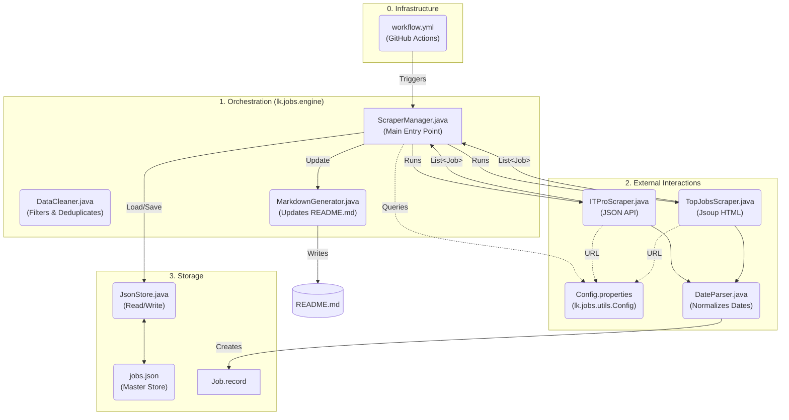

# 🇱🇰 Sri Lanka Software Engineering Jobs | 2026 Tracker [](https://t.me/SL_Software_Jobs)
Looking for software engineering jobs in Sri Lanka? This tracker updates daily with intern, junior, and senior IT roles across Colombo and beyond
Automated Software Engineering Job Tracker for Sri Lanka. Scrapes and categorizes Intern, Associate, and SE roles daily using Java (Jsoup) and GitHub Actions.

> [!TIP]
> **Help keep this project alive!** If this tool helped you find a lead today, please [**Star ⭐ the repo**](https://github.com/Senadeera-NK/sri-lanka-software-jobs). It’s how I measure the impact on our dev community! 🇱🇰

> [!IMPORTANT]
> **Automatic Staleness Purge:** The engine automatically removes listings older than **14 days**, ensuring the feed stays relevant and high-signal.

> **Live Analytics & Daily Software Job Tracker for Sri Lanka**

[📊 View Live Dashboard](https://sri-lanka-software-jobs.vercel.app/)

 
*Click the link above to see real-time trends, seniority distribution, and top hiring companies.*

## 📊 Current Job Openings
> 🟢 **Last Updated:** July 11,12:55 PM (Just now)  | **Total Jobs Found:** 184

### 🎓 Internships & Trainees  (33)

| Title | Company | Level  | Posted | Source |
| :--- | :--- | :--- | :--- | :--- |
| [Intern - Software Development](https://itpro.lk/job/14290/intern-software-development-at-artin-solutions/) | Artin Solutions | Intern | 5&nbsp;hours&nbsp;ago | ITPro.lk |
| [Software Engineer Intern](https://itpro.lk/job/14286/software-engineer-intern-at-velorex-labs/) | Velorex Labs | Intern | 7&nbsp;hours&nbsp;ago | ITPro.lk |
| [Software Engineer Internship - Remote](https://www.topjobs.lk/employer/JobAdvertismentServlet?ac=DEFZZZ&jc=0001522725&ec=DEFZZZ) | Xaventra (Private) Limited | Intern | Yesterday | TopJobs.lk |
| [Intern - Software Engineering](https://itpro.lk/job/14068/intern-software-engineering-at-xeynergy/) | Xeynergy | Intern | 2&nbsp;days&nbsp;ago | ITPro.lk |
| [Software Engineer Intern - .NET Developer](https://itpro.lk/job/14265/software-engineer-intern-net-developer-at-d-help-hub-private-limited/) | D HELP HUB Private Limited | Intern | 2&nbsp;days&nbsp;ago | ITPro.lk |
| [Intern - Software Engineer (NestJS)](https://itpro.lk/job/14263/intern-software-engineer-nestjs-at-en2h/) | EN2H | Intern | 3&nbsp;days&nbsp;ago | ITPro.lk |
| [Full Stack Intern](https://itpro.lk/job/14253/full-stack-intern-at-era-biz-solutions/) | Era Biz Solutions | Intern | 4&nbsp;days&nbsp;ago | ITPro.lk |
| [Software Engineer - Intern (onsite)](https://itpro.lk/job/14247/software-engineer-intern-onsite-at-d-help-hub-private-limited/) | D HELP HUB Private Limited | Intern | 4&nbsp;days&nbsp;ago | ITPro.lk |
| [AI Training Data Intern](https://www.topjobs.lk/employer/JobAdvertismentServlet?ac=DEFZZZ&jc=0001516660&ec=DEFZZZ) | ServiceTeam Ltd | Intern | 4&nbsp;days&nbsp;ago | TopJobs.lk |
| [Intern Software Engineer](https://rooster.jobs/jobs/518531) | Simplebooks (Pvt) Ltd | Intern | 4&nbsp;days&nbsp;ago | Rooster.jobs |
| [Automation & AI Workflow development - Associate Engineer/Intern](https://itpro.lk/job/14241/automation-ai-workflow-development-associate-engineerintern-at-idea8-pvt-ltd/) | Idea8 (Pvt) Ltd | Intern | 5&nbsp;days&nbsp;ago | ITPro.lk |
| [Back-End Developer - Intern](https://itpro.lk/job/14001/backend-developer-intern-at-neo-solution/) | Neo Solution | Intern | 5&nbsp;days&nbsp;ago | ITPro.lk |
| [Trainee \| Intern - QA Engineer](https://www.topjobs.lk/employer/JobAdvertismentServlet?ac=DEFZZZ&jc=0001520572&ec=DEFZZZ) | Web3 Genes (Pvt) Ltd | Intern | 5&nbsp;days&nbsp;ago | TopJobs.lk |
| [Full Stack Engineer – Intern](https://itpro.lk/job/13698/full-stack-engineer-intern-at-asyntax/) | aSyntax | Intern | 6&nbsp;days&nbsp;ago | ITPro.lk |
| [Software Engineer Intern](https://itpro.lk/job/14224/software-engineer-intern-at-ceylonlot/) | CeylonLot | Intern | 7&nbsp;days&nbsp;ago | ITPro.lk |
| [Software Engineering Intern](https://itpro.lk/job/14221/software-engineering-intern-at-teaai-pekoe-pvt-ltd/) | TeaAI (Pekoe Pvt Ltd) | Intern | 7&nbsp;days&nbsp;ago | ITPro.lk |
| [Quality Assurance Intern](https://www.topjobs.lk/employer/JobAdvertismentServlet?ac=DEFZZZ&jc=0001519846&ec=DEFZZZ) | Synergen Health (Pvt) Ltd | Intern | 8&nbsp;days&nbsp;ago | TopJobs.lk |
| [Mobile Engineer Intern](https://www.topjobs.lk/employer/JobAdvertismentServlet?ac=DEFZZZ&jc=0001520089&ec=DEFZZZ) | Fexon | Intern | 8&nbsp;days&nbsp;ago | TopJobs.lk |
| [Intern Software Engineer](https://itpro.lk/job/14232/intern-software-engineer-at-healthrecon-connect-llc/) | HealthRecon Connect LLC | Intern | 8&nbsp;days&nbsp;ago | ITPro.lk |
| [Intern & Associate Software Engineer](https://itpro.lk/job/14208/intern-associate-software-engineer-at-muve-mobility/) | Muve Mobility | Intern | 9&nbsp;days&nbsp;ago | ITPro.lk |
| [Intern & Associate - Software Engineer](https://www.topjobs.lk/employer/JobAdvertismentServlet?ac=DEFZZZ&jc=0001519189&ec=DEFZZZ) | Muve Mobility (Pvt) Ltd | Intern | 9&nbsp;days&nbsp;ago | TopJobs.lk |
| [Intern - IT - QA (1)](https://www.topjobs.lk/employer/JobAdvertismentServlet?ac=0000000064&jc=0001519081&ec=0000000603) | Hirdaramani - H CONNECT (PVT) LIMITED | Intern | 9&nbsp;days&nbsp;ago | TopJobs.lk |
| [Intern - Fullstack Developer](https://www.topjobs.lk/employer/JobAdvertismentServlet?ac=0000000484&jc=0001519023&ec=0000000651) | Epic Lanka (Pvt) Ltd | Intern | 9&nbsp;days&nbsp;ago | TopJobs.lk |
| [Software Quality Assurance Intern (Paid) \| Moratuwa](https://xpress.jobs/jobs/view/303199) | DartCodes (Pvt) Ltd | Intern | 10&nbsp;days&nbsp;ago | XpressJobs |
| [Intern Software Engineer](https://itpro.lk/job/14182/intern-software-engineer-at-kyno-labs/) | Kyno Labs | Intern | 11&nbsp;days&nbsp;ago | ITPro.lk |
| [Full Stack Developer Intern](https://itpro.lk/job/14181/full-stack-developer-intern-at-mydynamica/) | MyDynamica | Intern | 11&nbsp;days&nbsp;ago | ITPro.lk |
| [ERP Developer Intern](https://itpro.lk/job/14164/erp-developer-intern-at-everestx-technologies/) | EverestX Technologies | Intern | 12&nbsp;days&nbsp;ago | ITPro.lk |
| [Automation Engineering Intern](https://itpro.lk/job/14155/automation-engineering-intern-at-mindox-techno/) | Mindox Techno | Intern | 13&nbsp;days&nbsp;ago | ITPro.lk |
| [Intern - AI Product Engineer (1)](https://www.topjobs.lk/employer/JobAdvertismentServlet?ac=0000000280&jc=0001514358&ec=0000000367) | Expolanka Holdings Limited | Intern | 13&nbsp;days&nbsp;ago | TopJobs.lk |
| [Full Stack Developer Trainee Internship](https://itpro.lk/job/14152/full-stack-developer-trainee-internship-at-itx-digital-services-pvt-ltd/) | ITX Digital Services (Pvt) Ltd | Intern | 13&nbsp;days&nbsp;ago | ITPro.lk |
| [Intern -  Cloud Solutions and Services (Security) (1)](https://www.topjobs.lk/employer/JobAdvertismentServlet?ac=0000000049&jc=0001517798&ec=0000000313) | John Keells IT | Intern | 14&nbsp;days&nbsp;ago | TopJobs.lk |
| [Intern QA Engineer (1)](https://www.topjobs.lk/employer/JobAdvertismentServlet?ac=0000000280&jc=0001514359&ec=0000000367) | Expolanka Holdings Limited | Intern | 14&nbsp;days&nbsp;ago | TopJobs.lk |
| [Intern - AI QA Engineer (1)](https://www.topjobs.lk/employer/JobAdvertismentServlet?ac=0000000280&jc=0001514359&ec=0000000367) | Expolanka Holdings Limited | Intern | 14&nbsp;days&nbsp;ago | TopJobs.lk |

---

### 💻 Associate & Junior/SE Roles  (100)

| Title | Company | Level  | Posted | Source |
| :--- | :--- | :--- | :--- | :--- |
| [QA Automation Engineer](https://www.topjobs.lk/employer/JobAdvertismentServlet?ac=DEFZZZ&jc=0001519022&ec=DEFZZZ) | Intrepid | Junior/SE | 12&nbsp;hours&nbsp;ago | TopJobs.lk |
| [Back - End Developer](https://www.topjobs.lk/employer/JobAdvertismentServlet?ac=DEFZZZ&jc=0001518513&ec=DEFZZZ) | Company Name Withheld | Junior/SE | 12&nbsp;hours&nbsp;ago | TopJobs.lk |
| [Junior Algorithm Engineer - DSP - FPGA Engineer](https://www.topjobs.lk/employer/JobAdvertismentServlet?ac=DEFZZZ&jc=0001518413&ec=DEFZZZ) | Thakshana Technologies (Pvt) Ltd | Junior/SE | 12&nbsp;hours&nbsp;ago | TopJobs.lk |
| [Junior Embedded Software Engineer (Security-Focused)](https://www.topjobs.lk/employer/JobAdvertismentServlet?ac=DEFZZZ&jc=0001518412&ec=DEFZZZ) | Thakshana Technologies (Pvt) Ltd | Junior/SE | 12&nbsp;hours&nbsp;ago | TopJobs.lk |
| [Software Engineer](https://www.topjobs.lk/employer/JobAdvertismentServlet?ac=DEFZZZ&jc=0001521550&ec=DEFZZZ) | Prima Management Services (Pvt) Ltd | Junior/SE | 12&nbsp;hours&nbsp;ago | TopJobs.lk |
| [Quality Assurance Engineer](https://itpro.lk/job/14284/quality-assurance-engineer-at-echonlabs/) | EchonLabs | Junior/SE | 21&nbsp;hours&nbsp;ago | ITPro.lk |
| [Big Data Engineer (1)](https://www.topjobs.lk/employer/JobAdvertismentServlet?ac=0000000271&jc=0001420855&ec=0000000350) | CMS (Pvt) Ltd | Junior/SE | Yesterday | TopJobs.lk |
| [IT Systems Engineer](https://www.topjobs.lk/employer/JobAdvertismentServlet?ac=DEFZZZ&jc=0001522534&ec=DEFZZZ) | ControlArc Partners | Junior/SE | Yesterday | TopJobs.lk |
| [Data Scientist \| Engineer](https://www.topjobs.lk/employer/JobAdvertismentServlet?ac=DEFZZZ&jc=0001522429&ec=DEFZZZ) | Astron Limited | Junior/SE | Yesterday | TopJobs.lk |
| [Web Developer](https://www.topjobs.lk/employer/JobAdvertismentServlet?ac=DEFZZZ&jc=0001522728&ec=DEFZZZ) | CIB Holdings | Junior/SE | Yesterday | TopJobs.lk |
| [Global Process Owner Master Data Management (German Calendar...](https://www.topjobs.lk/employer/JobAdvertismentServlet?ac=DEFZZZ&jc=0001522869&ec=DEFZZZ) | Freudenberg Apparel Lanka Pvt Ltd | Junior/SE | Yesterday | TopJobs.lk |
| [AI Engineer](https://www.topjobs.lk/employer/JobAdvertismentServlet?ac=DEFZZZ&jc=0001522845&ec=DEFZZZ) | Accura Tech (Pvt) Ltd | Junior/SE | Yesterday | TopJobs.lk |
| [Web Developer](https://itpro.lk/job/14281/web-developer-at-primeweb-lanka/) | PrimeWeb Lanka | Junior/SE | Yesterday | ITPro.lk |
| [Junior Full Stack Developer](https://itpro.lk/job/14277/junior-full-stack-developer-at-cyrus-information-technologies/) | Cyrus Information Technologies | Junior/SE | Yesterday | ITPro.lk |
| [Associate Software Engineer](https://itpro.lk/job/14276/associate-software-engineer-at-unicorn-connected-apps/) | Unicorn Connected Apps | Associate | Yesterday | ITPro.lk |
| [Junior Functional / Manual QA Engineer](https://itpro.lk/job/14275/junior-functional-manual-qa-engineer-at-well-treasure-asia/) | Well Treasure Asia | Junior/SE | Yesterday | ITPro.lk |
| [Junior Automation QA Engineer](https://itpro.lk/job/14274/junior-automation-qa-engineer-at-well-treasure-asia/) | Well Treasure Asia | Junior/SE | Yesterday | ITPro.lk |
| [Software Engineer (Angular / C# .NET Core)](https://itpro.lk/job/12777/software-engineer-angular-c-net-core-at-enhanzer/) | Enhanzer | Junior/SE | Yesterday | ITPro.lk |
| [Enterprise Platform & AI Engineer](https://www.topjobs.lk/employer/JobAdvertismentServlet?ac=DEFZZZ&jc=0001521948&ec=DEFZZZ) | Lyceum Global Holdings (Pvt) Ltd | Junior/SE | 2&nbsp;days&nbsp;ago | TopJobs.lk |
| [Platform & Security Engineer](https://www.topjobs.lk/employer/JobAdvertismentServlet?ac=DEFZZZ&jc=0001521934&ec=DEFZZZ) | Lyceum Global Holdings (Pvt) Ltd | Junior/SE | 2&nbsp;days&nbsp;ago | TopJobs.lk |
| [Software Engineer (.NET)](https://www.topjobs.lk/employer/JobAdvertismentServlet?ac=DEFZZZ&jc=0001521927&ec=DEFZZZ) | IPD Colombo | Junior/SE | 2&nbsp;days&nbsp;ago | TopJobs.lk |
| [IT Helpdesk Engineer (20)](https://www.topjobs.lk/employer/JobAdvertismentServlet?ac=0000000419&jc=0001521841&ec=0000000552) | Micronet Global Services (Pvt) Ltd | Junior/SE | 2&nbsp;days&nbsp;ago | TopJobs.lk |
| [Management Trainee - AI (1)](https://www.topjobs.lk/employer/JobAdvertismentServlet?ac=0000000064&jc=0001522305&ec=0000000603) | Hirdaramani - H CONNECT (PVT) LIMITED | Associate | 2&nbsp;days&nbsp;ago | TopJobs.lk |
| [DevOps Engineer (Application Deployment & Integration)](https://www.topjobs.lk/employer/JobAdvertismentServlet?ac=DEFZZZ&jc=0001522234&ec=DEFZZZ) | Company Name Withheld | Junior/SE | 2&nbsp;days&nbsp;ago | TopJobs.lk |
| [Full Stack Developer (Node .JS & Angular)](https://www.topjobs.lk/employer/JobAdvertismentServlet?ac=DEFZZZ&jc=0001522177&ec=DEFZZZ) | WenodoSL Pvt Ltd | Junior/SE | 2&nbsp;days&nbsp;ago | TopJobs.lk |
| [Full Stack Engineer](https://itpro.lk/job/14270/full-stack-engineer-at-via-codos-private-limited/) | Via Codos Private Limited | Junior/SE | 2&nbsp;days&nbsp;ago | ITPro.lk |
| [Software Engineer](https://itpro.lk/job/14269/software-engineer-at-tech-connect-global-pvt-ltd/) | Tech Connect Global Pvt Ltd | Junior/SE | 2&nbsp;days&nbsp;ago | ITPro.lk |
| [Laravel Backend & VUE3 Frontend Full Stack Developer (Experienced)](https://www.topjobs.lk/employer/JobAdvertismentServlet?ac=DEFZZZ&jc=0001521439&ec=DEFZZZ) | Mai Globe Travels (Pvt) Ltd | Junior/SE | 3&nbsp;days&nbsp;ago | TopJobs.lk |
| [Full Stack Engineer - AI Platform](https://www.topjobs.lk/employer/JobAdvertismentServlet?ac=DEFZZZ&jc=0001521407&ec=DEFZZZ) | Company Name Withheld | Junior/SE | 3&nbsp;days&nbsp;ago | TopJobs.lk |
| [Automation & Integration Engineer](https://www.topjobs.lk/employer/JobAdvertismentServlet?ac=DEFZZZ&jc=0001521348&ec=DEFZZZ) | Effectz.AI | Junior/SE | 3&nbsp;days&nbsp;ago | TopJobs.lk |
| [AI Solution Architect](https://www.topjobs.lk/employer/JobAdvertismentServlet?ac=DEFZZZ&jc=0001516526&ec=DEFZZZ) | Commercial Bank of Ceylon PLC | Junior/SE | 3&nbsp;days&nbsp;ago | TopJobs.lk |
| [Risk and Governance Engineer](https://xpress.jobs/jobs/view/302858) | Innobot | Junior/SE | 4&nbsp;days&nbsp;ago | XpressJobs |
| [Full Stack Developer (Junior)](https://xpress.jobs/jobs/view/302903) | ShopQ | Junior/SE | 4&nbsp;days&nbsp;ago | XpressJobs |
| [Head of AI](https://xpress.jobs/jobs/view/302968) | Omobio | Junior/SE | 4&nbsp;days&nbsp;ago | XpressJobs |
| [Junior Full Stack Developer - Product Team Junior](https://xpress.jobs/jobs/view/303252) | ShopQ | Junior/SE | 4&nbsp;days&nbsp;ago | XpressJobs |
| [Junior Software Developer](https://xpress.jobs/jobs/view/303265) | ShopQ | Junior/SE | 4&nbsp;days&nbsp;ago | XpressJobs |
| [Head of Information Security](https://xpress.jobs/jobs/view/303462) | SMB Finance PLC | Junior/SE | 4&nbsp;days&nbsp;ago | XpressJobs |
| [Database Administrator - Oracle](https://xpress.jobs/jobs/view/303491) | Melsta Technologies (Pvt) Ltd | Junior/SE | 4&nbsp;days&nbsp;ago | XpressJobs |
| [Security Analyst](https://xpress.jobs/jobs/view/303782) | TGT Global | Junior/SE | 4&nbsp;days&nbsp;ago | XpressJobs |
| [Data Analyst](https://xpress.jobs/jobs/view/304144) | Dialog Axiata PLC | Junior/SE | 4&nbsp;days&nbsp;ago | XpressJobs |
| [Engineer - Converged Charging](https://xpress.jobs/jobs/view/304145) | Dialog Axiata PLC | Junior/SE | 4&nbsp;days&nbsp;ago | XpressJobs |
| [Software Engineer / ABAP Developer](https://xpress.jobs/jobs/view/303920) | Lanka Walltiles PLC | Junior/SE | 4&nbsp;days&nbsp;ago | XpressJobs |
| [Automation Engineer - UK Project \| Hybrid](https://xpress.jobs/jobs/view/304255) | Konnect BPO | Junior/SE | 4&nbsp;days&nbsp;ago | XpressJobs |
| [Engineer - IT Security](https://xpress.jobs/jobs/view/304747) | Commercial Bank of Ceylon PLC | Junior/SE | 4&nbsp;days&nbsp;ago | XpressJobs |
| [Associate Software Engineer (Associate RPA Developer)](https://xpress.jobs/jobs/view/304854) | Ascent Business Solutions (Pvt) Ltd | Associate | 4&nbsp;days&nbsp;ago | XpressJobs |
| [Lecturer - Computer Science](https://xpress.jobs/jobs/view/304660) | APIIT - Sri Lanka | Junior/SE | 4&nbsp;days&nbsp;ago | XpressJobs |
| [Software Engineering , Artificial Intelligence Lecturers (Fu...](https://xpress.jobs/jobs/view/301170) | Campus Direct | Junior/SE | 4&nbsp;days&nbsp;ago | XpressJobs |
| [Walk In Interviews \| Graduate Engineer Analyst - Infrastruc...](https://xpress.jobs/jobs/view/305313) | HCL Technologies Lanka (Private) Limited | Junior/SE | 4&nbsp;days&nbsp;ago | XpressJobs |
| [Walk In Interview \| Graduate Engineering (Fresh Graduates)](https://xpress.jobs/jobs/view/305311) | HCL Technologies Lanka (Private) Limited | Junior/SE | 4&nbsp;days&nbsp;ago | XpressJobs |
| [Quality Assurance Engineer](https://xpress.jobs/jobs/view/305398) | Davton Limited | Junior/SE | 4&nbsp;days&nbsp;ago | XpressJobs |
| [AI and Automation Engineer](https://xpress.jobs/jobs/view/305496) | TGT Global | Junior/SE | 4&nbsp;days&nbsp;ago | XpressJobs |
| [Engineer - IP MPLS Core - Operations](https://xpress.jobs/jobs/view/305697) | Mobitel (Pvt) Ltd | Junior/SE | 4&nbsp;days&nbsp;ago | XpressJobs |
| [Associate Architect – AI Solutions](https://xpress.jobs/jobs/view/305752) | Dialog Axiata PLC | Associate | 4&nbsp;days&nbsp;ago | XpressJobs |
| [Full Stack Developer](https://www.topjobs.lk/employer/JobAdvertismentServlet?ac=DEFZZZ&jc=0001521153&ec=DEFZZZ) | TekGeeks (Pvt) Ltd | Junior/SE | 4&nbsp;days&nbsp;ago | TopJobs.lk |
| [Full Stack Developer](https://itpro.lk/job/14244/full-stack-developer-at-king-sparrow-group-of-companies-pvt-ltd/) | King Sparrow Group of Companies (PVT) Ltd | Junior/SE | 4&nbsp;days&nbsp;ago | ITPro.lk |
| [Associate Software Engineer (Full Stack)](https://rooster.jobs/jobs/518512) | PAYable Pvt Ltd | Associate | 4&nbsp;days&nbsp;ago | Rooster.jobs |
| [Data Analyst (1)](https://www.topjobs.lk/employer/JobAdvertismentServlet?ac=0000000064&jc=0001520683&ec=0000000603) | Hirdaramani - H CONNECT (PVT) LIMITED | Junior/SE | 5&nbsp;days&nbsp;ago | TopJobs.lk |
| [Software Engineer - Java](https://itpro.lk/job/14104/software-engineer-java-at-directfn/) | DirectFN | Junior/SE | 5&nbsp;days&nbsp;ago | ITPro.lk |
| [Part Time AI Developer \| Full - Stack AI Engineer](https://www.topjobs.lk/employer/JobAdvertismentServlet?ac=DEFZZZ&jc=0001515396&ec=DEFZZZ) | Quard International (Pvt) Ltd | Junior/SE | 5&nbsp;days&nbsp;ago | TopJobs.lk |
| [Shopify Expert \| Shopify Developer](https://www.topjobs.lk/employer/JobAdvertismentServlet?ac=DEFZZZ&jc=0001515394&ec=DEFZZZ) | Quard International (Pvt) Ltd | Junior/SE | 5&nbsp;days&nbsp;ago | TopJobs.lk |
| [Software Architect \| Colombo](https://xpress.jobs/jobs/view/302009) | Mavip Infotech | Junior/SE | 6&nbsp;days&nbsp;ago | XpressJobs |
| [Enterprise Solution Architect](https://xpress.jobs/jobs/view/302256) | Ernst & Young | Junior/SE | 6&nbsp;days&nbsp;ago | XpressJobs |
| [Graduate Engineering (Fresh Graduates)](https://xpress.jobs/jobs/view/304256) | HCL Technologies Lanka (Private) Limited | Junior/SE | 6&nbsp;days&nbsp;ago | XpressJobs |
| [Graduate Engineer Analyst - Infrastructure Services (Data Ce...](https://xpress.jobs/jobs/view/304258) | HCL Technologies Lanka (Private) Limited | Junior/SE | 6&nbsp;days&nbsp;ago | XpressJobs |
| [Full Stack Software Engineer](https://itpro.lk/job/14226/full-stack-software-engineer-at-maytech-technologies/) | Maytech Technologies | Junior/SE | 6&nbsp;days&nbsp;ago | ITPro.lk |
| [RPG Software Engineer (Card Management Systems & Microservices)](https://rooster.jobs/jobs/518482) | Nextjob | Junior/SE | 7&nbsp;days&nbsp;ago | Rooster.jobs |
| [Web Developers](https://www.topjobs.lk/employer/JobAdvertismentServlet?ac=DEFZZZ&jc=0001519806&ec=DEFZZZ) | Geo360 Life (Pvt) Ltd | Junior/SE | 8&nbsp;days&nbsp;ago | TopJobs.lk |
| [DevOps Engineer](https://www.topjobs.lk/employer/JobAdvertismentServlet?ac=DEFZZZ&jc=0001519757&ec=DEFZZZ) | Ezugi | Junior/SE | 8&nbsp;days&nbsp;ago | TopJobs.lk |
| [Front End Developer - React](https://www.topjobs.lk/employer/JobAdvertismentServlet?ac=DEFZZZ&jc=0001519676&ec=DEFZZZ) | Fortunaglobal (Pvt) Limited | Junior/SE | 8&nbsp;days&nbsp;ago | TopJobs.lk |
| [Associate DevOps Engineer](https://www.topjobs.lk/employer/JobAdvertismentServlet?ac=DEFZZZ&jc=0001519648&ec=DEFZZZ) | Zindhu Business Solutions (Private) Limited | Associate | 8&nbsp;days&nbsp;ago | TopJobs.lk |
| [Software Engineer](https://rooster.jobs/jobs/518464) | The Closing Room | Junior/SE | 8&nbsp;days&nbsp;ago | Rooster.jobs |
| [Software Engineer](https://itpro.lk/job/14189/software-engineer-at-zeawis-ltd/) | Zeawis Ltd | Junior/SE | 9&nbsp;days&nbsp;ago | ITPro.lk |
| [Data Analyst](https://www.topjobs.lk/employer/JobAdvertismentServlet?ac=DEFZZZ&jc=0001516380&ec=DEFZZZ) | Company Name Withheld | Junior/SE | 9&nbsp;days&nbsp;ago | TopJobs.lk |
| [AI - Frontend Software Engineer](https://www.topjobs.lk/employer/JobAdvertismentServlet?ac=DEFZZZ&jc=0001519218&ec=DEFZZZ) | HRC Labs | Junior/SE | 9&nbsp;days&nbsp;ago | TopJobs.lk |
| [Data Engineer](https://www.topjobs.lk/employer/JobAdvertismentServlet?ac=DEFZZZ&jc=0001519214&ec=DEFZZZ) | HRC Labs | Junior/SE | 9&nbsp;days&nbsp;ago | TopJobs.lk |
| [Web Developer (Wordpress)](https://www.topjobs.lk/employer/JobAdvertismentServlet?ac=DEFZZZ&jc=0001519180&ec=DEFZZZ) | Designsolv (Pvt) Ltd | Junior/SE | 9&nbsp;days&nbsp;ago | TopJobs.lk |
| [Quality Assurance (QA) Engineer](https://itpro.lk/job/14202/quality-assurance-qa-engineer-at-lakmini-international-pvt-ltd/) | Lakmini International (Pvt) Ltd | Junior/SE | 9&nbsp;days&nbsp;ago | ITPro.lk |
| [Associate Data Engineer](https://xpress.jobs/jobs/view/299965) | Brown and Company PLC | Associate | 10&nbsp;days&nbsp;ago | XpressJobs |
| [Data Governance Officer](https://xpress.jobs/jobs/view/299966) | Brown and Company PLC | Junior/SE | 10&nbsp;days&nbsp;ago | XpressJobs |
| [Data Engineer](https://xpress.jobs/jobs/view/300533) | Brown and Company PLC | Junior/SE | 10&nbsp;days&nbsp;ago | XpressJobs |
| [AI Solution Architect](https://xpress.jobs/jobs/view/301387) | Commercial Bank of Ceylon PLC | Junior/SE | 10&nbsp;days&nbsp;ago | XpressJobs |
| [Devops & IT Infrastucture Engineer \| Nawam Mawatha, Colombo 02](https://xpress.jobs/jobs/view/301722) | Victory Company (Igaming BPO) | Junior/SE | 10&nbsp;days&nbsp;ago | XpressJobs |
| [Design Engineer](https://xpress.jobs/jobs/view/301784) | Hayleys Group – Construction & Engineering Sector | Junior/SE | 10&nbsp;days&nbsp;ago | XpressJobs |
| [Associate QA Lead (Manual Testing + AI-Assisted Testing)](https://itpro.lk/job/14200/associate-qa-lead-manual-testing-aiassisted-testing-at-prologics-it-solutions/) | Prologics IT Solutions | Associate | 10&nbsp;days&nbsp;ago | ITPro.lk |
| [Associate QA Engineer](https://itpro.lk/job/14199/associate-qa-engineer-at-kernel-encode/) | Kernel Encode | Associate | 10&nbsp;days&nbsp;ago | ITPro.lk |
| [Software Engineer (.NET / React)](https://itpro.lk/job/14197/software-engineer-net-react-at-verdentra/) | Verdentra | Junior/SE | 10&nbsp;days&nbsp;ago | ITPro.lk |
| [Software Engineer](https://itpro.lk/job/14194/software-engineer-at-catalyst-thrive/) | Catalyst & Thrive | Junior/SE | 10&nbsp;days&nbsp;ago | ITPro.lk |
| [Solution Engineer Vacancies in Colombo](https://www.topjobs.lk/employer/JobAdvertismentServlet?ac=DEFZZZ&jc=0001518629&ec=DEFZZZ) | Manpower Sri Lanka | Junior/SE | 10&nbsp;days&nbsp;ago | TopJobs.lk |
| [GenAI Engineer (Indian candidates only) (1)](https://www.topjobs.lk/employer/JobAdvertismentServlet?ac=0000000403&jc=0001518553&ec=0000000531) | Mobizz Elite (Pvt) Ltd | Junior/SE | 10&nbsp;days&nbsp;ago | TopJobs.lk |
| [SAP Master Data Associate](https://www.topjobs.lk/employer/JobAdvertismentServlet?ac=DEFZZZ&jc=0001518409&ec=DEFZZZ) | Eswaran Brothers Exports (Pvt) Ltd | Associate | 10&nbsp;days&nbsp;ago | TopJobs.lk |
| [Laravel Full Stack Developer](https://itpro.lk/job/14184/laravel-full-stack-developer-at-utmiq-pvt-ltd/) | UTMIQ (PVT) LTD | Junior/SE | 10&nbsp;days&nbsp;ago | ITPro.lk |
| [Integration Engineer](https://itpro.lk/job/14173/integration-engineer-at-ifinity-global/) | Ifinity Global | Junior/SE | 11&nbsp;days&nbsp;ago | ITPro.lk |
| [Junior Trainee - Software Development & IOT](https://www.topjobs.lk/employer/JobAdvertismentServlet?ac=DEFZZZ&jc=0001518166&ec=DEFZZZ) | Hedanship Asia Pvt Ltd | Associate | 11&nbsp;days&nbsp;ago | TopJobs.lk |
| [Senior Associate - Data Analytics (Power BI & Microsoft Ecos...](https://www.topjobs.lk/employer/JobAdvertismentServlet?ac=0000000064&jc=0001518382&ec=0000000445) | H Connect International (Pvt) Ltd | Associate | 11&nbsp;days&nbsp;ago | TopJobs.lk |
| [WordPress Developer](https://itpro.lk/job/14170/wordpress-developer-at-well-treasure-asia/) | Well Treasure Asia | Junior/SE | 11&nbsp;days&nbsp;ago | ITPro.lk |
| [XR Developer (Meta Quest)](https://itpro.lk/job/14168/xr-developer-meta-quest-at-newnop/) | NEWNOP | Junior/SE | 12&nbsp;days&nbsp;ago | ITPro.lk |
| [Quality Engineer](https://itpro.lk/job/14165/quality-engineer-at-catalyst-thrive/) | Catalyst & Thrive | Junior/SE | 12&nbsp;days&nbsp;ago | ITPro.lk |
| [QA Engineer](https://itpro.lk/job/14161/qa-engineer-at-frixb/) | frixB | Junior/SE | 12&nbsp;days&nbsp;ago | ITPro.lk |
| [Business Intelligence Analyst – Data Analytics](https://xpress.jobs/jobs/view/301283) | NDB Bank | Junior/SE | 13&nbsp;days&nbsp;ago | XpressJobs |
| [AIOps & Automation Engineer](https://www.topjobs.lk/employer/JobAdvertismentServlet?ac=DEFZZZ&jc=0001512058&ec=DEFZZZ) | Commercial Bank | Junior/SE | 14&nbsp;days&nbsp;ago | TopJobs.lk |

---

### 🚀 Senior & Lead Roles  (51)

| Title | Company | Level  | Posted | Source |
| :--- | :--- | :--- | :--- | :--- |
| [Senior Full Stack Developer](https://www.topjobs.lk/employer/JobAdvertismentServlet?ac=DEFZZZ&jc=0001519642&ec=DEFZZZ) | Company Name Withheld | Senior | 12&nbsp;hours&nbsp;ago | TopJobs.lk |
| [Senior Snowflake Engineer (1)](https://www.topjobs.lk/employer/JobAdvertismentServlet?ac=0000000271&jc=0001515730&ec=0000000350) | CMS (Pvt) Ltd | Senior | Yesterday | TopJobs.lk |
| [Senior QA Engineer (1)](https://www.topjobs.lk/employer/JobAdvertismentServlet?ac=0000000271&jc=0001519031&ec=0000000350) | CMS (Pvt) Ltd | Senior | Yesterday | TopJobs.lk |
| [Tech Lead – Backend (Python / FastAPI / Java)](https://itpro.lk/job/14267/tech-lead-backend-python-fastapi-java-at-zeawis-ltd/) | Zeawis Ltd | Senior | 2&nbsp;days&nbsp;ago | ITPro.lk |
| [Tech Lead – Frontend (React.js / Vue.js)](https://itpro.lk/job/14266/tech-lead-frontend-reactjs-vuejs-at-zeawis-ltd/) | Zeawis Ltd | Senior | 2&nbsp;days&nbsp;ago | ITPro.lk |
| [Senior Full Stack Developer (Full Time or Part Time) (Remote...](https://www.topjobs.lk/employer/JobAdvertismentServlet?ac=DEFZZZ&jc=0001521548&ec=DEFZZZ) | Ismo International Industries Pvt Ltd | Senior | 3&nbsp;days&nbsp;ago | TopJobs.lk |
| [Senior Machine Learning Engineer](https://xpress.jobs/jobs/view/303796) | AIClub | Senior | 4&nbsp;days&nbsp;ago | XpressJobs |
| [Senior SQL and SSRS Developer](https://xpress.jobs/jobs/view/303916) | KriyaGo | Senior | 4&nbsp;days&nbsp;ago | XpressJobs |
| [Technical Lead (AI, Software)](https://xpress.jobs/jobs/view/304035) | PBA Systems Pte Ltd | Senior | 4&nbsp;days&nbsp;ago | XpressJobs |
| [Senior Lecturer - Grade II / Lecturer / Lecturer (Probationa...](https://xpress.jobs/jobs/view/304513) | Sri Lanka Technology Campus | SLTC | Senior | 4&nbsp;days&nbsp;ago | XpressJobs |
| [Senior Lecturer - Grade II / Lecturer / Lecturer (Probationa...](https://xpress.jobs/jobs/view/304514) | Sri Lanka Technology Campus | SLTC | Senior | 4&nbsp;days&nbsp;ago | XpressJobs |
| [Senior Lecturer - Grade II / Lecturer / Lecturer (Probationa...](https://xpress.jobs/jobs/view/304515) | Sri Lanka Technology Campus | SLTC | Senior | 4&nbsp;days&nbsp;ago | XpressJobs |
| [Senior Lecturer - Grade II / Lecturer / Lecturer (Probationa...](https://xpress.jobs/jobs/view/304516) | Sri Lanka Technology Campus | SLTC | Senior | 4&nbsp;days&nbsp;ago | XpressJobs |
| [Senior Software Engineer (Python)](https://xpress.jobs/jobs/view/304544) | Innobot | Senior | 4&nbsp;days&nbsp;ago | XpressJobs |
| [Technical Lead - Python Focus](https://xpress.jobs/jobs/view/304837) | Innobot | Senior | 4&nbsp;days&nbsp;ago | XpressJobs |
| [Senior Software / Automation Systems Engineer](https://xpress.jobs/jobs/view/304939) | Seaport Group | Senior | 4&nbsp;days&nbsp;ago | XpressJobs |
| [Senior Python Developer \| Remote](https://xpress.jobs/jobs/view/304959) | BlueOceanSP | Senior | 4&nbsp;days&nbsp;ago | XpressJobs |
| [Team Lead ( Blockchain, Full-Stack & AI  )  - Remote](https://xpress.jobs/jobs/view/305043) | Advantage Group Australasia Pty. Ltd | Senior | 4&nbsp;days&nbsp;ago | XpressJobs |
| [Tech Lead – AI & Platform Engineering \| Hybrid](https://xpress.jobs/jobs/view/305193) | Coderra | Senior | 4&nbsp;days&nbsp;ago | XpressJobs |
| [Senior Full Stack Engineer](https://xpress.jobs/jobs/view/305495) | TGT Global | Senior | 4&nbsp;days&nbsp;ago | XpressJobs |
| [Senior Systems Engineer](https://xpress.jobs/jobs/view/305497) | TGT Global | Senior | 4&nbsp;days&nbsp;ago | XpressJobs |
| [Senior AI and Automation Engineer](https://xpress.jobs/jobs/view/305606) | TGT Global | Senior | 4&nbsp;days&nbsp;ago | XpressJobs |
| [Senior C# and ASP.NET AI & Full-Stack Developer](https://www.topjobs.lk/employer/JobAdvertismentServlet?ac=DEFZZZ&jc=0001520802&ec=DEFZZZ) | SubFactor Ltd | Senior | 4&nbsp;days&nbsp;ago | TopJobs.lk |
| [Java Tech Lead](https://itpro.lk/job/14238/java-tech-lead-at-directfn/) | DirectFN | Senior | 5&nbsp;days&nbsp;ago | ITPro.lk |
| [Senior Software Engineer Java Script (1)](https://www.topjobs.lk/employer/JobAdvertismentServlet?ac=0000000492&jc=0001520661&ec=0000000661) | DirectFN | Senior | 5&nbsp;days&nbsp;ago | TopJobs.lk |
| [Tech Lead JAVA Angular (1)](https://www.topjobs.lk/employer/JobAdvertismentServlet?ac=0000000492&jc=0001520662&ec=0000000661) | DirectFN | Senior | 5&nbsp;days&nbsp;ago | TopJobs.lk |
| [Senior Front-End (Ecommerce) Developer](https://www.topjobs.lk/employer/JobAdvertismentServlet?ac=DEFZZZ&jc=0001520423&ec=DEFZZZ) | IPD Colombo Pvt Ltd | Senior | 5&nbsp;days&nbsp;ago | TopJobs.lk |
| [Senior Web Developer](https://www.topjobs.lk/employer/JobAdvertismentServlet?ac=DEFZZZ&jc=0001520422&ec=DEFZZZ) | IPD Colombo Pvt Ltd | Senior | 5&nbsp;days&nbsp;ago | TopJobs.lk |
| [Senior Software Engineer - Spring Boot (1)](https://www.topjobs.lk/employer/JobAdvertismentServlet?ac=0000000492&jc=0001520665&ec=0000000661) | DirectFN | Senior | 5&nbsp;days&nbsp;ago | TopJobs.lk |
| [Senior WordPress / Shopify Developer](https://xpress.jobs/jobs/view/302318) | AmplifyD Pvt Ltd | Senior | 6&nbsp;days&nbsp;ago | XpressJobs |
| [Principal Engineer cum Team Lead (AI, Software)](https://xpress.jobs/jobs/view/302428) | PBA Systems Pte Ltd | Senior | 6&nbsp;days&nbsp;ago | XpressJobs |
| [Senior Software Engineer](https://xpress.jobs/jobs/view/303892) | The Scouts | Senior | 6&nbsp;days&nbsp;ago | XpressJobs |
| [Senior Developer / Tech Lead / Senior Tech Lead Full-Stack D...](https://itpro.lk/job/13699/senior-developer-tech-lead-senior-tech-lead-fullstack-development-angular-net-at-bistec-global-services/) | BISTEC Global Services | Senior | 8&nbsp;days&nbsp;ago | ITPro.lk |
| [Senior Executive - Web & App Development](https://www.topjobs.lk/employer/JobAdvertismentServlet?ac=DEFZZZ&jc=0001519540&ec=DEFZZZ) | Cap Snap Lanka (Pvt) Ltd | Senior | 8&nbsp;days&nbsp;ago | TopJobs.lk |
| [Senior Software Engineer (Golang) - REF7504](https://rooster.jobs/jobs/518475) | Creative Software | Senior | 8&nbsp;days&nbsp;ago | Rooster.jobs |
| [Senior Software Engineer](https://itpro.lk/job/14188/senior-software-engineer-at-zeawis-ltd/) | Zeawis Ltd | Senior | 9&nbsp;days&nbsp;ago | ITPro.lk |
| [Senior Full Stack Developer](https://itpro.lk/job/14207/senior-full-stack-developer-at-adelphoi-limited/) | Adelphoi Limited | Senior | 9&nbsp;days&nbsp;ago | ITPro.lk |
| [AI - Frontend Tech Lead](https://www.topjobs.lk/employer/JobAdvertismentServlet?ac=DEFZZZ&jc=0001519222&ec=DEFZZZ) | HRC Labs | Senior | 9&nbsp;days&nbsp;ago | TopJobs.lk |
| [AI - Frontend Senior Software Engineer](https://www.topjobs.lk/employer/JobAdvertismentServlet?ac=DEFZZZ&jc=0001519221&ec=DEFZZZ) | HRC Labs | Senior | 9&nbsp;days&nbsp;ago | TopJobs.lk |
| [Senior Full Stack Engineer](https://itpro.lk/job/14204/senior-full-stack-engineer-at-global-training-network-alliances-global-tna/) | Global Training Network Alliances (Global TNA) | Senior | 9&nbsp;days&nbsp;ago | ITPro.lk |
| [Senior Software Engineer : Ruby on Rails](https://xpress.jobs/jobs/view/301168) | OXO Tech (Pvt) Ltd | Senior | 10&nbsp;days&nbsp;ago | XpressJobs |
| [Senior Java Architect \| Colombo](https://xpress.jobs/jobs/view/301230) | YI CAN PTE. LTD. | Senior | 10&nbsp;days&nbsp;ago | XpressJobs |
| [Lead Automation Engineer (Python Focus)](https://xpress.jobs/jobs/view/301581) | Innobot | Senior | 10&nbsp;days&nbsp;ago | XpressJobs |
| [Senior Automation Engineer (Python Focus)](https://xpress.jobs/jobs/view/301503) | Innobot | Senior | 10&nbsp;days&nbsp;ago | XpressJobs |
| [Senior Quality Engineer / Quality Engineer](https://itpro.lk/job/14196/senior-quality-engineer-quality-engineer-at-verdentra/) | Verdentra | Senior | 10&nbsp;days&nbsp;ago | ITPro.lk |
| [Senior Software Engineer](https://itpro.lk/job/14195/senior-software-engineer-at-catalyst-thrive/) | Catalyst & Thrive | Senior | 10&nbsp;days&nbsp;ago | ITPro.lk |
| [Lead QA Engineer](https://itpro.lk/job/14193/lead-qa-engineer-at-rightmo-web-solution/) | Rightmo Web Solution | Senior | 10&nbsp;days&nbsp;ago | ITPro.lk |
| [Senior Software Engineer (.NET) \| Ja-ela](https://xpress.jobs/jobs/view/301385) | Revolution Tech Software Solutions (Pvt) Ltd | Senior | 11&nbsp;days&nbsp;ago | XpressJobs |
| [Software Engineer \| Senior Software Engineer](https://www.topjobs.lk/employer/JobAdvertismentServlet?ac=DEFZZZ&jc=0001517962&ec=DEFZZZ) | Innobot Health | Senior | 11&nbsp;days&nbsp;ago | TopJobs.lk |
| [Senior Software Engineer .Net](https://www.topjobs.lk/employer/JobAdvertismentServlet?ac=DEFZZZ&jc=0001513825&ec=DEFZZZ) | AccSoft Solutions (Pvt) Ltd | Senior | 11&nbsp;days&nbsp;ago | TopJobs.lk |
| [Senior Lead - DevOps](https://xpress.jobs/jobs/view/299388) | Dialog Axiata PLC | Senior | 13&nbsp;days&nbsp;ago | XpressJobs |

---


## 🛠️ How it Works
1. **Engine:** A Java 21 console application using **Jsoup**.
2. **Sources:** Currently scraping `ITPro.lk` and  `TopJobs`. Support for and `Rooster.jobs` is under development (Contributors welcome!)
3. **Automation:** Runs every 12 hours via **GitHub Actions**.
4. **Storage:** Updates this `README.md` and a `jobs.json` file automatically.

<details>
<summary><b>📐 View High-Level Architecture Diagram</b></summary>
    

```mermaid
graph TD
    %% Main Orchestration Class
    subgraph Engine ["1. Orchestration (lk.jobs.engine)"]
        ScraperManager["ScraperManager.java<br/>(Main Entry Point)"]
        Cleaner("DataCleaner.java<br/>(Filters & Deduplicates)")
        Markdown("MarkdownGenerator.java<br/>(Updates README.md)")
    end

    %% External Interactions / Data Sources
    subgraph Scrapers ["2. External Interactions"]
        Config("Config.properties<br/>(lk.jobs.utils.Config)")
        ITPro("ITProScraper.java<br/>(JSON API)")
        TopJobs("TopJobsScraper.java<br/>(Jsoup HTML)")
        DParser("DateParser.java<br/>(Normalizes Dates)")
    end

    %% Data Flow & Persistence
    subgraph Storage ["3. Storage"]
        Json("jobs.json<br/>(Master Store)")
        JsonStore("JsonStore.java<br/>(Read/Write)")
        JobModel["Job.record"]
    end

    %% Workflow Orchestration
    subgraph Infrastructure ["0. Infrastructure"]
        WF("workflow.yml<br/>(GitHub Actions)")
    end

    %% Connective Flow
    WF -- "Triggers" --> ScraperManager
    ScraperManager -. "Queries" .-> Config
    ITPro -. "URL" .-> Config
    TopJobs -. "URL" .-> Config
    
    ScraperManager -- "Runs" --> ITPro
    ScraperManager -- "Runs" --> TopJobs
    
    ITPro --> DParser
    TopJobs --> DParser
    DParser -- "Creates" --> JobModel
    
    ITPro -- "List&lt;Job&gt;" --> ScraperManager
    TopJobs -- "List&lt;Job&gt;" --> ScraperManager

    ScraperManager -- "Load/Save" --> JsonStore
    JsonStore <--> Json
    
    ScraperManager -- "Update" --> Markdown
    Markdown -- "Writes" --> README[(README.md)]
```

</details>

<details>
<summary><b>📂 View Project Structure</b></summary>

```text
src/main/java/lk/jobs/
├── engine/           # Logic for sorting, cleaning, and README updates
├── model/            # Data models (Job Record)
├── scrapers/         # Individual site scrapers
└── utils/            # JSON and Date parsing utilities
```
</details>

## 🚀 Usage
If you want to run the scraper locally:
1. Clone the repo.
2. Ensure you have **JDK 21** and **Maven** installed.
3. Run: mvn clean compile exec:java -Dexec.mainClass="lk.jobs.engine.ScraperManager"

## 🤝 Contributing
Contributions are what make the open-source community such an amazing place to learn, inspire, and create.
Any contributions you make are **greatly appreciated**.

* **Found a bug?** Open an [Issue](https://github.com/Senadeera-NK/sl-software-engineering-jobs/issues).
* **Want to add a new site?** Check out our [Contributing Guidelines](CONTRIBUTING.md) to see how to implement a new scraper.
* **Missing a job?** Feel free to submit a Pull Request to manually update the table!
