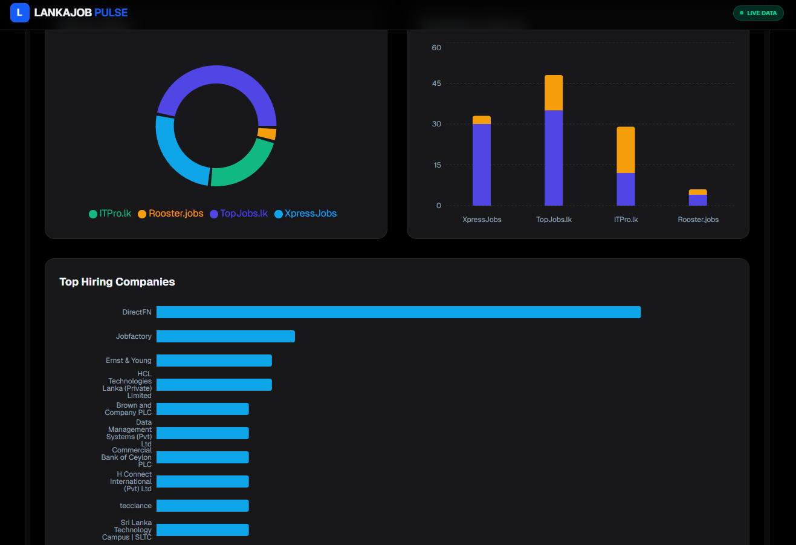
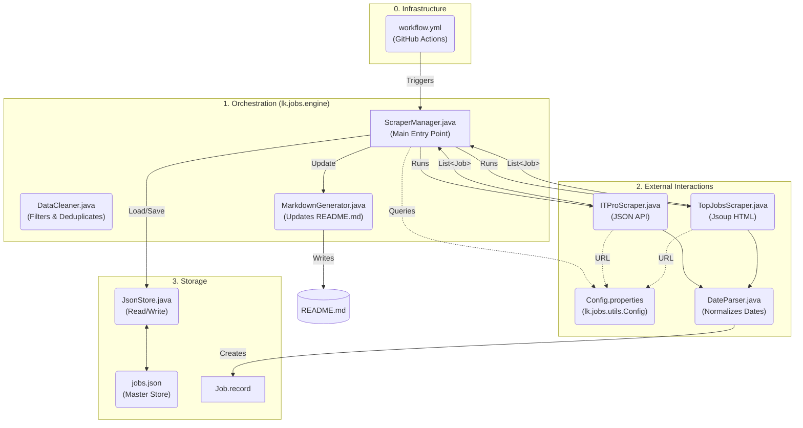

# 🇱🇰 Sri Lanka Software Engineering Jobs | 2026 Tracker [](https://t.me/SL_Software_Jobs)
Looking for software engineering jobs in Sri Lanka? This tracker updates daily with intern, junior, and senior IT roles across Colombo and beyond
Automated Software Engineering Job Tracker for Sri Lanka. Scrapes and categorizes Intern, Associate, and SE roles daily using Java (Jsoup) and GitHub Actions.

> [!TIP]
> **Help keep this project alive!** If this tool helped you find a lead today, please [**Star ⭐ the repo**](https://github.com/Senadeera-NK/sri-lanka-software-jobs). It’s how I measure the impact on our dev community! 🇱🇰

> [!IMPORTANT]
> **Automatic Staleness Purge:** The engine automatically removes listings older than **14 days**, ensuring the feed stays relevant and high-signal.

> **Live Analytics & Daily Software Job Tracker for Sri Lanka**

[📊 View Live Dashboard](https://sri-lanka-software-jobs.vercel.app/)

 
*Click the link above to see real-time trends, seniority distribution, and top hiring companies.*

## 📊 Current Job Openings
> 🟢 **Last Updated:** June 10,2:36 PM (Just now)  | **Total Jobs Found:** 220

### 🎓 Internships & Trainees  (33)

| Title | Company | Level  | Posted | Source |
| :--- | :--- | :--- | :--- | :--- |
| [Intern - QA](https://xpress.jobs/jobs/view/284564) | XpressJobs | Intern | 37&nbsp;secs&nbsp;ago | XpressJobs |
| [Intern - Mobile Development](https://www.topjobs.lk/employer/JobAdvertismentServlet?ac=0000000484&jc=0001505633&ec=0000000651) | Epic Lanka (Pvt) Ltd | Intern | 14&nbsp;hours&nbsp;ago | TopJobs.lk |
| [Intern - UI \| UX Engineer](https://www.topjobs.lk/employer/JobAdvertismentServlet?ac=0000000484&jc=0001508198&ec=0000000651) | Epic Lanka (Pvt) Ltd | Intern | 14&nbsp;hours&nbsp;ago | TopJobs.lk |
| [🚀 Internship Opportunity – QA (Quality Assurance)](https://rooster.jobs/jobs/517946) | Zegates International Private Limited | Intern | 21&nbsp;hours&nbsp;ago | Rooster.jobs |
| [Odoo Developer Intern](https://itpro.lk/job/13973/odoo-developer-intern-at-everestx-technologies/) | EverestX Technologies | Intern | 22&nbsp;hours&nbsp;ago | ITPro.lk |
| [Software Engineering Internship](https://itpro.lk/job/13965/software-engineering-internship-at-99nex-technologies/) | 99NEX Technologies | Intern | 2&nbsp;days&nbsp;ago | ITPro.lk |
| [QA Intern](https://itpro.lk/job/13964/qa-intern-at-axzell-innovations/) | axzell innovations | Intern | 2&nbsp;days&nbsp;ago | ITPro.lk |
| [Software Engineer Intern - .NET](https://itpro.lk/job/13962/software-engineer-intern-net-at-navitsa/) | Navitsa | Intern | 2&nbsp;days&nbsp;ago | ITPro.lk |
| [Software Engineering Internship - React](https://itpro.lk/job/13960/software-engineering-internship-react-at-everestx-technologies/) | EverestX Technologies | Intern | 3&nbsp;days&nbsp;ago | ITPro.lk |
| [Software Engineering Internship - Java](https://itpro.lk/job/13959/software-engineering-internship-java-at-everestx-technologies/) | EverestX Technologies | Intern | 3&nbsp;days&nbsp;ago | ITPro.lk |
| [Software Engineering Intern](https://itpro.lk/job/13954/software-engineering-intern-at-synexis-technologies-pvt-ltd/) | Synexis Technologies Pvt Ltd | Intern | 3&nbsp;days&nbsp;ago | ITPro.lk |
| [Software Quality Assurance (QA) – Intern](https://itpro.lk/job/13953/software-quality-assurance-qa-intern-at-cloud-syntex/) | Cloud Syntex | Intern | 4&nbsp;days&nbsp;ago | ITPro.lk |
| [Intern Software Engineer](https://itpro.lk/job/13951/intern-software-engineer-at-hrock-digital/) | HROCK Digital | Intern | 4&nbsp;days&nbsp;ago | ITPro.lk |
| [Intern - Software Engineering](https://itpro.lk/job/13945/intern-software-engineering-at-xigenix/) | XigeniX | Intern | 5&nbsp;days&nbsp;ago | ITPro.lk |
| [Automation Engineer Intern](https://www.topjobs.lk/employer/JobAdvertismentServlet?ac=DEFZZZ&jc=0001508395&ec=DEFZZZ) | Cube Networks Lanka (Pvt) Limited | Intern | 5&nbsp;days&nbsp;ago | TopJobs.lk |
| [Software Engineer (Intern)](https://www.topjobs.lk/employer/JobAdvertismentServlet?ac=DEFZZZ&jc=0001509087&ec=DEFZZZ) | Spherehead Technologies (Pvt) Ltd | Intern | 5&nbsp;days&nbsp;ago | TopJobs.lk |
| [Software Engineer / Intern](https://itpro.lk/job/13926/software-engineer-intern-at-emed-care-lk/) | eMed Care LK | Intern | 7&nbsp;days&nbsp;ago | ITPro.lk |
| [Flutter Developer (Intern \| Associate)](https://www.topjobs.lk/employer/JobAdvertismentServlet?ac=DEFZZZ&jc=0001507885&ec=DEFZZZ) | Muve Mobility (Pvt) Ltd | Intern | 7&nbsp;days&nbsp;ago | TopJobs.lk |
| [Software Engineering Intern](https://itpro.lk/job/13910/software-engineering-intern-at-axcito/) | axcito | Intern | 7&nbsp;days&nbsp;ago | ITPro.lk |
| [Intern - Cloud Solutions](https://www.topjobs.lk/employer/JobAdvertismentServlet?ac=DEFZZZ&jc=0001503044&ec=DEFZZZ) | VitalHub Innovations Lab | Intern | 7&nbsp;days&nbsp;ago | TopJobs.lk |
| [Internship - Software Engineer](https://itpro.lk/job/12774/internship-software-engineer-at-erav-technologies-pvt-ltd/) | Erav Technologies (Pvt) Ltd | Intern | 8&nbsp;days&nbsp;ago | ITPro.lk |
| [Software Engineer Intern](https://itpro.lk/job/13904/software-engineer-intern-at-rightmo-web-solution/) | Rightmo Web Solution | Intern | 8&nbsp;days&nbsp;ago | ITPro.lk |
| [Software Engineering Intern](https://itpro.lk/job/13879/software-engineering-intern-at-explore-vacations-travels-pvt-ltd/) | Explore Vacations & Travels (Pvt) Ltd | Intern | 11&nbsp;days&nbsp;ago | ITPro.lk |
| [Android Developer Intern \| Paid Onsite](https://xpress.jobs/jobs/view/290297) | Era Biz Solutions (Pvt) Ltd | Intern | 11&nbsp;days&nbsp;ago | XpressJobs |
| [Intern - Information Security](https://xpress.jobs/jobs/view/291210) | NDB Bank | Intern | 12&nbsp;days&nbsp;ago | XpressJobs |
| [Intern - QA Engineer](https://itpro.lk/job/13873/intern-qa-engineer-at-zuse-technologies/) | Zuse Technologies | Intern | 12&nbsp;days&nbsp;ago | ITPro.lk |
| [Intern Software Engineer - Contract](https://www.topjobs.lk/employer/JobAdvertismentServlet?ac=DEFZZZ&jc=0001506637&ec=DEFZZZ) | HRC Labs | Intern | 12&nbsp;days&nbsp;ago | TopJobs.lk |
| [QA Engineer - Intern](https://www.topjobs.lk/employer/JobAdvertismentServlet?ac=DEFZZZ&jc=0001506564&ec=DEFZZZ) | eBuilder Technology Center (Pvt) Ltd | Intern | 12&nbsp;days&nbsp;ago | TopJobs.lk |
| [QA & SEO Intern Neo Solution](https://itpro.lk/job/12206/qa-seo-intern-neo-solution-at-neo-solution/) | Neo Solution | Intern | 12&nbsp;days&nbsp;ago | ITPro.lk |
| [Software Engineering - Intern](https://itpro.lk/job/13867/software-engineering-intern-at-qdesk-ai-pvt-ltd/) | Qdesk AI Pvt Ltd | Intern | 12&nbsp;days&nbsp;ago | ITPro.lk |
| [Intern - Product Development (1)](https://www.topjobs.lk/employer/JobAdvertismentServlet?ac=0000000094&jc=0001506264&ec=0000000111) | MAS Holdings | Intern | 13&nbsp;days&nbsp;ago | TopJobs.lk |
| [Software Development Intern](https://www.topjobs.lk/employer/JobAdvertismentServlet?ac=DEFZZZ&jc=0001505941&ec=DEFZZZ) | Dynamical Systems Lanka | Intern | 13&nbsp;days&nbsp;ago | TopJobs.lk |
| [Intern – Quality Assurance (QA)](https://itpro.lk/job/13848/intern-quality-assurance-qa-at-digital-health-private-limited/) | Digital Health Private Limited | Intern | 14&nbsp;days&nbsp;ago | ITPro.lk |

---

### 💻 Associate & Junior/SE Roles  (120)

| Title | Company | Level  | Posted | Source |
| :--- | :--- | :--- | :--- | :--- |
| [Head of Information Security](https://xpress.jobs/jobs/view/293760) | SMB Finance PLC | Junior/SE | 34&nbsp;secs&nbsp;ago | XpressJobs |
| [Database Administrator - Oracle](https://xpress.jobs/jobs/view/293940) | Melsta Technologies (Pvt) Ltd | Junior/SE | 36&nbsp;secs&nbsp;ago | XpressJobs |
| [Software Engineer / ABAP Developer](https://xpress.jobs/jobs/view/294358) | Lanka Walltiles PLC | Junior/SE | 40&nbsp;secs&nbsp;ago | XpressJobs |
| [QA Engineer (US Working Hours)](https://xpress.jobs/jobs/view/294752) | Innobot | Junior/SE | 42&nbsp;secs&nbsp;ago | XpressJobs |
| [QA Engineer](https://xpress.jobs/jobs/view/295232) | Innobot | Junior/SE | 50&nbsp;secs&nbsp;ago | XpressJobs |
| [AI and Automation Engineer](https://xpress.jobs/jobs/view/295781) | TGT Global | Junior/SE | 55&nbsp;secs&nbsp;ago | XpressJobs |
| [Security Analyst](https://xpress.jobs/jobs/view/295783) | TGT Global | Junior/SE | 55&nbsp;secs&nbsp;ago | XpressJobs |
| [Quality Assurance Engineer](https://xpress.jobs/jobs/view/296035) | Davton Limited | Junior/SE | 1&nbsp;mins&nbsp;ago | XpressJobs |
| [Junior Executive Grade - Information Security Analyst](https://xpress.jobs/jobs/view/296069) | Dialog Finance PLC | Junior/SE | 1&nbsp;mins&nbsp;ago | XpressJobs |
| [Software Engineering , Artificial Intelligence Lecturers (Fu...](https://xpress.jobs/jobs/view/296227) | Campus Direct | Junior/SE | 1&nbsp;mins&nbsp;ago | XpressJobs |
| [Client Acquisition Executive (Enterprise Software Solutions)](https://xpress.jobs/jobs/view/296083) | Infox Global (Pvt.) Ltd. | Junior/SE | 1&nbsp;mins&nbsp;ago | XpressJobs |
| [Software Engineer - Mobile](https://xpress.jobs/jobs/view/296436) | Mobitel (Pvt) Ltd | Junior/SE | 1&nbsp;mins&nbsp;ago | XpressJobs |
| [Walk In Interviews \| Cyber Security](https://xpress.jobs/jobs/view/291654) | HCL Technologies Lanka (Private) Limited | Junior/SE | 1&nbsp;mins&nbsp;ago | XpressJobs |
| [Walk In Interviews \| Graduate Engineer (Analyst) - Fresh Graduates](https://xpress.jobs/jobs/view/293576) | HCL Technologies Lanka (Private) Limited | Junior/SE | 1&nbsp;mins&nbsp;ago | XpressJobs |
| [Walk In Interview \| Cyber Security (Fresh Graduates)](https://xpress.jobs/jobs/view/293588) | HCL Technologies Lanka (Private) Limited | Junior/SE | 1&nbsp;mins&nbsp;ago | XpressJobs |
| [Walk In Interview \| Graduate Engineering (Fresh Graduates)](https://xpress.jobs/jobs/view/293604) | HCL Technologies Lanka (Private) Limited | Junior/SE | 1&nbsp;mins&nbsp;ago | XpressJobs |
| [Walk In Interviews \| Graduate Engineer Analyst - Infrastruc...](https://xpress.jobs/jobs/view/293590) | HCL Technologies Lanka (Private) Limited | Junior/SE | 1&nbsp;mins&nbsp;ago | XpressJobs |
| [Data Governance Officer](https://xpress.jobs/jobs/view/296459) | Brown and Company PLC | Junior/SE | 1&nbsp;mins&nbsp;ago | XpressJobs |
| [Quality Assurance Engineer](https://itpro.lk/job/13979/quality-assurance-engineer-at-orysys-limited/) | Orysys Limited | Junior/SE | 5&nbsp;hours&nbsp;ago | ITPro.lk |
| [Full Stack Developer](https://itpro.lk/job/13978/full-stack-developer-at-stalione-lanka-pvt-ltd/) | Stalione Lanka (Pvt) Ltd | Junior/SE | 13&nbsp;hours&nbsp;ago | ITPro.lk |
| [Golang API Developer](https://www.topjobs.lk/employer/JobAdvertismentServlet?ac=DEFZZZ&jc=0001505547&ec=DEFZZZ) | Thakshana Technologies (Private) Limited | Junior/SE | 14&nbsp;hours&nbsp;ago | TopJobs.lk |
| [Full Stack Developer](https://www.topjobs.lk/employer/JobAdvertismentServlet?ac=DEFZZZ&jc=0001505542&ec=DEFZZZ) | Thakshana Technologies (Private) Limited | Junior/SE | 14&nbsp;hours&nbsp;ago | TopJobs.lk |
| [QA Automation \| Release Validation Engineer](https://www.topjobs.lk/employer/JobAdvertismentServlet?ac=DEFZZZ&jc=0001505492&ec=DEFZZZ) | Capsicum Labs | Junior/SE | 14&nbsp;hours&nbsp;ago | TopJobs.lk |
| [Full Stack Developer (AI - Powered Development)](https://www.topjobs.lk/employer/JobAdvertismentServlet?ac=DEFZZZ&jc=0001505484&ec=DEFZZZ) | Capsicum Labs | Junior/SE | 14&nbsp;hours&nbsp;ago | TopJobs.lk |
| [Software Engineer - Python & Cloud (Backend)](https://www.topjobs.lk/employer/JobAdvertismentServlet?ac=DEFZZZ&jc=0001508193&ec=DEFZZZ) | Affixcon Pty Ltd | Junior/SE | 14&nbsp;hours&nbsp;ago | TopJobs.lk |
| [Quality Assurance Engineer](https://www.topjobs.lk/employer/JobAdvertismentServlet?ac=DEFZZZ&jc=0001510792&ec=DEFZZZ) | RedOwl Labs (Pvt) Ltd | Junior/SE | 14&nbsp;hours&nbsp;ago | TopJobs.lk |
| [Walk In Interview \| Collaboration Tools (Cloud) (Fresh Graduates)](https://xpress.jobs/jobs/view/293587) | HCL Technologies Lanka (Private) Limited | Junior/SE | 19&nbsp;hours&nbsp;ago | XpressJobs |
| [Risk and Governance Engineer](https://xpress.jobs/jobs/view/293649) | Innobot | Junior/SE | 19&nbsp;hours&nbsp;ago | XpressJobs |
| [Big Data Engineer (1)](https://www.topjobs.lk/employer/JobAdvertismentServlet?ac=0000000271&jc=0001420855&ec=0000000350) | CMS (Pvt) Ltd | Junior/SE | Yesterday | TopJobs.lk |
| [Full Stack .Net Engineer (1)](https://www.topjobs.lk/employer/JobAdvertismentServlet?ac=0000000271&jc=0001490551&ec=0000000350) | CMS (Pvt) Ltd | Junior/SE | Yesterday | TopJobs.lk |
| [Full Stack Web Developer](https://www.topjobs.lk/employer/JobAdvertismentServlet?ac=0000000501&jc=0001510249&ec=0000000681) | Oscar Wylee | Junior/SE | Yesterday | TopJobs.lk |
| [IT Executive \| Web Developer](https://www.topjobs.lk/employer/JobAdvertismentServlet?ac=DEFZZZ&jc=0001510062&ec=DEFZZZ) | Company Name Withheld | Junior/SE | Yesterday | TopJobs.lk |
| [Full Stack Developer - React & .Net](https://www.topjobs.lk/employer/JobAdvertismentServlet?ac=DEFZZZ&jc=0001505341&ec=DEFZZZ) | Ateam Software (Pvt) Ltd | Junior/SE | Yesterday | TopJobs.lk |
| [Software Engineer - Mobile](https://www.topjobs.lk/employer/JobAdvertismentServlet?ac=DEFZZZ&jc=0001505347&ec=DEFZZZ) | Ateam Software (Pvt) Ltd | Junior/SE | Yesterday | TopJobs.lk |
| [Quality Assurance Engineer](https://xpress.jobs/jobs/view/293111) | Brown and Company PLC | Junior/SE | 2&nbsp;days&nbsp;ago | XpressJobs |
| [Enterprise Solution Architect](https://xpress.jobs/jobs/view/293267) | Ernst & Young | Junior/SE | 2&nbsp;days&nbsp;ago | XpressJobs |
| [Head of AI](https://xpress.jobs/jobs/view/293292) | Omobio | Junior/SE | 2&nbsp;days&nbsp;ago | XpressJobs |
| [Cyber Security Specialist (L2)](https://xpress.jobs/jobs/view/292589) | HCL Technologies Lanka (Private) Limited | Junior/SE | 2&nbsp;days&nbsp;ago | XpressJobs |
| [Junior Quality Assurance Engineer](https://xpress.jobs/jobs/view/294330) | Davton Limited | Junior/SE | 2&nbsp;days&nbsp;ago | XpressJobs |
| [Software Engineer -SQL Developer (1)](https://www.topjobs.lk/employer/JobAdvertismentServlet?ac=0000000375&jc=0001509517&ec=0000000492) | Jobfactory | Junior/SE | 2&nbsp;days&nbsp;ago | TopJobs.lk |
| [Associate Quality Assurance Engineer (1)](https://www.topjobs.lk/employer/JobAdvertismentServlet?ac=0000000375&jc=0001509516&ec=0000000492) | Jobfactory | Associate | 2&nbsp;days&nbsp;ago | TopJobs.lk |
| [Associate Software Engineer- Java/ .NET (1)](https://www.topjobs.lk/employer/JobAdvertismentServlet?ac=0000000375&jc=0001509515&ec=0000000492) | Jobfactory | Associate | 2&nbsp;days&nbsp;ago | TopJobs.lk |
| [Analyst - Cyber Security (1)](https://www.topjobs.lk/employer/JobAdvertismentServlet?ac=0000000017&jc=0001509956&ec=0000000017) | Colombo Stock Exchange | Junior/SE | 2&nbsp;days&nbsp;ago | TopJobs.lk |
| [Cloud Engineer - Microsoft Azure Infrastructure](https://www.topjobs.lk/employer/JobAdvertismentServlet?ac=DEFZZZ&jc=0001509617&ec=DEFZZZ) | Elevate Solutions (Pvt) Ltd | Junior/SE | 2&nbsp;days&nbsp;ago | TopJobs.lk |
| [DevOps Engineer](https://www.topjobs.lk/employer/JobAdvertismentServlet?ac=DEFZZZ&jc=0001509614&ec=DEFZZZ) | Stockpile | Junior/SE | 2&nbsp;days&nbsp;ago | TopJobs.lk |
| [Cloud Engineer - Microsoft 365 (MWP)](https://www.topjobs.lk/employer/JobAdvertismentServlet?ac=DEFZZZ&jc=0001509607&ec=DEFZZZ) | Elevate Solutions (Pvt) Ltd | Junior/SE | 2&nbsp;days&nbsp;ago | TopJobs.lk |
| [Software Developer](https://www.topjobs.lk/employer/JobAdvertismentServlet?ac=DEFZZZ&jc=0001509576&ec=DEFZZZ) | Blockchain Healthcare Group (Pvt) Ltd | Junior/SE | 2&nbsp;days&nbsp;ago | TopJobs.lk |
| [Software Engineer](https://www.topjobs.lk/employer/JobAdvertismentServlet?ac=DEFZZZ&jc=0001509498&ec=DEFZZZ) | SPOS (Pvt) Ltd | Junior/SE | 2&nbsp;days&nbsp;ago | TopJobs.lk |
| [Senior Associate - Data Analytics (Power BI & Microsoft Ecos...](https://www.topjobs.lk/employer/JobAdvertismentServlet?ac=0000000064&jc=0001509967&ec=0000000445) | H Connect International (Pvt) Ltd | Associate | 2&nbsp;days&nbsp;ago | TopJobs.lk |
| [Junior Web Developer](https://www.topjobs.lk/employer/JobAdvertismentServlet?ac=DEFZZZ&jc=0001504562&ec=DEFZZZ) | Ignite Media Vision (Pvt) Ltd | Junior/SE | 2&nbsp;days&nbsp;ago | TopJobs.lk |
| [Primavera P6 Engineer \| Remote](https://xpress.jobs/jobs/view/294295) | Businessfocus360 | Junior/SE | 3&nbsp;days&nbsp;ago | XpressJobs |
| [Software Engineer (Python)](https://xpress.jobs/jobs/view/294754) | Innobot | Junior/SE | 3&nbsp;days&nbsp;ago | XpressJobs |
| [Software Engineers](https://xpress.jobs/jobs/view/290236) | Data Management Systems (Pvt) Ltd | Junior/SE | 3&nbsp;days&nbsp;ago | XpressJobs |
| [Python Developer - Odoo](https://itpro.lk/job/13956/python-developer-odoo-at-everestx-technologies/) | EverestX Technologies | Junior/SE | 3&nbsp;days&nbsp;ago | ITPro.lk |
| [Game Developer](https://itpro.lk/job/13948/game-developer-at-kenora-pvt-ltd/) | Kenora (Pvt) Ltd | Junior/SE | 4&nbsp;days&nbsp;ago | ITPro.lk |
| [Software Engineer (Male)](https://www.topjobs.lk/employer/JobAdvertismentServlet?ac=0000000223&jc=0001508857&ec=0000000266) | Data Management Systems (Pvt) Ltd | Junior/SE | 5&nbsp;days&nbsp;ago | TopJobs.lk |
| [IT Scrum Master](https://www.topjobs.lk/employer/JobAdvertismentServlet?ac=DEFZZZ&jc=0001508844&ec=DEFZZZ) | Jinadasa Consulting | Junior/SE | 5&nbsp;days&nbsp;ago | TopJobs.lk |
| [Management Trainee - AI (1)](https://www.topjobs.lk/employer/JobAdvertismentServlet?ac=0000000064&jc=0001509104&ec=0000000603) | Hirdaramani - H CONNECT (PVT) LIMITED | Associate | 5&nbsp;days&nbsp;ago | TopJobs.lk |
| [Mid Level React Developer](https://www.topjobs.lk/employer/JobAdvertismentServlet?ac=DEFZZZ&jc=0001509041&ec=DEFZZZ) | Esoft Technology | Junior/SE | 5&nbsp;days&nbsp;ago | TopJobs.lk |
| [Associate/ Fullstack Developer (1)](https://www.topjobs.lk/employer/JobAdvertismentServlet?ac=0000000201&jc=0001509163&ec=0000000256) | Samson Rubber Industries | Associate | 5&nbsp;days&nbsp;ago | TopJobs.lk |
| [Software Architect \| Colombo](https://xpress.jobs/jobs/view/292351) | Mavip Infotech | Junior/SE | 6&nbsp;days&nbsp;ago | XpressJobs |
| [Applied ML Engineer - Autonomous Drones](https://xpress.jobs/jobs/view/292747) | The Scouts | Junior/SE | 6&nbsp;days&nbsp;ago | XpressJobs |
| [Backend & Platform Engineer](https://itpro.lk/job/13937/backend-platform-engineer-at-mo-marketplace/) | MO Marketplace | Junior/SE | 6&nbsp;days&nbsp;ago | ITPro.lk |
| [Fullstack Developer - Gampaha](https://itpro.lk/job/13933/fullstack-developer-gampaha-at-ants-creation-pvt-ltd/) | Ants Creation (Pvt) Ltd | Junior/SE | 6&nbsp;days&nbsp;ago | ITPro.lk |
| [Fullstack Developer](https://itpro.lk/job/13933/fullstack-developer-at-ants-creation-pvt-ltd/) | Ants Creation (Pvt) Ltd | Junior/SE | 6&nbsp;days&nbsp;ago | ITPro.lk |
| [Full Stack Engineer](https://itpro.lk/job/13931/full-stack-engineer-at-mo-marketplace/) | MO Marketplace | Junior/SE | 6&nbsp;days&nbsp;ago | ITPro.lk |
| [NetSuite Integration Engineer](https://itpro.lk/job/13927/netsuite-integration-engineer-at-invenza-digital-technologies/) | Invenza Digital Technologies | Junior/SE | 6&nbsp;days&nbsp;ago | ITPro.lk |
| [Devops & IT Infrastucture Engineer \| Nawam Mawatha, Colombo 02](https://xpress.jobs/jobs/view/292023) | Victory Company (Igaming BPO) | Junior/SE | 7&nbsp;days&nbsp;ago | XpressJobs |
| [Full Stack Developer (Spring Boot & React)](https://itpro.lk/job/13920/full-stack-developer-spring-boot-react-at-fintechnology-asia-pacific-lanka-ltd/) | Fintechnology Asia Pacific Lanka Ltd | Junior/SE | 7&nbsp;days&nbsp;ago | ITPro.lk |
| [Software Architect](https://itpro.lk/job/13918/software-architect-at-tillmax/) | TILLMAX | Junior/SE | 7&nbsp;days&nbsp;ago | ITPro.lk |
| [Software Engineer JAVA (1)](https://www.topjobs.lk/employer/JobAdvertismentServlet?ac=0000000492&jc=0001507612&ec=0000000661) | DirectFN | Junior/SE | 7&nbsp;days&nbsp;ago | TopJobs.lk |
| [Partners - Web Development & Design Projects](https://www.topjobs.lk/employer/JobAdvertismentServlet?ac=DEFZZZ&jc=0001508002&ec=DEFZZZ) | PB Creative | Junior/SE | 7&nbsp;days&nbsp;ago | TopJobs.lk |
| [Data Analyst \| IT](https://www.topjobs.lk/employer/JobAdvertismentServlet?ac=DEFZZZ&jc=0001507692&ec=DEFZZZ) | Techome Technologies (Pvt) Ltd | Junior/SE | 7&nbsp;days&nbsp;ago | TopJobs.lk |
| [Software QA Engineer (Manual & Automation)](https://www.topjobs.lk/employer/JobAdvertismentServlet?ac=DEFZZZ&jc=0001507643&ec=DEFZZZ) | Peercore Nexgen (Pvt) Ltd | Junior/SE | 7&nbsp;days&nbsp;ago | TopJobs.lk |
| [Software Engineer - Full Stack (1)](https://www.topjobs.lk/employer/JobAdvertismentServlet?ac=0000000492&jc=0001507616&ec=0000000661) | DirectFN | Junior/SE | 7&nbsp;days&nbsp;ago | TopJobs.lk |
| [Database Administrator (1)](https://www.topjobs.lk/employer/JobAdvertismentServlet?ac=0000000492&jc=0001507613&ec=0000000661) | DirectFN | Junior/SE | 7&nbsp;days&nbsp;ago | TopJobs.lk |
| [Associate AI/ML & Data Science Engineer](https://www.topjobs.lk/employer/JobAdvertismentServlet?ac=DEFZZZ&jc=0001508071&ec=DEFZZZ) | PCS Techno | Associate | 7&nbsp;days&nbsp;ago | TopJobs.lk |
| [Trainee Wordpress Developer](https://itpro.lk/job/13911/trainee-wordpress-developer-at-enliven-designers/) | Enliven Designers | Associate | 7&nbsp;days&nbsp;ago | ITPro.lk |
| [Associate QA Engineer](https://itpro.lk/job/13907/associate-qa-engineer-at-polygon-agro/) | Polygon Agro | Associate | 7&nbsp;days&nbsp;ago | ITPro.lk |
| [WordPress Developer (DIVI Theme) \| Work From Home](https://xpress.jobs/jobs/view/292975) | Aswin WebDesign | Junior/SE | 8&nbsp;days&nbsp;ago | XpressJobs |
| [Full Stack Software Engineer (MERN \| Next.js \| NestJs \| Golang)](https://itpro.lk/job/13905/full-stack-software-engineer-mern-nextjs-nestjs-golang-at-botcalm/) | BotCalm | Junior/SE | 8&nbsp;days&nbsp;ago | ITPro.lk |
| [Quality Assurance Engineer](https://itpro.lk/job/13900/quality-assurance-engineer-at-brown-company-plc/) | Brown & Company PLC | Junior/SE | 8&nbsp;days&nbsp;ago | ITPro.lk |
| [Cyber Security Engineer (1)](https://www.topjobs.lk/employer/JobAdvertismentServlet?ac=0000000375&jc=0001507520&ec=0000000492) | Jobfactory | Junior/SE | 8&nbsp;days&nbsp;ago | TopJobs.lk |
| [AI Engineer (1)](https://www.topjobs.lk/employer/JobAdvertismentServlet?ac=0000000146&jc=0001507517&ec=0000000178) | Nawaloka Hospitals PLC | Junior/SE | 8&nbsp;days&nbsp;ago | TopJobs.lk |
| [Full Stack Engineer (Java)](https://www.topjobs.lk/employer/JobAdvertismentServlet?ac=DEFZZZ&jc=0001507442&ec=DEFZZZ) | MedCubeUSA | Junior/SE | 8&nbsp;days&nbsp;ago | TopJobs.lk |
| [Trainee Wordpress Developer](https://www.topjobs.lk/employer/JobAdvertismentServlet?ac=DEFZZZ&jc=0001507136&ec=DEFZZZ) | Enliven Designers | Associate | 8&nbsp;days&nbsp;ago | TopJobs.lk |
| [Quality Assurance Engineer](https://itpro.lk/job/13798/quality-assurance-engineer-at-medfuture-healthcare/) | Medfuture Healthcare | Junior/SE | 8&nbsp;days&nbsp;ago | ITPro.lk |
| [IT Helpdesk Engineer \| Awissawella](https://xpress.jobs/jobs/view/290786) | Micronet Global Services (Pvt) Ltd | Junior/SE | 9&nbsp;days&nbsp;ago | XpressJobs |
| [Graduate Engineer Analyst - Infrastructure Services (Data Ce...](https://xpress.jobs/jobs/view/291664) | HCL Technologies Lanka (Private) Limited | Junior/SE | 9&nbsp;days&nbsp;ago | XpressJobs |
| [Cyber Security (Fresh Graduates)](https://xpress.jobs/jobs/view/291665) | HCL Technologies Lanka (Private) Limited | Junior/SE | 9&nbsp;days&nbsp;ago | XpressJobs |
| [Collaboration Tools (Cloud) (Fresh Graduates)](https://xpress.jobs/jobs/view/291661) | HCL Technologies Lanka (Private) Limited | Junior/SE | 9&nbsp;days&nbsp;ago | XpressJobs |
| [Graduate Engineering (Fresh Graduates)](https://xpress.jobs/jobs/view/291657) | HCL Technologies Lanka (Private) Limited | Junior/SE | 9&nbsp;days&nbsp;ago | XpressJobs |
| [Graduate Engineer (Analyst) - Fresh Graduates](https://xpress.jobs/jobs/view/291656) | HCL Technologies Lanka (Private) Limited | Junior/SE | 9&nbsp;days&nbsp;ago | XpressJobs |
| [Quality Assurance Engineer](https://www.topjobs.lk/employer/JobAdvertismentServlet?ac=DEFZZZ&jc=0001502563&ec=DEFZZZ) | Medfuture | Junior/SE | 9&nbsp;days&nbsp;ago | TopJobs.lk |
| [Quality Assurance Engineer (1)](https://www.topjobs.lk/employer/JobAdvertismentServlet?ac=0000000221&jc=0001506912&ec=0000000264) | Browns Group Of Companies | Junior/SE | 9&nbsp;days&nbsp;ago | TopJobs.lk |
| [.NET Software Engineer](https://itpro.lk/job/13883/net-software-engineer-at-ck-orbits/) | CK Orbits | Junior/SE | 10&nbsp;days&nbsp;ago | ITPro.lk |
| [Hayleys Lifesciences \| Executive / Junior Executive - Infor...](https://xpress.jobs/jobs/view/290714) | Hayleys Aventura (Pvt) Ltd | Junior/SE | 10&nbsp;days&nbsp;ago | XpressJobs |
| [WordPress Developer](https://xpress.jobs/jobs/view/281093) | Apex Consulting | Junior/SE | 10&nbsp;days&nbsp;ago | XpressJobs |
| [Enterprise Data Architect](https://www.topjobs.lk/employer/JobAdvertismentServlet?ac=DEFZZZ&jc=0001506492&ec=DEFZZZ) | Orysys Limited | Junior/SE | 12&nbsp;days&nbsp;ago | TopJobs.lk |
| [Data Engineer](https://www.topjobs.lk/employer/JobAdvertismentServlet?ac=DEFZZZ&jc=0001506487&ec=DEFZZZ) | ORYSYS Limited | Junior/SE | 12&nbsp;days&nbsp;ago | TopJobs.lk |
| [Data Protection Officer](https://www.topjobs.lk/employer/JobAdvertismentServlet?ac=DEFZZZ&jc=0001506446&ec=DEFZZZ) | Abans Finance PLC | Junior/SE | 12&nbsp;days&nbsp;ago | TopJobs.lk |
| [.NET Developer](https://www.topjobs.lk/employer/JobAdvertismentServlet?ac=DEFZZZ&jc=0001506344&ec=DEFZZZ) | XGenLabs | Junior/SE | 12&nbsp;days&nbsp;ago | TopJobs.lk |
| [Quality Assurance Engineer](https://www.topjobs.lk/employer/JobAdvertismentServlet?ac=DEFZZZ&jc=0001506288&ec=DEFZZZ) | Paragon Software Lanka (Pvt) Ltd | Junior/SE | 12&nbsp;days&nbsp;ago | TopJobs.lk |
| [Full Stack Engineer (.NET & Angular)](https://www.topjobs.lk/employer/JobAdvertismentServlet?ac=DEFZZZ&jc=0001506697&ec=DEFZZZ) | Medcube USA | Junior/SE | 12&nbsp;days&nbsp;ago | TopJobs.lk |
| [RPA & AI Engineer (1)](https://www.topjobs.lk/employer/JobAdvertismentServlet?ac=DEFZZZ&jc=0001506649&ec=DEFZZZ) | Overdime Technologies (Pvt) Limited | Junior/SE | 12&nbsp;days&nbsp;ago | TopJobs.lk |
| [SOFTWARE ENGINEER — R&D](https://rooster.jobs/jobs/517778) | Arpico Energy | Junior/SE | 12&nbsp;days&nbsp;ago | Rooster.jobs |
| [Java Full-Stack Developer](https://itpro.lk/job/13865/java-fullstack-developer-at-hatchyard/) | Hatchyard | Junior/SE | 12&nbsp;days&nbsp;ago | ITPro.lk |
| [Software Engineer Full Stack](https://itpro.lk/job/13861/software-engineer-full-stack-at-directfn/) | DirectFN | Junior/SE | 13&nbsp;days&nbsp;ago | ITPro.lk |
| [Junior Algorithm Engineer - DSP - FPGA Engineer](https://www.topjobs.lk/employer/JobAdvertismentServlet?ac=DEFZZZ&jc=0001501331&ec=DEFZZZ) | Company Name Withheld | Junior/SE | 13&nbsp;days&nbsp;ago | TopJobs.lk |
| [Technical Developer - Odoo](https://www.topjobs.lk/employer/JobAdvertismentServlet?ac=DEFZZZ&jc=0001505919&ec=DEFZZZ) | My Accountant (Pvt) Ltd | Junior/SE | 13&nbsp;days&nbsp;ago | TopJobs.lk |
| [Associate QA Engineer](https://www.topjobs.lk/employer/JobAdvertismentServlet?ac=DEFZZZ&jc=0001505836&ec=DEFZZZ) | PCS Techno | Associate | 13&nbsp;days&nbsp;ago | TopJobs.lk |
| [Head of Cyber Security Governance and Compliance](https://xpress.jobs/jobs/view/289342) | Dialog Axiata PLC | Junior/SE | 14&nbsp;days&nbsp;ago | XpressJobs |
| [Associate Dev Ops Lead](https://xpress.jobs/jobs/view/289349) | Dialog Axiata PLC | Associate | 14&nbsp;days&nbsp;ago | XpressJobs |
| [Software Engineer](https://www.topjobs.lk/employer/JobAdvertismentServlet?ac=DEFZZZ&jc=0001505724&ec=DEFZZZ) | E Channeling | Junior/SE | 14&nbsp;days&nbsp;ago | TopJobs.lk |
| [Software Engineers \| Full Stack Developer](https://www.topjobs.lk/employer/JobAdvertismentServlet?ac=DEFZZZ&jc=0001505722&ec=DEFZZZ) | Concord Apparel (Pvt) Ltd | Junior/SE | 14&nbsp;days&nbsp;ago | TopJobs.lk |
| [Shopify Developer](https://www.topjobs.lk/employer/JobAdvertismentServlet?ac=DEFZZZ&jc=0001505670&ec=DEFZZZ) | Kelly Felder | Junior/SE | 14&nbsp;days&nbsp;ago | TopJobs.lk |
| [IT Executive - Business Systems & Data Analytics](https://www.topjobs.lk/employer/JobAdvertismentServlet?ac=DEFZZZ&jc=0001505585&ec=DEFZZZ) | Company Name Withheld | Junior/SE | 14&nbsp;days&nbsp;ago | TopJobs.lk |
| [Associate QA Engineer (1)](https://www.topjobs.lk/employer/JobAdvertismentServlet?ac=0000000375&jc=0001505525&ec=0000000492) | Jobfactory | Associate | 14&nbsp;days&nbsp;ago | TopJobs.lk |
| [Associate Software Engineer](https://itpro.lk/job/13847/associate-software-engineer-at-digital-health-private-limited/) | Digital Health Private Limited | Associate | 14&nbsp;days&nbsp;ago | ITPro.lk |
| [Junior Embedded Software Engineer (Security - Focused)](https://www.topjobs.lk/employer/JobAdvertismentServlet?ac=DEFZZZ&jc=0001500312&ec=DEFZZZ) | Thakshana Technologies (Private) Limited | Junior/SE | 14&nbsp;days&nbsp;ago | TopJobs.lk |

---

### 🚀 Senior & Lead Roles  (67)

| Title | Company | Level  | Posted | Source |
| :--- | :--- | :--- | :--- | :--- |
| [Technical Lead (AI, Software)](https://xpress.jobs/jobs/view/294316) | PBA Systems Pte Ltd | Senior | 38&nbsp;secs&nbsp;ago | XpressJobs |
| [Senior SQL and SSRS Developer](https://xpress.jobs/jobs/view/294354) | KriyaGo | Senior | 39&nbsp;secs&nbsp;ago | XpressJobs |
| [Senior Software Engineer (Python)](https://xpress.jobs/jobs/view/294753) | Innobot | Senior | 42&nbsp;secs&nbsp;ago | XpressJobs |
| [Senior Lecturer - Grade II / Lecturer / Lecturer (Probationa...](https://xpress.jobs/jobs/view/294873) | Sri Lanka Technology Campus | SLTC | Senior | 43&nbsp;secs&nbsp;ago | XpressJobs |
| [Senior Lecturer - Grade II / Lecturer / Lecturer (Probationa...](https://xpress.jobs/jobs/view/294874) | Sri Lanka Technology Campus | SLTC | Senior | 44&nbsp;secs&nbsp;ago | XpressJobs |
| [Senior Lecturer - Grade II / Lecturer / Lecturer (Probationa...](https://xpress.jobs/jobs/view/294875) | Sri Lanka Technology Campus | SLTC | Senior | 45&nbsp;secs&nbsp;ago | XpressJobs |
| [Senior Lecturer - Grade II / Lecturer / Lecturer (Probationa...](https://xpress.jobs/jobs/view/294876) | Sri Lanka Technology Campus | SLTC | Senior | 47&nbsp;secs&nbsp;ago | XpressJobs |
| [Senior WordPress / Shopify Developer](https://xpress.jobs/jobs/view/291712) | AmplifyD Pvt Ltd | Senior | 48&nbsp;secs&nbsp;ago | XpressJobs |
| [Senior Python Developer \| Remote](https://xpress.jobs/jobs/view/295181) | BlueOceanSP | Senior | 48&nbsp;secs&nbsp;ago | XpressJobs |
| [Senior Software / Automation Systems Engineer](https://xpress.jobs/jobs/view/295212) | Seaport Group | Senior | 49&nbsp;secs&nbsp;ago | XpressJobs |
| [Technical Lead - Python Focus](https://xpress.jobs/jobs/view/295233) | Innobot | Senior | 51&nbsp;secs&nbsp;ago | XpressJobs |
| [Team Lead ( Blockchain, Full-Stack & AI  )  - Remote](https://xpress.jobs/jobs/view/295307) | Advantage Group Australasia Pty. Ltd | Senior | 52&nbsp;secs&nbsp;ago | XpressJobs |
| [Tech Lead – AI & Platform Engineering \| Hybrid](https://xpress.jobs/jobs/view/295519) | Coderra | Senior | 53&nbsp;secs&nbsp;ago | XpressJobs |
| [Senior Systems Engineer](https://xpress.jobs/jobs/view/295700) | TGT Global | Senior | 54&nbsp;secs&nbsp;ago | XpressJobs |
| [Senior Full Stack Engineer](https://xpress.jobs/jobs/view/295780) | TGT Global | Senior | 54&nbsp;secs&nbsp;ago | XpressJobs |
| [Senior Ruby on Rails Developer](https://xpress.jobs/jobs/view/295828) | Archipelago | Senior | 56&nbsp;secs&nbsp;ago | XpressJobs |
| [Senior Go (Golang) Developer](https://xpress.jobs/jobs/view/295829) | Archipelago | Senior | 57&nbsp;secs&nbsp;ago | XpressJobs |
| [Senior AI and Automation Engineer](https://xpress.jobs/jobs/view/295951) | TGT Global | Senior | 1&nbsp;mins&nbsp;ago | XpressJobs |
| [Senior Software Engineer : Ruby on Rails](https://xpress.jobs/jobs/view/296299) | OXO Tech (Pvt) Ltd | Senior | 1&nbsp;mins&nbsp;ago | XpressJobs |
| [Senior Software Developer](https://xpress.jobs/jobs/view/296304) | Wizlearn Technologies Pte Ltd | Senior | 1&nbsp;mins&nbsp;ago | XpressJobs |
| [Senior Java Architect \| Colombo](https://xpress.jobs/jobs/view/296363) | YI CAN PTE. LTD. | Senior | 1&nbsp;mins&nbsp;ago | XpressJobs |
| [Senior Software Engineer](https://xpress.jobs/jobs/view/296419) | Dialog Axiata PLC | Senior | 1&nbsp;mins&nbsp;ago | XpressJobs |
| [Lead - DevOps](https://xpress.jobs/jobs/view/296422) | Dialog Axiata PLC | Senior | 1&nbsp;mins&nbsp;ago | XpressJobs |
| [Senior Data Engineer](https://xpress.jobs/jobs/view/296424) | Dialog Axiata PLC | Senior | 1&nbsp;mins&nbsp;ago | XpressJobs |
| [Senior Data Scientist](https://xpress.jobs/jobs/view/296425) | Dialog Axiata PLC | Senior | 1&nbsp;mins&nbsp;ago | XpressJobs |
| [Lead Data Scientist](https://xpress.jobs/jobs/view/296427) | Dialog Axiata PLC | Senior | 1&nbsp;mins&nbsp;ago | XpressJobs |
| [Senior Lead Engineer - IT Data Center](https://www.topjobs.lk/employer/JobAdvertismentServlet?ac=DEFZZZ&jc=0001508968&ec=DEFZZZ) | Commercial Bank of Ceylon PLC | Senior | 14&nbsp;hours&nbsp;ago | TopJobs.lk |
| [Senior Software Engineer](https://www.topjobs.lk/employer/JobAdvertismentServlet?ac=DEFZZZ&jc=0001510719&ec=DEFZZZ) | Infinity Innovators (Pvt) Ltd | Senior | 14&nbsp;hours&nbsp;ago | TopJobs.lk |
| [Tech Lead JAVA Angular (1)](https://www.topjobs.lk/employer/JobAdvertismentServlet?ac=0000000492&jc=0001510612&ec=0000000661) | DirectFN | Senior | 14&nbsp;hours&nbsp;ago | TopJobs.lk |
| [Senior Software Engineer - Spring Boot (1)](https://www.topjobs.lk/employer/JobAdvertismentServlet?ac=0000000492&jc=0001510606&ec=0000000661) | DirectFN | Senior | 14&nbsp;hours&nbsp;ago | TopJobs.lk |
| [Senior Automation Engineer (Python Focus)](https://xpress.jobs/jobs/view/291719) | Innobot | Senior | 19&nbsp;hours&nbsp;ago | XpressJobs |
| [Senior Software Engineer (React, .Net Core) - REF7802](https://rooster.jobs/jobs/517943) | Creative Software | Senior | Yesterday | Rooster.jobs |
| [Full Stack Developer / Tech Lead](https://xpress.jobs/jobs/view/294694) | Boomerang International | Senior | 2&nbsp;days&nbsp;ago | XpressJobs |
| [Senior Quality Assurance Engineer (1)](https://www.topjobs.lk/employer/JobAdvertismentServlet?ac=0000000001&jc=0001505237&ec=0000000001) | Genesiis Software Pvt Ltd | Senior | 2&nbsp;days&nbsp;ago | TopJobs.lk |
| [Principal Engineer cum Team Lead (AI, Software)](https://xpress.jobs/jobs/view/292616) | PBA Systems Pte Ltd | Senior | 6&nbsp;days&nbsp;ago | XpressJobs |
| [Senior Fullstack Developer](https://itpro.lk/job/13935/senior-fullstack-developer-at-ants-creation-pvt-ltd/) | Ants Creation (Pvt) Ltd | Senior | 6&nbsp;days&nbsp;ago | ITPro.lk |
| [Software Engineer (SE) & Senior Software Engineer (SSE)](https://www.topjobs.lk/employer/JobAdvertismentServlet?ac=DEFZZZ&jc=0001504104&ec=DEFZZZ) | SoftOne Group | Senior | 6&nbsp;days&nbsp;ago | TopJobs.lk |
| [Senior Software Developer - Contract](https://www.topjobs.lk/employer/JobAdvertismentServlet?ac=DEFZZZ&jc=0001508444&ec=DEFZZZ) | AA Japan (Pvt) Ltd | Senior | 6&nbsp;days&nbsp;ago | TopJobs.lk |
| [Senior Software Tester / QA Engineer](https://itpro.lk/job/13929/senior-software-tester-qa-engineer-at-robotic-assistance-devices/) | Robotic Assistance Devices | Senior | 6&nbsp;days&nbsp;ago | ITPro.lk |
| [Lead Automation Engineer (Python Focus)](https://xpress.jobs/jobs/view/291720) | Innobot | Senior | 7&nbsp;days&nbsp;ago | XpressJobs |
| [Senior Developer (Full Time) \| Work From Home](https://xpress.jobs/jobs/view/291850) | LocalCom Pty. Ltd | Senior | 7&nbsp;days&nbsp;ago | XpressJobs |
| [JAVA Tech Lead (1)](https://www.topjobs.lk/employer/JobAdvertismentServlet?ac=0000000492&jc=0001507619&ec=0000000661) | DirectFN | Senior | 7&nbsp;days&nbsp;ago | TopJobs.lk |
| [Senior Systems Engineer (1)](https://www.topjobs.lk/employer/JobAdvertismentServlet?ac=0000000492&jc=0001507615&ec=0000000661) | DirectFN | Senior | 7&nbsp;days&nbsp;ago | TopJobs.lk |
| [Tech Lead Java (1)](https://www.topjobs.lk/employer/JobAdvertismentServlet?ac=0000000492&jc=0001507626&ec=0000000661) | DirectFN | Senior | 7&nbsp;days&nbsp;ago | TopJobs.lk |
| [Senior Software Engineer Java Script (1)](https://www.topjobs.lk/employer/JobAdvertismentServlet?ac=0000000492&jc=0001507623&ec=0000000661) | DirectFN | Senior | 7&nbsp;days&nbsp;ago | TopJobs.lk |
| [JAVA Angular Tech Lead (1)](https://www.topjobs.lk/employer/JobAdvertismentServlet?ac=0000000492&jc=0001507618&ec=0000000661) | DirectFN | Senior | 7&nbsp;days&nbsp;ago | TopJobs.lk |
| [Senior Software Engineer (1)](https://www.topjobs.lk/employer/JobAdvertismentServlet?ac=0000000492&jc=0001507614&ec=0000000661) | DirectFN | Senior | 7&nbsp;days&nbsp;ago | TopJobs.lk |
| [Data Engineer/Senior Data Engineer (2)](https://www.topjobs.lk/employer/JobAdvertismentServlet?ac=0000000499&jc=0001507560&ec=0000000679) | R.M.D Consultants (Pvt) Ltd | Senior | 7&nbsp;days&nbsp;ago | TopJobs.lk |
| [ Senior Software Engineer / Software Engineer](https://itpro.lk/job/13909/-senior-software-engineer-software-engineer-at-axcito/) | axcito | Senior | 7&nbsp;days&nbsp;ago | ITPro.lk |
| [Senior Software Engineer (MERN \| Next.js \| NestJs \| Golang)](https://itpro.lk/job/13906/senior-software-engineer-mern-nextjs-nestjs-golang-at-botcalm/) | BotCalm | Senior | 8&nbsp;days&nbsp;ago | ITPro.lk |
| [Senior iOS Developer (Banking Applications)](https://www.topjobs.lk/employer/JobAdvertismentServlet?ac=DEFZZZ&jc=0001507402&ec=DEFZZZ) | Fortunaglobal (Pvt) Limited | Senior | 8&nbsp;days&nbsp;ago | TopJobs.lk |
| [Senior Software Engineer - .NET](https://www.topjobs.lk/employer/JobAdvertismentServlet?ac=DEFZZZ&jc=0001502456&ec=DEFZZZ) | VitalHub Innovations Lab | Senior | 8&nbsp;days&nbsp;ago | TopJobs.lk |
| [Tech Lead (Full Stack Developer)](https://www.topjobs.lk/employer/JobAdvertismentServlet?ac=DEFZZZ&jc=0001502569&ec=DEFZZZ) | Medfuture | Senior | 9&nbsp;days&nbsp;ago | TopJobs.lk |
| [Senior Full-Stack Software Engineer (Python & React)](https://itpro.lk/job/13886/senior-fullstack-software-engineer-python-react-at-wisdom-recruitments/) | Wisdom RecruitmentS | Senior | 9&nbsp;days&nbsp;ago | ITPro.lk |
| [Senior Next.js Frontend Engineer (Vercel)](https://xpress.jobs/jobs/view/290633) | Innotic Pvt Ltd | Senior | 10&nbsp;days&nbsp;ago | XpressJobs |
| [Senior Software Engineer](https://itpro.lk/job/13882/senior-software-engineer-at-evoke-labs/) | Evoke Labs | Senior | 10&nbsp;days&nbsp;ago | ITPro.lk |
| [Tech Lead - AI Solutions](https://www.topjobs.lk/employer/JobAdvertismentServlet?ac=DEFZZZ&jc=0001506493&ec=DEFZZZ) | ORYSYS Limited | Senior | 12&nbsp;days&nbsp;ago | TopJobs.lk |
| [Tech Lead - AI](https://www.topjobs.lk/employer/JobAdvertismentServlet?ac=DEFZZZ&jc=0001506491&ec=DEFZZZ) | ORYSYS Limited | Senior | 12&nbsp;days&nbsp;ago | TopJobs.lk |
| [Senior Data Scientist](https://www.topjobs.lk/employer/JobAdvertismentServlet?ac=DEFZZZ&jc=0001506490&ec=DEFZZZ) | ORYSYS Limited | Senior | 12&nbsp;days&nbsp;ago | TopJobs.lk |
| [Senior Data Engineer](https://www.topjobs.lk/employer/JobAdvertismentServlet?ac=DEFZZZ&jc=0001506489&ec=DEFZZZ) | ORYSYS Limited | Senior | 12&nbsp;days&nbsp;ago | TopJobs.lk |
| [Java Developer (Senior / Software Engineer)](https://itpro.lk/job/13866/java-developer-senior-software-engineer-at-hatchyard/) | Hatchyard | Senior | 12&nbsp;days&nbsp;ago | ITPro.lk |
| [Senior Software Engineer (Python/GCP)](https://itpro.lk/job/13864/senior-software-engineer-pythongcp-at-hatchyard/) | Hatchyard | Senior | 12&nbsp;days&nbsp;ago | ITPro.lk |
| [Senior Mobile Application Developer (React Native - EdTech)](https://www.topjobs.lk/employer/JobAdvertismentServlet?ac=DEFZZZ&jc=0001501408&ec=DEFZZZ) | EdTech | Senior | 12&nbsp;days&nbsp;ago | TopJobs.lk |
| [Senior Quality Assurance Engineer](https://www.topjobs.lk/employer/JobAdvertismentServlet?ac=DEFZZZ&jc=0001501055&ec=DEFZZZ) | Ateam Software (Pvt) Ltd | Senior | 12&nbsp;days&nbsp;ago | TopJobs.lk |
| [Senior Dev Ops Engineer](https://xpress.jobs/jobs/view/289343) | Dialog Axiata PLC | Senior | 14&nbsp;days&nbsp;ago | XpressJobs |
| [Lead - Cyber Security - Governance and Compliance](https://xpress.jobs/jobs/view/289348) | Dialog Axiata PLC | Senior | 14&nbsp;days&nbsp;ago | XpressJobs |
| [Lead Engineer - DevOps (Infrastructure & Security)](https://www.topjobs.lk/employer/JobAdvertismentServlet?ac=DEFZZZ&jc=0001505543&ec=DEFZZZ) | ORYSYS Limited | Senior | 14&nbsp;days&nbsp;ago | TopJobs.lk |

---


## 🛠️ How it Works
1. **Engine:** A Java 21 console application using **Jsoup**.
2. **Sources:** Currently scraping `ITPro.lk` and  `TopJobs`. Support for and `Rooster.jobs` is under development (Contributors welcome!)
3. **Automation:** Runs every 12 hours via **GitHub Actions**.
4. **Storage:** Updates this `README.md` and a `jobs.json` file automatically.

<details>
<summary><b>📐 View High-Level Architecture Diagram</b></summary>
    

```mermaid
graph TD
    %% Main Orchestration Class
    subgraph Engine ["1. Orchestration (lk.jobs.engine)"]
        ScraperManager["ScraperManager.java<br/>(Main Entry Point)"]
        Cleaner("DataCleaner.java<br/>(Filters & Deduplicates)")
        Markdown("MarkdownGenerator.java<br/>(Updates README.md)")
    end

    %% External Interactions / Data Sources
    subgraph Scrapers ["2. External Interactions"]
        Config("Config.properties<br/>(lk.jobs.utils.Config)")
        ITPro("ITProScraper.java<br/>(JSON API)")
        TopJobs("TopJobsScraper.java<br/>(Jsoup HTML)")
        DParser("DateParser.java<br/>(Normalizes Dates)")
    end

    %% Data Flow & Persistence
    subgraph Storage ["3. Storage"]
        Json("jobs.json<br/>(Master Store)")
        JsonStore("JsonStore.java<br/>(Read/Write)")
        JobModel["Job.record"]
    end

    %% Workflow Orchestration
    subgraph Infrastructure ["0. Infrastructure"]
        WF("workflow.yml<br/>(GitHub Actions)")
    end

    %% Connective Flow
    WF -- "Triggers" --> ScraperManager
    ScraperManager -. "Queries" .-> Config
    ITPro -. "URL" .-> Config
    TopJobs -. "URL" .-> Config
    
    ScraperManager -- "Runs" --> ITPro
    ScraperManager -- "Runs" --> TopJobs
    
    ITPro --> DParser
    TopJobs --> DParser
    DParser -- "Creates" --> JobModel
    
    ITPro -- "List&lt;Job&gt;" --> ScraperManager
    TopJobs -- "List&lt;Job&gt;" --> ScraperManager

    ScraperManager -- "Load/Save" --> JsonStore
    JsonStore <--> Json
    
    ScraperManager -- "Update" --> Markdown
    Markdown -- "Writes" --> README[(README.md)]
```

</details>

<details>
<summary><b>📂 View Project Structure</b></summary>

```text
src/main/java/lk/jobs/
├── engine/           # Logic for sorting, cleaning, and README updates
├── model/            # Data models (Job Record)
├── scrapers/         # Individual site scrapers
└── utils/            # JSON and Date parsing utilities
```
</details>

## 🚀 Usage
If you want to run the scraper locally:
1. Clone the repo.
2. Ensure you have **JDK 21** and **Maven** installed.
3. Run: mvn clean compile exec:java -Dexec.mainClass="lk.jobs.engine.ScraperManager"

## 🤝 Contributing
Contributions are what make the open-source community such an amazing place to learn, inspire, and create.
Any contributions you make are **greatly appreciated**.

* **Found a bug?** Open an [Issue](https://github.com/Senadeera-NK/sl-software-engineering-jobs/issues).
* **Want to add a new site?** Check out our [Contributing Guidelines](CONTRIBUTING.md) to see how to implement a new scraper.
* **Missing a job?** Feel free to submit a Pull Request to manually update the table!
