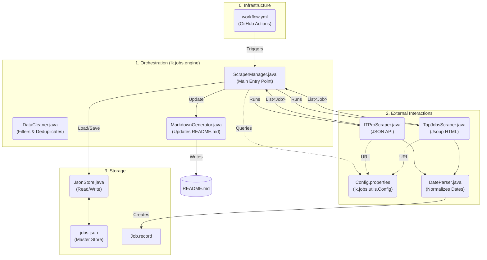

# 🇱🇰 Sri Lanka Software Engineering Jobs | 2026 Tracker [](https://t.me/SL_Software_Jobs)
Looking for software engineering jobs in Sri Lanka? This tracker updates daily with intern, junior, and senior IT roles across Colombo and beyond
Automated Software Engineering Job Tracker for Sri Lanka. Scrapes and categorizes Intern, Associate, and SE roles daily using Java (Jsoup) and GitHub Actions.

> [!TIP]
> **Help keep this project alive!** If this tool helped you find a lead today, please [**Star ⭐ the repo**](https://github.com/Senadeera-NK/sri-lanka-software-jobs). It’s how I measure the impact on our dev community! 🇱🇰

> [!IMPORTANT]
> **Automatic Staleness Purge:** The engine automatically removes listings older than **14 days**, ensuring the feed stays relevant and high-signal.

> **Live Analytics & Daily Software Job Tracker for Sri Lanka**

[📊 View Live Dashboard](https://sri-lanka-software-jobs.vercel.app/)

 
*Click the link above to see real-time trends, seniority distribution, and top hiring companies.*

## 📊 Current Job Openings
> 🟢 **Last Updated:** May 8,6:25 PM (Just now)  | **Total Jobs Found:** 205

### 🎓 Internships & Trainees  (31)

| Title | Company | Level  | Posted | Source |
| :--- | :--- | :--- | :--- | :--- |
| [Intern - QA](https://xpress.jobs/jobs/view/284564) | XpressJobs | Intern | 52&nbsp;secs&nbsp;ago | XpressJobs |
| [Data Analytics & Al Intern \| Colombo](https://xpress.jobs/jobs/view/285439) | National Olympic Committee of Sri Lanka. | Intern | 1&nbsp;mins&nbsp;ago | XpressJobs |
| [Software Engineering - Intern](https://itpro.lk/job/13674/software-engineering-intern-at-qdesk-ai-pvt-ltd/) | Qdesk AI Pvt Ltd | Intern | 7&nbsp;hours&nbsp;ago | ITPro.lk |
| [Full Stack Engineer Interns](https://itpro.lk/job/13670/full-stack-engineer-interns-at-hsemutechhub/) | Hsemutechhub | Intern | 10&nbsp;hours&nbsp;ago | ITPro.lk |
| [Software Intern](https://rooster.jobs/jobs/517381) | Rooster Testing Company | Intern | 13&nbsp;hours&nbsp;ago | Rooster.jobs |
| [Intern - QA](https://www.topjobs.lk/employer/JobAdvertismentServlet?ac=0000000484&jc=0001494865&ec=0000000651) | Epic Lanka (Pvt) Ltd | Intern | 18&nbsp;hours&nbsp;ago | TopJobs.lk |
| [Internship - QA & AI](https://www.topjobs.lk/employer/JobAdvertismentServlet?ac=DEFZZZ&jc=0001498373&ec=DEFZZZ) | Winnipeg Technology (Pvt) Ltd | Intern | 18&nbsp;hours&nbsp;ago | TopJobs.lk |
| [Intern \| Associate Mobile Application Developer - Remote](https://www.topjobs.lk/employer/JobAdvertismentServlet?ac=DEFZZZ&jc=0001498209&ec=DEFZZZ) | CodeSec Global | Intern | 18&nbsp;hours&nbsp;ago | TopJobs.lk |
| [Intern \| Associate Software Engineer - Remote](https://www.topjobs.lk/employer/JobAdvertismentServlet?ac=DEFZZZ&jc=0001498206&ec=DEFZZZ) | CodeSec Global | Intern | 18&nbsp;hours&nbsp;ago | TopJobs.lk |
| [Intern - Data Analyst](https://xpress.jobs/jobs/view/282104) | Arpico Supercentre | Intern | 23&nbsp;hours&nbsp;ago | XpressJobs |
| [Intern- Quality Assurance Engineer](https://itpro.lk/job/13662/intern-quality-assurance-engineer-at-pacifickode/) | PacificKode | Intern | Yesterday | ITPro.lk |
| [Intern - Backend](https://www.topjobs.lk/employer/JobAdvertismentServlet?ac=0000000484&jc=0001492643&ec=0000000651) | Epic Lanka (Pvt) Ltd | Intern | Yesterday | TopJobs.lk |
| [Software Developer Internship](https://itpro.lk/job/13656/software-developer-internship-at-git-lanka/) | GIT Lanka | Intern | 2&nbsp;days&nbsp;ago | ITPro.lk |
| [Intern Software Engineer (Full Stack)](https://itpro.lk/job/13652/intern-software-engineer-full-stack-at-global-training-network-alliances/) | Global Training Network Alliances | Intern | 2&nbsp;days&nbsp;ago | ITPro.lk |
| [Quality Assurance Intern](https://www.topjobs.lk/employer/JobAdvertismentServlet?ac=DEFZZZ&jc=0001496552&ec=DEFZZZ) | One Billion Tech (Pvt) Ltd | Intern | 3&nbsp;days&nbsp;ago | TopJobs.lk |
| [Intern - Software Engineer (.Net)](https://www.topjobs.lk/employer/JobAdvertismentServlet?ac=DEFZZZ&jc=0001496549&ec=DEFZZZ) | One Billion Tech (Pvt) Ltd | Intern | 3&nbsp;days&nbsp;ago | TopJobs.lk |
| [Intern - Software Engineer (React \| Node)](https://www.topjobs.lk/employer/JobAdvertismentServlet?ac=DEFZZZ&jc=0001496548&ec=DEFZZZ) | One Billion Tech (Pvt) Ltd | Intern | 3&nbsp;days&nbsp;ago | TopJobs.lk |
| [Intern Software Engineer](https://itpro.lk/job/13643/intern-software-engineer-at-zeetech-pvt-ltd/) | ZeeTech Pvt (Ltd) | Intern | 4&nbsp;days&nbsp;ago | ITPro.lk |
| [AI Evangelist Intern (1)](https://www.topjobs.lk/employer/JobAdvertismentServlet?ac=0000000160&jc=0001496322&ec=0000000192) | Michelin | Intern | 4&nbsp;days&nbsp;ago | TopJobs.lk |
| [Full Stack Developer Intern](https://itpro.lk/job/13626/full-stack-developer-intern-at-hotfix-tech/) | Hotfix Tech | Intern | 7&nbsp;days&nbsp;ago | ITPro.lk |
| [Quality Assurance Intern](https://itpro.lk/job/13625/quality-assurance-intern-at-hotfix-tech/) | Hotfix Tech | Intern | 7&nbsp;days&nbsp;ago | ITPro.lk |
| [Intern – Back End Developer](https://itpro.lk/job/13622/intern-back-end-developer-at-di11-soft/) | DI11 Soft | Intern | 8&nbsp;days&nbsp;ago | ITPro.lk |
| [Intern – Front End Developer](https://itpro.lk/job/13621/intern-front-end-developer-at-di11-soft/) | DI11 Soft | Intern | 8&nbsp;days&nbsp;ago | ITPro.lk |
| [Full Stack Developer Intern](https://xpress.jobs/jobs/view/279603) | Kapital Group | Intern | 8&nbsp;days&nbsp;ago | XpressJobs |
| [Software Engineer Intern](https://xpress.jobs/jobs/view/279601) | Kapital Group | Intern | 8&nbsp;days&nbsp;ago | XpressJobs |
| [AI Engineer (Intern)](https://www.topjobs.lk/employer/JobAdvertismentServlet?ac=DEFZZZ&jc=0001495367&ec=DEFZZZ) | Cosmetics.lk (Pvt) Ltd | Intern | 8&nbsp;days&nbsp;ago | TopJobs.lk |
| [Intern - Cyber Security (1)](https://www.topjobs.lk/employer/JobAdvertismentServlet?ac=0000000438&jc=0001495630&ec=0000000577) | Fortude | Intern | 8&nbsp;days&nbsp;ago | TopJobs.lk |
| [QA Engineer Intern (Software Testing & Automation)](https://itpro.lk/job/13619/qa-engineer-intern-software-testing-automation-at-sisenco-digital/) | Sisenco Digital | Intern | 8&nbsp;days&nbsp;ago | ITPro.lk |
| [Software Engineering Intern](https://itpro.lk/job/13616/software-engineering-intern-at-biztat/) | Biztat | Intern | 9&nbsp;days&nbsp;ago | ITPro.lk |
| [Web Developer (Wordpress) - Intern](https://itpro.lk/job/13612/web-developer-wordpress-intern-at-microweb-global/) | Microweb Global | Intern | 11&nbsp;days&nbsp;ago | ITPro.lk |
| [Automation Trainee (Workflow Automation) – Paid Internship \| Jaffna](https://xpress.jobs/jobs/view/281061) | DIGIT WEB LANKA (PVT) LTD | Intern | 11&nbsp;days&nbsp;ago | XpressJobs |

---

### 💻 Associate & Junior/SE Roles  (112)

| Title | Company | Level  | Posted | Source |
| :--- | :--- | :--- | :--- | :--- |
| [AI and Automation Engineer](https://xpress.jobs/jobs/view/283429) | TGT Global | Junior/SE | 35&nbsp;secs&nbsp;ago | XpressJobs |
| [Walk In Interviews \| Graduate Engineer Trainee (Analyst)](https://xpress.jobs/jobs/view/283446) | HCL Technologies Lanka (Private) Limited | Associate | 36&nbsp;secs&nbsp;ago | XpressJobs |
| [Walk In Interviews \| Collaboration Tools (Cloud) (Freshers ...](https://xpress.jobs/jobs/view/283453) | HCL Technologies Lanka (Private) Limited | Associate | 37&nbsp;secs&nbsp;ago | XpressJobs |
| [Enterprise Solution Architect](https://xpress.jobs/jobs/view/283571) | Ernst & Young | Junior/SE | 38&nbsp;secs&nbsp;ago | XpressJobs |
| [Head of AI](https://xpress.jobs/jobs/view/283764) | Omobio | Junior/SE | 39&nbsp;secs&nbsp;ago | XpressJobs |
| [Analyst - Security Operations Center (SOC)](https://xpress.jobs/jobs/view/283995) | Mobitel (Pvt) Ltd | Junior/SE | 45&nbsp;secs&nbsp;ago | XpressJobs |
| [Software Engineer](https://xpress.jobs/jobs/view/284003) | Mobitel (Pvt) Ltd | Junior/SE | 46&nbsp;secs&nbsp;ago | XpressJobs |
| [Automation Engineer](https://xpress.jobs/jobs/view/284071) | Konnect BPO | Junior/SE | 47&nbsp;secs&nbsp;ago | XpressJobs |
| [Head of Information Security](https://xpress.jobs/jobs/view/284228) | SMB Finance PLC | Junior/SE | 48&nbsp;secs&nbsp;ago | XpressJobs |
| [Database Administrator - Oracle](https://xpress.jobs/jobs/view/284277) | Melsta Technologies (Pvt) Ltd | Junior/SE | 49&nbsp;secs&nbsp;ago | XpressJobs |
| [AI Engineer](https://xpress.jobs/jobs/view/284507) | The Jobhouse | Junior/SE | 50&nbsp;secs&nbsp;ago | XpressJobs |
| [Software Engineer / ABAP Developer](https://xpress.jobs/jobs/view/284651) | Lanka Walltiles PLC | Junior/SE | 52&nbsp;secs&nbsp;ago | XpressJobs |
| [Junior Quality Assurance Engineer](https://xpress.jobs/jobs/view/284689) | Davton Limited | Junior/SE | 53&nbsp;secs&nbsp;ago | XpressJobs |
| [Software Engineers](https://xpress.jobs/jobs/view/284969) | Data Management Systems (Pvt) Ltd | Junior/SE | 56&nbsp;secs&nbsp;ago | XpressJobs |
| [Azure / Dynamics 365 Business Central Administrator](https://xpress.jobs/jobs/view/279712) | Brown and Company PLC | Junior/SE | 1&nbsp;mins&nbsp;ago | XpressJobs |
| [Data Engineer](https://xpress.jobs/jobs/view/279716) | Brown and Company PLC | Junior/SE | 1&nbsp;mins&nbsp;ago | XpressJobs |
| [Walk In Interviews \| Cyber Security](https://xpress.jobs/jobs/view/283426) | HCL Technologies Lanka (Private) Limited | Junior/SE | 1&nbsp;mins&nbsp;ago | XpressJobs |
| [Walk In Interviews \| Graduate Engineer Analyst - Infrastruc...](https://xpress.jobs/jobs/view/283456) | HCL Technologies Lanka (Private) Limited | Associate | 1&nbsp;mins&nbsp;ago | XpressJobs |
| [Walk In Interviews \| Graduate Engineering Trainee (Fresher)](https://xpress.jobs/jobs/view/283447) | HCL Technologies Lanka (Private) Limited | Associate | 1&nbsp;mins&nbsp;ago | XpressJobs |
| [Walk In Interviews \| Cyber Security (Fresher/Trainee)](https://xpress.jobs/jobs/view/283457) | HCL Technologies Lanka (Private) Limited | Associate | 1&nbsp;mins&nbsp;ago | XpressJobs |
| [IT Asset Data Analyst - Malabe](https://xpress.jobs/jobs/view/285447) | Micronet Global Services (Pvt) Ltd | Junior/SE | 1&nbsp;mins&nbsp;ago | XpressJobs |
| [Java FX Developer](https://itpro.lk/job/13671/java-fx-developer-at-the-anzwer-it-solutions/) | The Anzwer IT Solutions | Junior/SE | 8&nbsp;hours&nbsp;ago | ITPro.lk |
| [Businessobjects Universe Developer](https://itpro.lk/job/13669/businessobjects-universe-developer-at-appz-makers-pvt-ltd/) | Appz Makers Pvt Ltd | Junior/SE | 16&nbsp;hours&nbsp;ago | ITPro.lk |
| [Software Engineer (PHP)](https://www.topjobs.lk/employer/JobAdvertismentServlet?ac=DEFZZZ&jc=0001492825&ec=DEFZZZ) | Procons Infotech (Pvt) Ltd | Junior/SE | 18&nbsp;hours&nbsp;ago | TopJobs.lk |
| [Back-End Developer (PHP/Laravel/React)](https://www.topjobs.lk/employer/JobAdvertismentServlet?ac=DEFZZZ&jc=0001493144&ec=DEFZZZ) | Aspirations I-Lab (Pvt) Ltd | Junior/SE | 18&nbsp;hours&nbsp;ago | TopJobs.lk |
| [RPG Software Engineer](https://www.topjobs.lk/employer/JobAdvertismentServlet?ac=DEFZZZ&jc=0001495455&ec=DEFZZZ) | Commercial Bank of Ceylon PLC | Junior/SE | 18&nbsp;hours&nbsp;ago | TopJobs.lk |
| [Software Engineers](https://www.topjobs.lk/employer/JobAdvertismentServlet?ac=DEFZZZ&jc=0001494053&ec=DEFZZZ) | Care Systems South Asia (Pvt) Ltd | Junior/SE | 18&nbsp;hours&nbsp;ago | TopJobs.lk |
| [Trainee Software Engineer (2)](https://www.topjobs.lk/employer/JobAdvertismentServlet?ac=0000000499&jc=0001498107&ec=0000000679) | R.M.D Consultants (Pvt) Ltd | Associate | 18&nbsp;hours&nbsp;ago | TopJobs.lk |
| [Devops & IT Infrastucture Engineer \| Nawam Mawatha, Colombo 02](https://xpress.jobs/jobs/view/282238) | Victory Company (Igaming BPO) | Junior/SE | 23&nbsp;hours&nbsp;ago | XpressJobs |
| [RPG Software Engineer](https://xpress.jobs/jobs/view/282429) | Commercial Bank of Ceylon PLC | Junior/SE | 23&nbsp;hours&nbsp;ago | XpressJobs |
| [Software Architect \| Colombo](https://xpress.jobs/jobs/view/282735) | Mavip Infotech | Junior/SE | 23&nbsp;hours&nbsp;ago | XpressJobs |
| [Applied ML Engineer - Autonomous Drones](https://xpress.jobs/jobs/view/282907) | The Scouts | Junior/SE | 23&nbsp;hours&nbsp;ago | XpressJobs |
| [Software Engineer](https://itpro.lk/job/13667/software-engineer-at-surecore-pvt-ltd/) | Surecore (Pvt) Ltd | Junior/SE | Yesterday | ITPro.lk |
| [Junior QA Engineer](https://itpro.lk/job/13665/junior-qa-engineer-at-antler-foundry-private-limited/) | Antler Foundry Private Limited | Junior/SE | Yesterday | ITPro.lk |
| [AI Programmer](https://xpress.jobs/jobs/view/281918) | PC Recruitments | Junior/SE | Yesterday | XpressJobs |
| [Design Engineer](https://www.topjobs.lk/employer/JobAdvertismentServlet?ac=DEFZZZ&jc=0001497682&ec=DEFZZZ) | Rinstrum (Private) Limited | Junior/SE | Yesterday | TopJobs.lk |
| [Data Analyst](https://www.topjobs.lk/employer/JobAdvertismentServlet?ac=DEFZZZ&jc=0001497663&ec=DEFZZZ) | Voyzant (Pvt) Ltd | Junior/SE | Yesterday | TopJobs.lk |
| [Odoo Website & Ai Web Developer (Colombo \| Remote) (Full Ti...](https://www.topjobs.lk/employer/JobAdvertismentServlet?ac=DEFZZZ&jc=0001497526&ec=DEFZZZ) | Nawamini Motor Company (Pvt) Ltd | Junior/SE | Yesterday | TopJobs.lk |
| [Software Engineer (Male)](https://www.topjobs.lk/employer/JobAdvertismentServlet?ac=0000000223&jc=0001497913&ec=0000000266) | Data Management Systems (Pvt) Ltd | Junior/SE | Yesterday | TopJobs.lk |
| [Associate Software Engineer (AI)](https://itpro.lk/job/13659/associate-software-engineer-ai-at-wisdom-recruitments/) | Wisdom RecruitmentS | Associate | Yesterday | ITPro.lk |
| [AI Programmer](https://xpress.jobs/jobs/view/281918) | JOB11 | Junior/SE | 2&nbsp;days&nbsp;ago | XpressJobs |
| [Android & Linux Developers](https://xpress.jobs/jobs/view/284056) | Manpower Sri Lanka | Junior/SE | 2&nbsp;days&nbsp;ago | XpressJobs |
| [Software Engineer - Geometry & Backend Systems](https://itpro.lk/job/13655/software-engineer-geometry-backend-systems-at-spil-labs/) | SPIL Labs | Junior/SE | 2&nbsp;days&nbsp;ago | ITPro.lk |
| [.Net Developer](https://xpress.jobs/jobs/view/281431) | Care Analytics and Advisory pvt.ltd. | Junior/SE | 2&nbsp;days&nbsp;ago | XpressJobs |
| [Big Data Engineer (1)](https://www.topjobs.lk/employer/JobAdvertismentServlet?ac=0000000271&jc=0001420855&ec=0000000350) | CMS (Pvt) Ltd | Junior/SE | 2&nbsp;days&nbsp;ago | TopJobs.lk |
| [Full Stack .Net Engineer (1)](https://www.topjobs.lk/employer/JobAdvertismentServlet?ac=0000000271&jc=0001490551&ec=0000000350) | CMS (Pvt) Ltd | Junior/SE | 2&nbsp;days&nbsp;ago | TopJobs.lk |
| [Software Engineer -Backend (1)](https://www.topjobs.lk/employer/JobAdvertismentServlet?ac=0000000375&jc=0001496988&ec=0000000492) | Jobfactory | Junior/SE | 2&nbsp;days&nbsp;ago | TopJobs.lk |
| [Software Engineer -Mobile (1)](https://www.topjobs.lk/employer/JobAdvertismentServlet?ac=0000000375&jc=0001496992&ec=0000000492) | Jobfactory | Junior/SE | 2&nbsp;days&nbsp;ago | TopJobs.lk |
| [Al Engineer](https://xpress.jobs/jobs/view/282133) | Ernst & Young | Junior/SE | 3&nbsp;days&nbsp;ago | XpressJobs |
| [Product Engineer (AI-Assisted Development)](https://xpress.jobs/jobs/view/282871) | HT Works Pvt Ltd | Junior/SE | 3&nbsp;days&nbsp;ago | XpressJobs |
| [Software Developer](https://www.topjobs.lk/employer/JobAdvertismentServlet?ac=DEFZZZ&jc=0001496386&ec=DEFZZZ) | Airport & Aviation Services Sri Lanka (Pvt) Ltd | Junior/SE | 3&nbsp;days&nbsp;ago | TopJobs.lk |
| [Trainee Electronic Engineer](https://www.topjobs.lk/employer/JobAdvertismentServlet?ac=DEFZZZ&jc=0001496740&ec=DEFZZZ) | NORVI Controllers | Associate | 3&nbsp;days&nbsp;ago | TopJobs.lk |
| [Associate Software Engineer](https://itpro.lk/job/13645/associate-software-engineer-at-earrow-pvt-ltd/) | eArrow (Pvt) LTD | Associate | 3&nbsp;days&nbsp;ago | ITPro.lk |
| [Engineer - Product Development](https://xpress.jobs/jobs/view/281087) | Mobitel (Pvt) Ltd | Junior/SE | 4&nbsp;days&nbsp;ago | XpressJobs |
| [Associate Software Engineer/Software Engineer - Business Int...](https://www.topjobs.lk/employer/JobAdvertismentServlet?ac=0000000371&jc=0001487411&ec=0000000486) | Goodhope Asia Holdings Ltd | Associate | 4&nbsp;days&nbsp;ago | TopJobs.lk |
| [AI Evangelist (1)](https://www.topjobs.lk/employer/JobAdvertismentServlet?ac=0000000064&jc=0001496075&ec=0000000603) | Hirdaramani - H CONNECT (PVT) LIMITED | Junior/SE | 4&nbsp;days&nbsp;ago | TopJobs.lk |
| [Engineer - Data Analytics & AI (1)](https://www.topjobs.lk/employer/JobAdvertismentServlet?ac=0000000064&jc=0001496088&ec=0000000603) | Hirdaramani - H CONNECT (PVT) LIMITED | Junior/SE | 4&nbsp;days&nbsp;ago | TopJobs.lk |
| [Cyber Security Analyst](https://www.topjobs.lk/employer/JobAdvertismentServlet?ac=DEFZZZ&jc=0001496018&ec=DEFZZZ) | UB Finance PLC | Junior/SE | 4&nbsp;days&nbsp;ago | TopJobs.lk |
| [QA Engineer](https://www.topjobs.lk/employer/JobAdvertismentServlet?ac=DEFZZZ&jc=0001496196&ec=DEFZZZ) | Medcube USA | Junior/SE | 4&nbsp;days&nbsp;ago | TopJobs.lk |
| [Full Stack Developer](https://www.topjobs.lk/employer/JobAdvertismentServlet?ac=DEFZZZ&jc=0001496180&ec=DEFZZZ) | TekGeeks (Pvt) Ltd | Junior/SE | 4&nbsp;days&nbsp;ago | TopJobs.lk |
| [Senior Associate - Data Analytics (US Calendar - US Shift) (1)](https://www.topjobs.lk/employer/JobAdvertismentServlet?ac=0000000064&jc=0001496141&ec=0000000445) | H Connect International (Pvt) Ltd | Associate | 4&nbsp;days&nbsp;ago | TopJobs.lk |
| [Executive - Quality Assurance (AUS Calendar - AUS Shift) (1)](https://www.topjobs.lk/employer/JobAdvertismentServlet?ac=0000000064&jc=0001496319&ec=0000000445) | H Connect International (Pvt) Ltd | Junior/SE | 4&nbsp;days&nbsp;ago | TopJobs.lk |
| [QA Engineer (Manual & Automation)](https://itpro.lk/job/13637/qa-engineer-manual-automation-at-wisdom-recruitments/) | Wisdom RecruitmentS | Junior/SE | 4&nbsp;days&nbsp;ago | ITPro.lk |
| [Full Stack Engineer (React, Next.js, Node & Python)](https://itpro.lk/job/13636/full-stack-engineer-react-nextjs-node-python-at-wisdom-recruitments/) | Wisdom RecruitmentS | Junior/SE | 4&nbsp;days&nbsp;ago | ITPro.lk |
| [AI Engineer](https://www.topjobs.lk/employer/JobAdvertismentServlet?ac=DEFZZZ&jc=0001490764&ec=DEFZZZ) | Accura Tech (Pvt) Ltd | Junior/SE | 4&nbsp;days&nbsp;ago | TopJobs.lk |
| [Head of Technology and Enterprise Architect](https://xpress.jobs/jobs/view/279721) | Dialog Axiata PLC | Junior/SE | 5&nbsp;days&nbsp;ago | XpressJobs |
| [Associate Quality Assurance Engineer](https://itpro.lk/job/13631/associate-quality-assurance-engineer-at-earrow-pvt-ltd/) | eArrow (Pvt) LTD | Associate | 5&nbsp;days&nbsp;ago | ITPro.lk |
| [Website Developer](https://xpress.jobs/jobs/view/279665) | Union Business Finance | Junior/SE | 6&nbsp;days&nbsp;ago | XpressJobs |
| [Data Engineer (2)](https://www.topjobs.lk/employer/JobAdvertismentServlet?ac=0000000275&jc=0001495712&ec=0000000362) | Superloop Communications Pvt Ltd | Junior/SE | 7&nbsp;days&nbsp;ago | TopJobs.lk |
| [Associate Data Engineer (1)](https://www.topjobs.lk/employer/JobAdvertismentServlet?ac=0000000275&jc=0001495711&ec=0000000362) | Superloop Communications Pvt Ltd | Associate | 7&nbsp;days&nbsp;ago | TopJobs.lk |
| [Software Developer](https://itpro.lk/job/13623/software-developer-at-glenzsoft-pvt-ltd/) | Glenzsoft (Pvt) Ltd | Junior/SE | 7&nbsp;days&nbsp;ago | ITPro.lk |
| [Test & Validation (T&V) Engineers](https://xpress.jobs/jobs/view/279653) | Manpower Sri Lanka | Junior/SE | 8&nbsp;days&nbsp;ago | XpressJobs |
| [Full Stack Web Developer - Backend-Focused](https://www.topjobs.lk/employer/JobAdvertismentServlet?ac=0000000501&jc=0001495321&ec=0000000681) | Oscar Wylee | Junior/SE | 8&nbsp;days&nbsp;ago | TopJobs.lk |
| [Information Technology Specialist - Data & Platform Integration](https://www.topjobs.lk/employer/JobAdvertismentServlet?ac=DEFZZZ&jc=0001495173&ec=DEFZZZ) | International Water Management Institute (IWMI) | Junior/SE | 8&nbsp;days&nbsp;ago | TopJobs.lk |
| [Software Developer](https://www.topjobs.lk/employer/JobAdvertismentServlet?ac=DEFZZZ&jc=0001494916&ec=DEFZZZ) | National Institute of Business Management | Junior/SE | 8&nbsp;days&nbsp;ago | TopJobs.lk |
| [Associate Architect / Senior Tech Lead](https://www.topjobs.lk/employer/JobAdvertismentServlet?ac=DEFZZZ&jc=0001495557&ec=DEFZZZ) | Altria Consulting (Pvt) Ltd | Associate | 8&nbsp;days&nbsp;ago | TopJobs.lk |
| [Full Stack Developer](https://www.topjobs.lk/employer/JobAdvertismentServlet?ac=DEFZZZ&jc=0001495488&ec=DEFZZZ) | Yaden Pharmacy (Private) Limited | Junior/SE | 8&nbsp;days&nbsp;ago | TopJobs.lk |
| [IT Helpdesk Engineer \| Awissawella](https://xpress.jobs/jobs/view/279105) | Micronet Global Services (Pvt) Ltd | Junior/SE | 9&nbsp;days&nbsp;ago | XpressJobs |
| [Full Stack Developer](https://www.topjobs.lk/employer/JobAdvertismentServlet?ac=DEFZZZ&jc=0001494902&ec=DEFZZZ) | Arpico Energy | Junior/SE | 9&nbsp;days&nbsp;ago | TopJobs.lk |
| [Executive - Data Driven Solution](https://www.topjobs.lk/employer/JobAdvertismentServlet?ac=DEFZZZ&jc=0001494822&ec=DEFZZZ) | Hellmann MAS Supply Chain (HMSC) | Junior/SE | 9&nbsp;days&nbsp;ago | TopJobs.lk |
| [Software Engineer - Application Development & Automated Test...](https://www.topjobs.lk/employer/JobAdvertismentServlet?ac=DEFZZZ&jc=0001494788&ec=DEFZZZ) | Seaport Group | Junior/SE | 9&nbsp;days&nbsp;ago | TopJobs.lk |
| [WordPress Web Developer](https://www.topjobs.lk/employer/JobAdvertismentServlet?ac=DEFZZZ&jc=0001494773&ec=DEFZZZ) | KD Associates (Pvt) Ltd | Junior/SE | 9&nbsp;days&nbsp;ago | TopJobs.lk |
| [DevOps Engineer - Embedded Software](https://www.topjobs.lk/employer/JobAdvertismentServlet?ac=DEFZZZ&jc=0001494544&ec=DEFZZZ) | Invenza Digital Technologies (Pvt) Ltd | Junior/SE | 9&nbsp;days&nbsp;ago | TopJobs.lk |
| [Word Press Developer](https://www.topjobs.lk/employer/JobAdvertismentServlet?ac=DEFZZZ&jc=0001495100&ec=DEFZZZ) | Apex Consulting | Junior/SE | 9&nbsp;days&nbsp;ago | TopJobs.lk |
| [Data Engineer](https://www.topjobs.lk/employer/JobAdvertismentServlet?ac=DEFZZZ&jc=0001495017&ec=DEFZZZ) | Payable (Pvt) Ltd | Junior/SE | 9&nbsp;days&nbsp;ago | TopJobs.lk |
| [Full Stack Engineer - JAVA](https://www.topjobs.lk/employer/JobAdvertismentServlet?ac=DEFZZZ&jc=0001494932&ec=DEFZZZ) | Medcube USA | Junior/SE | 9&nbsp;days&nbsp;ago | TopJobs.lk |
| [Backend Software Engineer (Cloud Services Team)](https://rooster.jobs/jobs/517150) | Nextjob | Junior/SE | 9&nbsp;days&nbsp;ago | Rooster.jobs |
| [Associate DevOps Engineer](https://xpress.jobs/jobs/view/274036) | HT Works Pvt Ltd | Associate | 10&nbsp;days&nbsp;ago | XpressJobs |
| [Associate Quality Assurance Engineer](https://xpress.jobs/jobs/view/281119) | Thyāga | Associate | 10&nbsp;days&nbsp;ago | XpressJobs |
| [Software Vacancies](https://www.topjobs.lk/employer/JobAdvertismentServlet?ac=DEFZZZ&jc=0001494279&ec=DEFZZZ) | Mark & Comm (Pvt) Ltd | Junior/SE | 10&nbsp;days&nbsp;ago | TopJobs.lk |
| [Software Engineer JAVA (1)](https://www.topjobs.lk/employer/JobAdvertismentServlet?ac=0000000492&jc=0001494613&ec=0000000661) | DirectFN | Junior/SE | 10&nbsp;days&nbsp;ago | TopJobs.lk |
| [Information Security Specialist](https://www.topjobs.lk/employer/JobAdvertismentServlet?ac=DEFZZZ&jc=0001494475&ec=DEFZZZ) | Cargills Bank PLC | Junior/SE | 10&nbsp;days&nbsp;ago | TopJobs.lk |
| [Trainee Associate Software Engineer](https://www.topjobs.lk/employer/JobAdvertismentServlet?ac=DEFZZZ&jc=0001494438&ec=DEFZZZ) | I T S Data Link (Pvt) Ltd | Associate | 10&nbsp;days&nbsp;ago | TopJobs.lk |
| [Quality Assurance Engineer](https://itpro.lk/job/12117/quality-assurance-engineer-at-rightmo-web-solution/) | Rightmo Web Solution | Junior/SE | 10&nbsp;days&nbsp;ago | ITPro.lk |
| [DeOvps Engineer - Embedded Software](https://www.topjobs.lk/employer/JobAdvertismentServlet?ac=DEFZZZ&jc=0001494544&ec=DEFZZZ) | Invenza Digital Technologies (Pvt) Ltd | Junior/SE | 10&nbsp;days&nbsp;ago | TopJobs.lk |
| [Web Developer](https://xpress.jobs/jobs/view/280143) | HIRING TALENT | Junior/SE | 11&nbsp;days&nbsp;ago | XpressJobs |
| [Solution Architect](https://xpress.jobs/jobs/view/278795) | RR Donnelley Outsource (Pvt) Ltd​ | Junior/SE | 11&nbsp;days&nbsp;ago | XpressJobs |
| [Executive - System Engineer (AUS Calendar - AUS Shift) (1)](https://www.topjobs.lk/employer/JobAdvertismentServlet?ac=0000000064&jc=0001494003&ec=0000000445) | H Connect International (Pvt) Ltd | Junior/SE | 11&nbsp;days&nbsp;ago | TopJobs.lk |
| [Soft Ware Engineer (1)](https://www.topjobs.lk/employer/JobAdvertismentServlet?ac=0000000146&jc=0001494260&ec=0000000178) | Nawaloka Hospitals PLC | Junior/SE | 11&nbsp;days&nbsp;ago | TopJobs.lk |
| [Associate/ Fullstack Developer (1)](https://www.topjobs.lk/employer/JobAdvertismentServlet?ac=0000000201&jc=0001494055&ec=0000000256) | Samson Rubber Industries | Associate | 11&nbsp;days&nbsp;ago | TopJobs.lk |
| [QE Engineer - API & Integration](https://itpro.lk/job/13609/qe-engineer-api-integration-at-vs-one-world-pvt-ltd/) | VS ONE WORLD (Pvt) Ltd | Junior/SE | 12&nbsp;days&nbsp;ago | ITPro.lk |
| [Information Security Officer](https://xpress.jobs/jobs/view/278060) | Commercial Bank of Ceylon PLC | Junior/SE | 12&nbsp;days&nbsp;ago | XpressJobs |
| [.NET Developer](https://itpro.lk/job/13606/net-developer-at-d-help-hub-private-limited/) | D HELP HUB Private Limited | Junior/SE | 12&nbsp;days&nbsp;ago | ITPro.lk |
| [QA Associate](https://itpro.lk/job/13605/qa-associate-at-d-help-hub-private-limited/) | D HELP HUB Private Limited | Associate | 12&nbsp;days&nbsp;ago | ITPro.lk |
| [Web Developer  (WordPress / PHP)](https://itpro.lk/job/13604/web-developer-wordpress-php-at-d-help-hub-private-limited/) | D HELP HUB Private Limited | Junior/SE | 12&nbsp;days&nbsp;ago | ITPro.lk |
| [Software Engineer](https://itpro.lk/job/13602/software-engineer-at-d-help-hub-private-limited/) | D HELP HUB Private Limited | Junior/SE | 12&nbsp;days&nbsp;ago | ITPro.lk |
| [Walk In Interviews \| Service Desk / Cyber Security](https://xpress.jobs/jobs/view/279145) | HCL Technologies Lanka (Private) Limited | Junior/SE | 14&nbsp;days&nbsp;ago | XpressJobs |
| [Software Engineer](https://xpress.jobs/jobs/view/279104) | The Scouts | Junior/SE | 14&nbsp;days&nbsp;ago | XpressJobs |
| [Junior Electrical & IT Engineer - IT Systems Integration](https://www.topjobs.lk/employer/JobAdvertismentServlet?ac=DEFZZZ&jc=0001492061&ec=DEFZZZ) | WKV Hydro Technics (Pvt) Ltd | Junior/SE | 14&nbsp;days&nbsp;ago | TopJobs.lk |
| [Laravel Developer](https://www.topjobs.lk/employer/JobAdvertismentServlet?ac=DEFZZZ&jc=0001493129&ec=DEFZZZ) | True Foam (Pvt) Ltd | Junior/SE | 14&nbsp;days&nbsp;ago | TopJobs.lk |
| [Data Engineer](https://www.topjobs.lk/employer/JobAdvertismentServlet?ac=DEFZZZ&jc=0001489138&ec=DEFZZZ) | Ateam Software ( Pvt ) Ltd | Junior/SE | 14&nbsp;days&nbsp;ago | TopJobs.lk |
| [Full Stack Developer - React & .Net](https://www.topjobs.lk/employer/JobAdvertismentServlet?ac=DEFZZZ&jc=0001489136&ec=DEFZZZ) | Ateam Software ( Pvt ) Ltd | Junior/SE | 14&nbsp;days&nbsp;ago | TopJobs.lk |

---

### 🚀 Senior & Lead Roles  (62)

| Title | Company | Level  | Posted | Source |
| :--- | :--- | :--- | :--- | :--- |
| [Principal Engineer cum Team Lead (AI, Software)](https://xpress.jobs/jobs/view/282864) | PBA Systems Pte Ltd | Senior | 33&nbsp;secs&nbsp;ago | XpressJobs |
| [Senior Full Stack Engineer](https://xpress.jobs/jobs/view/283427) | TGT Global | Senior | 34&nbsp;secs&nbsp;ago | XpressJobs |
| [Senior AI and Automation Engineer](https://xpress.jobs/jobs/view/283432) | TGT Global | Senior | 35&nbsp;secs&nbsp;ago | XpressJobs |
| [Product Engineer (Senior Software Engineers)](https://xpress.jobs/jobs/view/283985) | HT Works Pvt Ltd | Senior | 45&nbsp;secs&nbsp;ago | XpressJobs |
| [iOS Developers (Colombo, Sri Lanka)](https://xpress.jobs/jobs/view/284101) | Manpower Sri Lanka | Senior | 48&nbsp;secs&nbsp;ago | XpressJobs |
| [Senior SQL and SSRS Developer](https://xpress.jobs/jobs/view/284703) | KriyaGo | Senior | 53&nbsp;secs&nbsp;ago | XpressJobs |
| [Senior Data Scientist](https://xpress.jobs/jobs/view/284959) | Dialog Axiata PLC | Senior | 55&nbsp;secs&nbsp;ago | XpressJobs |
| [Executive / Senior Executive - Data Analytics](https://xpress.jobs/jobs/view/285134) | Universal Outsourcing & Consultancy (Pvt) Ltd | Senior | 57&nbsp;secs&nbsp;ago | XpressJobs |
| [Senior Lecturer - Grade II / Lecturer / Lecturer (Probationa...](https://xpress.jobs/jobs/view/285209) | Sri Lanka Technology Campus | SLTC | Senior | 58&nbsp;secs&nbsp;ago | XpressJobs |
| [Senior Lecturer - Grade II / Lecturer / Lecturer (Probationa...](https://xpress.jobs/jobs/view/285210) | Sri Lanka Technology Campus | SLTC | Senior | 58&nbsp;secs&nbsp;ago | XpressJobs |
| [Senior Lecturer - Grade II / Lecturer / Lecturer (Probationa...](https://xpress.jobs/jobs/view/285211) | Sri Lanka Technology Campus | SLTC | Senior | 59&nbsp;secs&nbsp;ago | XpressJobs |
| [Senior Lecturer - Grade II / Lecturer / Lecturer (Probationa...](https://xpress.jobs/jobs/view/285212) | Sri Lanka Technology Campus | SLTC | Senior | 1&nbsp;mins&nbsp;ago | XpressJobs |
| [Senior Quality Assurance Engineer](https://xpress.jobs/jobs/view/274531) | Brown and Company PLC | Senior | 1&nbsp;mins&nbsp;ago | XpressJobs |
| [Senior Engineer - IT Security](https://xpress.jobs/jobs/view/285440) | Commercial Bank of Ceylon PLC | Senior | 1&nbsp;mins&nbsp;ago | XpressJobs |
| [Team Lead ( Blockchain, Full-Stack & AI  )  - Remote](https://xpress.jobs/jobs/view/282482) | Advantage Group Australasia Pty. Ltd | Senior | 1&nbsp;mins&nbsp;ago | XpressJobs |
| [Senior Mobile App Developer (1)](https://www.topjobs.lk/employer/JobAdvertismentServlet?ac=0000000001&jc=0001495714&ec=0000000001) | Genesiis Software Pvt Ltd | Senior | 18&nbsp;hours&nbsp;ago | TopJobs.lk |
| [Software Engineer - Web \| Senior Software Engineer - Web & ...](https://www.topjobs.lk/employer/JobAdvertismentServlet?ac=DEFZZZ&jc=0001495616&ec=DEFZZZ) | Afisol (Pvt) Ltd | Senior | 18&nbsp;hours&nbsp;ago | TopJobs.lk |
| [Oracle Cloud Database - Senior Engineer \| Tech Lead](https://www.topjobs.lk/employer/JobAdvertismentServlet?ac=DEFZZZ&jc=0001498341&ec=DEFZZZ) | Twixia Tech | Senior | 18&nbsp;hours&nbsp;ago | TopJobs.lk |
| [Oracle APEX \| VBCS - Senior Developer \| Lead](https://www.topjobs.lk/employer/JobAdvertismentServlet?ac=DEFZZZ&jc=0001498335&ec=DEFZZZ) | Twixia Tech | Senior | 18&nbsp;hours&nbsp;ago | TopJobs.lk |
| [Senior Engineer - IT Security](https://www.topjobs.lk/employer/JobAdvertismentServlet?ac=DEFZZZ&jc=0001498358&ec=DEFZZZ) | Commercial Bank | Senior | 18&nbsp;hours&nbsp;ago | TopJobs.lk |
| [Senior Web Developer](https://www.topjobs.lk/employer/JobAdvertismentServlet?ac=DEFZZZ&jc=0001498238&ec=DEFZZZ) | Company Name Withheld | Senior | 18&nbsp;hours&nbsp;ago | TopJobs.lk |
| [Senior Automation Engineer (Python Focus)](https://xpress.jobs/jobs/view/282180) | Innobot | Senior | 23&nbsp;hours&nbsp;ago | XpressJobs |
| [Lead Automation Engineer (Python Focus)](https://xpress.jobs/jobs/view/282181) | Innobot | Senior | 23&nbsp;hours&nbsp;ago | XpressJobs |
| [Senior Software Engineer (Python)](https://xpress.jobs/jobs/view/282318) | Innobot | Senior | 23&nbsp;hours&nbsp;ago | XpressJobs |
| [Senior Java Architect \| Colombo](https://xpress.jobs/jobs/view/281871) | YI CAN PTE. LTD. | Senior | Yesterday | XpressJobs |
| [Senior Developer (Full Time) \| Work From Home](https://xpress.jobs/jobs/view/282029) | LocalCom Pty. Ltd | Senior | Yesterday | XpressJobs |
| [Senior Quality Assurance Engineer (Automation – Playwright)](https://itpro.lk/job/13658/senior-quality-assurance-engineer-automation-playwright-at-digiratina-technology-solutions/) | Digiratina Technology Solutions | Senior | Yesterday | ITPro.lk |
| [Senior Software Developer](https://xpress.jobs/jobs/view/281673) | Wizlearn Technologies Pte Ltd | Senior | 2&nbsp;days&nbsp;ago | XpressJobs |
| [Senior Software Engineer : Ruby on Rails](https://xpress.jobs/jobs/view/281796) | OXO Tech (Pvt) Ltd | Senior | 2&nbsp;days&nbsp;ago | XpressJobs |
| [Senior SQL Developer (1)](https://www.topjobs.lk/employer/JobAdvertismentServlet?ac=0000000271&jc=0001421034&ec=0000000350) | CMS (Pvt) Ltd | Senior | 2&nbsp;days&nbsp;ago | TopJobs.lk |
| [Lead Systems Engineer (1)](https://www.topjobs.lk/employer/JobAdvertismentServlet?ac=0000000381&jc=0001496890&ec=0000000499) | SriLankan Airlines Ltd | Senior | 2&nbsp;days&nbsp;ago | TopJobs.lk |
| [Senior Full Stack Engineer (Angular .NET)](https://www.topjobs.lk/employer/JobAdvertismentServlet?ac=DEFZZZ&jc=0001497068&ec=DEFZZZ) | Bistec Global Services (Pvt) Ltd | Senior | 2&nbsp;days&nbsp;ago | TopJobs.lk |
| [Senior Next.js Frontend Engineer (Vercel)](https://xpress.jobs/jobs/view/280917) | Innotic Pvt Ltd | Senior | 3&nbsp;days&nbsp;ago | XpressJobs |
| [Tech Lead – AI & Platform Engineering \| Hybrid](https://xpress.jobs/jobs/view/280927) | Coderra | Senior | 3&nbsp;days&nbsp;ago | XpressJobs |
| [Senior Ruby on Rails Developer](https://xpress.jobs/jobs/view/281209) | Archipelago | Senior | 3&nbsp;days&nbsp;ago | XpressJobs |
| [Senior Go (Golang) Developer](https://xpress.jobs/jobs/view/281210) | Archipelago | Senior | 3&nbsp;days&nbsp;ago | XpressJobs |
| [Technical Lead -  Full Stack (NextJS & NestJS)](https://xpress.jobs/jobs/view/279562) | EFutures | Senior | 3&nbsp;days&nbsp;ago | XpressJobs |
| [Senior DevOps Engineer - Remote \| Hybrid \| Colombo 05](https://www.topjobs.lk/employer/JobAdvertismentServlet?ac=DEFZZZ&jc=0001496672&ec=DEFZZZ) | Allion Technologies (Pvt) Ltd | Senior | 3&nbsp;days&nbsp;ago | TopJobs.lk |
| [Senior Frontend Developer](https://www.topjobs.lk/employer/JobAdvertismentServlet?ac=DEFZZZ&jc=0001496563&ec=DEFZZZ) | Star Garments (Pvt) Limited | Senior | 3&nbsp;days&nbsp;ago | TopJobs.lk |
| [Senior Software Engineer](https://itpro.lk/job/13553/senior-software-engineer-at-surecore-pvt-ltd/) | Surecore (Pvt) Ltd | Senior | 3&nbsp;days&nbsp;ago | ITPro.lk |
| [Oracle Workflow & BPM - Senior Developer \| Lead](https://www.topjobs.lk/employer/JobAdvertismentServlet?ac=DEFZZZ&jc=0001491201&ec=DEFZZZ) | Twixia Tech | Senior | 3&nbsp;days&nbsp;ago | TopJobs.lk |
| [Senior Software Engineer - Mobile](https://xpress.jobs/jobs/view/281096) | Mobitel (Pvt) Ltd | Senior | 4&nbsp;days&nbsp;ago | XpressJobs |
| [Senior Python Developer \| Remote](https://xpress.jobs/jobs/view/281170) | BlueOceanSP | Senior | 4&nbsp;days&nbsp;ago | XpressJobs |
| [Senior Software Engineers](https://xpress.jobs/jobs/view/280727) | Central Finance Company PLC | Senior | 4&nbsp;days&nbsp;ago | XpressJobs |
| [Senior Software Engineers](https://xpress.jobs/jobs/view/279657) | Manpower Sri Lanka | Senior | 5&nbsp;days&nbsp;ago | XpressJobs |
| [Senior Full Stack Engineer \| Colombo](https://xpress.jobs/jobs/view/278651) | TGT Global | Senior | 5&nbsp;days&nbsp;ago | XpressJobs |
| [Senior/Software Engineer](https://itpro.lk/job/13088/seniorsoftware-engineer-at-pacifickode/) | PacificKode | Senior | 7&nbsp;days&nbsp;ago | ITPro.lk |
| [Senior Software Engineer (React Native)](https://rooster.jobs/jobs/517190) | Nextjob | Senior | 7&nbsp;days&nbsp;ago | Rooster.jobs |
| [Senior Engineer - IT Security (Red Team Operations)](https://www.topjobs.lk/employer/JobAdvertismentServlet?ac=DEFZZZ&jc=0001490271&ec=DEFZZZ) | Commercial Bank of Ceylon PLC | Senior | 8&nbsp;days&nbsp;ago | TopJobs.lk |
| [Senior Software Engineer - .NET](https://itpro.lk/job/13618/senior-software-engineer-net-at-vitalhub-innovations-lab/) | VitalHub Innovations Lab | Senior | 9&nbsp;days&nbsp;ago | ITPro.lk |
| [Lead Mobile App Developer](https://xpress.jobs/jobs/view/279194) | Gluon Force (PVT) Ltd | Senior | 9&nbsp;days&nbsp;ago | XpressJobs |
| [Senior Laravel Full Stack Developer](https://itpro.lk/job/13615/senior-laravel-full-stack-developer-at-zb-solutions/) | ZB Solutions | Senior | 10&nbsp;days&nbsp;ago | ITPro.lk |
| [Senior Software Engineer](https://xpress.jobs/jobs/view/274015) | HT Works Pvt Ltd | Senior | 10&nbsp;days&nbsp;ago | XpressJobs |
| [Senior Information Security Engineer - FINCSIRT (1)](https://www.topjobs.lk/employer/JobAdvertismentServlet?ac=0000000166&jc=0001494289&ec=0000000200) | LankaPay (Pvt) Ltd | Senior | 10&nbsp;days&nbsp;ago | TopJobs.lk |
| [Senior Software Engineer \| Software Engineer Mobile Development](https://www.topjobs.lk/employer/JobAdvertismentServlet?ac=DEFZZZ&jc=0001494583&ec=DEFZZZ) | Scienter Technologies (Pte) Ltd | Senior | 10&nbsp;days&nbsp;ago | TopJobs.lk |
| [Software Engineer (Python) \| Senior Software Engineer (Python)](https://www.topjobs.lk/employer/JobAdvertismentServlet?ac=DEFZZZ&jc=0001494580&ec=DEFZZZ) | Innobot Health | Senior | 10&nbsp;days&nbsp;ago | TopJobs.lk |
| [Senior Front end Developer (1)](https://www.topjobs.lk/employer/JobAdvertismentServlet?ac=0000000492&jc=0001494612&ec=0000000661) | DirectFN | Senior | 10&nbsp;days&nbsp;ago | TopJobs.lk |
| [Senior Systems Engineer (1)](https://www.topjobs.lk/employer/JobAdvertismentServlet?ac=0000000492&jc=0001494610&ec=0000000661) | DirectFN | Senior | 10&nbsp;days&nbsp;ago | TopJobs.lk |
| [Technical Lead (Java/Scala/AWS)](https://rooster.jobs/jobs/517108) | Nextjob | Senior | 11&nbsp;days&nbsp;ago | Rooster.jobs |
| [Senior Software Engineer – .NET (API & Middleware)](https://itpro.lk/job/13608/senior-software-engineer-net-api-middleware-at-vs-one-world-pvt-ltd/) | VS ONE WORLD (Pvt) Ltd | Senior | 12&nbsp;days&nbsp;ago | ITPro.lk |
| [Senior Engineer - IT Security (Red Team Operations)](https://xpress.jobs/jobs/view/278034) | Commercial Bank of Ceylon PLC | Senior | 12&nbsp;days&nbsp;ago | XpressJobs |
| [Lead Software Engineer](https://xpress.jobs/jobs/view/275950) | SINGER (Sri Lanka) PLC | Senior | 14&nbsp;days&nbsp;ago | XpressJobs |

---


## 🛠️ How it Works
1. **Engine:** A Java 21 console application using **Jsoup**.
2. **Sources:** Currently scraping `ITPro.lk` and  `TopJobs`. Support for and `Rooster.jobs` is under development (Contributors welcome!)
3. **Automation:** Runs every 12 hours via **GitHub Actions**.
4. **Storage:** Updates this `README.md` and a `jobs.json` file automatically.

<details>
<summary><b>📐 View High-Level Architecture Diagram</b></summary>
    

```mermaid
graph TD
    %% Main Orchestration Class
    subgraph Engine ["1. Orchestration (lk.jobs.engine)"]
        ScraperManager["ScraperManager.java<br/>(Main Entry Point)"]
        Cleaner("DataCleaner.java<br/>(Filters & Deduplicates)")
        Markdown("MarkdownGenerator.java<br/>(Updates README.md)")
    end

    %% External Interactions / Data Sources
    subgraph Scrapers ["2. External Interactions"]
        Config("Config.properties<br/>(lk.jobs.utils.Config)")
        ITPro("ITProScraper.java<br/>(JSON API)")
        TopJobs("TopJobsScraper.java<br/>(Jsoup HTML)")
        DParser("DateParser.java<br/>(Normalizes Dates)")
    end

    %% Data Flow & Persistence
    subgraph Storage ["3. Storage"]
        Json("jobs.json<br/>(Master Store)")
        JsonStore("JsonStore.java<br/>(Read/Write)")
        JobModel["Job.record"]
    end

    %% Workflow Orchestration
    subgraph Infrastructure ["0. Infrastructure"]
        WF("workflow.yml<br/>(GitHub Actions)")
    end

    %% Connective Flow
    WF -- "Triggers" --> ScraperManager
    ScraperManager -. "Queries" .-> Config
    ITPro -. "URL" .-> Config
    TopJobs -. "URL" .-> Config
    
    ScraperManager -- "Runs" --> ITPro
    ScraperManager -- "Runs" --> TopJobs
    
    ITPro --> DParser
    TopJobs --> DParser
    DParser -- "Creates" --> JobModel
    
    ITPro -- "List&lt;Job&gt;" --> ScraperManager
    TopJobs -- "List&lt;Job&gt;" --> ScraperManager

    ScraperManager -- "Load/Save" --> JsonStore
    JsonStore <--> Json
    
    ScraperManager -- "Update" --> Markdown
    Markdown -- "Writes" --> README[(README.md)]
```

</details>

<details>
<summary><b>📂 View Project Structure</b></summary>

```text
src/main/java/lk/jobs/
├── engine/           # Logic for sorting, cleaning, and README updates
├── model/            # Data models (Job Record)
├── scrapers/         # Individual site scrapers
└── utils/            # JSON and Date parsing utilities
```
</details>

## 🚀 Usage
If you want to run the scraper locally:
1. Clone the repo.
2. Ensure you have **JDK 21** and **Maven** installed.
3. Run: mvn clean compile exec:java -Dexec.mainClass="lk.jobs.engine.ScraperManager"

## 🤝 Contributing
Contributions are what make the open-source community such an amazing place to learn, inspire, and create.
Any contributions you make are **greatly appreciated**.

* **Found a bug?** Open an [Issue](https://github.com/Senadeera-NK/sl-software-engineering-jobs/issues).
* **Want to add a new site?** Check out our [Contributing Guidelines](CONTRIBUTING.md) to see how to implement a new scraper.
* **Missing a job?** Feel free to submit a Pull Request to manually update the table!
