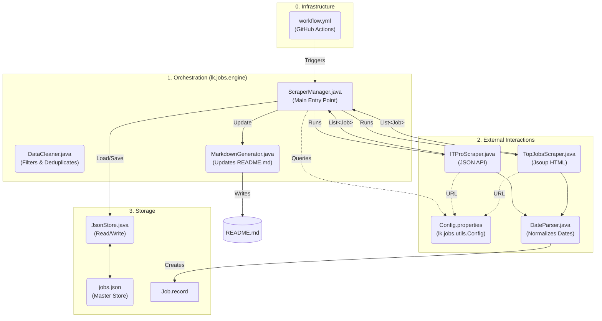

# 🇱🇰 Sri Lanka Software Engineering Jobs | 2026 Tracker [](https://t.me/SL_Software_Jobs)
Looking for software engineering jobs in Sri Lanka? This tracker updates daily with intern, junior, and senior IT roles across Colombo and beyond
Automated Software Engineering Job Tracker for Sri Lanka. Scrapes and categorizes Intern, Associate, and SE roles daily using Java (Jsoup) and GitHub Actions.

> [!TIP]
> **Help keep this project alive!** If this tool helped you find a lead today, please [**Star ⭐ the repo**](https://github.com/Senadeera-NK/sri-lanka-software-jobs). It’s how I measure the impact on our dev community! 🇱🇰

> [!IMPORTANT]
> **Automatic Staleness Purge:** The engine automatically removes listings older than **14 days**, ensuring the feed stays relevant and high-signal.

## 📊 Current Job Openings
> 🟢 **Last Updated:** April 11,12:10 PM (Just now)  | **Total Jobs Found:** 165

### 🎓 Internships & Trainees  (23)

| Title | Company | Level  | Posted | Source |
| :--- | :--- | :--- | :--- | :--- |
| [Full Stack Developer Intern](https://xpress.jobs/jobs/view/275962) | Kapital Group | Intern | 1&nbsp;mins&nbsp;ago | XpressJobs |
| [Software Engineer Intern](https://xpress.jobs/jobs/view/276029) | Kapital Group | Intern | 1&nbsp;mins&nbsp;ago | XpressJobs |
| [Quality Assurance Intern](https://itpro.lk/job/13516/quality-assurance-intern-at-nippon-it-and-educational-solution-nites/) | Nippon IT and Educational Solution (NITES) | Intern | 17&nbsp;hours&nbsp;ago | ITPro.lk |
| [Full Stack Developer Trainee Internship](https://itpro.lk/job/13514/full-stack-developer-trainee-internship-at-itx-digital-services-pvt-ltd/) | ITX Digital Services (PVT) LTD | Intern | 23&nbsp;hours&nbsp;ago | ITPro.lk |
| [Data Scientist Intern - Computer Vision & Analytics](https://www.topjobs.lk/employer/JobAdvertismentServlet?ac=DEFZZZ&jc=0001489177&ec=DEFZZZ) | SpectrifyAI (Pvt) Ltd | Intern | Yesterday | TopJobs.lk |
| [Full Stack Developer Intern](https://www.topjobs.lk/employer/JobAdvertismentServlet?ac=DEFZZZ&jc=0001489028&ec=DEFZZZ) | MedcubeUSA | Intern | Yesterday | TopJobs.lk |
| [Intern - Information Security (Technical & GRC)](https://www.topjobs.lk/employer/JobAdvertismentServlet?ac=0000000484&jc=0001488251&ec=0000000651) | Epic Lanka (Pvt) Ltd | Intern | Yesterday | TopJobs.lk |
| [Intern - Software Engineer (.Net)](https://www.topjobs.lk/employer/JobAdvertismentServlet?ac=DEFZZZ&jc=0001488860&ec=DEFZZZ) | One Billion Tech (Pvt) Ltd | Intern | 2&nbsp;days&nbsp;ago | TopJobs.lk |
| [Quality Assurance Intern](https://www.topjobs.lk/employer/JobAdvertismentServlet?ac=DEFZZZ&jc=0001488854&ec=DEFZZZ) | One Billion Tech (Pvt) Ltd | Intern | 2&nbsp;days&nbsp;ago | TopJobs.lk |
| [Intern - Software Engineer (React \| Node)](https://www.topjobs.lk/employer/JobAdvertismentServlet?ac=DEFZZZ&jc=0001488849&ec=DEFZZZ) | One Billion Tech (Pvt) Ltd | Intern | 2&nbsp;days&nbsp;ago | TopJobs.lk |
| [Software Developer Intern](https://itpro.lk/job/13481/software-developer-intern-at-glamer-media/) | Glamer Media | Intern | 3&nbsp;days&nbsp;ago | ITPro.lk |
| [Senior Java Full - Stack Developer (Financial Internet Banking)](https://www.topjobs.lk/employer/JobAdvertismentServlet?ac=DEFZZZ&jc=0001488071&ec=DEFZZZ) | Fortunaglobal (Pvt) Limited | Intern | 4&nbsp;days&nbsp;ago | TopJobs.lk |
| [Intern - Software Engineering](https://rooster.jobs/jobs/516725) | Zegates International Private Limited | Intern | 4&nbsp;days&nbsp;ago | Rooster.jobs |
| [Software Engineer - Intern](https://itpro.lk/job/13447/software-engineer-intern-at-d-help-hub-private-limited/) | D HELP HUB Private Limited | Intern | 5&nbsp;days&nbsp;ago | ITPro.lk |
| [Full Stack Software Engineer – Intern](https://itpro.lk/job/13443/full-stack-software-engineer-intern-at-qbinom/) | Qbinom | Intern | 7&nbsp;days&nbsp;ago | ITPro.lk |
| [Intern QA Engineer (Paid)](https://itpro.lk/job/13422/intern-qa-engineer-paid-at-nippon-it-and-educational-solution-nites/) | Nippon IT and Educational Solution (NITES) | Intern | 8&nbsp;days&nbsp;ago | ITPro.lk |
| [Intern Software Engineer](https://itpro.lk/job/13420/intern-software-engineer-at-vornex-labs/) | Vornex Labs | Intern | 9&nbsp;days&nbsp;ago | ITPro.lk |
| [Intern - Software Engineering (Web \| Mobile)](https://www.topjobs.lk/employer/JobAdvertismentServlet?ac=DEFZZZ&jc=0001486175&ec=DEFZZZ) | Cloud Books (Pvt) Ltd | Intern | 9&nbsp;days&nbsp;ago | TopJobs.lk |
| [Full-Stack Software Engineer Intern (Paid)](https://itpro.lk/job/13409/fullstack-software-engineer-intern-paid-at-nippon-it-and-educational-solution-nites/) | Nippon IT and Educational Solution (NITES) | Intern | 10&nbsp;days&nbsp;ago | ITPro.lk |
| [Intern QA Engineer](https://itpro.lk/job/12974/intern-qa-engineer-at-onsys-technologies/) | Onsys Technologies | Intern | 11&nbsp;days&nbsp;ago | ITPro.lk |
| [Intern -  Data Science & Analytics (1)](https://www.topjobs.lk/employer/JobAdvertismentServlet?ac=0000000094&jc=0001485255&ec=0000000111) | MAS Holdings | Intern | 12&nbsp;days&nbsp;ago | TopJobs.lk |
| [Full Stack Developer Intern](https://itpro.lk/job/13388/full-stack-developer-intern-at-nuwali-digital-solutions/) | Nuwali Digital Solutions | Intern | 13&nbsp;days&nbsp;ago | ITPro.lk |
| [Intern - Data Analytics (1)](https://www.topjobs.lk/employer/JobAdvertismentServlet?ac=0000000049&jc=0001485056&ec=0000000312) | JKH Property Group | Intern | 13&nbsp;days&nbsp;ago | TopJobs.lk |

---

### 💻 Associate & Junior/SE Roles  (100)

| Title | Company | Level  | Posted | Source |
| :--- | :--- | :--- | :--- | :--- |
| [Web Application QA Executive - Male / Female](https://xpress.jobs/jobs/view/271369) | SAS Creative Ltd | Junior/SE | 39&nbsp;secs&nbsp;ago | XpressJobs |
| [Associate DevOps Engineer](https://xpress.jobs/jobs/view/274036) | HT Works Pvt Ltd | Associate | 39&nbsp;secs&nbsp;ago | XpressJobs |
| [Grant & AI Specialist (Remote)](https://xpress.jobs/jobs/view/273519) | YalPro | Junior/SE | 41&nbsp;secs&nbsp;ago | XpressJobs |
| [Data Analyst](https://xpress.jobs/jobs/view/274055) | Dialog Axiata PLC | Junior/SE | 43&nbsp;secs&nbsp;ago | XpressJobs |
| [Enterprise Solution Architect](https://xpress.jobs/jobs/view/274134) | Ernst & Young | Junior/SE | 47&nbsp;secs&nbsp;ago | XpressJobs |
| [Solution Architect](https://xpress.jobs/jobs/view/274253) | RR Donnelley Outsource (Pvt) Ltd​ | Junior/SE | 47&nbsp;secs&nbsp;ago | XpressJobs |
| [Head of AI](https://xpress.jobs/jobs/view/274387) | Omobio | Junior/SE | 48&nbsp;secs&nbsp;ago | XpressJobs |
| [Data Engineer](https://xpress.jobs/jobs/view/274548) | Brown and Company PLC | Junior/SE | 49&nbsp;secs&nbsp;ago | XpressJobs |
| [Azure / Dynamics 365 Business Central Administrator](https://xpress.jobs/jobs/view/274544) | Brown and Company PLC | Junior/SE | 49&nbsp;secs&nbsp;ago | XpressJobs |
| [Backend Developer Engineer - Golang](https://xpress.jobs/jobs/view/274538) | Brown and Company PLC | Junior/SE | 50&nbsp;secs&nbsp;ago | XpressJobs |
| [Head of Information Security](https://xpress.jobs/jobs/view/274730) | SMB Finance PLC | Junior/SE | 51&nbsp;secs&nbsp;ago | XpressJobs |
| [Data Engineer](https://xpress.jobs/jobs/view/274764) | Central Finance Company PLC | Junior/SE | 52&nbsp;secs&nbsp;ago | XpressJobs |
| [Database Administrator - Oracle](https://xpress.jobs/jobs/view/274802) | Melsta Technologies (Pvt) Ltd | Junior/SE | 52&nbsp;secs&nbsp;ago | XpressJobs |
| [IT Asset Data Analyst \| Malabe](https://xpress.jobs/jobs/view/270272) | Micronet Global Services (Pvt) Ltd | Junior/SE | 53&nbsp;secs&nbsp;ago | XpressJobs |
| [Automation Engineer](https://xpress.jobs/jobs/view/273515) | Konnect BPO | Junior/SE | 53&nbsp;secs&nbsp;ago | XpressJobs |
| [Software Engineer / ABAP Developer](https://xpress.jobs/jobs/view/275169) | Lanka Walltiles PLC | Junior/SE | 56&nbsp;secs&nbsp;ago | XpressJobs |
| [Junior Quality Assurance Engineer](https://xpress.jobs/jobs/view/275228) | Davton Limited | Junior/SE | 56&nbsp;secs&nbsp;ago | XpressJobs |
| [Software Engineer](https://xpress.jobs/jobs/view/275468) | Government Sector | Junior/SE | 59&nbsp;secs&nbsp;ago | XpressJobs |
| [Executive Officer - Security](https://xpress.jobs/jobs/view/275449) | Commercial Bank of Ceylon PLC | Junior/SE | 1&nbsp;mins&nbsp;ago | XpressJobs |
| [Walk In Interviews \| Collaboration Tools (Cloud) (Freshers ...](https://xpress.jobs/jobs/view/274545) | HCL Technologies Lanka (Private) Limited | Associate | 1&nbsp;mins&nbsp;ago | XpressJobs |
| [Walk In Interviews \| Cyber Security (Fresher/Trainee)](https://xpress.jobs/jobs/view/274541) | HCL Technologies Lanka (Private) Limited | Associate | 1&nbsp;mins&nbsp;ago | XpressJobs |
| [Walk In Interviews \| Graduate Engineer Analyst - Infrastruc...](https://xpress.jobs/jobs/view/274540) | HCL Technologies Lanka (Private) Limited | Associate | 1&nbsp;mins&nbsp;ago | XpressJobs |
| [Walk In Interviews \| Graduate Engineer Trainee (Analyst)](https://xpress.jobs/jobs/view/274564) | HCL Technologies Lanka (Private) Limited | Associate | 1&nbsp;mins&nbsp;ago | XpressJobs |
| [Walk In Interviews \| Graduate Engineering Trainee (Fresher)](https://xpress.jobs/jobs/view/274563) | HCL Technologies Lanka (Private) Limited | Associate | 1&nbsp;mins&nbsp;ago | XpressJobs |
| [Software Engineer](https://itpro.lk/job/13515/software-engineer-at-itechro/) | Itechro | Junior/SE | 17&nbsp;hours&nbsp;ago | ITPro.lk |
| [Data Engineer](https://www.topjobs.lk/employer/JobAdvertismentServlet?ac=DEFZZZ&jc=0001489138&ec=DEFZZZ) | Ateam Software ( Pvt ) Ltd | Junior/SE | Yesterday | TopJobs.lk |
| [Full Stack Developer - React & .Net](https://www.topjobs.lk/employer/JobAdvertismentServlet?ac=DEFZZZ&jc=0001489136&ec=DEFZZZ) | Ateam Software ( Pvt ) Ltd | Junior/SE | Yesterday | TopJobs.lk |
| [Web Developers](https://www.topjobs.lk/employer/JobAdvertismentServlet?ac=DEFZZZ&jc=0001489115&ec=DEFZZZ) | eBEYONDS (Pvt) Ltd | Junior/SE | Yesterday | TopJobs.lk |
| [Software Engineer (Male)](https://www.topjobs.lk/employer/JobAdvertismentServlet?ac=0000000223&jc=0001489076&ec=0000000266) | Data Management Systems (Pvt) Ltd | Junior/SE | Yesterday | TopJobs.lk |
| [Cyber Security Analyst](https://www.topjobs.lk/employer/JobAdvertismentServlet?ac=0000000484&jc=0001488883&ec=0000000651) | Epic Lanka (Pvt) Ltd | Junior/SE | Yesterday | TopJobs.lk |
| [Mid-Level Full Stack & AI Engineer (Laravel / PHP)](https://www.topjobs.lk/employer/JobAdvertismentServlet?ac=DEFZZZ&jc=0001488658&ec=DEFZZZ) | Company Name Withheld | Junior/SE | Yesterday | TopJobs.lk |
| [QA Engineer](https://www.topjobs.lk/employer/JobAdvertismentServlet?ac=0000000484&jc=0001488092&ec=0000000651) | Epic Lanka (Pvt) Ltd | Junior/SE | Yesterday | TopJobs.lk |
| [Software Engineer (Mobile)](https://www.topjobs.lk/employer/JobAdvertismentServlet?ac=DEFZZZ&jc=0001487288&ec=DEFZZZ) | Ateam Software (Pvt) Ltd | Junior/SE | Yesterday | TopJobs.lk |
| [Associate QA Engineer](https://itpro.lk/job/13508/associate-qa-engineer-at-predictiv-ai/) | Predictiv AI | Associate | Yesterday | ITPro.lk |
| [Junior Web Developer](https://itpro.lk/job/13507/junior-web-developer-at-prime-one-global/) | Prime One Global | Junior/SE | Yesterday | ITPro.lk |
| [Software Quality Engineer - Performance](https://itpro.lk/job/13503/software-quality-engineer-performance-at-vitalhub-innovations-lab/) | VitalHub Innovations Lab | Junior/SE | 2&nbsp;days&nbsp;ago | ITPro.lk |
| [Software Quality Engineer - Test Automation](https://itpro.lk/job/13502/software-quality-engineer-test-automation-at-vitalhub-innovations-lab/) | VitalHub Innovations Lab | Junior/SE | 2&nbsp;days&nbsp;ago | ITPro.lk |
| [QA Engineer – AI Agents & Automation](https://itpro.lk/job/13501/qa-engineer-ai-agents-automation-at-coderra/) | Coderra | Junior/SE | 2&nbsp;days&nbsp;ago | ITPro.lk |
| [JIRA Cloud Administrator (1)](https://www.topjobs.lk/employer/JobAdvertismentServlet?ac=0000000049&jc=0001488751&ec=0000000313) | John Keells IT | Junior/SE | 2&nbsp;days&nbsp;ago | TopJobs.lk |
| [AI Engineer](https://www.topjobs.lk/employer/JobAdvertismentServlet?ac=DEFZZZ&jc=0001488718&ec=DEFZZZ) | Ernst & Young | Junior/SE | 2&nbsp;days&nbsp;ago | TopJobs.lk |
| [Data Engineer](https://www.topjobs.lk/employer/JobAdvertismentServlet?ac=DEFZZZ&jc=0001488715&ec=DEFZZZ) | Ernst & Young | Junior/SE | 2&nbsp;days&nbsp;ago | TopJobs.lk |
| [Enterprise Solution Architect](https://www.topjobs.lk/employer/JobAdvertismentServlet?ac=DEFZZZ&jc=0001488702&ec=DEFZZZ) | Ernst & Young | Junior/SE | 2&nbsp;days&nbsp;ago | TopJobs.lk |
| [Data & AI Solutions Engineer (1)](https://www.topjobs.lk/employer/JobAdvertismentServlet?ac=0000000049&jc=0001488659&ec=0000000311) | Ceylon Cold Stores PLC | Junior/SE | 2&nbsp;days&nbsp;ago | TopJobs.lk |
| [Full Stack Web Developer (Backend-Focused)](https://www.topjobs.lk/employer/JobAdvertismentServlet?ac=0000000501&jc=0001488588&ec=0000000681) | Oscar Wylee | Junior/SE | 2&nbsp;days&nbsp;ago | TopJobs.lk |
| [Software Engineer](https://itpro.lk/job/13496/software-engineer-at-ceycert/) | Ceycert | Junior/SE | 2&nbsp;days&nbsp;ago | ITPro.lk |
| [Database Administrator (MSSQL and MySQL)](https://www.topjobs.lk/employer/JobAdvertismentServlet?ac=DEFZZZ&jc=0001488185&ec=DEFZZZ) | BOC IT Solutions (Pvt) Ltd | Junior/SE | 3&nbsp;days&nbsp;ago | TopJobs.lk |
| [Software Engineer (1)](https://www.topjobs.lk/employer/JobAdvertismentServlet?ac=0000000379&jc=0001488176&ec=0000000497) | Ceyline Group | Junior/SE | 3&nbsp;days&nbsp;ago | TopJobs.lk |
| [Big Data Engineer (1)](https://www.topjobs.lk/employer/JobAdvertismentServlet?ac=0000000271&jc=0001420855&ec=0000000350) | CMS (Pvt) Ltd | Junior/SE | 3&nbsp;days&nbsp;ago | TopJobs.lk |
| [Associate Software Engineer – React, Spring Boot](https://itpro.lk/job/13484/associate-software-engineer-react-spring-boot-at-silverline-it/) | Silverline IT | Associate | 3&nbsp;days&nbsp;ago | ITPro.lk |
| [Web Developers](https://itpro.lk/job/13469/web-developers-at-ebeyonds-pvt-ltd/) | Ebeyonds (Pvt) Ltd | Junior/SE | 4&nbsp;days&nbsp;ago | ITPro.lk |
| [Data Engineer (1)](https://www.topjobs.lk/employer/JobAdvertismentServlet?ac=0000000221&jc=0001488049&ec=0000000264) | Browns Group Of Companies | Junior/SE | 4&nbsp;days&nbsp;ago | TopJobs.lk |
| [Systems & SaaS Automation Specialist (Remote - Full Time)](https://www.topjobs.lk/employer/JobAdvertismentServlet?ac=DEFZZZ&jc=0001487996&ec=DEFZZZ) | Vopaq Consulting | Junior/SE | 4&nbsp;days&nbsp;ago | TopJobs.lk |
| [Software QA Full Stack Developer](https://www.topjobs.lk/employer/JobAdvertismentServlet?ac=DEFZZZ&jc=0001487829&ec=DEFZZZ) | Concord Apparel (Private) Limited | Junior/SE | 4&nbsp;days&nbsp;ago | TopJobs.lk |
| [Software Engineer JAVA (1)](https://www.topjobs.lk/employer/JobAdvertismentServlet?ac=0000000492&jc=0001487823&ec=0000000661) | DirectFN | Junior/SE | 4&nbsp;days&nbsp;ago | TopJobs.lk |
| [ASE\|SE (Automation)](https://www.topjobs.lk/employer/JobAdvertismentServlet?ac=DEFZZZ&jc=0001486513&ec=DEFZZZ) | Effectz.AI | Junior/SE | 4&nbsp;days&nbsp;ago | TopJobs.lk |
| [Web Developer](https://itpro.lk/job/13459/web-developer-at-tecoora/) | Tecoora | Junior/SE | 4&nbsp;days&nbsp;ago | ITPro.lk |
| [Quality Assurance Engineer](https://itpro.lk/job/13369/quality-assurance-engineer-at-pacifickode/) | PacificKode | Junior/SE | 4&nbsp;days&nbsp;ago | ITPro.lk |
| [IoT Systems Engineer](https://rooster.jobs/jobs/516721) | Atlas Labs | Junior/SE | 4&nbsp;days&nbsp;ago | Rooster.jobs |
| [Junior Web Developer - eCommerce (Wordpress/Woocommerce & Shopify)](https://itpro.lk/job/13453/junior-web-developer-ecommerce-wordpresswoocommerce-shopify-at-buildastore/) | BuildaStore | Junior/SE | 5&nbsp;days&nbsp;ago | ITPro.lk |
| [Associate Quality Assurance Engineer](https://itpro.lk/job/13452/associate-quality-assurance-engineer-at-konekt/) | Konekt | Associate | 5&nbsp;days&nbsp;ago | ITPro.lk |
| [Senior Associate - Data Analytics (Power BI & Microsoft Ecos...](https://www.topjobs.lk/employer/JobAdvertismentServlet?ac=0000000064&jc=0001487653&ec=0000000445) | H Connect International (Pvt) Ltd | Associate | 5&nbsp;days&nbsp;ago | TopJobs.lk |
| [Executive - System Engineer (AUS Calendar - AUS Shift) (1)](https://www.topjobs.lk/employer/JobAdvertismentServlet?ac=0000000064&jc=0001487564&ec=0000000445) | H Connect International (Pvt) Ltd | Junior/SE | 5&nbsp;days&nbsp;ago | TopJobs.lk |
| [Automation Engineer (Rewst)](https://www.topjobs.lk/employer/JobAdvertismentServlet?ac=DEFZZZ&jc=0001487483&ec=DEFZZZ) | Dijital Team | Junior/SE | 5&nbsp;days&nbsp;ago | TopJobs.lk |
| [Data Engineer](https://www.topjobs.lk/employer/JobAdvertismentServlet?ac=DEFZZZ&jc=0001487470&ec=DEFZZZ) | HealthRecon Connect (Pvt) Ltd | Junior/SE | 5&nbsp;days&nbsp;ago | TopJobs.lk |
| [Software Engineer](https://www.topjobs.lk/employer/JobAdvertismentServlet?ac=DEFZZZ&jc=0001487469&ec=DEFZZZ) | HealthRecon Connect (Pvt) Ltd | Junior/SE | 5&nbsp;days&nbsp;ago | TopJobs.lk |
| [QA Engineer - Full Time](https://www.topjobs.lk/employer/JobAdvertismentServlet?ac=DEFZZZ&jc=0001487458&ec=DEFZZZ) | HRC Labs | Junior/SE | 5&nbsp;days&nbsp;ago | TopJobs.lk |
| [Associate Software Engineer/Software Engineer - Business Int...](https://www.topjobs.lk/employer/JobAdvertismentServlet?ac=0000000371&jc=0001487411&ec=0000000486) | Goodhope Asia Holdings Ltd | Associate | 5&nbsp;days&nbsp;ago | TopJobs.lk |
| [Software Engineer](https://www.topjobs.lk/employer/JobAdvertismentServlet?ac=DEFZZZ&jc=0001487395&ec=DEFZZZ) | Scienter Technologies (Pte) Ltd | Junior/SE | 5&nbsp;days&nbsp;ago | TopJobs.lk |
| [AI & Automation Software Engineer - Linux](https://www.topjobs.lk/employer/JobAdvertismentServlet?ac=DEFZZZ&jc=0001487382&ec=DEFZZZ) | Dijital Team | Junior/SE | 5&nbsp;days&nbsp;ago | TopJobs.lk |
| [Data Platform Specialist](https://www.topjobs.lk/employer/JobAdvertismentServlet?ac=DEFZZZ&jc=0001487357&ec=DEFZZZ) | South Asia Gateway Terminals - Port of Colombo | Junior/SE | 5&nbsp;days&nbsp;ago | TopJobs.lk |
| [Full Stack Engineer - Production Systems & Automation](https://www.topjobs.lk/employer/JobAdvertismentServlet?ac=DEFZZZ&jc=0001487318&ec=DEFZZZ) | Exotic Holidays International (Pvt) Limited | Junior/SE | 5&nbsp;days&nbsp;ago | TopJobs.lk |
| [Software Developer](https://itpro.lk/job/13445/software-developer-at-glenzsoft-pvt-ltd/) | Glenzsoft (Pvt) Ltd | Junior/SE | 7&nbsp;days&nbsp;ago | ITPro.lk |
| [Full Stack Web Developer](https://itpro.lk/job/13435/full-stack-web-developer-at-mobilecafelk/) | Mobilecafe.lk | Junior/SE | 8&nbsp;days&nbsp;ago | ITPro.lk |
| [QA Engineer](https://itpro.lk/job/13433/qa-engineer-at-codesight-global/) | CodeSight Global | Junior/SE | 8&nbsp;days&nbsp;ago | ITPro.lk |
| [Java Full-Stack Developer](https://itpro.lk/job/13431/java-fullstack-developer-at-finakle-mangement-solution-pvt-ltd/) | Finakle Mangement Solution (Pvt) Ltd | Junior/SE | 8&nbsp;days&nbsp;ago | ITPro.lk |
| [Software Quality Assurance Engineer (1)](https://www.topjobs.lk/employer/JobAdvertismentServlet?ac=0000000492&jc=0001487047&ec=0000000661) | DirectFN | Junior/SE | 8&nbsp;days&nbsp;ago | TopJobs.lk |
| [Junior IT Engineer](https://www.topjobs.lk/employer/JobAdvertismentServlet?ac=DEFZZZ&jc=0001487029&ec=DEFZZZ) | Atlas Global BPO (Pvt) Ltd | Junior/SE | 8&nbsp;days&nbsp;ago | TopJobs.lk |
| [Software QA Full Stack Developer](https://www.topjobs.lk/employer/JobAdvertismentServlet?ac=DEFZZZ&jc=0001487005&ec=DEFZZZ) | Concord Group of Companies | Junior/SE | 8&nbsp;days&nbsp;ago | TopJobs.lk |
| [RPA Developer (Straddle Shift)](https://www.topjobs.lk/employer/JobAdvertismentServlet?ac=DEFZZZ&jc=0001486820&ec=DEFZZZ) | Legacy Health (Pvt) Ltd | Junior/SE | 8&nbsp;days&nbsp;ago | TopJobs.lk |
| [Software Engineer Back-End (Java \| Spring)](https://www.topjobs.lk/employer/JobAdvertismentServlet?ac=DEFZZZ&jc=0001486804&ec=DEFZZZ) | Levein | Junior/SE | 8&nbsp;days&nbsp;ago | TopJobs.lk |
| [QA Engineer](https://www.topjobs.lk/employer/JobAdvertismentServlet?ac=DEFZZZ&jc=0001486665&ec=DEFZZZ) | ZeloraTech (Pvt) Ltd | Junior/SE | 8&nbsp;days&nbsp;ago | TopJobs.lk |
| [Data Engineer - Python](https://www.topjobs.lk/employer/JobAdvertismentServlet?ac=DEFZZZ&jc=0001486659&ec=DEFZZZ) | Asiawise Lanka (Pvt) Ltd | Junior/SE | 8&nbsp;days&nbsp;ago | TopJobs.lk |
| [DevOps Engineers](https://www.topjobs.lk/employer/JobAdvertismentServlet?ac=DEFZZZ&jc=0001484605&ec=DEFZZZ) | eBEYONDS | Junior/SE | 8&nbsp;days&nbsp;ago | TopJobs.lk |
| [Software Engineer -Mobile (1)](https://www.topjobs.lk/employer/JobAdvertismentServlet?ac=0000000375&jc=0001486556&ec=0000000492) | Jobfactory | Junior/SE | 9&nbsp;days&nbsp;ago | TopJobs.lk |
| [AI Engineer](https://www.topjobs.lk/employer/JobAdvertismentServlet?ac=DEFZZZ&jc=0001486396&ec=DEFZZZ) | BatteryLab Pvt Ltd | Junior/SE | 9&nbsp;days&nbsp;ago | TopJobs.lk |
| [Software Engineer](https://www.topjobs.lk/employer/JobAdvertismentServlet?ac=DEFZZZ&jc=0001486301&ec=DEFZZZ) | Spherehead Technologies (Pvt) Ltd | Junior/SE | 9&nbsp;days&nbsp;ago | TopJobs.lk |
| [Web Developer (Odoo Focused)](https://www.topjobs.lk/employer/JobAdvertismentServlet?ac=DEFZZZ&jc=0001486190&ec=DEFZZZ) | Coldco Group | Junior/SE | 9&nbsp;days&nbsp;ago | TopJobs.lk |
| [Full Stack Software Engineer](https://itpro.lk/job/13405/full-stack-software-engineer-at-global-training-network-alliances/) | Global Training Network Alliances | Junior/SE | 10&nbsp;days&nbsp;ago | ITPro.lk |
| [Software Engineer – Java (Spring Boot)](https://itpro.lk/job/13110/software-engineer-java-spring-boot-at-tecciance/) | tecciance | Junior/SE | 11&nbsp;days&nbsp;ago | ITPro.lk |
| [QA Engineer - Manual + Automation](https://itpro.lk/job/13126/qa-engineer-manual-automation-at-tecciance/) | tecciance | Junior/SE | 11&nbsp;days&nbsp;ago | ITPro.lk |
| [Software Engineer - Frontend (1)](https://www.topjobs.lk/employer/JobAdvertismentServlet?ac=0000000375&jc=0001485892&ec=0000000492) | Jobfactory | Junior/SE | 11&nbsp;days&nbsp;ago | TopJobs.lk |
| [Data Engineer](https://www.topjobs.lk/employer/JobAdvertismentServlet?ac=DEFZZZ&jc=0001485858&ec=DEFZZZ) | George Steuart Optimize (Pvt) Ltd | Junior/SE | 11&nbsp;days&nbsp;ago | TopJobs.lk |
| [Associate Software Engineer](https://www.topjobs.lk/employer/JobAdvertismentServlet?ac=DEFZZZ&jc=0001485698&ec=DEFZZZ) | HRC Labs | Associate | 11&nbsp;days&nbsp;ago | TopJobs.lk |
| [.NET Backend Developer (ASP.NET Core)](https://itpro.lk/job/13399/net-backend-developer-aspnet-core-at-iykons/) | Iykons | Junior/SE | 12&nbsp;days&nbsp;ago | ITPro.lk |
| [Master Data Administration Executive (1)](https://www.topjobs.lk/employer/JobAdvertismentServlet?ac=0000000160&jc=0001485433&ec=0000000192) | Michelin | Junior/SE | 12&nbsp;days&nbsp;ago | TopJobs.lk |
| [Full-Stack Developers](https://www.topjobs.lk/employer/JobAdvertismentServlet?ac=DEFZZZ&jc=0001485403&ec=DEFZZZ) | Multiblity (Pvt) Ltd | Junior/SE | 12&nbsp;days&nbsp;ago | TopJobs.lk |
| [Web Developer](https://www.topjobs.lk/employer/JobAdvertismentServlet?ac=DEFZZZ&jc=0001485171&ec=DEFZZZ) | Amber Business Solutions (Pvt) Ltd | Junior/SE | 12&nbsp;days&nbsp;ago | TopJobs.lk |
| [Business Data Analyst](https://www.topjobs.lk/employer/JobAdvertismentServlet?ac=DEFZZZ&jc=0001485158&ec=DEFZZZ) | House of Intimates (Pvt) Ltd | Junior/SE | 12&nbsp;days&nbsp;ago | TopJobs.lk |
| [Software Engineer](https://itpro.lk/job/12765/software-engineer-at-institute-of-ocean-resource-analysis/) | Institute of Ocean Resource Analysis | Junior/SE | 12&nbsp;days&nbsp;ago | ITPro.lk |
| [Java Full Stack Developer](https://itpro.lk/job/13390/java-full-stack-developer-at-/) |  | Junior/SE | 12&nbsp;days&nbsp;ago | ITPro.lk |

---

### 🚀 Senior & Lead Roles  (42)

| Title | Company | Level  | Posted | Source |
| :--- | :--- | :--- | :--- | :--- |
| [Senior Software Engineer](https://xpress.jobs/jobs/view/274015) | HT Works Pvt Ltd | Senior | 40&nbsp;secs&nbsp;ago | XpressJobs |
| [Senior Quality Assurance Engineer](https://xpress.jobs/jobs/view/274531) | Brown and Company PLC | Senior | 50&nbsp;secs&nbsp;ago | XpressJobs |
| [Lead Mobile App Developer](https://xpress.jobs/jobs/view/275050) | Gluon Force (PVT) Ltd | Senior | 54&nbsp;secs&nbsp;ago | XpressJobs |
| [Technical Lead -  Full Stack (NextJS & NestJS)](https://xpress.jobs/jobs/view/275098) | EFutures | Senior | 55&nbsp;secs&nbsp;ago | XpressJobs |
| [Senior SQL and SSRS Developer](https://xpress.jobs/jobs/view/275254) | KriyaGo | Senior | 58&nbsp;secs&nbsp;ago | XpressJobs |
| [Senior Lecturer - Grade II / Lecturer / Lecturer (Probationa...](https://xpress.jobs/jobs/view/275801) | Sri Lanka Technology Campus | SLTC | Senior | 1&nbsp;mins&nbsp;ago | XpressJobs |
| [Senior Lecturer - Grade II / Lecturer / Lecturer (Probationa...](https://xpress.jobs/jobs/view/275802) | Sri Lanka Technology Campus | SLTC | Senior | 1&nbsp;mins&nbsp;ago | XpressJobs |
| [Senior Lecturer - Grade II / Lecturer / Lecturer (Probationa...](https://xpress.jobs/jobs/view/275803) | Sri Lanka Technology Campus | SLTC | Senior | 1&nbsp;mins&nbsp;ago | XpressJobs |
| [Senior Lecturer - Grade II / Lecturer / Lecturer (Probationa...](https://xpress.jobs/jobs/view/275804) | Sri Lanka Technology Campus | SLTC | Senior | 1&nbsp;mins&nbsp;ago | XpressJobs |
| [Senior Full Stack Engineer \| Colombo](https://xpress.jobs/jobs/view/274484) | TGT Global | Senior | 1&nbsp;mins&nbsp;ago | XpressJobs |
| [Lead Software Engineer](https://xpress.jobs/jobs/view/275950) | SINGER (Sri Lanka) PLC | Senior | 1&nbsp;mins&nbsp;ago | XpressJobs |
| [Executive / Senior Executive - Data Analytics](https://xpress.jobs/jobs/view/276003) | Universal Outsourcing & Consultancy (Pvt) Ltd | Senior | 1&nbsp;mins&nbsp;ago | XpressJobs |
| [Senior Python Developer](https://www.topjobs.lk/employer/JobAdvertismentServlet?ac=DEFZZZ&jc=0001488982&ec=DEFZZZ) | SubFactor Ltd | Senior | Yesterday | TopJobs.lk |
| [Senior Software Quality Engineer - Test Automation](https://www.topjobs.lk/employer/JobAdvertismentServlet?ac=DEFZZZ&jc=0001487474&ec=DEFZZZ) | VitalHub Innovations Lab | Senior | Yesterday | TopJobs.lk |
| [Senior Backend Engineer](https://itpro.lk/job/13511/senior-backend-engineer-at-silverline-it/) | Silverline IT | Senior | Yesterday | ITPro.lk |
| [Senior Software Engineer](https://www.topjobs.lk/employer/JobAdvertismentServlet?ac=DEFZZZ&jc=0001488762&ec=DEFZZZ) | Torch Labs Software LLC | Senior | 2&nbsp;days&nbsp;ago | TopJobs.lk |
| [Senior Software Engineer (.NET / C#)](https://itpro.lk/job/13491/senior-software-engineer-net-c-at-bistec-global/) | BISTEC Global | Senior | 2&nbsp;days&nbsp;ago | ITPro.lk |
| [Senior Back End Developer Shopify](https://itpro.lk/job/13489/senior-back-end-developer-shopify-at-i4t-labs/) | I4t Labs | Senior | 3&nbsp;days&nbsp;ago | ITPro.lk |
| [Senior Frontend Developer (Shopify & WordPress)](https://www.topjobs.lk/employer/JobAdvertismentServlet?ac=DEFZZZ&jc=0001488480&ec=DEFZZZ) | Star Garments Group (Pvt) Ltd | Senior | 3&nbsp;days&nbsp;ago | TopJobs.lk |
| [Senior Mobile App Developer (React Native)](https://www.topjobs.lk/employer/JobAdvertismentServlet?ac=DEFZZZ&jc=0001488328&ec=DEFZZZ) | FineXa Tech (Pvt) Ltd | Senior | 3&nbsp;days&nbsp;ago | TopJobs.lk |
| [Senior Java Full Stack Developer](https://www.topjobs.lk/employer/JobAdvertismentServlet?ac=DEFZZZ&jc=0001488323&ec=DEFZZZ) | FineXa Tech (Pvt) Ltd | Senior | 3&nbsp;days&nbsp;ago | TopJobs.lk |
| [Senior SQL Developer (1)](https://www.topjobs.lk/employer/JobAdvertismentServlet?ac=0000000271&jc=0001421034&ec=0000000350) | CMS (Pvt) Ltd | Senior | 3&nbsp;days&nbsp;ago | TopJobs.lk |
| [Senior QA Automation Engineer](https://itpro.lk/job/13479/senior-qa-automation-engineer-at-itechro/) | Itechro | Senior | 3&nbsp;days&nbsp;ago | ITPro.lk |
| [Senior Developer](https://itpro.lk/job/13305/senior-developer-at-digit-web-lanka-pvt-ltd/) | Digit Web Lanka (Pvt) Ltd | Senior | 4&nbsp;days&nbsp;ago | ITPro.lk |
| [Senior Quality Assurance Engineer (1)](https://www.topjobs.lk/employer/JobAdvertismentServlet?ac=0000000221&jc=0001487942&ec=0000000264) | Browns Group Of Companies | Senior | 4&nbsp;days&nbsp;ago | TopJobs.lk |
| [Senior QA Engineer (Shopify)](https://itpro.lk/job/13455/senior-qa-engineer-shopify-at-i4t-labs/) | I4t Labs | Senior | 5&nbsp;days&nbsp;ago | ITPro.lk |
| [Senior Quality Assurance Engineer (1)](https://www.topjobs.lk/employer/JobAdvertismentServlet?ac=0000000492&jc=0001487584&ec=0000000661) | DirectFN | Senior | 5&nbsp;days&nbsp;ago | TopJobs.lk |
| [Senior Database Administrator (1)](https://www.topjobs.lk/employer/JobAdvertismentServlet?ac=0000000492&jc=0001487575&ec=0000000661) | DirectFN | Senior | 5&nbsp;days&nbsp;ago | TopJobs.lk |
| [Senior Software Engineer - Spring Boot (1)](https://www.topjobs.lk/employer/JobAdvertismentServlet?ac=0000000492&jc=0001487574&ec=0000000661) | DirectFN | Senior | 5&nbsp;days&nbsp;ago | TopJobs.lk |
| [Tech Lead Java (1)](https://www.topjobs.lk/employer/JobAdvertismentServlet?ac=0000000492&jc=0001487051&ec=0000000661) | DirectFN | Senior | 8&nbsp;days&nbsp;ago | TopJobs.lk |
| [Senior Software Engineer JAVA (1)](https://www.topjobs.lk/employer/JobAdvertismentServlet?ac=0000000492&jc=0001487050&ec=0000000661) | DirectFN | Senior | 8&nbsp;days&nbsp;ago | TopJobs.lk |
| [Senior Front end Developer (1)](https://www.topjobs.lk/employer/JobAdvertismentServlet?ac=0000000492&jc=0001487048&ec=0000000661) | DirectFN | Senior | 8&nbsp;days&nbsp;ago | TopJobs.lk |
| [Senior Systems Engineer (1)](https://www.topjobs.lk/employer/JobAdvertismentServlet?ac=0000000492&jc=0001487046&ec=0000000661) | DirectFN | Senior | 8&nbsp;days&nbsp;ago | TopJobs.lk |
| [Senior Software Engineer JAVA (4)](https://www.topjobs.lk/employer/JobAdvertismentServlet?ac=0000000492&jc=0001487045&ec=0000000661) | DirectFN | Senior | 8&nbsp;days&nbsp;ago | TopJobs.lk |
| [Senior IT Engineer](https://www.topjobs.lk/employer/JobAdvertismentServlet?ac=DEFZZZ&jc=0001486976&ec=DEFZZZ) | Atlas Global BPO (Pvt) Ltd | Senior | 8&nbsp;days&nbsp;ago | TopJobs.lk |
| [QA Lead Engineer](https://www.topjobs.lk/employer/JobAdvertismentServlet?ac=DEFZZZ&jc=0001486829&ec=DEFZZZ) | ZeloraTech (Pvt) Ltd | Senior | 8&nbsp;days&nbsp;ago | TopJobs.lk |
| [Senior QA Engineer (Colombo)](https://rooster.jobs/jobs/516632) | Enactor LTD | Senior | 9&nbsp;days&nbsp;ago | Rooster.jobs |
| [Senior Golang Developer - REF8903](https://rooster.jobs/jobs/516631) | Creative Software | Senior | 9&nbsp;days&nbsp;ago | Rooster.jobs |
| [Senior QA Engineer (Kandy)](https://rooster.jobs/jobs/516629) | Enactor LTD | Senior | 9&nbsp;days&nbsp;ago | Rooster.jobs |
| [Senior Software Engineer – Java (Spring Boot)](https://itpro.lk/job/13111/senior-software-engineer-java-spring-boot-at-tecciance/) | tecciance | Senior | 11&nbsp;days&nbsp;ago | ITPro.lk |
| [Senior QA Engineer - Manual + Automation](https://itpro.lk/job/13127/senior-qa-engineer-manual-automation-at-tecciance/) | tecciance | Senior | 11&nbsp;days&nbsp;ago | ITPro.lk |
| [Senior Software Engineer \| Software Engineer](https://www.topjobs.lk/employer/JobAdvertismentServlet?ac=DEFZZZ&jc=0001485921&ec=DEFZZZ) | HRC Labs | Senior | 11&nbsp;days&nbsp;ago | TopJobs.lk |

---


## 🛠️ How it Works
1. **Engine:** A Java 21 console application using **Jsoup**.
2. **Sources:** Currently scraping `ITPro.lk` and  `TopJobs`. Support for and `Rooster.jobs` is under development (Contributors welcome!)
3. **Automation:** Runs every 12 hours via **GitHub Actions**.
4. **Storage:** Updates this `README.md` and a `jobs.json` file automatically.

<details>
<summary><b>📐 View High-Level Architecture Diagram</b></summary>
    

```mermaid
graph TD
    %% Main Orchestration Class
    subgraph Engine ["1. Orchestration (lk.jobs.engine)"]
        ScraperManager["ScraperManager.java<br/>(Main Entry Point)"]
        Cleaner("DataCleaner.java<br/>(Filters & Deduplicates)")
        Markdown("MarkdownGenerator.java<br/>(Updates README.md)")
    end

    %% External Interactions / Data Sources
    subgraph Scrapers ["2. External Interactions"]
        Config("Config.properties<br/>(lk.jobs.utils.Config)")
        ITPro("ITProScraper.java<br/>(JSON API)")
        TopJobs("TopJobsScraper.java<br/>(Jsoup HTML)")
        DParser("DateParser.java<br/>(Normalizes Dates)")
    end

    %% Data Flow & Persistence
    subgraph Storage ["3. Storage"]
        Json("jobs.json<br/>(Master Store)")
        JsonStore("JsonStore.java<br/>(Read/Write)")
        JobModel["Job.record"]
    end

    %% Workflow Orchestration
    subgraph Infrastructure ["0. Infrastructure"]
        WF("workflow.yml<br/>(GitHub Actions)")
    end

    %% Connective Flow
    WF -- "Triggers" --> ScraperManager
    ScraperManager -. "Queries" .-> Config
    ITPro -. "URL" .-> Config
    TopJobs -. "URL" .-> Config
    
    ScraperManager -- "Runs" --> ITPro
    ScraperManager -- "Runs" --> TopJobs
    
    ITPro --> DParser
    TopJobs --> DParser
    DParser -- "Creates" --> JobModel
    
    ITPro -- "List&lt;Job&gt;" --> ScraperManager
    TopJobs -- "List&lt;Job&gt;" --> ScraperManager

    ScraperManager -- "Load/Save" --> JsonStore
    JsonStore <--> Json
    
    ScraperManager -- "Update" --> Markdown
    Markdown -- "Writes" --> README[(README.md)]
```

</details>

<details>
<summary><b>📂 View Project Structure</b></summary>

```text
src/main/java/lk/jobs/
├── engine/           # Logic for sorting, cleaning, and README updates
├── model/            # Data models (Job Record)
├── scrapers/         # Individual site scrapers
└── utils/            # JSON and Date parsing utilities
```
</details>

## 🚀 Usage
If you want to run the scraper locally:
1. Clone the repo.
2. Ensure you have **JDK 21** and **Maven** installed.
3. Run: mvn clean compile exec:java -Dexec.mainClass="lk.jobs.engine.ScraperManager"

## 🤝 Contributing
Contributions are what make the open-source community such an amazing place to learn, inspire, and create.
Any contributions you make are **greatly appreciated**.

* **Found a bug?** Open an [Issue](https://github.com/Senadeera-NK/sl-software-engineering-jobs/issues).
* **Want to add a new site?** Check out our [Contributing Guidelines](CONTRIBUTING.md) to see how to implement a new scraper.
* **Missing a job?** Feel free to submit a Pull Request to manually update the table!
