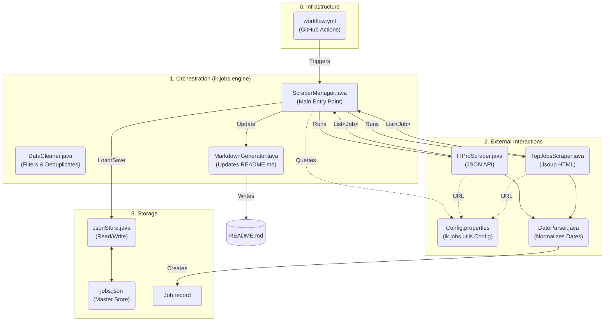

# 🇱🇰 Sri Lanka Software Engineering Jobs | 2026 Tracker [](https://t.me/SL_Software_Jobs)
Looking for software engineering jobs in Sri Lanka? This tracker updates daily with intern, junior, and senior IT roles across Colombo and beyond
Automated Software Engineering Job Tracker for Sri Lanka. Scrapes and categorizes Intern, Associate, and SE roles daily using Java (Jsoup) and GitHub Actions.

> [!TIP]
> **Help keep this project alive!** If this tool helped you find a lead today, please [**Star ⭐ the repo**](https://github.com/Senadeera-NK/sri-lanka-software-jobs). It’s how I measure the impact on our dev community! 🇱🇰

> [!IMPORTANT]
> **Automatic Staleness Purge:** The engine automatically removes listings older than **14 days**, ensuring the feed stays relevant and high-signal.

> **Live Analytics & Daily Software Job Tracker for Sri Lanka**

[📊 View Live Dashboard](https://sri-lanka-software-jobs.vercel.app/)

 
*Click the link above to see real-time trends, seniority distribution, and top hiring companies.*

## 📊 Current Job Openings
> 🟢 **Last Updated:** October 1,5:16 PM (Just now)  | **Total Jobs Found:** 146

### 🎓 Internships & Trainees  (38)

| Title | Company | Level  | Posted | Source |
| :--- | :--- | :--- | :--- | :--- |
| [QA Intern](https://itpro.lk/job/15315/qa-intern-at-dartcodes-pvt-ltd/) | DartCodes (PVT) LTD | Intern | 3&nbsp;hours&nbsp;ago | ITPro.lk |
| [Intern Software Engineer](https://itpro.lk/job/15314/intern-software-engineer-at-dartcodes-pvt-ltd/) | DartCodes (PVT) LTD | Intern | 3&nbsp;hours&nbsp;ago | ITPro.lk |
| [Intern - Cyber - Digital Trust & Privacy (5)](https://www.topjobs.lk/employer/JobAdvertismentServlet?ac=0000000311&jc=0001554663&ec=0000000410) | Deloitte | Intern | 17&nbsp;hours&nbsp;ago | TopJobs.lk |
| [Full-stack Developer Intern](https://itpro.lk/job/15309/fullstack-developer-intern-at-kaishi-innovations/) | Kaishi Innovations | Intern | 17&nbsp;hours&nbsp;ago | ITPro.lk |
| [Intern - Fullstack Development](https://www.topjobs.lk/employer/JobAdvertismentServlet?ac=0000000484&jc=0001554289&ec=0000000651) | Epic Lanka (Pvt) Ltd | Intern | Yesterday | TopJobs.lk |
| [QA Intern](https://itpro.lk/job/15296/qa-intern-at-beetlecode/) | BeetleCode | Intern | Yesterday | ITPro.lk |
| [Software Engineer — Intern / Associate](https://itpro.lk/job/15294/software-engineer-intern-associate-at-zetta-b-pvt-ltd/) | Zetta B (Pvt) Ltd | Intern | 2&nbsp;days&nbsp;ago | ITPro.lk |
| [QA Engineer — Intern / Associate](https://itpro.lk/job/15293/qa-engineer-intern-associate-at-zetta-b-pvt-ltd/) | Zetta B (Pvt) Ltd | Intern | 2&nbsp;days&nbsp;ago | ITPro.lk |
| [Software Engineer Intern](https://itpro.lk/job/15267/software-engineer-intern-at-apptron-solutions/) | Apptron Solutions | Intern | 3&nbsp;days&nbsp;ago | ITPro.lk |
| [Software Engineering - Internship, Python](https://itpro.lk/job/14131/software-engineering-internship-python-at-vijins-lanka/) | Vijins Lanka | Intern | 4&nbsp;days&nbsp;ago | ITPro.lk |
| [Intern QA Engineer (Paid)](https://itpro.lk/job/13422/intern-qa-engineer-paid-at-nippon-it-and-educational-solution-nites/) | Nippon IT and Educational Solution (NITES) | Intern | 5&nbsp;days&nbsp;ago | ITPro.lk |
| [Intern – QA Engineer](https://itpro.lk/job/15256/intern-qa-engineer-at-bistec-global-services/) | BISTEC Global Services | Intern | 6&nbsp;days&nbsp;ago | ITPro.lk |
| [QA Engineer Intern](https://itpro.lk/job/13214/qa-engineer-intern-at-perpova-developers/) | Perpova Developers | Intern | 6&nbsp;days&nbsp;ago | ITPro.lk |
| [QA Engineer Intern](https://itpro.lk/job/15254/qa-engineer-intern-at-futurix-technologies/) | Futurix Technologies | Intern | 7&nbsp;days&nbsp;ago | ITPro.lk |
| [QA Automation Intern](https://www.topjobs.lk/employer/JobAdvertismentServlet?ac=DEFZZZ&jc=0001552052&ec=DEFZZZ) | Fortunaglobal (Pvt) Limited | Intern | 7&nbsp;days&nbsp;ago | TopJobs.lk |
| [Quality Assurance And Software Tester Intern](https://itpro.lk/job/12206/quality-assurance-and-software-tester-intern-at-neo-solution/) | Neo Solution | Intern | 8&nbsp;days&nbsp;ago | ITPro.lk |
| [Intern - QA (1)](https://www.topjobs.lk/employer/JobAdvertismentServlet?ac=0000000015&jc=0001551655&ec=0000000015) | Delmege Group | Intern | 8&nbsp;days&nbsp;ago | TopJobs.lk |
| [Intern - Software Quality Assurance Engineer (1)](https://www.topjobs.lk/employer/JobAdvertismentServlet?ac=0000000492&jc=0001551595&ec=0000000661) | DirectFN | Intern | 8&nbsp;days&nbsp;ago | TopJobs.lk |
| [Quality Assurance Internship](https://itpro.lk/job/15217/quality-assurance-internship-at-durowave-pvt-ltd/) | Durowave (Pvt) Ltd | Intern | 9&nbsp;days&nbsp;ago | ITPro.lk |
| [Web Developer Intern](https://itpro.lk/job/15216/web-developer-intern-at-durowave-pvt-ltd/) | Durowave (Pvt) Ltd | Intern | 9&nbsp;days&nbsp;ago | ITPro.lk |
| [Quality Assurance - Intern](https://itpro.lk/job/15213/quality-assurance-intern-at-detech/) | Detech | Intern | 9&nbsp;days&nbsp;ago | ITPro.lk |
| [Software Engineering - Intern](https://rooster.jobs/jobs/519633) | Prosper Global Education | Intern | 9&nbsp;days&nbsp;ago | Rooster.jobs |
| [Software Engineering - Intern](https://itpro.lk/job/15202/software-engineering-intern-at-everestx-technology/) | EverestX technology | Intern | 9&nbsp;days&nbsp;ago | ITPro.lk |
| [Software Engineering - Intern](https://itpro.lk/job/15202/software-engineering-intern-at-everestx-technologies/) | EverestX Technologies | Intern | 9&nbsp;days&nbsp;ago | ITPro.lk |
| [React Js \| QA \| System Intern \| BO Intern](https://www.topjobs.lk/employer/JobAdvertismentServlet?ac=DEFZZZ&jc=0001545762&ec=DEFZZZ) | Capsicum Labs | Intern | 9&nbsp;days&nbsp;ago | TopJobs.lk |
| [QA Intern](https://itpro.lk/job/15182/qa-intern-at-efutures/) | EFutures | Intern | 10&nbsp;days&nbsp;ago | ITPro.lk |
| [Quality Assurance Internship](https://itpro.lk/job/15175/quality-assurance-internship-at-portal-pvt-ltd/) | Portal (PVT) LTD | Intern | 11&nbsp;days&nbsp;ago | ITPro.lk |
| [Quality Assurance - Intern](https://itpro.lk/job/15173/quality-assurance-intern-at-qdesk-ai-pvt-ltd/) | Qdesk AI Pvt Ltd | Intern | 12&nbsp;days&nbsp;ago | ITPro.lk |
| [Software Engineering Intern](https://itpro.lk/job/15172/software-engineering-intern-at-ceymplon-pvt-ltd/) | Ceymplon (Pvt) Ltd | Intern | 12&nbsp;days&nbsp;ago | ITPro.lk |
| [QA Engineer Intern](https://itpro.lk/job/15156/qa-engineer-intern-at-kyranzit-pvt-ltd/) | KyranzIT Pvt Ltd | Intern | 13&nbsp;days&nbsp;ago | ITPro.lk |
| [Software Engineering - Intern](https://www.topjobs.lk/employer/JobAdvertismentServlet?ac=DEFZZZ&jc=0001550305&ec=DEFZZZ) | Gunda Power (Private) Limited | Intern | 13&nbsp;days&nbsp;ago | TopJobs.lk |
| [Software Engineering Internship](https://itpro.lk/job/15152/software-engineering-internship-at-neonlabz/) | NeonLabz | Intern | 13&nbsp;days&nbsp;ago | ITPro.lk |
| [Intern – Quality Assurance (QA)](https://itpro.lk/job/15148/intern-quality-assurance-qa-at-olee-ai-llc/) | Olee AI LLC | Intern | 13&nbsp;days&nbsp;ago | ITPro.lk |
| [Intern Software Engineer](https://itpro.lk/job/15140/intern-software-engineer-at-codimite/) | Codimite | Intern | 13&nbsp;days&nbsp;ago | ITPro.lk |
| [Quality Assurance (QA) Intern](https://itpro.lk/job/15135/quality-assurance-qa-intern-at-ranga-technologies/) | Ranga Technologies | Intern | 14&nbsp;days&nbsp;ago | ITPro.lk |
| [Intern - Mobile Development](https://www.topjobs.lk/employer/JobAdvertismentServlet?ac=0000000484&jc=0001549285&ec=0000000651) | Epic Lanka (Pvt) Ltd | Intern | 14&nbsp;days&nbsp;ago | TopJobs.lk |
| [QA Intern](https://itpro.lk/job/15125/qa-intern-at-nodezs/) | NodeZS | Intern | 14&nbsp;days&nbsp;ago | ITPro.lk |
| [Intern Software Engineer](https://itpro.lk/job/15124/intern-software-engineer-at-chiox-software-solution-llc/) | ChiOX Software Solution LLC | Intern | 14&nbsp;days&nbsp;ago | ITPro.lk |

---

### 💻 Associate & Junior/SE Roles  (73)

| Title | Company | Level  | Posted | Source |
| :--- | :--- | :--- | :--- | :--- |
| [Junior Software Engineer](https://itpro.lk/job/15313/junior-software-engineer-at-tryu-global/) | TryU Global | Junior/SE | 5&nbsp;hours&nbsp;ago | ITPro.lk |
| [Solution Engineer / Infrastructure Automation and AI (1)](https://www.topjobs.lk/employer/JobAdvertismentServlet?ac=0000000375&jc=0001554907&ec=0000000492) | Jobfactory | Junior/SE | 17&nbsp;hours&nbsp;ago | TopJobs.lk |
| [Quality Assurance Officer](https://www.topjobs.lk/employer/JobAdvertismentServlet?ac=DEFZZZ&jc=0001551628&ec=DEFZZZ) | AccSoft Solutions (Pvt) Ltd | Junior/SE | 17&nbsp;hours&nbsp;ago | TopJobs.lk |
| [Software Engineer](https://www.topjobs.lk/employer/JobAdvertismentServlet?ac=DEFZZZ&jc=0001554721&ec=DEFZZZ) | MindOx Techno Pte Ltd | Junior/SE | 17&nbsp;hours&nbsp;ago | TopJobs.lk |
| [Software Engineer (Devops)](https://www.topjobs.lk/employer/JobAdvertismentServlet?ac=DEFZZZ&jc=0001554596&ec=DEFZZZ) | Sri Lanka Insurance Corporation General Ltd | Junior/SE | 17&nbsp;hours&nbsp;ago | TopJobs.lk |
| [Data Engineer (1)](https://www.topjobs.lk/employer/JobAdvertismentServlet?ac=0000000038&jc=0001554595&ec=0000000038) | Hemas Holdings PLC | Junior/SE | 17&nbsp;hours&nbsp;ago | TopJobs.lk |
| [IT Developer](https://www.topjobs.lk/employer/JobAdvertismentServlet?ac=DEFZZZ&jc=0001554528&ec=DEFZZZ) | Elisha Clothing (Pvt) Ltd | Junior/SE | 17&nbsp;hours&nbsp;ago | TopJobs.lk |
| [Associate Software Engineer - Full Stack](https://itpro.lk/job/15306/associate-software-engineer-full-stack-at-veyrion/) | Veyrion | Associate | 19&nbsp;hours&nbsp;ago | ITPro.lk |
| [SQL Database Administrator (1)](https://www.topjobs.lk/employer/JobAdvertismentServlet?ac=0000000271&jc=0001533299&ec=0000000350) | CMS (Pvt) Ltd | Junior/SE | Yesterday | TopJobs.lk |
| [Data Platform Engineer (1)](https://www.topjobs.lk/employer/JobAdvertismentServlet?ac=0000000271&jc=0001533297&ec=0000000350) | CMS (Pvt) Ltd | Junior/SE | Yesterday | TopJobs.lk |
| [Information Security Analyst (1)](https://www.topjobs.lk/employer/JobAdvertismentServlet?ac=0000000271&jc=0001532706&ec=0000000350) | CMS (Pvt) Ltd | Junior/SE | Yesterday | TopJobs.lk |
| [Information Security Engineer (1)](https://www.topjobs.lk/employer/JobAdvertismentServlet?ac=0000000271&jc=0001539697&ec=0000000350) | CMS (Pvt) Ltd | Junior/SE | Yesterday | TopJobs.lk |
| [Database Administrator](https://www.topjobs.lk/employer/JobAdvertismentServlet?ac=DEFZZZ&jc=0001554362&ec=DEFZZZ) | itechro (Pvt) Limited | Junior/SE | Yesterday | TopJobs.lk |
| [Software Quality Assurance Executive (On Contract)](https://www.topjobs.lk/employer/JobAdvertismentServlet?ac=DEFZZZ&jc=0001554311&ec=DEFZZZ) | Central Bank of Sri Lanka | Junior/SE | Yesterday | TopJobs.lk |
| [Software Engineering Executive - Full Stack (on Contract)](https://www.topjobs.lk/employer/JobAdvertismentServlet?ac=DEFZZZ&jc=0001554308&ec=DEFZZZ) | Central Bank of Sri Lanka | Junior/SE | Yesterday | TopJobs.lk |
| [Junior Software Engineer](https://www.topjobs.lk/employer/JobAdvertismentServlet?ac=DEFZZZ&jc=0001554144&ec=DEFZZZ) | ESOFT Technologies Pvt Ltd | Junior/SE | Yesterday | TopJobs.lk |
| [Quality Engineer (Automation)](https://itpro.lk/job/14441/quality-engineer-automation-at-verdentra/) | Verdentra | Junior/SE | 2&nbsp;days&nbsp;ago | ITPro.lk |
| [Associate Business Analyst & Quality Assurance](https://www.topjobs.lk/employer/JobAdvertismentServlet?ac=DEFZZZ&jc=0001553982&ec=DEFZZZ) | Legacy Health (Pvt) Ltd | Associate | 2&nbsp;days&nbsp;ago | TopJobs.lk |
| [Backend Software Engineer](https://www.topjobs.lk/employer/JobAdvertismentServlet?ac=DEFZZZ&jc=0001553941&ec=DEFZZZ) | Hexacorp SL (Private) Limited | Junior/SE | 2&nbsp;days&nbsp;ago | TopJobs.lk |
| [Frontend Software Engineer](https://www.topjobs.lk/employer/JobAdvertismentServlet?ac=DEFZZZ&jc=0001553931&ec=DEFZZZ) | Hexacorp SL (Private) Limited | Junior/SE | 2&nbsp;days&nbsp;ago | TopJobs.lk |
| [Analyst/Associate Analyst - Cyber : Digital Trust & Privacy (5)](https://www.topjobs.lk/employer/JobAdvertismentServlet?ac=0000000311&jc=0001553704&ec=0000000410) | Deloitte | Associate | 2&nbsp;days&nbsp;ago | TopJobs.lk |
| [Test Automation Architect](https://www.topjobs.lk/employer/JobAdvertismentServlet?ac=DEFZZZ&jc=0001552040&ec=DEFZZZ) | Fortunaglobal (Pvt) Limited | Junior/SE | 2&nbsp;days&nbsp;ago | TopJobs.lk |
| [Junior Software Engineer ](https://rooster.jobs/jobs/519702) | ESOFT UNI | Junior/SE | 2&nbsp;days&nbsp;ago | Rooster.jobs |
| [Junior QA Engineer](https://rooster.jobs/jobs/519696) | Lyceum Global Holdings | Junior/SE | 2&nbsp;days&nbsp;ago | Rooster.jobs |
| [Junior QA Engineer](https://itpro.lk/job/15271/junior-qa-engineer-at-avya-technologies/) | Avya Technologies | Junior/SE | 3&nbsp;days&nbsp;ago | ITPro.lk |
| [Mobile Developer - iOS (1)](https://www.topjobs.lk/employer/JobAdvertismentServlet?ac=0000000492&jc=0001553381&ec=0000000661) | DirectFN | Junior/SE | 3&nbsp;days&nbsp;ago | TopJobs.lk |
| [Full Stack Developer (Fiji)](https://www.topjobs.lk/employer/JobAdvertismentServlet?ac=DEFZZZ&jc=0001553351&ec=DEFZZZ) | Vinod Patel Group Fiji Islands | Junior/SE | 3&nbsp;days&nbsp;ago | TopJobs.lk |
| [AI Solutions Engineer - Technical Account Management (Remote)](https://www.topjobs.lk/employer/JobAdvertismentServlet?ac=DEFZZZ&jc=0001553338&ec=DEFZZZ) | DualytiX | Junior/SE | 3&nbsp;days&nbsp;ago | TopJobs.lk |
| [Data Analyst - Immediate vacancy (1)](https://www.topjobs.lk/employer/JobAdvertismentServlet?ac=0000000146&jc=0001553209&ec=0000000178) | Nawaloka Hospitals PLC | Junior/SE | 3&nbsp;days&nbsp;ago | TopJobs.lk |
| [Full Stack Developer](https://itpro.lk/job/15259/full-stack-developer-at-kenora-pvt-ltd/) | Kenora (Pvt) Ltd | Junior/SE | 6&nbsp;days&nbsp;ago | ITPro.lk |
| [Next.js Developer](https://itpro.lk/job/15257/nextjs-developer-at-kangaro-tech/) | Kangaro Tech | Junior/SE | 6&nbsp;days&nbsp;ago | ITPro.lk |
| [Software Engineer - Full Stack (1)](https://www.topjobs.lk/employer/JobAdvertismentServlet?ac=0000000492&jc=0001552994&ec=0000000661) | DirectFN | Junior/SE | 6&nbsp;days&nbsp;ago | TopJobs.lk |
| [Software Engineer JAVA (1)](https://www.topjobs.lk/employer/JobAdvertismentServlet?ac=0000000492&jc=0001552991&ec=0000000661) | DirectFN | Junior/SE | 6&nbsp;days&nbsp;ago | TopJobs.lk |
| [Junior Devops Engineer](https://www.topjobs.lk/employer/JobAdvertismentServlet?ac=DEFZZZ&jc=0001552787&ec=DEFZZZ) | MedcubeUSA (Pvt) Ltd | Junior/SE | 6&nbsp;days&nbsp;ago | TopJobs.lk |
| [Software Engineering - Integrations](https://itpro.lk/job/15252/software-engineering-integrations-at-vs-one-world-pvt-ltd/) | VS ONE WORLD (Pvt) Ltd | Junior/SE | 7&nbsp;days&nbsp;ago | ITPro.lk |
| [IT Helpdesk Engineer - Avissawella (1)](https://www.topjobs.lk/employer/JobAdvertismentServlet?ac=0000000419&jc=0001552163&ec=0000000552) | Micronet Global Services (Pvt) Ltd | Junior/SE | 7&nbsp;days&nbsp;ago | TopJobs.lk |
| [Head of Data & AI](https://www.topjobs.lk/employer/JobAdvertismentServlet?ac=DEFZZZ&jc=0001552064&ec=DEFZZZ) | SLT Mobitel | Junior/SE | 7&nbsp;days&nbsp;ago | TopJobs.lk |
| [Data Management Executive](https://www.topjobs.lk/employer/JobAdvertismentServlet?ac=DEFZZZ&jc=0001552005&ec=DEFZZZ) | Star Garments Group (Pvt) Ltd | Junior/SE | 7&nbsp;days&nbsp;ago | TopJobs.lk |
| [Web Developer](https://www.topjobs.lk/employer/JobAdvertismentServlet?ac=DEFZZZ&jc=0001551943&ec=DEFZZZ) | The Permalinks Limited | Junior/SE | 7&nbsp;days&nbsp;ago | TopJobs.lk |
| [QA Engineer](https://itpro.lk/job/15235/qa-engineer-at-pulseid/) | PulseID | Junior/SE | 8&nbsp;days&nbsp;ago | ITPro.lk |
| [Quality Assurance Engineer](https://itpro.lk/job/15228/quality-assurance-engineer-at-vs-one-world-pvt-ltd/) | VS ONE WORLD (Pvt) Ltd | Junior/SE | 8&nbsp;days&nbsp;ago | ITPro.lk |
| [Junior Software Developer](https://itpro.lk/job/15225/junior-software-developer-at-ait-services-australia/) | AIT Services Australia | Junior/SE | 8&nbsp;days&nbsp;ago | ITPro.lk |
| [Associate QA Engineer](https://itpro.lk/job/14833/associate-qa-engineer-at-haulmatic-technologies/) | Haulmatic Technologies | Associate | 8&nbsp;days&nbsp;ago | ITPro.lk |
| [Full-stack Engineer - Java & React](https://www.topjobs.lk/employer/JobAdvertismentServlet?ac=0000000494&jc=0001551862&ec=0000000666) | Acentura Pvt Ltd | Junior/SE | 8&nbsp;days&nbsp;ago | TopJobs.lk |
| [Data Protection Officer](https://www.topjobs.lk/employer/JobAdvertismentServlet?ac=DEFZZZ&jc=0001551815&ec=DEFZZZ) | Abans Finance PLC | Junior/SE | 8&nbsp;days&nbsp;ago | TopJobs.lk |
| [Software Quality Assurance Engineer (1)](https://www.topjobs.lk/employer/JobAdvertismentServlet?ac=0000000492&jc=0001551661&ec=0000000661) | DirectFN | Junior/SE | 8&nbsp;days&nbsp;ago | TopJobs.lk |
| [Associate Quality Assurance Engineer](https://rooster.jobs/jobs/519643) | Ceylon Business Appliances (Pvt) Ltd | Associate | 8&nbsp;days&nbsp;ago | Rooster.jobs |
| [Associate QA Engineer](https://itpro.lk/job/15214/associate-qa-engineer-at-softvil-technologies/) | Softvil Technologies | Associate | 9&nbsp;days&nbsp;ago | ITPro.lk |
| [Quality Assurance - Associate](https://itpro.lk/job/15212/quality-assurance-associate-at-detech/) | Detech | Associate | 9&nbsp;days&nbsp;ago | ITPro.lk |
| [C / C++ Programmer-Analyst](https://itpro.lk/job/15204/c-c-programmeranalyst-at-techno-ltd/) | Techno Ltd | Junior/SE | 9&nbsp;days&nbsp;ago | ITPro.lk |
| [Quality Assurance Officer (1)](https://www.topjobs.lk/employer/JobAdvertismentServlet?ac=0000000403&jc=0001550942&ec=0000000531) | Mobizz Elite (Pvt) Ltd | Junior/SE | 9&nbsp;days&nbsp;ago | TopJobs.lk |
| [Full Stack Developer (1)](https://www.topjobs.lk/employer/JobAdvertismentServlet?ac=0000000403&jc=0001550938&ec=0000000531) | Mobizz Elite (Pvt) Ltd | Junior/SE | 9&nbsp;days&nbsp;ago | TopJobs.lk |
| [Quality Assurance Officer \| Full Stack Developer](https://www.topjobs.lk/employer/JobAdvertismentServlet?ac=DEFZZZ&jc=0001551355&ec=DEFZZZ) | Cognitio Services Private Limited | Junior/SE | 9&nbsp;days&nbsp;ago | TopJobs.lk |
| [AI + Junior Mobile App Developer - React Native](https://www.topjobs.lk/employer/JobAdvertismentServlet?ac=DEFZZZ&jc=0001545702&ec=DEFZZZ) | Nascent Group | Junior/SE | 9&nbsp;days&nbsp;ago | TopJobs.lk |
| [Quality Assurance Engineers](https://www.topjobs.lk/employer/JobAdvertismentServlet?ac=DEFZZZ&jc=0001545623&ec=DEFZZZ) | Prima Management Services (Pvt) Ltd | Junior/SE | 9&nbsp;days&nbsp;ago | TopJobs.lk |
| [PHP Developer - Laravel](https://itpro.lk/job/10750/php-developer-laravel-at-prime-one-global-pvt-ltd/) | Prime One Global PVT LTD | Junior/SE | 10&nbsp;days&nbsp;ago | ITPro.lk |
| [Junior Web Developer](https://itpro.lk/job/13507/junior-web-developer-at-prime-one-global-pvt-ltd/) | Prime One Global PVT LTD | Junior/SE | 10&nbsp;days&nbsp;ago | ITPro.lk |
| [Engineer - MLOps](https://www.topjobs.lk/employer/JobAdvertismentServlet?ac=DEFZZZ&jc=0001550512&ec=DEFZZZ) | ORYSYS Limited | Junior/SE | 10&nbsp;days&nbsp;ago | TopJobs.lk |
| [Data Analyst](https://www.topjobs.lk/employer/JobAdvertismentServlet?ac=DEFZZZ&jc=0001550692&ec=DEFZZZ) | Anationz | Junior/SE | 10&nbsp;days&nbsp;ago | TopJobs.lk |
| [Freelance - AI Specialist (50)](https://www.topjobs.lk/employer/JobAdvertismentServlet?ac=0000000148&jc=0001550679&ec=0000000180) | INNODATA LANKA (PVT) LTD | Junior/SE | 10&nbsp;days&nbsp;ago | TopJobs.lk |
| [Associate Quality Assurance Engineer](https://itpro.lk/job/15183/associate-quality-assurance-engineer-at-kangaro-tech/) | Kangaro Tech | Associate | 10&nbsp;days&nbsp;ago | ITPro.lk |
| [Software Developer](https://itpro.lk/job/15177/software-developer-at-sathuta-international-pvt-ltd/) | Sathuta International (Pvt) Ltd | Junior/SE | 11&nbsp;days&nbsp;ago | ITPro.lk |
| [Associate QA Engineer – Automation](https://itpro.lk/job/15155/associate-qa-engineer-automation-at-layoutindex/) | LAYOUTindex | Associate | 13&nbsp;days&nbsp;ago | ITPro.lk |
| [Junior C++ Developer - Full Time](https://www.topjobs.lk/employer/JobAdvertismentServlet?ac=DEFZZZ&jc=0001550004&ec=DEFZZZ) | Elsteel (Pvt) Ltd | Junior/SE | 13&nbsp;days&nbsp;ago | TopJobs.lk |
| [Full Stack Software Engineer](https://itpro.lk/job/15146/full-stack-software-engineer-at-garlic-collective/) | Garlic Collective | Junior/SE | 13&nbsp;days&nbsp;ago | ITPro.lk |
| [Junior Software Engineer](https://itpro.lk/job/15145/junior-software-engineer-at-ehealthcare-solutions-pvt-ltd/) | eHealthcare Solutions (Pvt) Ltd | Junior/SE | 13&nbsp;days&nbsp;ago | ITPro.lk |
| [.NET Full-stack Developer / Software Engineer](https://itpro.lk/job/14720/net-fullstack-developer-software-engineer-at-goodhope-asia-holdings-ltd/) | Goodhope Asia Holdings Ltd | Junior/SE | 14&nbsp;days&nbsp;ago | ITPro.lk |
| [Web Developer](https://itpro.lk/job/15132/web-developer-at-10x-creative-pvt-ltd/) | 10x Creative (Pvt) Ltd | Junior/SE | 14&nbsp;days&nbsp;ago | ITPro.lk |
| [QA Engineer](https://itpro.lk/job/15130/qa-engineer-at-itechnology-australia/) | iTechnology Australia | Junior/SE | 14&nbsp;days&nbsp;ago | ITPro.lk |
| [Data Engineer (1)](https://www.topjobs.lk/employer/JobAdvertismentServlet?ac=0000000280&jc=0001549228&ec=0000000510) | Expolanka Freight (Pvt) Ltd | Junior/SE | 14&nbsp;days&nbsp;ago | TopJobs.lk |
| [Associate QA](https://itpro.lk/job/15129/associate-qa-at-ranga-technologies/) | Ranga Technologies | Associate | 14&nbsp;days&nbsp;ago | ITPro.lk |
| [Associate Software Engineer - Next.js (Full Stack)](https://itpro.lk/job/15128/associate-software-engineer-nextjs-full-stack-at-kangaro-tech/) | Kangaro Tech | Associate | 14&nbsp;days&nbsp;ago | ITPro.lk |
| [Associate Software Engineer](https://itpro.lk/job/15123/associate-software-engineer-at-chiox-software-solution-llc/) | ChiOX Software Solution LLC | Associate | 14&nbsp;days&nbsp;ago | ITPro.lk |

---

### 🚀 Senior & Lead Roles  (35)

| Title | Company | Level  | Posted | Source |
| :--- | :--- | :--- | :--- | :--- |
| [Senior Mobile App Developer (1)](https://www.topjobs.lk/employer/JobAdvertismentServlet?ac=0000000001&jc=0001550210&ec=0000000001) | Genesiis Software Pvt Ltd | Senior | 17&nbsp;hours&nbsp;ago | TopJobs.lk |
| [Senior DevOps Engineer (1)](https://www.topjobs.lk/employer/JobAdvertismentServlet?ac=0000000001&jc=0001552257&ec=0000000001) | Genesiis Software Pvt Ltd | Senior | 17&nbsp;hours&nbsp;ago | TopJobs.lk |
| [AI-First SaaS Operations & Delivery Lead (1)](https://www.topjobs.lk/employer/JobAdvertismentServlet?ac=0000000375&jc=0001554924&ec=0000000492) | Jobfactory | Senior | 17&nbsp;hours&nbsp;ago | TopJobs.lk |
| [Senior Data Engineer](https://www.topjobs.lk/employer/JobAdvertismentServlet?ac=DEFZZZ&jc=0001554834&ec=DEFZZZ) | DHT Cement (Pvt) Ltd | Senior | 17&nbsp;hours&nbsp;ago | TopJobs.lk |
| [Senior Developer - Business Applications](https://www.topjobs.lk/employer/JobAdvertismentServlet?ac=DEFZZZ&jc=0001554733&ec=DEFZZZ) | PBA Systems Pte. Ltd | Senior | 17&nbsp;hours&nbsp;ago | TopJobs.lk |
| [Senior Data Engineer - Azure Databricks / PySpark](https://itpro.lk/job/15299/senior-data-engineer-azure-databricks-pyspark-at-efutures/) | EFutures | Senior | Yesterday | ITPro.lk |
| [Tech Lead - Java Spring Boot](https://www.topjobs.lk/employer/JobAdvertismentServlet?ac=DEFZZZ&jc=0001554376&ec=DEFZZZ) | Fortunaglobal (Pvt) Limited | Senior | Yesterday | TopJobs.lk |
| [Senior Software Engineer](https://www.topjobs.lk/employer/JobAdvertismentServlet?ac=DEFZZZ&jc=0001554368&ec=DEFZZZ) | AKH IT Solutions | Senior | Yesterday | TopJobs.lk |
| [Lead Data (MDM Architect) \| Senior BA - Data Management \| ...](https://www.topjobs.lk/employer/JobAdvertismentServlet?ac=DEFZZZ&jc=0001554347&ec=DEFZZZ) | Invenza Digital Technologies (Pvt) Ltd | Senior | Yesterday | TopJobs.lk |
| [Quality Engineering Lead](https://itpro.lk/job/15291/quality-engineering-lead-at-softvil-technologies/) | Softvil Technologies | Senior | 2&nbsp;days&nbsp;ago | ITPro.lk |
| [Senior Technical Lead – Full Stack & AI](https://itpro.lk/job/15289/senior-technical-lead-full-stack-ai-at-dxdy/) | dxdy | Senior | 2&nbsp;days&nbsp;ago | ITPro.lk |
| [Senior Automation Engineer](https://itpro.lk/job/15281/senior-automation-engineer-at-syntrad-labs-private-limited/) | Syntrad Labs (Private) Limited | Senior | 2&nbsp;days&nbsp;ago | ITPro.lk |
| [Senior Software Developer-Colombo (1)](https://www.topjobs.lk/employer/JobAdvertismentServlet?ac=0000000385&jc=0001554045&ec=0000000505) | Konnect Net Pvt Ltd | Senior | 2&nbsp;days&nbsp;ago | TopJobs.lk |
| [Senior Full Stack AI Engineer (India / Remote)](https://rooster.jobs/jobs/519693) | Nextjob | Senior | 3&nbsp;days&nbsp;ago | Rooster.jobs |
| [Senior Developer – Node.js, AWS Cloud & Serverless](https://itpro.lk/job/15276/senior-developer-nodejs-aws-cloud-serverless-at-hatchyard/) | Hatchyard | Senior | 3&nbsp;days&nbsp;ago | ITPro.lk |
| [Senior Web Developer](https://itpro.lk/job/15270/senior-web-developer-at-beespoint-pvt-ltd/) | BeesPoint (Pvt) Ltd | Senior | 3&nbsp;days&nbsp;ago | ITPro.lk |
| [Senior/Lead Software Engineer](https://itpro.lk/job/15260/seniorlead-software-engineer-at-xitricon/) | Xitricon | Senior | 5&nbsp;days&nbsp;ago | ITPro.lk |
| [Senior Software Engineer Java Script (1)](https://www.topjobs.lk/employer/JobAdvertismentServlet?ac=0000000492&jc=0001552998&ec=0000000661) | DirectFN | Senior | 6&nbsp;days&nbsp;ago | TopJobs.lk |
| [Senior Software Engineer .NET (1)](https://www.topjobs.lk/employer/JobAdvertismentServlet?ac=0000000492&jc=0001552997&ec=0000000661) | DirectFN | Senior | 6&nbsp;days&nbsp;ago | TopJobs.lk |
| [Software Engineer - Web \| Senior Software Engineer - Web & ...](https://www.topjobs.lk/employer/JobAdvertismentServlet?ac=DEFZZZ&jc=0001547485&ec=DEFZZZ) | Afisol (Pvt) Ltd | Senior | 6&nbsp;days&nbsp;ago | TopJobs.lk |
| [QA Automation Lead](https://www.topjobs.lk/employer/JobAdvertismentServlet?ac=DEFZZZ&jc=0001552040&ec=DEFZZZ) | Fortunaglobal (Pvt) Limited | Senior | 7&nbsp;days&nbsp;ago | TopJobs.lk |
| [Technical Lead – Full-Stack Engineering](https://itpro.lk/job/15240/technical-lead-fullstack-engineering-at-vs-one-world-pvt-ltd/) | VS ONE WORLD (Pvt) Ltd | Senior | 7&nbsp;days&nbsp;ago | ITPro.lk |
| [Quality Engineering Lead](https://itpro.lk/job/15230/quality-engineering-lead-at-vs-one-world-pvt-ltd/) | VS ONE WORLD (Pvt) Ltd | Senior | 8&nbsp;days&nbsp;ago | ITPro.lk |
| [Senior Quality Assurance Engineer](https://itpro.lk/job/15229/senior-quality-assurance-engineer-at-vs-one-world-pvt-ltd/) | VS ONE WORLD (Pvt) Ltd | Senior | 8&nbsp;days&nbsp;ago | ITPro.lk |
| [Senior Boomi Integration Developer - REF8902 (1)](https://www.topjobs.lk/employer/JobAdvertismentServlet?ac=0000000176&jc=0001551898&ec=0000000211) | Creative Software | Senior | 8&nbsp;days&nbsp;ago | TopJobs.lk |
| [Senior Quality Assurance Engineer (1)](https://www.topjobs.lk/employer/JobAdvertismentServlet?ac=0000000492&jc=0001551662&ec=0000000661) | DirectFN | Senior | 8&nbsp;days&nbsp;ago | TopJobs.lk |
| [Senior Boomi Integration Developer - REF8902](https://rooster.jobs/jobs/519642) | Creative Software | Senior | 8&nbsp;days&nbsp;ago | Rooster.jobs |
| [Senior Full-Stack Developer](https://www.topjobs.lk/employer/JobAdvertismentServlet?ac=DEFZZZ&jc=0001551335&ec=DEFZZZ) | Stalione Lanka (Pvt) Ltd | Senior | 9&nbsp;days&nbsp;ago | TopJobs.lk |
| [Senior Backend Engineer – Node.js / NestJS](https://itpro.lk/job/15198/senior-backend-engineer-nodejs-nestjs-at-celestial-bi/) | Celestial BI | Senior | 9&nbsp;days&nbsp;ago | ITPro.lk |
| [Senior Frontend Engineer – React / Next.js](https://itpro.lk/job/15197/senior-frontend-engineer-react-nextjs-at-celestial-bi/) | Celestial BI | Senior | 9&nbsp;days&nbsp;ago | ITPro.lk |
| [Senior Software Engineer (Solutions)](https://itpro.lk/job/15191/senior-software-engineer-solutions-at-chakray-consulting/) | Chakray Consulting | Senior | 10&nbsp;days&nbsp;ago | ITPro.lk |
| [Senior Software Engineer Java](https://itpro.lk/job/15190/senior-software-engineer-java-at-directfn/) | DirectFN | Senior | 10&nbsp;days&nbsp;ago | ITPro.lk |
| [Senior Data Engineer](https://www.topjobs.lk/employer/JobAdvertismentServlet?ac=DEFZZZ&jc=0001550510&ec=DEFZZZ) | ORYSYS Limited | Senior | 10&nbsp;days&nbsp;ago | TopJobs.lk |
| [Senior Data Scientist](https://www.topjobs.lk/employer/JobAdvertismentServlet?ac=DEFZZZ&jc=0001550507&ec=DEFZZZ) | ORYSYS Limited | Senior | 10&nbsp;days&nbsp;ago | TopJobs.lk |
| [WordPress Web Developer -Lead](https://itpro.lk/job/13423/wordpress-web-developer-lead-at-kd-associates-buffalo-inc/) | KD Associates Buffalo Inc | Senior | 13&nbsp;days&nbsp;ago | ITPro.lk |

---


## 🛠️ How it Works
1. **Engine:** A Java 21 console application using **Jsoup**.
2. **Sources:** Currently scraping `ITPro.lk` and  `TopJobs`. Support for and `Rooster.jobs` is under development (Contributors welcome!)
3. **Automation:** Runs every 12 hours via **GitHub Actions**.
4. **Storage:** Updates this `README.md` and a `jobs.json` file automatically.

<details>
<summary><b>📐 View High-Level Architecture Diagram</b></summary>
    

```mermaid
graph TD
    %% Main Orchestration Class
    subgraph Engine ["1. Orchestration (lk.jobs.engine)"]
        ScraperManager["ScraperManager.java<br/>(Main Entry Point)"]
        Cleaner("DataCleaner.java<br/>(Filters & Deduplicates)")
        Markdown("MarkdownGenerator.java<br/>(Updates README.md)")
    end

    %% External Interactions / Data Sources
    subgraph Scrapers ["2. External Interactions"]
        Config("Config.properties<br/>(lk.jobs.utils.Config)")
        ITPro("ITProScraper.java<br/>(JSON API)")
        TopJobs("TopJobsScraper.java<br/>(Jsoup HTML)")
        DParser("DateParser.java<br/>(Normalizes Dates)")
    end

    %% Data Flow & Persistence
    subgraph Storage ["3. Storage"]
        Json("jobs.json<br/>(Master Store)")
        JsonStore("JsonStore.java<br/>(Read/Write)")
        JobModel["Job.record"]
    end

    %% Workflow Orchestration
    subgraph Infrastructure ["0. Infrastructure"]
        WF("workflow.yml<br/>(GitHub Actions)")
    end

    %% Connective Flow
    WF -- "Triggers" --> ScraperManager
    ScraperManager -. "Queries" .-> Config
    ITPro -. "URL" .-> Config
    TopJobs -. "URL" .-> Config
    
    ScraperManager -- "Runs" --> ITPro
    ScraperManager -- "Runs" --> TopJobs
    
    ITPro --> DParser
    TopJobs --> DParser
    DParser -- "Creates" --> JobModel
    
    ITPro -- "List&lt;Job&gt;" --> ScraperManager
    TopJobs -- "List&lt;Job&gt;" --> ScraperManager

    ScraperManager -- "Load/Save" --> JsonStore
    JsonStore <--> Json
    
    ScraperManager -- "Update" --> Markdown
    Markdown -- "Writes" --> README[(README.md)]
```

</details>

<details>
<summary><b>📂 View Project Structure</b></summary>

```text
src/main/java/lk/jobs/
├── engine/           # Logic for sorting, cleaning, and README updates
├── model/            # Data models (Job Record)
├── scrapers/         # Individual site scrapers
└── utils/            # JSON and Date parsing utilities
```
</details>

## 🚀 Usage
If you want to run the scraper locally:
1. Clone the repo.
2. Ensure you have **JDK 21** and **Maven** installed.
3. Run: mvn clean compile exec:java -Dexec.mainClass="lk.jobs.engine.ScraperManager"

## 🤝 Contributing
Contributions are what make the open-source community such an amazing place to learn, inspire, and create.
Any contributions you make are **greatly appreciated**.

* **Found a bug?** Open an [Issue](https://github.com/Senadeera-NK/sl-software-engineering-jobs/issues).
* **Want to add a new site?** Check out our [Contributing Guidelines](CONTRIBUTING.md) to see how to implement a new scraper.
* **Missing a job?** Feel free to submit a Pull Request to manually update the table!
