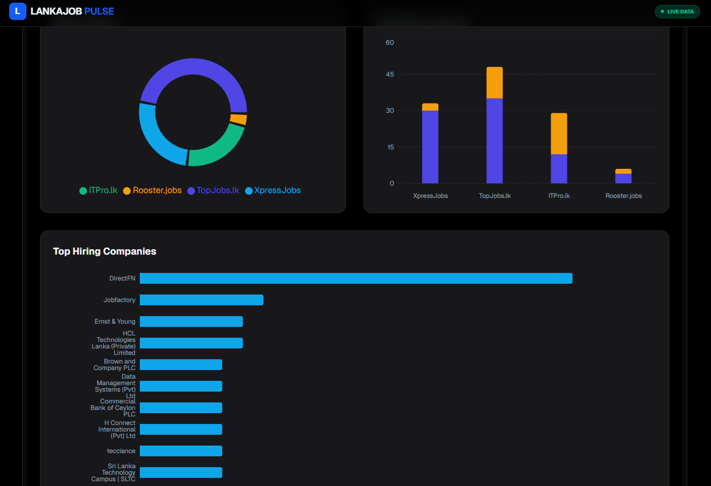
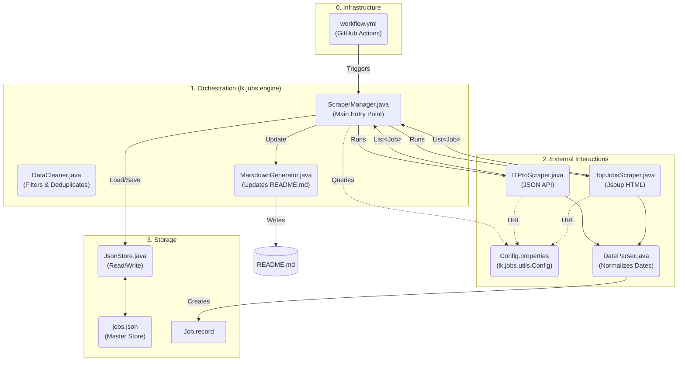

# 🇱🇰 Sri Lanka Software Engineering Jobs | 2026 Tracker [](https://t.me/SL_Software_Jobs)
Looking for software engineering jobs in Sri Lanka? This tracker updates daily with intern, junior, and senior IT roles across Colombo and beyond
Automated Software Engineering Job Tracker for Sri Lanka. Scrapes and categorizes Intern, Associate, and SE roles daily using Java (Jsoup) and GitHub Actions.

> [!TIP]
> **Help keep this project alive!** If this tool helped you find a lead today, please [**Star ⭐ the repo**](https://github.com/Senadeera-NK/sri-lanka-software-jobs). It’s how I measure the impact on our dev community! 🇱🇰

> [!IMPORTANT]
> **Automatic Staleness Purge:** The engine automatically removes listings older than **14 days**, ensuring the feed stays relevant and high-signal.

> **Live Analytics & Daily Software Job Tracker for Sri Lanka**

[📊 View Live Dashboard](https://sri-lanka-software-jobs.vercel.app/)

 
*Click the link above to see real-time trends, seniority distribution, and top hiring companies.*

## 📊 Current Job Openings
> 🟢 **Last Updated:** October 8,5:42 PM (Just now)  | **Total Jobs Found:** 147

### 🎓 Internships & Trainees  (38)

| Title | Company | Level  | Posted | Source |
| :--- | :--- | :--- | :--- | :--- |
| [Intern Software Engineer](https://itpro.lk/job/15407/intern-software-engineer-at-residue-solutions/) | Residue Solutions | Intern | 37&nbsp;mins&nbsp;ago | ITPro.lk |
| [Software Engineering Intern](https://www.topjobs.lk/employer/JobAdvertismentServlet?ac=DEFZZZ&jc=0001557540&ec=DEFZZZ) | Ravigno (Pvt) Ltd | Intern | 17&nbsp;hours&nbsp;ago | TopJobs.lk |
| [Web Developer Intern](https://www.topjobs.lk/employer/JobAdvertismentServlet?ac=DEFZZZ&jc=0001557216&ec=DEFZZZ) | Snow Soft (Pvt) Ltd | Intern | 17&nbsp;hours&nbsp;ago | TopJobs.lk |
| [Quality Assurance -- Intern](https://itpro.lk/job/15398/quality-assurance-intern-at-qdesk-ai-pvt-ltd/) | Qdesk AI Pvt Ltd | Intern | 20&nbsp;hours&nbsp;ago | ITPro.lk |
| [Intern - Quality Assurance](https://itpro.lk/job/15396/intern-quality-assurance-at-avenir-it-pvt-ltd/) | Avenir IT (Pvt) Ltd | Intern | Yesterday | ITPro.lk |
| [Intern - Workflow and Process Automation (1)](https://www.topjobs.lk/employer/JobAdvertismentServlet?ac=0000000015&jc=0001556845&ec=0000000015) | Delmege Group | Intern | Yesterday | TopJobs.lk |
| [Intern - Software Development and Integration (1)](https://www.topjobs.lk/employer/JobAdvertismentServlet?ac=0000000015&jc=0001556836&ec=0000000015) | Delmege Group | Intern | Yesterday | TopJobs.lk |
| [Intern - AI, Data and Innovation (1)](https://www.topjobs.lk/employer/JobAdvertismentServlet?ac=0000000015&jc=0001556828&ec=0000000015) | Delmege Group | Intern | Yesterday | TopJobs.lk |
| [. Intern Full Stack Engineer (.NET & Angular)](https://www.topjobs.lk/employer/JobAdvertismentServlet?ac=DEFZZZ&jc=0001557051&ec=DEFZZZ) | Med Cube USA | Intern | Yesterday | TopJobs.lk |
| [QA Engineering Internship](https://itpro.lk/job/15372/qa-engineering-internship-at-tx-solutions-pvt-ltd/) | TX Solutions Pvt Ltd | Intern | 2&nbsp;days&nbsp;ago | ITPro.lk |
| [Engineering Intern](https://itpro.lk/job/15364/engineering-intern-at-verdentra/) | Verdentra | Intern | 3&nbsp;days&nbsp;ago | ITPro.lk |
| [Software Engineering Intern](https://itpro.lk/job/15358/software-engineering-intern-at-geno3/) | GenO3 | Intern | 3&nbsp;days&nbsp;ago | ITPro.lk |
| [Quality Assurance – Intern](https://itpro.lk/job/15352/quality-assurance-intern-at-silverline-it/) | Silverline IT | Intern | 3&nbsp;days&nbsp;ago | ITPro.lk |
| [Software Engineer Internship (Remote)](https://www.topjobs.lk/employer/JobAdvertismentServlet?ac=DEFZZZ&jc=0001555753&ec=DEFZZZ) | Xaventra | Intern | 3&nbsp;days&nbsp;ago | TopJobs.lk |
| [WordPress Development Intern](https://itpro.lk/job/15345/wordpress-development-intern-at-neonlabz-pvt-ltd/) | NeonLabz (Pvt) Ltd | Intern | 4&nbsp;days&nbsp;ago | ITPro.lk |
| [Software Developer Intern](https://itpro.lk/job/15344/software-developer-intern-at-scriptforge-solutions/) | ScriptForge Solutions | Intern | 4&nbsp;days&nbsp;ago | ITPro.lk |
| [Quality Assurance Internship](https://itpro.lk/job/15340/quality-assurance-internship-at-kangaro-tech/) | Kangaro Tech | Intern | 5&nbsp;days&nbsp;ago | ITPro.lk |
| [Intern QA Engineer](https://itpro.lk/job/15336/intern-qa-engineer-at-theiavora/) | Theiavora | Intern | 6&nbsp;days&nbsp;ago | ITPro.lk |
| [Intern - QA](https://www.topjobs.lk/employer/JobAdvertismentServlet?ac=0000000484&jc=0001555240&ec=0000000651) | Epic Lanka (Pvt) Ltd | Intern | 6&nbsp;days&nbsp;ago | TopJobs.lk |
| [Intern - Fullstack Developer](https://www.topjobs.lk/employer/JobAdvertismentServlet?ac=0000000484&jc=0001554289&ec=0000000651) | Epic Lanka (Pvt) Ltd | Intern | 6&nbsp;days&nbsp;ago | TopJobs.lk |
| [Quality Assurance Internship](https://itpro.lk/job/15327/quality-assurance-internship-at-webtezza-pvt-ltd/) | Webtezza (Pvt) Ltd | Intern | 6&nbsp;days&nbsp;ago | ITPro.lk |
| [Software Engineering Internship](https://itpro.lk/job/15326/software-engineering-internship-at-webtezza-pvt-ltd/) | Webtezza (Pvt) Ltd | Intern | 6&nbsp;days&nbsp;ago | ITPro.lk |
| [Software / AI Engineering Intern – WhatsApp AI Automation (Contract)](https://itpro.lk/job/15324/software-ai-engineering-intern-whatsapp-ai-automation-contract-at-creativex-technology-pvt-ltd/) | CreativeX Technology Pvt Ltd | Intern | 7&nbsp;days&nbsp;ago | ITPro.lk |
| [QA Intern](https://itpro.lk/job/15315/qa-intern-at-dartcodes-pvt-ltd/) | DartCodes (PVT) LTD | Intern | 7&nbsp;days&nbsp;ago | ITPro.lk |
| [Intern Software Engineer](https://itpro.lk/job/15314/intern-software-engineer-at-dartcodes-pvt-ltd/) | DartCodes (PVT) LTD | Intern | 7&nbsp;days&nbsp;ago | ITPro.lk |
| [Intern - Cyber - Digital Trust & Privacy (5)](https://www.topjobs.lk/employer/JobAdvertismentServlet?ac=0000000311&jc=0001554663&ec=0000000410) | Deloitte | Intern | 7&nbsp;days&nbsp;ago | TopJobs.lk |
| [Full-stack Developer Intern](https://itpro.lk/job/15309/fullstack-developer-intern-at-kaishi-innovations/) | Kaishi Innovations | Intern | 8&nbsp;days&nbsp;ago | ITPro.lk |
| [Intern - Fullstack Development](https://www.topjobs.lk/employer/JobAdvertismentServlet?ac=0000000484&jc=0001554289&ec=0000000651) | Epic Lanka (Pvt) Ltd | Intern | 8&nbsp;days&nbsp;ago | TopJobs.lk |
| [QA Intern](https://itpro.lk/job/15296/qa-intern-at-beetlecode/) | BeetleCode | Intern | 8&nbsp;days&nbsp;ago | ITPro.lk |
| [Software Engineer — Intern / Associate](https://itpro.lk/job/15294/software-engineer-intern-associate-at-zetta-b-pvt-ltd/) | Zetta B (Pvt) Ltd | Intern | 9&nbsp;days&nbsp;ago | ITPro.lk |
| [QA Engineer — Intern / Associate](https://itpro.lk/job/15293/qa-engineer-intern-associate-at-zetta-b-pvt-ltd/) | Zetta B (Pvt) Ltd | Intern | 9&nbsp;days&nbsp;ago | ITPro.lk |
| [Software Engineer Intern](https://itpro.lk/job/15267/software-engineer-intern-at-apptron-solutions/) | Apptron Solutions | Intern | 10&nbsp;days&nbsp;ago | ITPro.lk |
| [Software Engineering - Internship, Python](https://itpro.lk/job/14131/software-engineering-internship-python-at-vijins-lanka/) | Vijins Lanka | Intern | 11&nbsp;days&nbsp;ago | ITPro.lk |
| [Intern QA Engineer (Paid)](https://itpro.lk/job/13422/intern-qa-engineer-paid-at-nippon-it-and-educational-solution-nites/) | Nippon IT and Educational Solution (NITES) | Intern | 12&nbsp;days&nbsp;ago | ITPro.lk |
| [Intern – QA Engineer](https://itpro.lk/job/15256/intern-qa-engineer-at-bistec-global-services/) | BISTEC Global Services | Intern | 13&nbsp;days&nbsp;ago | ITPro.lk |
| [QA Engineer Intern](https://itpro.lk/job/13214/qa-engineer-intern-at-perpova-developers/) | Perpova Developers | Intern | 13&nbsp;days&nbsp;ago | ITPro.lk |
| [QA Engineer Intern](https://itpro.lk/job/15254/qa-engineer-intern-at-futurix-technologies/) | Futurix Technologies | Intern | 14&nbsp;days&nbsp;ago | ITPro.lk |
| [QA Automation Intern](https://www.topjobs.lk/employer/JobAdvertismentServlet?ac=DEFZZZ&jc=0001552052&ec=DEFZZZ) | Fortunaglobal (Pvt) Limited | Intern | 14&nbsp;days&nbsp;ago | TopJobs.lk |

---

### 💻 Associate & Junior/SE Roles  (71)

| Title | Company | Level  | Posted | Source |
| :--- | :--- | :--- | :--- | :--- |
| [Associate Technical Lead - IBM CP4BA Development & Integration](https://itpro.lk/job/15403/associate-technical-lead-ibm-cp4ba-development-integration-at-orysys-limited/) | Orysys Limited | Associate | 56&nbsp;mins&nbsp;ago | ITPro.lk |
| [Engineer - MLOps](https://www.topjobs.lk/employer/JobAdvertismentServlet?ac=DEFZZZ&jc=0001555243&ec=DEFZZZ) | ORYSYS Limited | Junior/SE | 17&nbsp;hours&nbsp;ago | TopJobs.lk |
| [Data Analyst](https://www.topjobs.lk/employer/JobAdvertismentServlet?ac=DEFZZZ&jc=0001556899&ec=DEFZZZ) | Vanguard Games Lanka (Pvt) Ltd | Junior/SE | 17&nbsp;hours&nbsp;ago | TopJobs.lk |
| [Software Engineer](https://www.topjobs.lk/employer/JobAdvertismentServlet?ac=DEFZZZ&jc=0001557538&ec=DEFZZZ) | Ravigno (Pvt) Ltd | Junior/SE | 17&nbsp;hours&nbsp;ago | TopJobs.lk |
| [Web Developer](https://www.topjobs.lk/employer/JobAdvertismentServlet?ac=DEFZZZ&jc=0001557250&ec=DEFZZZ) | ?Autogroup International (Pvt) Ltd | Junior/SE | 17&nbsp;hours&nbsp;ago | TopJobs.lk |
| [SQL Database Administrator (1)](https://www.topjobs.lk/employer/JobAdvertismentServlet?ac=0000000271&jc=0001533299&ec=0000000350) | CMS (Pvt) Ltd | Junior/SE | Yesterday | TopJobs.lk |
| [Data Platform Engineer (1)](https://www.topjobs.lk/employer/JobAdvertismentServlet?ac=0000000271&jc=0001533297&ec=0000000350) | CMS (Pvt) Ltd | Junior/SE | Yesterday | TopJobs.lk |
| [Information Security Analyst (1)](https://www.topjobs.lk/employer/JobAdvertismentServlet?ac=0000000271&jc=0001532706&ec=0000000350) | CMS (Pvt) Ltd | Junior/SE | Yesterday | TopJobs.lk |
| [Information Security Engineer (1)](https://www.topjobs.lk/employer/JobAdvertismentServlet?ac=0000000271&jc=0001539697&ec=0000000350) | CMS (Pvt) Ltd | Junior/SE | Yesterday | TopJobs.lk |
| [Database Administrator](https://www.topjobs.lk/employer/JobAdvertismentServlet?ac=DEFZZZ&jc=0001554362&ec=DEFZZZ) | itechro (Pvt) Limited | Junior/SE | Yesterday | TopJobs.lk |
| [Data & Analytics Engineer (AUS Calendar - AUS Shift) (1)](https://www.topjobs.lk/employer/JobAdvertismentServlet?ac=0000000064&jc=0001557000&ec=0000000445) | H Connect International (Pvt) Ltd | Junior/SE | Yesterday | TopJobs.lk |
| [Software Developer](https://www.topjobs.lk/employer/JobAdvertismentServlet?ac=DEFZZZ&jc=0001556961&ec=DEFZZZ) | Sathuta Builders (Pvt) Ltd | Junior/SE | Yesterday | TopJobs.lk |
| [Cyber Security & Compliance Officer](https://www.topjobs.lk/employer/JobAdvertismentServlet?ac=DEFZZZ&jc=0001556869&ec=DEFZZZ) | PBSS Group | Junior/SE | Yesterday | TopJobs.lk |
| [Junior Software Engineer (.Net)](https://www.topjobs.lk/employer/JobAdvertismentServlet?ac=DEFZZZ&jc=0001557055&ec=DEFZZZ) | Med Cube USA | Junior/SE | Yesterday | TopJobs.lk |
| [Full Stack Developer](https://itpro.lk/job/15122/full-stack-developer-at-kd-marketing-group/) | KD Marketing Group | Junior/SE | 2&nbsp;days&nbsp;ago | ITPro.lk |
| [Full Stack Developer](https://itpro.lk/job/15382/full-stack-developer-at-businessfocus360-pvt-ltd/) | Businessfocus360 Pvt Ltd | Junior/SE | 2&nbsp;days&nbsp;ago | ITPro.lk |
| [Quality Assurance Officer](https://www.topjobs.lk/employer/JobAdvertismentServlet?ac=DEFZZZ&jc=0001551628&ec=DEFZZZ) | AccSoft Solutions (Pvt) Ltd | Junior/SE | 2&nbsp;days&nbsp;ago | TopJobs.lk |
| [Junior ERP Developer](https://www.topjobs.lk/employer/JobAdvertismentServlet?ac=DEFZZZ&jc=0001556393&ec=DEFZZZ) | Ahmad Tea Limited | Junior/SE | 2&nbsp;days&nbsp;ago | TopJobs.lk |
| [Platform & Integration Engineer (AUS Calendar - AUS Shift) (1)](https://www.topjobs.lk/employer/JobAdvertismentServlet?ac=0000000064&jc=0001556261&ec=0000000445) | H Connect International (Pvt) Ltd | Junior/SE | 2&nbsp;days&nbsp;ago | TopJobs.lk |
| [Automation Engineer (AUS Calendar - AUS Shift) (1)](https://www.topjobs.lk/employer/JobAdvertismentServlet?ac=0000000064&jc=0001556243&ec=0000000445) | H Connect International (Pvt) Ltd | Junior/SE | 2&nbsp;days&nbsp;ago | TopJobs.lk |
| [Associate Data Analyst](https://www.topjobs.lk/employer/JobAdvertismentServlet?ac=DEFZZZ&jc=0001556178&ec=DEFZZZ) | Sri Lanka Telecom (Services) Ltd | Associate | 2&nbsp;days&nbsp;ago | TopJobs.lk |
| [Solution Engineer / Infrastructure Automation and AI (1)](https://www.topjobs.lk/employer/JobAdvertismentServlet?ac=0000000375&jc=0001556580&ec=0000000492) | Jobfactory | Junior/SE | 2&nbsp;days&nbsp;ago | TopJobs.lk |
| [Associate Software Engineer](https://itpro.lk/job/15357/associate-software-engineer-at-graffon-pvt-ltd/) | Graffon (Pvt) Ltd | Associate | 3&nbsp;days&nbsp;ago | ITPro.lk |
| [Associate Quality Assurance Engineer](https://itpro.lk/job/15350/associate-quality-assurance-engineer-at-earrow-pvt-ltd/) | eArrow (Pvt) LTD | Associate | 3&nbsp;days&nbsp;ago | ITPro.lk |
| [QA Engineer](https://itpro.lk/job/15349/qa-engineer-at-thenex-global/) | Thenex Global | Junior/SE | 3&nbsp;days&nbsp;ago | ITPro.lk |
| [Junior Web Developer](https://www.topjobs.lk/employer/JobAdvertismentServlet?ac=DEFZZZ&jc=0001556072&ec=DEFZZZ) | eBEYONDS (Pvt) Ltd | Junior/SE | 3&nbsp;days&nbsp;ago | TopJobs.lk |
| [Head of Software Delivery (1)](https://www.topjobs.lk/employer/JobAdvertismentServlet?ac=0000000039&jc=0001555930&ec=0000000373) | Synapsys | Junior/SE | 3&nbsp;days&nbsp;ago | TopJobs.lk |
| [Data Engineer (2 Years FTC) (1)](https://www.topjobs.lk/employer/JobAdvertismentServlet?ac=0000000160&jc=0001555670&ec=0000000192) | Michelin | Junior/SE | 5&nbsp;days&nbsp;ago | TopJobs.lk |
| [AS 400 Engineer (20)](https://www.topjobs.lk/employer/JobAdvertismentServlet?ac=0000000419&jc=0001555658&ec=0000000552) | Micronet Global Services (Pvt) Ltd | Junior/SE | 5&nbsp;days&nbsp;ago | TopJobs.lk |
| [AIX/ Linux Engineer (20)](https://www.topjobs.lk/employer/JobAdvertismentServlet?ac=0000000419&jc=0001555394&ec=0000000552) | Micronet Global Services (Pvt) Ltd | Junior/SE | 6&nbsp;days&nbsp;ago | TopJobs.lk |
| [Associate Software Engineer - Level II (Automation Engineer) (1)](https://www.topjobs.lk/employer/JobAdvertismentServlet?ac=0000000064&jc=0001555205&ec=0000000445) | H Connect International (Pvt) Ltd | Associate | 6&nbsp;days&nbsp;ago | TopJobs.lk |
| [Associate Software Engineer - Level II (Platform & Integrati...](https://www.topjobs.lk/employer/JobAdvertismentServlet?ac=0000000064&jc=0001555158&ec=0000000445) | H Connect International (Pvt) Ltd | Associate | 6&nbsp;days&nbsp;ago | TopJobs.lk |
| [Associate Software Engineer C++](https://www.topjobs.lk/employer/JobAdvertismentServlet?ac=DEFZZZ&jc=0001555114&ec=DEFZZZ) | Hitachi Digital Payment Solutions Ltd | Associate | 6&nbsp;days&nbsp;ago | TopJobs.lk |
| [AI Offensive Security Engineer](https://www.topjobs.lk/employer/JobAdvertismentServlet?ac=DEFZZZ&jc=0001555011&ec=DEFZZZ) | CryptoGen (Pvt) Ltd | Junior/SE | 6&nbsp;days&nbsp;ago | TopJobs.lk |
| [Quality Assurance Engineer \| Associate](https://www.topjobs.lk/employer/JobAdvertismentServlet?ac=DEFZZZ&jc=0001554993&ec=DEFZZZ) | ClinicTech | Associate | 6&nbsp;days&nbsp;ago | TopJobs.lk |
| [Associate Software Engineer - Level II (Data & Analytics Engineer) (1)](https://www.topjobs.lk/employer/JobAdvertismentServlet?ac=0000000064&jc=0001555222&ec=0000000445) | H Connect International (Pvt) Ltd | Associate | 6&nbsp;days&nbsp;ago | TopJobs.lk |
| [Middleware / Platform Engineer](https://itpro.lk/job/15325/middleware-platform-engineer-at-jit-resourcing-consultancy-services/) | JIT Resourcing & Consultancy Services | Junior/SE | 6&nbsp;days&nbsp;ago | ITPro.lk |
| [Quality Assurance Engineer](https://itpro.lk/job/13979/quality-assurance-engineer-at-orysys-limited/) | Orysys Limited | Junior/SE | 7&nbsp;days&nbsp;ago | ITPro.lk |
| [Software Engineer](https://www.topjobs.lk/employer/JobAdvertismentServlet?ac=DEFZZZ&jc=0001554721&ec=DEFZZZ) | MindOx Techno Pte Ltd | Junior/SE | 7&nbsp;days&nbsp;ago | TopJobs.lk |
| [Software Engineer (Devops)](https://www.topjobs.lk/employer/JobAdvertismentServlet?ac=DEFZZZ&jc=0001554596&ec=DEFZZZ) | Sri Lanka Insurance Corporation General Ltd | Junior/SE | 7&nbsp;days&nbsp;ago | TopJobs.lk |
| [Data Engineer (1)](https://www.topjobs.lk/employer/JobAdvertismentServlet?ac=0000000038&jc=0001554595&ec=0000000038) | Hemas Holdings PLC | Junior/SE | 7&nbsp;days&nbsp;ago | TopJobs.lk |
| [IT Developer](https://www.topjobs.lk/employer/JobAdvertismentServlet?ac=DEFZZZ&jc=0001554528&ec=DEFZZZ) | Elisha Clothing (Pvt) Ltd | Junior/SE | 7&nbsp;days&nbsp;ago | TopJobs.lk |
| [System Engineer (1)](https://www.topjobs.lk/employer/JobAdvertismentServlet?ac=0000000419&jc=0001554944&ec=0000000552) | Micronet Global Services (Pvt) Ltd | Junior/SE | 7&nbsp;days&nbsp;ago | TopJobs.lk |
| [Junior Software Engineer](https://itpro.lk/job/15313/junior-software-engineer-at-tryu-global/) | TryU Global | Junior/SE | 7&nbsp;days&nbsp;ago | ITPro.lk |
| [Associate Software Engineer - Full Stack](https://itpro.lk/job/15306/associate-software-engineer-full-stack-at-veyrion/) | Veyrion | Associate | 8&nbsp;days&nbsp;ago | ITPro.lk |
| [Software Quality Assurance Executive (On Contract)](https://www.topjobs.lk/employer/JobAdvertismentServlet?ac=DEFZZZ&jc=0001554311&ec=DEFZZZ) | Central Bank of Sri Lanka | Junior/SE | 8&nbsp;days&nbsp;ago | TopJobs.lk |
| [Software Engineering Executive - Full Stack (on Contract)](https://www.topjobs.lk/employer/JobAdvertismentServlet?ac=DEFZZZ&jc=0001554308&ec=DEFZZZ) | Central Bank of Sri Lanka | Junior/SE | 8&nbsp;days&nbsp;ago | TopJobs.lk |
| [Junior Software Engineer](https://www.topjobs.lk/employer/JobAdvertismentServlet?ac=DEFZZZ&jc=0001554144&ec=DEFZZZ) | ESOFT Technologies Pvt Ltd | Junior/SE | 8&nbsp;days&nbsp;ago | TopJobs.lk |
| [Quality Engineer (Automation)](https://itpro.lk/job/14441/quality-engineer-automation-at-verdentra/) | Verdentra | Junior/SE | 9&nbsp;days&nbsp;ago | ITPro.lk |
| [Associate Business Analyst & Quality Assurance](https://www.topjobs.lk/employer/JobAdvertismentServlet?ac=DEFZZZ&jc=0001553982&ec=DEFZZZ) | Legacy Health (Pvt) Ltd | Associate | 9&nbsp;days&nbsp;ago | TopJobs.lk |
| [Backend Software Engineer](https://www.topjobs.lk/employer/JobAdvertismentServlet?ac=DEFZZZ&jc=0001553941&ec=DEFZZZ) | Hexacorp SL (Private) Limited | Junior/SE | 9&nbsp;days&nbsp;ago | TopJobs.lk |
| [Frontend Software Engineer](https://www.topjobs.lk/employer/JobAdvertismentServlet?ac=DEFZZZ&jc=0001553931&ec=DEFZZZ) | Hexacorp SL (Private) Limited | Junior/SE | 9&nbsp;days&nbsp;ago | TopJobs.lk |
| [Analyst/Associate Analyst - Cyber : Digital Trust & Privacy (5)](https://www.topjobs.lk/employer/JobAdvertismentServlet?ac=0000000311&jc=0001553704&ec=0000000410) | Deloitte | Associate | 9&nbsp;days&nbsp;ago | TopJobs.lk |
| [Test Automation Architect](https://www.topjobs.lk/employer/JobAdvertismentServlet?ac=DEFZZZ&jc=0001552040&ec=DEFZZZ) | Fortunaglobal (Pvt) Limited | Junior/SE | 9&nbsp;days&nbsp;ago | TopJobs.lk |
| [Junior Software Engineer ](https://rooster.jobs/jobs/519702) | ESOFT UNI | Junior/SE | 9&nbsp;days&nbsp;ago | Rooster.jobs |
| [Junior QA Engineer](https://rooster.jobs/jobs/519696) | Lyceum Global Holdings | Junior/SE | 9&nbsp;days&nbsp;ago | Rooster.jobs |
| [Junior QA Engineer](https://itpro.lk/job/15271/junior-qa-engineer-at-avya-technologies/) | Avya Technologies | Junior/SE | 10&nbsp;days&nbsp;ago | ITPro.lk |
| [Mobile Developer - iOS (1)](https://www.topjobs.lk/employer/JobAdvertismentServlet?ac=0000000492&jc=0001553381&ec=0000000661) | DirectFN | Junior/SE | 10&nbsp;days&nbsp;ago | TopJobs.lk |
| [Full Stack Developer (Fiji)](https://www.topjobs.lk/employer/JobAdvertismentServlet?ac=DEFZZZ&jc=0001553351&ec=DEFZZZ) | Vinod Patel Group Fiji Islands | Junior/SE | 10&nbsp;days&nbsp;ago | TopJobs.lk |
| [AI Solutions Engineer - Technical Account Management (Remote)](https://www.topjobs.lk/employer/JobAdvertismentServlet?ac=DEFZZZ&jc=0001553338&ec=DEFZZZ) | DualytiX | Junior/SE | 10&nbsp;days&nbsp;ago | TopJobs.lk |
| [Data Analyst - Immediate vacancy (1)](https://www.topjobs.lk/employer/JobAdvertismentServlet?ac=0000000146&jc=0001553209&ec=0000000178) | Nawaloka Hospitals PLC | Junior/SE | 10&nbsp;days&nbsp;ago | TopJobs.lk |
| [Full Stack Developer](https://itpro.lk/job/15259/full-stack-developer-at-kenora-pvt-ltd/) | Kenora (Pvt) Ltd | Junior/SE | 13&nbsp;days&nbsp;ago | ITPro.lk |
| [Next.js Developer](https://itpro.lk/job/15257/nextjs-developer-at-kangaro-tech/) | Kangaro Tech | Junior/SE | 13&nbsp;days&nbsp;ago | ITPro.lk |
| [Software Engineer - Full Stack (1)](https://www.topjobs.lk/employer/JobAdvertismentServlet?ac=0000000492&jc=0001552994&ec=0000000661) | DirectFN | Junior/SE | 13&nbsp;days&nbsp;ago | TopJobs.lk |
| [Software Engineer JAVA (1)](https://www.topjobs.lk/employer/JobAdvertismentServlet?ac=0000000492&jc=0001552991&ec=0000000661) | DirectFN | Junior/SE | 13&nbsp;days&nbsp;ago | TopJobs.lk |
| [Junior Devops Engineer](https://www.topjobs.lk/employer/JobAdvertismentServlet?ac=DEFZZZ&jc=0001552787&ec=DEFZZZ) | MedcubeUSA (Pvt) Ltd | Junior/SE | 13&nbsp;days&nbsp;ago | TopJobs.lk |
| [Software Engineering - Integrations](https://itpro.lk/job/15252/software-engineering-integrations-at-vs-one-world-pvt-ltd/) | VS ONE WORLD (Pvt) Ltd | Junior/SE | 14&nbsp;days&nbsp;ago | ITPro.lk |
| [IT Helpdesk Engineer - Avissawella (1)](https://www.topjobs.lk/employer/JobAdvertismentServlet?ac=0000000419&jc=0001552163&ec=0000000552) | Micronet Global Services (Pvt) Ltd | Junior/SE | 14&nbsp;days&nbsp;ago | TopJobs.lk |
| [Head of Data & AI](https://www.topjobs.lk/employer/JobAdvertismentServlet?ac=DEFZZZ&jc=0001552064&ec=DEFZZZ) | SLT Mobitel | Junior/SE | 14&nbsp;days&nbsp;ago | TopJobs.lk |
| [Data Management Executive](https://www.topjobs.lk/employer/JobAdvertismentServlet?ac=DEFZZZ&jc=0001552005&ec=DEFZZZ) | Star Garments Group (Pvt) Ltd | Junior/SE | 14&nbsp;days&nbsp;ago | TopJobs.lk |
| [Web Developer](https://www.topjobs.lk/employer/JobAdvertismentServlet?ac=DEFZZZ&jc=0001551943&ec=DEFZZZ) | The Permalinks Limited | Junior/SE | 14&nbsp;days&nbsp;ago | TopJobs.lk |

---

### 🚀 Senior & Lead Roles  (38)

| Title | Company | Level  | Posted | Source |
| :--- | :--- | :--- | :--- | :--- |
| [Senior Software Engineer](https://itpro.lk/job/15404/senior-software-engineer-at-residue-solutions/) | Residue Solutions | Senior | 50&nbsp;mins&nbsp;ago | ITPro.lk |
| [Tech Lead - AI](https://www.topjobs.lk/employer/JobAdvertismentServlet?ac=DEFZZZ&jc=0001555245&ec=DEFZZZ) | ORYSYS Limited | Senior | 17&nbsp;hours&nbsp;ago | TopJobs.lk |
| [Tech Lead - AI Solutions](https://www.topjobs.lk/employer/JobAdvertismentServlet?ac=DEFZZZ&jc=0001555248&ec=DEFZZZ) | ORYSYS Limited | Senior | 17&nbsp;hours&nbsp;ago | TopJobs.lk |
| [Senior Data Engineer](https://www.topjobs.lk/employer/JobAdvertismentServlet?ac=DEFZZZ&jc=0001555239&ec=DEFZZZ) | ORYSYS Limited | Senior | 17&nbsp;hours&nbsp;ago | TopJobs.lk |
| [Senior Data Scientist](https://www.topjobs.lk/employer/JobAdvertismentServlet?ac=DEFZZZ&jc=0001555235&ec=DEFZZZ) | ORYSYS Limited | Senior | 17&nbsp;hours&nbsp;ago | TopJobs.lk |
| [Senior DevOps Engineer](https://www.topjobs.lk/employer/JobAdvertismentServlet?ac=DEFZZZ&jc=0001556849&ec=DEFZZZ) | Intrepid Travel | Senior | 17&nbsp;hours&nbsp;ago | TopJobs.lk |
| [Senior DevOps Engineer (1)](https://www.topjobs.lk/employer/JobAdvertismentServlet?ac=0000000001&jc=0001552257&ec=0000000001) | Genesiis Software Pvt Ltd | Senior | Yesterday | TopJobs.lk |
| [Software Engineer / Senior Software Engineer (1)](https://www.topjobs.lk/employer/JobAdvertismentServlet?ac=0000000141&jc=0001556666&ec=0000000159) | Informatics Group of Companies | Senior | Yesterday | TopJobs.lk |
| [AI-First SaaS Operations & Delivery Lead (1)](https://www.topjobs.lk/employer/JobAdvertismentServlet?ac=0000000375&jc=0001557100&ec=0000000492) | Jobfactory | Senior | Yesterday | TopJobs.lk |
| [Android Tech Lead](https://www.topjobs.lk/employer/JobAdvertismentServlet?ac=DEFZZZ&jc=0001557144&ec=DEFZZZ) | Fortunaglobal (Pvt) Limited | Senior | Yesterday | TopJobs.lk |
| [Senior QA Engineer](https://www.topjobs.lk/employer/JobAdvertismentServlet?ac=DEFZZZ&jc=0001556403&ec=DEFZZZ) | ObjectOne (Private) Ltd | Senior | 2&nbsp;days&nbsp;ago | TopJobs.lk |
| [Senior EDI Engineer (1)](https://www.topjobs.lk/employer/JobAdvertismentServlet?ac=0000000280&jc=0001556288&ec=0000000510) | Expolanka Freight (Pvt) Ltd | Senior | 2&nbsp;days&nbsp;ago | TopJobs.lk |
| [Senior Forward Deployed Engineer](https://www.topjobs.lk/employer/JobAdvertismentServlet?ac=DEFZZZ&jc=0001556161&ec=DEFZZZ) | Effectz.AI | Senior | 2&nbsp;days&nbsp;ago | TopJobs.lk |
| [Senior Software Engineer – Java / Spring Boot + React or Angular](https://itpro.lk/job/15371/senior-software-engineer-java-spring-boot-react-or-angular-at-talvin/) | Talvin | Senior | 3&nbsp;days&nbsp;ago | ITPro.lk |
| [QA Automation Lead – Selenium / Playwright](https://itpro.lk/job/15368/qa-automation-lead-selenium-playwright-at-talvin/) | Talvin | Senior | 3&nbsp;days&nbsp;ago | ITPro.lk |
| [Senior Product Engineer](https://rooster.jobs/jobs/519787) | BCONIC | Senior | 3&nbsp;days&nbsp;ago | Rooster.jobs |
| [Senior QA Engineer](https://itpro.lk/job/15355/senior-qa-engineer-at-bistec-global-services/) | BISTEC Global Services | Senior | 3&nbsp;days&nbsp;ago | ITPro.lk |
| [Senior Quality Assurance Engineer (1)](https://www.topjobs.lk/employer/JobAdvertismentServlet?ac=0000000280&jc=0001556082&ec=0000000510) | Expolanka Freight (Pvt) Ltd | Senior | 3&nbsp;days&nbsp;ago | TopJobs.lk |
| [Senior Mobile App Developer (1)](https://www.topjobs.lk/employer/JobAdvertismentServlet?ac=0000000001&jc=0001550210&ec=0000000001) | Genesiis Software Pvt Ltd | Senior | 7&nbsp;days&nbsp;ago | TopJobs.lk |
| [Senior Data Engineer](https://www.topjobs.lk/employer/JobAdvertismentServlet?ac=DEFZZZ&jc=0001554834&ec=DEFZZZ) | DHT Cement (Pvt) Ltd | Senior | 7&nbsp;days&nbsp;ago | TopJobs.lk |
| [Senior Developer - Business Applications](https://www.topjobs.lk/employer/JobAdvertismentServlet?ac=DEFZZZ&jc=0001554733&ec=DEFZZZ) | PBA Systems Pte. Ltd | Senior | 7&nbsp;days&nbsp;ago | TopJobs.lk |
| [Senior Data Engineer - Azure Databricks / PySpark](https://itpro.lk/job/15299/senior-data-engineer-azure-databricks-pyspark-at-efutures/) | EFutures | Senior | 8&nbsp;days&nbsp;ago | ITPro.lk |
| [Tech Lead - Java Spring Boot](https://www.topjobs.lk/employer/JobAdvertismentServlet?ac=DEFZZZ&jc=0001554376&ec=DEFZZZ) | Fortunaglobal (Pvt) Limited | Senior | 8&nbsp;days&nbsp;ago | TopJobs.lk |
| [Senior Software Engineer](https://www.topjobs.lk/employer/JobAdvertismentServlet?ac=DEFZZZ&jc=0001554368&ec=DEFZZZ) | AKH IT Solutions | Senior | 8&nbsp;days&nbsp;ago | TopJobs.lk |
| [Lead Data (MDM Architect) \| Senior BA - Data Management \| ...](https://www.topjobs.lk/employer/JobAdvertismentServlet?ac=DEFZZZ&jc=0001554347&ec=DEFZZZ) | Invenza Digital Technologies (Pvt) Ltd | Senior | 8&nbsp;days&nbsp;ago | TopJobs.lk |
| [Quality Engineering Lead](https://itpro.lk/job/15291/quality-engineering-lead-at-softvil-technologies/) | Softvil Technologies | Senior | 9&nbsp;days&nbsp;ago | ITPro.lk |
| [Senior Technical Lead – Full Stack & AI](https://itpro.lk/job/15289/senior-technical-lead-full-stack-ai-at-dxdy/) | dxdy | Senior | 9&nbsp;days&nbsp;ago | ITPro.lk |
| [Senior Automation Engineer](https://itpro.lk/job/15281/senior-automation-engineer-at-syntrad-labs-private-limited/) | Syntrad Labs (Private) Limited | Senior | 9&nbsp;days&nbsp;ago | ITPro.lk |
| [Senior Software Developer-Colombo (1)](https://www.topjobs.lk/employer/JobAdvertismentServlet?ac=0000000385&jc=0001554045&ec=0000000505) | Konnect Net Pvt Ltd | Senior | 9&nbsp;days&nbsp;ago | TopJobs.lk |
| [Senior Full Stack AI Engineer (India / Remote)](https://rooster.jobs/jobs/519693) | Nextjob | Senior | 10&nbsp;days&nbsp;ago | Rooster.jobs |
| [Senior Developer – Node.js, AWS Cloud & Serverless](https://itpro.lk/job/15276/senior-developer-nodejs-aws-cloud-serverless-at-hatchyard/) | Hatchyard | Senior | 10&nbsp;days&nbsp;ago | ITPro.lk |
| [Senior Web Developer](https://itpro.lk/job/15270/senior-web-developer-at-beespoint-pvt-ltd/) | BeesPoint (Pvt) Ltd | Senior | 10&nbsp;days&nbsp;ago | ITPro.lk |
| [Senior/Lead Software Engineer](https://itpro.lk/job/15260/seniorlead-software-engineer-at-xitricon/) | Xitricon | Senior | 12&nbsp;days&nbsp;ago | ITPro.lk |
| [Senior Software Engineer Java Script (1)](https://www.topjobs.lk/employer/JobAdvertismentServlet?ac=0000000492&jc=0001552998&ec=0000000661) | DirectFN | Senior | 13&nbsp;days&nbsp;ago | TopJobs.lk |
| [Senior Software Engineer .NET (1)](https://www.topjobs.lk/employer/JobAdvertismentServlet?ac=0000000492&jc=0001552997&ec=0000000661) | DirectFN | Senior | 13&nbsp;days&nbsp;ago | TopJobs.lk |
| [Software Engineer - Web \| Senior Software Engineer - Web & ...](https://www.topjobs.lk/employer/JobAdvertismentServlet?ac=DEFZZZ&jc=0001547485&ec=DEFZZZ) | Afisol (Pvt) Ltd | Senior | 13&nbsp;days&nbsp;ago | TopJobs.lk |
| [QA Automation Lead](https://www.topjobs.lk/employer/JobAdvertismentServlet?ac=DEFZZZ&jc=0001552040&ec=DEFZZZ) | Fortunaglobal (Pvt) Limited | Senior | 14&nbsp;days&nbsp;ago | TopJobs.lk |
| [Technical Lead – Full-Stack Engineering](https://itpro.lk/job/15240/technical-lead-fullstack-engineering-at-vs-one-world-pvt-ltd/) | VS ONE WORLD (Pvt) Ltd | Senior | 14&nbsp;days&nbsp;ago | ITPro.lk |

---


## 🛠️ How it Works
1. **Engine:** A Java 21 console application using **Jsoup**.
2. **Sources:** Currently scraping `ITPro.lk` and  `TopJobs`. Support for and `Rooster.jobs` is under development (Contributors welcome!)
3. **Automation:** Runs every 12 hours via **GitHub Actions**.
4. **Storage:** Updates this `README.md` and a `jobs.json` file automatically.

<details>
<summary><b>📐 View High-Level Architecture Diagram</b></summary>
    

```mermaid
graph TD
    %% Main Orchestration Class
    subgraph Engine ["1. Orchestration (lk.jobs.engine)"]
        ScraperManager["ScraperManager.java<br/>(Main Entry Point)"]
        Cleaner("DataCleaner.java<br/>(Filters & Deduplicates)")
        Markdown("MarkdownGenerator.java<br/>(Updates README.md)")
    end

    %% External Interactions / Data Sources
    subgraph Scrapers ["2. External Interactions"]
        Config("Config.properties<br/>(lk.jobs.utils.Config)")
        ITPro("ITProScraper.java<br/>(JSON API)")
        TopJobs("TopJobsScraper.java<br/>(Jsoup HTML)")
        DParser("DateParser.java<br/>(Normalizes Dates)")
    end

    %% Data Flow & Persistence
    subgraph Storage ["3. Storage"]
        Json("jobs.json<br/>(Master Store)")
        JsonStore("JsonStore.java<br/>(Read/Write)")
        JobModel["Job.record"]
    end

    %% Workflow Orchestration
    subgraph Infrastructure ["0. Infrastructure"]
        WF("workflow.yml<br/>(GitHub Actions)")
    end

    %% Connective Flow
    WF -- "Triggers" --> ScraperManager
    ScraperManager -. "Queries" .-> Config
    ITPro -. "URL" .-> Config
    TopJobs -. "URL" .-> Config
    
    ScraperManager -- "Runs" --> ITPro
    ScraperManager -- "Runs" --> TopJobs
    
    ITPro --> DParser
    TopJobs --> DParser
    DParser -- "Creates" --> JobModel
    
    ITPro -- "List&lt;Job&gt;" --> ScraperManager
    TopJobs -- "List&lt;Job&gt;" --> ScraperManager

    ScraperManager -- "Load/Save" --> JsonStore
    JsonStore <--> Json
    
    ScraperManager -- "Update" --> Markdown
    Markdown -- "Writes" --> README[(README.md)]
```

</details>

<details>
<summary><b>📂 View Project Structure</b></summary>

```text
src/main/java/lk/jobs/
├── engine/           # Logic for sorting, cleaning, and README updates
├── model/            # Data models (Job Record)
├── scrapers/         # Individual site scrapers
└── utils/            # JSON and Date parsing utilities
```
</details>

## 🚀 Usage
If you want to run the scraper locally:
1. Clone the repo.
2. Ensure you have **JDK 21** and **Maven** installed.
3. Run: mvn clean compile exec:java -Dexec.mainClass="lk.jobs.engine.ScraperManager"

## 🤝 Contributing
Contributions are what make the open-source community such an amazing place to learn, inspire, and create.
Any contributions you make are **greatly appreciated**.

* **Found a bug?** Open an [Issue](https://github.com/Senadeera-NK/sl-software-engineering-jobs/issues).
* **Want to add a new site?** Check out our [Contributing Guidelines](CONTRIBUTING.md) to see how to implement a new scraper.
* **Missing a job?** Feel free to submit a Pull Request to manually update the table!
